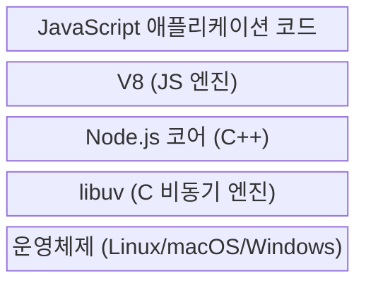
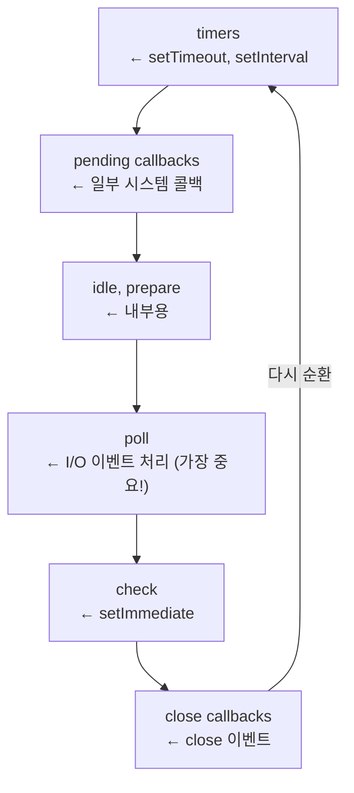
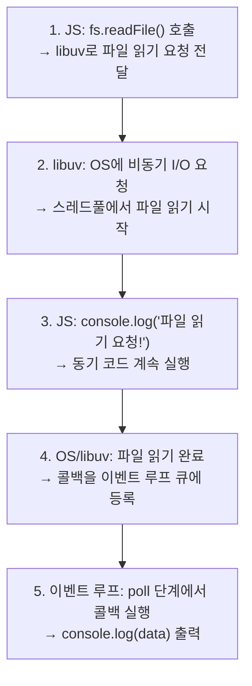
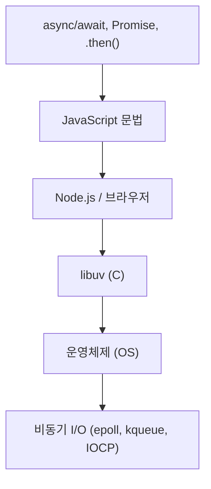

# 14. 비동기 자바스크립트 - (10시간)

## 1. 토픽 시작하기

### 01. 토픽 소개

### 왜 비동기 프로그래밍이 필요할까?

프로그램을 만들다 보면 **시간이 오래 걸리는 작업**을 처리해야 할 때가 많습니다. 예를 들어볼까요?

- **파일 다운로드**: 1GB 크기의 영화 파일을 다운로드하는 경우
- **데이터베이스 조회**: 수백만 건의 데이터 중에서 특정 정보를 검색하는 경우
- **외부 API 호출**: 날씨 정보를 제공하는 서버에 요청을 보내고 응답을 받는 경우

이런 작업들은 **즉시 완료되지 않습니다**. 몇 초, 때로는 몇 분까지도 걸릴 수 있죠.

---

### 동기 방식의 문제점

만약 프로그램이 모든 코드를 **순서대로만** 실행한다면 어떻게 될까요?

```jsx
console.log("작업 1: 시작");
// 5초가 걸리는 파일 다운로드
downloadFile("movie.mp4");
console.log("작업 2: 완료");
```

위 코드에서 파일 다운로드가 5초 걸린다면:

1. "작업 1: 시작" 출력
2. 파일 다운로드 시작 → **5초 동안 대기**
3. 다운로드 완료 후 "작업 2: 완료" 출력

**문제는 5초 동안 프로그램이 아무것도 하지 못한다는 것**입니다. 다른 작업을 처리할 수도 있었는데, 그냥 기다리기만 하는 거죠.

웹사이트로 비유하면:

- 사용자가 "프로필 사진 업로드" 버튼을 클릭
- 업로드가 완료될 때까지 **웹사이트 전체가 멈춤**
- 스크롤도 안 되고, 다른 버튼도 클릭할 수 없음

이렇게 되면 사용자 경험이 매우 나쁘겠죠?

---

### 비동기 프로그래밍이란?

**비동기(Asynchronous) 프로그래밍**은 이런 문제를 해결합니다.

> 시간이 오래 걸리는 작업은 백그라운드에서 처리하고, 그 사이에 다른 작업을 먼저 실행하는 방식
> 

```jsx
console.log("작업 1: 시작");

// 비동기로 파일 다운로드 (백그라운드에서 실행)
downloadFileAsync("movie.mp4", function () {
  console.log("다운로드 완료!");
});

console.log("작업 2: 다른 일 진행");
```

실행 결과:

```
작업 1: 시작
작업 2: 다른 일 진행
(5초 후)
다운로드 완료!
```

프로그램이 다운로드를 기다리지 않고, **다른 작업을 먼저 처리**했습니다!

---

### 실생활 비유로 이해하기

### 동기 방식 (기다리기만 함)

레스토랑에서 음식을 주문했다고 상상해봅시다:

1. 스테이크 주문 (조리 시간 30분)
2. **조리가 끝날 때까지 자리에서 가만히 앉아 기다림**
3. 스테이크가 나온 후에야 음료 주문
4. **음료가 나올 때까지 또 기다림**

→ 매우 비효율적이죠?

### 비동기 방식 (동시에 여러 일 처리)

1. 스테이크 주문 (주방에서 조리 시작)
2. **조리 중에** 음료도 주문
3. **조리 중에** 친구와 대화하고, 핸드폰도 봄
4. 스테이크가 완성되면 종업원이 알려줌
5. 음료가 준비되면 따로 알려줌

→ 시간을 효율적으로 사용!

---

### 자바스크립트와 비동기 프로그래밍

자바스크립트는 **웹 브라우저에서 동작하도록** 만들어진 언어입니다.

웹 개발에서는 다음과 같은 작업이 매우 흔합니다:

- **서버에 데이터 요청** (로그인, 게시글 불러오기 등)
- **사용자 입력 대기** (버튼 클릭, 폼 작성 등)
- **애니메이션 처리** (부드러운 화면 전환)
- **타이머 실행** (3초 후 알림 표시 등)

이 모든 작업들은 **시간이 걸리는 작업**입니다. 만약 비동기 프로그래밍이 없다면, 웹사이트는 매우 느리고 답답하게 느껴질 겁니다.

그래서 **자바스크립트는 비동기 프로그래밍을 매우 쉽게** 할 수 있도록 다양한 기능을 제공합니다.

---

### 비동기 프로그래밍의 핵심 도구

이번 챕터에서 배울 핵심 개념은 크게 **두 가지**입니다:

### 1. 콜백(Callback)

> "작업이 끝나면 이 함수를 실행해줘"
> 

```jsx
setTimeout(function () {
  console.log("3초 후 실행!");
}, 3000);
```

- 가장 기본적인 비동기 처리 방법
- 함수를 다른 함수에 전달하여 나중에 실행
- 간단하지만, 복잡해지면 "콜백 지옥"이 발생할 수 있음

### 2. Promise (프로미스)

> "이 작업은 나중에 완료될 거야. 완료되면 알려줄게."
> 

```jsx
fetch("https://api.weather.com/today").then(function (response) {
  console.log("날씨 정보:", response);
});
```

- 콜백보다 가독성이 좋고 관리하기 쉬움
- `async/await` 문법과 함께 사용하면 더욱 직관적
- 현대 자바스크립트의 표준 비동기 처리 방법

---

### React, Node.js와의 연결

비동기 프로그래밍은 모던 자바스크립트 기술의 기초입니다:

**React (리액트)**

- 데이터를 서버에서 가져올 때 (useEffect + fetch)
- 사용자 이벤트 처리 (클릭, 입력 등)

**Node.js (노드제이에스)**

- 파일 읽기/쓰기
- 데이터베이스 쿼리
- HTTP 요청 처리

이 기술들을 제대로 사용하려면, **비동기 프로그래밍을 반드시 이해해야 합니다**.

---

### 이번 챕터에서 배울 내용

1. **콜백 함수**: 비동기의 기본 개념
2. **Promise**: 현대적인 비동기 처리 방법
3. **async/await**: 가장 직관적인 비동기 코드 작성법
4. **에러 처리**: try-catch로 오류 다루기
5. **효율적인 비동기 코드**: 여러 작업을 동시에 처리하기

---

### 정리

- **비동기 프로그래밍**은 시간이 오래 걸리는 작업을 기다리는 동안 다른 일을 처리하는 방식
- 웹 개발에서는 서버 통신, 사용자 입력 대기 등에 필수적
- 자바스크립트는 **콜백**, **Promise**, **async/await**로 비동기를 처리
- React, Node.js 등 모던 기술을 사용하려면 반드시 알아야 할 개념

지금부터 하나씩 천천히 배워보겠습니다!

## 2. 콜백과 비동기 실행

### 01. #읽기자료 파라미터 vs 아규먼트

```
https://www.codeit.kr/topics/asynchronous-javascript/lessons/6177
```

### 02. 콜백(Callback)이란?

### 콜백의 정의

- **콜백(Callback)**은 다른 함수에 **인자로 전달되는 함수**를 말합니다.

간단히 말하면:

> "이 함수를 받아서, 나중에 실행해줘!"
> 

---

### 가장 기본적인 콜백 예제

```jsx
function greet() {
  console.log("안녕하세요!");
}

function farewell() {
  console.log("안녕히 가세요!");
}

function executeAction(action) {
  console.log("동작을 실행합니다...");
  action(); // 전달받은 함수를 실행
}

```

사용 방법:

```jsx
executeAction(greet);
```

실행 결과:

```
동작을 실행합니다...
안녕하세요!
```

**중요한 포인트:**

- `executeAction(greet)` ← 괄호 없이 함수 이름만 전달 (콜백으로 함수 자체를 전달)
- `executeAction(greet())` ← 이렇게 쓰면 `greet` 함수가 즉시 실행되고, 그 **반환값**이 전달됨 (콜백을 전달하려는 상황에서는 잘못된 방법!)

---

### 다른 함수로 교체 가능

```jsx
executeAction(farewell);
```

실행 결과:

```
동작을 실행합니다...
안녕히 가세요!
```

같은 `executeAction` 함수지만, 전달하는 콜백에 따라 **동작이 달라집니다**.

---

### 화살표 함수로 콜백 작성하기

함수를 미리 선언하지 않고, **그 자리에서 바로** 작성할 수 있습니다.

```jsx
executeAction(() => {
  console.log("환영합니다!");
});
```

실행 결과:

```
동작을 실행합니다...
환영합니다!
```

---

### 파라미터를 받는 콜백

콜백 함수도 **파라미터**를 받을 수 있습니다.

```jsx
function greetPerson(name) {
  console.log(`안녕하세요, ${name}님!`);
}

function farewellPerson(name) {
  console.log(`안녕히 가세요, ${name}님!`);
}

function executeAction(action, personName) {
  console.log("동작을 실행합니다...");
  action(personName); // 파라미터를 전달하며 콜백 실행
}
```

사용 방법:

```jsx
executeAction(greetPerson, "철수");
```

실행 결과:

```
동작을 실행합니다...
안녕하세요, 철수님!
```

다른 콜백으로 변경:

```jsx
executeAction(farewellPerson, "영희");
```

실행 결과:

```
동작을 실행합니다...
안녕히 가세요, 영희님!
```

---

### 화살표 함수로 파라미터 받는 콜백 작성

```jsx
executeAction(
  (name) => console.log(`환영합니다, ${name}님!`),
  "민수"
);
```

실행 결과:

```
동작을 실행합니다...
환영합니다, 민수님!
```

---

### 실생활 비유로 이해하기

콜백은 **심부름**과 비슷합니다.

### 예시 1: 택배 배송

```jsx
function deliverPackage(onDelivered) {
  console.log("택배를 배송합니다...");
  // 배송 완료 후
  onDelivered();
}

deliverPackage(() =>
  console.log("문자 메시지를 보냅니다: 배송 완료!")
);
```

- `deliverPackage`: 택배 배송을 담당하는 함수
- `onDelivered`: 배송 완료 후 실행할 동작 (콜백)
- 콜백으로 "문자 보내기", "이메일 보내기", "알림 표시하기" 등 다양한 동작을 전달할 수 있음

### 예시 2: 레스토랑 주문

```jsx
function processOrder(dishName, onComplete) {
  console.log(`${dishName} 조리를 시작합니다...`);
  // 조리 완료 후
  onComplete(dishName);
}

processOrder("스테이크", (dish) => {
  console.log(`${dish}가 완성되었습니다. 서빙합니다!`);
});
```

실행 결과:

```
스테이크 조리를 시작합니다...
스테이크가 완성되었습니다. 서빙합니다!
```

---

### 배열 메서드에서 콜백 사용하기

자바스크립트의 많은 배열 메서드가 **콜백을 사용**합니다.

### forEach 예제

```jsx
const numbers = [1, 2, 3, 4, 5];

numbers.forEach(function (num) {
  console.log(num * 2);
});
```

화살표 함수로 더 간결하게:

```jsx
numbers.forEach((num) => console.log(num * 2));
```

실행 결과:

```
2
4
6
8
10
```

### map 예제

```jsx
const numbers = [1, 2, 3, 4, 5];

const doubled = numbers.map((num) => num * 2);

console.log(doubled); // [2, 4, 6, 8, 10]
```

### filter 예제

```jsx
const numbers = [1, 2, 3, 4, 5, 6, 7, 8, 9, 10];

const evenNumbers = numbers.filter((num) => num % 2 === 0);

console.log(evenNumbers); // [2, 4, 6, 8, 10]
```

---

### 이벤트 리스너와 콜백

웹 개발에서 가장 자주 보는 콜백 예제:

```jsx
const button = document.querySelector("#myButton");

button.addEventListener("click", function () {
  console.log("버튼이 클릭되었습니다!");
});
```

화살표 함수로:

```jsx
button.addEventListener("click", () => {
  console.log("버튼이 클릭되었습니다!");
});
```

- `addEventListener`는 이벤트가 발생했을 때 **실행할 함수(콜백)**를 받습니다
- 사용자가 버튼을 클릭하면 → 콜백 함수가 실행됨

---

### setTimeout과 콜백

일정 시간 후에 실행할 코드를 콜백으로 전달:

```jsx
setTimeout(function () {
  console.log("3초가 지났습니다!");
}, 3000);
```

화살표 함수로:

```jsx
setTimeout(() => console.log("3초가 지났습니다!"), 3000);
```

---

### 콜백의 장점

### 1. 코드의 재사용성

```jsx
function processData(data, handler) {
  console.log("데이터 처리 중...");
  handler(data);
}

// 다양한 처리 방법
processData([1, 2, 3], (arr) =>
  console.log(
    "합계:",
    arr.reduce((a, b) => a + b)
  )
);

processData([1, 2, 3], (arr) =>
  console.log("개수:", arr.length)
);

processData([1, 2, 3], (arr) =>
  console.log("첫 번째 값:", arr[0])
);
```

**같은 함수**를 사용하지만, 콜백에 따라 **다른 동작** 수행!

### 2. 유연성

필요에 따라 동작을 쉽게 바꿀 수 있습니다.

```jsx
const students = ["철수", "영희", "민수", "지영"];

// 상황 1: 모든 학생에게 출석 체크
students.forEach((student) =>
  console.log(`${student}: 출석`)
);

// 상황 2: 모든 학생에게 과제 알림
students.forEach((student) =>
  console.log(`${student}님, 과제를 제출하세요.`)
);
```

### 3. 비동기 처리의 기초

콜백은 **비동기 프로그래밍**의 핵심입니다.

```jsx
// 파일을 읽은 후 실행할 동작을 콜백으로 전달 (개념 설명용 예시)
readFile("data.txt", (content) => {
  console.log("파일 내용:", content);
});
```

> 참고: 위 예시는 콜백 패턴을 설명하기 위한 개념적인 코드입니다. 실제로 파일을 읽으려면 Node.js 환경에서 fs.readFile 같은 API를 사용합니다.
> 

---

### 정리

- **콜백**은 다른 함수에 인자로 전달되는 함수
- 함수 이름만 전달 (괄호 없이)
- 화살표 함수로 간결하게 작성 가능
- 콜백 함수도 파라미터를 받을 수 있음
- 배열 메서드 (`forEach`, `map`, `filter`)에서 자주 사용
- 이벤트 처리, 타이머, 비동기 작업에 필수적

콜백은 자바스크립트에서 **매우 중요한 개념**이며, 비동기 프로그래밍의 기초가 됩니다. 다음 강의에서는 콜백이 비동기 작업에서 어떻게 활용되는지 알아보겠습니다!

### 02. #Quiz 콜백(Callback)이란? (5분)

### 문제 1

다음 코드의 실행 결과를 예측하고, 각 줄의 출력 순서를 설명하세요.

```jsx
function printNumbers(callback) {
  console.log("숫자 출력 시작");
  callback();
  console.log("숫자 출력 완료");
}

printNumbers(() => {
  console.log("1");
  console.log("2");
  console.log("3");
});
```

출력 결과는?

- 정답 및 해설
    
    정답:
    
    ```
    숫자 출력 시작
    1
    2
    3
    숫자 출력 완료
    ```
    
    해설:
    
    `printNumbers`가 호출되면 가장 먼저 "숫자 출력 시작"이 출력됩니다.
    
    그 다음 전달받은 콜백 함수가 즉시 실행되어 1, 2, 3이 순서대로 출력됩니다.
    
    콜백 실행이 끝난 후 마지막 코드인 "숫자 출력 완료"가 출력됩니다.
    

---

### 문제 2

다음 코드에서 **잘못된 부분**을 찾고, 올바르게 고치세요.

```jsx
function calculate(a, b, operation) {
  console.log("계산을 시작합니다.");
  const result = operation(a, b);
  console.log(`결과: ${result}`);
}

// 덧셈 함수
function add(x, y) {
  return x + y;
}

// 잘못된 사용법
calculate(10, 5, add());
```

무엇이 잘못되었나요? 어떻게 고쳐야 할까요?

- 정답 및 해설
    
    정답:
    
    `calculate(10, 5, add())`처럼 괄호를 붙이면 `add` 함수가 즉시 실행되어 결과값(NaN)이 전달됩니다.
    
    따라서 `operation`에 함수가 아닌 값이 들어가 TypeError가 발생합니다.
    
    해설:
    
    콜백으로 함수 자체를 전달해야 하므로 괄호 없이 전달해야 합니다.
    
    올바른 코드는 `calculate(10, 5, add)`입니다.
    

---

### 문제 3

다음 요구사항에 맞는 코드를 작성하세요.

**요구사항:**

1. `processArray`라는 함수를 만들어야 합니다.
2. 이 함수는 배열과 콜백 함수를 파라미터로 받습니다.
3. 배열의 각 요소를 콜백 함수로 처리한 결과를 새로운 배열로 반환합니다.

**예시:**

```jsx
const numbers = [1, 2, 3, 4, 5];

const doubled = processArray(numbers, (num) => num * 2);
console.log(doubled); // [2, 4, 6, 8, 10]

const squared = processArray(numbers, (num) => num ** 2);
console.log(squared); // [1, 4, 9, 16, 25]

const halved = processArray(numbers, (num) => num / 2);
console.log(halved); // [0.5, 1, 1.5, 2, 2.5]

```

함수를 작성하세요.

- 정답 및 해설
    
    정답:
    
    ```jsx
    function processArray(array, callback) {
      const result = [];
    
      for (let i = 0; i < array.length; i++) {
        const processedValue = callback(array[i]);
        result.push(processedValue);
      }
    
      return result;
    }
    ```
    
    해설:
    
    `processArray`는 배열을 순회하면서 각 요소에 콜백 함수를 적용하고, 그 결과를 새로운 배열에 담아 반환합니다. 자바스크립트의 `map()`과 동일한 동작 방식입니다.
    

### 03. #실습 forEach() 함수 만들기 (5분)

```mermaid
https://www.codeit.kr/topics/asynchronous-javascript/lessons/6179
```

- 정답 예시
    
    ```mermaid
    function forEach(array, callback) {
      for (let elt of array) {
        callback(elt);
      }
    }
    
    const words = ['JavaScript', 'Java', 'Python'];
    
    // 배열의 요소를 출력하세요. Arrow Function을 사용하세요.
    forEach(words, (word) => {
      console.log(word)
    });
    
    // 배열의 요소를 대문자로 출력하세요. function 키워드로 함수를 선언하고 콜백으로 전달하세요.
    forEach(words, function(word) {
      console.log(word.toUpperCase())
    });
    
    ```
    

### 04. 콜백과 비동기 함수

### setTimeout 함수 소개

자바스크립트에는 **일정 시간이 지난 후에 코드를 실행**하는 `setTimeout` 함수가 있습니다.

```jsx
setTimeout(() => console.log("안녕하세요!"), 3000);
```

- **첫 번째 인자**: 실행할 함수 (콜백)
- **두 번째 인자**: 지연 시간 (밀리초, 1000ms = 1초)

위 코드는 3초 후에 "안녕하세요!"를 출력합니다.

---

### setTimeout 실행 확인

```jsx
console.log("프로그램 시작");

setTimeout(() => {
  console.log("3초가 지났습니다!");
}, 3000);

console.log("프로그램 진행 중...");
```

실행 결과:

```
프로그램 시작
프로그램 진행 중...
(3초 대기)
3초가 지났습니다!
```

**코드 순서와 실행 순서가 다릅니다!**

---

### 비동기 실행의 신기한 현상

```jsx
console.log("1");

setTimeout(() => console.log("2"), 3000);

console.log("3");
```

**예상되는 출력 순서:**

코드를 보면 1 → 2 → 3 순서로 써있습니다.

**실제 출력 결과:**

```
1
3
(3초 대기)
2
```

1 → 3 → 2 순서로 출력됩니다!

**왜 이런 일이 발생할까요?**

- `setTimeout`은 **비동기 함수**이기 때문입니다
- 타이머를 시작하고 **즉시 다음 줄로 넘어갑니다**
- 3초를 기다리는 동안 다른 코드를 실행합니다

---

### 비동기(Asynchronous) 프로그래밍이란?

> 코드가 작성된 순서대로 실행되지 않고,
> 
> 
> 오래 걸리는 작업은 백그라운드에서 처리하며,
> 
> 완료되면 그때 결과를 처리하는 방식
> 

---

### 실행 흐름 상세 분석

### 비동기 방식 (실제 setTimeout 동작)

```jsx
console.log("1");
setTimeout(() => console.log("2"), 3000);
console.log("3");
```

**실행 순서:**

1. `console.log('1')` 실행 → "1" 출력
2. `setTimeout` 실행
    - **타이머 시작** (3초 카운트 시작)
    - 콜백을 "3초 후 실행 대기열"에 등록
    - **즉시 다음 줄로 이동**
3. `console.log('3')` 실행 → "3" 출력
4. (백그라운드에서 3초 경과)
5. 등록된 콜백 실행 → "2" 출력

---

### 동기 방식 (만약 setTimeout이 동기 함수였다면?)

```jsx
// 가상의 동기 버전 setTimeout (실제로는 존재하지 않음)
console.log("1");
setTimeoutSync(() => console.log("2"), 3000); // 가정
console.log("3");
```

**실행 순서:**

1. "1" 출력
2. 3초 동안 **그 자리에서 대기**
3. 3초 후 "2" 출력
4. 다음 줄로 이동하여 "3" 출력

---

### 비동기 방식의 장점

### 예시 1: 파일 다운로드

```jsx
console.log("다운로드 시작");

downloadFile("movie.mp4", () => {
  console.log("다운로드 완료!");
});

console.log("다른 작업 진행 중...");
updateUI();
checkMessages();
```

**비동기 방식:**

- 다운로드 중에도 다른 작업 수행 가능
- UI 업데이트, 메시지 확인 등 동시에 가능
- 사용자는 프로그램이 멈춘 것처럼 느끼지 않음

---

### 예시 2: 여러 작업을 동시에 처리

```jsx
console.log("작업 시작");

setTimeout(() => console.log("작업 A 완료 (2초)"), 2000);
setTimeout(() => console.log("작업 B 완료 (1초)"), 1000);
setTimeout(() => console.log("작업 C 완료 (3초)"), 3000);

console.log("다른 작업 진행 중...");
```

실행 결과:

```
작업 시작
다른 작업 진행 중...
(1초 후) 작업 B 완료 (1초)
(2초 후) 작업 A 완료 (2초)
(3초 후) 작업 C 완료 (3초)

```

**세 작업이 동시에 진행됩니다.**

동기 방식이었다면:

- A(2초) → B(1초) → C(3초) 순차 실행 → **총 6초**

비동기 방식:

- 동시에 시작 → **총 3초** (가장 긴 작업 기준)

---

### 비동기 함수의 정의

**비동기 함수란?**

> 함수 내용 전체를 즉시 실행하지 않고,
> 
> 
> 오래 걸리는 작업은 백그라운드에서 처리한 뒤
> 
> 완료되면 다시 돌아와 콜백을 실행하는 함수
> 

특징:

- 오래 걸리는 작업을 백그라운드에서 처리
- 완료 시 **콜백 실행**
- 프로그램 흐름을 멈추지 않음

---

### 콜백과 비동기 함수의 관계

`setTimeout` 예제를 보겠습니다.

```jsx
setTimeout(() => {
  console.log("이 코드는 3초 후에 실행됩니다");
}, 3000);

```

1. `setTimeout`은 **비동기 함수**
2. **콜백 함수**를 인자로 받음
3. 시간이 지나면 **콜백을 실행**

즉, **비동기 작업에서 콜백은 필수적**입니다.

왜냐하면 **"나중에 실행할 코드"**를 함수로 전달해야 하기 때문입니다.

---

### "콜백(Callback)"이라는 이름의 의미

**Call Back = 다시 호출한다**

```jsx
function processData(callback) {
  console.log("데이터 처리 중...");
  callback(); // 작업 완료 후 다시 부름
}

```

---

### 다양한 비동기 함수 예시

### 1. setTimeout

```jsx
setTimeout(() => {
  console.log("5초 후 실행");
}, 5000);
```

### 2. setInterval

```jsx
setInterval(() => {
  console.log("1초마다 실행");
}, 1000);
```

### 3. 이벤트 리스너

```jsx
button.addEventListener("click", () => {
  console.log("버튼이 클릭되었습니다!");
});
```

### 4. 파일 읽기 (Node.js)

```jsx
// 개념용 예시 (실제 API는 fs.readFile)
readFile("data.txt", (content) => {
  console.log("파일 내용:", content);
});
```

### 5. 서버 요청 (Fetch API)

```jsx
fetch("https://api.example.com/data").then((response) => {
  console.log("서버 응답:", response);
});
```

---

### 정리

- `setTimeout`은 일정 시간 후 콜백을 실행하는 **비동기 함수**
- 비동기 프로그래밍은 **코드 순서와 실행 순서가 다를 수 있음**
- 비동기 함수는 오래 걸리는 작업을 백그라운드에서 처리
- 콜백은 *나중에 실행할 코드를 전달하는 방법*
- 비동기 방식은 프로그램을 **효율적**으로 만들어줌
- 자바스크립트는 다양한 비동기 API 제공 (setTimeout, fetch 등)

### 04. #Quiz 콜백과 비동기 함수 (5분)

### 문제 1

다음 코드의 출력 순서를 예측하세요.

```jsx
console.log("A");

setTimeout(() => {
  console.log("B");
}, 2000);

setTimeout(() => {
  console.log("C");
}, 1000);

console.log("D");
```

출력 순서는?

- 정답 및 해설
    
    정답:
    
    ```
    A
    D
    C
    B
    ```
    
    해설:
    
    동기 코드는 먼저 실행되므로 A와 D가 바로 출력됩니다.
    
    setTimeout은 비동기이므로 타이머가 완료된 후 콜백이 실행되며, 1초 타이머 C가 먼저, 2초 타이머 B가 나중에 실행됩니다.
    

---

### 문제 2

다음 코드에서 "작업 완료!"가 출력되는 시점은 언제인가요?

```jsx
console.log("시작");

setTimeout(() => {
  console.log("1초 작업");
}, 1000);

setTimeout(() => {
  console.log("2초 작업");
}, 2000);

setTimeout(() => {
  console.log("3초 작업");
}, 3000);

console.log("작업 완료!");

```

A. 모든 setTimeout이 실행된 후 (약 3초 후)

B. 첫 번째 setTimeout이 실행된 후 (약 1초 후)

C. 즉시 (setTimeout보다 먼저)

D. 예측할 수 없음

- 정답 및 해설
    
    정답:
    
    C
    
    해설:
    
    `console.log("작업 완료!")`는 동기 코드라서 모든 setTimeout보다 먼저 실행됩니다.
    

---

### 05. #실습 setTimeout() 함수 사용해 보기

```mermaid
https://www.codeit.kr/topics/asynchronous-javascript/lessons/6181
```

### 06. #읽기자료 비동기 실행 파헤치기

```
https://www.codeit.kr/topics/asynchronous-javascript/lessons/6182
```

### 07. #읽기자료 비동기 함수의 예시들

```
https://www.codeit.kr/topics/asynchronous-javascript/lessons/6183
```

### 08. 콜백 헬(Callback Hell)

### 콜백의 문제점

콜백을 사용한 비동기 프로그래밍은 강력하지만, **여러 비동기 작업을 연속적으로 처리**할 때 문제가 발생합니다.

이것이 바로 **콜백 헬(Callback Hell)** 또는 **콜백 지옥**이라고 불리는 문제입니다.

---

### 예제 시나리오: 데이터 처리 파이프라인

학생 정보를 처리하는 3단계 작업이 있다고 가정해봅시다:

1. **서버에서 데이터 가져오기** (`fetchStudentData`)
2. **JSON 문자열을 배열로 변환하기** (`parseData`)
3. **학생들을 학년별로 그룹화하기** (`groupByGrade`)

모든 작업은 시간이 걸리므로 **비동기 함수**입니다.

---

### 1단계: 데이터 가져오기

```jsx
function fetchStudentData(callback) {
  console.log("서버에서 데이터 요청 중...");

  const response =
    '[{"name":"철수","grade":2},{"name":"영희","grade":1},{"name":"민수","grade":2},{"name":"지영","grade":1}]';

  setTimeout(() => {
    console.log("데이터 수신 완료");
    callback(response);
  }, 1000);
}
```

사용 방법:

```jsx
fetchStudentData((response) => {
  console.log("받은 데이터:", response);
});
```

실행 결과:

```
서버에서 데이터 요청 중...
(1초 대기)
데이터 수신 완료
받은 데이터: [{"name":"철수","grade":2}...]
```

---

### 2단계: JSON 파싱

받은 데이터는 **문자열**이므로, 자바스크립트 배열로 변환해야 합니다.

> 참고: 실제 JSON.parse는 동기 함수입니다. 여기서는 콜백 헬 패턴을 설명하기 위해 setTimeout을 사용하여 비동기 흐름을 연습합니다.
> 

```jsx
function parseData(jsonString, callback) {
  console.log("데이터 파싱 중...");

  const data = JSON.parse(jsonString);

  setTimeout(() => {
    console.log("파싱 완료");
    callback(data);
  }, 1000);
}
```

사용 방법:

```jsx
const jsonString =
  '[{"name":"철수","grade":2},{"name":"영희","grade":1}]';

parseData(jsonString, (students) => {
  console.log("파싱된 데이터:", students);
});
```

실행 결과:

```
데이터 파싱 중...
(1초 대기)
파싱 완료
파싱된 데이터: [{name: '철수', grade: 2}, {name: '영희', grade: 1}]
```

---

### 3단계: 학년별 그룹화

학생들을 학년별로 분류합니다.

> 참고: 이 작업도 실제로는 동기 작업이지만, 비동기 흐름 연습을 위해 setTimeout을 사용합니다.
> 

```jsx
function groupByGrade(students, callback) {
  console.log("학년별 그룹화 중...");

	const grouped = students.reduce((acc, student) => {
	  const { name, grade } = student;
	
	  if (!acc[grade]) {
	    acc[grade] = [];
	  }
	
	  acc[grade].push(name);
	  return acc;
	}, {});

  setTimeout(() => {
    console.log("그룹화 완료");
    callback(grouped);
  }, 1000);
}

```

사용 방법:

```jsx
const students = [
  { name: "철수", grade: 2 },
  { name: "영희", grade: 1 },
  { name: "민수", grade: 2 },
];

groupByGrade(students, (result) => {
  console.log("그룹화 결과:", result);
});
```

실행 결과:

```
학년별 그룹화 중...
(1초 대기)
그룹화 완료
그룹화 결과: { '1': ['영희'], '2': ['철수', '민수'] }

```

---

### 문제 발생: 작업을 연결하기

이제 **세 작업을 순서대로 실행**해야 합니다:

1. 데이터 가져오기
2. 파싱하기
3. 그룹화하기

### 첫 번째 시도: 2단계 연결

```jsx
fetchStudentData((response) => {
  parseData(response, (students) => {
    console.log("최종 결과:", students);
  });
});

```

**콜백 안에 콜백**이 들어갔습니다!

실행 결과:

```
서버에서 데이터 요청 중...
(1초 대기)
데이터 수신 완료
데이터 파싱 중...
(1초 대기)
파싱 완료
최종 결과: [{name: '철수', grade: 2}, ...]

```

### 두 번째 시도: 3단계 모두 연결

```jsx
fetchStudentData((response) => {
  parseData(response, (students) => {
    groupByGrade(students, (result) => {
      console.log("최종 결과:", result);
    });
  });
});

```

**콜백 안에 콜백 안에 또 콜백!**

실행 결과:

```
서버에서 데이터 요청 중...
(1초 대기)
데이터 수신 완료
데이터 파싱 중...
(1초 대기)
파싱 완료
학년별 그룹화 중...
(1초 대기)
그룹화 완료
최종 결과: { '1': ['영희'], '2': ['철수', '민수'] }
```

---

### 콜백 헬(Callback Hell)이란?

```jsx
fetchStudentData((response) => {
  parseData(response, (students) => {
    groupByGrade(students, (result) => {
      console.log("최종 결과:", result);
    });
  });
});
```

이렇게 **콜백 안에 콜백이 중첩되는 패턴**을 **콜백 헬** 또는 **콜백 지옥**이라고 부릅니다.

### 콜백 헬의 특징

1. **피라미드 모양** (또는 화살표 모양)
2. **들여쓰기가 점점 깊어짐**
3. **코드가 오른쪽으로 계속 밀림**

```jsx
fetchData((data1) => {
  processData(data1, (data2) => {
    validateData(data2, (data3) => {
      saveData(data3, (data4) => {
        notifyUser(data4, () => {
          // 5단계 중첩!
        });
      });
    });
  });
});
```

1. 참고 이미지
    
    /%E1%84%89%E1%85%B3%E1%84%8F%E1%85%B3%E1%84%85%E1%85%B5%E1%86%AB%E1%84%89%E1%85%A3%E1%86%BA_2025-12-07_19.28.34.png)
    

---

### 콜백 헬의 문제점

### 1. 가독성 저하

```jsx
// ❌ 읽기 어려운 코드
fetchStudentData((response) => {
  parseData(response, (students) => {
    groupByGrade(students, (result) => {
      console.log("최종 결과:", result);
    });
  });
});
```

- 코드의 흐름을 이해하기 어려움
- 어디서 시작하고 어디서 끝나는지 파악하기 힘듦

### 2. 유지보수 어려움

중간에 새로운 작업을 추가하려면?

```jsx
fetchStudentData((response) => {
  parseData(response, (students) => {
    validateStudents(students, (validStudents) => {
      // ← 새로 추가
      groupByGrade(validStudents, (result) => {
        console.log("최종 결과:", result);
      });
    });
  });
});
```

- 중첩이 더 깊어짐
- 코드 수정이 복잡해짐

### 3. 에러 처리의 어려움

```jsx
fetchStudentData((response) => {
  if (!response) {
    console.error("데이터 없음");
    return;
  }

  parseData(response, (students) => {
    if (!students) {
      console.error("파싱 실패");
      return;
    }

    groupByGrade(students, (result) => {
      if (!result) {
        console.error("그룹화 실패");
        return;
      }

      console.log("최종 결과:", result);
    });
  });
});

```

- 각 단계마다 에러 처리 필요
- 코드가 더욱 복잡해짐

### 4. 디버깅 어려움

- 어느 콜백에서 문제가 발생했는지 추적하기 힘듦
- 중단점(breakpoint) 설정이 복잡함

---

### 실생활 비유

### 콜백 헬 = 러시아 인형

- 큰 인형 안에 작은 인형
- 그 안에 더 작은 인형
- 계속 중첩됨

가장 안쪽 인형을 꺼내려면 **모든 인형을 순서대로 열어야** 합니다.

- 10단계 러시아 인형
    
    /%E1%84%89%E1%85%B3%E1%84%8F%E1%85%B3%E1%84%85%E1%85%B5%E1%86%AB%E1%84%89%E1%85%A3%E1%86%BA_2025-12-07_19.32.17.png)
    

---

### 더 복잡한 예제

실제 프로젝트에서는 훨씬 더 복잡할 수 있습니다:

```jsx
getUserInfo((user) => {
  getProfile(user.id, (profile) => {
    getPosts(user.id, (posts) => {
      getComments(posts[0].id, (comments) => {
        getLikes(comments[0].id, (likes) => {
          console.log("좋아요 수:", likes.length);
          // 5단계 중첩!
        });
      });
    });
  });
});
```

**문제:**

- 코드가 오른쪽으로 계속 밀림
- 각 단계에서 에러가 발생할 수 있음
- 중간 단계를 수정하기 어려움

---

### 해결책: Promise의 등장

콜백 헬 문제를 해결하기 위해 **2015년 ES6(ES2015)** 표준에서 **Promise** 문법이 도입되었습니다.

### Promise를 사용한 동일한 코드

> 참고: 아래 예시는 함수들이 Promise를 반환하도록 다시 정의된 경우입니다. 위에서 본 콜백 버전 함수와는 다릅니다.
> 

```jsx
fetchStudentData()
  .then((response) => parseData(response))
  .then((students) => groupByGrade(students))
  .then((result) => {
    console.log("최종 결과:", result);
  });
```

**장점:**

- ✅ 평평한 구조 (중첩 없음)
- ✅ 읽기 쉬움 (위에서 아래로 자연스럽게)
- ✅ 에러 처리 간편 (`.catch()` 사용)

### async/await를 사용하면 더 간결

```jsx
async function processStudents() {
  const response = await fetchStudentData();
  const students = await parseData(response);
  const result = await groupByGrade(students);

  console.log("최종 결과:", result);
}
```

**마치 동기 코드처럼** 작성할 수 있습니다!

---

### 정리

- **콜백 헬**은 콜백이 여러 겹 중첩되는 현상
- 가독성, 유지보수성, 디버깅이 모두 어려워짐
- **비동기 작업을 연속적으로 처리**할 때 발생
- **Promise**와 **async/await**가 이 문제의 해결책
- 다음 챕터에서 Promise를 배우면 훨씬 깔끔한 코드 작성 가능!

> 참고: 현대 자바스크립트(fetch, Promise, async/await 기반)에서는 콜백 헬이 드물지만, 오래된 Node.js 코드나 콜백 기반 API를 사용할 때 여전히 발생할 수 있는 문제입니다.
> 

### 08. #Quiz 콜백 헬(Callback Hell) (5분)

### 문제 1

다음 코드를 보고 **콜백 헬이 발생한 이유**를 설명하고, 이 코드의 **문제점 3가지**를 서술하세요.

```jsx
getUser((user) => {
  getOrders(user.id, (orders) => {
    getOrderDetails(orders[0].id, (details) => {
      console.log("주문 상세:", details);
    });
  });
});
```

- 정답 및 해설
    
    정답:
    
    이 코드는 비동기 작업 세 개를 순차적으로 실행하기 위해 콜백을 중첩해서 사용하면서 콜백 헬이 발생한다. 
    
    주요 문제점 세 가지는 첫째, 깊은 중첩 구조로 인해 가독성이 크게 떨어진다는 점, 
    
    둘째, 각 단계마다 에러 처리가 흩어져 복잡해진다는 점, 
    
    셋째, 새로운 단계 추가나 수정 시 전체 중첩 구조를 손봐야 해서 유지보수가 어렵다는 점이다.
    
    해설:
    
    이 코드는 먼저 사용자 정보를 가져오고, 그 결과로 주문 목록을 가져온 뒤, 다시 그 결과로 첫 번째 주문의 상세 정보를 가져오는 식으로 세 단계의 비동기 호출이 순차적으로 이어진다. 이 흐름을 모두 콜백 인자로 직접 전달하는 방식으로 작성하면서 콜백 안에 콜백을 계속 넣는 형태가 되었고, 그 결과 코드가 오른쪽으로 계속 밀려 올라가는 피라미드 형태의 콜백 헬이 된 것이다.
    
    가독성 측면에서는 함수가 중첩될수록 들여쓰기가 깊어져 전체 흐름을 한눈에 파악하기 어려워진다. 어디서 시작해서 어디서 끝나는지, 각 단계가 어디까지인지 시각적으로 바로 구분되지 않는다.
    
    에러 처리 측면에서도 각 콜백 내부에서 조건문을 이용해 에러를 직접 처리해야 하고, 어느 단계에서 에러가 났는지 추적하기가 어렵다. 예를 들어 사용자 조회 실패, 주문 목록 없음, 상세 정보 없음 등을 각각 콜백 내부에서 별도로 처리해야 하므로 코드가 길어지고 중복이 생기기 쉽다.
    
    유지보수 측면에서는 중간에 새로운 단계를 추가하거나, 순서를 바꾸거나, 특정 단계만 재사용하고 싶을 때 중첩 구조를 크게 바꿔야 한다. 새로운 콜백이 하나 추가되면 다시 한 단계 더 안쪽으로 들어가야 해서 들여쓰기가 더 깊어지고, 디버깅 시 특정 지점에 중단점을 걸고 흐름을 따라가기도 어려워진다. 이처럼 콜백 헬은 비동기 흐름이 복잡해질수록 가독성, 에러 처리, 유지보수 모든 면에서 문제를 일으킨다.
    

### 09. #요약 콜백 정리

```mermaid
https://www.codeit.kr/topics/asynchronous-javascript/lessons/6185
```

## 3. Promise

### 01. Promise란?

### 콜백의 한계와 새로운 해결책

이전 강의에서 콜백을 사용한 비동기 코드의 문제점, 특히 **콜백 헬(Callback Hell)**을 배웠습니다. 콜백 헬은 비동기 작업을 순서대로 처리할 때 콜백이 중첩되면서 코드가 점점 복잡해지는 문제였죠.

```jsx
// 콜백 헬의 예
getUserData((user) => {
  getOrderHistory(user.id, (orders) => {
    getOrderDetails(orders[0].id, (details) => {
      console.log(details); // 3단계 중첩...
    });
  });
});
```

이런 문제를 해결하기 위해 JavaScript는 **Promise(프로미스)**라는 객체를 제공합니다.

---

### Promise란 무엇인가?

**Promise**는 "약속"을 의미합니다. 비동기 작업이 **나중에 완료되면 결과값을 알려주겠다는 약속**을 담고 있는 객체입니다.

> 기술적 정의: Promise는 비동기 작업을 '시작하는 것'이 아니라, 이미 시작된 비동기 작업의 **'결과 상태를 나타내는 값'**입니다.
> 

### 일상 비유: 음식 주문 진동벨

식당에서 음식을 주문하면 진동벨을 받습니다:

1. 주문을 하면 → 진동벨을 받음 (Promise 객체)
2. 주방에서 요리 중 → 진동벨은 아직 울리지 않음 (작업 진행 중)
3. 요리가 완료되면 → 진동벨이 울림 (작업 완료, 결과 전달)

Promise도 이와 같습니다:

1. 비동기 함수를 호출하면 → Promise 객체를 받음
2. 작업이 진행되는 동안 → Promise는 대기 상태
3. 작업이 완료되면 → Promise가 결과값을 전달

---

### Promise 객체 확인하기

실제로 Promise를 반환하는 함수를 사용해봅시다. JavaScript에는 파일을 읽는 비동기 함수가 있습니다. (Node.js 환경)

> 참고: 아래 코드는 Node.js에서 ES Module 환경(package.json에 "type": "module" 설정 또는 .mjs 확장자)에서 동작합니다.
> 

```jsx
// .mjs 확장자 파일
// Node.js의 파일 읽기 함수 (Promise 버전)
import fs from "fs/promises";

const filePromise = fs.readFile("data.txt", "utf-8");
console.log(filePromise);
```

**실행 결과:**

```
Promise { <pending> }
```

- `fs.readFile()`은 파일을 읽는 비동기 작업을 수행합니다
- 이 함수는 **즉시 Promise 객체를 반환**합니다
- 파일 내용은 아직 읽지 못했으므로 `<pending>` (대기 중) 상태입니다

---

### Promise의 세 가지 상태

Promise 객체는 항상 세 가지 상태 중 하나를 가집니다:

### 1. **Pending (대기)**

- 비동기 작업이 아직 진행 중인 상태
- 작업이 완료되지 않았으므로 결과값이 없음

```jsx
Promise { <pending> }
```

### 2. **Fulfilled (이행)**

- 비동기 작업이 성공적으로 완료된 상태
- 작업의 결과값을 가지고 있음

```jsx
Promise { '파일 내용입니다' }
```

### 3. **Rejected (거부)**

- 비동기 작업이 실패한 상태
- 에러 정보를 가지고 있음

```jsx
Promise { <rejected> ENOENT: no such file or directory, ... }
```

> 참고: 콘솔 출력 형식은 브라우저/Node.js 버전에 따라 다르게 표시될 수 있습니다.
> 

---

### 콜백 vs Promise: 코드 비교

같은 작업을 콜백과 Promise로 작성하면 어떻게 다를까요?

### 콜백 방식

```jsx
readFile("user.txt", (userData) => {
  parseJSON(userData, (user) => {
    fetchOrders(user.id, (orders) => {
      console.log(orders); // 3단계 중첩
    });
  });
});
```

**문제점:**

- 들여쓰기가 깊어짐 (콜백 헬)
- 에러 처리가 각 단계마다 필요
- 코드 흐름을 파악하기 어려움

### Promise 방식 (미리보기)

> 참고: 아래 예시는 readFile, parseJSON, fetchOrders가 모두 Promise를 반환하는 함수라고 가정한 예제입니다.
> 

```jsx
const userData = await readFile("user.txt");
const user = await parseJSON(userData);
const orders = await fetchOrders(user.id);
console.log(orders);
```

**장점:**

- ✅ 평평한 구조 (중첩 없음)
- ✅ 마치 동기 코드처럼 작성 가능
- ✅ 읽기 쉽고 이해하기 쉬움
- ✅ 에러 처리가 간단함

> 참고: await 키워드는 다음 강의에서 자세히 배웁니다. 지금은 Promise를 사용하면 코드가 훨씬 깔끔해진다는 것만 기억하세요!
> 

---

### Promise를 다루는 두 가지 방법

Promise를 사용하는 방법은 크게 두 가지가 있습니다:

### 1. async/await 문법 (권장)

```jsx
async function loadData() {
  const result = await fetchData();
  console.log(result);
}
```

- 동기 코드처럼 작성 가능
- 가장 직관적이고 이해하기 쉬움
- 현대 JavaScript에서 가장 많이 사용

### 2. .then() 메소드

```jsx
fetchData().then((result) => {
  console.log(result);
});
```

- Promise의 전통적인 사용 방법
- 기존 코드에서 자주 볼 수 있음
- 체이닝으로 여러 작업 연결 가능

**학습 순서:**

이 강의에서는 코드 가독성을 위해 **async/await 문법을 먼저** 배우고, 나중에 `.then()` 메소드를 배울 것입니다.

> 참고: async/await를 먼저 배우지만, 내부적으로는 Promise와 .then()이 기반입니다. 둘 다 이해하면 비동기 코드를 더 잘 다룰 수 있습니다.
> 

---

### 실제 사용 예: 웹 API 호출

실무에서 가장 많이 사용하는 Promise 예제는 **웹 API 호출**입니다.

```jsx
// fetch는 웹 리퀘스트를 보내는 함수 (Promise 반환)
const responsePromise = fetch(
  "https://api.example.com/users"
);
console.log(responsePromise);

```

**실행 결과:**

```
Promise { <pending> }
```

`fetch()` 함수는:

1. 서버에 데이터를 요청합니다 (비동기 작업)
2. 즉시 Promise 객체를 반환합니다
3. 서버 응답이 오면 Promise가 fulfilled 상태가 됩니다

> 주의: fetch는 네트워크 장애일 때만 rejected됩니다. HTTP 오류(404, 500 등)는 rejected가 아니라 fulfilled 상태로 들어오므로 응답 상태를 따로 확인해야 합니다. (이 부분은 나중에 자세히 배웁니다)
> 

다음 강의에서 `await` 키워드를 사용하여 이 Promise에서 실제 데이터를 꺼내는 방법을 배울 것입니다.

---

### Promise가 필요한 이유

### 문제 상황: 결과값을 바로 받을 수 없음

```jsx
// ❌ 이렇게 작성할 수 없습니다
const data = fetch("https://api.example.com/users"); // Promise 객체가 반환됨
console.log(data.name); // undefined (아직 데이터가 안 왔음)
```

네트워크 요청은 시간이 걸립니다. 1초가 걸릴 수도, 5초가 걸릴 수도 있죠. 그래서 함수는 **결과값을 바로 반환할 수 없습니다**.

### Promise의 해결책

```jsx
// ✅ Promise를 반환하고, 나중에 결과를 채워넣음
const dataPromise = fetch("https://api.example.com/users");
// 1. 일단 Promise 객체를 받음
// 2. 서버 응답이 오면 Promise에 데이터가 채워짐
// 3. await로 데이터를 꺼내서 사용 (다음 강의에서 학습)
```

---

### 정리

- **Promise**는 비동기 작업이 완료되면 결과를 알려주겠다는 **약속을 담은 객체**입니다
- Promise는 세 가지 상태를 가집니다: **Pending (대기)**, **Fulfilled (성공)**, **Rejected (실패)**
- Promise를 사용하면 **콜백 헬 없이** 깔끔한 비동기 코드를 작성할 수 있습니다
- Promise를 다루는 방법: **async/await 문법** (권장) 또는 **.then() 메소드**
- 다음 강의에서는 **await 키워드**를 사용하여 Promise에서 실제 결과값을 꺼내는 방법을 배웁니다

**핵심 개념:**

```jsx
// 비동기 함수는 Promise를 반환
const promise = 비동기함수();

// Promise는 "나중에 결과를 줄게"라는 약속
console.log(promise); // Promise { <pending> }

// await로 약속이 이행될 때까지 기다림 (다음 강의에서 배움!)
const result = await 비동기함수();
console.log(result); // 실제 결과값
```

### 01. #Quiz Promise란?

### 문제 1

다음 코드의 실행 결과로 **올바른 것**을 고르세요.

```jsx
import fs from "fs/promises";

const result = fs.readFile("data.txt", "utf-8");
console.log(result);
console.log(typeof result);
```

**선택지:**

A. `data.txt의 내용` 그리고 `string`

B. `Promise { <pending> }` 그리고 `object`

C. `undefined` 그리고 `undefined`

D. `Promise { <fulfilled> }` 그리고 `function`

- 정답 및 해설
    
    정답:
    
    B
    
    해설:
    
    `fs.readFile()`은 비동기 함수로, 호출 즉시 파일 내용을 반환하는 것이 아니라 Promise 객체를 반환한다. 그래서 `result`를 바로 출력하면 보통 `Promise { <pending> }`처럼 보이며, `typeof result`는 `object`이다.
    
    실행 흐름은 다음과 같다. 먼저 `fs.readFile("data.txt", "utf-8")`이 호출되면 파일 읽기 작업이 백그라운드에서 시작되고, 그와 동시에 대기 상태(pending)의 Promise 객체를 반환한다. 이어서 `console.log(result)`가 실행되어 이 Promise 객체를 출력하고, 그 다음 줄에서 `typeof result`가 실행되어 `"object"`가 출력된다.
    
    A처럼 바로 파일 내용이 출력되지는 않는다. 비동기 작업의 결과를 사용하려면 `await`나 `.then()`을 사용해야 한다. C는 `fs.readFile()`이 항상 Promise를 반환하기 때문에 틀렸고, D는 출력 시점에 이미 fulfilled 상태라고 보장할 수 없고, `typeof result`도 `function`이 아니라 `object`이므로 틀렸다.
    

---

### 문제 2

다음 두 코드의 **가장 큰 차이점**을 설명하세요.

**코드 A (콜백 방식):**

```jsx
readFile("user.txt", (userData) => {
  parseJSON(userData, (user) => {
    fetchOrders(user.id, (orders) => {
      console.log(orders);
    });
  });
});
```

**코드 B (Promise 방식):**

```jsx
const userData = await readFile("user.txt");
const user = await parseJSON(userData);
const orders = await fetchOrders(user.id);
console.log(orders);
```

**질문:**

1. 코드 A의 문제점은 무엇인가요?
2. 코드 B가 코드 A보다 좋은 이유는 무엇인가요?
3. 두 코드의 실행 결과는 같나요, 다른가요?
- 정답 및 해설
    
    정답:
    
    1. 코드 A는 콜백이 중첩되는 콜백 헬 구조라 가독성이 떨어지고, 에러 처리와 유지보수가 모두 어렵다는 문제가 있다.
    2. 코드 B는 Promise와 async/await를 사용해 코드가 평평한 구조가 되고, 동기 코드처럼 읽히며, 에러 처리도 한곳에서 할 수 있어 훨씬 읽기 쉽고 유지보수가 쉽다.
    3. 두 코드는 같은 작업 순서를 수행한다고 가정하면 실행 결과는 동일하지만, 작성 방식과 가독성이 다르다.
    
    해설:
    
    코드 A는 `readFile`의 콜백 안에서 다시 `parseJSON`을 호출하고, 그 콜백 안에서 다시 `fetchOrders`를 호출하는 방식으로 작성되어 있다. 이처럼 콜백 안에 콜백을 계속 넣는 구조는 들여쓰기가 점점 깊어지며 콜백 헬이라 부르는 피라미드 형태를 만든다. 이렇게 되면 코드의 흐름을 한눈에 파악하기 어렵고, 중간에 새로운 단계를 추가하거나 수정할 때 전체 구조를 손봐야 해서 유지보수가 힘들어진다. 각 단계마다 에러를 개별적으로 처리해야 하는 점도 문제다.
    
    코드 B는 각 비동기 함수를 Promise를 반환하는 형태라고 가정하고, `await`를 사용해 순서대로 결과를 받아 사용한다. `await`를 사용해도 내부 동작은 비동기지만, 코드의 모양은 위에서 아래로 차례대로 실행되는 동기 코드처럼 보인다. 덕분에 가독성이 좋아지고, `try-catch`를 사용하면 모든 단계의 에러를 한 번에 처리할 수 있어 에러 처리 코드도 단순해진다. 중간에 새로운 단계를 추가하거나 순서를 바꾸기도 훨씬 쉬워진다.
    
    두 코드는 같은 순서로 파일을 읽고, JSON을 파싱하고, 주문을 조회해 출력하는 작업을 한다고 가정하면, 수행하는 기능과 실행 결과는 같다. 차이는 비동기 흐름을 표현하는 문법과 구조, 그리고 그에 따른 가독성과 유지보수성이다.
    

---

### 문제 3

다음 중 **Promise를 사용하는 가장 큰 이유**는 무엇인가요?

**선택지:**

A. 비동기 작업을 더 빠르게 실행하기 위해

B. 콜백 헬을 피하고 읽기 쉬운 코드를 작성하기 위해

C. 비동기 작업을 동기 작업으로 바꾸기 위해

D. 모든 에러를 자동으로 처리하기 위해

- 정답 및 해설
    
    정답:
    
    B
    
    해설:
    
    Promise의 가장 큰 목적은 비동기 작업을 더 구조적으로 표현해 콜백 헬을 피하고, 읽기 쉽고 유지보수하기 쉬운 코드를 작성하는 데 있다. 콜백만 사용할 때는 비동기 작업이 여러 단계로 이어질수록 콜백 안에 콜백이 중첩되는 피라미드 구조가 되지만, Promise와 async/await를 사용하면 위에서 아래로 순차적으로 읽히는 평평한 구조로 바꿀 수 있다.
    
    A는 잘못된 이유이다. Promise를 사용한다고 해서 비동기 작업이 더 빨라지지 않는다. 같은 비동기 작업을 다른 문법으로 표현하는 것일 뿐, 실제 실행 속도는 비슷하다.
    
    C도 틀렸다. Promise와 async/await는 비동기 작업을 동기 작업으로 바꾸는 것이 아니라, 비동기 코드를 동기 코드처럼 읽기 쉽게 표현하는 문법일 뿐이다. 작업 자체는 여전히 비동기로 실행된다.
    
    D도 맞지 않는다. Promise는 에러를 자동으로 처리해 주지 않고, 개발자가 `.catch()`나 `try-catch`를 통해 직접 에러 처리를 작성해야 한다. 다만 여러 단계의 비동기 작업에서 발생하는 에러를 한곳에서 모아 처리하기 쉽게 만들어줄 뿐이다.
    

### 02. await 문법

## Promise에서 결과값 꺼내기

이전 강의에서 Promise 객체에 대해 배웠습니다. Promise는 비동기 작업이 완료되면 결과를 알려주는 객체였죠.

```jsx
import fs from "fs/promises";

const promise = fs.readFile("data.txt", "utf-8");
console.log(promise); // Promise { <pending> }
```

하지만 여기서 문제가 있습니다. Promise 객체 자체를 받아도, 실제 파일 내용을 어떻게 꺼내야 할까요?

이때 필요한 것이 바로 await 키워드입니다.

---

## await: Promise의 결과를 기다리기

await는 Promise가 완료될 때까지 기다렸다가 결과값을 돌려주는 키워드입니다.

### 기본 문법

```jsx
const 결과값 = await Promise를반환하는함수();
```

### 실제 예제

```jsx
// .mjs 확장자 사용
import fs from "fs/promises";

// await 없이: Promise 객체만 받음
const promise = fs.readFile("data.txt", "utf-8");
console.log(promise); // Promise { <pending> }

// await 사용: 실제 파일 내용을 받음
const content = await fs.readFile("data.txt", "utf-8");
console.log(content); // 파일 내용 출력
```

---

## 실생활 비유: 택배 조회

### await 없이 (Promise만 받기)

```jsx
const trackingNumber = orderPackage("노트북");
console.log(trackingNumber);
```

### await 사용 (실제 물건 받기)

```jsx
const laptop = await orderPackage("노트북");
console.log(laptop);
```

- Promise = 송장번호
- await = 배송이 완료될 때까지 기다림
- 결과값 = 실제 물건

---

## 실전 예제: 웹 API 호출

### await 없이 (Promise만 받기)

```jsx
const responsePromise = fetch("https://api.example.com/products");
console.log(responsePromise); // Promise { <pending> }
```

### await로 응답 받기

```jsx
const response = await fetch("https://api.example.com/products");
console.log(response); // Response 객체
```

### JSON 파싱도 Promise

```jsx
const dataPromise = response.json();
console.log(dataPromise); // Promise { <pending> }
```

### await로 파싱된 데이터 받기

```jsx
const data = await response.json();
console.log(data);
```

---

## await의 동작 원리

```jsx
const result = await someAsyncFunction();
```

### 실행 흐름

1. someAsyncFunction() 호출 → Promise 반환
2. await가 Promise를 받음
3. Promise가 완료될 때까지 기다림
4. fulfilled → 결과값 반환
5. rejected → 에러 throw

---

## 연속된 await 사용하기

```jsx
const user = await fetchUser("user123");
const orders = await fetchOrders(user.id);
const detail = await fetchOrderDetail(orders[0].id);

console.log(detail);
```

- 위에서 아래로 순서대로 실행됨
- 콜백 헬 없이 직관적

---

## await를 표현식으로 사용하기

### 변수 없이 직접 사용

```jsx
const response = await fetch("https://api.restful-api.dev/objects");
console.log(await response.json());
```

### 함수 인자로 사용

```jsx
processData(await fs.readFile("input.txt", "utf-8"));
```

### 계산식 내부에서 사용

```jsx
const total =
  (await fetchPrice("a")) + (await fetchPrice("b"));
```

---

## 정리

- await는 Promise가 완료될 때까지 기다렸다가 결과값을 돌려준다
- Promise 앞에서만 사용할 수 있다
- Rejected되면 에러를 던진다
- 여러 비동기 작업을 순서대로 처리할 때 읽기 쉽다
- 동기 코드처럼 작성할 수 있다

```jsx
const promise = 비동기함수();
console.log(promise); // Promise { <pending> }

const result = await 비동기함수();
console.log(result); // 실제 결과값
```

다음 강의에서는 await를 사용할 수 있게 만드는 async 함수에 대해 배워보겠습니다.

### 02. #Quiz await 문법

### 문제 1

다음 코드의 실행 결과를 예측하세요.

```jsx
import fs from "fs/promises";

console.log("A");
const content = await fs.readFile("message.txt", "utf-8");
console.log("B");
console.log(content);
console.log("C");
```

`message.txt` 파일의 내용은 `"Hello, World!"`입니다.

- 정답 및 해설
    
    정답:
    
    ```
    A
    B
    Hello, World!
    C
    
    ```
    
    해설:
    
    먼저 "A"가 출력되고, `await fs.readFile(...)`에서 파일 읽기가 완료될 때까지 기다린다. 파일 읽기가 끝나야 다음 줄이 실행되므로, 기다림이 끝난 후 "B"가 출력되고, 이어서 파일 내용인 "Hello, World!", 마지막으로 "C"가 출력된다.
    
    만약 `await`가 없다면 파일 읽기를 기다리지 않고 Promise 객체가 바로 반환되므로, "A" → "B" → Promise 출력 → "C" 순서가 된다.
    

---

### 문제 2

다음 코드에서 **잘못된 부분**을 찾아 수정하세요.

```jsx
const response = fetch("https://api.example.com/users");
const data = response.json();
console.log(data);
```

- 정답 및 해설
    
    정답:
    
    `fetch`가 Promise를 반환하는데 `await` 없이 바로 `.json()`을 호출해서 오류가 발생한다. Response 객체를 얻기 위해 `await fetch(...)`가 필요하다.
    
    해설:
    
    `fetch()`는 Promise를 반환하고, `.json()`은 Response 객체의 메서드다. `response`가 아직 Promise 상태이므로 `.json()`을 호출할 수 없고 TypeError가 발생한다. 다음처럼 `await`를 두 번 사용해야 정상적으로 데이터를 얻을 수 있다.
    
    ```jsx
    const response = await fetch("https://api.example.com/users");
    const data = await response.json();
    console.log(data);
    ```
    

---

### 문제 3

다음 두 코드의 **실행 시간**을 비교하세요. (각 함수는 1초씩 걸린다고 가정)

**코드 A:**

```jsx
const user = await fetchUser("user1");
const profile = await fetchProfile(user.id);
const posts = await fetchPosts(profile.id);
console.log(posts);
```

**코드 B:**

```jsx
const userPromise = fetchUser("user1");
const profilePromise = fetchProfile("profile1");
const postsPromise = fetchPosts("posts1");

const user = await userPromise;
const profile = await profilePromise;
const posts = await postsPromise;
console.log(posts);
```

- 정답 및 해설
    
    정답:
    
    1. 코드 A 실행 시간: **3초**
    2. 코드 B 실행 시간: **약 1초**
    3. 이유: 코드 A는 각 작업이 이전 작업에 의존하므로 순차 실행되며 `await`에서 1초씩 총 세 번 기다린다. 코드 B는 세 작업이 서로 독립적이므로 Promise가 동시에 시작되고, 가장 오래 걸리는 작업 기준으로 약 1초만 기다리면 된다.
    
    해설:
    
    코드 A는 첫 번째 작업이 끝나야 두 번째를 시작하고, 두 번째가 끝나야 세 번째를 시작한다. 그 결과 1초 + 1초 + 1초로 총 3초가 걸린다.
    
    반면 코드 B는 Promise를 먼저 생성해 세 작업을 동시에 시작한다. 이후 `await`는 각각의 완료를 기다릴 뿐이고, 이미 진행 중이기 때문에 전체 시간은 가장 오래 걸리는 작업 시간인 1초가 된다.
    

---

### 03. #실습 점심 메뉴 받아오기 I (10분)

```
https://www.codeit.kr/topics/asynchronous-javascript/lessons/6188
```

- 정답 예시
    
    ```jsx
    function fetchFood() {
      return fetch('https://learn.codeit.kr/api/menus')
        .then((response) => response.json())
        .then((data) => {
          console.log(data);
          return data;
        });
    }
    
    fetchFood();
    ```
    

### 04. async 함수

### await를 사용하기 위한 필수 조건

이전 강의에서 `await` 키워드를 배웠습니다. `await`는 Promise가 완료될 때까지 기다렸다가 결과값을 돌려주는 강력한 도구였습니다.

하지만 `await`에는 중요한 제약이 있습니다:

```jsx
const response = await fetch(
  "https://api.example.com/products"
);
```

```
// SyntaxError: await is only valid in async functions
```

`await`는 아무 곳에서나 사용할 수 없습니다. 반드시 async 함수 안에서만 사용할 수 있습니다.

> 참고: ES 모듈 환경에서는 예외적으로 함수 밖에서도 await를 사용할 수 있습니다.
> 

---

### async 함수란?

async 함수는 비동기 작업을 처리하기 위한 특별한 함수입니다. 함수 선언 앞에 `async` 키워드를 붙여서 만듭니다.

### 기본 문법

```jsx
function normalFunction() {
}

async function asyncFunction() {
  const result = await someAsyncOperation();
}
```

### 화살표 함수로 만들기

```jsx
const normalArrow = () => {
};

const asyncArrow = async () => {
  const result = await someAsyncOperation();
};
```

주의: 화살표 함수에서는 async가 괄호 앞에 옵니다.

---

### 일반 함수 (await 사용 불가)

```jsx
function getProductInfo() {
  const response = await fetch('https://api.example.com/products/1');
  const data = await response.json();
  console.log(data);
}
```

### async 함수로 변경 (await 사용 가능)

```jsx
async function getProductInfo() {
  const response = await fetch(
    "https://api.example.com/products/1"
  );
  const data = await response.json();
  console.log(data);
}

```

---

### async 함수의 실행 흐름

async 함수는 await를 만나면 함수 밖으로 나갑니다.

> await를 만나면 async 함수의 실행이 잠시 멈추고, 그동안 다른 코드가 실행됩니다. Promise가 완료되면 그 위치로 돌아와서 이어서 실행됩니다.
> 

### 실행 순서 예제

```jsx
async function loadData() {
  console.log("1. 데이터 로딩 시작");

  const response = await fetch(
    "https://api.example.com/products"
  );

  console.log("3. 데이터 로딩 완료");
  const data = await response.json();
  console.log("4. 데이터:", data);
}

loadData();
console.log("2. 다른 작업 실행");
```

**실행 결과**

```
1. 데이터 로딩 시작
2. 다른 작업 실행
3. 데이터 로딩 완료
4. 데이터: [...]
```

---

### 시각적 설명: async 함수의 흐름

### 일반 함수 (동기 실행)

```jsx
function syncTask() {
  console.log("작업 1");
  console.log("작업 2");
  console.log("작업 3");
}

syncTask();
console.log("다른 작업");
```

출력:

```
작업 1
작업 2
작업 3
다른 작업
```

### async 함수 (비동기 실행)

```jsx
async function asyncTask() {
  console.log("작업 1");
  await delay(1000);
  console.log("작업 3");
}

asyncTask();
console.log("작업 2");
```

출력:

```
작업 1
작업 2
작업 3
```

---

### 실습: 사용자 정보 로드하기

```jsx
async function loadUserProfile(userId) {
  console.log("사용자 정보 요청 시작");

  const userResponse = await fetch(
    `https://api.example.com/users/${userId}`
  );
  const user = await userResponse.json();
  console.log("사용자 이름:", user.name);

  const ordersResponse = await fetch(
    `https://api.example.com/users/${userId}/orders`
  );
  const orders = await ordersResponse.json();
  console.log("주문 개수:", orders.length);

  const latestOrderId = orders[0].id;
  const orderDetailResponse = await fetch(
    `https://api.example.com/orders/${latestOrderId}`
  );
  const orderDetail = await orderDetailResponse.json();
  console.log("최근 주문:", orderDetail);

  console.log("프로필 로딩 완료");
}

loadUserProfile("user123");
console.log("다른 작업 진행 중");
```

---

### ES 모듈에서의 특별한 경우

Top-level await는 ES 모듈(`.mjs` 또는 `"type": "module"`)에서만 동작합니다.

```json
{
  "type": "module"
}
```

```jsx
const response = await fetch(
  "https://api.example.com/products"
);
const data = await response.json();
console.log(data);
```

---

### async 함수 vs 일반 함수 비교

### 일반 함수

```jsx
function getWeather() {
  const response = await fetch('https://api.weather.com/data');
  const weather = await response.json();
  return weather;
}

```

### async 함수

```jsx
// 예시
async function getWeather() {
  const response = await fetch(
    "https://api.weather.com/data"
  );
  return response.json(); 
}

async function displayWeather() {
  const weather = await getWeather();
  console.log("날씨:", weather.condition);
  console.log("온도:", weather.temperature);
}

displayWeather();
```

---

### 정리

- async 함수는 function 앞에 async를 붙여 만든다
- await는 반드시 async 함수 안에서만 사용할 수 있다
- await는 async 함수의 실행을 잠시 멈춘다
- Promise가 완료되면 다시 함수로 돌아와 다음 코드를 실행한다
- 이를 통해 비동기 작업을 순차적으로 처리할 수 있다

### 04. #Quiz async 함수

### 문제 1

다음 코드 중 **문법 오류가 발생하는 것**을 모두 고르세요.

```jsx
// A
function fetchData() {
  const result = await fetch('https://api.example.com/data');
  return result;
}

// B
async function fetchData() {
  const result = await fetch('https://api.example.com/data');
  return result;
}

// C
const fetchData = () => {
  const result = await fetch('https://api.example.com/data');
  return result;
};

// D
const fetchData = async () => {
  const result = await fetch('https://api.example.com/data');
  return result;
};
```

- 정답 및 해설
    
    정답:
    
    A, C
    
    해설:
    
    A와 C는 일반 함수(또는 일반 화살표 함수)에서 `await`를 사용하고 있기 때문에 문법 오류가 발생한다. `await`는 반드시 `async`로 선언된 함수 내부에서만 사용할 수 있다.
    
    A의 경우 일반 함수 선언문 `function fetchData()` 안에서 `await`를 사용하고 있어 `SyntaxError: await is only valid in async functions`가 발생한다. 이 코드를 올바르게 수정하려면 함수 선언 앞에 `async`를 붙여야 한다.
    
    ```jsx
    async function fetchData() {
      const result = await fetch("https://api.example.com/data");
      return result;
    }
    ```
    
    B는 `async function`으로 선언되어 있어서 내부에서 `await`를 사용하는 것이 허용되며, 정상적으로 동작한다.
    
    C 역시 화살표 함수이지만 `async` 키워드가 없기 때문에 마찬가지로 `await`를 사용할 수 없어 문법 오류가 발생한다. 이 경우에는 화살표 함수 앞에 `async`를 붙여야 한다.
    
    ```jsx
    const fetchData = async () => {
      const result = await fetch("https://api.example.com/data");
      return result;
    };
    ```
    
    D는 `const fetchData = async () => { ... }` 형태로 `async` 화살표 함수이기 때문에 내부에서 `await`를 사용할 수 있고, 문법적으로 올바르다.
    
    정리하면 함수 형태에 따라 다음과 같이 `await` 사용 가능 여부가 갈린다.
    
    | 함수 형태 | await 사용 | 문법 |
    | --- | --- | --- |
    | 일반 함수 | ❌ | `function name() {}` |
    | async 함수 | ✅ | `async function name() {}` |
    | 화살표 함수 | ❌ | `const name = () => {}` |
    | async 화살표 함수 | ✅ | `const name = async () => {}` |
    
    `await`는 반드시 `async` 함수 안에서만 사용할 수 있고, 화살표 함수에서는 `async` 키워드가 괄호 앞에 위치해야 한다.
    

---

### 문제 2

다음 코드의 **실행 순서**를 예측하세요.

```jsx
async function processOrder() {
  console.log("A");
  const order = await fetchOrder("order1");
  console.log("C");
  const payment = await processPayment(order.id);
  console.log("E");
}

processOrder();
console.log("B");
console.log("D");
```

각 `await`는 1초씩 걸린다고 가정합니다.

**질문:**

1. 출력 순서는 무엇인가요?
2. 왜 그런 순서로 출력되나요?
- 정답 및 해설
    
    정답:
    
    A
    
    B
    
    D
    
    (1초 후)
    
    C
    
    (1초 후)
    
    E
    
    해설:
    
    `processOrder()`가 호출되면 먼저 함수 안의 동기 코드가 실행되어 "A"가 출력된다. 그 다음 `fetchOrder("order1")`가 호출되고, `await`를 만나면서 이 Promise가 끝날 때까지 `processOrder` 함수의 실행이 일시 중단된다. 이때 함수 바깥의 나머지 코드들이 계속 실행되므로, 곧바로 `console.log("B")`와 `console.log("D")`가 실행되어 "B", "D"가 순서대로 출력된다.
    
    약 1초 후 `fetchOrder`가 완료되면 `processOrder`로 제어가 돌아와 중단되었던 지점 이후부터 다시 실행을 이어간다. 이 시점에서 `order`에 결과가 들어가고, 이어서 "C"가 출력된다. 그 다음 `processPayment(order.id)`를 호출하고 두 번째 `await`를 만나 다시 함수 실행이 중단된다.
    
    또다시 약 1초 후 `processPayment`가 완료되면 `payment`에 결과가 할당되고, 마지막으로 "E"가 출력된다. 두 번째 `await` 이후에는 더 이상 바깥에 실행할 코드가 없기 때문에 추가로 출력되는 값은 없다.
    
    이 흐름을 정리하면 다음과 같다.
    
    1. `processOrder()` 호출 → "A" 출력
    2. `await fetchOrder("order1")`에서 일시 중단
    3. 바깥 코드 실행: "B" 출력 → "D" 출력
    4. 1초 후 `fetchOrder` 완료 → `order` 세팅 → "C" 출력
    5. `await processPayment(order.id)`에서 다시 일시 중단
    6. 또 1초 후 `processPayment` 완료 → `payment` 세팅 → "E" 출력
    
    async 함수는 `await`를 만나면 그 지점에서 일시 중단되고, 해당 Promise가 완료된 후에야 다시 이어서 실행되며, 그 사이에 함수 바깥의 다른 코드들이 먼저 실행될 수 있다는 점이 핵심이다.
    

---

### 문제 3

다음 두 코드의 **차이점**을 설명하세요.

**코드 A:**

```jsx
async function loadData() {
  const user = await fetchUser("user1");
  const posts = await fetchPosts(user.id);
  console.log(posts);
}

loadData();
console.log("작업 계속");

```

**코드 B:**

```jsx
function loadData() {
  const user = fetchUser("user1");
  const posts = fetchPosts(user.id);
  console.log(posts);
}

loadData();
console.log("작업 계속");
```

**질문:**

1. 두 코드의 출력 결과는 어떻게 다른가요?
2. 왜 다른가요?
3. 어느 코드가 올바른가요?
- 정답 및 해설
    
    정답:
    
    1. 코드 A는 `"작업 계속"`이 먼저 출력되고, 잠시 후 실제 게시글 데이터 배열이 출력된다. 코드 B는 `Promise { <pending> }` 같은 Promise 객체가 먼저 출력되고, 그 다음 `"작업 계속"`이 출력될 가능성이 크다.
    2. 코드 A는 `async/await`를 사용해 비동기 함수의 결과를 실제 데이터로 받아 사용하고 있지만, 코드 B는 `await` 없이 Promise 객체 자체를 데이터처럼 사용하려 하기 때문에 그렇다.
    3. 올바른 코드는 코드 A이다. 코드 B는 비동기 함수의 반환값을 잘못 사용하고 있다.
    
    해설:
    
    코드 A에서 `loadData`는 `async function`이기 때문에 내부에서 `await`를 사용할 수 있다. `fetchUser("user1")`가 Promise를 반환하더라도 `await`를 통해 실제 사용자 데이터가 `user` 변수에 할당된다. 이어서 `fetchPosts(user.id)` 역시 `await`로 실제 게시글 목록이 `posts`에 담기며, `console.log(posts)`는 실제 게시글 배열을 출력한다.
    
    `loadData()`를 호출하면 함수 안에서 첫 번째 `await`를 만나는 순간 함수 실행이 중단되고, 호출한 쪽으로 제어가 돌아간다. 그 직후 `console.log("작업 계속")`이 실행되어 "작업 계속"이 먼저 출력된다. 그 후 `fetchUser`와 `fetchPosts`가 순서대로 완료되면서, 마지막에 `console.log(posts)`가 실행되어 실제 게시글 데이터가 출력된다.
    
    반면 코드 B에서 `fetchUser("user1")`는 여전히 비동기 함수라고 가정하면, 이 호출의 반환값은 Promise 객체다. `await`를 사용하지 않았기 때문에 `user`에는 실제 데이터가 아니라 `Promise { <pending> }` 같은 Promise가 들어 있다. 그 다음 줄에서 `fetchPosts(user.id)`를 호출하면, `user`가 Promise이기 때문에 `user.id`는 `undefined`가 되고, 이 호출 역시 의도와 다른 형태로 Promise를 반환할 것이다. 결국 `console.log(posts)`는 실제 게시글 데이터가 아니라 Promise 객체를 출력하거나, 잘못된 인자로 인해 에러가 발생할 수도 있다.
    
    정리하면 다음과 같은 차이가 있다.
    
    - 코드 A는 `async/await`로 비동기 작업의 결과를 실제 값으로 받아 사용한다.
    - 코드 B는 비동기 함수를 동기 함수처럼 다루며 Promise를 값처럼 취급하고 있어 잘못된 코드다.
    
    코드 B를 올바르게 고치려면 두 가지 방법이 있다.
    
    첫 번째는 코드 A처럼 `async/await`를 사용하는 것이다.
    
    ```jsx
    async function loadData() {
      const user = await fetchUser("user1");
      const posts = await fetchPosts(user.id);
      console.log(posts);
    }
    
    loadData();
    console.log("작업 계속");
    ```
    
    두 번째는 `.then()` 체이닝을 사용하는 것이다.
    
    ```jsx
    function loadData() {
      fetchUser("user1")
        .then((user) => fetchPosts(user.id))
        .then((posts) => console.log(posts));
    }
    
    loadData();
    console.log("작업 계속");
    ```
    
    비동기 함수를 제대로 사용하려면 다음 규칙을 지켜야 한다.
    
    1. 비동기 결과를 값처럼 사용하고 싶다면 `async` 함수 안에서 `await`를 사용한다.
    2. `await` 없이 단순히 함수를 호출하면 Promise 객체가 반환되므로, 이를 곧바로 데이터처럼 사용하면 안 된다.
    3. `async/await`를 사용하지 않는 경우에는 `.then()`을 사용해 비동기 결과를 처리한다.
    
    이 관점에서 볼 때 코드 A는 올바른 패턴을 따르고 있고, 코드 B는 비동기 함수를 동기처럼 취급하고 있어 잘못된 코드라고 할 수 있다.
    

### 05. #Quiz async 함수 실행 순서 퀴즈

```
https://www.codeit.kr/topics/asynchronous-javascript/lessons/6190
```

### 06. #실습 점심 메뉴 받아오기 II (15분)

### 시작 전! 알아보자 export

## export란?

- **export(내보내기)**는 JavaScript ES Module에서

다른 파일에서 사용할 수 있도록 **값, 함수, 객체 등을 공개하는 문법**입니다.

즉, “이 파일 밖에서도 이 함수(또는 변수)를 사용할 수 있게 만들기.” 라는 의미예요.

---

### export의 종류

### 1) **Named Export (이름 기반 내보내기)**

```jsx
export function fetchFood() {
  // ...
}

export const PI = 3.14;
```

다른 파일에서는 **같은 이름으로 가져와야 함**:

```jsx
import { fetchFood, PI } from "./food.js";
```

여러 개를 export 할 수 있어요.

---

### 2) **Default Export (기본 내보내기)**

```jsx
export default function fetchFood() {
  // ...
}
```

다른 파일에서는 **이름을 자유롭게 정해서 가져올 수 있음**:

```jsx
import getFood from "./food.js";
```

한 파일당 default export는 **1개만** 가능.

---

### 언제 어떤 것을 쓰나?

| 종류 | 특징 | 주로 쓰는 경우 |
| --- | --- | --- |
| **named export** | 여러 개 export 가능, 이름 변경 불가 | 유틸 함수 여러 개 제공할 때 |
| **default export** | 파일당 1개, 이름 변경 가능 | 하나의 메인 기능만 제공할 때 |

### 문제

```
https://www.codeit.kr/topics/asynchronous-javascript/lessons/6191
```

### 07. 효율적인 비동기 코드

### async/await의 성능 함정

async/await를 사용하면 코드가 깔끔해지지만, 잘못 사용하면 성능이 크게 저하될 수 있습니다. 이번 강의에서는 비효율적인 코드와 효율적인 코드를 비교하며, await를 언제 어떻게 사용해야 하는지 배워봅시다.

---

### 문제 상황: 비효율적인 순차 처리

여러 상품의 정보를 가져와서 출력하는 함수를 작성해봅시다.

### 비효율적인 코드

```jsx
async function loadProducts() {
  for (let i = 1; i <= 5; i++) {
    const response = await fetch(
      `https://learn.codeit.kr/api/employees/${i}`
    );
    const product = await response.json();
    console.log(product);
  }
}

loadProducts();
```

실행 시간: 약 5초 (각 요청이 1초씩 걸린다고 가정)

문제점: 각 상품 정보를 하나씩 순서대로 가져옵니다.

---

### 왜 비효율적일까?

### 실행 흐름 분석

```jsx
async function loadProducts() {
  const response1 = await fetch(".../products/1");
  const product1 = await response1.json();
  console.log(product1);

  const response2 = await fetch(".../products/2");
  const product2 = await response2.json();
  console.log(product2);

  const response3 = await fetch(".../products/3");
  const product3 = await response3.json();
  console.log(product3);
}
```

타임라인:

```
0초    1초    2초    3초    4초    5초
상품1  상품2  상품3  상품4  상품5
```

모든 요청이 순서대로 진행되어 총 5초 소요됩니다.

---

### 해결책: 병렬 처리

여러 요청을 동시에 보내면 시간을 크게 단축할 수 있습니다.

### 효율적인 코드

```jsx
async function loadProduct(id) {
  const response = await fetch(
    `https://learn.codeit.kr/api/employees/${id}`
  );
  const product = await response.json();
  console.log(product);
}

for (let i = 1; i <= 5; i++) {
  loadProduct(i);
}
```

실행 시간: 약 1초

장점: 요청들이 동시에 시작됩니다.

---

### 왜 효율적일까?

### 실행 흐름 분석

```jsx
loadProduct(1);
loadProduct(2);
loadProduct(3);
loadProduct(4);
loadProduct(5);
```

5개 요청이 동시에 진행됩니다.

---

### 코드 비교

### 비효율적: 순차 처리

```jsx
async function loadProducts() {
  for (let i = 1; i <= 5; i++) {
    const response = await fetch(
      `https://learn.codeit.kr/api/employees/${i}`
    );
    const product = await response.json();
    console.log(product);
  }
}

loadProducts();
```

각 요청을 기다리기 때문에 총 시간은 5초입니다.

---

### 효율적: 병렬 처리

```jsx
async function loadProduct(id) {
  const response = await fetch(
    `https://api.example.com/products/${id}`
  );
  const product = await response.json();
  console.log(product);
}

for (const i = 1; i <= 5; i++) {
  loadProduct(i);
}
```

각 요청이 동시에 진행되어 총 1초입니다.

---

### 주의사항: 출력 순서

병렬 처리 사용 시 출력 순서는 보장되지 않습니다.

```jsx
async function loadProduct(id) {
  const response = await fetch(
		`https://learn.codeit.kr/api/employees/${i}`
  );
  const product = await response.json();
  console.log(`상품 ${id}:`, product.name);
}

for (const i = 1; i <= 5; i++) {
  loadProduct(i);
}

```

출력 순서는 서버 응답 속도에 따라 달라집니다.

---

### 언제 어떤 방식을 사용할까?

### 순차 처리가 필요한 경우

결과가 이전 작업에 의존할 때:

```jsx
async function processOrder() {
  const user = await fetchUser("user123");
  const orders = await fetchOrders(user.id);
  const orderDetail = await fetchOrderDetail(orders[0].id);
  console.log(orderDetail);
}

```

---

### 병렬 처리가 가능한 경우

작업들이 서로 독립적일 때:

```jsx
async function loadProduct(id) {
  const response = await fetch(
		`https://learn.codeit.kr/api/employees/${id}`
  );
  const product = await response.json();
  console.log(product);
}

for (const i = 1; i <= 5; i++) {
  loadProduct(i);
}

```

---

### 실전 예제: 사용자 프로필 로딩

### 비효율적 (순차)

```jsx
async function loadUserProfile(userId) {
  const user = await fetchUser(userId);
  const activities = await fetchActivities(userId);
  const friends = await fetchFriends(userId);

  displayProfile(user, activities, friends);
}

```

총 3초 소요.

---

### 효율적 (병렬)

```jsx
async function fetchAndDisplay(userId, type, displayFn) {
  if (type === "user") {
    const data = await fetchUser(userId);
    displayFn(data);
  } else if (type === "activities") {
    const data = await fetchActivities(userId);
    displayFn(data);
  } else if (type === "friends") {
    const data = await fetchFriends(userId);
    displayFn(data);
  }
}

fetchAndDisplay("user123", "user", displayUser);
fetchAndDisplay("user123", "activities", displayActivities);
fetchAndDisplay("user123", "friends", displayFriends);

```

총 1초 소요.

---

### 더 나은 방법: Promise.all()

```jsx
async function loadUserProfile(userId) {
  const [user, activities, friends] = await Promise.all([
    fetchUser(userId),
    fetchActivities(userId),
    fetchFriends(userId),
  ]);

  displayProfile(user, activities, friends);
}

```

장점:

- 병렬 실행
- 순서 보장
- 모든 데이터가 한 번에 반환

---

### 정리

순차 처리:

```jsx
for (const i = 1; i <= 5; i++) {
  const response = await fetch(`/api/products/${i}`);
}
```

병렬 처리:

```jsx
const results = await Promise.all([
  fetch(`/api/products/1`),
  fetch(`/api/products/2`),
  fetch(`/api/products/3`)
]);
```

핵심 원칙:

- 의존성이 있으면 순차
- 독립적이면 병렬
- 순서가 필요하면 Promise.all()
- 병렬의 핵심은 await 위치

### 07. #Quiz 효율적인 비동기 코드

### 문제 1

다음 두 코드의 실행 시간을 비교하세요.

가정: 각 책 하나를 가져오는 전체 처리(fetch + json 파싱)가 1초 걸린다고 단순화합니다.

```jsx
// 코드 A
async function loadBooksA() {
  for (let i = 1; i <= 4; i++) {
    const response = await fetch(
      `https://api.example.com/books/${i}`
    );
    const book = await response.json();
    console.log(book.title);
  }
}

loadBooksA();
```

```jsx
// 코드 B
async function loadBook(id) {
  const response = await fetch(
    `https://api.example.com/books/${id}`
  );
  const book = await response.json();
  console.log(book.title);
}

for (let i = 1; i <= 4; i++) {
  loadBook(i);
}

```

**질문:**

1. 코드 A는 총 몇 초가 걸리나요?
2. 코드 B는 총 몇 초가 걸리나요?
3. 왜 두 코드의 실행 시간이 다른가요?
- 정답 및 해설
    
    정답:
    
    1. 코드 A: 약 4초
    2. 코드 B: 약 1초
    3. 코드 A는 순차 처리, 코드 B는 병렬 처리를 사용하기 때문
    
    해설:
    
    코드 A에서 for 루프 안의 `await`는 각 책을 하나씩 순차적으로 처리하게 만든다. 첫 번째 책의 fetch와 json 파싱이 끝나야 두 번째 책 요청으로 넘어가므로, 책 4권에 대해 각각 1초씩 총 4초가 걸린다.
    
    ```jsx
    for (let i = 1; i <= 4; i++) {
      const response = await fetch(
        `https://api.example.com/books/${i}`
      );
      const book = await response.json();
      console.log(book.title);
    }
    ```
    
    실행 타임라인은 다음과 같다.
    
    - 1번 책 처리: 0초 → 1초
    - 2번 책 처리: 1초 → 2초
    - 3번 책 처리: 2초 → 3초
    - 4번 책 처리: 3초 → 4초
    
    코드 B에서는 `loadBook(i)`를 호출할 때 `await`로 기다리지 않고, 비동기 함수 네 개를 거의 동시에 시작한다.
    
    ```jsx
    for (let i = 1; i <= 4; i++) {
      loadBook(i); // await 없이 호출
    }
    ```
    
    각 `loadBook` 내부에서는 `await`로 자신의 fetch를 기다리지만, 네 개의 요청 자체는 동시에 진행된다. 따라서 네 요청이 모두 1초 정도 걸린다고 가정하면, 마지막 책 제목이 콘솔에 찍힐 때까지의 시간은 약 1초 정도이며, 순차 처리인 코드 A보다 훨씬 빠르다.
    
    두 코드의 차이는 요약하면 다음과 같다.
    
    - 코드 A: 루프 안에서 `await` → 한 번에 하나씩 처리하는 순차 실행
    - 코드 B: 여러 async 함수를 `await` 없이 호출 → 여러 요청이 동시에 진행되는 병렬 실행

---

### 문제 2

다음 중 순차 처리가 필수적인 코드는 무엇인가요? 이유도 설명하세요.

```jsx
// A
async function loadProducts() {
  for (let i = 1; i <= 10; i++) {
    const response = await fetch(
      `https://api.example.com/products/${i}`
    );
    const product = await response.json();
    console.log(product);
  }
}

// B
async function getUserOrders(userId) {
  const user = await fetchUser(userId);
  const orders = await fetchOrders(user.id);
  const details = await fetchOrderDetails(orders[0].id);
  return details;
}

// C
async function loadWeatherData() {
  const seoul = await fetchWeather("seoul");
  const busan = await fetchWeather("busan");
  const jeju = await fetchWeather("jeju");
  displayWeather([seoul, busan, jeju]);
}

```

- 정답 및 해설
    
    정답:
    
    B
    
    해설:
    
    B의 `getUserOrders` 함수는 각 비동기 단계가 이전 단계의 결과에 의존하는 구조이다.
    
    ```jsx
    async function getUserOrders(userId) {
      const user = await fetchUser(userId);              // userId 필요
      const orders = await fetchOrders(user.id);         // user.id 필요
      const details = await fetchOrderDetails(orders[0].id); // orders[0].id 필요
      return details;
    }
    
    ```
    
    여기서는 `user`가 먼저 있어야 `orders`를 가져올 수 있고, `orders`가 먼저 있어야 `details`를 가져올 수 있다. 이런 의존성 체인에서는 각 단계를 병렬로 실행할 수 없고, 반드시 순서대로 실행해야 한다.
    
    반면 A와 C의 경우 각 요청이 서로 결과에 의존하지 않는다.
    
    - A: 상품 1번, 2번, 3번…은 서로 독립적이기 때문에 개별 상품 요청을 병렬로 보낼 수 있다.
    - C: 서울, 부산, 제주 날씨는 서로 독립적이므로 `Promise.all` 등으로 동시에 요청하고, 한 번에 결과를 모아 처리해도 된다.
    
    따라서 세 코드 중 순차 처리가 필수적인 것은 B이다.
    

---

### 문제 3

다음 코드를 병렬 처리로 개선하고, 실행 시간이 어떻게 변하는지 설명하세요.

```jsx
async function loadMovieDetails(movieId) {
  const movie = await fetchMovie(movieId);
  const reviews = await fetchReviews(movieId);
  const cast = await fetchCast(movieId);

  displayMovieDetails(movie, reviews, cast);
}

loadMovieDetails(123);
```

각 API 요청은 1초가 걸린다고 가정합니다.

- 정답 및 해설
    
    정답:
    
    ```jsx
    async function loadMovieDetails(movieId) {
      const [movie, reviews, cast] = await Promise.all([
        fetchMovie(movieId),
        fetchReviews(movieId),
        fetchCast(movieId),
      ]);
    
      displayMovieDetails(movie, reviews, cast);
    }
    
    loadMovieDetails(123);
    ```
    
    해설:
    
    원래 코드는 영화 정보, 리뷰, 출연진 정보를 순차적으로 요청하고 있다.
    
    ```jsx
    const movie = await fetchMovie(movieId);   // 1초
    const reviews = await fetchReviews(movieId); // 1초
    const cast = await fetchCast(movieId);     // 1초
    ```
    
    각 요청이 1초씩 걸린다고 가정하면, 세 요청을 순서대로 기다리므로 총 3초가 걸린다. 그러나 세 요청은 모두 같은 `movieId`만 필요할 뿐, 서로의 결과에 의존하지 않는다. 따라서 동시에 요청해도 문제가 없다.
    
    `Promise.all`을 사용하면 세 요청을 한 번에 시작하고, 세 Promise가 모두 완료될 때까지 한 번만 기다린다.
    
    ```jsx
    const [movie, reviews, cast] = await Promise.all([
      fetchMovie(movieId),
      fetchReviews(movieId),
      fetchCast(movieId),
    ]);
    ```
    
    이 경우 실행 타임라인은 다음과 같다.
    
    - 세 요청이 0초 지점에서 동시에 시작
    - 약 1초 후 세 요청이 모두 완료
    - 총 소요 시간: 약 1초
    
    즉, 순차 처리에서는 3초가 걸리던 작업을 병렬 처리로 1초 안에 끝낼 수 있게 되어, 약 3배의 성능 향상 효과를 얻는다.
    

### 08. async 함수의 리턴값

### async 함수는 항상 Promise를 리턴한다

이전 강의에서 async 함수의 실행 흐름을 배웠습니다. 이번에는 async 함수가 무엇을 리턴하는지 알아봅시다. 이것을 이해하면 async/await를 더 깊이 있게 사용할 수 있습니다.

---

### 실험: async 함수의 리턴값 확인하기

### 데이터를 리턴하는 async 함수

> 이 강의의 예제들은 ES 모듈 환경 또는 async 함수 안에서 실행된다고 가정합니다.
> 
> 
> (top-level await는 `<script type="module">` 또는 Node.js의 ES 모듈에서만 지원됩니다.)
> 

```jsx
async function getUserInfo(userId) {
  const response = await fetch(
    `https://learn.codeit.kr/api/employees/${userId}`
  );
  const user = await response.json();
  return user;
}

const result = getUserInfo(1);
console.log(result);
```

예상 출력:

```
{
  id: 1,
  name: 'Jason',
  email: 'jason@codeitmall.kr',
  department: 'engineering'
}
```

실제 출력:

```
Promise { <pending> }
```

왜 이럴까요?

---

### 핵심 규칙: async 함수는 항상 Promise를 리턴

async 함수는 항상 Promise 객체를 리턴합니다.

```jsx
async function getUserInfo(userId) {
  const response = await fetch(
		`https://learn.codeit.kr/api/employees/${userId}`
  );
  const user = await response.json();
  return user;
}

const result = getUserInfo(1);
console.log(result); // Promise { <pending> }
```

중요한 점:

- `return user`라고 작성해도 실제로는 Promise 객체가 리턴됩니다.
- 무엇을 리턴하든, async 함수의 최종 결과는 항상 Promise 형태가 됩니다.
    - 일반 값이면 → `Promise.resolve(값)`
    - Promise면 → 그 Promise의 상태와 값을 그대로 따릅니다.

---

### 왜 Promise를 리턴할까?

### 이유: 결과값을 바로 알 수 없기 때문

```jsx
async function getUserInfo(userId) {
  const response = await fetch(
    `https://learn.codeit.kr/api/employees/${userId}`
  );
  const user = await response.json();
  return user;
}

const result = getUserInfo(1);
```

함수를 호출하자마자 결과 데이터를 바로 만들 수 없기 때문에, 일단 나중에 결과를 알려주겠다는 약속인 Promise를 리턴합니다.

---

### async 함수의 리턴 과정

### 1단계: Promise 리턴 (즉시)

```jsx
const result = getUserInfo(123);
// Promise { <pending> } 즉시 리턴
```

함수를 호출하면 즉시 Promise가 리턴되고, 이때 Promise의 상태는 pending입니다.

### 2단계: 함수 실행 (시간 소요)

```jsx
async function getUserInfo(userId) {
  const response = await fetch(
    `https://learn.codeit.kr/api/employees/${userId}`
  );
  const user = await response.json();
  return user;
}
```

함수 내부에서는 fetch와 json 파싱 작업이 비동기로 진행됩니다.

### 3단계: Promise 상태 변경 (완료 시)

함수에서 `return user`가 실행되면:

- 리턴된 Promise의 상태: pending → fulfilled
- 리턴된 Promise의 결과값: user 데이터

---

### 해결책: await로 Promise에서 값 추출

```jsx
const result = await getUserInfo(1);
console.log(result);

// {
//   id: 1,
//   name: 'Jason',
//   email: 'jason@codeitmall.kr',
//   department: 'engineering'
// }
```

동작 과정:

1. `getUserInfo(1)` 호출 → Promise 리턴
2. `await`가 Promise가 완료될 때까지 대기
3. 성공하면 결과값을 꺼내서 `result`에 할당

---

### 전체 흐름 정리

```jsx
async function getUserInfo(userId) {
  const response = await fetch(
    `https://learn.codeit.kr/api/employees/${userId}`
  );
  const user = await response.json();
  return user;
}

const result = await getUserInfo(1);

console.log(result.name);
console.log(result.email);

```

흐름:

- `getUserInfo(1)` 호출 → Promise { } 리턴
- 내부 비동기 작업(fetch, json)이 끝나면 Promise가 fulfilled
- await가 Promise에서 실제 user 데이터를 꺼냄
- result에 user 데이터가 들어감

---

### 실전 예제: 블로그 게시글 가져오기

### async 함수 작성

```jsx
async function getPost(postId) {
  const response = await fetch(
    `https://api.example.com/posts/${postId}`
  );
  const post = await response.json();
  return post;
}
```

### 올바른 사용법

```jsx
async function displayPost(postId) {
  const post = await getPost(postId);

  console.log(`제목: ${post.title}`);
  console.log(`내용: ${post.content}`);
  console.log(`작성자: ${post.author}`);
}

displayPost(1);

```

### 잘못된 사용법

```jsx
function displayPost(postId) {
  const post = getPost(postId);

  console.log(post); // Promise { <pending> }
  console.log(post.title); // undefined
}
```

---

### 주의사항: Promise를 리턴하는 경우

```jsx
async function getUserInfo(userId) {
  const response = await fetch(
    `https://api.example.com/users/${userId}`
  );
  return response.json();
}
```

이 경우:

- `response.json()`은 Promise를 리턴합니다.
- async 함수에서 Promise를 리턴하면, 그 Promise의 상태와 결과를 그대로 따릅니다.

```jsx
const user = await getUserInfo(123);
console.log(user);
```

코드는 동작하지만, 어떤 부분이 비동기인지 한눈에 보기 어렵습니다.

---

### 권장하는 방식

### 명시적으로 await 작성

```jsx
async function getUserInfo(userId) {
  const response = await fetch(
    `https://api.example.com/users/${userId}`
  );
  const user = await response.json();
  return user;
}
```

장점:

- 어떤 작업이 비동기인지 명확하게 드러납니다.
- 함수 흐름을 이해하기 쉽습니다.

---

### 중첩된 async 함수 호출

```jsx
async function getUser(userId) {
  const response = await fetch(
    `https://api.example.com/users/${userId}`
  );
  const user = await response.json();
  return user;
}

async function getUserPosts(userId) {
  const response = await fetch(
    `https://api.example.com/users/${userId}/posts`
  );
  const posts = await response.json();
  return posts;
}

async function getUserProfile(userId) {
  const user = await getUser(userId);
  const posts = await getUserPosts(userId);

  return {
    name: user.name,
    email: user.email,
    postCount: posts.length,
    latestPost: posts[0],
  };
}
```

**결과값이 필요할 때**는 async 함수 호출에 항상 await를 붙입니다.

---

### 정리

1. async 함수는 항상 Promise를 리턴합니다.
    - 값이면 `Promise.resolve(값)` 형태로 감싸집니다.
    - Promise를 리턴하면 그 Promise의 상태와 결과를 그대로 따릅니다.
2. 함수 실행이 끝나면 리턴값이 Promise의 결과가 됩니다.
3. async 함수의 실제 결과값이 필요할 때는 호출할 때 await를 붙입니다.
4. 비동기 작업을 명확하게 드러내기 위해 await를 명시적으로 쓰는 것이 좋습니다.

### 08. #Quiz async 함수의 리턴값

### 문제 1: 출력값 예측하기

다음 코드의 출력을 예측하세요.

```jsx
async function getMessage() {
  return "Hello, World!";
}

const result1 = getMessage();
console.log(result1);

const result2 = await getMessage();
console.log(result2);
```

**질문:**

1. `result1`의 출력값은 무엇인가요?
2. `result2`의 출력값은 무엇인가요?
3. 왜 두 결과가 다른가요?
- 정답 및 해설
    
    정답:
    
    1. `result1`: `"Hello, World!"`로 이미 이행된 Promise 객체 (콘솔에는 `Promise { 'Hello, World!' }`처럼 보임)
    2. `result2`: `"Hello, World!"`
    3. `await`를 사용하면 Promise에서 실제 값을 추출하기 때문
    
    해설:
    
    `getMessage`는 `async` 함수이므로 호출 결과는 항상 Promise다. 함수 안에서 `return "Hello, World!"`를 해도 실제로는 `"Hello, World!"`로 이미 이행(fulfilled)된 Promise가 반환된다.
    
    `result1 = getMessage()`에서는 `await`를 사용하지 않았기 때문에 Promise 객체 자체가 `result1`에 들어간다. 그래서 `console.log(result1)`을 찍으면 문자열이 아니라 `Promise { 'Hello, World!' }` 같은 형태로 출력된다.
    
    반면 `result2 = await getMessage()`에서는 `await`가 Promise가 이행될 때까지 기다린 뒤, 그 안에 담긴 실제 값 `"Hello, World!"`를 꺼내서 `result2`에 넣는다. 그래서 `console.log(result2)`는 문자열 `"Hello, World!"`를 출력한다.
    
    정리하면, `async` 함수는 항상 Promise를 반환하고, `await`를 사용해야 Promise 안에 들어 있는 실제 값을 꺼낼 수 있다. `await` 없이 호출하면 Promise 객체만 얻게 된다.
    

---

### 문제 2: 에러 찾기

다음 코드에서 에러가 발생하는 이유를 설명하세요.

```jsx
async function getProduct(productId) {
  const response = await fetch(
    `https://api.example.com/products/${productId}`
  );
  const product = await response.json();
  return product;
}

function displayProduct(productId) {
  const product = getProduct(productId);
  console.log(`상품명: ${product.name}`);
  console.log(`가격: ${product.price}원`);
}

displayProduct(1);
```

**질문:**

1. 어떤 에러가 발생하나요?
2. 왜 에러가 발생하나요?
3. 어떻게 수정해야 하나요?
- 정답 및 해설
    
    정답:
    
    1. 런타임 에러가 나지는 않지만 `"상품명: undefined"`, `"가격: undefined원"`이 출력된다.
    2. `product`가 실제 상품 데이터가 아니라 Promise 객체이기 때문이다.
    3. `displayProduct`를 `async`로 만들고 `await`를 사용해 실제 데이터를 꺼내야 한다.
    
    해설:
    
    `getProduct`는 `async` 함수이므로 항상 Promise를 반환한다. 내부에서 `response.json()`까지 `await`로 처리했기 때문에 이 Promise는 나중에 실제 상품 객체로 이행되지만, `getProduct(productId)`를 호출하는 시점에는 여전히 Promise 객체다.
    
    `displayProduct` 함수 안에서 다음과 같이 작성되어 있다.
    
    ```jsx
    function displayProduct(productId) {
      const product = getProduct(productId);
      console.log(`상품명: ${product.name}`);
      console.log(`가격: ${product.price}원`);
    }
    ```
    
    여기서 `product`는 Promise 객체이기 때문에 `product.name`, `product.price`는 존재하지 않는 속성을 읽는 것이고, 그 결과는 `undefined`가 된다. Promise는 일반 객체이므로 속성 접근 자체는 가능해서 TypeError는 나지 않고, 단지 없는 속성을 읽으므로 `undefined`가 찍힌다.
    
    올바르게 사용하려면 `getProduct`가 반환하는 Promise에서 실제 값을 꺼내야 한다. 이를 위해 `displayProduct`를 `async` 함수로 만들고 `await`를 사용한다.
    
    ```jsx
    async function displayProduct(productId) {
      const product = await getProduct(productId);
      console.log(`상품명: ${product.name}`);
      console.log(`가격: ${product.price}원`);
    }
    
    displayProduct(1);
    ```
    
    또는 호출하는 쪽에서 `await`를 사용해 먼저 `product`를 구한 다음, 일반 함수에 전달하는 형태로도 수정할 수 있다. 핵심은 async 함수의 반환값은 Promise이므로, 실제 데이터가 필요할 때는 반드시 `await`나 `.then()`으로 값을 꺼내야 한다는 점이다.
    

---

### 문제 3: 코드 개선하기

다음 두 코드 중 어떤 것이 더 좋은가요? 이유도 설명하세요.

```jsx
// 코드 A
async function getWeather(city) {
  const response = await fetch(
    `https://api.example.com/weather/${city}`
  );
  return response.json();
}
```

```jsx
// 코드 B
async function getWeather(city) {
  const response = await fetch(
    `https://api.example.com/weather/${city}`
  );
  const weather = await response.json();
  return weather;
}
```

- 정답 및 해설
    
    정답:
    
    코드 B가 더 좋다.
    
    해설:
    
    두 코드는 동작 면에서는 거의 동일하다. 둘 다 `fetch`로 응답을 받은 뒤, JSON 파싱 결과를 최종적으로 반환한다. 하지만 읽기 쉽고, 디버깅과 유지보수가 쉬운 코드는 코드 B다.
    
    코드 A에서는 `return response.json();`으로 `response.json()`이 반환하는 Promise를 그대로 반환하고 있다. `async` 함수가 Promise를 또 반환하므로 결과적으로는 JSON 파싱 결과와 동일한 값을 갖는 Promise가 호출자에게 전달된다. 동작은 문제없지만, `response.json()`이 비동기 작업이라는 점이 코드에서 잘 드러나지 않는다.
    
    코드 B에서는 `const weather = await response.json();`로 JSON 파싱도 비동기 작업임을 명시하고, 그 결과를 변수에 담은 뒤 `return weather;`로 반환한다. 이렇게 작성하면 이 함수 안에서 어떤 부분이 비동기인지, 어떤 값이 실제 데이터인지가 훨씬 명확해진다. 중간에 `console.log(weather);` 같은 로그를 찍어 디버깅하기도 쉽다.
    
    실무에서는 한 줄을 줄이는 것보다, 비동기 흐름이 잘 드러나고 읽기 쉬운 코드를 선호한다. 따라서 명시적으로 `await`를 사용해 각 단계를 분리한 코드 B가 더 좋은 형태라고 할 수 있다.
    

### 09. #실습 점심 메뉴 랜덤 선택기

```
https://www.codeit.kr/topics/asynchronous-javascript/lessons/6194
```

### 10. #실습 신입 직원 추가하기

```
https://www.codeit.kr/topics/asynchronous-javascript/lessons/6195
```

### 11. try catch로 오류 선택하기

### 비동기 작업도 실패할 수 있다

지금까지는 비동기 작업이 항상 성공한다고 가정하고 코드를 작성했습니다. 하지만 실전에서는 **여러 이유로 비동기 작업이 실패**할 수 있습니다.

**실패 가능한 상황:**

- 네트워크가 불안정한 경우
- 서버에서 오류가 발생한 경우
- 잘못된 URL로 요청을 보낸 경우
- 서버가 다운된 경우
- 타임아웃이 발생한 경우

이럴 때 **적절한 오류 처리**가 필요합니다.

---

### 오류가 발생하면 어떻게 될까?

### 오류 처리가 없는 코드

```jsx
async function loadUserData() {
  const response = await fetch(
    "https://learn.codeit.kr/api/employees/123"
  );
  const user = await response.json();
  console.log(user);
  console.log("작업 완료!");
}

loadUserData();
```

정상 실행 시:

```
{ id: 123, name: "Alice", ... }
작업 완료!
```

URL이 잘못되었을 때:

```jsx
async function loadUserData() {
  const response = await fetch(
    "https://api.example.commmm/user/123"
  );
  const user = await response.json();
  console.log(user);
  console.log("작업 완료!");
}
```

출력:

```
TypeError: fetch failed
(함수 실행이 에러로 중단됨)
```

> 참고: fetch는 네트워크 오류(URL 오타, 서버 다운, CORS 등)일 때만 catch로 들어갑니다.
> 
> 
> 404, 500 같은 HTTP 에러는 `fetch`가 **성공으로 처리**하고, `response.ok`가 `false`인 상태로 넘어옵니다.
> 

문제:

- 오류가 발생하면 **함수 실행이 중단**됨
- `"작업 완료!"`가 출력되지 않음
- 사용자에게 **아무 안내 없이** 멈춤

---

### try-catch로 오류 처리하기

### 기본 문법

```jsx
async function loadUserData() {
  try {
    const response = await fetch(
      "https://api.example.com/user/123"
    );
    const user = await response.json();
    console.log(user);
  } catch (error) {
    console.log(
      "데이터를 불러오는 중 오류가 발생했습니다."
    );
  }
  console.log("작업 완료!");
}

```

동작 과정:

1. **오류가 없는 경우:**
    
    ```
    try 블록 실행
    → 모든 코드 정상 실행
    → catch 블록 건너뜀
    → "작업 완료!" 출력
    ```
    
2. **오류가 발생한 경우:**
    
    ```
    try 블록 실행 시작
    → fetch에서 오류 발생
    → 즉시 try 블록 중단
    → catch 블록으로 이동
    → "데이터를 불러오는 중..." 출력
    → "작업 완료!" 출력
    ```
    

---

### 실전 예제: 책 정보 가져오기

### 네트워크 오류 처리 (try-catch)

```jsx
async function getBook(bookId) {
  try {
    const response = await fetch(
      `https://api.example.com/books/${bookId}`
    );
    const book = await response.json();
    console.log(`책 제목: ${book.title}`);
    console.log(`저자: ${book.author}`);
  } catch (error) {
    console.log(
      `서버에 연결할 수 없습니다: ${error.message}`
    );
  }
}

getBook(1);
```

### HTTP 에러 처리 (response.ok 체크)

```jsx
async function getBook(bookId) {
  try {
    const response = await fetch(
      `https://api.example.com/books/${bookId}`
    );

    if (!response.ok) {
      console.log(
        `책 정보를 불러올 수 없습니다. (상태 코드: ${response.status})`
      );
      return;
    }

    const book = await response.json();
    console.log(`책 제목: ${book.title}`);
    console.log(`저자: ${book.author}`);
  } catch (error) {
    console.log(
      `서버에 연결할 수 없습니다: ${error.message}`
    );
  }
}

getBook(999);

```

출력:

```
책 정보를 불러올 수 없습니다. (상태 코드: 404)
```

> 중요: fetch는 404/500 같은 HTTP 에러를 "성공한 응답"으로 처리합니다.
> 
> 
> 따라서 `response.ok` 또는 `response.status`를 직접 확인해야 합니다.
> 

장점:

- 오류가 발생해도 **함수 실행이 안전하게 완료**됨
- 사용자에게 **명확한 메시지** 전달
- 다른 코드를 **계속 실행** 가능

---

### error 객체 활용하기

### error 객체란?

`catch (error)`의 `error`는 발생한 오류에 대한 정보를 담고 있는 객체입니다.

```jsx
async function loadData() {
  try {
    const response = await fetch(
      "https://wrong-url.com/data"
    );
    const data = await response.json();
    console.log(data);
  } catch (error) {
    console.log("오류 발생!");
    console.log(error);
  }
}

loadData();
```

출력 예시:

```
오류 발생!
TypeError: fetch failed
    at fetch (node:internal/deps/undici/undici:11522:11)
    ...
```

### error 객체의 주요 속성

```jsx
async function loadData() {
  try {
    const response = await fetch(
      "https://wrong-url.com/data"
    );
    const data = await response.json();
  } catch (error) {
    console.log(`오류 타입: ${error.name}`);
    console.log(`오류 메시지: ${error.message}`);
  }
}

loadData();
```

출력 예시:

```
오류 타입: TypeError
오류 메시지: fetch failed
```

### 오류 타입에 따른 처리

```jsx
async function getProduct(productId) {
  try {
    const response = await fetch(
      `https://api.example.com/products/${productId}`
    );
    const product = await response.json();
    console.log(`상품명: ${product.name}`);
  } catch (error) {
    if (error.name === "TypeError") {
      console.log("네트워크 연결을 확인해주세요.");
    } else if (error.name === "SyntaxError") {
      console.log("데이터 형식이 올바르지 않습니다.");
    } else {
      console.log("알 수 없는 오류가 발생했습니다.");
      console.log(error);
    }
  }
}
```

장점:

- 오류 **종류에 따라** 다른 메시지 표시
- 사용자에게 **구체적인 해결 방법** 제시

---

### finally 블록

### finally란?

`finally`는 try-catch의 결과와 **상관없이 항상 실행**되는 블록입니다.

```jsx
async function loadData() {
  try {
    console.log("데이터 로딩 시작...");
    const response = await fetch(
      "https://api.example.com/data"
    );
    const data = await response.json();
    console.log(data);
  } catch (error) {
    console.log("오류 발생!");
  } finally {
    console.log("로딩 완료!");
  }
}

loadData();
```

정상 실행 시:

```
데이터 로딩 시작...
{ ... 데이터 ... }
로딩 완료!
```

오류 발생 시:

```
데이터 로딩 시작...
오류 발생!
로딩 완료!
```

---

### finally의 실전 활용

### 상황: 로딩 인디케이터 제어

```jsx
let isLoading = false;

async function loadUserProfile(userId) {
  try {
    isLoading = true;
    console.log("로딩 중...");

    const response = await fetch(
      `https://api.example.com/users/${userId}`
    );
    const user = await response.json();

    console.log(`이름: ${user.name}`);
    console.log(`이메일: ${user.email}`);
  } catch (error) {
    console.log("프로필을 불러올 수 없습니다.");
  } finally {
    isLoading = false;
    console.log("로딩 완료!");
  }
}

loadUserProfile(123);
```

흐름:

1. 시작: `isLoading = true`
2. 성공 시: 데이터 출력 후 `isLoading = false`
3. 실패 시: 오류 메시지 후 `isLoading = false`

핵심:

- 성공하든 실패하든 **로딩 상태를 해제**해야 함
- `finally`를 사용하면 코드 중복 없이 처리 가능

---

### return이 있어도 finally는 실행된다

```jsx
async function processData() {
  try {
    const response = await fetch(
      "https://wrong-url.com/data"
    );
    const data = await response.json();
    console.log(data);
  } catch (error) {
    console.log("오류 발생!");
    return;
  } finally {
    console.log("정리 작업 완료!");
  }

  console.log("이 코드는 실행될까요?");
}

processData();

```

출력:

```
오류 발생!
정리 작업 완료!
```

`"이 코드는 실행될까요?"`는 출력되지 않습니다.

중요:

- `catch`에서 `return`을 해도
- `finally`는 **반드시 실행**됨
- `finally` 이후에 함수가 종료됨

---

### 전체 흐름 정리

### try-catch-finally 실행 순서

```jsx
async function example() {
  console.log("1. 시작");

  try {
    console.log("2. try 블록 진입");
    const response = await fetch(
      "https://api.example.com/data"
    );
    console.log("3. fetch 성공");
    const data = await response.json();
    console.log("4. 데이터 파싱 완료");
  } catch (error) {
    console.log("5. 오류 발생! (catch)");
  } finally {
    console.log("6. 정리 작업 (finally)");
  }

  console.log("7. 끝");
}
```

정상 실행 시:

```
1. 시작
2. try 블록 진입
3. fetch 성공
4. 데이터 파싱 완료
6. 정리 작업 (finally)
7. 끝
```

오류 발생 시:

```
1. 시작
2. try 블록 진입
5. 오류 발생! (catch)
6. 정리 작업 (finally)
7. 끝
```

---

### 실전 패턴

### 재시도 로직과 함께 사용

```jsx
async function fetchWithRetry(url, maxRetries = 3) {
  for (let i = 0; i < maxRetries; i++) {
    try {
      console.log(`시도 ${i + 1}/${maxRetries}`);
      const response = await fetch(url);
      const data = await response.json();
      return data;
    } catch (error) {
      console.log(`실패: ${error.message}`);
      if (i === maxRetries - 1) {
        console.log("모든 재시도 실패");
        throw error;
      }
      console.log("1초 후 재시도...");
      await new Promise((resolve) =>
        setTimeout(resolve, 1000)
      );
    }
  }
}
```

사용:

```jsx
try {
  const data = await fetchWithRetry(
    "https://api.example.com/data"
  );
  console.log("성공:", data);
} catch (error) {
  console.log("최종 실패:", error.message);
}

```

---

### 정리

핵심 개념:

1. **try-catch로 오류 처리**
    
    ```jsx
    try {
      // 오류 발생 가능한 코드
    } catch (error) {
      // 오류 처리
    }
    ```
    
2. **error 객체 활용**
    - `error.name`: 오류 타입
    - `error.message`: 오류 메시지
3. **finally는 항상 실행**
    - 성공, 실패 상관없이 실행
    - 정리 작업에 적합

언제 사용할까?

- 네트워크 요청 (fetch, API 호출)
- 파일 읽기/쓰기
- 데이터베이스 접근
- 사용자 입력 처리

### 11. #Quiz try catch로 오류 선택하기

### 문제 1: 출력 결과 예측하기

다음 코드의 출력 결과를 예측하세요.

```jsx
async function testFunction() {
  console.log("A");

  try {
    console.log("B");
    const response = await fetch(
      "https://invalid-url.com/data"
    );
    console.log("C");
    const data = await response.json();
    console.log("D");
  } catch (error) {
    console.log("E");
  } finally {
    console.log("F");
  }

  console.log("G");
}

testFunction();
```

**질문:**

1. 출력되는 문자의 순서는 무엇인가요?
2. 출력되지 않는 문자는 무엇인가요?
3. 왜 그 문자들은 출력되지 않나요?
- 정답 및 해설
    
    정답:
    
    1. `A → B → E → F → G`
    2. `C`, `D`
    3. `fetch`에서 오류가 발생하여 즉시 `catch` 블록으로 이동했기 때문
    
    **자세한 해설:**
    
    **실행 흐름:**
    
    ```jsx
    async function testFunction() {
      console.log("A"); // 1️⃣ 출력
    
      try {
        console.log("B"); // 2️⃣ 출력
        const response = await fetch(
          "https://invalid-url.com/data"
        );
        // ❌ 여기서 오류 발생! → 즉시 catch로 이동
    
        console.log("C"); // 실행되지 않음
        const data = await response.json();
        console.log("D"); // 실행되지 않음
      } catch (error) {
        console.log("E"); // 3️⃣ 출력 (catch 블록 실행)
      } finally {
        console.log("F"); // 4️⃣ 출력 (finally는 항상 실행)
      }
    
      console.log("G"); // 5️⃣ 출력
    }
    ```
    
    **단계별 분석:**
    
    **1단계: 함수 시작**
    
    ```
    A 출력 ← console.log('A')
    ```
    
    **2단계: try 블록 진입**
    
    ```
    B 출력 ← console.log('B')
    ```
    
    **3단계: fetch 실행**
    
    ```
    const response = await fetch('https://invalid-url.com/data');
                                 ↑
                        네트워크 오류 발생 (가정)
                                 ↓
                             오류 발생!
    ```
    
    > 여기서는 네트워크 오류가 발생했다고 가정합니다. (DNS 실패, 서버 연결 불가 등)
    > 
    > 
    > 💡 **중요**: `fetch`는 **네트워크 자체의 오류**에서만 `catch`로 떨어집니다. HTTP 404나 500 같은 응답 코드는 에러로 던지지 않고, `response.ok`를 직접 확인해야 합니다.
    > 
    
    **4단계: catch 블록으로 이동**
    
    ```
    try 블록 중단
        ↓
    catch (error) 실행
        ↓
    E 출력
    ```
    
    > 오류가 발생하는 순간 try 블록의 나머지 코드(C, D)는 건너뛰고 catch 블록으로 즉시 이동합니다.
    > 
    
    **5단계: finally 블록 실행**
    
    ```
    F 출력 ← console.log('F')
    ```
    
    > finally는 항상 실행됩니다.
    > 
    
    **6단계: try-catch-finally 이후 코드 실행**
    
    ```
    G 출력 ← console.log('G')
    ```
    
    **타임라인:**
    
    ```
    시작
     ↓
    A 출력
     ↓
    try 블록 진입
     ↓
    B 출력
     ↓
    fetch 시도
     ↓
    ❌ 오류 발생!
     ↓
    C, D 건너뛰기
     ↓
    catch 블록 진입
     ↓
    E 출력
     ↓
    finally 블록 진입
     ↓
    F 출력
     ↓
    G 출력
     ↓
    종료
    ```
    
    **핵심 개념:**
    
    - try 블록 안에서 **오류가 발생하면**
    - 오류 발생 시점부터 try 블록의 **나머지 코드는 실행되지 않음**
    - 즉시 **catch 블록으로 이동**
    - finally는 **항상 실행**됨
    
    **정상 실행 시 (URL이 올바른 경우):**
    
    ```
    A → B → C → D → F → G
    (E는 출력되지 않음, 오류가 없으므로 catch 실행 안 됨)
    ```
    

---

### 문제 2: 코드 수정하기

다음 코드는 사용자 정보를 가져오는 함수입니다. 하지만 오류 처리가 없어서 네트워크 오류 시 에러가 전파되고 이후 코드가 실행되지 않습니다. try-catch-finally를 사용하여 코드를 개선하세요.

```jsx
async function getUserInfo(userId) {
  console.log(`사용자 ${userId} 정보 로딩 중...`);

  const response = await fetch(
    `https://api.example.com/users/${userId}`
  );
  const user = await response.json();

  console.log(`이름: ${user.name}`);
  console.log(`이메일: ${user.email}`);
  console.log(`나이: ${user.age}`);

  console.log("로딩 완료!");
}

getUserInfo(123);
```

**요구사항:**

1. 오류 발생 시 "사용자 정보를 불러올 수 없습니다."라는 메시지를 표시
2. 오류 발생 여부와 관계없이 항상 "로딩 완료!"를 표시
3. 오류가 발생해도 프로그램이 중단되지 않도록 처리
- 정답 및 해설
    
    **개선된 코드:**
    
    ```jsx
    async function getUserInfo(userId) {
      console.log(`사용자 ${userId} 정보 로딩 중...`);
    
      try {
        const response = await fetch(
          `https://api.example.com/users/${userId}`
        );
        const user = await response.json();
    
        console.log(`이름: ${user.name}`);
        console.log(`이메일: ${user.email}`);
        console.log(`나이: ${user.age}`);
      } catch (error) {
        console.log("사용자 정보를 불러올 수 없습니다.");
      } finally {
        console.log("로딩 완료!");
      }
    }
    
    getUserInfo(123);
    ```
    
    **개선 사항 분석:**
    
    **1. try 블록으로 감싸기**
    
    ```jsx
    try {
      const response = await fetch(`https://api.example.com/users/${userId}`);
      const user = await response.json();
    
      console.log(`이름: ${user.name}`);
      console.log(`이메일: ${user.email}`);
      console.log(`나이: ${user.age}`);
    }
    ```
    
    > 오류가 발생할 수 있는 코드를 try 블록 안에 넣습니다.
    > 
    
    **2. catch 블록 추가**
    
    ```jsx
    catch (error) {
      console.log('사용자 정보를 불러올 수 없습니다.');
    }
    ```
    
    > 오류 발생 시 사용자에게 명확한 메시지를 표시합니다.
    > 
    
    **3. finally 블록으로 이동**
    
    ```jsx
    finally {
      console.log('로딩 완료!');
    }
    
    ```
    
    > "로딩 완료!" 메시지를 finally 블록으로 옮겨서 오류 발생 여부와 관계없이 항상 실행되도록 합니다.
    > 
    
    **실행 결과 비교:**
    
    **정상 실행 시:**
    
    ```
    사용자 123 정보 로딩 중...
    이름: Alice
    이메일: alice@example.com
    나이: 25
    로딩 완료!
    ```
    
    **오류 발생 시 (원래 코드):**
    
    ```
    사용자 123 정보 로딩 중...
    ❌ Error: fetch failed
    (에러가 전파되고 이후 코드 실행 안 됨)
    ```
    
    **오류 발생 시 (개선된 코드):**
    
    ```
    사용자 123 정보 로딩 중...
    사용자 정보를 불러올 수 없습니다.
    로딩 완료!
    ```
    
    **더 나은 개선 방법:**
    
    HTTP 상태 코드(404, 500 등)와 네트워크 오류를 구분해서 처리할 수 있습니다:
    
    ```jsx
    async function getUserInfo(userId) {
      console.log(`사용자 ${userId} 정보 로딩 중...`);
    
      try {
        const response = await fetch(
          `https://api.example.com/users/${userId}`
        );
    
        // 💡 HTTP 상태 코드는 여기서 직접 확인!
        if (!response.ok) {
          if (response.status === 404) {
            console.log("존재하지 않는 사용자입니다.");
            return;
          }
          console.log(`서버 오류: ${response.status}`);
          return;
        }
    
        const user = await response.json();
    
        console.log(`이름: ${user.name}`);
        console.log(`이메일: ${user.email}`);
        console.log(`나이: ${user.age}`);
      } catch (error) {
        // 네트워크 오류, CORS 등 진짜 fetch 실패만 여기로 옴
        console.log("네트워크 연결을 확인해주세요.");
        console.log(`오류 상세: ${error.message}`);
      } finally {
        console.log("로딩 완료!");
      }
    }
    ```
    
    **핵심 포인트:**
    
    | 오류 종류 | 처리 위치 | 예시 |
    | --- | --- | --- |
    | HTTP 상태 코드 (404, 500 등) | `try` 안에서 `response.ok` 확인 | 존재하지 않는 리소스, 서버 오류 |
    | 네트워크 오류 | `catch` 블록 | DNS 실패, 서버 다운, CORS |

### 12. #실습 고장난 점심 메뉴 선택기

```
https://www.codeit.kr/topics/asynchronous-javascript/lessons/6197
```

### 13. Promise와 오류 제대로 이해하기

### Promise와 오류의 관계

지금까지 우리는 try-catch로 비동기 오류를 처리하는 방법을 배웠습니다. 하지만 **정확히 어떤 원리**로 오류가 잡히는 걸까요? 이번 강의에서는 Promise와 오류의 관계를 깊이 이해해봅시다.

---

### 복습: Promise의 세 가지 상태

Promise는 **세 가지 상태** 중 하나를 가집니다:

1. **pending** (대기 중): 작업이 진행 중
2. **fulfilled** (성공): 작업이 성공적으로 완료됨
3. **rejected** (실패): 작업이 실패함

```jsx
// pending → fulfilled
const successPromise = fetch(
  "https://api.example.com/users"
);

// pending → rejected (네트워크 오류 시)
const failPromise = fetch("https://invalid-url.com/data");
```

> 중요: fetch는 네트워크 레벨 오류(DNS 실패, 서버 연결 불가, CORS 등)에서만 rejected됩니다.
> 
> 
> **HTTP 에러(404, 500)**는 rejected가 아니라 **fulfilled 상태**로 반환되고, `response.ok`가 `false`일 뿐입니다.
> 

---

### 비동기 오류가 발생하면 어떻게 될까?

### 실험: 오류가 발생하는 코드

```jsx
async function loadUserData() {
  try {
    const response = await fetch(
      "https://invalid-url.com/users"
    );
    const user = await response.json();
    console.log(user);
  } catch (error) {
    console.log("오류가 발생했습니다!");
  }
}

loadUserData();
```

**우리가 알고 있는 것:**

- `fetch`에서 오류 발생
- `catch` 블록이 실행됨

**하지만 정확한 과정은?**

- 어떻게 오류가 catch로 전달될까?
- Promise는 어떤 역할을 할까?

---

### 진짜 원리: Promise의 rejected 상태

### 1단계: 비동기 작업 실패 시

```jsx
const response = await fetch(
  "https://invalid-url.com/users"
);
```

**무슨 일이 일어날까?**

1. `fetch`가 **Promise 객체를 리턴**
2. **네트워크 레벨 오류** 발생 (DNS 실패, 서버 연결 불가 등)
3. Promise의 상태가 **pending → rejected**로 변경
4. Promise의 결과값에 **오류 객체** 저장

> 주의: 404, 500 같은 HTTP 에러는 여기에 해당하지 않습니다.
> 
> 
> HTTP 에러는 "성공적으로 통신한 결과"이므로 fulfilled 상태가 됩니다.
> 

**Promise 내부 상태:**

```
Promise {
  상태: rejected,
  결과값: TypeError("fetch failed")
}
```

### 2단계: await이 오류를 throw

```jsx
const response = await fetch("https://invalid-url.com/users");
//             ↑
//        await의 역할
```

**await의 동작:**

- **Promise가 fulfilled일 때:**
    
    ```jsx
    const response = await successPromise;
    // Promise에서 값을 꺼내서 리턴
    ```
    
- **Promise가 rejected일 때:**
    
    ```jsx
    const response = await failPromise;
    // Promise에서 오류를 꺼내서 throw!
    ```
    

**핵심:**

> await은 rejected Promise를 만나면 그 안의 오류를 throw 합니다!
> 

### 3단계: try-catch가 오류를 잡음

```jsx
try {
  const response = await fetch(
    "https://invalid-url.com/users"
  );
  // ↑ 오류가 throw 됨
} catch (error) {
  // ↑ 오류를 잡음!
  console.log("오류가 발생했습니다!");
}
```

**흐름:**

```
1. fetch 실행 → Promise 리턴
2. 네트워크 오류 발생
3. Promise 상태: rejected
4. await이 오류를 throw
5. try 블록에서 throw 됐으므로
6. catch 블록이 오류를 잡음
```

---

### 전체 흐름 상세 분석

### 성공하는 경우 (fulfilled)

```jsx
async function loadData() {
  try {
    console.log("1. 시작");
    const response = await fetch(
      "https://api.example.com/data"
    );
    console.log("2. 데이터 받음");
    const data = await response.json();
    console.log("3. 파싱 완료");
    console.log(data);
  } catch (error) {
    console.log("오류!"); // 실행 안 됨
  }
}
```

**실행 흐름:**

1. **"1. 시작" 출력**
2. `fetch` 호출 → Promise 리턴 (pending)
3. `await` 만남 → 함수 밖으로 나감
4. 서버 응답 성공 → Promise: fulfilled
5. 함수 안으로 돌아옴
6. `await`이 값을 꺼냄 → `response`에 할당
7. **"2. 데이터 받음" 출력**
8. `response.json()` 호출 → Promise 리턴
9. `await` 만남 → 함수 밖으로 나감
10. 파싱 성공 → Promise: fulfilled
11. 함수 안으로 돌아옴
12. `await`이 값을 꺼냄 → `data`에 할당
13. **"3. 파싱 완료" 출력**
14. `data` 출력

**Promise 상태 변화:**

```
fetch Promise:   pending → fulfilled
json() Promise:  pending → fulfilled
```

> 참고: response.json()도 rejected될 수 있습니다.
> 
> 
> 서버가 잘못된 JSON을 보내면 파싱 오류가 발생해 rejected됩니다.
> 
> 이 경우에도 await이 throw하고 catch가 잡습니다.
> 

### 실패하는 경우 (rejected)

```jsx
async function loadData() {
  try {
    console.log("1. 시작");
    const response = await fetch(
      "https://invalid-url.com/data"
    );
    console.log("2. 데이터 받음"); // rejected될 때는 실행 안 됨
    const data = await response.json();
    console.log("3. 파싱 완료"); // rejected될 때는 실행 안 됨
  } catch (error) {
    console.log("4. 오류 발생!");
  } finally {
    console.log("5. 완료");
  }
}
```

**참고:** 위 코드에서 "2. 데이터 받음"이 실행되지 않는 것은 **fetch가 rejected될 때만**입니다 (네트워크 오류). 만약 서버가 404를 반환하면 fetch는 fulfilled되고, "2. 데이터 받음"이 실행됩니다.

**실행 흐름:** (네트워크 오류 발생 시)

1. **"1. 시작" 출력**
2. `fetch` 실행 → Promise 리턴 (pending)
3. `await` 만남 → 함수 밖으로 나감
4. 네트워크 오류 발생 → Promise: rejected
5. 함수 안으로 돌아옴
6. `await`이 오류를 throw
7. `try` 블록 중단
8. `catch` 블록으로 이동
9. **"4. 오류 발생!" 출력**
10. `finally` 블록 실행
11. **"5. 완료" 출력**

**Promise 상태 변화:**

```
fetch Promise: pending → rejected
↓
await이 오류 throw
↓
catch가 잡음
```

---

### await과 throw의 관계

### await은 언제 throw할까?

```jsx
// fulfilled → 값 리턴
const data = await Promise.resolve("성공");
// data = "성공"

// rejected → 오류 throw
const data = await Promise.reject(new Error("실패"));
// Error가 throw됨
```

### 실제 예제로 확인

```jsx
async function test() {
  try {
    // 성공하는 Promise
    const result1 = await Promise.resolve("OK");
    console.log(result1); // "OK"

    // 실패하는 Promise
    const result2 = await Promise.reject(
      new Error("실패")
    );
    console.log(result2); // 실행 안 됨
  } catch (error) {
    console.log("잡았다:", error.message); // "잡았다: 실패"
  }
}

test();
```

**출력:**

```
OK
잡았다: 실패
```

---

### 왜 이렇게 동작할까?

### 이유: 동기 코드처럼 작성하기 위해

**기존 동기 코드:**

```jsx
function readFile(path) {
  try {
    const content = fs.readFileSync(path); // 오류 발생 가능
    console.log(content);
  } catch (error) {
    console.log("파일 읽기 실패");
  }
}

```

**비동기 코드 (await 사용):**

```jsx
async function readFile(path) {
  try {
    const response = await fetch(path); // 오류 발생 가능
    const content = await response.text();
    console.log(content);
  } catch (error) {
    console.log("파일 읽기 실패");
  }
}

```

**장점:**

- **동일한 패턴**으로 작성 가능
- **익숙한 try-catch** 사용
- **코드 흐름이 자연스러움**

**만약 await이 throw하지 않는다면?**

```jsx
// 이렇게 복잡해질 것
async function readFile(path) {
  const response = await fetch(path);
  if (response.isRejected) {
    // 수동으로 오류 처리
  } else {
    const content = await response.text();
    if (content.isRejected) {
      // 또 수동으로 처리
    }
  }
}
```

---

### 핵심 정리

**Promise와 오류의 관계:**

1. **비동기 작업이 실패하면**
    - Promise 상태: `pending` → `rejected`
    - Promise 결과값: 오류 객체
2. **await이 rejected Promise를 만나면**
    - Promise에서 오류를 꺼냄
    - 그 오류를 `throw`
3. **try-catch가 throw된 오류를 잡음**
    - try 블록 안에서 throw 됐으므로
    - catch 블록이 실행됨

**흐름 요약:**

```
비동기 작업 실패
    ↓
Promise: rejected
    ↓
await이 오류 throw
    ↓
try-catch가 잡음
```

**핵심 원칙:**

- **rejected Promise** = throw될 오류
- **await** = Promise → 값 또는 오류
- **try-catch** = throw된 오류를 잡음

> 주의: fetch는 네트워크 오류에서만 rejected됩니다.
> 
> 
> 404, 500 같은 **HTTP 에러**는 fulfilled 상태로 반환되므로,
> 
> `response.ok`를 체크해야 합니다:
> 
> ```jsx
> const response = await fetch(url);
> if (!response.ok) {
>   throw new Error(`HTTP 오류: ${response.status}`);
> }
> ```
> 

**왜 이렇게 설계되었을까?**

- 비동기 코드를 **동기 코드처럼** 작성하기 위해
- **익숙한 패턴**으로 오류 처리하기 위해
- **코드 가독성**을 높이기 위해

### 13. #Quiz Promise와 오류 제대로 이해하기

### 문제 1

다음 코드를 보고, 각 시점에서 `myPromise`의 상태를 설명해주세요.

```jsx
async function testPromise() {
  const myPromise = fetch("https://api.example.com/data");

  // 시점 1: 이 시점에서 myPromise의 상태는?
  console.log("상태 1:", myPromise);

  try {
    const result = await myPromise;
    // 시점 2: 성공했다면 이 시점에서 myPromise의 상태는?
    console.log("상태 2:", result);
  } catch (error) {
    // 시점 3: 실패했다면 이 시점에서 myPromise의 상태는?
    console.log("상태 3:", error);
  }
}

testPromise();

```

**질문:**

1. 시점 1에서 `myPromise`의 상태는?
2. 성공 시 시점 2에서 `myPromise`의 상태는?
3. 실패 시 시점 3에서 `myPromise`의 상태는?
- 정답 및 해설
    
    **1. 시점 1: `pending` (대기 중)**
    
    ```jsx
    const myPromise = fetch("https://api.example.com/data");
    console.log("상태 1:", myPromise);
    // 아직 비동기 작업이 끝나지 않은 pending 상태
    // (개발자 도구에서는 보통 Promise { <pending> } 처럼 보임)
    ```
    
    - `fetch`가 실행되자마자 Promise 객체가 **즉시 리턴**됨
    - 하지만 네트워크 요청은 **아직 완료되지 않음**
    - 따라서 상태는 **pending**
    
    ---
    
    **2. 시점 2: `fulfilled` (성공)**
    
    ```jsx
    const result = await myPromise;
    console.log("상태 2:", result); // 실제 데이터 출력
    ```
    
    - 네트워크 요청이 **성공적으로 완료**
    - `myPromise`의 상태: **pending → fulfilled**
    - `await`이 Promise에서 **값을 꺼내서 리턴**
    - `result`에는 Response 객체가 할당됨
    
    **시점 2에서 myPromise 확인:**
    
    ```jsx
    console.log(myPromise);
    // 성공해서 fulfilled 상태가 된 Promise
    // (개발자 도구에서는 보통 Promise { <fulfilled>: Response } 처럼 보일 수 있음)
    ```
    
    ---
    
    **3. 시점 3: `rejected` (실패)**
    
    ```jsx
    catch (error) {
      console.log("상태 3:", error);
      // 에러 객체 (예: "Failed to fetch" 또는 환경에 따라 다른 메시지)
    }
    ```
    
    - 네트워크 요청이 **실패**
    - `myPromise`의 상태: **pending → rejected**
    - `await`이 Promise에서 **오류를 꺼내서 throw**
    - `try` 블록 안에서 throw 됐으므로 **catch 블록이 실행**
    - `error`에는 오류 객체가 할당됨
    
    **시점 3에서 myPromise 확인:**
    
    ```jsx
    console.log(myPromise);
    // 실패해서 rejected 상태가 된 Promise
    // (개발자 도구에서는 보통 Promise { <rejected>: Error } 처럼 보일 수 있음)
    ```
    
    **핵심:**
    
    - **pending**: 비동기 작업 진행 중
    - **fulfilled**: 작업 성공, 결과값 보관
    - **rejected**: 작업 실패, 오류 보관

---

### 문제 2

다음 두 코드의 실행 결과를 예측하고, 어떤 흐름으로 실행되는지 설명해주세요.

**코드 A:**

```jsx
async function codeA() {
  try {
    const data = await Promise.resolve("성공!");
    console.log("A-1:", data);
    console.log("A-2: 계속 실행");
  } catch (error) {
    console.log("A-3: 오류 잡음");
  }
}

codeA();
```

**코드 B:**

```jsx
async function codeB() {
  try {
    const data = await Promise.reject(new Error("실패!"));
    console.log("B-1:", data);
    console.log("B-2: 계속 실행");
  } catch (error) {
    console.log("B-3: 오류 잡음", error.message);
  }
}

codeB();
```

**질문:**

1. 코드 A의 출력 결과는?
2. 코드 B의 출력 결과는?
3. 왜 이런 차이가 발생하나요?
- 정답 및 해설
    
    **1. 코드 A의 출력:**
    
    ```
    A-1: 성공!
    A-2: 계속 실행
    ```
    
    **흐름 분석:**
    
    ```jsx
    const data = await Promise.resolve("성공!");
    ```
    
    1. `Promise.resolve("성공!")` 실행
        - 즉시 **fulfilled 상태**의 Promise 리턴
        - 결과값: `"성공!"`
    2. `await`이 Promise를 만남
        - Promise가 **fulfilled** 상태
        - await이 **값을 꺼내서 리턴**
        - `data = "성공!"`
    3. 오류가 **throw 되지 않음**
        - try 블록이 **정상적으로 실행**
        - catch 블록은 **실행 안 됨**
    
    ---
    
    **2. 코드 B의 출력:**
    
    ```
    B-3: 오류 잡음 실패!
    ```
    
    **흐름 분석:**
    
    ```jsx
    const data = await Promise.reject(new Error("실패!"));
    ```
    
    1. `Promise.reject(new Error("실패!"))` 실행
        - 즉시 **rejected 상태**의 Promise 리턴
        - 결과값: `Error("실패!")`
    2. `await`이 Promise를 만남
        - Promise가 **rejected** 상태
        - await이 **오류를 throw**
        - `throw Error("실패!")`
    3. 오류가 **throw 됨**
        - try 블록 실행 **중단**
        - `console.log("B-1:", data)` **실행 안 됨**
        - `console.log("B-2: 계속 실행")` **실행 안 됨**
        - catch 블록으로 **즉시 이동**
        - `console.log("B-3: 오류 잡음", error.message)` 실행
    
    ---
    
    **3. 왜 이런 차이가 발생하나요?**
    
    **await의 이중 동작:**
    
    | Promise 상태 | await의 동작 | 코드 흐름 |
    | --- | --- | --- |
    | **fulfilled** | 값을 꺼내서 **리턴** | 다음 줄 실행 |
    | **rejected** | 오류를 꺼내서 **throw** | catch로 이동 |
    
    **상세 비교:**
    
    ```jsx
    // fulfilled Promise
    const data = await Promise.resolve("성공!");
    // ↓ 내부적으로 이런 동작
    const data = "성공!"; // 값 리턴
    // ↓ 다음 줄 실행
    console.log("계속 실행");
    ```
    
    ```jsx
    // rejected Promise
    const data = await Promise.reject(new Error("실패!"));
    // ↓ 내부적으로 이런 동작
    throw new Error("실패!"); // 오류 throw
    // ↓ 다음 줄 실행 안 됨! catch로 이동
    console.log("실행 안 됨"); // ❌
    ```
    
    **핵심 원칙:**
    
    - **fulfilled**: await은 **"값을 꺼내는 도구"**
    - **rejected**: await은 **"오류를 throw하는 도구"**
    
    이 메커니즘 덕분에 비동기 코드를 동기 코드처럼 작성할 수 있습니다.
    

### 14. .then() 메서드

### Promise를 다루는 또 다른 방법

지금까지 우리는 `async/await`로 Promise를 다뤄왔습니다. 하지만 JavaScript에는 Promise를 다루는 **또 다른 방법**이 있습니다. 바로 **`.then()` 메서드**입니다!

실무에서는 두 방법이 **모두 사용**되므로, 둘 다 이해하는 것이 중요합니다.

---

### async/await vs .then()

### async/await 방식 (지금까지 배운 것)

```jsx
async function getWeather() {
  const response = await fetch(
    "https://api.example.com/weather"
  );
  const data = await response.json();
  console.log(data);
}

getWeather();
```

**특징:**

- `await`으로 Promise가 완료될 때까지 기다림
- 코드가 위에서 아래로 순차적으로 읽힘
- 간단하고 직관적

### .then() 방식 (이번 강의)

```jsx
fetch("https://api.example.com/weather")
  .then((response) => response.json())
  .then((data) => console.log(data));
```

**특징:**

- `.then()`으로 Promise가 완료되면 실행될 콜백 등록
- Promise 체인 형태로 작성
- 콜백 기반 접근

**결과:**

- 두 코드는 **완전히 동일하게 동작**합니다!

---

### .then() 메서드란?

### 기본 개념

**`.then()` 메서드:**

- Promise 객체에 사용하는 메서드
- **"Promise가 완료되면 이 함수를 실행해줘"**라는 의미
- 완료된 Promise의 결과값을 받아서 처리

> 참고: .then()은 실제로 .then(onFulfilled, onRejected) 형태로
> 
> 
> 성공 콜백과 실패 콜백을 모두 받을 수 있습니다.
> 
> 하지만 실무에서는 보통 `.catch()`로 실패를 처리합니다. (다음 강의에서 설명)
> 

### 기본 사용법

```jsx
const myPromise = fetch("https://api.example.com/users");

myPromise.then((result) => {
  console.log("데이터 받음:", result);
});
```

**동작:**

1. `fetch`가 Promise 리턴
2. `.then()`에 콜백 함수 등록
3. Promise가 fulfilled 되면
4. 콜백 함수가 실행됨
5. Promise의 결과값이 `result`로 전달됨

---

### .then()의 핵심: 체이닝

### .then()이 Promise를 리턴한다

```jsx
const dataPromise = fetch(
  "https://api.example.com/books"
).then((response) => response.json());

console.log(dataPromise);
// Promise { <pending> }
```

**중요:**

- `.then()` 메서드는 **새로운 Promise를 리턴**합니다
- 따라서 `.then()` 뒤에 **또 다른 `.then()`*을 붙일 수 있습니다

### Promise Chain (프로미스 체인)

```jsx
fetch("https://api.example.com/books")
  .then((response) => response.json())
  .then((books) => console.log(books));
```

**흐름:**

1. `fetch` → Promise 리턴
2. `.then()` → 또 다른 Promise 리턴
3. `.then()` → 또 다른 Promise 리턴
4. 계속 연결 가능!

이렇게 **Promise 뒤에 메서드를 계속 연결**하는 것을 **Promise Chain**이라고 합니다.

---

### .then() 동작 원리 상세 분석

### 예제 코드

```jsx
fetch("https://api.example.com/products")
  .then((response) => response.json())
  .then((products) => console.log(products));

console.log("다른 작업 1");
console.log("다른 작업 2");
```

### 실행 순서 분석

**[1단계] fetch 실행**

```
0ms: fetch() 실행
     → Promise 리턴 (pending)
     → 네트워크 요청 시작
```

**[2단계] .then() 등록**

```
1ms: .then((response) => ...) 실행
     → 콜백 등록만 하고 실행 안 함
     → Promise 리턴 (pending)
     → 다음 줄로 이동
```

**[3단계] 다른 작업 실행**

```
2ms: console.log('다른 작업 1'); // 출력
3ms: console.log('다른 작업 2'); // 출력
```

**[4단계] 첫 번째 Promise fulfilled**

```
500ms: 네트워크 응답 도착
       → fetch의 Promise: fulfilled
       → 첫 번째 .then()의 콜백 실행
       → response.json() 호출
       → Promise 리턴 (pending)
```

**[5단계] 두 번째 Promise fulfilled**

```
520ms: JSON 파싱 완료
       → response.json()의 Promise: fulfilled
       → 두 번째 .then()의 콜백 실행
       → console.log(products) // 출력
```

**출력 순서:**

```
다른 작업 1
다른 작업 2
[상품 데이터...]
```

---

### .then() 메서드의 동작 규칙

### 규칙 1: Promise가 fulfilled 되면 콜백 실행

```jsx
fetch("https://api.example.com/user/1").then((response) => {
  console.log("응답 받음!");
  return response.json();
});
```

**동작:**

- `fetch`의 Promise가 **fulfilled** 되면
- `.then()`에 등록된 콜백 함수 실행
- Promise의 **결과값**이 콜백의 **첫 번째 파라미터**로 전달

### 규칙 2: 콜백의 리턴값이 Promise인 경우

```jsx
fetch("https://api.example.com/user/1")
  .then((response) => response.json()) // Promise 리턴
  .then((user) => console.log(user));
```

**동작:**

- 콜백이 **Promise를 리턴**하면
- `.then()`이 리턴하는 Promise는 콜백이 리턴한 Promise와 **같은 상태, 같은 결과값**을 가짐
- 쉽게 말하면 `.then()`은 Promise를 “평탄화(unwrap)”한다.

**시각화:**

```
response.json() → Promise(pending) → Promise(fulfilled: 데이터)
                                          ↓
.then()이 리턴   → Promise(pending) → Promise(fulfilled: 데이터)
                  (동일한 상태와 값)
```

### 규칙 3: 콜백의 리턴값이 일반 값인 경우

```jsx
fetch("https://api.example.com/user/1")
  .then((response) => response.json())
  .then((user) => {
    console.log(user.name);
    return "Complete"; // 일반 값 리턴
  })
  .then((result) => {
    console.log(result); // 'Complete' 출력
  });
```

**동작:**

- 콜백이 **일반 값을 리턴**하면
- `.then()`이 리턴하는 Promise는
- **fulfilled 상태**가 되고
- **리턴값을 결과값**으로 가짐

**예제:**

```jsx
fetch("https://api.example.com/score")
  .then((response) => response.json())
  .then((score) => score * 2)
  .then((doubled) => {
    console.log(doubled); // 100
  });
```

---

### async/await와 .then() 비교

### 같은 동작, 다른 문법

**async/await:**

```jsx
async function loadUser() {
  const response = await fetch(
    "https://api.example.com/user/1"
  );
  const user = await response.json();
  console.log(user);
}

loadUser();
```

**.then():**

```jsx
fetch("https://api.example.com/user/1")
  .then((response) => response.json())
  .then((user) => console.log(user));
```

**차이점:**

| 특징 | async/await | .then() |
| --- | --- | --- |
| 가독성 | 위→아래 읽기 쉬움 | 체인 형태 |
| 함수 필요 | async 함수 필요 | 함수 불필요 |
| 코드 길이 | 조금 더 김 | 간결함 |
| 오류 처리 | try-catch 사용 | .catch() 사용 |

---

### 핵심 정리

**`.then()` 메서드:**

1. **Promise 객체의 메서드**
    
    ```jsx
    promise.then(onFulfilled);
    ```
    
    - Promise가 완료되면 콜백 실행
    - 결과값을 콜백의 파라미터로 전달
    - `.then(onFulfilled, onRejected)` 형태로 실패 콜백도 받을 수 있음
2. **새로운 Promise를 리턴**
    - 따라서 체이닝 가능
    - `.then().then().then()` 형태
3. **콜백의 리턴값에 따라**
    - Promise 리턴 → 같은 상태/결과값
    - 일반 값 리턴 → fulfilled 상태
4. **비동기 실행**
    - Promise가 pending인 동안 다른 코드 실행
    - fulfilled 되면 콜백 실행

**Promise Chain의 흐름:**

```jsx
fetch()
  .then(콜백1)
  .then(콜백2)
  .then(콜백3);

```

**언제 사용할까?**

- **async/await**: 복잡한 로직, 오류 처리가 많을 때
- **.then()**: 간단한 체이닝, 빠른 작업

**다음 강의에서는** `.then()`을 사용할 때 오류를 처리하는 `.catch()` 메서드를 배워봅시다!

### 14. #Quiz .then() 메서드

### 문제 1

다음 코드의 출력 순서를 예측하고, 각 단계에서 어떤 일이 일어나는지 설명해주세요.

```jsx
console.log("1. 시작");

fetch("https://api.example.com/data")
  .then((response) => {
    console.log("2. 응답 받음");
    return response.json();
  })
  .then((data) => {
    console.log("3. 데이터:", data);
    return data.count * 2;
  })
  .then((doubled) => {
    console.log("4. 두 배:", doubled);
  });

console.log("5. 끝");
```

**질문:**

1. 어떤 순서로 출력될까요?
2. 왜 그런 순서로 실행되나요?
3. 각 `.then()`이 리턴하는 것은 무엇인가요?
- 정답 및 해설
    
    **1. 출력 순서:**
    
    ```
    1. 시작
    5. 끝
    2. 응답 받음
    3. 데이터: (예: { count: 50 })
    4. 두 배: (예: 100)
    
    ```
    
    > 💡 3번과 4번의 구체적인 값은 API 응답에 따라 다릅니다. 여기서는 data = { count: 50 }이라고 가정합니다.
    > 
    
    **2. 왜 이런 순서로 실행되나요?**
    
    **[단계별 분석]**
    
    **0ms - 동기 코드 실행**
    
    ```jsx
    console.log("1. 시작"); // ✅ 즉시 출력
    ```
    
    **1ms - fetch 실행**
    
    ```jsx
    fetch("https://api.example.com/data");
    ```
    
    - `fetch()` 실행 → Promise 리턴 (pending)
    - 네트워크 요청 시작
    - **하지만 응답을 기다리지 않음!**
    
    **2ms - .then() 등록**
    
    ```jsx
      .then((response) => { ... })
      .then((data) => { ... })
      .then((doubled) => { ... });
    ```
    
    - 각 `.then()`은 콜백만 **등록**하고 실행 안 함
    - 모두 Promise를 리턴 (pending)
    - **즉시 다음 줄로 이동**
    
    **3ms - 동기 코드 계속 실행**
    
    ```jsx
    console.log("5. 끝"); // ✅ 출력
    ```
    
    **여기까지 출력 결과:**
    
    ```
    1. 시작
    5. 끝
    ```
    
    **500ms - 네트워크 응답 도착**
    
    ```jsx
    // fetch의 Promise: fulfilled
      .then((response) => {
        console.log('2. 응답 받음'); // ✅ 출력
        return response.json(); // Promise 리턴
      })
    ```
    
    **520ms - JSON 파싱 완료**
    
    ```jsx
    // response.json()의 Promise: fulfilled
      .then((data) => {
        console.log('3. 데이터:', data); // ✅ 출력
        return data.count * 2; // 숫자 리턴 (예: 100)
      })
    ```
    
    **521ms - 마지막 .then() 실행**
    
    ```jsx
    // 이전 .then()이 리턴한 Promise: fulfilled (값: 100)
      .then((doubled) => {
        console.log('4. 두 배:', doubled); // ✅ 출력: 100
      });
    ```
    
    **핵심 원리:**
    
    1. **동기 코드가 먼저**
        - `console.log('1. 시작')`
        - `console.log('5. 끝')`
    2. **비동기 작업은 나중에**
        - Promise가 pending인 동안 다른 코드 실행
        - fulfilled 되면 그때 콜백 실행
    
    **3. 각 .then()이 리턴하는 것:**
    
    **첫 번째 .then():**
    
    ```jsx
    .then((response) => {
      console.log('2. 응답 받음');
      return response.json(); // Promise 리턴
    })
    ```
    
    - **리턴값:** `response.json()` (Promise)
    - **`.then()`이 리턴하는 Promise:** 같은 상태와 결과값
    
    **두 번째 .then():**
    
    ```jsx
    .then((data) => {
      console.log('3. 데이터:', data);
      return data.count * 2; // 숫자 리턴 (예: 100)
    })
    ```
    
    - **리턴값:** `100` (일반 값)
    - **`.then()`이 리턴하는 Promise:** fulfilled 상태, 결과값 100
    
    **세 번째 .then():**
    
    ```jsx
    .then((doubled) => {
      console.log('4. 두 배:', doubled);
      // return 없음 → undefined 리턴
    })
    ```
    
    - **리턴값:** `undefined`
    - **`.then()`이 리턴하는 Promise:** fulfilled 상태, 결과값 undefined
    
    **요약:**
    
    | .then() | 콜백 리턴값 | .then()이 리턴하는 Promise |
    | --- | --- | --- |
    | 첫 번째 | Promise | 같은 상태/결과값 |
    | 두 번째 | 일반 값 (100) | fulfilled, 100 |
    | 세 번째 | undefined | fulfilled, undefined |

---

### 문제 2

다음 `async/await` 코드를 `.then()` 방식으로 변환해주세요.

```jsx
async function getUserPosts(userId) {
  const userResponse = await fetch(
    `https://api.example.com/users/${userId}`
  );
  const user = await userResponse.json();
  console.log("사용자:", user.name);

  const postsResponse = await fetch(
    `https://api.example.com/users/${userId}/posts`
  );
  const posts = await postsResponse.json();
  console.log("게시글 수:", posts.length);

  return posts;
}

getUserPosts(1);

```

**질문:**

1. 위 코드를 `.then()`으로 변환해주세요
2. 두 방식의 차이점은 무엇인가요?
- 정답 및 해설
    
    **1. .then() 변환:**
    
    ```jsx
    function getUserPosts(userId) {
      return fetch(`https://api.example.com/users/${userId}`)
        .then((userResponse) => userResponse.json())
        .then((user) => {
          console.log("사용자:", user.name);
          return fetch(
            `https://api.example.com/users/${userId}/posts`
          );
        })
        .then((postsResponse) => postsResponse.json())
        .then((posts) => {
          console.log("게시글 수:", posts.length);
          return posts;
        });
    }
    
    getUserPosts(1);
    
    ```
    
    **상세 분석:**
    
    **[async/await 방식]**
    
    ```jsx
    async function getUserPosts(userId) {
      // 1단계: 사용자 정보 요청
      const userResponse = await fetch(
        `https://api.example.com/users/${userId}`
      );
      // 2단계: JSON 파싱
      const user = await userResponse.json();
      // 3단계: 사용자 이름 출력
      console.log("사용자:", user.name);
    
      // 4단계: 게시글 요청
      const postsResponse = await fetch(
        `https://api.example.com/users/${userId}/posts`
      );
      // 5단계: JSON 파싱
      const posts = await postsResponse.json();
      // 6단계: 게시글 수 출력
      console.log("게시글 수:", posts.length);
    
      // 7단계: posts 리턴
      return posts;
    }
    
    ```
    
    **[.then() 방식]**
    
    ```jsx
    function getUserPosts(userId) {
      return (
        fetch(`https://api.example.com/users/${userId}`)
          // 1단계: 사용자 정보 받으면
          .then((userResponse) => userResponse.json())
          // 2단계: JSON 파싱되면
          .then((user) => {
            console.log("사용자:", user.name);
            // 다음 요청 시작
            return fetch(
              `https://api.example.com/users/${userId}/posts`
            );
          })
          // 3단계: 게시글 정보 받으면
          .then((postsResponse) => postsResponse.json())
          // 4단계: JSON 파싱되면
          .then((posts) => {
            console.log("게시글 수:", posts.length);
            return posts;
          })
      );
    }
    
    ```
    
    **핵심 포인트:**
    
    1. **async/await의 `await`**
        
        ```jsx
        const user = await userResponse.json();
        ```
        
        ↓ 변환 ↓
        
        ```jsx
        .then((userResponse) => userResponse.json())
        .then((user) => { ... })
        ```
        
    2. **중간에 다른 비동기 작업**
        
        ```jsx
        const user = await userResponse.json();
        // user 사용
        const postsResponse = await fetch(...);
        ```
        
        ↓ 변환 ↓
        
        ```jsx
        .then((user) => {
          // user 사용
          return fetch(...); // 새로운 Promise 리턴
        })
        .then((postsResponse) => { ... })
        ```
        
    3. **함수의 리턴값**
        
        ```jsx
        async function f() {
          return posts; // Promise로 자동 래핑
        }
        ```
        
        ↓ 변환 ↓
        
        ```jsx
        function f() {
          return fetch(...)
            .then(...)
            .then(() => posts); // 마지막 .then()이 Promise 리턴
        }
        ```
        

---

### 15. #실습 .then() 메서드 실습

```
https://www.codeit.kr/topics/asynchronous-javascript/lessons/6200
```

### 16. #실습 .catch()와 .finally() 메서드 실습

```
https://www.codeit.kr/topics/asynchronous-javascript/lessons/6202
```

### 17. Promise.all() 메서드

### 여러 Promise를 동시에 처리하기

지금까지 **하나의 Promise**를 다루는 방법을 배웠습니다. 하지만 실무에서는 **여러 개의 Promise를 동시에** 처리해야 할 때가 많습니다. 이번 강의에서는 **`Promise.all()`** 메서드를 배워봅시다!

---

### 문제 상황: 순차 처리의 비효율

### 예제: 여러 사용자 데이터 가져오기

```jsx
async function getUser(id) {
  const response = await fetch(
    `https://learn.codeit.kr/api/employees/${id}`
  );
  const user = await response.json();
  return user;
}

// 1번부터 5번 사용자 가져오기
async function loadUsers() {
  const users = [];

  for (let i = 1; i <= 5; i++) {
    const user = await getUser(i);
    users.push(user);
  }

  console.log(users);
}

loadUsers();

```

**문제점:**

- `await`으로 **하나씩** 기다림
- 1번 완료 → 2번 시작 → ... → 5번 완료
- **순차적 처리**로 시간이 오래 걸림

**타임라인:**

```
0ms:    1번 요청 시작
500ms:  1번 완료
500ms:  2번 요청 시작
1000ms: 2번 완료
1000ms: 3번 요청 시작
1500ms: 3번 완료
1500ms: 4번 요청 시작
2000ms: 4번 완료
2000ms: 5번 요청 시작
2500ms: 5번 완료 → 총 2500ms!

```

---

### 해결책: Promise.all()

### 기본 사용법

```jsx
async function getUser(id) {
  const response = await fetch(
		`https://learn.codeit.kr/api/employees/${id}`
  );
  const user = await response.json();
  return user;
}

async function loadAllUsers() {
  // Promise 배열 만들기
  const promises = [];

  for (let i = 1; i <= 5; i++) {
    promises.push(getUser(i)); // await 안 함!
  }
  
  //   const promises = Array(5)
  //     .fill(0)
  //     .map((_, i) => getUser(i + 1));

  // 모든 Promise를 동시에 기다리기
  const users = await Promise.all(promises);
  console.log(users);
}

loadAllUsers();
```

**핵심:**

- `getUser(i)`를 **await 하지 않음**
- Promise 객체를 배열에 저장
- `Promise.all()`로 **동시에 기다림**

**타임라인:**

```
0ms:   1, 2, 3, 4, 5번 요청 동시 시작
500ms: 모두 완료 → 총 500ms!
```

**5배 빠름!** 🚀

---

### Promise.all()의 동작 원리

### 기본 개념

**`Promise.all()`:**

- **입력:** Promise 배열
- **출력:** 새로운 Promise
- **동작:** 모든 Promise가 fulfilled 되면 결과 배열 리턴

### 예제

```jsx
const promise1 = fetch(
  "https://api.example.com/user/1"
).then((r) => r.json());
const promise2 = fetch(
  "https://api.example.com/user/2"
).then((r) => r.json());
const promise3 = fetch(
  "https://api.example.com/user/3"
).then((r) => r.json());

const allPromise = Promise.all([
  promise1,
  promise2,
  promise3,
]);

```

**상태 변화:**

**[초기]**

```
promise1: pending
promise2: pending
promise3: pending
allPromise: pending
```

**[모두 성공]**

```
promise1: fulfilled(user1 데이터)
promise2: fulfilled(user2 데이터)
promise3: fulfilled(user3 데이터)
↓
allPromise: fulfilled([user1, user2, user3])
```

---

### 성공 케이스

### 예제: 모든 요청 성공

```jsx
const promises = [
  fetch("https://api.example.com/products/1").then((r) =>
    r.json()
  ),
  fetch("https://api.example.com/products/2").then((r) =>
    r.json()
  ),
  fetch("https://api.example.com/products/3").then((r) =>
    r.json()
  ),
];

const products = await Promise.all(promises);
console.log(products);
// [상품1 데이터, 상품2 데이터, 상품3 데이터]
```

**특징:**

- 결과는 **배열**
- **순서 보장**: 입력 순서 = 출력 순서
- 모든 결과가 담김

---

### 실패 케이스

### 하나라도 실패하면?

```jsx
const promises = [
  fetch("https://learn.codeit.kr/api/employees/1").then((r) =>
    r.json()
  ), // 성공
  fetch("https://invalid-url.com/data/2").then((r) =>
    r.json()
  ), // 실패!
  fetch("https://learn.codeit.kr/api/employees/3").then((r) =>
    r.json()
  ), // 성공
];

try {
  const results = await Promise.all(promises);
  console.log(results);
} catch (error) {
  console.log("오류 발생:", error.message);
}
```

**동작:**

- 2번 요청 실패 (네트워크 오류)
- `Promise.all()`의 Promise가 **rejected**
- 나머지 성공 결과는 **사용할 수 없음**
- `catch` 블록 실행

> 주의: Promise.all()이 reject되어도 다른 비동기 작업이 자동으로 취소되지는 않습니다.
> 
> 
> 1번, 3번 요청은 백그라운드에서 계속 진행되지만, 그 결과를 사용할 수 없을 뿐입니다.
> 

> 참고: fetch는 네트워크 오류에서만 reject됩니다.
> 
> 
> 404, 500 같은 HTTP 에러는 fulfilled 상태로 반환되므로,
> 
> HTTP 에러도 실패로 처리하려면 `response.ok`를 체크해야 합니다.
> 

**핵심 규칙:**

> 하나라도 rejected → 전체 rejected
> 

---

### Promise.all()의 상태 변화 상세

### 시각화

```jsx
const allPromise = Promise.all([p1, p2, p3]);

```

**케이스 1: 모두 성공**

```
p1: pending → fulfilled(result1)
p2: pending → fulfilled(result2)
p3: pending → fulfilled(result3)
↓
allPromise: pending → fulfilled([result1, result2, result3])

```

**케이스 2: 하나 실패**

```
p1: pending → fulfilled(result1)
p2: pending → rejected(error) ❌
p3: pending → fulfilled(result3)
↓
allPromise: pending → rejected(error)
```

---

### 실전 예제

### 예제 1: 여러 API 동시 호출

```jsx
async function loadDashboard() {
  try {
    const [user, orders, notifications] = await Promise.all(
      [
        fetch("https://api.example.com/user").then((r) =>
          r.json()
        ),
        fetch("https://api.example.com/orders").then((r) =>
          r.json()
        ),
        fetch("https://api.example.com/notifications").then(
          (r) => r.json()
        ),
      ]
    );

    console.log("사용자:", user);
    console.log("주문:", orders);
    console.log("알림:", notifications);
  } catch (error) {
    console.log("데이터 로딩 실패:", error.message);
  }
}

loadDashboard();

```

**구조 분해 할당:**

```jsx
const [user, orders, notifications] = await Promise.all([...]);

```

- 결과 배열을 바로 변수에 할당

### 예제 2: 반복문과 함께 사용

```jsx
async function getProducts(ids) {
  const promises = ids.map((id) =>
    fetch(`https://api.example.com/products/${id}`).then(
      (response) => response.json()
    )
  );

  try {
    const products = await Promise.all(promises);
    return products;
  } catch (error) {
    console.log("상품 로딩 실패");
    return [];
  }
}

const productIds = [101, 102, 103, 104, 105];
getProducts(productIds).then((products) =>
  console.log(products)
);

```

**흐름:**

1. `ids.map()`으로 Promise 배열 생성
2. `Promise.all()`로 동시 실행
3. 모든 결과를 배열로 받음

### 예제 3: 오류 처리

```jsx
async function loadPageData() {
  let header, content, footer;

  try {
    [header, content, footer] = await Promise.all([
      fetch("/api/header").then((r) => r.json()),
      fetch("/api/content").then((r) => r.json()),
      fetch("/api/footer").then((r) => r.json()),
    ]);

    console.log("모든 데이터 로딩 완료");
  } catch (error) {
    console.log("일부 데이터 로딩 실패");
    // 기본값 사용
    header = { title: "기본 헤더" };
    content = { text: "기본 콘텐츠" };
    footer = { text: "기본 푸터" };
  }

  return { header, content, footer };
}

```

---

### Promise.all() vs 순차 처리 비교

### 순차 처리 (느림)

```jsx
async function sequential() {
  const user1 = await getUser(1); // 500ms
  const user2 = await getUser(2); // 500ms
  const user3 = await getUser(3); // 500ms
  return [user1, user2, user3];
  // 총 1500ms
}
```

**타임라인:**

```
0ms ────> 500ms ────> 1000ms ────> 1500ms
 user1      user2       user3       완료
```

### Promise.all() (빠름)

```jsx
async function parallel() {
  const [user1, user2, user3] = await Promise.all([
    getUser(1),
    getUser(2),
    getUser(3),
  ]);
  return [user1, user2, user3];
  // 총 500ms

```

**타임라인:**

```
0ms ────────────────> 500ms
 user1,2,3 동시 시작    모두 완료
```

**3배 빠름!**

---

### 핵심 정리

**`Promise.all()`:**

1. **입력**
    - Promise 배열
2. **출력**
    - 새로운 Promise
    - 모든 성공 → fulfilled(결과 배열)
    - 하나라도 실패 → rejected(**가장 먼저** reject된 Promise의 오류)
3. **특징**
    - ✅ 병렬 처리 (동시 실행)
    - ✅ 순서 보장
    - ✅ 성능 향상
    - ⚠️ 하나라도 실패 → 전체 실패
4. **사용 시나리오**
    - 여러 API 동시 호출
    - 독립적인 비동기 작업들
    - 모든 결과가 필요할 때

**주의사항:**

```jsx
// ❌ 나쁜 예: 순차 처리
for (let i = 0; i < 10; i++) {
  await doSomething(i);
}

// ✅ 좋은 예: 병렬 처리
const promises = [];
for (let i = 0; i < 10; i++) {
  promises.push(doSomething(i));
}
await Promise.all(promises);

```

**언제 사용할까?**

- ✅ **독립적인 작업들**: 서로 영향 없음
- ✅ **모든 결과 필요**: 전부 성공해야 함
- ❌ **순서 의존**: 이전 결과가 다음 입력
- ❌ **부분 실패 허용**: 일부만 성공해도 됨

이제 여러 Promise를 효율적으로 처리할 수 있습니다! 🎉

### 18. #Quiz Promise.all() 메서드

### 문제 1

다음 코드의 출력 결과를 예측해주세요.

```jsx
const p1 = Promise.resolve(10);
const p2 = Promise.resolve(20);
const p3 = Promise.resolve(30);

Promise.all([p1, p2, p3]).then((results) => {
  console.log(results);
});
```

**질문:**

1. 출력 결과는?
2. 결과의 순서는 어떻게 결정되나요?
- 정답 및 해설
    
    정답:
    
    1. `[10, 20, 30]`
    2. 입력한 Promise 배열의 **순서대로** 결과가 배열에 담겨 `[10, 20, 30]`이 된다.
    
    해설:
    
    - `p1`, `p2`, `p3`는 각각 `10`, `20`, `30`으로 즉시 이행되는(`fulfilled`) Promise이다.
    - `Promise.all([p1, p2, p3])`는 **모든 Promise가 성공하면**
        
        `then`의 `results`에 **각 Promise의 결과를 배열로** 전달한다.
        
    - 이때 **배열의 순서는 “완료된 순서”가 아니라, Promise를 넘긴 “입력 순서”**를 따른다.
        - 첫 번째 인자: `p1` → `10`
        - 두 번째 인자: `p2` → `20`
        - 세 번째 인자: `p3` → `30`
    - 따라서 출력은 항상 다음과 같다.
    
    ```
    [10, 20, 30]
    ```
    

---

### 문제 2

다음 두 함수의 실행 시간을 비교하고 설명해주세요.

```jsx
async function fetchData(id) {
  // 500ms 걸림
  return new Promise((resolve) => {
    setTimeout(() => resolve(`Data ${id}`), 500);
  });
}

// 방법 A: 순차 처리
async function methodA() {
  const data1 = await fetchData(1);
  const data2 = await fetchData(2);
  const data3 = await fetchData(3);
  return [data1, data2, data3];
}

// 방법 B: 병렬 처리
async function methodB() {
  const [data1, data2, data3] = await Promise.all([
    fetchData(1),
    fetchData(2),
    fetchData(3),
  ]);
  return [data1, data2, data3];
}
```

**질문:**

1. methodA는 몇 ms 걸릴까요?
2. methodB는 몇 ms 걸릴까요?
3. 왜 이런 차이가 발생하나요?
- 정답 및 해설
    
    정답:
    
    1. `methodA`: 약 **1500ms**
    2. `methodB`: 약 **500ms**
    3. `methodA`는 **순차 처리**, `methodB`는 **병렬 처리**를 하기 때문에 `methodB`가 약 3배 빠르다.
    
    해설:
    
    **methodA (순차 처리):**
    
    ```jsx
    async function methodA() {
      const data1 = await fetchData(1);
      const data2 = await fetchData(2);
      const data3 = await fetchData(3);
      return [data1, data2, data3];
    }
    ```
    
    - 흐름:
        1. `fetchData(1)` 호출 → 500ms 후 완료
        2. 그 다음에 `fetchData(2)` 호출 → 500ms 후 완료
        3. 그 다음에 `fetchData(3)` 호출 → 500ms 후 완료
    - 각 호출이 **앞의 작업이 끝난 뒤에야 시작**되므로
    
    ```
    총 시간: 500ms + 500ms + 500ms = 1500ms
    ```
    
    ---
    
    **methodB (병렬 처리):**
    
    ```jsx
    async function methodB() {
      const [data1, data2, data3] = await Promise.all([
        fetchData(1),
        fetchData(2),
        fetchData(3),
      ]);
      return [data1, data2, data3];
    }
    ```
    
    - 흐름:
        1. `fetchData(1)`, `fetchData(2)`, `fetchData(3)`를 **거의 동시에** 호출
        2. 세 Promise가 **각각 500ms 정도 걸리지만 동시에 진행**된다.
        3. `Promise.all`은 세 Promise가 모두 끝날 때까지 기다린 뒤, 결과를 한 번에 반환한다.
    
    ```
    총 시간: 가장 오래 걸리는 작업 하나의 시간 → 약 500ms
    ```
    
    - JavaScript는 싱글 스레드이지만, `setTimeout`, 네트워크 요청 같은 비동기 작업을 **동시에 걸어두고**, 그 완료를 이벤트 루프로 받아 처리한다.
    - `methodA`는 작업을 **줄 세워서 하나씩** 기다리고,
        
        `methodB`는 작업을 **동시에 시작해 한 번에 기다리는 방식**이라 속도가 크게 차이난다.
        

---

### 문제 3

다음 코드의 출력을 예측하고, 각 케이스를 설명해주세요.

```jsx
// 케이스 1
Promise.all([
  Promise.resolve("A"),
  Promise.resolve("B"),
  Promise.resolve("C"),
])
  .then((results) => console.log("케이스 1:", results))
  .catch((error) => console.log("케이스 1 오류:", error));

// 케이스 2
Promise.all([
  Promise.resolve("A"),
  Promise.reject(new Error("Failed!")),
  Promise.resolve("C"),
])
  .then((results) => console.log("케이스 2:", results))
  .catch((error) =>
    console.log("케이스 2 오류:", error.message)
  );
```

**질문:**

1. 케이스 1의 출력은?
2. 케이스 2의 출력은?
3. 왜 케이스 2에서 'A'와 'C'는 무시되나요?
- 정답 및 해설
    
    정답:
    
    1. 케이스 1 출력:
        
        ```
        케이스 1: [ 'A', 'B', 'C' ]
        ```
        
    2. 케이스 2 출력:
        
        ```
        케이스 2 오류: Failed!
        ```
        
    3. `Promise.all`은 **하나라도 rejected가 되면 전체가 rejected**로 결정되기 때문에,
        
        이미 성공했던 값들은 최종 결과 배열에 포함되지 않는다.
        
    
    해설:
    
    **케이스 1**
    
    ```jsx
    Promise.all([
      Promise.resolve("A"),
      Promise.resolve("B"),
      Promise.resolve("C"),
    ])
      .then((results) => console.log("케이스 1:", results))
      .catch((error) => console.log("케이스 1 오류:", error));
    ```
    
    - 세 Promise 모두 `resolve` 상태가 된다.
    - `Promise.all`은
        - 모든 Promise가 fulfilled이면
        - 그 **결과값을 배열로 모아서** `then`에 전달한다.
    - 입력 순서가 `[A, B, C]`이므로 결과도 다음과 같이 나온다.
    
    ```
    케이스 1: [ 'A', 'B', 'C' ]
    ```
    
    ---
    
    **케이스 2**
    
    ```jsx
    Promise.all([
      Promise.resolve("A"),
      Promise.reject(new Error("Failed!")),
      Promise.resolve("C"),
    ])
      .then((results) => console.log("케이스 2:", results))
      .catch((error) =>
        console.log("케이스 2 오류:", error.message)
      );
    ```
    
    - 내부 동작 흐름(개념적으로):
    
    ```
    1) 첫 번째: Promise.resolve("A") → fulfilled("A")
    2) 두 번째: Promise.reject(Error("Failed!")) → rejected
    3) 세 번째: Promise.resolve("C") → fulfilled("C")
    ```
    
    - `Promise.all` 규칙:
        - **배열 중 하나라도 rejected가 되는 순간**,
            
            전체 `Promise.all`의 결과가 **즉시 rejected로 확정**된다.
            
        - 이때 `then`은 실행되지 않고, `catch`로 넘어간다.
    - 그래서 최종적으로 다음만 출력된다.
    
    ```
    케이스 2 오류: Failed!
    ```
    
    - 여기서 중요한 점:
        - `"A"`와 `"C"`는 **실행 자체는 정상적으로 resolve**될 수 있다.
        - 하지만 `Promise.all`의 최종 결과가 이미 `rejected`로 결정되었기 때문에
            
            이 값들은 **`then`의 결과 배열에 모이지 않고, 무시된 것처럼 보이는 것**이다.
            
    
    **정리:**
    
    - `Promise.all([...])`
        - 모두 성공 → `then`으로 `[결과1, 결과2, ...]`
        - 하나라도 실패 → **즉시** `catch`로 `에러` 전달, 성공한 값은 결과에 포함되지 않음
    - 이 특성을 **“all or nothing”**이라고 이해하면 된다.

### 19. #실습 리퀘스트 동시에 보내기

```
https://www.codeit.kr/topics/asynchronous-javascript/lessons/6204
```

### 20. #요약 Promise 정리

```
https://www.codeit.kr/topics/asynchronous-javascript/lessons/6205
```

### 21. 비동기의 본질 - OS와 이벤트 루프

### 비동기는 JavaScript만의 개념이 아니다

지금까지 JavaScript의 비동기 문법(async/await, Promise, .then)을 배웠습니다. 하지만 **왜 이런 구조가 필요한지**, **실제로 어떻게 동작하는지** 근본적인 원리를 이해하면 비동기 프로그래밍이 10배 더 명확해집니다.

이번 강의에서는 **언어를 넘어선 OS 레벨의 비동기 원리**를 알아봅시다!

---

### 핵심 질문: JavaScript가 비동기를 잘하는 이유?

**정답:**

> JavaScript 자체가 비동기를 잘하는 것이 아닙니다.
> 
> 
> **운영체제(OS)**가 비동기 I/O를 처리하고,
> 
> **Node.js의 libuv 엔진(C 기반 라이브러리)**이 이를 활용하기 때문입니다.
> 

---

### 1. 비동기 I/O는 OS가 처리한다

### JavaScript 엔진(V8)이 할 수 있는 것

- 변수, 함수, 로직, 연산
- **동기적** 코드 실행

### JavaScript 엔진이 할 수 없는 것

- 네트워크 요청
- 파일 읽기/쓰기
- 타이머 관리
- 데이터베이스 접근

**그럼 `fetch`, `fs.readFile`, `setTimeout`은 누가 처리할까요?**

### 운영체제(OS)의 비동기 I/O 기술

| OS | 비동기 I/O 기술 |
| --- | --- |
| Linux | epoll |
| macOS / BSD | kqueue |
| Windows | IOCP |

이 기술들은:

- I/O 요청을 OS 커널에 넘기면
- **커널이 백그라운드에서 요청을 수행**
- 완료되면 **이벤트를 통해 알려줌**
- 그 사이 CPU는 다른 일을 할 수 있음

**즉, 비동기의 정체는 "OS가 제공하는 논블로킹 이벤트 기반 I/O 모델"입니다.**

---

### 2. libuv: Node.js의 비동기 엔진 (C 라이브러리)

### libuv란?

- Node.js에서 비동기 처리를 담당하는 **핵심 엔진**
- **C로 구현된 라이브러리** (Node.js 코어의 C++ 코드에서 호출)
- OS의 epoll, kqueue, IOCP 등을 감싸서 통일된 API 제공
- Node.js의 **이벤트 루프(Event Loop)**를 구현

### 왜 C로 만들어졌을까?

**이유 1: OS 레벨 기능은 JS로 접근 불가**

파일, 소켓, 네트워크, 스레드 등 저수준 기능은 운영체제의 **C API**를 사용해야 합니다.

**이유 2: 성능**

고성능 비동기 I/O는 메모리 제어, 시스템 콜, 스케줄링이 중요합니다. C로 구현해야 안정적이고 빠릅니다.

**이유 3: 크로스 플랫폼**

각 OS마다 다른 비동기 모델(epoll, kqueue, IOCP)을 libuv가 추상화해서 **모든 플랫폼에서 동일한 API**를 제공합니다.

### Node.js의 구조



**즉, Node.js = JS 코드 + V8(JS 엔진) + Node 코어(C++) + libuv(C 비동기 엔진)**

---

### 3. Node.js 이벤트 루프 구조

이벤트 루프는 libuv가 제공하며 **여러 단계**로 구성되어 있습니다.

### 이벤트 루프 전체 흐름



이 단계들이 **계속 순환**하며 이벤트를 처리합니다.

---

### 4. 이벤트 루프 단계별 설명

### 1) timers 단계

`setTimeout`, `setInterval`의 콜백을 실행합니다.

```jsx
setTimeout(() => console.log("Timer!"), 1000);
```

- 지정된 시간이 지난 콜백만 실행됨

### 2) pending callbacks 단계

- OS가 전달한 일부 비동기 콜백 처리
- TCP 에러 이벤트 같은 시스템 이벤트가 여기에 들어옴

### 3) idle, prepare 단계

- libuv 내부용
- 일반 개발자는 사용할 일 없음

### 4) poll 단계 (가장 중요!)

**두 가지 역할:**

1. **I/O 이벤트 처리**: 파일 읽기 완료, 네트워크 응답 도착 등
2. **대기 상태**: 처리할 이벤트가 없으면 잠시 멈추고 대기

대부분의 비동기 콜백이 여기서 실행됩니다.

### 5) check 단계

`setImmediate`의 콜백이 실행됩니다.

```jsx
setImmediate(() => console.log("Immediate!"));
```

### 6) close callbacks 단계

소켓이나 스트림이 닫힐 때 실행되는 이벤트

```jsx
socket.on("close", () => console.log("Socket closed"));
```

---

### 5. Microtask vs Macrotask

### Task queue

대표적인 task queue:

- `setTimeout`, `setInterval`
- `setImmediate`
- I/O callbacks
- 이벤트 루프의 각 단계

### Microtask queue

대표적인 microtask:

- `Promise.then` / `catch` / `finally`
- `process.nextTick` (Node.js 전용, microtask보다 더 우선)

### 실행 우선순위

각 콜백 실행이 끝나고, 이벤트 루프가 다음 단계로 넘어가기 전에 실행됩니다.

```
1. 현재 실행 중인 콜스택(콜백 하나) 완료
2. process.nextTick 큐 비우기 (Node.js 전용, 항상 최우선)
3. Promise microtask 큐 비우기 (then, catch, finally 등)
4. 다음 macrotask(이벤트 루프 단계)로 이동
```

**핵심: microtask queue는 task queue보다 항상 먼저 실행됩니다!**

---

### 6. 실행 순서 예제

### 예제 코드

```jsx
console.log("1. 동기");

setTimeout(() => console.log("2. setTimeout"), 0);

Promise.resolve().then(() => console.log("3. Promise"));

console.log("4. 동기");
```

### 실행 순서

```
1. 동기       ← 콜스택 (동기)
4. 동기       ← 콜스택 (동기)
3. Promise    ← microtask (Promise.then)
2. setTimeout ← macrotask (timers 단계)
```

**출력:**

```
1. 동기
4. 동기
3. Promise
2. setTimeout
```

---

### 7. Node.js에서 비동기 요청의 전체 흐름

```jsx
const fs = require("fs");

fs.readFile("data.txt", (err, data) => {
  console.log(data);
});

console.log("파일 읽기 요청!");
```

### 실행 흐름



**출력:**

```
파일 읽기 요청!
(파일 내용)
```

---

### 8. 다른 언어의 비동기

비동기는 JavaScript만의 개념이 아닙니다. **모든 언어가 OS의 비동기 I/O를 활용**할 수 있습니다.

| 언어/환경 | 비동기 기술 |
| --- | --- |
| Node.js | libuv 기반 이벤트 루프 |
| Python | asyncio (async/await) |
| Rust | tokio runtime |
| Go | goroutine + epoll/kqueue |
| Java/Kotlin | CompletableFuture, Coroutine |
| C/C++ | epoll, IOCP, kqueue 직접 사용 |

### Python 예시

```python
import asyncio

async def main():
    data = await fetch_data()
    print(data)

asyncio.run(main())
```

### Rust 예시

```rust
async fn main() {
    let data = fetch().await;
    println!("{}", data);
}
```

**문법은 다르지만, 본질은 같습니다:**

> OS의 비동기 I/O를 활용하는 이벤트 기반 구조
> 

---

### 10. 종합 정리

### Node.js 비동기의 핵심 원리

**"JavaScript가 비동기를 잘하는 이유"**

|  | 설명 |
| --- | --- |
| ❌ | JS 자체가 비동기를 잘하는 것 |
| ✅ | OS가 비동기 I/O를 처리 |
| ✅ | libuv(C)가 OS 기능을 활용 |
| ✅ | JS는 콜백만 실행 |

### 핵심 포인트

1. **비동기 I/O는 OS가 처리한다**
    - epoll(Linux), kqueue(macOS), IOCP(Windows)
2. **libuv가 OS와 JS를 연결한다**
    - C로 구현된 고성능 비동기 엔진 (Node 코어 C++에서 호출)
    - 이벤트 루프를 구현
3. **이벤트 루프는 여러 단계로 구성된다**
    - timers → pending → poll → check → close
    - 각 단계에서 해당하는 콜백 실행
4. **microtask는 macrotask보다 먼저 실행된다**
    - `Promise.then` → `setTimeout`
5. **CPU 작업은 비동기로 해결되지 않는다**
    - Worker Threads, Child Process 필요

### 왜 이걸 알아야 할까?

- ✅ "왜 Node.js가 빠른지" 이해
- ✅ "왜 CPU 작업에 약한지" 이해
- ✅ "비동기 코드 실행 순서" 예측 가능
- ✅ "다른 언어의 비동기"도 쉽게 이해
- ✅ 기술 면접에서 깊이 있는 답변 가능

---

### 마무리

JavaScript의 비동기는 **언어의 기능이 아니라 플랫폼(Node.js, 브라우저)의 기능**입니다.

그리고 그 플랫폼은 **운영체제의 비동기 I/O 기술**을 활용합니다.

이제 여러분은 비동기의 **문법**뿐만 아니라 **본질**까지 이해하게 되었습니다! 🎉

