# 24. NextJS로 웹 사이트 만들기(page-router)

# 제 1장: Next.js 소개

## **1-01. Next.js 소개**

### 1. Next.js란 무엇인가?

Next.js는 **“React의, React에 의한, React를 위한”** 웹 개발 프레임워크입니다. React를 기반으로 더 강력하고 편리하게 웹 애플리케이션을 개발할 수 있도록 다양한 기능을 제공하는 도구입니다.

쉽게 말해, **React의 확장판**이라고 이해하면 됩니다. React가 가진 장점은 그대로 가져가되, React만으로는 구현하기 번거로웠던 여러 기능(페이지 라우팅, SSR, 최적화 등)을 기본적으로 탑재하고 있습니다.

### 2. 왜 Next.js를 써야 할까?

React도 훌륭한데 굳이 Next.js를 써야 하는 이유는 무엇일까요? 가장 큰 이유는 **“생산성”**과 **“편의성”**입니다.

React는 ’라이브러리’이기 때문에, 웹 개발에 필요한 모든 도구를 우리가 직접 찾아보고 선택해서 조립해야 합니다. 반면 Next.js는 ’프레임워크’이기 때문에 이미 검증된 도구들이 세트로 주어집니다.

> Tip: 비유하기
- React (라이브러리): 내가 원하는 가구(라우터, 상태관리 등)를 하나하나 사서 직접 방을 꾸미는 것. (“내 마음대로 할 수 있지만, 손이 많이 감”)
- Next.js (프레임워크): 풀옵션 오피스텔. 침대, 책상, 세탁기가 이미 다 갖춰져 있음. (“바로 살 수 있어서 편하지만, 가구 배치는 정해져 있음”)
> 

### 3. 핵심 개념: 라이브러리 vs 프레임워크

이 둘의 가장 결정적인 차이는 **“누가 주도권을 쥐고 있는가?”**에 있습니다. 이를 어려운 말로 **제어의 역전(Inversion of Control)**이라고도 합니다.

| 구분 | 라이브러리 (React) | 프레임워크 (Next.js) |
| --- | --- | --- |
| **주도권** | **개발자 (나)** | **프레임워크 (Next.js)** |
| **특징** | 내가 필요할 때 라이브러리를 호출해서 사용 | 프레임워크가 정해진 규칙에 따라 내 코드를 호출 |
| **자유도** | 높음 (내 맘대로 가능) | 낮음 (규칙을 따라야 함) |
| **예시** | 라우팅 시 `react-router` 등 선택 가능 | 파일 시스템 라우팅(정해진 폴더 구조)을 따라야 함 |

아래 다이어그램을 통해 흐름의 차이를 한눈에 확인해 봅시다.

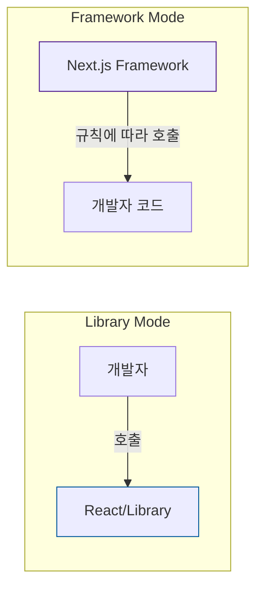

### 4. 구조적 차이 예시 (라우팅)

실제 코드로 보면 차이가 더 명확합니다. ‘페이지 이동’ 기능을 구현할 때의 차이를 볼까요?

**React (라이브러리)**
- 라우팅 라이브러리를 직접 설치하고, 코드로 규칙을 다 짜야 합니다.

```jsx
// React: 개발자가 직접 라우터를 설정하고 호출함
import { BrowserRouter, Routes, Route } from 'react-router';

function App() {
  return (
    <BrowserRouter>
      <Routes>
        <Route path="/" element={<Home />} />
        <Route path="/about" element={<About />} />
      </Routes>
    </BrowserRouter>
  );
}
```

**Next.js (프레임워크)**
- 코드가 필요 없습니다. 그냥 약속된 폴더(`pages` 혹은 `app`)에 파일을 만들기만 하면 됩니다.

```
// Next.js: 프레임워크가 파일 구조를 보고 알아서 라우팅을 연결함
📂 pages
 ├── 📄 index.js  ( -> / 경로)
 └── 📄 about.js  ( -> /about 경로)
```

### 5. 정리

Next.js는 자유도는 조금 낮을지 몰라도, **웹 개발에 필수적인 기능(라우팅, 최적화 등)을 ’기본 옵션’으로 제공**해줍니다. 덕분에 우리는 인프라 구축에 시간을 쏟는 대신, **서비스의 핵심 기능을 만드는 데 집중**할 수 있습니다. 이미 React를 할 줄 안다면, Next.js는 아주 쉽고 강력한 무기가 될 것입니다.

## **1-02. Pre-rendering: Next.js의 핵심 렌더링 전략 ⭐⭐⭐**

### 1. Pre-rendering이란?

Next.js의 가장 대표적인 특징이자 강력한 무기입니다. 단어 그대로 **“미리(Pre) 렌더링한다”**는 뜻입니다.

서버에서 미리 HTML을 완성해서 브라우저(클라이언트)에게 보내주는 기술을 말합니다. 구현 방식에 따라 **SSR(Server Side Rendering)**과 **SSG(Static Site Generation)** 등으로 나뉩니다. 이는 기존 React의 렌더링 방식인 CSR(Client Side Rendering)의 단점을 해결하기 위해 등장했습니다.

### 2. CSR vs Pre-rendering 비교

왜 Pre-rendering이 필요한지, 기존 방식과 비교하며 알아봅시다.

**1) React의 방식: CSR (Client Side Rendering)**
React 앱은 처음에 ’빈 껍데기 HTML’만 가져옵니다. 그 후 거대한 자바스크립트 파일을 다운로드하고 실행해야 비로소 화면이 보입니다.
- **문제점 1**: **초기 주요 콘텐츠 노출(LCP)**과 **상호작용 가능 시점(TTI)**이 늦어질 수 있음. (JS 실행 전까지 로딩 스피너만 보임)
- **문제점 2**: 검색 엔진 최적화(SEO)에 **상대적으로 불리할 수 있음**. (초기 HTML에 콘텐츠가 없으므로)

**2) Next.js의 방식: Pre-rendering**
Next.js는 서버에서 페이지를 미리 만듭니다. HTML을 생성하는 시점에 따라 크게 **두 가지 방식**으로 나뉩니다.

- **SSR (Server Side Rendering)**: 사용자가 **접속할 때마다(요청 시)** 서버에서 HTML을 새로 만듭니다. (항상 최신 데이터 보여줌)
- **SSG (Static Site Generation)**: 프로젝트를 **빌드할 때** 미리 HTML을 만들어둡니다. (누구에게나 똑같은 내용을 보여줄 때 매우 빠름)

이들의 공통적인 장점은 다음과 같습니다.
- **장점 1**: 초기 로딩이 매우 빠름. (접속하자마자 완성된 HTML이 보임)
- **장점 2**: 검색 엔진 최적화(SEO)에 강력함. (검색 로봇이 완성된 내용을 수집 가능)

### 3. 시각화: 로딩 프로세스 비교 (CSR vs SSR vs SSG)

렌더링 방식에 따른 흐름 차이와 장단점을 정확히 이해해봅시다.

- **📚 미리 보는 용어 정리 (FCP, LCP, TTI, TTFB, ISR)**
    
    
    | 용어 | 풀이 | 설명 |
    | --- | --- | --- |
    | **FCP** | **F**irst **C**ontentful **P**aint | 브라우저가 첫 번째 텍스트나 이미지를 화면에 그리는 순간입니다. (사용자가 “어? 뭔가 떴다”라고 느끼는 시점) |
    | **LCP** | **L**argest **C**ontentful **P**aint | 화면의 가장 큰 콘텐츠(주요 이미지나 텍스트)가 표시된 시점입니다. (사용자가 “화면이 다 떴구나”라고 느끼는 순간) |
    | **TTI** | **T**ime **T**o **I**nteractive | 자바스크립트 실행이 완료되어 클릭 등 상호작용이 가능한 시점입니다. (사용자가 버튼을 누를 수 있는 때) |
    | **TTFB** | **T**ime **T**o **F**irst **B**yte | 브라우저가 서버에 요청을 보내고, 첫 번째 바이트(응답)가 도착할 때까지 걸리는 시간입니다. |
    | **ISR** | **I**ncremental **S**tatic **R**egeneration | SSG로 만든 페이지를 **일정 조건(시간/요청)에서 재생성**해 최신성을 확보하는 전략입니다. |

**1) CSR (React 기본)**
서버는 텅 빈 HTML만 줍니다. 모든 건 브라우저에서 JS를 실행해야 시작됩니다.

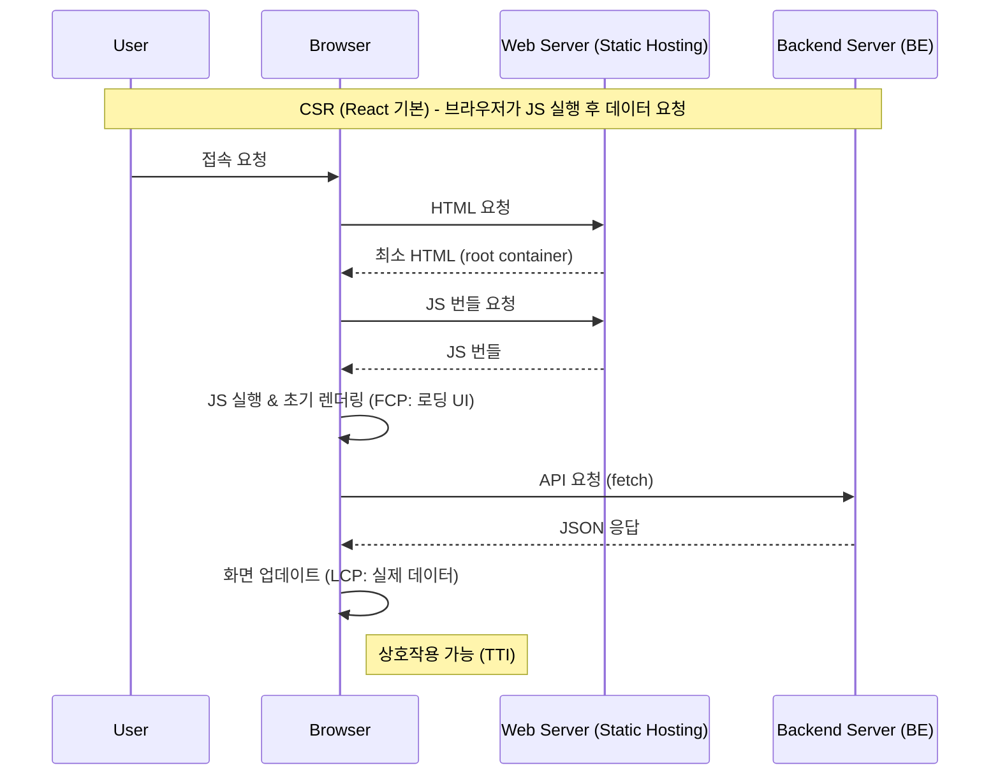

> 장점: 클라이언트 라우팅으로 페이지 전환이 부드럽습니다.
단점: 초기 주요 콘텐츠 노출(LCP)과 상호작용(TTI)이 늦어질 수 있으며, SEO가 상대적으로 불리할 수 있습니다.
> 

**2) SSR (Server Side Rendering)**
요청이 올 때마다 서버가 HTML을 새로 만듭니다. 데이터가 계속 바뀌는 페이지에 좋습니다.

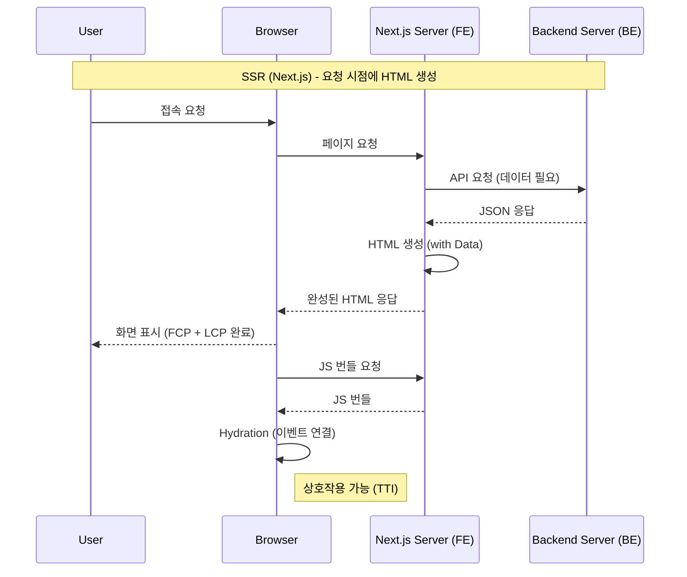

> 장점: 요청 시점에 HTML을 만들어 초기 노출이 빠르고 동적 데이터에 적합합니다.
단점: 요청마다 서버 렌더링이 필요해 TTFB(첫 바이트 도달 시간)가 느려질 수 있고, 서버 비용이 커질 수 있습니다.
> 

**3) SSG (빌드 타임 생성)**
빌드 타임에 미리 만들어둡니다. 요청이 오면 ’이미 만들어진 파일’을 바로 줍니다. 가장 빠릅니다.

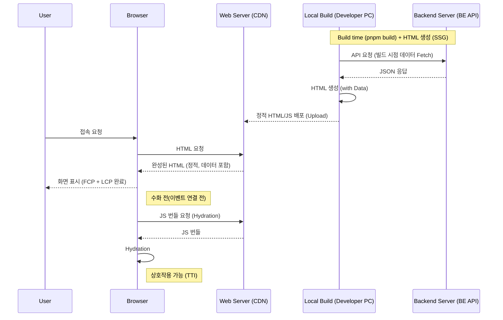

> 장점: 빌드 타임에 만들어둔 HTML을 바로 제공해 매우 빠르고 서버 부하가 적습니다.
단점: 콘텐츠가 바뀌면 재빌드/재배포(또는 ISR 같은 전략)가 필요합니다.
> 

### 4. Hydration (수화)

Pre-rendering 과정에서 눈여겨볼 단어가 있습니다. 바로 **Hydration(수화)**입니다.

- **상황**: 서버에서 받은 HTML은 화면에는 잘 보이지만, 아직 자바스크립트가 연결되지 않아 버튼을 눌러도 반응이 없는 ‘건조한’ 상태입니다.
- **Hydration**: 이 건조한 HTML에 자바스크립트(물)를 뿌려서, 움직일 수 있는 ‘생기 있는’ 상태로 만드는 과정을 말합니다.

> Tip: 비유하기
1. Pre-rendering: 컵라면에 뜨거운 물을 붓고 3분을 기다리는 게 아니라, 이미 조리된 라면을 식탁에 내놓는 것. (일단 눈앞에 음식이 있으니 안심됨)
2. Hydration: 하지만 젓가락(JS)이 아직 없어서 못 먹음. 잠시 후 젓가락을 가져오면(JS 로드) 그때부터 먹을 수 있음(상호작용).
> 

### 5. 정리 (Pre-rendering의 장점)

Pre-rendering은 **초기 로딩(첫 진입)** 때 가장 큰 빛을 발합니다.
일단 접속하고 나면, 그 이후의 페이지 이동은 **클라이언트 사이드 라우팅(Client-Side Routing)**을 통해 부드럽게 전환됩니다.

즉, Next.js는
1. **초기 접속**은 Pre-rendering으로 **빠르게 보여주고**,
2. **이후 이동**은 클라이언트 사이드 라우팅으로 **필요한 리소스(페이지 코드/데이터 등)를 가져와 부드럽게 전환**됩니다.

React의 장점(부드러운 이동)은 살리고, 단점(느린 초기 로딩)은 완벽하게 보완한 기술입니다.

## **1-02.** #Quiz **Pre-rendering: Next.js의 핵심 렌더링 전략**

**Q1. Pre-rendering이란 무엇인가요?**

- 정답 및 해설
    
    **정답:** 서버에서 HTML을 미리 생성해 브라우저에 전달하는 렌더링 방식입니다.
    
    **해설:** CSR은 JS 실행 후에야 화면이 그려지기 때문에 첫 화면이 느릴 수 있습니다. Pre-rendering은 초기 HTML에 콘텐츠가 포함되어 첫 표시 속도와 SEO에 유리합니다.
    

**Q2. CSR과 Pre-rendering의 가장 큰 차이는 무엇인가요?**

- 정답 및 해설
    
    **정답:** CSR은 브라우저가 렌더링을 담당하고 초기 HTML이 비어 있으며, Pre-rendering은 서버가 HTML을 만들어 전달합니다.
    
    **해설:** CSR은 JS 다운로드·실행 이후 화면이 완성됩니다. Pre-rendering은 초기 HTML에 내용이 있어 빠르게 보이고 SEO 측면에서도 유리합니다.
    

**Q3. Hydration(수화)은 왜 필요한가요?**

- 정답 및 해설
    
    **정답:** 서버가 만든 HTML에 React의 이벤트와 상태를 연결해 상호작용을 가능하게 하기 위해서입니다.
    
    **해설:** Pre-rendered HTML은 화면은 보이지만 클릭·입력 같은 동작은 불가능합니다. Hydration이 끝나면 이벤트 핸들러가 연결되어 정상적으로 동작합니다.
    

**Q4. SSR과 SSG의 생성 시점 차이는 무엇인가요?**

- 정답 및 해설
    
    **정답:** SSR은 요청 시점에, SSG는 빌드 시점에 HTML을 생성합니다.
    
    **해설:** SSR은 최신 데이터 제공에 유리하지만 요청마다 서버 연산이 필요합니다. SSG는 매우 빠르지만 데이터가 바뀌면 재빌드나 ISR로 갱신해야 합니다.
    
    ```jsx
    // SSR: 요청마다 실행
    export async function getServerSideProps() {
      return { props: {} };
    }
    
    // SSG: 빌드 시점에 실행
    export async function getStaticProps() {
      return { props: {} };
    }
    ```
    

---

# 제 2장: Next.js 실습 (Page Router)

## 2-00. 완성 코드

```bash
git clone https://github.com/winverse/codeit-fs-next-page-router.git
```

## 2-01. 백엔드 준비하기 및 TMDB API 키 얻기

TMBD라는 영화 데이터를 제공하는 사이트가 있습니다. 

여기서 API_KEY를 얻어야지 진행이 가능합니다.

**1. TMDB API 키 얻기**

1. 회원가입 페이지: [링크](https://www.themoviedb.org/signup?language=ko-KR)
2. 이메일 인증하기
    
    /%E1%84%89%E1%85%B3%E1%84%8F%E1%85%B3%E1%84%85%E1%85%B5%E1%86%AB%E1%84%89%E1%85%A3%E1%86%BA_2026-01-18_18.24.47.png)
    
3. API 키 세팅 하기: [링크](https://www.themoviedb.org/settings/api)
    
    /%E1%84%89%E1%85%B3%E1%84%8F%E1%85%B3%E1%84%85%E1%85%B5%E1%86%AB%E1%84%89%E1%85%A3%E1%86%BA_2026-01-18_18.26.18.png)
    
    /%E1%84%89%E1%85%B3%E1%84%8F%E1%85%B3%E1%84%85%E1%85%B5%E1%86%AB%E1%84%89%E1%85%A3%E1%86%BA_2026-01-18_18.27.08.png)
    
    - 약관 내용은 광고 포함, 상업적 이용시 TMDB측에 검수를 받아야 한다는 내용입니다.
    
    /%E1%84%89%E1%85%B3%E1%84%8F%E1%85%B3%E1%84%85%E1%85%B5%E1%86%AB%E1%84%89%E1%85%A3%E1%86%BA_2026-01-18_18.36.40.png)
    
    - 애플리케이션 개요에 아래와 같이 적어 넣습니다.
        - 안되면 AI를 이용해서 TMDB API를 이용할때 작성해야할 애플리케이션 개요를 작성해달라고 요청합니다. (아래는 예시)
    
    ```bash
    서비스의 핵심 데이터는 TMDB(The Movie Database) 오픈 API를 통해 수집됩니다. 
    백엔드에서 해당 API를 호출하여 수만 건의 콘텐츠 데이터를 최신 상태로 유지하며, 비정형 데이터를 가공(Transformation)하여 서비스 목적에 맞는 형태의 JSON 데이터로 변환해 클라이언트에 효율적으로 전달합니다. 이를 통해 방대한 외부 데이터를 실제 상용 서비스 수준으로 핸들링하는 아키텍처를 구축하였습니다.
    ```
    
- 개인정보 입력 후 어플리케이션 설명은 간단히 아무거나 적으면 됩니다. 적으시면
`Subscribe` 클릭!

/%E1%84%89%E1%85%B3%E1%84%8F%E1%85%B3%E1%84%85%E1%85%B5%E1%86%AB%E1%84%89%E1%85%A3%E1%86%BA_2026-01-18_18.40.17.png)

- 프로필 아이콘 클릭 → 설정 클릭 → API 클릭에서 읽기 엑세스 토큰과 API 키를 메모장에 저장하세요! (절대 외부에 공개하시면 안됩니다.)

**2. 백엔드 서버 실행**

이번 실습에서는 영화 데이터를 제공해주는 **백엔드 API 서버**가 필요합니다.
우리가 직접 만들지는 않고, 미리 준비된 백엔드 서버를 실행해서 사용하겠습니다.

1. `movie_review` 데이터 베이스 생성
    - mac
        
        터미널에서
        
        ```bash
        psql
        
        CREATE DATABASE movie_review;
        
        > create
        
        \q 
        ```
        
    - window
        
        아래 검색창에서 psql 검색하시고 postgres 전용 터미널 오픈 
        
        아이디 비밀번호 입력
        
        ```bash
        psql
        
        CREATE DATABASE movie_review;
        
        > create
        
        \q 
        ```
        
2. `git clone`

```bash
git clone https://github.com/winverse/codeit-fs-nextjs-backend.git
cd codeit-fs-nextjs-backend
code .
```

1. `env/.env.development` 

```
NODE_ENV=development
PORT=5005
DATABASE_URL=postgresql:<password>//postgres@localhost:5432/movie_review
TMDB_BASE_URL=https://api.themoviedb.org/3
TMDB_API_KEY= <<<<< 여기에 위 과정에서 얻은 API key를 적어주세요
```

1. install

**pnpm 사용하기 (추천)**
우리는 패키지 관리를 위해 `npm` 대신 **`pnpm`**을 사용할 것입니다. 

`pnpm`은 디스크 공간을 효율적으로 쓰고 설치 속도도 훨씬 빠릅니다.

만약 설치되지 않았다면 먼저 설치해주세요:

```bash
npx pnpm@latest-10 dlx @pnpm/exe@latest-10 setup

or 

npm install -g pnpm@latest-10
```

```
pnpm install
pnpm approve-builds   --> a 키 눌러서 전체 선택, 'Enter'

pnpm prisma:push
pnpm prisma:generate
pnpm dev
```

**3. 실행 확인**
* **API 서버**: `http://localhost:5005`
* **API 문서 (Swagger)**: `http://localhost:5005/api-docs`

브라우저에서 `http://localhost:5005/api/movies`에 접속했을 때 영화 JSON 데이터가 나오면 성공입니다! 이 서버는 실습 내내 켜두세요.

## **2-02. Page Router 프로젝트 셋업 (w/ Vanilla Extract)**

### 1. Page Router란?

Next.js에는 두 가지 라우터가 존재합니다. [(공식문서)](https://nextjs.org/docs)
1. **Page Router (pages 폴더)**: 전통적이고 안정적인 방식. (v14까지의 표준)

2. **App Router (app 폴더)**: v13.4부터 도입된 새로운 방식. 서버 컴포넌트 중심.

우리는 먼저 **Page Router**를 통해 Next.js의 기본 원리를 확실히 익힌 후, 나중에 App Router로 넘어갈 것입니다. Page Router는 여전히 수많은 기업에서 현역으로 사용 중이므로 반드시 알아야 합니다.

### 2. 실습 프로젝트 생성

본격적인 실습을 위해 Next.js 프로젝트를 만들어봅시다. 우리는 **Next.js 15+ 버전**을 사용하되, **App Router 기능을 끄고** Page Router 모드로 사용할 것입니다.

**설치 명령어**
터미널에 다음 명령어를 입력하세요. (`--use-pnpm` 옵션을 사용합니다)

```bash
npx create-next-app@latest learn-page-router --use-pnpm
```

**설치 옵션 질문 가이드**
* Would you like to use the recommended Next.js defaults? -> **No, customize settings** (상황에 따라 안나올 수 있음, 그러면 다음으로)
* Would you like to use TypeScript? -> **No**
* Which linter would you like to use? -> **ESLint**
* Would you like to use React Compiler? -> **YES**
* Would you like to use Tailwind CSS? -> **No** (우리는 vanilla-extract를 쓸 겁니다!)
* Would you like your code inside a `src/` directory? -> **Yes**
* Would you like to use App Router? -> **No** (최신은 App Router이지만 Next.js를 제대로 배우기 위해서 Chapter2는 Page Router로 실습합니다)
* Would you like to customize the default import alias? -> **No**

```bash
cd learn-page-router

code .
```

### 3. 에디터 설정 (jsconfig.json)

`create-next-app`으로 설치했을 때, `jsconfig.json` 파일이 자동으로 생성되지 않을 수 있습니다.
우리가 사용하는 절대 경로(`@/*`)가 VS Code 등 에디터에서 제대로 인식되도록, 프로젝트 루트에 `jsconfig.json` 파일을 직접 만들어주어야 합니다.

**`jsconfig.json`**

```json
{
  "compilerOptions": {
    "target": "esnext",
    "lib": ["dom", "dom.iterable", "esnext"],
    "allowJs": true,
    "noEmit": true,
    "jsx": "preserve",
    "isolatedModules": true,
    "resolveJsonModule": true,
    "module": "esnext",
    "moduleResolution": "bundler",
    "skipLibCheck": true,
    "strict": false,
    "paths": {
      "@/*": ["./src/*"]
    }
  },
  "include": ["**/*.js", "**/*.jsx"],
  "exclude": ["node_modules"]
}
```

> 설정값 상세 설명
> 
> 
> 
> | 옵션 | 설명 |
> | --- | --- |
> | **`compilerOptions`** | 자바스크립트 컴파일러 옵션을 설정합니다. |
> | `target` | `esnext` |
> | `lib` | `dom`, `esnext` 등 컴파일에 포함할 라이브러리 목록입니다. 브라우저 API 자동완성에 필수입니다. |
> | `allowJs` | `true`로 설정하면 자바스크립트 파일도 컴파일 대상으로 인식합니다. (JS 프로젝트에는 필수) |
> | `noEmit` | `true`로 설정하면 결과물(JS 파일)을 생성하지 않습니다. (Next.js가 빌드를 담당하므로 에디터는 분석만 수행) |
> | `jsx` | JSX 코드를 어떻게 처리할지 설정합니다. `preserve`는 Next.js가 처리하도록(변환하지 않고) 둡니다. |
> | `isolatedModules` | 각 파일을 개별 모듈로 변환 가능하게 만듭니다. Next.js 빌드 최적화에 필요합니다. |
> | `resolveJsonModule` | `.json` 파일을 모듈처럼(`import data from './data.json'`) 불러올 수 있게 합니다. |
> | `module` | 모듈 시스템을 지정합니다. `esnext`는 최신 표준 모듈 방식을 따릅니다. |
> | `moduleResolution` | 모듈을 찾는 방식을 결정합니다. `bundler`는 Webpack 같은 번들러가 처리함을 의미합니다. |
> | `skipLibCheck` | 라이브러리 정의 파일(`*.d.ts`)의 타입 검사를 건너뛰어 성능을 높입니다. |
> | `strict` | 엄격한 타입 검사를 활성화 여부입니다. JS 프로젝트이므로 `false`로 두어 유연하게 사용합니다. |
> | `paths` | `@/*` 같은 경로 별칭(Alias)을 설정하여 `../../` 지옥을 방지합니다. |
> | **`include`** | `**/*.js`, `**/*.ts` 등 프로젝트 내의 분석할 파일 패턴을 지정합니다. (`.css.js` 인식에 중요) |
> | **`exclude`** | `node_modules` 등 분석에서 제외할 폴더를 지정하여 성능 저하를 막습니다. |

### 4. 스타일링 도구 설정 (Vanilla Extract)

우리는 **빌드 타임에 CSS를 생성하는 스타일링 도구**인 **Vanilla Extract**를 사용할 것입니다.
(작성은 JS로 하지만, 실제로는 CSS 파일이 생성되어 **성능이 매우 뛰어납니다.**)

**1) 패키지 설치**

```bash
pnpm add @vanilla-extract/css @vanilla-extract/next-plugin clsx
pnpm add -D @eslint/js

pnpm approve-builds < 실행 a 키 눌러서 전체 선택, 'Enter'
```

**2) 실행 스크립트 수정 (`package.json`)**
Vanilla Extract는 현재 Next.js의 Turbopack과 일부 호환성 문제가 있습니다.
따라서 안정적인 실행을 위해 **Webpack 모드**로 실행하도록 설정을 변경합니다.

`package.json` 파일을 열고 `scripts`의 `dev` 명령어를 다음과 같이 수정하세요:

```json
"scripts": {
  "dev": "next dev --webpack",
  "build": "next build --webpack",
  "start": "next start",
  "lint": "eslint"
},
```

> Why --webpack?
> 
> 
> `vanilla-extract`는 현재 Next.js의 Turbopack과 호환성 이슈가 있어 Webpack을 강제합니다.
> (참고: [PR #1639](https://github.com/vanilla-extract-css/vanilla-extract/pull/1639))
> 

**3) Next.js 설정 (`next.config.mjs`)**
프로젝트 루트의 `next.config.mjs` 파일을 열고 다음과 같이 수정합니다.

```jsx
import { createVanillaExtractPlugin } from "@vanilla-extract/next-plugin";

const withVanillaExtract = createVanillaExtractPlugin();

/**@type {import('next').NextConfig} */
const nextConfig = {
  reactStrictMode: true,
  reactCompiler: true,
};

export default withVanillaExtract(nextConfig);
```

### 5. 프로젝트 실행

**Prettier 설정** 
프로젝트 루트에 `.prettierrc` 파일을 만들고 아래 내용을 복사해 넣으면 코드가 예쁘게 정리됩니다.

```json
{
  "semi": true,
  "singleQuote": true,
  "tabWidth": 2,
  "trailingComma": "all",
  "printWidth": 80
}
```

### 6. 폴더 구조 훑어보기

설치가 완료되면 `learn-page-router` 폴더가 생깁니다. 주요 폴더를 살펴봅시다.

- **`src/pages`**: **핵심!** 여기에 파일을 만들면 자동으로 페이지가 됩니다.
- **`src/styles`**: CSS 파일들이 모여있습니다. (`globals.css.js`는 전역 스타일)
- **`public`**: 이미지, 폰트 등 정적 파일을 넣는 곳입니다. (`/` 경로로 바로 접근 가능)

### 7. 핵심 파일 3대장

`src/pages` 폴더 안에 있는 3개의 파일은 매우 특별한 역할을 합니다.

| 파일명 | 역할 | 설명 |
| --- | --- | --- |
| **`_app.js`** | **레이아웃(Layout)** | 모든 페이지의 **부모**입니다. 헤더, 푸터 같은 공통 컴포넌트는 여기에 넣습니다. |
| **`_document.js`** | **HTML 뼈대** | `<html>`, `<body>` 태그를 직접 수정할 때 씁니다. (예: 폰트 로드, `lang="kr"` 설정) |
| **`index.js`** | **메인 페이지** | `/` 경로(홈)에 접속했을 때 보이는 첫 페이지입니다. |

### 8. 구조 시각화 (_app.js의 역할)

`_app.js`가 어떻게 모든 페이지를 감싸고 있는지 그림으로 확인해봅시다.

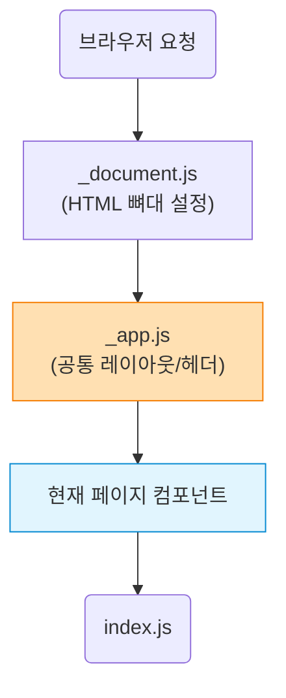

### 9. 실습: 라우팅 맛보기

Next.js의 라우팅은 정말 쉽습니다. 파일을 만들기만 하면 됩니다.

1. `src/pages` 폴더 안에 `test.js` 파일을 새로 만듭니다.
2. 아래 코드를 작성합니다.

```jsx
export default function Page() {
  return <h1>Test Page</h1>;
}
```

1. 브라우저 주소창에 `http://localhost:3000/test`를 입력해보세요.
2. 방금 만든 페이지가 짠! 하고 나타납니다.

이것이 바로 **파일 시스템 라우팅(File System Routing)**입니다. 복잡한 설정 없이 파일 생성만으로 페이지가 만들어집니다. 이게 바로 프레임워크의 강력한 힘 입니다.

### 10. 정리

| 파일/폴더 | 역할 |
| --- | --- |
| **`pages/`** | 파일 시스템 라우팅의 기준이 되는 폴더 |
| **`_app.js`** | 모든 페이지의 공통 부모 (레이아웃, 전역 스타일) |
| **`_document.js`** | HTML Document 구조 설정 (`html`, `body` 태그 직접 수정) |
| **`jsconfig.json`** | 절대 경로(`@/*`) 및 에디터 설정 |

## **2-03. 파일 시스템 기반 라우팅 (File-system Routing) ⭐⭐⭐**

Next.js의 꽃, **파일 시스템 라우팅(File System Routing)**을 본격적으로 파헤쳐 봅시다. 우리가 만든 `learn-page-router` 프로젝트에서 영화(Movie) 서비스를 만든다고 가정하고 실습해봅시다.

### 1. 정적 라우팅 (Static Routing)

가장 기본적인 라우팅입니다. 파일명이 곧 URL 경로가 됩니다.

**실습: 검색 페이지 만들기**
1. `src/pages` 안에 `search` 폴더를 만듭니다.
2. 그 안에 `index.js`를 만들고 아래 코드를 작성합니다.

```jsx
// src/pages/search/index.js
import { useRouter } from "next/router";

export default function Page() {
  const router = useRouter();

  // 쿼리 스트링 꺼내기 (ex: /search?q=hello)
  const { q } = router.query;

  return <h1>Search: {q}</h1>;
}
```

- **결과**: `http://localhost:3000/search?q=아이언맨`에 접속하면 화면에 “Search: 아이언맨”이 뜹니다.
- **핵심**: `useRouter` 훅을 쓰면 URL 뒤에 붙는 물음표(`?`) 뒤의 값(쿼리 스트링)을 쉽게 가져올 수 있습니다.

### 2. 동적 라우팅 (Dynamic Routing)

영화 상세 페이지처럼 URL의 일부분이 변수(`ID`)일 때 사용합니다. 대괄호 `[]`를 씁니다.

**실습: 영화 상세 페이지 만들기**
1. `src/pages` 안에 `movie` 폴더를 만듭니다.
2. 그 안에 `[id].js` 파일을 만듭니다. (파일명에 대괄호 필수!)

```jsx
// src/pages/movie/[id].js
import { useRouter } from "next/router";

export default function Page() {
  const router = useRouter();

  // URL 파라미터 꺼내기 (ex: /movie/123 -> id는 "123")
  const { id } = router.query;

  return <h1>Movie Detail: {id}</h1>;
}
```

- **결과**:
    - `/movie/1` 접속 -> “Movie Detail: 1”
    - `/movie/avengers` 접속 -> “Movie Detail: avengers”
- **핵심**: 파일명을 `[id].js`로 하면, `router.query.id`로 그 자리에 들어온 값을 꺼낼 수 있습니다.

> 주의: 주의: undefined가 뜰 수 있습니다.
페이지에 처음 진입할 때(Hydration 전), router.query.id 값이 아주 잠깐 undefined일 수 있습니다.
따라서 실제 개발 시에는 `if (!id) return "Loading...";` 처럼 방어해주는 것이 좋습니다.
> 

### 3. [심화] Catch-all Segments (모든 경로 잡기)

경로가 얼마나 길어질지 모를 때 사용합니다. 예를 들어 `/movie/a/b/c` 처럼 깊이가 제각각일 때 씁니다. 대괄호 안에 점 세 개 `...`를 찍습니다.

**실습: 모든 영화 경로 처리하기**
1. `src/pages/movie` 폴더 안에 `[...id].js` 파일을 만듭니다.

```jsx
// src/pages/movie/[...id].js
import { useRouter } from "next/router";

export default function Page() {
  const router = useRouter();
  const { id } = router.query;

  return (
    <div>
      <h1>Movie Catch All</h1>
      <p>{JSON.stringify(id)}</p>
    </div>
  );
}
```

- **결과**: `/movie/a/b/c` 접속 -> `["a", "b", "c"]` 배열로 나옵니다.
- **비교 및 주의사항**:
    - `pages/movie/[id].js`는 **1개 세그먼트**만 매칭합니다. (`/movie/123` ✅, `/movie/a/b/c` ❌)
    - `pages/movie/[...id].js`는 **여러 세그먼트**를 매칭합니다. (`/movie/a` ✅, `/movie/a/b/c` ✅)
    - **우선순위**: 두 파일이 같이 있을 때 `/movie/123`으로 접속하면, Next.js는 **더 구체적인 단일 경로(`[id].js`)를 우선**하여 처리합니다.

### 4. [더 심화] Optional Catch-all (선택적 모든 경로)

지금은 `/movie` 경로를 들어가시면 404 page가 나올겁니다.

만약 `/movie` 경로까지도 한 번에 처리하고 싶다면 어떻게 할까요?
그럴 땐 **대괄호를 두 번** 감싸줍니다. `[[...id]].js` 처럼요.

원래 있던 `[…id].js`를 `[[...id]].js` 로 변경해주세요

- 👉 (클릭) Catch-all vs Optional Catch-all 차이점
    
    
    | 파일명 | `/movie` | `/movie/a` | `/movie/a/b/c` |
    | --- | --- | --- | --- |
    | `[...id].js` | **404** (매칭 안 됨) | 매칭됨 (`id=["a"]`) | 매칭됨 (`id=["a","b","c"]`) |
    | `[[...id]].js` | **매칭됨** (`id=undefined`) | 매칭됨 (`id=["a"]`) | 매칭됨 (`id=["a","b","c"]`) |
    
    **“파라미터가 아예 없어도 되는(Optional)”**
    

### 5. [심화] 404 페이지 커스텀

존재하지 않는 페이지에 접속했을 때 보여줄 디자인을 수정할 수 있습니다.

**실습: 404 페이지 만들기**
1. `src/pages` 바로 아래에 `404.js`를 만듭니다.

```jsx
// src/pages/404.js
export default function Page() {
  return <h1>404 - Page Not Found</h1>;
}
```

- **결과**: 아무거나 이상한 주소(`/blabla`)로 접속하면 이 페이지가 뜹니다.

### 6. 정리

| 구분 | 파일명 예시 | 매칭 URL 예시 |
| --- | --- | --- |
| **정적 라우팅** | `pages/search/index.js` | `/search` |
| **동적 라우팅** | `pages/movie/[id].js` | `/movie/1`, `/movie/abc` |
| **Catch-all** | `pages/movie/[...id].js` | `/movie/a/b` (최소 1개) |
| **Optional** | `pages/movie/[[...id]].js` | `/movie` (0개도 매칭) |

## **2-03.** #Quiz **파일 시스템 기반 라우팅 (File-system Routing)**

**Q1. `pages/search/index.js`는 어떤 URL로 매핑되나요?**

- 정답 및 해설
    
    **정답:** `/search`입니다.
    
    **해설:** Page Router는 폴더 경로가 URL이 됩니다. `pages/search/index.js`의 `index.js`는 해당 폴더의 기본 경로(`/search`)를 의미합니다.
    

**Q2. `pages/movie/[id].js`에서 `[id]`는 무엇을 의미하나요?**

- 정답 및 해설
    
    **정답:** URL의 동적 파라미터 자리를 의미합니다.
    
    **해설:** `/movie/123`처럼 값이 변하는 위치를 `[id]`로 표시합니다. 페이지에서는 `useRouter().query.id`로 값을 읽고, 그 값에 맞는 데이터를 조회합니다.
    
    ```jsx
    // src/pages/movie/[id].js
    import { useRouter } from "next/router";
    
    export default function MoviePage() {
      const { query } = useRouter();
      return <div>movie id: {query.id}</div>;
    }
    ```
    

**Q3. Catch-all과 Optional Catch-all의 차이는 무엇인가요?**

- 정답 및 해설
    
    **정답:** Catch-all은 최소 1개 세그먼트가 필요하고, Optional Catch-all은 0개도 허용합니다.
    
    **해설:** `[...id]`는 `/movie/a`처럼 한 단계 이상이 있어야 매칭됩니다. `[[...id]]`는 `/movie`처럼 세그먼트가 없어도 매칭됩니다.
    
    ```jsx
    // src/pages/docs/[...slug].js
    import { useRouter } from "next/router";
    
    export default function DocsPage() {
      const { slug = [] } = useRouter().query;
      return <div>{slug.join("/")}</div>;
    }
    ```
    

**Q4. 404 페이지를 커스텀하려면 어떤 파일을 만들어야 하나요?**

- 정답 및 해설
    
    **정답:** `src/pages/404.js`입니다.
    
    **해설:** Page Router는 `404.js`를 Not Found 전용 페이지로 자동 인식합니다. 따로 라우트를 등록하지 않아도 커스텀 404 화면이 적용됩니다.
    
    ```jsx
    // src/pages/404.js
    export default function NotFound() {
      return <h1>페이지를 찾을 수 없습니다.</h1>;
    }
    ```
    

---

## **2-04. Link와 useRouter로 페이지 이동하기**

### 1. Link 컴포넌트

React에서 `react-router` 같은 라이브러리를 사용할 때, 페이지 이동을 위해 `<a>` 태그 대신 `<Link>` 컴포넌트를 썼던 것을 기억하시나요? Next.js도 마찬가지입니다.

**왜 `<a>` 태그를 쓰지 않을까?**`<a>` 태그는 브라우저의 기본 페이지 이동(Full Page Navigation)을 수행합니다. 즉, 페이지를 이동할 때마다 **새로고침**이 발생하여 화면이 깜빡이고 속도가 느려질 수 있습니다.

반면 Next.js의 `<Link>` 컴포넌트는 **Client Side Navigation**을 제공합니다.
JavaScript만으로 필요한 화면만 부드럽게 갈아끼우기 때문에 **깜빡임 없이 매우 빠릅니다.** (SPA 방식의 이동)

**실습: 네비게이션 바 만들기**`_app.js`에 링크들을 추가해봅시다.

기존 `src/styles/globals.css`(일반 CSS)를 삭제하고, **Vanilla Extract (`.css.js`)**로 교체하여 프로젝트의 스타일링 방식을 통일합니다.

1. `src/styles/globals.css` 파일을 **삭제**하세요. 
2. 전역 스타일 파일을 먼저 준비합니다.
    - `src/styles/globals.css.js` 파일을 만들고 아래 내용을 입력합니다.

```jsx
// src/styles/globals.css.js
import { globalStyle } from "@vanilla-extract/css";

globalStyle("html, body", {
  margin: 0,
  padding: 0,
});

globalStyle("body", {
  backgroundColor: "rgb(250, 250, 250)",
});

globalStyle("a", {
  textDecoration: "none",
  color: "inherit",
});

globalStyle("*", {
  boxSizing: "border-box",
});
```

1. `src/pages/_app.js` 파일을 엽니다.
2. `next/link`를 import하고 링크를 추가합니다.

```jsx
// src/pages/_app.js
import "@/styles/globals.css.js";
import Link from "next/link";

export default function App({ Component, pageProps }) {
  // ...
  return (
    <>
      <header>
        <Link href="/">Home</Link>
        &nbsp;
        <Link href="/search">Search</Link>
        &nbsp;
        <Link href="/movie/1">Movie</Link>
      </header>
      <Component {...pageProps} />
    </>
  );
}
```

### 2. Programmatic Navigation (함수로 이동하기)

사용자가 링크를 클릭하는 게 아니라, **“코드로 이동시키고 싶을 때”**가 있습니다.
예를 들어 *“로그인 버튼을 눌렀을 때, 로그인이 성공하면 홈으로 이동”* 같은 경우입니다.

이때는 `useRouter` 훅의 `push` 메서드를 사용합니다.

**실습: 버튼으로 이동하기**`_app.js`에 버튼을 추가해봅시다.

```jsx
// src/pages/_app.js
import "@/styles/globals.css.js";
import Link from "next/link";
import { useRouter } from "next/router"; // 1. useRouter 불러오기

export default function App({ Component, pageProps }) {
  const router = useRouter(); // 2. hook 사용

  const handleNavigateToTest = () => {
    // 3. push 메서드로 이동 (클라이언트 라우팅)
    router.push("/test");
  };

  return (
    <>
      <header>
        <Link href="/">Home</Link>
        &nbsp;
        <Link href="/search">Search</Link>
        &nbsp;
        <Link href="/movie/1">Movie</Link>
        <div>
          <button onClick={handleNavigateToTest}>Go to TEST</button>
        </div>
      </header>
      <Component {...pageProps} />
    </>
  );
}
```

- **`router.push('/경로')`**: 페이지 이동 (뒤로가기 가능)
- **`router.replace('/경로')`**: 페이지 교체 (뒤로가기 불가능)
- **`router.back()`**: 뒤로가기

이제 버튼을 누르면 `/test` 페이지로 **깜빡임 없이** 이동하는 것을 볼 수 있습니다.

### 3. 정리

| 방식 | 설명 | 특징 |
| --- | --- | --- |
| **`<Link>`** | `<a>` 태그 대체 컴포넌트 | **Client Side Navigation**, 프리페칭 자동 지원 |
| **`router.push`** | 자바스크립트 함수로 이동 | 이벤트 핸들러 내부에서 사용 |

## **2-05. Pre-fetching: 빠른 페이지 전환의 비밀 ⭐⭐⭐**

### 1. Pre-fetching이란?

단어 그대로 **“미리(Pre) 불러온다(Fetching)”**는 뜻입니다.
사용자가 링크를 클릭하기도 전에, **“이동할 페이지에 필요한 리소스(JS 코드 등)”를 미리 다운로드**해놓는 기술을 말합니다. (API 데이터가 아닙니다!)

Next.js의 `<Link>` 컴포넌트는 뷰포트(화면)에 나타나는 순간, 해당 링크와 연결된 페이지의 리소스를 백그라운드에서 조용히 불러옵니다. 덕분에 사용자가 실제로 클릭했을 때는 로딩 시간 없이 **즉시 페이지가 전환**됩니다.

### 2. 동작 조건

이 기능은 **주로 Production 모드(배포 모드)**에서 동작합니다.
개발 모드(`pnpm dev`)에서는 동작이 제한적이거나 불필요한 로딩을 막기 위해 비활성화될 수 있습니다.
또한, **네트워크 상태나 브라우저 정책(절전 모드 등)에 따라 프리페칭이 제한될 수 있습니다.**

### 3. 실습: Pre-fetching 눈으로 확인하기

실제로 미리 불러오는지 확인해봅시다. 이를 위해선 앱을 빌드해서 실행해야 합니다.

**1) Production 모드로 실행**
터미널을 끄고(`Ctrl + C`), 아래 명령어를 순서대로 입력하세요.

```bash
pnpm build
pnpm start
```

**2) 네트워크 탭 확인**
1. 브라우저를 열고 `http://localhost:3000`에 접속합니다.
2. 개발자 도구(`F12`) -> **Network** 탭을 엽니다.
3. 화면에 `Search`나 `Movie` 링크가 보이는 순간, 네트워크 탭에 새로운 `js` 파일들이 로드되는지 확인해보세요.
4. 아직 클릭하지 않았는데도 해당 페이지의 코드를 미리 가져온 것을 볼 수 있습니다.

- 확인하기
    - 메인페이지에서 `/movie`, `/search` 페이지 정보 가져오기
    
    /%E1%84%89%E1%85%B3%E1%84%8F%E1%85%B3%E1%84%85%E1%85%B5%E1%86%AB%E1%84%89%E1%85%A3%E1%86%BA_2026-01-30_18.48.43.png)
    

### 4. [심화] Pre-fetching 끄기

만약 데이터가 너무 많거나, 굳이 미리 불러올 필요가 없는 링크라면 기능을 끌 수 있습니다.
`prefetch={false}` 속성을 주면 됩니다. 

```jsx
<Link href="/movie/1" prefetch={false}>
  Movie (프리페칭 안 함)
</Link>
```

교드가 변경되었기 때문에 `Build`를 다시 해줍니다.

```bash
pnpm build
pnpm start
```

이렇게 하면 미리 다운로드하지 않고, **사용자가 클릭해서 이동할 때 비로소 필요한 리소스를 로드**합니다.

이후 코드는 되돌립니다.

- 확인하기
    - `/movie` 페이지에 대한 코드가 없음
    
    /%E1%84%89%E1%85%B3%E1%84%8F%E1%85%B3%E1%84%85%E1%85%B5%E1%86%AB%E1%84%89%E1%85%A3%E1%86%BA_2026-01-30_18.52.40.png)
    

### 5. [심화] Programmatic Prefetching (코드로 미리 로딩하기)

`<Link>` 컴포넌트는 자동으로 프리페칭을 해주지만, `router.push()`로 이동하는 페이지(예: `/test`)는 **자동으로 프리페칭되지 않습니다.**
이럴 때는 `router.prefetch()` 메서드를 사용해서 수동으로 미리 불러올 수 있습니다.

**실습: `/test` 페이지 미리 불러오기**`src/pages/_app.js`를 열고 `useEffect`를 추가해봅시다.

```jsx
// src/pages/_app.js
import { useEffect } from "react";
// ... imports

export default function App({ Component, pageProps }) {
  const router = useRouter();

  useEffect(() => {
    // 화면이 켜지자마자 '/test' 페이지 리소스를 미리 당겨옴
    router.prefetch("/test");
  }, [router]);

  return (
    <>
      <header>
        <Link href="/">Home</Link>
        &nbsp;
        <Link href="/search">Search</Link>
        &nbsp;
        <Link href="/movie/1">Movie</Link>
        &nbsp;
        <button onClick={handleNavigateToTest}>Test</button>
      </header>
      <Component {...pageProps} />
    </>
  );
}
```

이제 다시 빌드(`pnpm build && pnpm start`)해서 확인해보면, `/test` 링크가 없는데도 **Network 탭**에 `/test` 관련 파일이 로드되는 것을 볼 수 있습니다.

- 확인하기
    
    /%E1%84%89%E1%85%B3%E1%84%8F%E1%85%B3%E1%84%85%E1%85%B5%E1%86%AB%E1%84%89%E1%85%A3%E1%86%BA_2026-02-01_13.53.58.png)
    

### 6. 정리

- **Pre-fetching**: `<Link>`가 뷰포트에 보이면 연결된 페이지의 리소스를 미리 받아오는 기능입니다.
- **특징**: 페이지 이동 시 즉각적인 반응 속도를 제공합니다.
- **주의**: 개발 모드(`dev`)가 아닌 **프로덕션(`start`)** 모드에서 확인해야 합니다.

## **2-06. API Routes: 백엔드 API와의 협업 패턴 ⭐**

### 1. API Routes란?

`pages/api` 폴더에 파일을 만들면, 그 파일은 **웹 페이지가 아니라 API 엔드포인트**가 됩니다.
(`pages/api/hello.js` -> `/api/hello` 경로로 자동 매핑)

이 코드는 **서버에서만 실행되며 클라이언트 번들(JS)에 포함되지 않습니다.**
즉, Next.js 하나로 간단한 백엔드 서버 기능까지 구현하면서도 프론트엔드 성능에는 영향을 주지 않습니다.

> 주의: 정적 배포(Static Export) 제한
만약 next.config.mjs에서 output: 'export' 설정을 사용하여 정적 HTML로만 내보내는 경우, 서버가 없으므로 API Routes는 사용할 수 없습니다.
> 

> 참고:
이번 강의에서는 별도의 백엔드 서버(localhost:5005)가 이미 준비되어 있으므로, 이 기능을 주력으로 사용하진 않습니다.
“Next.js로 간단한 API도 만들 수 있구나” 정도로 가볍게 체험해보고 넘어갑시다.
> 

### 2. 실습: 오늘의 추천 영화 API 만들기

우리가 만들고 있는 영화 서비스에 “오늘의 추천 영화”를 랜덤으로 보여주는 기능을 추가해봅시다.
아직 데이터베이스는 없지만, JSON 데이터를 활용해 간단하게 구현할 수 있습니다.

**1) `src/pages/api/recommend.js` 파일 생성**

```jsx
// src/pages/api/recommend.js
export default function handler(req, res) {
  const movies = [
    { title: "인셉션", genre: "SF" },
    { title: "다크 나이트", genre: "액션" },
    { title: "인터스텔라", genre: "SF" },
    { title: "라라랜드", genre: "로맨스" },
    { title: "기생충", genre: "스릴러" },
  ];
  const randomMovie = movies[Math.floor(Math.random() * movies.length)];

  res.status(200).json(randomMovie);
}
```

**2) 브라우저 확인**`http://localhost:3000/api/recommend`에 접속해보세요. 새로고침할 때마다 다른 영화 JSON 데이터가 나옵니다.

### 3. 실습: 클라이언트에서 API 호출하기

이제 메인 페이지(`index.js`)에서 이 API를 호출해봅시다.

**1) 스타일 파일 준비**`index.js`에서 사용할 스타일 파일을 먼저 만듭니다.

- `Home.module.css`가 있으면 삭제해줍니다.

```jsx
// src/styles/home.css.js
import { style } from "@vanilla-extract/css";

export const container = style({
  padding: "20px",
});

export const title = style({
  color: "red",
  fontSize: "24px",
});

export const button = style({
  marginTop: "10px",
});

export const result = style({
  marginTop: "20px",
  fontSize: "20px",
  fontWeight: "bold",
});

export const searchLink = style({
  marginTop: "20px",
});
```

```jsx
// src/pages/index.js
import { Noto_Sans_KR } from 'next/font/google';
import Link from "next/link";
import { useState } from "react";
import * as styles from "@/styles/home.css.js";

const notoSansKr = Noto_Sans_KR({
  weight: ['500'],
  subsets: ['latin'],
});

export default function Home() {
  const [recommendation, setRecommendation] = useState(null);

  const fetchRecommendation = async () => {
    try {
      const res = await fetch("/api/recommend");
      const data = await res.json();
      setRecommendation(data);
    } catch (e) {
      console.error(e);
    }
  };

  return (
    <div className={styles.container}>
      <h1 className={styles.title}>인생 영화를 찾아보세요!</h1>

      <button onClick={fetchRecommendation} className={styles.button}>
        오늘의 추천 영화 보기
      </button>

      {recommendation && (
        <div className={styles.result}>
          {recommendation.title}
        </div>
      )}

      <div className={styles.searchLink}>
        <Link href="/search">검색 페이지로 이동하기</Link>
      </div>
    </div>
  );
}
```

### 4. 언제, 왜 사용할까요?

단순히 “서버를 만들 수 있다”를 넘어, 실제 프로젝트에서는 다음과 같은 경우에 유용하게 쓰입니다.

**1) 보안이 필요한 API Key 숨기기 (Proxy 역할을 통한 보호)**

> **Proxy(프록시)란?**
“대리인”이라는 뜻입니다. 클라이언트가 직접 외부 서버와 통신하지 않고, **중간에서 대신 통신해주는 서버**를 말합니다.
> 

클라이언트(브라우저)에서 외부 API를 직접 호출하면 API Key가 노출될 위험이 있습니다.
이때 `브라우저 -> Next.js API (서버) -> 외부 API` 순서로 호출하면, **API Key를 브라우저에 노출하지 않고 숨길 수 있습니다.**

> 주의: API Key는 숨겨지지만, /api/* 주소 자체는 공개되므로 누군가 악용할 수 있습니다.
실무에서는 이 API Route 자체에 인증이나 호출 제한(Rate Limit) 등의 보호 장치를 추가해야 합니다.
또한, API Key 같은 민감 정보는 코드에 적지 말고 .env (서버 환경변수)에 두고 불러와야 합니다. (클라이언트에 노출되는 NEXT_PUBLIC_과 구분 필수!)
> 

**2) BFF (Backend For Frontend) 패턴**

> **BFF란?**
“프론트엔드를 위한 백엔드”입니다. 실제 백엔드 서버가 주는 데이터가 너무 복잡하거나 날것(Raw)일 때, **프론트엔드 화면에 딱 맞게 데이터를 가공해서 전달해주는 중간 서버** 역할을 합니다.
(예: 백엔드 API 3개를 호출해서 하나로 합쳐서 프론트엔드에 주기)
> 

또한, 백엔드 API가 변경되더라도 BFF에서 대응해주면 프론트엔드 코드는 수정할 필요가 없습니다.
즉, **프론트엔드 요구에 맞춘 응답 형태를 ‘안정적으로 유지’**해서, 백엔드 변화에 덜 흔들리게 하는 완충층 역할도 합니다.

### 5. 정리

- **API Routes**: `pages/api` 폴더에 파일을 만들면 서버리스 함수처럼 동작하는 API 엔드포인트가 됩니다.
- **활용**: API Key 숨기기(Proxy), 데이터 가공(BFF) 등에 유용합니다.
- **주의**: 정적 배포(`output: 'export'`) 시에는 사용할 수 없습니다.

## **2-06.** #Quiz **API Routes: 백엔드 API와의 협업 패턴**

**Q1. API Routes는 어떤 폴더에 파일을 만들어야 동작하나요?**

- 정답 및 해설
    
    **정답:** `pages/api` 폴더에 만들어야 합니다.
    
    **해설:** `pages/api/hello.js`는 자동으로 `/api/hello`로 매핑됩니다. 이 폴더의 파일은 페이지가 아니라 API 엔드포인트로 동작합니다.
    
    ```jsx
    // src/pages/api/hello.js
    export default function handler(req, res) {
      res.status(200).json({ message: "hello" });
    }
    ```
    

**Q2. API Routes를 사용하는 대표적인 이유 2가지를 말해보세요.**

- 정답 및 해설
    
    **정답:** API Key 숨기기(Proxy), 응답 데이터 가공(BFF)입니다.
    
    **해설:** 브라우저에서 외부 API를 직접 호출하면 키가 노출될 수 있습니다. API Routes를 중간에 두면 키를 서버에 숨기고, 여러 API 응답을 프론트에 맞게 가공·통합할 수 있습니다.
    
    ```jsx
    // src/pages/api/movies.js
    import { fetchMovies } from "@/lib/movie.server";
    
    export default async function handler(req, res) {
      const movies = await fetchMovies();
      res.status(200).json(movies);
    }
    ```
    

**Q3. API Routes에서 `window`나 `document`를 사용할 수 있나요?**

- 정답 및 해설
    
    **정답:** 사용할 수 없습니다.
    
    **해설:** API Routes는 서버 환경에서만 실행됩니다. 브라우저 전용 객체(`window`, `document`)는 존재하지 않으므로 서버 환경 코드만 작성해야 합니다.
    

**Q4. 정적 배포(`output: "export"`)를 선택하면 API Routes는 어떻게 되나요?**

- 정답 및 해설
    
    **정답:** 사용할 수 없습니다.
    
    **해설:** 정적 배포는 서버 런타임이 없으므로 API Routes를 실행할 수 없습니다. 이 경우 별도의 백엔드 서버를 두거나 외부 API를 직접 사용해야 합니다.
    

---

## **2-07. _app.js와 Layout Pattern으로 공통 UI 관리**

### 1. 공통 레이아웃의 필요성

모든 페이지에 똑같은 헤더(Header)와 푸터(Footer)가 반복된다면, 페이지마다 복사-붙여넣기 하는 것은 비효율적입니다.
이럴 때 Next.js의 루트 컴포넌트인 **`_app.js`**를 활용하면 모든 페이지에 공통 레이아웃을 쉽게 적용할 수 있습니다.

### 2. 실습: Global Layout 만들기

우리는 **Vanilla Extract**를 사용하여 스타일링까지 완벽하게 적용된 레이아웃을 만들어보겠습니다.

**STEP 1: 전역 스타일 파일 교체**

1. `2-03`에서 만든 `src/styles/globals.css.js`의 내용이 아래와 같은지 확인하고, 다르면 교체합니다.

```jsx
// src/styles/globals.css.js
import { globalStyle } from "@vanilla-extract/css";

globalStyle("body", {
  backgroundColor: "rgb(250, 250, 250)", // 약간의 회색톤 배경
});

globalStyle("a", {
  textDecoration: "none",
  color: "inherit",
});

globalStyle("*", {
  boxSizing: "border-box",
});
```

**STEP 2: 레이아웃 컴포넌트 만들기**
헤더와 메인, 푸터를 포함하는 레이아웃 컴포넌트를 만듭니다.

1. `src/components/layouts/GlobalLayout/GlobalLayout.css.js` (스타일 파일) 생성:

```jsx
// src/components/layouts/GlobalLayout/GlobalLayout.css.js
import { style } from "@vanilla-extract/css";

export const container = style({
    maxWidth: "600px",
    minHeight: "100vh",
    backgroundColor: "white",
    margin: "0 auto",
    boxShadow: "0 0 20px rgba(0, 0, 0, 0.05)",
    padding: "0 20px",
});

export const header = style({
    height: "60px",
    fontWeight: "bold",
    fontSize: "18px",
    lineHeight: "60px",
    display: "flex",
    alignItems: "center",
    backgroundColor: "white",
    color: "#333",
    padding: "0 15px",
    borderBottom: "1px solid #eee",
    borderTopLeftRadius: "10px",
    borderTopRightRadius: "10px",
});

export const headerLink = style({
    color: "#e50914",
    textDecoration: "none",
    ":hover": {
        color: "#b20710",
    },
});

export const main = style({
    paddingTop: "10px",
});

export const footer = style({
    padding: "30px 0",
    marginTop: "50px",
    color: "#666",
    textAlign: "center",
    fontSize: "14px",
    borderTop: "1px solid #eee",
    backgroundColor: "#fafafa",
    borderBottomLeftRadius: "10px",
    borderBottomRightRadius: "10px",
});
```

1. `src/components/layouts/GlobalLayout/GlobalLayout.jsx` (컴포넌트 파일) 생성:

```jsx
// src/components/layouts/GlobalLayout/GlobalLayout.jsx
import Link from "next/link";
import * as styles from "./GlobalLayout.css.js";
import clsx from 'clsx';

const notoSansKr = Noto_Sans_KR({
  weight: ['500'],
  subsets: ['latin'],
});

export default function GlobalLayout({ children }) {
  return (
		<div className={clsx(styles.container, notoSansKr.className)}>
      <header className={styles.header}>
        <Link href="/" className={styles.headerLink}>
          NEXT CINEMA
        </Link>
      </header>
      <main className={styles.main}>{children}</main>
      <footer className={styles.footer}>winverse</footer>
    </div>
  );
}
```

1. `src/comonents/layouts/GlobalLayout/index.js` (외부 export용) 생성:

```jsx
// src/comonents/layouts/GlobalLayout/index.js
export { default } from './GlobalLayout';
```

**STEP 3: reset.css.js 만들기**

- 코드 보기
    
    ```css
    import { globalStyle } from '@vanilla-extract/css';
    
    // 기본 여백 초기화
    globalStyle('h1, h2, h3, h4, h5, h6, p, ul, ol, li, figure, blockquote', {
      margin: 0,
      padding: 0,
    });
    
    // 리스트 스타일 초기화
    globalStyle('ul, ol', {
      listStyle: 'none',
    });
    
    // 버튼 초기화
    globalStyle('button', {
      background: 'none',
      border: 'none',
      padding: 0,
      cursor: 'pointer',
      font: 'inherit',
      color: 'inherit',
    });
    
    // 입력 필드 초기화
    globalStyle('input, textarea', {
      font: 'inherit',
    });
    
    // 이미지 초기화
    globalStyle('img', {
      maxWidth: '100%',
      display: 'block',
    });
    
    ```
    

**STEP 4: `_app.js`에 적용하기**
이제 만든 레이아웃으로 모든 페이지를 감싸줍니다.

`src/pages/_app.js`를 다음과 같이 수정합니다.

```jsx
// src/pages/_app.js
import '@/styles/reset.css.js';
import "@/styles/globals.css.js"; // Vanilla Extract 전역 스타일 import
import GlobalLayout from "@/components/layouts/GlobalLayout";

export default function App({ Component, pageProps }) {
  return (
    <GlobalLayout>
      <Component {...pageProps} />
    </GlobalLayout>
  );
}
```

1. 브라우저를 확인해보세요 (`http://localhost:3000`).
    - 화면 중앙에 컨테이너가 잡혔나요?
    - 상단에 **NEXT CINEMA** 헤더가 보이나요?
    - 하단에 **@winverse** 푸터가 보이나요?
    - 모든 페이지(`/search`, `/movie/1` 등)에 동일하게 적용되었나요?

이것이 바로 **Next.js Global Layout**의 기본 패턴입니다.

### 3. 정리

- **Global Layout**: `_app.js`에서 컴포넌트를 감싸면 모든 페이지에 공통 레이아웃이 적용됩니다.
- **`globals.css.js`**: `globalStyle` 함수를 사용하여 전역 스타일(reset css 등)을 정의합니다.

## **2-08. Page Layout Pattern: 페이지별 레이아웃 적용**

### 1. 문제점: 모든 페이지에 같은 레이아웃?

우리는 앞서 `GlobalLayout`을 통해 모든 페이지에 헤더와 푸터를 적용했습니다.
하지만 “검색바” 같은 요소는 어떨까요?

- 메인 페이지(`index.js`): 필요함
- 검색 페이지(`search.js`): 필요함
- 영화 상세 페이지(`movie/[id].js`): **필요 없음 (영화 정보에 집중해야 함)**

만약 `GlobalLayout`에 검색바를 넣으면, **검색바가 필요 없는 상세 페이지에도 강제로 검색바가 생기는 문제**가 발생합니다.
따라서, **특정 페이지에만 원하는 레이아웃을 골라서 적용하는 “Page Layout Pattern”**이 필요합니다.

### 2. 실습: Search Layout 만들기

먼저 검색바가 있는 레이아웃을 만들어봅시다.
우리는 Next Cinema 컨셉에 맞춰 **넷플릭스 스타일의 검색바**를 만들 것입니다.

**STEP 1: `src/components/layouts/SearchLayout/SearchLayout.css.js` 생성**
Vanilla Extract로 스타일을 먼저 정의합니다.

```tsx
// src/components/layouts/SearchLayout/SearchLayout.css.js
import { style } from "@vanilla-extract/css";

export const container = style({
  display: "flex",
  gap: "10px",
  marginBottom: "20px",
  padding: "10px 20px",
  backgroundColor: "#fff",
  borderRadius: "10px",
  boxShadow: "0 2px 5px rgba(0,0,0,0.05)",
  justifyContent: "center",
  alignItems: "center",
  maxWidth: "600px",
  margin: "0 auto 30px auto",
});

export const input = style({
  flex: 1,
  padding: "12px 15px",
  fontSize: "16px",
  border: "1px solid #ddd",
  borderRadius: "5px",
  outline: "none",
  transition: "border-color 0.2s",
  ":focus": {
    borderColor: "#e50914",
  },
});

export const button = style({
  padding: "12px 20px",
  fontSize: "16px",
  fontWeight: "bold",
  backgroundColor: "#e50914",
  color: "white",
  border: "none",
  borderRadius: "5px",
  cursor: "pointer",
  transition: "background-color 0.2s",
  ":hover": {
    backgroundColor: "#b20710",
  },
});
```

**STEP 2: `src/components/layouts/SearchLayout/SearchLayout.jsx` 생성**
검색 기능을 포함한 레이아웃 컴포넌트를 만듭니다.

```jsx
// src/components/layouts/SearchLayout/SearchLayout.jsx
import { useState, useEffect } from "react";
import { useRouter } from "next/router";
import * as styles from "./SearchLayout.css.js";

export default function SearchLayout({ children }) {
  const router = useRouter();
  const [search, setSearch] = useState("");
	const [prevKeyword, setPrevKeyword] = useState('');
	
  const q = typeof router.query.q === "string" ? router.query.q : "";

  // https://react.dev/learn/you-might-not-need-an-effect#adjusting-some-state-when-a-prop-changes
  // 아래 처럼 작성하면, 경고 출력
  // useEffect(() => {
  //  if (!router.isReady) return;
  //  setSearch(q);
  // }, [router.isReady, q]);
  
  if (router.isReady && prevKeyword !== q) {
    setSearch(q);
    setPrevKeyword(q);
  }

  const onChangeSearch = (e) => {
    setSearch(e.target.value);
  };

  const onSubmit = () => {
    const next = search.trim();
    if (!next || q === next) return;

    router.push({
      pathname: "/search",
      query: { q: next },
    })
  };

  const onKeyDown = (e) => {
    if (e.key !== "Enter") return;
    onSubmit();
  };

  return (
    <div>
      <div className={styles.container}>
        <input
          className={styles.input}
          value={search}
          onChange={onChangeSearch}
          onKeyDown={onKeyDown}
          placeholder="검색어를 입력하세요..."
        />
        <button className={styles.button} onClick={onSubmit}>
          검색
        </button>
      </div>
      {children}
    </div>
  );
}
```

```jsx
// src/components/layouts/SearchLayout/index.js
export { default } from './SearchLayout';
```

### 3. 실습: Per-Page Layout 적용하기

이제 이 레이아웃을 **원하는 페이지에만** 적용하는 마법을 부릴 차례입니다.
핵심은 **페이지 컴포넌트에 `getLayout`이라는 메서드를 추가**하는 것입니다.

**STEP 1: `src/pages/_app.js` 수정**`_app.js`가 페이지별 레이아웃을 인식하도록 수정합니다.

```jsx
// src/pages/_app.js
import "@/styles/globals.css.js";
import GlobalLayout from "@/layouts/GlobalLayout";

export default function App({ Component, pageProps }) {
  // 페이지에 getLayout 메서드가 있으면 쓰고, 없으면 기본 페이지 그대로 반환
  const getLayout = Component.getLayout ?? ((page) => page);

  return (
    <GlobalLayout>
      {getLayout(<Component {...pageProps} />)}
    </GlobalLayout>
  );
}
```

**STEP 2: `src/pages/index.js`에 적용**
메인 페이지에는 검색바가 필요하므로 `SearchLayout`을 적용합니다.

```jsx
// src/pages/index.js 하단에 추가
import SearchLayout from "@/layouts/SearchLayout";

// ... (기존 컴포넌트 코드) ...

// getLayout 메서드 추가
Home.getLayout = (page) => {
  return <SearchLayout>{page}</SearchLayout>;
};
```

**STEP 3: `src/pages/search/index.js` 생성 및 적용**
검색 결과 페이지도 만들어줍니다.

```jsx
// src/pages/search/index.js
import { useRouter } from "next/router";
import SearchLayout from "@/layouts/SearchLayout";

export default function Search() {
  const router = useRouter();
  const { q } = router.query;

  return (
    <div>
      <h1>검색 결과: {q}</h1>
    </div>
  );
}

Search.getLayout = (page) => {
  return <SearchLayout>{page}</SearchLayout>;
};
```

### 4. 결과 확인

브라우저에서 확인해보세요.
1. **메인 페이지 (`/`)**: 검색바가 보입니다. ⭕
2. **검색 페이지 (`/search`)**: 검색바가 보입니다. ⭕
3. **영화 상세 페이지 (`/movie/1`)**: 검색바가 **보이지 않습니다.** ❌ (우리가 원하던 결과!)

이처럼 Page Layout Pattern을 사용하면, 복잡한 조건문 없이도 **페이지별로 유연하게 레이아웃을 구성**할 수 있습니다.
Next.js의 강력한 기능 중 하나이니 꼭 기억해두세요!

### 5. 정리

- **Page Layout Pattern**: 각 페이지 컴포넌트에 `getLayout` 함수를 추가하여 개별 레이아웃을 정의하는 패턴입니다.
- **장점**: 조건문 분기보다 깔끔하며, 불필요한 리렌더링을 방지할 수 있습니다.
- **구현**: `_app.js`에서 `Component.getLayout`을 확인하여 적용합니다.

## **2-09.** #실습 **UI 구현: 영화 서비스 완성하기**

이번 챕터에서는 본격적인 기능을 개발하기 전에, 우리 프로젝트인 **Next Cinema**의 UI를 완성해보겠습니다.
앞으로 다룰 “데이터 페칭(Data Fetching)”이나 “사전 렌더링(Pre-rendering)” 같은 복잡한 개념에 집중하기 위해, UI 작업을 미리 끝내두는 것이 좋습니다.

### 1. 사전 준비: 이미지 준비

이번 실습에서는 **외부 이미지 링크 만료 문제를 방지하기 위해 로컬 이미지**를 사용합니다.

프로젝트 루트에 `public/images` 폴더를 생성한 뒤, 아래 명령어를 터미널에 입력하여 실습용 이미지를 다운로드하세요.

### 터미널 명령어 (이미지 다운로드)

```bash
mkdir -p public/images
curl -o public/images/inception.jpg https://image.tmdb.org/t/p/w300_and_h450_face/zTgjeblxSLSvomt6F6UYtpiD4n7.jpg
curl -o public/images/dark-knight.jpg https://image.tmdb.org/t/p/w300_and_h450_face/f6dNinWX8rBM79JXKcShkfSh2oA.jpg
curl -o public/images/interstellar.jpg https://image.tmdb.org/t/p/w300_and_h450_face/evoEi8SBSvIIEveM3V6nCJ6vKj8.jpg
```

### 윈도우(PowerShell) 사용자 안내

- `curl` 명령어가 정상적으로 동작하지 않는 경우
    
    브라우저에서 위 URL에 직접 접속하여 이미지를 다운로드한 뒤
    
    `public/images` 폴더에 저장하세요.
    
- 파일명은 URL 경로의 마지막 부분과 동일하게 맞춰주세요.

### 참고: `next.config.mjs`

- 로컬 이미지를 사용할 경우 별도의 설정은 필요하지 않습니다.
- 추후 외부 이미지를 사용할 때는 `remotePatterns` 설정이 필요할 수 있습니다.
- 이번 실습에서는 해당 설정을 다루지 않습니다.

---

### 2. 목(Mock) 데이터 준비

아직 서버 API와 데이터 패칭을 연결하지 않은 단계입니다.

먼저 **UI가 정상적으로 렌더링되는지 확인하기 위해 임시 데이터(Mock Data)** 를 사용합니다.

아래와 같이 폴더와 파일을 생성하세요.

```
src/
 └─ mock/
    └─ movies.json
```

> 이후 실습에서는 이 movies.json 파일을 불러와 화면에 렌더링할 예정입니다.
> 

**`src/mock/movies.json`**

```json
[
  {
    "id": 1,
    "title": "인셉션",
    "tagline": "Your mind is the scene of the crime",
    "overview": "타인의 꿈에 들어가 생각을 훔치는 특수 보안요원 코브. 그에게 생각을 심어야 하는 불가능한 미션이 주어진다.",
    "releaseDate": "2010-07-21",
    "genres": [{"id": 28, "name": "SF"}, {"id": 12, "name": "액션"}],
    "runtime": 148,
    "posterPath": "/images/inception.jpg",
    "voteAverage": 8.4
  },
  {
    "id": 2,
    "title": "다크 나이트",
    "tagline": "Why So Serious?",
    "overview": "배트맨과 짐 고든 반장, 그리고 하비 덴트 검사는 고담시의 범죄와 부패를 척결하기 위해 힘을 합친다. 그러나 조커의 등장으로 도시는 다시 혼란에 빠진다.",
    "releaseDate": "2008-08-06",
    "genres": [{"id": 28, "name": "액션"}, {"id": 80, "name": "범죄"}],
    "runtime": 152,
    "posterPath": "/images/dark-knight.jpg",
    "voteAverage": 9.0
  },
  {
    "id": 3,
    "title": "인터스텔라",
    "tagline": "Mankind was born on Earth. It was never meant to die here.",
    "overview": "세계 각국의 정부와 경제가 완전히 붕괴된 미래. 인류를 구하기 위해 우주로 떠나는 사람들의 이야기.",
    "releaseDate": "2014-11-06",
    "genres": [{"id": 878, "name": "SF"}, {"id": 18, "name": "드라마"}],
    "runtime": 169,
    "posterPath": "/images/interstellar.jpg",
    "voteAverage": 8.7
  }
]
```

---

### 3. MovieItem 컴포넌트 만들기

영화 리스트에 표시될 개별 아이템 컴포넌트를 만듭니다.

**STEP 1: `src/components/MovieItem/MovieItem.css.js`**

```tsx
// src/components/MovieItem/MovieItem.css.js
import { style } from "@vanilla-extract/css";

export const container = style({
  display: "flex",
  gap: "15px",
  padding: "20px 15px",
  borderBottom: "1px solid #eee",
  textDecoration: "none",
  color: "black",
  transition: "background-color 0.2s",
  ":hover": {
    backgroundColor: "#f9f9f9",
  },
});

export const coverImg = style({
  width: "80px",
  borderRadius: "5px",
});

export const coverPlaceholder = style({
  width: "80px",
  height: "120px",
  borderRadius: "5px",
  backgroundColor: "#eee",
  color: "#999",
  fontSize: "12px",
  display: "flex",
  alignItems: "center",
  justifyContent: "center",
});

export const info = style({
  display: "flex",
  flexDirection: "column",
  gap: "5px",
});

export const title = style({
  fontSize: "18px",
  fontWeight: "bold",
});

export const subTitle = style({
  fontSize: "14px",
  color: "#555",
});

export const author = style({
  fontSize: "13px",
  color: "#888",
});
```

**STEP 2: `src/components/MovieItem/MovieItem.jsx`**

```jsx
import Link from "next/link";
import Image from "next/image"; // ✅ 이미지 최적화를 위해 사용
import * as styles from "./MovieItem.css.js";

export default function MovieItem({
  id,
  title,
  overview,
  posterPath,
  releaseDate,
  voteAverage,
}) {
  const hasPoster = Boolean(posterPath);

  return (
    <Link href={`/movie/${id}`} className={styles.container}>
      {/*
        ✅ Next.js의 Image 컴포넌트 사용
        - 자동으로 이미지를 최적화(WebP 변환, 사이즈 조절) 해줍니다.
        - width, height 값을 미리 지정해주어야 레이아웃 이동(CLS)이 방지됩니다.
        - https://nextjs.org/docs/pages/getting-started/images 참고
      */}
      {hasPoster ? (
        <Image
          src={posterPath}
          width={80}
          height={120}
          alt={title}
          className={styles.coverImg}
        />
      ) : (
        <div className={styles.coverPlaceholder}>이미지 없음</div>
      )}
      <div className={styles.info}>
        <div className={styles.title}>{title}</div>
        {overview && (
          <div className={styles.subTitle}>{overview.slice(0, 100)}...</div>
        )}
        <div className={styles.author}>
          {releaseDate} | ⭐ {voteAverage.toFixed(1)}
        </div>
      </div>
    </Link>
  );
}
```

<aside>
💡

CLS (Cumulative Layout Shift)란?
이미지가 로딩되면서 영역이 갑자기 커지거나 밀려서 레이아웃이 덜컥거리는 현상입니다. 사용자 경험(UX)과 구글 검색 순위(SEO)에 악영향을 줍니다. Next.js의 Image 컴포넌트는 크기를 미리 확보해서 이를 방지합니다.

</aside>

**STEP 3: `src/components/MovieItem/index.js`**

```jsx
export { default } from './MovieItem';
```

---

### 4. 메인 페이지 (Home) 구현

이제 메인 페이지에 영화 목록을 띄워봅시다. “지금 상영중인 영화”와 “등록된 모든 영화” 두 섹션으로 나눕니다.

**STEP 1: `src/styles/home.css.js`**

> 주의: Page Router에서는 pages 폴더 안에 스타일(*.css.js) 파일을 두면 안 됩니다. Next.js가 이를 페이지로 오인하여 빌드 에러가 발생할 수 있습니다. 반드시 src/styles 폴더에 스타일 파일들을 모아서 관리하세요. (예: src/styles/home.css.js)
> 

```tsx
import { style } from "@vanilla-extract/css";

export const container = style({
  display: "flex",
  flexDirection: "column",
  gap: "20px",
});

export const list = style({
  display: "flex",
  flexDirection: "column",
  gap: "10px",
  marginTop: "10px",
});
```

**STEP 2: `src/pages/index.js`**

```jsx
import Link from "next/link";
import * as styles from "@/styles/home.css.js";
import SearchLayout from "@/layouts/SearchLayout";
import MovieItem from "@/components/MovieItem";
import movies from "@/mock/movies.json";

export default function Home() {
  return (
    <div className={styles.container}>
      <section>
        <h3>지금 상영중인 영화</h3>
        <div className={styles.list}>
          {movies.map((movie) => (
            <MovieItem key={`recommended-${movie.id}`} {...movie} />
          ))}
        </div>
      </section>

      <section>
        <h3>등록된 모든 영화</h3>
        <div className={styles.list}>
          {movies.map((movie) => (
            <MovieItem key={`all-${movie.id}`} {...movie} />
          ))}
        </div>
      </section>
    </div>
  );
}

Home.getLayout = (page) => {
  return <SearchLayout>{page}</SearchLayout>;
};
```

---

### 5. 검색 페이지 (Search) 구현

검색 결과 페이지도 간단하게 리스트 형태로 구현합니다.

**`src/pages/search/index.js`**

```jsx
import { useRouter } from "next/router";
import SearchLayout from "@/comonents/layouts/SearchLayout";
import MovieItem from "@/components/MovieItem";
import movies from "@/mock/movies.json";

export default function Search() {
  const router = useRouter();
  const { q } = router.query;

  return (
    <div>
      {movies.map((movie) => (
        <MovieItem key={movie.id} {...movie} />
      ))}
    </div>
  );
}

Search.getLayout = (page) => {
  return <SearchLayout>{page}</SearchLayout>;
};
```

---

### 6. 상세 페이지 (Detail) 구현

상세 페이지의 UI도 별도의 컴포넌트로 분리하여 구현합니다.
이렇게 하면 페이지(`pages/`)는 데이터를 관리하고, 컴포넌트(`components/`)는 화면을 그리는 역할로 명확히 분리할 수 있습니다.

**STEP 1: `src/components/MovieDetail/MovieDetail.css.js`**

```tsx
// src/components/MovieDetail/MovieDetail.css.js
import { style } from "@vanilla-extract/css";

export const container = style({
  position: "relative",
});

export const coverImgContainer = style({
  width: "100%",
  height: "400px",
  position: "relative",
  backgroundSize: "cover",
  backgroundPosition: "center",
  display: "flex",
  justifyContent: "center",
  alignItems: "center",
  "::before": {
    content: '""',
    position: "absolute",
    top: 0,
    left: 0,
    width: "100%",
    height: "100%",
    backgroundColor: "rgba(0, 0, 0, 0.7)",
  },
});

export const coverImgContainerEmpty = style({
  backgroundColor: "#111",
});

export const coverImg = style({
  zIndex: 1,
  height: "350px",
  boxShadow: "0 10px 20px rgba(0,0,0,0.5)",
  borderRadius: "10px",
});

export const coverPlaceholder = style({
  zIndex: 1,
  width: "240px",
  height: "350px",
  borderRadius: "10px",
  backgroundColor: "#333",
  color: "#ccc",
  display: "flex",
  alignItems: "center",
  justifyContent: "center",
});

export const infoContainer = style({
  padding: "30px",
  maxWidth: "800px",
  margin: "0 auto",
  textAlign: "center",
});

export const title = style({
  fontSize: "32px",
  fontWeight: "bold",
  marginBottom: "10px",
});

export const tagline = style({
  fontSize: "20px",
  color: "#555",
  marginBottom: "20px",
});

export const overview = style({
  fontSize: "16px",
  lineHeight: "1.6",
  color: "#333",
  backgroundColor: "#f5f5f5",
  padding: "20px",
  borderRadius: "10px",
});
```

**STEP 2: `src/components/MovieDetail/MovieDetail.jsx`**

```jsx
import clsx from "clsx";
import Image from "next/image";
import * as styles from "./MovieDetail.css.js";

export default function MovieDetail({
  title,
  tagline,
  overview,
  releaseDate,
  genres,
  runtime,
  posterPath,
  voteAverage,
}) {
  const hasPoster = Boolean(posterPath);
  const coverStyle = hasPoster
    ? { backgroundImage: `url('${posterPath}')` }
    : undefined;

  return (
    <div className={styles.container}>
      <div
        className={clsx(
          styles.coverImgContainer,
          !hasPoster && styles.coverImgContainerEmpty,
        )}
        style={coverStyle}
      >
        {hasPoster ? (
          <Image
            src={posterPath}
            width={240}
            height={350}
            alt={title}
            className={styles.coverImg}
          />
        ) : (
          <div className={styles.coverPlaceholder}>이미지 없음</div>
        )}
      </div>

      <div className={styles.infoContainer}>
        <div className={styles.title}>{title}</div>
        <div>
          {releaseDate} | {genres.map((g) => g.name).join(", ")} | {runtime}분 |
          ⭐ {voteAverage.toFixed(1)}
        </div>
        <div className={styles.tagline}>{tagline}</div>
        <div className={styles.overview}>{overview}</div>
      </div>
    </div>
  );
}
```

**STEP 3: `src/components/MovieDetail/index.js`**

```jsx
export { default } from './MovieDetail';
```

**STEP 4: `src/pages/movie/[id].js`**

이제 페이지 컴포넌트는 아주 심플해집니다. 데이터를 찾아서 컴포넌트에 넘겨주기만 하면 됩니다.

```jsx
import { useRouter } from "next/router";
import MovieDetail from "@/components/MovieDetail";
import movies from "@/mock/movies.json";

export default function MoviePage() {
  const router = useRouter();
  const { id } = router.query;

  const movie = movies.find((m) => m.id === Number(id));

  if (!movie) return <div>Loading...</div>;

  return <MovieDetail {...movie} />;
}
```

이제 브라우저에서 `/`, `/search`, `/movie/1` 경로를 확인해보세요.
Next Cinema의 멋진 UI가 완성되었습니다! 🎥

- 완성된 페이지
    
    /%E1%84%89%E1%85%B3%E1%84%8F%E1%85%B3%E1%84%85%E1%85%B5%E1%86%AB%E1%84%89%E1%85%A3%E1%86%BA_2026-02-01_15.49.07.png)
    
    /%E1%84%89%E1%85%B3%E1%84%8F%E1%85%B3%E1%84%85%E1%85%B5%E1%86%AB%E1%84%89%E1%85%A3%E1%86%BA_2026-02-01_15.49.15.png)
    
    /%E1%84%89%E1%85%B3%E1%84%8F%E1%85%B3%E1%84%85%E1%85%B5%E1%86%AB%E1%84%89%E1%85%A3%E1%86%BA_2026-02-01_15.49.37.png)
    

# 제 3장: Data Fetching

## **3-01. Data Fetching 개요 ⭐⭐⭐⭐⭐**

### 1. Pre-rendering 복습 (1장 요약)

우리는 1장에서 **Pre-rendering**이 Next.js의 가장 강력한 무기라는 것을 배웠습니다.

- **CSR (React 기본)**: 빈 HTML + JS 로딩 후 렌더링 → **FCP/LCP 느림, SEO 불리**
- **Pre-rendering (Next.js)**: 데이터가 포함된 HTML 미리 생성 → **초기 로딩 빠름, SEO 유리**

### 2. 데이터 패칭 전략 세 가지

Next.js는 상황에 따라 세 가지 무기를 골라 쓸 수 있게 해줍니다.

| 방식 | 설명 | 언제 사용? | 키워드 |
| --- | --- | --- | --- |
| **SSR** | 요청 시점 생성 | 항상 최신 데이터 (검색, 마이페이지) | `getServerSideProps` |
| **SSG** | 빌드 시점 생성 | 데이터가 고정적일 때 (블로그, 문서) | `getStaticProps` |
| **ISR** | 일정 주기 갱신 | SSG + 주기적 업데이트 (상품 목록) | `revalidate` |

이번 3장에서는 이 개념들을 하나씩 코드로 직접 구현하며 정복해보겠습니다.
가장 먼저, 동적인 데이터를 다루는 **SSR**부터 시작합니다.

```jsx
// React 방식 (CSR)
const [data, setData] = useState();

useEffect(() => {
  fetchData().then(setData);
}, []);

if (!data) return<div>Loading...</div>; // 로딩 UI (FCP)
return<div>{data}</div>; // 실제 콘텐츠 (LCP)
```

### ❌ 문제점: 실제 콘텐츠 노출 지연 (LCP)

1. 브라우저가 **초기 HTML**을 받습니다. (로딩 UI만 있음 -> **FCP**)
2. JS 번들을 다운로드하고 실행합니다. (상호작용 가능 -> **TTI**)
3. 그제서야 API 요청을 보냅니다. (😱 너무 늦게 보냄!)
4. 데이터가 오면 실제 콘텐츠를 그립니다. (**LCP**)


- 📚 용어 정리
    - **FCP (First Contentful Paint)**: 브라우저가 첫 번째 텍스트나 이미지를 그린 시점. (사용자가 “뭔가 로딩 중이구나”를 인지하는 순간)
    - **LCP (Largest Contentful Paint)**: 화면의 가장 큰 콘텐츠(주요 이미지나 텍스트)가 표시된 시점. (사용자가 “화면이 다 떴구나”라고 느끼는 순간)
    - **TTI (Time to Interactive)**: JS가 로딩되고 실행되어 사용자가 클릭 등 상호작용을 할 수 있는 시점.

👉 **결과**: 사용자는 그전까지 **로딩 스피너**만 보게 되며, 검색 엔진(SEO)은 빈 페이지로 인식할 수 있습니다.

### 2. Next.js의 Pre-rendering

Next.js는 **사전 렌더링(Pre-rendering)** 단계에서 데이터를 미리 불러올 수 있습니다.

### ✅ 장점: 더 빠른 초기 콘텐츠 노출 (FCP/LCP 개선)

- **SSR**: 서버 연산으로 TTFB는 느릴 수 있지만, **데이터가 포함된 HTML**을 주므로 FCP/LCP가 빠름.
- **SSG**: 빌드 타임에 만드므로 TTFB도 빠름.


**[SSG: Local Build]**

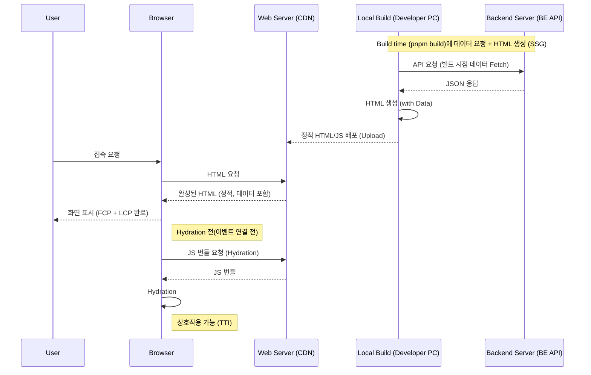

1. 서버에서 페이지를 그릴 때 **데이터까지 미리 Fetching** 합니다.
2. 브라우저는 **데이터가 이미 채워진 완성된 HTML**을 받습니다.
3. 사용자는 접속하자마자 완성된 화면을 봅니다.

### 3. 정리: 사전 렌더링의 방식 (SSR vs SSG)

Next.js의 핵심 렌더링 방식은 **SSR**과 **SSG**이며, SSG를 보완하는 전략으로 **ISR**이 있습니다.

### 1) 렌더링 방식 (Pre-rendering)

| 방식 | 설명 | 언제 사용? |
| --- | --- | --- |
| **SSR** (Server Side Rendering) | **요청 시점에** HTML 생성 | 개인화/권한 기반(마이페이지), 항상 최신(검색, 대시보드) |
| **SSG** (Static Site Generation) | **빌드 타임에** HTML 생성 | 거의 고정(공지, 마케팅, 문서) |

### 2) SSG 갱신 전략 (옵션)

| 전략 | 설명 | 언제 사용? |
| --- | --- | --- |
| **ISR** (Incremental Static Regeneration) | **revalidate 이후** 요청을 계기로백그라운드에서 정적 페이지 재생성 | 가끔 업데이트(블로그, 상품 목록) |

다음 섹션부터 이 3가지 방식을 하나씩 직접 구현해보겠습니다.

## **3-01.** #Quiz **Data Fetching 개요**

**Q1. CSR 방식에서 LCP가 늦어지는 이유는 무엇인가요?**

- 정답 및 해설
    
    **정답:** 초기 HTML에 실제 콘텐츠가 없고, JS 실행 이후에 데이터를 가져오기 때문입니다.
    
    **해설:** CSR은 브라우저가 JS를 다운로드·실행한 뒤에야 API 요청을 보냅니다. 데이터가 도착한 뒤에 화면이 채워지므로 LCP가 늦어질 수 있습니다.
    
    ```jsx
    // CSR: 브라우저에서 데이터 요청
    import { useEffect, useState } from "react";
    
    export default function Page() {
      const [movies, setMovies] = useState([]);
    
      useEffect(() => {
        fetch("/api/movies")
          .then((res) => res.json())
          .then(setMovies);
      }, []);
    
      return <div>{movies.length}</div>;
    }
    ```
    

**Q2. SSR과 SSG의 가장 큰 차이는 무엇인가요?**

- 정답 및 해설
    
    **정답:** HTML 생성 시점입니다.
    
    **해설:** SSR은 요청 시점에 HTML을 만들고, SSG는 빌드 시점에 HTML을 미리 생성합니다. 그래서 SSR은 최신성이 좋고, SSG는 응답 속도가 빠릅니다.
    

**Q3. 검색 결과처럼 사용자 입력에 따라 내용이 달라지는 페이지는 어떤 방식이 적합한가요?**

- 정답 및 해설
    
    **정답:** SSR이 적합합니다.  
    
    **해설:** 검색어는 경우의 수가 많아서 SSG로 미리 만들기 어렵습니다. SSR은 요청마다 쿼리를 읽어 서버에서 HTML을 생성할 수 있어 검색 결과 페이지에 적합합니다.
    
    ```jsx
    export async function getServerSideProps() {
      return { props: { /* 최신 데이터 */ } };
    }
    ```
    

**Q4. 회사 소개처럼 내용이 거의 변하지 않는 페이지는 어떤 방식이 적합한가요?**

- 정답 및 해설
    
    **정답:** SSG가 적합합니다.
    
    **해설:** 내용이 거의 변하지 않는 페이지는 빌드 시점에 HTML을 만들어두는 것이 효율적입니다.  
    SSG는 응답 속도가 빠르고 서버 부하가 적어 소개/정책 같은 페이지에 적합합니다.
    
    ```jsx
    export async function getStaticProps() {
      return { props: { /* 정적 콘텐츠 */ } };
    }
    ```
    

---

## **3-02. SSR 직접 구현하기 (Server Side Rendering) ⭐⭐⭐**

### 1. getServerSideProps 추가

가장 기본적인 **SSR(Server Side Rendering)**부터 구현해보겠습니다.
Next.js에서는 `getServerSideProps`라는 약속된 이름의 함수를 `export`하면 해당 페이지가 SSR로 동작합니다.

홈 페이지(`pages/index.js`)를 수정하여 SSR로 동작하도록 만들어봅시다.
영화 데이터(`movies.json`)를 컴포넌트에서 직접 import하지 않고, **서버에서 Props로 주입**받는 형태로 구현합니다.

```jsx
// src/pages/index.js
import * as styles from '@/styles/home.css.js';
import SearchLayout from '@/components/layouts/SearchLayout';
import MovieItem from '@/components/MovieItem';
import { useEffect } from 'react';

// 3️⃣ Props로 서버 데이터를 받음 (movies, data)
export default function Home({ nowPlaying, allMovies, data  }) {

  // 5️⃣ Client Side에서만 실행 (Browser)
  useEffect(() => {
    // window, document 등은 여기서 안전하게 사용 가능
    console.log("Client Side Execution:", window.location.href);
  }, []);

  // 2️⃣, 4️⃣ Server & Client 모두 실행 (Hydration)
  console.log("Server & Client Execution:", data);

  return (
    <div className={styles.container}>
      <section>
        <h3>지금 상영중인 영화</h3>
        <div className={styles.list}>
          {nowPlaying.map((movie) => (
            <MovieItem key={`rec-${movie.id}`} {...movie} />
          ))}
        </div>
      </section>
				
      <section>
        <h3>등록된 모든 영화</h3>
        <div className={styles.list}>
          {allMovies.map((movie) => (
            <MovieItem key={`all-${movie.id}`} {...movie} />
          ))}
        </div>
      </section>
    </div>
  );
}
```

### 2. 환경 변수 준비하기 (Environment Variables)

실습을 진행하기 전에 **환경 변수**를 먼저 설정하겠습니다.
표준 방식(`NEXT_PUBLIC_`)과 서버 전용 방식(비밀키 등)을 구분해서 사용하는 것이 중요합니다.

프로젝트 루트에 `.env.development` 파일을 생성하고 아래 내용을 입력하세요.

> 📚 [자세히 알아보기: Next.js Environment Variables](https://nextjs.org/docs/pages/guides/environment-variables)
> 

```bash
# .env.development

# 1. 클라이언트(브라우저)에서 사용: NEXT_PUBLIC_ 접두사 필수
NEXT_PUBLIC_API_URL=http://localhost:5005

# 2. 서버(getServerSideProps)에서 사용: 접두사 없음 (보안 강화)
API_URL=http://localhost:5005
```

- **설정 후 재시작 필수!**
    
    .env 파일을 새로 만들거나 수정하면 반드시 개발 서버(pnpm dev)를 껐다가 다시 켜야 적용됩니다. 지금 재시작해주세요. 🔄
    
- **주의: 백엔드 연동 후 /movie/1 오류**
    
    이 백엔드는 TMDB의 실제 영화 ID를 사용합니다. 따라서 /movie/1은 404가 될 수 있습니다.
    반드시 http://localhost:5005/api/movies에서 받은 유효한 id로 접속하세요. (예: /movie/1306368)
    

### 3. getServerSideProps 수정

이제 환경 변수(`API_URL`)와 API 경로(`/api/movies`, `/api/movies/now-playing`)를 조합하여 호출하도록 코드를 수정합니다.

같은 파일(`src/pages/index.js`) 하단으로 `getServerSideProps`를 추가합니다.

```jsx
// src/pages/index.js
//... 생략 ...

Home.getLayout = (page) => {
  return <SearchLayout>{page}</SearchLayout>;
};

export const getServerSideProps = async (context) => {
  try {
    // 1️⃣ Server Side Execution (Server Only)
    console.log("Server Side Execution:", context.req.url);
    const [nowPlayingResponse, allMoviesResponse] = await Promise.all([
      fetch(`${process.env.API_URL}/api/movies/now-playing`),
      fetch(`${process.env.API_URL}/api/movies`),
    ]);

    const [{ movies: nowPlaying }, { movies: allMovies }] =
      await Promise.all([nowPlayingResponse.json(), allMoviesResponse.json()]);
		
		// 보기 불편해서 중복 제거
    const nowPlayingIds = nowPlaying.map((movie) => movie.id);
    const filteredMovies = allMovies.filter(
      (movie) => !nowPlayingIds.includes(movie.id),
    );
    const data = "Next Cinema SSR Mode";
		
    return {
      props: {
        nowPlaying: nowPlaying.slice(0, 6), // 6개만
        allMovies: filteredMovies,
        data,
      },
    };
  } catch (error) {
    console.error("API Fetch Error:", error);
    return {
      props: {
        nowPlaying: [],
        allMovies: [],
        error: "BACKEND_UNAVAILABLE",
      },
    };
  }
};
```

### 4. (중요) 이미지 도메인 설정 (next.config.mjs)

TMDB 이미지를 사용하려면 `image.tmdb.org` 도메인을 허용해야 합니다.
`next.config.mjs` 파일을 열고 아래 설정을 추가해주세요. 그렇지 않으면 이미지가 깨져 보입니다.

```jsx
// next.config.mjs
const nextConfig = {
  reactStrictMode: true,
  // ...
  images: {
    remotePatterns: [
      {
        protocol: "https",
        hostname: "image.tmdb.org",
      },
    ],
  },
};
export default withVanillaExtract(nextConfig);
```

> 설정 후 재시작: next.config.mjs를 수정하면 개발 서버(pnpm dev)를 껐다가 다시 켜야 적용됩니다.
> 

### 5. 실행 흐름 확인하기 (Console Log)

브라우저에서 페이지를 새로고침하면 로그가 어디에 찍히는지 확인해보세요.

| 단계 | 실행 위치 | 로그 메시지 | 확인 위치 |
| --- | --- | --- | --- |
| **1. 요청 (SSR)** | **Server** | `Server Side Execution: ...` | **터미널 (pnpm dev)** |
| **2. HTML 생성** | **Server** | `Server & Client Execution: ...` | **터미널** |
| **3. Hydration** | **Browser** | `Server & Client Execution: ...` | **브라우저 콘솔** |
| **4. Interaction** | **Browser** | `Client Side Execution: ...` | **브라우저 콘솔** |

<aside>
💡

window 객체 사용 주의: window, document 같은 브라우저 전용 API는 서버 렌더링 단계에서 실행되면 에러가 발생합니다. 초급 단계에서는 useEffect 안에서 사용하는 것이 가장 안전한 방법입니다.

</aside>

```jsx
export default function Home({ movies, data }) {
  // ❌ 에러 발생: 서버에서도 실행되므로 window가 없음
  // window.location.href = "/";

  useEffect(() => {
    // ✅ 안전함: 브라우저에서만 실행됨
    console.log(window.location.href);
  }, []);

  return (
    // ...
  );
}
```

<aside>
💡

Link 컴포넌트와 SSR: <Link>를 통해 페이지를 이동할 때도 getServerSideProps는 서버에서 실행됩니다. 다만, 브라우저가 화면 전체를 새로고침하는 대신 Next.js가 내부적으로 JSON 데이터만 받아와서 화면을 업데이트하는 효율적인 방식으로 동작합니다.

</aside>

### 6. 실전 SSR: 데이터 분리와 패턴 (Advanced Data Fetching)

지금까지 우리는 `getServerSideProps`의 기본 사용법을 익혔습니다.
이번에는 실무에서 자주 사용되는 **(1) API 함수 관리**, **(2) 병렬 데이터 요청**, **(3) 동적 라우팅 SSR**을 모두 적용해서 프로젝트의 완성도를 높여보겠습니다.

**1. API 함수 분리하기 (`src/lib/movie.js`)**

`getServerSideProps` 안에 `fetch` 로직을 직접 작성하면 코드가 길어지고 재사용하기 어렵습니다.
`src/lib` 폴더를 만들고, API 호출 로직을 **하나의 파일**에 모아 관리해봅시다.

<aside>
💡

왜 하나의 파일로 합치나요?
관련 기능을 한 파일에 모으면 import가 간결해지고, 공통 설정(BASE_URL 등)을 공유하기 쉽습니다.

</aside>

`src/lib/movie.js`

이 파일은 **서버에서만 실행되는 코드**입니다. 브라우저에서 이 함수들을 직접 import해서 쓰면 안 됩니다. (환경 변수 누락 등으로 에러 발생)

```jsx
const BASE_URL = process.env.API_URL; // NEXT_PUBLIC이 붙어 있지 않습니다!

// 💡 교육 포인트: 이 파일은 서버에서만 동작해야 함을 명시
if (!BASE_URL) {
  throw new Error("API_URL is not set. (server-only env var)");
}

// 💡 요청: fetchMovies({ q: "avengers" })
export async function fetchMovies({ q } = {}) {
  try {
    const url = new URL(`${BASE_URL}/api/movies${q ? '/search' : ''}`);

    if (q) {
      url.searchParams.set('q', q);
    }

    const response = await fetch(url.toString());
    if (!response.ok) {
      throw new Error("Fetch failed");
    }

    const { movies } = await response.json();
    return movies;
  } catch (error) {
    console.error("fetchMovies Error:", error);
    return [];
  }
}

export async function fetchNowPlayingMovies() {
  try {
    const url = new URL(`${BASE_URL}/api/movies/now-playing`);
    const response = await fetch(url.toString());
    if (!response.ok) {
      throw new Error("Fetch failed");
    }

    const { movies } = await response.json();
    return movies;
  } catch (error) {
    console.error("fetchNowPlayingMovies Error:", error);
    return [];
  }
}

export async function fetchOneMovie(id) {
  try {
    const url = new URL(`${BASE_URL}/api/movies/${id}`);
    const response = await fetch(url.toString());
    if (!response.ok) {
      throw new Error("Fetch failed");
    }

    const movie = await response.json();
    return movie;
  } catch (error) {
    console.error("fetchOneMovie Error:", error);
    return null;
  }
}
```

| 함수 | 역할 | 파라미터 |
| --- | --- | --- |
| `fetchMovies` | 전체 영화 조회 / 검색 | `q` (선택) |
| `fetchNowPlayingMovies` | 현재 상영중 영화 조회 | 없음 |
| `fetchOneMovie` | 단일 영화 상세 조회 | `id` (필수) |

**2. 병렬 데이터 요청 (`src/pages/index.js`)**

홈 화면에서는 **"지금 상영중인 영화"**와 **"등록된 모든 영화"** 두 가지 데이터를 불러와야 합니다.
`await`를 두 번 쓰면 **직렬(순차)**로 실행되어 느립니다. `Promise.all`을 사용해 **병렬(동시)**로 요청해봅시다.

```jsx
import { fetchMovies, fetchNowPlayingMovies } from "@/lib/movie";

// ... (Home 컴포넌트)

export const getServerSideProps = async (context) => {
  try {
    // 🚀 Promise.all로 병렬 요청 (속도 향상!)
    const [nowPlaying, allMovies] = await Promise.all([
      fetchNowPlayingMovies(),
      fetchMovies(),
    ]);

    const nowPlayingIds = nowPlaying.map((movie) => movie.id);
    const filteredMovies = allMovies.filter(
      (movie) => !nowPlayingIds.includes(movie.id),
    );
    const data = 'Next Cinema SSR Mode';
    
    return {
      props: {
	        nowPlaying: nowPlaying.slice(0, 6),
	        allMovies: filteredMovies,
          data,
      },
    };
  } catch (error) {
    return { notFound: true };
  }
};
```

**3. 검색 페이지 SSR (`src/pages/search/index.js`)**

검색어(`q`)는 쿼리 스트링으로 전달됩니다 (`/search?q=avengers`).
`context.query`를 사용해 검색어를 읽고, 데이터를 불러옵니다.

```jsx
import { fetchMovies } from "@/lib/movie";

// ... (Search 컴포넌트)

export const getServerSideProps = async (context) => {
  const { q } = context.query; // 쿼리 스트링 꺼내기 (q)
  const movies = await fetchMovies({ q }); // 검색어로 API 호출

  return {
    props: {
      movies,
    },
  };
};
```

**4. 상세 페이지 SSR (`src/pages/movie/[id].js`)**

URL 파라미터(`id`)는 `context.params`로 읽어옵니다 (`/movie/123`).
존재하지 않는 영화라면 `notFound: true`를 반환하여 404 페이지를 보여줍시다.

```jsx
import MovieDetail from "@/components/MovieDetail";
import { fetchOneMovie } from "@/lib/movie";

export default function Page({ movie }) {
  if (!movie) return <div>로딩 실패</div>;

  return (
    <div className="container">
      <MovieDetail {...movie} />
    </div>
  );
}

export const getServerSideProps = async (context) => {
  const { id } = context.params; // URL 파라미터 꺼내기

  // 💡 입력값 검증: 숫자가 아니면 404 처리 (보안 및 에러 방지)
  const movieId = Number(id);
  if (!Number.isInteger(movieId) || movieId <= 0) {
    return {
      notFound: true,
    };
  }

  const movie = await fetchOneMovie(movieId);

  if (!movie) {
    return {
      notFound: true, // 404 페이지로 이동
    };
  }

  return {
    props: { movie },
  };
};
```

이제 핵심 페이지들이 **SSR**로 서버에서 데이터를 받아 렌더링되며, **실시간 백엔드 데이터와 연결되는 기본 골격이 완성**되었습니다.
완벽한 서비스를 위해서는 캐싱, 성능 최적화 등 다뤄야 할 주제가 더 많지만, 이제 가장 중요한 첫걸음을 뗐습니다. 고생 많으셨습니다! 🎉

### 7. 정리

- **SSR**: `getServerSideProps`를 사용하며, 요청마다 서버에서 실행됩니다.
- **최적화**: `Promise.all`로 병렬 요청을 처리하면 속도를 높일 수 있습니다.
- **주의**: 서버 사이드 로직에서는 `window` 객체 사용에 주의해야 합니다.

## **3-02.** #Quiz **SSR 직접 구현하기 (Server Side Rendering)**

**Q1. Page Router에서 SSR을 활성화하려면 어떤 함수를 어디에 선언해야 하나요? (hint, `get…` )**

- 정답 및 해설
    
    **정답:** 각 페이지 파일(`src/pages/...`)에서 `export async function getServerSideProps()`를 선언합니다.
    
    **해설:** `getServerSideProps`는 요청마다 서버에서 실행되고, 반환한 `props`가 페이지 컴포넌트로 전달됩니다. Page Router 전용 API이므로 App Router에서는 사용할 수 없습니다.
    
    ```jsx
    // src/pages/index.js
    export async function getServerSideProps() {
      return { props: { data: "from server" } };
    }
    ```
    

**Q2. `src/lib/movie.js` 같은 서버 전용 파일을 클라이언트 컴포넌트에서 import하면 왜 문제가 되나요?**

- 정답 및 해설
    
    **정답:** 서버 전용 환경 변수와 서버 실행 전제를 브라우저에서 만족할 수 없기 때문입니다.
    
    **해설:** 서버 전용 모듈을 클라이언트에서 import하면 코드가 브라우저 번들에 포함될 수 있습니다. 이 과정에서 비밀 키가 노출되거나 실행 오류가 발생할 수 있으므로 서버에서만 호출하고 결과만 props로 전달해야 합니다.
    
    ```jsx
    // src/pages/index.js (SSR)
    import { fetchMovies } from "@/lib/movie.server";
    
    export async function getServerSideProps() {
      const movies = await fetchMovies();
      return { props: { movies } };
    }
    
    export default function Page({ movies }) {
      return <div>{movies.length}</div>;
    }
    ```
    

**Q3. `Promise.all`로 병렬 요청을 하면 어떤 장점과 주의점이 있나요?**

- 정답 및 해설
    
    **정답:** 전체 대기 시간이 줄어드는 장점이 있고, 동시 요청으로 부하가 늘 수 있다는 주의점이 있습니다.
    
    **해설:** `Promise.all`은 요청을 동시에 시작해 가장 느린 요청만 기다리면 됩니다. 하지만 요청 수가 많으면 백엔드가 병목이 될 수 있고, 하나라도 실패하면 전체가 실패합니다.
    
    ```jsx
    const [movies, 추천] = await Promise.all([
      fetchMovies(),
      fetchRecommended(),
    ]);
    ```
    

**Q4. SSR 검색 페이지에서 쿼리 스트링(`?q=...`)을 어디에서 읽어야 하나요?**

- 정답 및 해설
    
    **정답:** `getServerSideProps`의 `context.query`에서 읽습니다.
    
    **해설:** SSR 단계에서는 브라우저 API를 사용할 수 없으므로 `window.location`이나 `useRouter()`를 쓰지 않습니다. 서버는 요청 정보를 `context`로 전달하므로 `context.query.q`에서 값을 읽는 것이 정석입니다.
    
    ```jsx
    export async function getServerSideProps({ query }) {
      const q = query.q ?? "";
      return { props: { q } };
    }
    ```
    

---

## **3-03. 정적 사이트 생성 (SSG) ⭐⭐⭐**

이번 시간에는 Next.js가 제공하는 또 다른 강력한 사전 렌더링 방식인 **SSG (Static Site Generation, 정적 사이트 생성)**에 대해 알아보겠습니다.

### 1. SSR의 한계점 복습

우리가 지금까지 구현한 **SSR (Server Side Rendering)**은 다음과 같은 특징이 있었습니다.

- **동작 방식**: 사용자가 접속할 때마다(`Request`) 서버에서 함수(`getServerSideProps`)를 실행하고 HTML을 만듭니다.
- **장점**: 항상 **최신 데이터**를 보여줄 수 있습니다. (예: 실시간 예매 현황, 주식 가격)
- **단점**: 백엔드 API가 느리면, **TTFB(Time To First Byte)가 늘어나 초기 화면 표시가 지연될 수 있습니다.** (서버가 렌더링을 마칠 때까지 브라우저는 기다려야 함)

### 2. SSG (Static Site Generation)란?

SSG는 이러한 SSR의 단점을 해결하기 위해 등장한 방식입니다. 이름 그대로 **“정적인 사이트를 미리 생성해두는”** 방식입니다.

- **동작 방식**: 기본적으로 **빌드 타임 (`pnpm build`)**에 미리 데이터를 불러와서 HTML을 만들어둡니다. (생성된 결과는 파일처럼 서빙되거나 CDN에 캐시됩니다)
- **특징**: 사용자가 접속하면, 서버는 미리 만들어둔 HTML을 그냥 건네주기만 하면 됩니다.

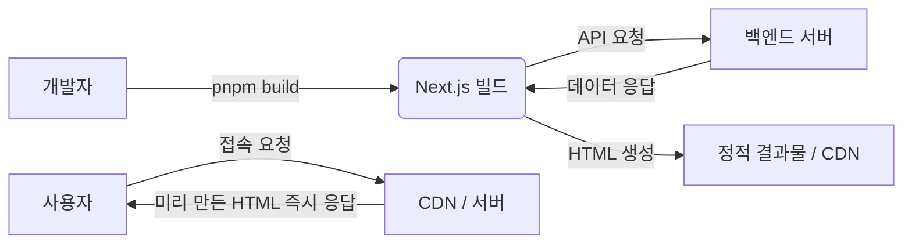

### 3. SSG의 장점 (Why SSG?)

1. **압도적인 속도**: 이미 만들어진 HTML을 주기만 하면 되므로 응답 속도가 매우 빠릅니다. 사용자 요청 시점에는 백엔드 속도에 덜 의존합니다.
2. **서버 부하 감소**: 사용자가 몰려도 HTML을 새로 만들 필요가 없으므로 서버 리소스를 거의 쓰지 않습니다.

### 4. SSG의 단점 (Trade-off)

1. **데이터의 최신성 부족**: 빌드 시점의 데이터로 페이지가 고정됩니다. 실무에서는 **ISR (Incremental Static Regeneration)**을 통해 일정 주기로 페이지를 갱신하여 이를 보완합니다.
2. **빌드 시간 증가**: 페이지가 수만 개라면 빌드하는 데 시간이 오래 걸릴 수 있으며, 빌드 시점의 백엔드 상태가 중요해집니다.
3. **개인화 불가**: 사용자별로 다른 내용을 보여줘야 하는 페이지(마이페이지, 장바구니)에는 적합하지 않습니다.

### 5. SSR vs SSG 비교

| 특징 | SSR (Server Side Rendering) | SSG (Static Site Generation) |
| --- | --- | --- |
| **렌더링 시점** | 요청 받을 때마다 (Runtime) | 빌드 할 때 (Build Time) |
| **데이터 최신성** | 항상 최신 (Realtime) | 빌드 시점 기준 (Stale, ISR로 보완 가능) |
| **응답 속도** | 백엔드 속도에 의존 (느릴 수 있음) | 매우 빠름 (Fast) |
| **추천 상황** | 검색 결과, 마이페이지, 실시간 대시보드 | 회사 소개, 블로그 글, 이용약관, 공지사항(자주 바뀌면 ISR) |

### 6. 정리

- **SSR**: “주문 들어오면 요리 시작” (항상 따뜻하지만 오래 걸림)
- **SSG**: “미리 도시락 싸둠” (식었을 수 있지만 바로 먹을 수 있음)

> 💡 결론 (Trade-off)
SSG는 속도와 비용 효율을 얻는 대신, 데이터의 최신성 관리와 배포 전략을 고민해야 하는 방식입니다.
> 

---

### 7. SSG 실습 및 적용

이번 시간에는 배운 SSG 개념을 우리 프로젝트에 직접 적용해보겠습니다.
홈 페이지는 정적으로 생성하고, 검색 페이지는 클라이언트 측에서 데이터를 불러오도록 변경할 것입니다.

**1. 홈 페이지를 SSG로 변환하기 (`src/pages/index.js`)**

홈 페이지는 모든 사용자에게 동일한 영화 목록을 보여주면 되므로, SSG로 만들기 가장 좋은 페이지입니다.
기존의 `getServerSideProps`를 `getStaticProps`로 이름만 바꾸면 됩니다!

```jsx
// src/pages/index.js
import { fetchMovies, fetchNowPlayingMovies } from "@/lib/movie.server";
// ... imports

export default function Home({ nowPlaying, allMovies, data }) {
  // ... (컴포넌트 로직 동일)
}

// ❌ 기존 SSR 코드 삭제
// export const getServerSideProps = async (context) => { ... }
// 1️⃣ Server Side Execution (Server Only)
//    console.log('Server Side Execution:', context.req.url);

// ✅ SSG 코드로 변경
export const getStaticProps = async () => {
  console.log("Build Time Execution: Home Page Created"); // 빌드 타임 확인용 로그

  try {
    const [nowPlaying, allMovies] = await Promise.all([
      fetchNowPlayingMovies(),
      fetchMovies(),
    ]);
    
    const nowPlayingIds = nowPlaying.map((movie) => movie.id);
    const filteredMovies = allMovies.filter(
      (movie) => !nowPlayingIds.includes(movie.id),
    );
    const data = 'Next Cinema SSR Mode';
    
    return {
      props: {
        nowPlaying: nowPlaying.slice(0, 6),
        allMovies: filteredMovies,
        data,
      },
    };
  } catch (error) {
    return {
      props: {
        nowPlaying: [],
        allMovies: [],
        error: "BACKEND_UNAVAILABLE"
      }
    };
  }
};
```

**2. (중요) 서버/클라이언트 Fetcher 분리 (Separation of Concerns)**

SSG(`getStaticProps`)는 서버(Node.js)에서 돌고, 검색 페이지 로직(`useEffect`)은 브라우저에서 돕니다.
하나의 파일(`lib/movie.js`)에서 두 환경을 모두 처리하려고 하면, 환경변수 충돌이나 보안 문제(API Key 노출 등)가 발생하기 쉽습니다.

따라서 실무에서는 **파일 이름 컨벤션**을 통해 이를 명확히 분리합니다.

**1단계): 기존 파일 이름 변경 (`src/lib/movie.js` -> `src/lib/movie.server.js`)**

기존 `movie.js`는 이제 **서버 전용**으로만 사용합니다.
파일명에 `.server`를 붙여 “이 파일은 서버에서만 쓴다”는 것을 명시합니다.

```jsx
// src/lib/movie.server.js (이름 변경됨)
const BASE_URL = process.env.API_URL;

export async function fetchMovies({ q } = {}) {
  try {
    const url = new URL(`${BASE_URL}/api/movies${q ? '/search' : ''}`);
    if (q) url.searchParams.set('q', q);

    const response = await fetch(url.toString());
    if (!response.ok) throw new Error("Fetch failed");

    const { movies } = await response.json();
    return movies;
  } catch (error) {
    console.error("fetchMovies Error:", error);
    return [];
  }
}

export async function fetchNowPlayingMovies() {
  try {
    const url = new URL(`${BASE_URL}/api/movies/now-playing`);
    const response = await fetch(url.toString());
    if (!response.ok) throw new Error("Fetch failed");

    const { movies } = await response.json();
    return movies;
  } catch (error) {
    console.error("fetchNowPlayingMovies Error:", error);
    return [];
  }
}
```

**2단계): import 경로 수정하기**

`src/pages/index.js`와 `movie/[id].js` , `search/index.js`의 import 경로도 수정해줍니다.

```jsx
import { fetchMovies, fetchNowPlayingMovies      nowPlaying,
      allMovies, } from "@/lib/movie.server"; // ✅ .server 명시
```

**3. 배포용 환경변수 설정 (`.env.production`)**

`pnpm build` 명령은 **Production 모드**로 동작하기 때문에, 개발용 환경변수 파일인 `.env.development`를 무시합니다.
따라서 빌드 과정에서 API 주소를 알 수 없어 에러가 발생할 수 있습니다.

배포 환경에서도 사용할 수 있도록 `.env.production` 파일을 생성해줍니다.

```bash
# .env.production
NEXT_PUBLIC_API_URL=http://localhost:5005
API_URL=http://localhost:5005
```

### 4. 빌드 결과 확인하기 (`pnpm build`)

개발 모드(`pnpm dev`)에서는 SSG여도 **데이터가 바뀌면 바로 반영하기 위해 요청마다 페이지를 다시 생성하는 경우가 많습니다.** 그래서 `console.log`가 계속 찍힌다고 해서 SSG가 아니라고 오해하면 안 됩니다.
진짜 SSG 동작은 **빌드(`build`) 후 `start`** 환경에서 확인해야 정확합니다.

```bash
pnpm build
```

빌드가 완료되면 터미널에 페이지별로 렌더링 방식이 기호로 표시됩니다.
(※ Next.js 버전이나 설정에 따라 기호는 다를 수 있지만, **Static**과 **Server**의 구분은 동일합니다.)

- **`●` (SSG)**: `getStaticProps`를 사용해 빌드 타임에 HTML이 생성된 페이지
    - 예: `/` (Home)
- **`○` (Static)**: 데이터 요청이 없는 정적 페이지 (기본값)
    - 예: `/404`
- **`ƒ` (Server)**: `getServerSideProps`를 사용해 요청 시 서버에서 렌더링하는 페이지
    - 예: `/movie/[id]`

이제 `pnpm start`로 프로덕션 서버를 실행하고 홈 페이지에 접속해보세요.
새로고침을 해도 터미널에 로그가 찍히지 않으며, 아주 빠르게 로딩됩니다! 🚀

### 5. 검색 페이지의 딜레마

검색 페이지(`src/pages/search/index.js`)도 SSG로 바꿀 수 있을까요?
검색어(`q`)는 **사용자가 접속하는 순간(Runtime)**에 들어옵니다. 그 모든 경우의 수를 빌드 시점에 미리 만들어둘 수는 없습니다.

따라서 검색 페이지는 **CSR (Client Side Rendering)** 방식을 사용해야 합니다.
이를 위해 앞서 분리한 클라이언트 전용 Fetcher를 만들어 사용하겠습니다.

**1단계: 클라이언트 전용 Fetch Helper 생성 (`src/lib/movie.client.js`)**

브라우저에서 실행될 데이터 요청 로직은 `.client.js` 파일에 따로 둡니다.
이 파일은 오직 `NEXT_PUBLIC_API_URL`만 사용하여 백엔드로 요청을 보냅니다.

```jsx
// src/lib/movie.client.js (새로 생성)
const BASE_URL = process.env.NEXT_PUBLIC_API_URL;

if (!BASE_URL) {
  throw new Error("NEXT_PUBLIC_API_URL is not set.");
}

export async function fetchSearchMovies(q, signal) {
  // 1️⃣ 검색어 인코딩 (한글, 특수문자 처리를 위해 encodeURIComponent 필수)
  const safeQ = encodeURIComponent(q);

  // 2️⃣ signal 전파 (취소 기능)
  const res = await fetch(`${BASE_URL}/api/movies/search?q=${safeQ}`, { signal });
  if (!res.ok) throw new Error("Fetch failed");
  const data = await res.json();
  return data.movies || [];
}
```

**2단계: 검색 페이지에 적용 (`src/pages/search/index.js`)**

이제 컴포넌트는 “데이터를 어떻게 가져오는지” 신경 쓰지 않고, 오직 **UI와 UX 상태 관리**에만 집중할 수 있습니다.

```jsx
// src/pages/search/index.js
import { useState, useEffect } from "react";
import { useRouter } from "next/router";
import SearchLayout from "@/layouts/SearchLayout";
import MovieItem from "@/components/MovieItem";
import { fetchSearchMovies } from "@/lib/movie.client"; // ✅ 클라이언트 전용 Helper 사용

export default function Search() {
  const [movies, setMovies] = useState([]);
  const [isLoading, setIsLoading] = useState(false);
  const router = useRouter();
  const { q } = router.query;

  useEffect(() => {
    // 1️⃣ 라우터가 준비되지 않았거나 검색어가 없으면 중단
    if (!router.isReady || !q) return;

    // 2️⃣ AbortController: 이전 요청 취소로 경쟁 상태(Race Condition) 해결
    const controller = new AbortController();

    setIsLoading(true);

    const fetchSearchResults = async () => {
      try {
        // 3️⃣ Client-Side Fetcher 호출 (controller.signal 전달)
        const movieData = await fetchSearchMovies(q, controller.signal);
        setMovies(movieData);
        // 여기서 로딩을 끄지 않음 (finally에서 처리)
      } catch (error) {
        // 중요: AbortError는 에러가 아닌 '취소'이므로 무시해야 함
        if (error.name === "AbortError") return;
        console.error(error);
      } finally {
        // 3️⃣ 유효한(취소되지 않은) 요청인 경우에만 로딩 종료
        if (!controller.signal.aborted) {
          setIsLoading(false);
        }
      }
    };

    fetchSearchResults();

    // Cleanup: 쿼리가 바뀌거나 언마운트되면 이전 요청 "진짜로 취소"
    return () => {
      controller.abort();
    };
  }, [router.isReady, q]);

  return (
    <div>
      {/* 4️⃣ 로딩 상태 표시 (UX) */}
      {isLoading ? (
        <div style={{ padding: "20px", textAlign: "center" }}>Loading...</div>
      ) : (
        movies.map((movie) => <MovieItem key={movie.id} {...movie} />)
      )}

      {/* 검색 결과가 없을 때의 UI */}
      {!isLoading && movies.length === 0 && q && (
        <div style={{ padding: "20px", textAlign: "center" }}>검색 결과가 없습니다.</div>
      )}
    </div>
  );
}

Search.getLayout = (page) => <SearchLayout>{page}</SearchLayout>;
```

---

### 💡 [심화] 경쟁 상태(Race Condition)와 AbortController

<aside>
💡

잠깐! ✋
이 부분은 네트워크 심화 지식이 필요해서 지금 당장 이해되지 않아도 괜찮습니다.
다만, 요청이 꼬여서 화면에 엉뚱한 결과가 나오는 것을 막는 ‘안전장치’라고만 가볍게 기억해 두세요!

</aside>

사용자가 검색 결과를 보기도 전에 다른 검색어(예: 연관 검색어 클릭)로 빠르게 이동한다고 상상해봅시다.
`?q=A` 요청을 보냈는데, 바로 `?q=B`로 넘어갔습니다.

문제는 **네트워크 응답 순서가 보장되지 않는다**는 점입니다.

- **1번 요청 (‘A’)**: 서버가 바빠서 3초 걸림 🐢
- **2번 요청 (‘B’)**: 캐시되어서 0.5초 걸림 🐰

만약 처리를 안 하면?
1. ‘B’ 결과가 먼저 나옵니다. (현재 URL은 `?q=B`)
2. 잠시 후 느림보 ‘A’ 결과가 도착해서 **화면을 덮어써버립니다.**
3. **URL은 B인데, 내용은 A인 엉뚱한 상황**이 발생합니다. 😱

이것이 바로 **경쟁 상태(Race Condition)**입니다. `AbortController`는 `useEffect`의 뒷정리 함수(Cleanup)에서 **“이전 요청 취소!”**를 외침으로써 항상 **마지막 요청의 결과만 반영**되도록 보장합니다.

### 8. 핵심 정리: 렌더링 방식의 선택 기준 (Trade-off)

이번 실습을 통해 우리는 한 프로젝트 안에서 **SSG, SSR, CSR**을 모두 사용하게 되었습니다.

| 페이지 | 적용 방식 | 이유 (Why) |
| --- | --- | --- |
| **홈 (`/`)** | **SSG** | 내용이 자주 안 바뀌고, 모든 유저에게 똑같음 (속도 최상) |
| **상세 (`/movie/[id]`)** | **SSR** | 영화 데이터의 최신성이 중요하고, SEO가 필요함 |
| **검색 (`/search`)** | **CSR** | 검색어 조합이 무한대라 SSG 불가, 즉시 반응성이 중요 |

<aside>
💡

실무 조언
검색 페이지를 CSR로 만들면 초기 HTML이 비어있어 검색 엔진 수집(SEO)에 불리할 수 있습니다.
만약 검색 결과의 노출이 매우 중요하다면, SSR 방식을 유지하거나 인기 검색어 페이지만 별도로 SSG&ISR로 만드는 전략을 고려해야 합니다.

</aside>

## **3-03.** #Quiz **정적 사이트 생성 (SSG)**

**Q1. `getStaticProps`는 언제 실행되나요?**

- 정답 및 해설
    
    **정답:** 기본적으로 빌드 시점에 실행됩니다.
    
    **해설:** SSG는 `pnpm build` 단계에서 데이터를 가져와 HTML을 미리 생성합니다. 요청마다 실행되는 SSR과 달리, 일반적으로 요청 시 실행되지 않습니다.
    
    ```jsx
    export async function getStaticProps() {
      return { props: { data: "build-time" } };
    }
    ```
    

**Q2. SSG가 빠른 이유는 무엇인가요?**

- 정답 및 해설
    
    **정답:** 이미 만들어진 HTML을 그대로 전달하기 때문입니다.
    
    **해설:** 요청 시점에 서버 렌더링을 하지 않으므로 서버 부하가 낮고 응답이 빠릅니다. CDN 캐시까지 적용되면 속도는 더 빨라집니다.
    

**Q3. 서버용(`.server.js`)과 클라이언트용(`.client.js`) Fetcher를 분리하는 이유는 무엇인가요?**

- 정답 및 해설
    
    **정답:** 실행 환경과 보안 요구가 다르기 때문입니다.
    
    **해설:** 서버는 비밀 키를 사용할 수 있지만, 브라우저는 `NEXT_PUBLIC_` 변수만 안전합니다. 파일을 분리하면 환경 충돌과 비밀 키 노출을 예방할 수 있습니다.
    
    ```jsx
    // src/lib/movie.server.js
    export async function fetchMoviesServer() {
      // 서버 전용 키 사용 가능
    }
    
    // src/lib/movie.client.js
    export async function fetchMoviesClient() {
      return fetch("/api/movies").then((res) => res.json());
    }
    ```
    

**Q4. 검색 페이지를 SSG로 만들기 어려운 이유는 무엇인가요?**

- 정답 및 해설
    
    **정답:** 검색어가 사용자 입력에 따라 무한히 달라지기 때문입니다.
    
    **해설:** SSG는 빌드 타임에 모든 경우의 수를 만들어야 합니다. 검색어 조합이 무한대이므로, 검색 페이지는 CSR 또는 SSR로 처리하는 것이 현실적입니다.
    

---

## **3-04. 동적 경로와 SSG (getStaticPaths)**

<aside>
💡

지금까지 우리는 홈 페이지(`/`)를 SSG로 만들었습니다.
그렇다면 `/movie/[id]` 같은 **동적 경로(Dynamic Route)**를 갖는 페이지는 어떻게 SSG로 만들 수 있을까요?

</aside>

### 1. 동적 경로 SSG의 문제점

SSG는 **빌드 타임(Build Time)**에 HTML을 미리 만들어두는 방식입니다.
그런데 `/movie/[id]` 페이지는 `id`가 무엇이 될지 빌드 시점에는 알 수가 없습니다.
* `/movie/1`
* `/movie/2`
* `/movie/999`
* `/movie/avatar` …?

Next.js 입장에서는 “도대체 몇 개의 페이지를 미리 만들어야 해?”라고 당황하게 됩니다.
그래서 동적 경로 페이지를 SSG로 만들려면, **“어떤 경로들을 미리 만들지”** 알려주는 과정이 필요합니다.

이때 사용하는 함수가 바로 **`getStaticPaths`**입니다.

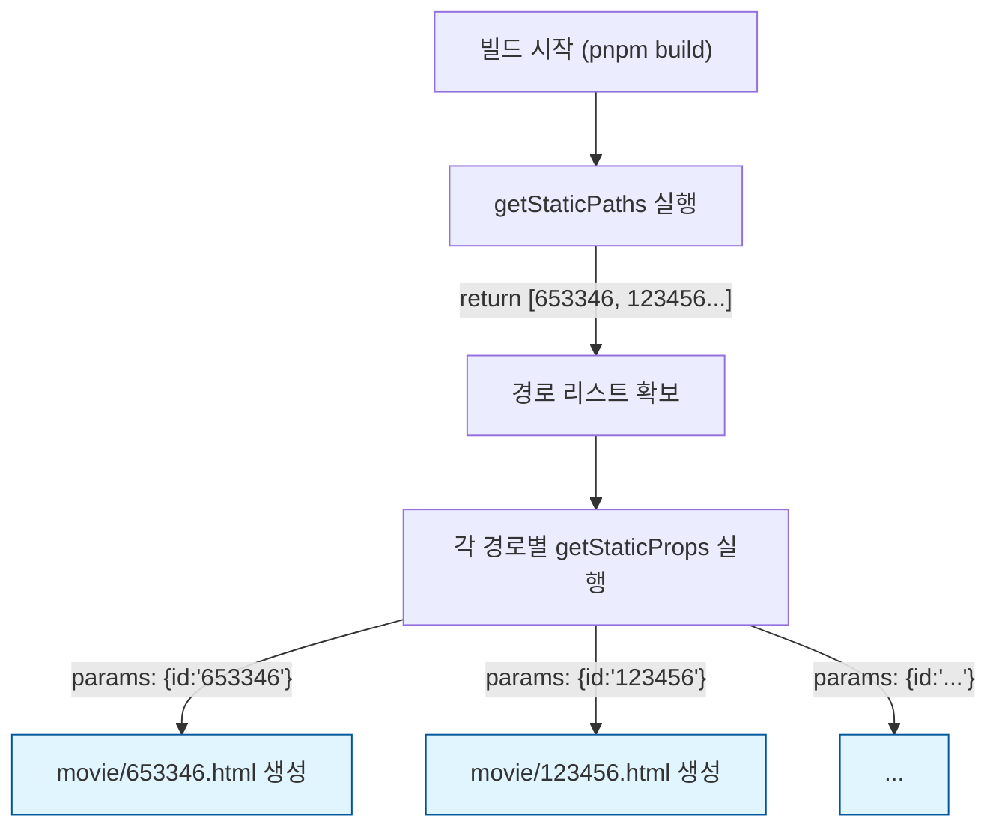

### 2. `getStaticPaths` 실습 (`src/pages/movie/[id].js`)

상세 페이지를 SSG로 변환하기 위해 다음 두 가지 작업을 진행합니다.
1. `getStaticPaths`: 미리 만들 경로 목록 지정 (API에서 상위 10개만 가져옴)
2. `getStaticProps`: 각 경로에 대한 데이터 가져오기

```jsx
// src/pages/movie/[id].js
import MovieDetail from "@/components/MovieDetail";
import { fetchOneMovie, fetchMovies } from "@/lib/movie.server"; // ✅ 서버 코드 사용

export default function Page({ movie }) {
  if (!movie) return <div className="container">영화 정보를 불러오는 중...</div>;

  return (
    <div className="container">
      <MovieDetail {...movie} />
    </div>
  );
}

// 1️⃣ 어떤 경로들을 미리 만들지 설정 (빌드 타임 실행)
export const getStaticPaths = async () => {
  const movies = await fetchMovies();

  // 💡 영화 10개 페이지만 정적으로 생성 (나머지는 fallback 테스트용으로 제외)
  const paths = movies.slice(0, 10).map((movie) => ({
    params: { id: movie.id.toString() },
  }));

  return {
    paths,
    // fallback: false -> 설정하지 않은 경로로 접근하면 404 페이지 반환
    fallback: false,
  };
};

// 2️⃣ 각 경로마다 데이터 가져오기 (빌드 타임 실행)
export const getStaticProps = async (context) => {
  const { id:movieId } = context.params; // getStaticPaths에서 전달된 params

  try {
    const movie = await fetchOneMovie(Number(movieId));

    if (!movie) {
      return { notFound: true };
    }

    return {
      props: { movie },
    };
  } catch {
    return { notFound: true };
  }
};
```

> ⚠️ 주의: params의 값은 반드시 문자열(String)이어야 합니다!{ id: 1 } (X) -> { id: "1" } (O)
> 

### 3. 빌드 결과 확인하기

코드를 저장하고 `pnpm build`를 실행해봅시다.

```bash
pnpm build
```

빌드 결과를 보면 놀라운 변화가 있습니다.

- `● /movie/[id]` (SSG)
    - `● /movie/1168190`
    - `● /movie/840464`
    - `● /movie/1084242`
    … 등등

우리가 지정한 10개의 영화 페이지가 **HTML로 미리 생성**된 것을 확인할 수 있습니다!
(※ ID는 API 데이터에 따라 다를 수 있습니다.)

이제 `pnpm start`로 서버를 켜고 접속해봅시다.
* `/movie/653346` (생성된 ID) → **접속 성공!** (엄청 빠름 ⚡️)
* `/movie/1` (생성 안 된 ID) → **404 Not Found** (설정 안 했고, `fallback: false`라서)

- 단 `/movie/[[…id]].js`로 된(catch-all) 파일이 있으면 안나올 수 있습니다. → 삭제)

### 4. 정리

동적 경로를 SSG로 만들 때는 **`getStaticPaths`**가 필수입니다.
Next.js에게 “이 경로들은 확실하니까 미리 만들어둬!”라고 명단을 주는 것이죠.

## **3-04.** #Quiz **동적 경로와 SSG (getStaticPaths)**

**Q1. `getStaticPaths`의 목적은 무엇인가요?**

- 정답 및 해설
    
    **정답:** 동적 라우트에서 미리 생성할 경로 목록을 Next.js에 알려주는 것입니다.
    
    **해설:** SSG는 빌드 시점에 HTML을 만들어야 합니다. 동적 경로는 경우의 수가 많으므로 `getStaticPaths`로 필요한 경로만 지정합니다.
    
    ```jsx
    export async function getStaticPaths() {
      return {
        paths: [{ params: { id: "1" } }],
        fallback: false,
      };
    }
    ```
    

**Q2. `getStaticPaths`는 언제 실행되나요?**

- 정답 및 해설
    
    **정답:** 빌드 시점에 실행됩니다.
    
    **해설:** `getStaticPaths`는 빌드 과정에서 경로 리스트를 만들고, 그 경로에 대해 `getStaticProps`를 실행하도록 지시합니다.
    

**Q3. `params`의 값은 왜 문자열이어야 하나요?**

- 정답 및 해설
    
    **정답:** URL 경로는 문자열이기 때문입니다.
    
    **해설:** Next.js는 `params` 값을 경로 문자열로 사용합니다. 따라서 `params: { id: "1" }`처럼 문자열로 전달해야 오류를 피할 수 있습니다.
    

**Q4. `fallback: false`에서 지정하지 않은 경로로 접근하면 어떻게 되나요?**

- 정답 및 해설
    
    **정답:** 404 페이지가 표시됩니다.
    
    **해설:** `fallback: false`는 빌드된 경로만 유효하다는 의미입니다. 목록에 없는 경로는 존재하지 않는 페이지로 처리됩니다.
    
    ```jsx
    export async function getStaticPaths() {
      return { paths: [{ params: { id: "1" } }], fallback: false };
    }
    ```
    

---

## **3-05. Fallback 옵션 (false / blocking / true)**

### 1. `fallback: false`의 한계

`fallback: false`는 우리가 앞서 실습한 것처럼, **`paths`에 정의된 경로 외에는 모두 404 에러**를 보냅니다.
하지만 쇼핑몰이나 영화 사이트처럼 데이터가 계속 추가되는 서비스라면 어떨까요?
새로운 영화가 개봉할 때마다 매번 빌드를 다시 할 수는 없습니다.

이럴 때 사용하는 것이 바로 `fallback: blocking`과 `fallback: true`입니다.

### 2. `fallback: "blocking"` (SSR처럼 작동)

이 옵션을 쓰면, `paths`에 없는 ID로 접근했을 때 404를 띄우지 않고 **즉시 SSR처럼 HTML을 생성**해서 보여줍니다.
그리고 생성된 HTML은 저장되어 다음 접속부터는 SSG처럼 빠르게 제공됩니다. (ISG의 기초)

```jsx
fallback: "blocking"
```

- **장점**: 모든 경로에 대응 가능.
- **단점**: 페이지가 생성되는 동안 사용자는 하얀 화면(멈춘 상태)을 보게 됨.

### 3. `fallback: true` (로딩 화면 제공)

`blocking`의 단점을 해결하기 위해, 일단 **“로딩 중…”** 화면을 먼저 보여주고, 데이터 생성이 끝나면 갈아끼워주는 방식입니다.
사용자 경험(UX) 측면에서 가장 좋습니다.

### 4. 실습: `fallback: true` 구현하기

`src/pages/movie/[id].js`를 다음과 같이 수정해봅시다.

```jsx
import { useRouter } from "next/router";
import MovieDetail from "@/components/MovieDetail";
import { fetchOneMovie, fetchMovies } from "@/lib/movie.server"; // ✅ 서버 코드 사용

export default function Page({ movie }) {
  const router = useRouter();

  // ✅ 1. Fallback 상태 체크 (로딩 중일 때 표시할 UI)
  if (router.isFallback) {
    return (
      <div className="container">
        Loading...
      </div>
    );
  }

  if (!movie) return <div className="container">영화 정보를 불러오는 중...</div>;

  return (
    <div className="container">
      <MovieDetail {...movie} />
    </div>
  );
}

// 1️⃣ 어떤 경로들을 미리 만들지 설정 (빌드 타임 실행)
export const getStaticPaths = async () => {
  const movies = await fetchMovies();

  // 💡 실습을 위해 10개 페이지만 정적으로 생성 (나머지는 fallback 테스트용으로 남겨둠)
  const paths = movies.slice(0, 10).map((movie) => ({
    params: { id: movie.id.toString() },
  }));

  return {
    paths,
    // ✅ 2. fallback: true 설정 (설정하지 않은 경로도 로딩 페이지 보여준 후 생성)
    fallback: true,
  };
};

// 2️⃣ 각 경로마다 데이터 가져오기 (빌드 타임 실행 + Fallback 시 서버 실행)
export const getStaticProps = async (context) => {
  const movieId = context.params.id;

  try {
    const movie = await fetchOneMovie(Number(movieId));

    if (!movie) {
      return { notFound: true };
    }

    return {
      props: { movie },
    };
  } catch (error) {
    return { notFound: true };
  }
};
```

<aside>
💡

주의!

fallback: true로 설정된 페이지에서 미리 생성되지 않은 경로에 처음 접근하는 경우, getStaticProps가 실행되는 동안 Page 컴포넌트가 먼저 실행되는데, 이때 movie prop은 undefined 상태입니다.
따라서 router.isFallback 체크가 없다면 에러가 발생할 수 있습니다.

</aside>

### 5. 빌드 및 테스트

이제 빌드(`pnpm build`) 후 실행(`pnpm start`)해서 테스트해봅시다.
1. `getStaticPaths`에 포함되지 않은 경로(예: `/movie/4` 등)로 접속합니다.
2. 아주 잠깐 **“Loading…”** 이 떴다가 영화 정보가 나옵니다.
3. 다시 접속해보면? 이미 생성된 HTML을 쓰기 때문에 로딩 없이 바로 뜹니다!

<aside>
💡

잠깐! 왜 계속 로딩이 뜨나요?개발 모드(pnpm dev)에서는 개발 편의를 위해 매 요청마다 페이지를 새로 만듭니다.
따라서 캐싱이 동작하지 않아 매번 “Loading…”이 보일 수 있습니다.
정상적인 동작을 확인하려면 반드시 빌드(pnpm build) 후 실행(pnpm start) 해주세요!

</aside>

### 6. 요약

| 옵션 | 경로 없을 때 동작 | 특징 | 추천 상황 |
| --- | --- | --- | --- |
| `false` | 404 페이지 | 빌드된 페이지만 제공 | 페이지가 고정적이고 적을 때 |
| `blocking` | SSR (생성 대기) | 생성될 때까지 브라우저 대기 (흰 화면) | 크롤러 친화적이어야 할 때 |
| `true` | Fallback UI (로딩) | 로딩 먼저 보여주고 데이터 채움 | 사용자 경험(UX)이 중요할 때 |

## **3-05.** #Quiz **Fallback 옵션 (false / blocking / true)**

**Q1. `fallback: "blocking"`의 동작 방식은 무엇인가요?**

- 정답 및 해설
    
    **정답:** 요청 시 SSR처럼 페이지를 생성한 뒤 그 결과를 반환합니다.
    
    **해설:** `blocking`은 로딩 UI를 먼저 보여주지 않고 생성이 끝날 때까지 응답을 지연합니다. 처음에는 느릴 수 있지만 생성된 페이지는 캐시되어 이후 요청에 빠르게 제공됩니다.
    
    ```jsx
    export async function getStaticPaths() {
      return { paths: [{ params: { id: "1" } }], fallback: "blocking" };
    }
    ```
    

**Q2. 사용자 경험(UX)을 가장 고려한다면 어떤 옵션을 선택하는 것이 적합한가요?**

- 정답 및 해설
    
    **정답:** `fallback: true`입니다.
    
    **해설:** `true`는 먼저 로딩 UI를 보여주고 데이터 준비 후 화면을 교체합니다. 사용자는 빈 화면 대신 로딩 상태를 확인할 수 있습니다.
    

**Q3. `fallback: true`에서 로딩 상태를 감지하는 방법은 무엇인가요?**

- 정답 및 해설
    
    **정답:** `router.isFallback`을 확인합니다.
    
    **해설:** Page Router에서 `useRouter()`의 `isFallback`이 `true`이면 아직 데이터가 준비되지 않은 상태입니다. 이때 로딩 UI를 렌더링하도록 분기합니다.
    
    ```jsx
    import { useRouter } from "next/router";
    
    export default function Page() {
      const router = useRouter();
      if (router.isFallback) return <div>Loading...</div>;
      return <div>Ready</div>;
    }
    ```
    

**Q4. `fallback: false`를 선택했을 때의 가장 큰 특징은 무엇인가요?**

- 정답 및 해설
    
    **정답:** 빌드된 경로 외에는 모두 404로 처리됩니다.
    
    **해설:** `false`는 경로 목록이 확정적일 때만 사용할 수 있습니다. 동적으로 늘어나는 데이터에는 적합하지 않습니다.
    

---

## **3-06. 증분 정적 재생성 (ISR) ⭐⭐⭐⭐⭐**

### 1. SSG의 한계와 ISR의 등장

SSG는 빠르지만, **빌드하는 시점의 데이터**만 보여준다는 치명적인 단점이 있습니다.
새로운 영화가 추가되거나 평점이 바뀌어도, 다시 빌드하지 않으면 예전 내용 그대로죠.

그렇다고 SSR을 쓰자니 매번 서버를 돌려야 해서 느릴 수 있습니다.
이 두 방식의 장점을 합친 것이 바로 **ISR**입니다.

- **SSG처럼** 미리 만들어둔 HTML을 보여주되,
- **설정한 시간(초)** 이 지나면 다시 데이터를 가져와 최신화(Regeneration)합니다!

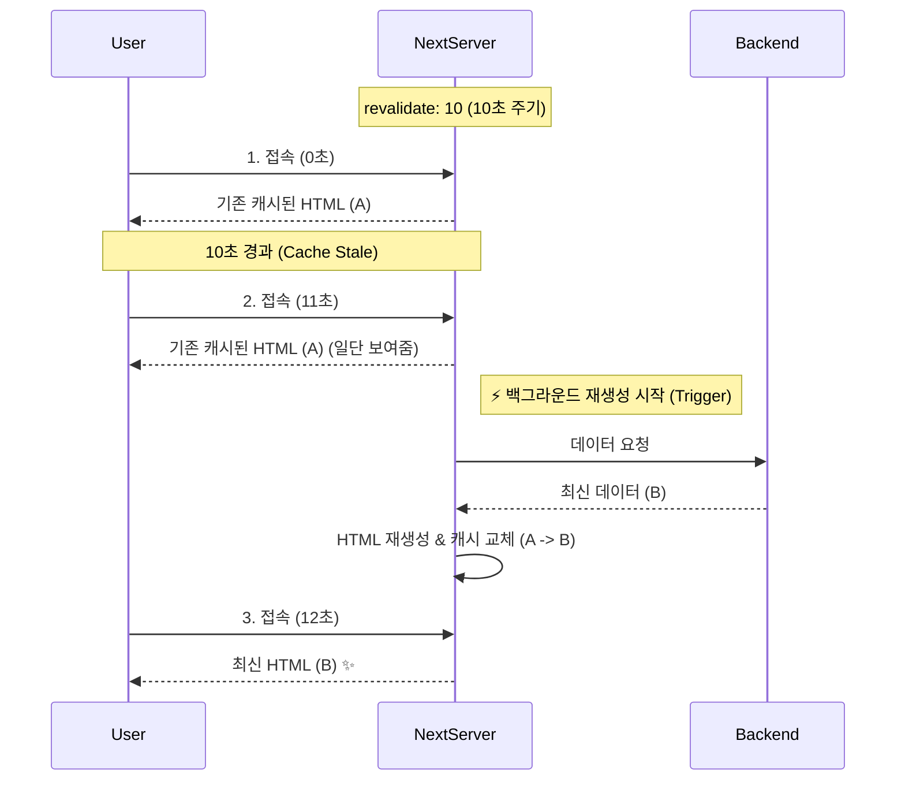

### 2. ISR 적용하기 (`revalidate`)

적용 방법은 매우 간단합니다. `getStaticProps`의 반환값에 **`revalidate`** 옵션만 추가하면 됩니다.

### **STEP 1: 홈 페이지(`index.js`)에 ISR 적용**

`src/pages/index.js` 파일을 열고 다음과 같이 수정합니다.

```jsx
// src/pages/index.js

export const getStaticProps = async () => {
  // ... (데이터 fetching 로직)

  return {
    props: {
      nowPlaying,
      allMovies,
      data: "Next Cinema ISR Mode", // 모드 변경 확인용
    },
    // ✅ ISR 설정: 3초마다 페이지 재생성 (최신 데이터 반영)
    revalidate: 3,
  };
};
```

### **STEP 2: 상세 페이지(`movie/[id].js`)에 ISR 적용**

상세 페이지도 마찬가지로 적용해봅시다.

```jsx
// src/pages/movie/[id].js

export const getStaticProps = async (context) => {
  const movieId = context.params.id;

  // ... (데이터 fetching 로직)

  return {
    props: {
      movie,
    },
    // ✅ 3초마다 업데이트
    revalidate: 3,
  };
};
```

### 3. 테스트 및 확인

ISR은 **프로덕션 환경(`pnpm build` -> `pnpm start`)**에서 동작을 확인할 수 있습니다.

1. `pnpm build`로 빌드합니다.
2. `pnpm start`로 서버를 실행합니다.
3. 웹페이지에 접속해서 평점이나 데이터를 확인합니다.
4. **(가정)** DB(또는 JSON 파일)의 데이터를 직접 수정했다고 칩시다.
5. 새로고침을 합니다. → **여전히 옛날 데이터**가 나옵니다. (SSG 캐시)
6. **3초 뒤**에 다시 새로고침을 합니다. → **변경된 최신 데이터**가 나옵니다! 짠! ✨

이처럼 ISR을 사용하면 **정적 페이지의 빠른 속도**를 유지하면서도 **주기적으로 최신 데이터**를 보여줄 수 있습니다.
쇼핑몰 상품 목록이나 블로그 리스트 등에 아주 유용한 기술입니다.

## **3-06.** #Quiz **증분 정적 재생성 (ISR)**

**Q1. ISR이 SSG와 다른 핵심 차이는 무엇인가요?**

- 정답 및 해설
    
    **정답:** 정해진 주기 이후 자동으로 페이지를 다시 생성한다는 점입니다.
    
    **해설:** SSG는 빌드 시점의 결과가 고정되지만, ISR은 `revalidate` 주기에 맞춰 최신 데이터로 재생성할 수 있습니다.
    

**Q2. ISR을 적용하려면 어디에 `revalidate`를 설정해야 하나요?**

- 정답 및 해설
    
    **정답:** `getStaticProps`의 반환 객체에 설정합니다.
    
    **해설:** `return { props: {...}, revalidate: 3 }`처럼 작성하면 해당 페이지는 정적 페이지 + 주기적 갱신으로 동작합니다.
    
    ```jsx
    export async function getStaticProps() {
      return { props: { /* ... */ }, revalidate: 3 };
    }
    ```
    

**Q3. `revalidate` 시간이 지난 직후 첫 요청은 어떤 동작을 하나요?**

- 정답 및 해설
    
    **정답:** 기존 캐시를 먼저 보여주고, 백그라운드에서 새 페이지를 생성합니다.
    
    **해설:** ISR은 사용자에게 빠른 응답을 제공하고, 동시에 최신 데이터를 반영한 HTML을 재생성하여 이후 요청에 적용합니다.
    

**Q4. ISR이 적합한 페이지 유형의 예시를 하나 들어보세요.**

- 정답 및 해설
    
    **정답:** 상품 목록, 블로그 리스트처럼 가끔 업데이트되는 페이지입니다.
    
    **해설:** 너무 자주 변하지는 않지만 최신성을 어느 정도 보장해야 하는 페이지에 ISR이 적합합니다. 실시간성이 필요하면 SSR이 더 맞고, 완전히 고정된 페이지라면 SSG가 적합합니다.
    

---

## **3-07. On-Demand ISR (주문형 정적 재생성)**

### 1. 시간 기반(Time-based) ISR의 한계

우리가 방금 설정한 `revalidate: 3`은 **3초마다** 최신 여부를 검사합니다.
그런데 만약 게시글 수정이 **24시간 뒤**에 일어난다면?

- 24시간 동안 아무런 데이터 변화가 없어도 불필요하게 체크(Regeneration)할 수 있습니다.
- 반대로, 데이터가 바뀌자마자 **즉시** 보여주고 싶어도 다음 갱신 주기까지 기다려야 합니다.

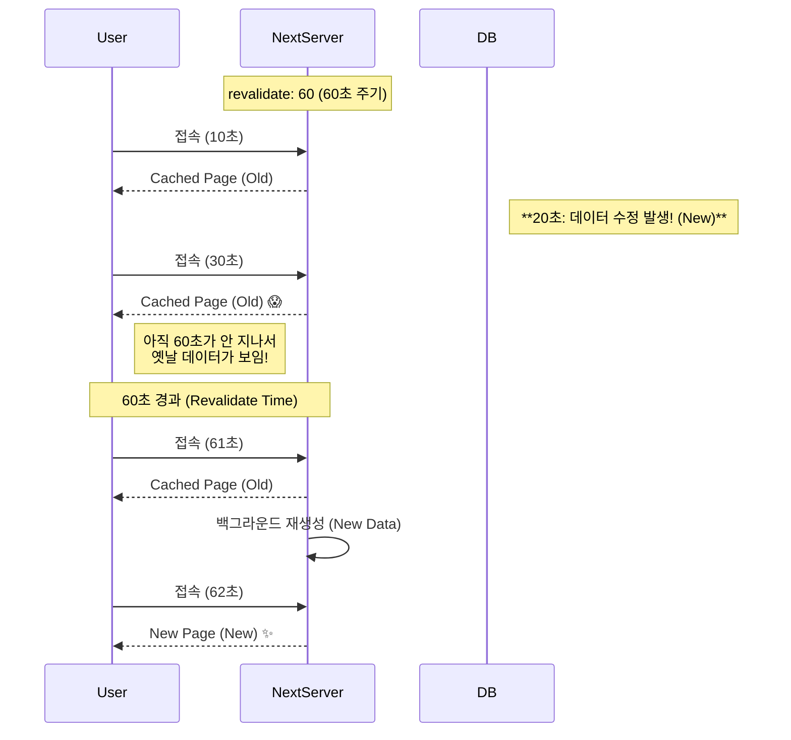

### 2. 해결책: On-Demand ISR (주문형 재생성)

위 그림처럼 60초를 기다려야 하는 문제를 해결하기 위해 **On-Demand ISR**이 등장했습니다.

- Q. ’주문형(On-Demand)’이 무슨 뜻인가요?
    
    <aside>
    💡
    
    쉽게 말해 **“우리가 원할 때마다”** 페이지를 새로고침한다는 뜻입니다.
    
    기존에는 타이머(60초)가 울려야만 업데이트가 됐지만,
    데이터가 바뀌었을 때 (예: 관리자가 ‘수정 저장’ 버튼을 눌렀을 때) 넥스트 서버에게 **“페이지를 다시 생성해줘”** 라고 직접 요청을 보내는 방식입니다.
    
    </aside>
    

### 3. On-Demand ISR 구현하기

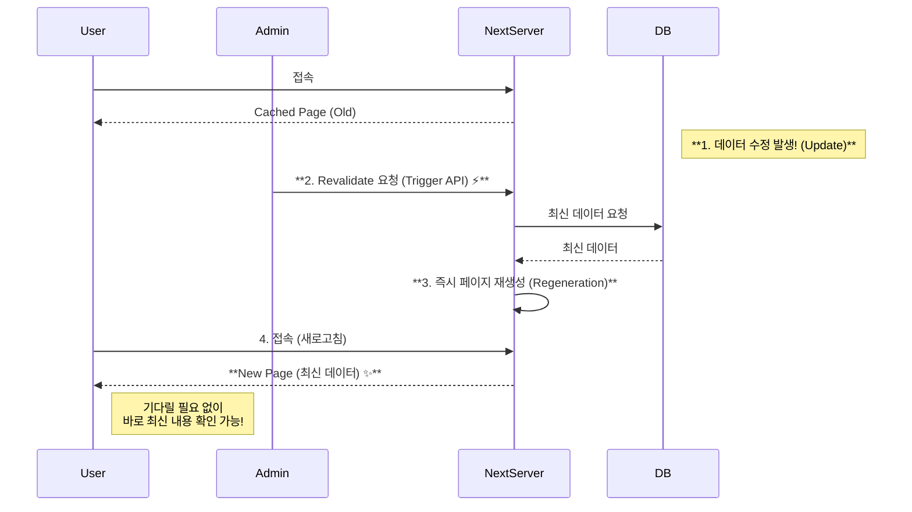

구현 방법은 아주 간단합니다. Next.js의 API Route를 하나 만들어서, 그 안에서 `res.revalidate()` 함수를 호출해주면 됩니다.

### 1) 기존 ISR 설정 끄기

실습을 위해 `src/pages/index.js`의 `revalidate: 3`을 잠시 주석 처리하겠습니다.

```jsx
// src/pages/index.js

export const getStaticProps = async () => {
  // ...
  return {
    props: { ... },
    // revalidate: 3, // ⚠️ On-Demand 실습을 위해 주석 처리 (기본 SSG 모드)
  };
};
```

### 2) API Route 생성 (`src/pages/api/revalidate.js`)

- 파일 이름이 `revalidate` 일 필요는 없습니다. 지금은 테스트를 위해서!

새로운 파일을 만들고 다음 코드를 작성합니다.

`src/pages/api/revalidate.js`

```jsx
// http://localhost:3000/api/revalidate로 접속이 가능합니다.
export default async function handler(req, res) {
  try {
    // 💡 실제로는 보안 토큰을 검사해야 합니다.
    // if (req.query.secret !== process.env.MY_SECRET_TOKEN) { ... }

    // 1️⃣ 인덱스 페이지('/')를 찾아가서 다시 빌드해라! (Regeneration)
    await res.revalidate("/");

    return res.json({ revalidated: true });
  } catch (err) {
    console.error(err);
    return res.status(500).send("Error revalidating");
  }
}
```

**Q. 다른 페이지도 재생성하고 싶다면?**

<aside>
💡

`await res.revalidate("/")` 부분의 경로만 수정하면 됩니다.
단, `/movie/[id]` 같은 동적 페이지는 `/movie/1` 처럼 **실제 존재하는 URL**을 정확히 입력해야 합니다.

</aside>

**더 똑똑하고 안전하게 만들기 (Generic Handler & Security)**

<aside>
💡

실무에서는 아무나 우리 사이트에 들어와서 `재생성 요청`을 마구 보내면 안 되겠죠? (DDoS 공격 위험!)
그래서 **비밀 토큰(Secret Token)** 을 확인하고, **원하는 경로**를 동적으로 받아서 처리하는 것이 정석입니다.

**1. API 코드 수정 예시**

```jsx
export default async function handler(req, res) {
  // 1️⃣ 토큰 검증: 요청에 들어온 토큰이 내 서버의 비밀키와 일치하는지 확인
  // 예: /api/revalidate?token=1234&path=/movie/1
  if (req.query.token !== process.env.ISR_TOKEN) {
    return res.status(401).json({ message: 'Invalid token' });
  }

  // 2️⃣ 경로 받기: 쿼리 스트링으로 path를 받아옴 (없으면 기본값 '/')
  const path = req.query.path || '/';

  try {
    // 3️⃣ 해당 경로 리빌드(Regeneration)
    await res.revalidate(path);
    return res.json({ revalidated: true });
  } catch (err) {
    return res.status(500).send('Error revalidating');
  }
}
```

**2. 검증 흐름 설명**
* **요청**: 관리자(Admin)가 브라우저나 Postman에서 아래 주소를 호출합니다.
`http://localhost:3000/api/revalidate?token=1234&path=/movie/1`
* **검증**: API는 `req.query.token` 값이 환경변수 `process.env.ISR_TOKEN`과 똑같은지 비교합니다.
* **실행**: 똑같다면 `res.revalidate("/movie/1")`을 실행하여 영화 상세 페이지만 쏙 골라서 업데이트합니다. ✨

</aside>

### 3) [심화] 실무 아키텍처: 별도의 Node.js 백엔드 서버가 있다면?

여러분이 풀스택 개발자로서 **Next.js(프론트)** + **Node.js(백엔드)** 조합을 사용한다면 어떻게 해야 할까요?
이때는 **백엔드 서버**가 데이터 저장을 마치고 Next.js에게 **“갱신해!”** 라고 신호를 보내는 방식이 가장 깔끔합니다.

**[데이터 흐름]**
1. **브라우저**: 글 작성 후 백엔드 서버(`localhost:5005`)로 저장 요청
2. **백엔드 서버**:

- (1) DB에 데이터 저장
- (2) 저장이 끝나면 **Next.js의 revalidate 주소**를 호출 (Webhook
- (3) **Next.js**: 신호를 받고 페이지 재생성

**[백엔드 서버 코드 예시 (Express)]**

이 코드는 Next.js가 아니라 **백엔드 서버(Express 등)** 쪽의 코드입니다.

```jsx
// Express 예시 (localhost:5005)
app.post('/api/posts', async (req, res) => {
  // 1. DB에 데이터 저장
  await db.posts.create(req.body);

  // 2. Next.js 서버에게 "페이지 다시 만들어!" 라고 요청 (Webhook)
  // 비밀 토큰과 함께 revalidate API를 찌릅니다.
  await fetch('http://localhost:3000/api/revalidate?token=MY_SECRET_KEY&path=/');

  res.json({ message: "저장 완료" });
});
```

> 📝 요약
Next.js는 “만들어 달라고 하면 만드는 공장” 역할만 하고,
실제 “언제 만들지 결정하는 권한”은 데이터를 관리하는 백엔드 서버가 가집니다.
> 

---

### 4. 테스트 및 확인

On-Demand ISR은 **프로덕션 환경**에서 가장 확실하게 테스트할 수 있습니다.

1. `pnpm build && pnpm start`로 서버를 실행합니다.
2. 홈 페이지(`/`)에 접속합니다. (데이터가 나오죠?)
3. **(가정)** DB 데이터를 수정합니다.
4. 새로고침을 수십 번 해도 **데이터는 바뀌지 않습니다.** (왜? SSG니까요!)
5. 이제 새 탭을 열고 `http://localhost:3000/api/revalidate` 주소로 접속합니다.
6. `{"revalidated": true}` 응답이 오면 성공!
7. 다시 홈 페이지로 돌아와서 **새로고침**을 딱 한 번 해보세요.
8. **즉시 최신 데이터**로 바뀌어 있는 것을 볼 수 있습니다! 🚀

## **3-07.** #Quiz **On-Demand ISR (주문형 정적 재생성)**

**Q1. On-Demand ISR이 필요한 이유는 무엇인가요?**

- 정답 및 해설
    
    **정답:** 시간 기반 ISR은 변경 시점을 즉시 반영하지 못할 수 있기 때문입니다.
    
    **해설:** 데이터가 수정되었는데도 `revalidate` 시간이 남아 있으면 사용자는 오래된 캐시 페이지를 보게 됩니다. On-Demand ISR은 변경 시점에 직접 재생성을 요청해 이 지연을 줄입니다.
    

**Q2. On-Demand ISR은 어떤 방식으로 트리거하나요?**

- 정답 및 해설
    
    **정답:** API Route에서 `res.revalidate(path)`를 호출합니다.
    
    **해설:** 관리자 페이지나 백엔드 서버에서 재생성 API를 직접 호출하여 필요한 순간에 특정 경로를 즉시 갱신할 수 있습니다.
    
    ```jsx
    // src/pages/api/revalidate.js
    export default async function handler(req, res) {
      await res.revalidate("/movie/1");
      return res.json({ revalidated: true });
    }
    ```
    

**Q3. 재생성 API는 왜 보안 처리가 필요한가요?**

- 정답 및 해설
    
    **정답:** 누구나 호출할 수 있으면 악용 위험이 있기 때문입니다.
    
    **해설:** 실무에서는 비밀 토큰을 검증하여 허용된 요청만 재생성하도록 제한합니다. 보안이 없으면 비용 증가와 서비스 장애로 이어질 수 있습니다.
    

**Q4. 동적 페이지를 재생성하려면 어떤 경로를 넘겨야 하나요?**

- 정답 및 해설
    
    **정답:** 실제 존재하는 URL 경로를 전달해야 합니다.
    
    **해설:** `/movie/[id]`처럼 패턴을 넘기면 재생성이 되지 않습니다. `/movie/1`처럼 구체적인 경로로 `res.revalidate()`를 호출해야 합니다.
    
    ```jsx
    await res.revalidate("/movie/1"); // ✅ 실제 경로
    ```
    

---

## **3-08. SEO 설정하기 (Head & Meta Tags)**

### 1. SEO와 Meta Tag

검색 엔진은 페이지의 `<title>`, `<meta name="description">` 같은 정보를 읽고 문서의 주제를 파악합니다.
즉, SEO는 **검색 엔진이 우리 페이지를 더 잘 이해하도록 도와주는 작업**입니다.

### 사전 준비

실습을 위해 `next/head`를 사용할 예정입니다.

### 2. 홈 페이지 SEO (`src/pages/index.js`)

```jsx
import Head from "next/head";

export default function Home() {
  return (
    <>
      <Head>
        <title>Next Cinema | 홈</title>
        <meta name="description" content="Next Cinema 홈 페이지" />
      </Head>
      <main>...</main>
    </>
  );
}
```

### 3. 검색 페이지 SEO (`src/pages/search/index.js`)

```jsx
import Head from "next/head";

export default function SearchPage() {
  return (
    <>
      <Head>
        <title>Next Cinema | 검색</title>
        <meta name="description" content="영화 검색 결과 페이지" />
      </Head>
      <main>...</main>
    </>
  );
}
```

### 4. 상세 페이지 SEO (`src/pages/movie/[id].js`)

```jsx
import Head from "next/head";

export default function MovieDetailPage({ movie }) {
  return (
    <>
      <Head>
        <title>{movie.title} | Next Cinema</title>
        <meta name="description" content={movie.overview} />
      </Head>
      <main>...</main>
    </>
  );
}
```

### 5. 중요한 점: Fallback 상태 처리

동적 페이지는 데이터를 불러오는 동안 `movie`가 `undefined`일 수 있습니다.
이때 메타 태그를 만들면 오류가 나므로, **fallback 상태를 먼저 처리**해야 합니다.

### 6. 정리

- **SEO**: 검색 엔진 최적화를 위해 `<title>`, `<meta>` 태그를 설정해야 합니다.
- **Head 컴포넌트**: `next/head`를 사용하여 각 페이지에서 `<head>` 내용을 수정할 수 있습니다.
- **동적 메타 태그**: SSG/SSR 데이터(`props`)를 활용하여 페이지마다 다른 제목과 설명을 설정합니다.

## **3-08.** #Quiz **SEO 설정하기 (Head & Meta Tags)**

**Q1. `<title>`과 `<meta name="description">`을 설정하는 이유는 무엇인가요?**

- 정답 및 해설
    
    **정답:** 검색 엔진이 페이지 주제를 이해하도록 돕기 위해서입니다.
    
    **해설:** 메타 태그는 검색 결과 제목과 설명에 반영됩니다. 적절한 제목과 설명을 제공하면 검색 결과에서의 노출 품질과 클릭률이 개선됩니다.
    

**Q2. Page Router에서 `<head>`를 수정할 때 사용하는 컴포넌트는 무엇인가요?**

- 정답 및 해설
    
    **정답:** `next/head`의 `Head` 컴포넌트입니다.
    
    **해설:** 각 페이지에서 `Head`를 사용하면 해당 페이지의 `<title>`과 `<meta>` 정보를 설정할 수 있습니다. 페이지마다 다른 메타 정보를 부여할 수 있어 SEO 관리가 쉬워집니다.
    
    ```jsx
    import Head from "next/head";
    
    export default function Page() {
      return (
        <>
          <Head>
            <title>Next Cinema | 홈</title>
            <meta name="description" content="홈 페이지" />
          </Head>
          <main>...</main>
        </>
      );
    }
    ```
    

**Q3. 동적 페이지에서 `movie.title`을 메타 태그로 사용하려면 무엇을 먼저 확인해야 하나요?**

- 정답 및 해설
    
    **정답:** `movie` 데이터가 존재하는지 먼저 확인해야 합니다.
    
    **해설:** Fallback 상태나 데이터 로딩 중에는 `movie`가 `undefined`일 수 있습니다. 이때 바로 접근하면 오류가 나므로 로딩 상태를 먼저 처리해야 합니다.
    
    ```jsx
    if (!movie) return <div>Loading...</div>;
    
    <Head>
      <title>{movie.title}</title>
    </Head>
    ```
    

**Q4. SEO 설정을 페이지 단위로 나누어 관리하는 이유는 무엇인가요?**

- 정답 및 해설
    
    **정답:** 페이지마다 제목과 설명이 달라야 검색 결과가 정확해지기 때문입니다.
    
    **해설:** 동일한 메타 정보가 모든 페이지에 적용되면 검색 엔진이 페이지를 구분하기 어려워지고 SEO 효과가 떨어질 수 있습니다.