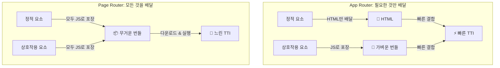
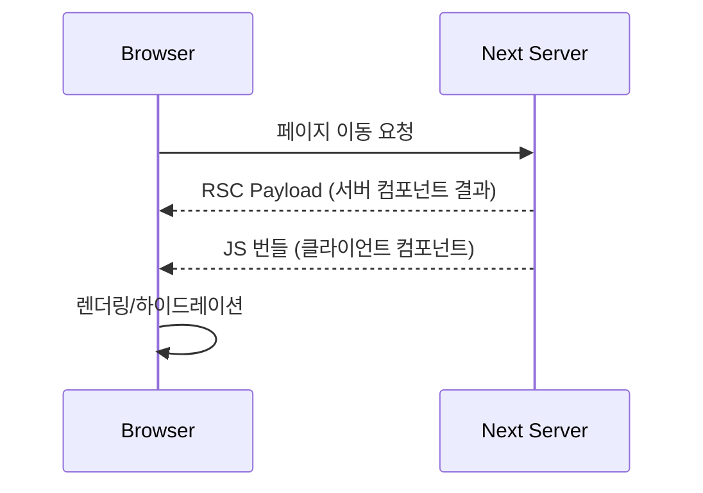
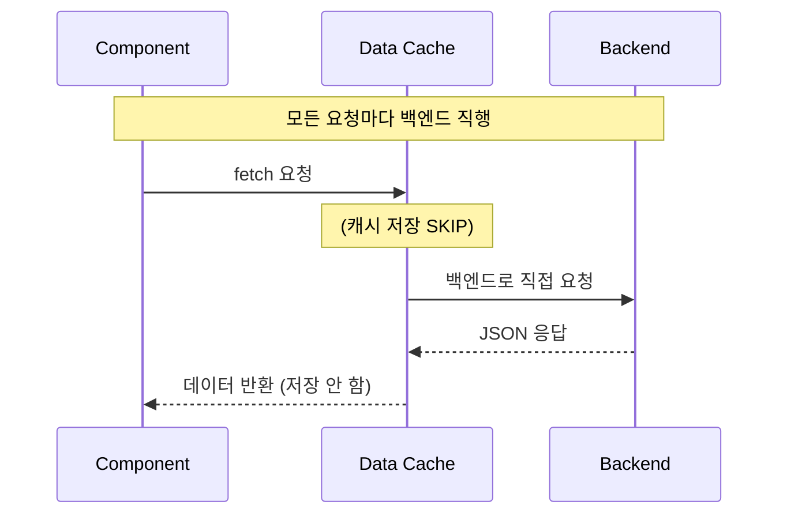
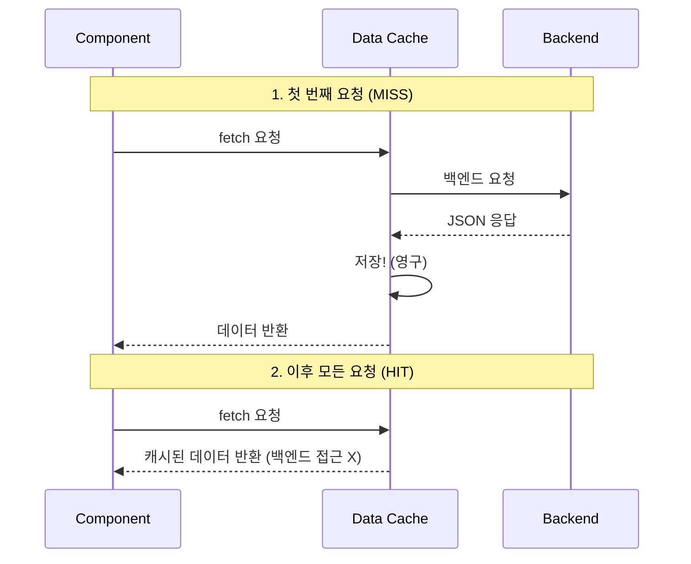
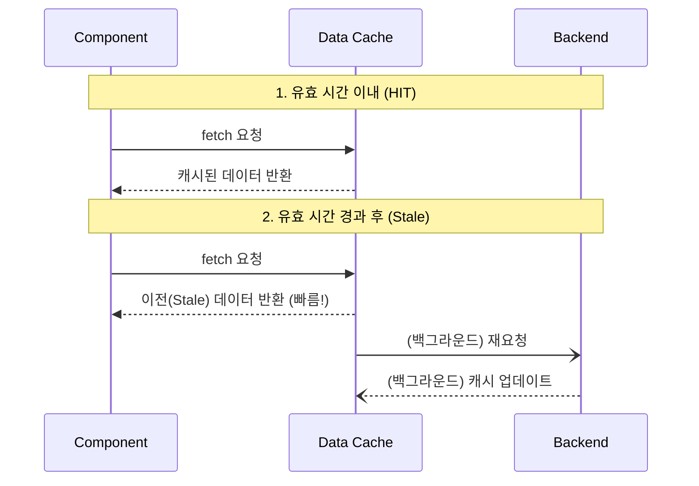
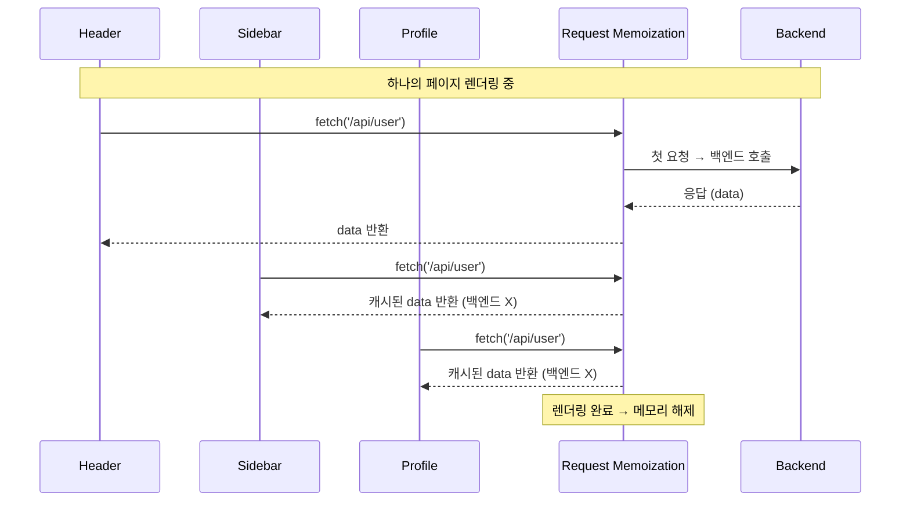
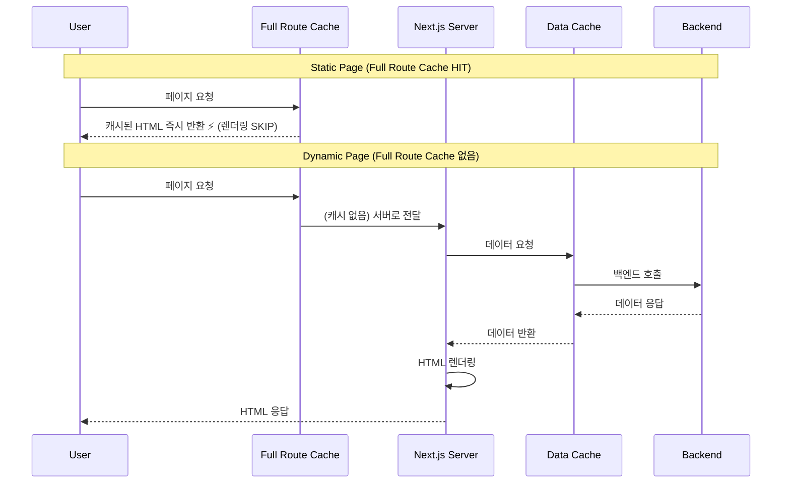
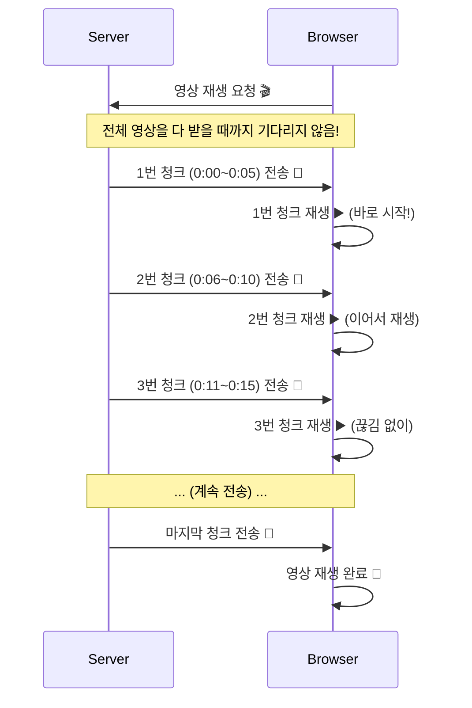
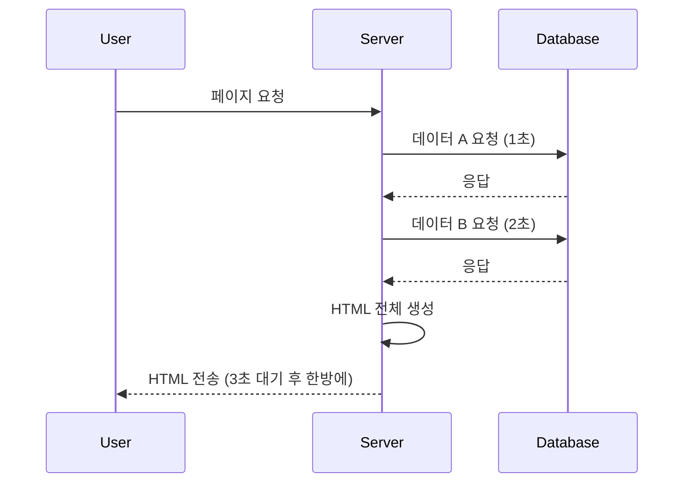
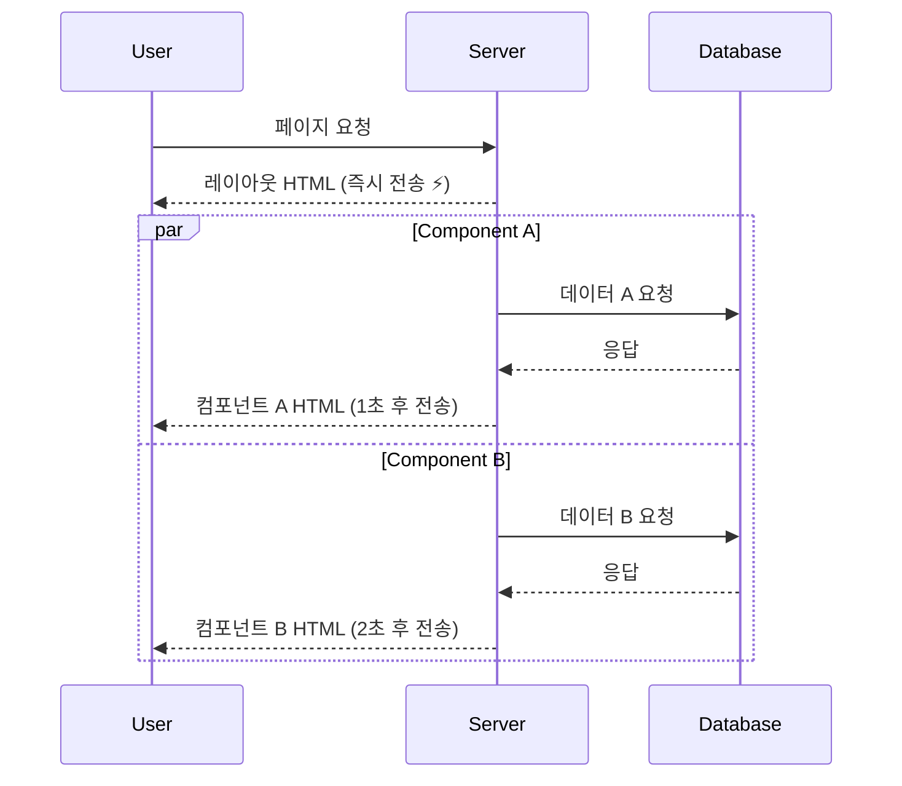

# 25. NextJS로 웹 사이트 만들기(app-router)

# 제 3장: App Router 시작하기

## **3-01. App Router 시작과 페이지 설정하기 ⭐⭐⭐⭐⭐**

### 1. 실습 준비: 백엔드 서버 실행

우리가 직접 만들지는 않고, 미리 준비된 백엔드 서버를 실행해서 사용하겠습니다. 2장(Page Router)에서 사용했던 서버와 동일합니다.

**1. 백엔드 서버 실행**
새로운 터미널을 열고, `codeit-fs-nextjs-backend` 폴더로 이동하여 서버를 켭니다.

```bash
cd codeit-fs-nextjs-backend
code .

pnpm dev
```

**2. 실행 확인**

- **API 서버**: `http://localhost:5005`
- **API 문서 (Swagger)**: `http://localhost:5005/api-docs`

브라우저에서 `http://localhost:5005/api/movies`에 접속했을 때 영화 JSON 데이터가 나오면 성공입니다! 이 서버는 실습 내내 켜두세요.

> [!NOTE]
`http://localhost:5005/api/movies/now-playing`도 정상 응답인지 확인하면 실습이 더 안전합니다.
> 

### 2. Page Router vs App Router: 무엇이 달라졌나요?

App Router는 Next.js 13부터 도입된 **완전히 새로운 라우팅 방식**입니다.

왜 굳이 새로운 방식이 필요했을까요? 기존 Page Router에 어떤 문제가 있었는지부터 살펴봅시다.

### 기존 Page Router의 한계

**1. 브라우저에 너무 많은 코드가 전달됩니다**

Page Router에서는 페이지의 **모든 컴포넌트 코드**가 브라우저로 전송됩니다.

예를 들어 “영화 상세 페이지”를 만들면:

- 영화 정보를 표시하는 `MovieDetail` 컴포넌트
- 리뷰를 보여주는 `ReviewList` 컴포넌트
- 추천 영화를 보여주는 `Recommendations` 컴포넌트

이 모든 코드가 **JavaScript 번들**에 담겨 사용자의 브라우저로 다운로드됩니다.

> **문제:** 페이지가 복잡해질수록 번들 크기가 커지고, 사용자는 **더 오래 기다려야** 합니다.
> 

**2. 데이터를 가져오는 방법이 제한적입니다**

Page Router에서 서버 데이터를 가져오려면 반드시 **페이지 최상단**에서 `getServerSideProps`나 `getStaticProps`를 사용해야 합니다.

```jsx
// Page Router 방식 (페이지 레벨에서만 데이터 페칭 가능)
export async function getServerSideProps() {
  const movie = await fetchMovie();
  const reviews = await fetchReviews();
  const recommendations = await fetchRecommendations();

  return { props: { movie, reviews, recommendations } };
}

export default function MoviePage({
  movie,
  reviews,
  recommendations,
}) {
  // 데이터를 props로 계속 내려줘야 함
  return (
    <div>
      <MovieDetail movie={movie} />
      <ReviewList reviews={reviews} />
      <Recommendations items={recommendations} />
    </div>
  );
}
```

> **문제:** 컴포넌트가 직접 데이터를 가져올 수 없고, **페이지에서 모든 데이터를 모아서 props로 전달**해야 합니다. 이를 “Props Drilling(프롭스 지옥)”이라고 부릅니다.
> 

---

### App Router가 해결하는 방법

**1. 서버 컴포넌트로 번들 크기 감소**

App Router는 **서버 컴포넌트(Server Component)**를 기본으로 사용합니다.

서버 컴포넌트는 **서버에서만 실행**되고, 브라우저로 JavaScript 코드가 전송되지 않습니다.

```jsx
// App Router 방식 (서버 컴포넌트)
export default async function MovieDetail({ id }) {
  const movie = await fetch(`/api/movies/${id}`); // 서버에서 실행

  return<div>{movie.title}</div>; // HTML만 브라우저로 전송
}
```

> **결과:** 버튼 클릭, 입력창 같은 **상호작용이 필요한 부분만** 브라우저로 보내면 됩니다.
> 
> 
> 나머지는 **HTML만 전송**되므로 번들 크기가 크게 줄어듭니다.
> 

**2. 컴포넌트가 직접 데이터를 가져옵니다**

App Router에서는 **각 컴포넌트가 필요한 데이터를 직접 가져올 수 있습니다.**

```jsx
// 각 컴포넌트가 독립적으로 데이터 페칭
async function MovieDetail({ id }) {
  const movie = await fetch(`/api/movies/${id}`);
  return <div>{movie.title}</div>;
}

async function ReviewList({ movieId }) {
  const reviews = await fetch(
    `/api/reviews?movie=${movieId}`,
  );
  return (
    <ul>
      {reviews.map((r) => (
        <li key={r.id}>{r.content}</li>
      ))}
    </ul>
  );
}

// 페이지는 조립만 담당
export default async function MoviePage({ params }) {
  const { id } = await params;

  return (
    <div>
      <MovieDetail id={id} />
      <ReviewList movieId={id} />
    </div>
  );
}
```

> **결과:** props를 계속 내려줄 필요 없이, **데이터가 필요한 컴포넌트가 직접 가져옵니다.**
> 

---

### 정리: Page Router vs App Router

| 구분 | Page Router | App Router |
| --- | --- | --- |
| **기본 컴포넌트** | 클라이언트 컴포넌트 | 서버 컴포넌트 |
| **JS 번들 크기** | 모든 코드 포함 (큼) | 상호작용 코드만 포함 (작음) |
| **데이터 페칭** | 페이지 레벨에서만 가능 | 컴포넌트 레벨에서 가능 |
| **학습 곡선** | 익숙함 | 새로운 개념 필요 |

> **핵심 메시지**
> 
> 
> App Router는 “거의 새로운 프레임워크”처럼 느껴질 수 있습니다.
> 
> 하지만 **라우팅, 사전 렌더링 같은 핵심 개념은 동일**합니다.
> 
> 기존 지식 위에 **“서버 컴포넌트”라는 강력한 도구**를 하나 더 배우는 것이라고 생각하면 됩니다.
> 

### 3. App Router는 무엇인가요?

App Router는 `app/` 폴더 구조를 기준으로 페이지 라우팅을 구성하는 방식입니다. Next.js 13부터 도입되었고, 최신 안정판(16+)에서도 기본 라우터로 사용됩니다.

**핵심 규칙**

- `app/` 폴더 아래에서 **`page.js` 파일만** 페이지로 인식합니다.
- `layout.js`는 해당 경로의 공통 레이아웃을 담당합니다.

### 4. 폴더 구조로 라우팅 이해하기

App Router는 파일명이 아니라 **폴더 구조**로 라우팅을 결정합니다.

```
src/app
 ├── page.js            -> /
 ├── search
 │   └── page.js        -> /search
 └── movie
     └── [id]
         └── page.js    -> /movie/:id
```

/%E1%84%89%E1%85%B3%E1%84%8F%E1%85%B3%E1%84%85%E1%85%B5%E1%86%AB%E1%84%89%E1%85%A3%E1%86%BA_2026-02-04_09.10.12.png)

**주의:** `search.js` 같은 파일은 페이지가 되지 않습니다. 반드시 `page.js`로 만들어야 합니다.

---

### 5. 실습 프로젝트 생성

이번 장에서는 App Router 기반의 새 프로젝트를 생성하고 기본 구조를 확인합니다. 패키지 매니저는 `pnpm`을 사용합니다.

**설치 명령어**
터미널에 다음 명령어를 입력하세요. (`--use-pnpm` 옵션을 사용합니다)

```bash
npx create-next-app@latest learn-app-router --use-pnpm
```

**설치 옵션 질문 가이드**

- Would you like to use the recommended Next.js defaults? -> **No, customize settings** (상황에 따라 안나올 수 있음)
- Would you like to use TypeScript? -> **No**
- Which linter would you like to use? -> **ESLint**
- Would you like to use React Compiler? -> **YES**
- Would you like to use Tailwind CSS? -> **No** (우리는 vanilla-extract를 사용할 것입니다)
- Would you like your code inside a `src/` directory? -> **Yes**
- Would you like to use App Router? -> **Yes**
- Would you like to use Turbopack for `next dev`? -> **No** (Webpack 사용)
- Would you like to customize the default import alias? -> **No**

**프로젝트 생성 결과 확인**
터미널에 `Success! Created learn-app-router ...` 메시지가 보이면 생성이 완료된 상태입니다.

**질문:** 왜 옵션을 이렇게 고정하나요?
**이유:** 실습은 JavaScript와 App Router를 기준으로 진행하며, 스타일링은 vanilla-extract를 사용할 예정이기 때문입니다.

**주의:** Next.js 16부터 `next dev/build`는 **Turbopack이 기본**입니다. 이 교재는 **vanilla-extract의 Webpack 플러그인**을 사용하므로 **Webpack 고정**이 필요합니다.

따라서 `dev/build` 스크립트에 `--webpack`이 포함되어 있는지 확인합니다.

### 5-1. 에디터 설정 (`jsconfig.json`)

`create-next-app`으로 설치했을 때, `jsconfig.json` 파일이 자동으로 생성되지 않을 수 있습니다.
우리가 사용하는 절대 경로(`@/*`)가 VS Code 등 에디터에서 제대로 인식되도록, 프로젝트 루트에 `jsconfig.json` 파일을 직접 만들어주어야 합니다.

**`jsconfig.json`**

```json
{
  "compilerOptions": {
    "target": "esnext",
    "lib": ["dom", "dom.iterable", "esnext"],
    "allowJs": true,
    "noEmit": true,
    "jsx": "preserve",
    "isolatedModules": true,
    "resolveJsonModule": true,
    "module": "esnext",
    "moduleResolution": "bundler",
    "skipLibCheck": true,
    "strict": false,
    "paths": {
      "@/*": ["./src/*"]
    }
  },
  "include": ["next-env.d.ts", "**/*.js", "**/*.jsx"],
  "exclude": ["node_modules"]
}
```

> **설정값 상세 설명**
> 
> 
> 
> | 옵션 | 설명 |  |
> | --- | --- | --- |
> | **`compilerOptions`** | 자바스크립트 컴파일러 옵션을 설정합니다. |  |
> | `target` | `esnext` | 빌드할 JS 버전을 최신(`esnext`)으로 설정합니다. |
> | `lib` | `dom`, `esnext` 등 컴파일에 포함할 라이브러리 목록입니다. 브라우저 API 자동완성에 필수입니다. |  |
> | `allowJs` | `true`로 설정하면 자바스크립트 파일도 컴파일 대상으로 인식합니다. (JS 프로젝트에는 필수) |  |
> | `noEmit` | `true`로 설정하면 결과물(JS 파일)을 생성하지 않습니다. (Next.js가 빌드를 담당하므로 에디터는 분석만 수행) |  |
> | `jsx` | JSX 코드를 어떻게 처리할지 설정합니다. `preserve`는 Next.js가 처리하도록(변환하지 않고) 둡니다. |  |
> | `isolatedModules` | 각 파일을 개별 모듈로 변환 가능하게 만듭니다. Next.js 빌드 최적화에 필요합니다. |  |
> | `resolveJsonModule` | `.json` 파일을 모듈처럼(`import data from './data.json'`) 불러올 수 있게 합니다. |  |
> | `module` | 모듈 시스템을 지정합니다. `esnext`는 최신 표준 모듈 방식을 따릅니다. |  |
> | `moduleResolution` | 모듈을 찾는 방식을 결정합니다. `bundler`는 Webpack 같은 번들러가 처리함을 의미합니다. |  |
> | `skipLibCheck` | 라이브러리 정의 파일(`*.d.ts`)의 타입 검사를 건너뛰어 성능을 높입니다. |  |
> | `strict` | 엄격한 타입 검사를 활성화 여부입니다. JS 프로젝트이므로 `false`로 두어 유연하게 사용합니다. |  |
> | `paths` | `@/*` 같은 경로 별칭(Alias)을 설정하여 `../../` 지옥을 방지합니다. |  |
> | **`include`** | `**/*.js`, `**/*.jsx` 등 프로젝트 내의 분석할 파일 패턴을 지정합니다. (`.css.js` 인식에 중요) |  |
> | **`exclude`** | `node_modules` 등 분석에서 제외할 폴더를 지정하여 성능 저하를 막습니다. |  |

### 5-2. 스타일링 도구 설정 (Vanilla Extract)

우리는 **빌드 타임에 CSS를 생성하는 스타일링 도구**인 **Vanilla Extract**를 사용할 것입니다.
(작성은 JS로 하지만, 실제로는 CSS 파일이 생성되어 **성능이 매우 뛰어납니다.**)

**1) 패키지 설치**
우리는 `.css.js` 확장자를 사용하므로 TypeScript 설정이 따로 필요 없습니다.
하지만 `pnpm workspace` 관련 에러 방지를 위해 workspace 설정은 해제해줍니다.

```bash
cd learn-app-router
# (선택) pnpm workspace 설정 파일이 있다면 삭제합니다.
rm -f pnpm-workspace.yaml
# 윈도우 사용자는 파일 탐색기에서 직접 삭제해주세요.
pnpm add @vanilla-extract/css @vanilla-extract/next-plugin
```

> **Tip:**`pnpm approve-builds` 실행 후 선택 화면이 나타나면:
> 
> 1. **`a`** 키를 눌러 전체 선택 (Select All)
> 2. **`Enter`** 키를 눌러 승인

**2) 실행 스크립트 확인/수정 (`package.json`)**`create-next-app --webpack`을 사용했다면 아래처럼 `dev/build`가 이미 설정되어 있습니다.

다른 값이면 아래와 같이 수정합니다.

`package.json` 파일을 열고 `scripts`를 다음과 같이 수정하세요:

```json
"scripts": {
  "dev": "next dev --webpack",
  "build": "next build --webpack",
  "start": "next start",
  "lint": "eslint .",
  "format": "prettier --write .",
  "format:check": "prettier --check ."
},
```

**3) Next.js 설정 (`next.config.mjs`)**
프로젝트 루트의 `next.config.mjs` 파일을 열고 다음과 같이 수정합니다.

```jsx
import { createVanillaExtractPlugin } from "@vanilla-extract/next-plugin";

const withVanillaExtract = createVanillaExtractPlugin();

/**@type {import('next').NextConfig} */
const nextConfig = {
  reactStrictMode: true,
  reactCompiler: true,
};

export default withVanillaExtract(nextConfig);
```

### 5-3. 프로젝트 실행

**Prettier 설정**
프로젝트 루트에 `.prettierrc` 파일을 만들고 아래 내용을 복사해 넣으면 코드가 예쁘게 정리됩니다.

**1) Prettier 및 eslint 설치**

```bash
pnpm add -D prettier @eslint/js
```

**2) `.prettierrc` 생성**

```json
{
  "semi": true,
  "singleQuote": true,
  "tabWidth": 2,
  "trailingComma": "all",
  "printWidth": 80
}
```

**3) `eslint.config.mjs` 수정**

```jsx
import { defineConfig, globalIgnores } from 'eslint/config';
import nextVitals from 'eslint-config-next/core-web-vitals';
import js from '@eslint/js';

const eslintConfig = defineConfig([
  js.configs.recommended,
  ...nextVitals,
  // Override default ignores of eslint-config-next.
  globalIgnores([
    // Default ignores of eslint-config-next:
    '.next/**',
    'out/**',
    'build/**',
    'next-env.d.ts',
  ]),
]);

export default eslintConfig;
```

---

### 6. 실습: 프로젝트 구조 확인

생성이 끝나면 다음과 같은 구조가 만들어집니다.

```
learn-app-router/
 ├── src/
 │   └── app/
 │       ├── layout.js
 │       ├── page.js
 │       ├── globals.css
 │       └── page.module.css
 └── package.json
```

**확인 포인트**

- `src/app` 폴더가 있는지 확인합니다.
- `layout.js`와 `page.js`가 생성되어 있으면 정상입니다.

---

### 7. 실습: 개발 서버 실행

**1) 개발 서버 실행**

```bash
pnpm dev
```

브라우저에서 `http://localhost:3000`으로 접속하면 기본 화면이 표시됩니다.

**주의:** 개발 서버를 종료하려면 터미널에서 `Ctrl + C`를 누릅니다.

---

### 8. 실습: 기본 템플릿 정리

App Router의 라우팅 흐름을 명확히 보기 위해 템플릿 코드를 정리합니다.

**1) 기존 스타일 파일 삭제**`create-next-app`으로 생성된 기본 스타일 파일을 삭제합니다. 우리는 vanilla-extract를 사용해 체계적으로 스타일을 관리할 것입니다.

- `src/app/globals.css`: **삭제**
- `src/app/page.module.css`: **삭제**

**`src/app/layout.js` 수정**

기존 폰트 설정과 `globals.css` import를 제거합니다.

```jsx
// 아래 내용을 모두 삭제합니다
import { Geist, Geist_Mono } from "next/font/google";
import "./globals.css";

const geistSans = Geist({
  variable: "--font-geist-sans",
  subsets: ["latin"],
});

const geistMono = Geist_Mono({
  variable: "--font-geist-mono",
  subsets: ["latin"],
});
```

또한, `<body>` 태그의 `className`도 제거합니다.

```jsx
// 변경 전
<body className={`${geistSans.variable}${geistMono.variable}`}>

// 변경 후
<body>
```

**`src/app/page.js` 수정**

기존 스타일 import와 내용을 정리합니다.

```jsx
// 아래 import를 삭제합니다
import styles from "./page.module.css";
```

`page.js`의 기존 내용을 모두 지우고 아래처럼 간단히 시작합니다.

```jsx
export default function Home() {
  return<div>홈 페이지</div>;
}
```

**2) 전역 스타일 설정**
스타일 관련 파일을 모아두기 위해 `src/styles` 폴더를 만들고, 전역 스타일을 정의합니다.

**폴더 생성**

```bash
mkdir src/styles
```

**`src/styles/globals.css.js` 생성**

```jsx
import { globalStyle } from "@vanilla-extract/css";

globalStyle("html, body", {
  margin: 0,
  padding: 0,
});

globalStyle("a", {
  textDecoration: "none",
  color: "inherit",
});

globalStyle("*", {
  boxSizing: "border-box",
});
```

**`src/styles/reset.css.js` 생성**

브라우저 기본 스타일을 초기화하여 일관된 시작점을 만듭니다.

```jsx
import { globalStyle } from "@vanilla-extract/css";

// 기본 여백 초기화
globalStyle(
  "h1, h2, h3, h4, h5, h6, p, ul, ol, li, figure, blockquote",
  {
    margin: 0,
    padding: 0,
  },
);

// 리스트 스타일 초기화
globalStyle("ul, ol", {
  listStyle: "none",
});

// 버튼 초기화
globalStyle("button", {
  background: "none",
  border: "none",
  padding: 0,
  cursor: "pointer",
  font: "inherit",
  color: "inherit",
});

// 입력 필드 초기화
globalStyle("input, textarea", {
  font: "inherit",
});

// 이미지 초기화
globalStyle("img", {
  maxWidth: "100%",
  display: "block",
});
```

**3) 루트 레이아웃에 적용 (`src/app/layout.js`)**
방금 만든 전역 스타일을 불러오도록 `layout.js`를 수정합니다. 기존 `import "./globals.css"`는 지우고 새로 만든 파일을 불러옵니다.

```jsx
import "@/styles/reset.css.js";
import "@/styles/globals.css.js";
```

**3) App Router 라우팅 규칙**

App Router에서는 **폴더 구조가 곧 URL 경로**입니다.

| 파일 경로 | URL |
| --- | --- |
| `src/app/page.js` | `/` |
| `src/app/about/page.js` | `/about` |
| `src/app/movie/[id]/page.js` | `/movie/123` (동적 라우트) |

**핵심 규칙:**

- `page.js` 파일만 페이지로 인식됩니다
- 폴더 이름 = URL 세그먼트
- `[대괄호]`로 감싸면 동적 파라미터가 됩니다 (예: `[id]` → `params.id`)

**Page Router vs App Router 비교**

| 구분 | Page Router (`pages/`) | App Router (`app/`) |
| --- | --- | --- |
| **페이지 파일** | `파일명.js`가 URL이 됨 | `page.js`만 페이지로 인식 |
| **예시** | `pages/about.js` → `/about` | `app/about/page.js` → `/about` |
| **레이아웃** | `_app.js`, `_document.js` | `layout.js` (폴더별 중첩 가능) |
| **동적 라우트** | `[id].js` | `[id]/page.js` |

> **Tip:왜 `page.js`로 통일했을까?**
> 
> 
> 폴더 안에 `page.js`, `layout.js`, `loading.js`, `error.js` 등 **역할별 파일을 분리**할 수 있어서
> 
> 각 파일의 책임이 명확해지고, 컴포넌트나 유틸리티 파일과 혼동되지 않습니다.
> 

---

**4) Route Group 기본 구조 만들기**

<aside>
💡

**Route Group이란?**

폴더 이름을 `(소괄호)`로 감싸면 **URL 경로에는 포함되지 않는 “그룹 폴더”**가 됩니다.

- `src/app/(with-searchbar)/page.js` → URL: `/` (괄호 부분 생략)
- `src/app/(with-searchbar)/search/page.js` → URL: `/search`

**용도:** 같은 레이아웃을 공유할 페이지들을 그룹으로 묶을 때 사용합니다.

예를 들어, 검색바가 필요한 페이지(홈, 검색)와 필요 없는 페이지(영화 상세)를 분리할 수 있습니다.

*(Route Group에 대한 자세한 설명은 3-02에서 다룹니다.)*

</aside>

검색바가 필요한 페이지는 `(with-searchbar)` 그룹 아래에 배치합니다.

먼저 폴더를 만들고, 기본 `src/app/page.js`가 있다면 제거합니다.

```bash
mkdir -p "src/app/(with-searchbar)"
rm -f src/app/page.js
```

> **주의:zsh 사용자는 괄호가 글로브로 해석됩니다.**
> 
> 
> 위처럼 경로를 따옴표로 감싸서 실행하세요.
> 

**5) 홈 페이지 단순화**`src/app/(with-searchbar)/page.js`를 아래처럼 작성합니다.

```jsx
export default function Home() {
  return<div>홈 페이지</div>;
}
```

**확인:** 브라우저를 새로고침하면 **홈 페이지** 텍스트가 표시됩니다.

---

### 9. 실습: 라우팅 맛보기

**1) `/search` 페이지 만들기**`src/app/(with-searchbar)/search/page.js` 파일을 생성합니다.

```jsx
export default async function SearchPage({ searchParams }) {
  const { q = "" } = await searchParams;
  const keyword = typeof q === "string" ? q : "";

  return<div>검색어: {keyword}</div>;
}
```

**확인:** `http://localhost:3000/search`로 접속하면 **검색 페이지**가 표시됩니다.

**2) 쿼리 스트링 사용하기**
쿼리 스트링은 라우팅에 영향을 주지 않습니다. 페이지 컴포넌트가 받는 `searchParams`를 **await**로 풀어 사용합니다.

**예시 URL**

```
http://localhost:3000/search?q=action
```

**코드**

위에서 작성한 `SearchPage` 컴포넌트가 쿼리 스트링을 처리합니다.

**출력 결과:**

```
검색어: action
```

**주의:** `params`와 `searchParams`는 **Promise**로 전달됩니다.

따라서 `const { id } = await params;`처럼 **await 후 객체에서 꺼내** 사용합니다.

---

### 10. 실습: 동적 라우트 만들기

**1) `/movie/[id]` 페이지 만들기**
동적 경로는 폴더 이름을 대괄호로 감싸서 만듭니다.

```
src/app/movie/[id]/page.js
```

> **주의:zsh 사용자는 대괄호가 글로브로 해석됩니다.**
> 
> 
> 폴더를 만들 때는 `mkdir -p "src/app/movie/[id]"`처럼 따옴표로 감싸세요.
> 

```jsx
export default async function MoviePage({ params }) {
  const { id } = await params;

  return<div>영화 ID: {id}</div>;
}
```

**확인:** `http://localhost:3000/movie/123`으로 접속하면 `영화 ID: 123`이 표시됩니다.

**2) Catch-all 라우트 (참고)**

여러 단계의 경로를 한 페이지에서 처리하려면 `[...slug]` 형태를 사용합니다.

```
src/app/docs/[...slug]/page.js
```

```jsx
export default async function DocsPage({ params }) {
  const { slug } = await params;
  // /docs/guide/intro → slug = ["guide", "intro"]

  return<div>문서 경로: {slug.join("/")}</div>;
}
```

> **Tip:**
Catch-all은 문서 사이트, 블로그 등에서 유용합니다.
> 
> 
> 이 교재에서는 사용하지 않으므로 **개념만 알아두세요**.
> 
> 위 코드를 실습해봤다면 아래 명령어로 삭제합니다:
> 
> ```bash
> rm -rf src/app/docs
> ```
> 

---

### 11. 정리

| 개념 | 설명 |
| --- | --- |
| App Router | `app/` 폴더 기반 라우팅 방식입니다. |
| `page.js` | 라우트의 실제 페이지 파일입니다. |
| `layout.js` | 공통 UI 구조를 정의하는 파일입니다. |
| `searchParams` | 쿼리 스트링 값을 담은 **객체의 Promise**입니다. |
| `params` | 동적 경로 값을 담는 **객체의 Promise**입니다. |

## **3-01.** #Quiz **App Router 기본 라우팅**

**Q1. App Router에서 실제 페이지로 인식되는 파일명은 무엇인가요?**

- 정답 및 해설
    
    **정답:** `page.js` 입니다.
    
    **해설:** App Router는 **폴더 경로 + `page.js`** 조합으로 라우트를 결정합니다. `layout.js`, `loading.js`, `error.js` 같은 파일은 **페이지가 아니라 보조 역할**이며, `search.js`처럼 임의 이름의 파일은 라우트로 인식되지 않습니다.
    

**Q2. 동적 라우트(`/movie/[id]`)에서 `id` 값은 어떤 prop으로 받나요?**

- 정답 및 해설
    
    **정답:** `params` 입니다.
    
    **해설:** 동적 세그먼트 값은 `params`로 전달됩니다. 서버 컴포넌트에서는 `const { id } = await params;`처럼 **await 후 객체에서 꺼내** 사용합니다. 예: `/movie/123` 접속 시 `id`는 `"123"` (문자열)입니다.
    

**Q3. 쿼리 스트링 값은 App Router에서 어떤 prop으로 받고, 서버 컴포넌트에서는 어떻게 사용해야 하나요?**

- 정답 및 해설
    
    **정답:** `searchParams`로 받으며, 서버 컴포넌트에서는 **`await`로 풀어** 사용합니다.
    
    **해설:** Next.js 15+에서 `params`/`searchParams`는 **Promise**로 전달됩니다. Next.js 16부터는 **동기 접근이 제거**되어 `await` 또는 `React.use()`로만 접근해야 합니다. 따라서 `const { q } = await searchParams;`처럼 **await 후 객체에서 꺼내** 사용합니다. 쿼리 스트링이 반복되면 `q`가 배열일 수 있으므로, **문자열일 때만 사용**하도록 `typeof q === 'string' ? q : ''` 형태로 처리합니다.
    

**Q4. `/about` 페이지를 만들려면 App Router에서는 어떤 폴더/파일 구조를 사용해야 하나요?**

- 정답 및 해설
    
    **정답:** `src/app/about/page.js`
    
    **해설:** App Router는 **폴더 구조가 곧 URL**입니다. `about` 폴더 안의 `page.js`가 `/about` 경로를 담당합니다.
    

**Q5. App Router에서 `layout.js`의 역할은 무엇인가요?**

- 정답 및 해설
    
    **정답**: 해당 경로(폴더) 아래 페이지에 **공통 UI 구조를 적용**하는 파일입니다.
    
    **해설**: `layout.js`는 하위 페이지를 감싸는 레이아웃이며, 반드시 `{children}`을 포함해야 페이지가 표시됩니다.
    

## **3-02. 레이아웃 설정하기**

### 1. 레이아웃 기본 개념

App Router에서 `layout.js`는 **해당 폴더 아래의 모든 페이지에 공통으로 적용되는 UI 틀**입니다.

**핵심 규칙**

- `src/app/layout.js`는 **루트 레이아웃**이며 반드시 존재해야 합니다.
- `layout.js`가 있는 폴더 아래의 페이지에 **자동으로 적용**됩니다.
- 레이아웃 컴포넌트 안에는 반드시 `{children}`이 있어야 페이지가 표시됩니다.

### 2. Footer 컴포넌트 만들기

`GlobalLayout`에서 사용할 `Footer`를 먼저 만듭니다.

```bash
mkdir -p src/components/Footer
```

**1) `src/components/Footer/Footer.css.js`**

```jsx
import { style } from "@vanilla-extract/css";

export const container = style({
  padding: "30px 0",
  marginTop: "50px",
  color: "#666",
  textAlign: "center",
  fontSize: "14px",
  borderTop: "1px solid #eee",
  backgroundColor: "#fafafa",
  borderBottomLeftRadius: "10px",
  borderBottomRightRadius: "10px",
});
```

**2) `src/components/Footer/Footer.jsx`**

```jsx
import * as styles from "./Footer.css.js";

export default function Footer() {
  const username = "winverse";
  return (
    <footer className={styles.container}>
      제작 {username}
    </footer>
  );
}
```

**3) `src/components/Footer/index.js`**

```jsx
export { default } from "./Footer";
```

### 3. GlobalLayout 컴포넌트 만들기

모든 페이지에 공통으로 적용될 레이아웃을 만듭니다.

```bash
mkdir -p src/components/layouts/GlobalLayout
```

**1) `src/components/layouts/GlobalLayout/GlobalLayout.css.js`**

```jsx
import { style } from "@vanilla-extract/css";

export const container = style({
  maxWidth: "600px",
  minHeight: "100vh",
  backgroundColor: "white",
  margin: "0 auto",
  boxShadow: "0 0 20px rgba(0, 0, 0, 0.05)",
  padding: "0 20px",
});

export const header = style({
  height: "60px",
  fontWeight: "bold",
  fontSize: "18px",
  lineHeight: "60px",
  display: "flex",
  alignItems: "center",
  backgroundColor: "white",
  color: "#333",
  padding: "0 15px",
  borderBottom: "1px solid #eee",
  borderTopLeftRadius: "10px",
  borderTopRightRadius: "10px",
});

export const headerLink = style({
  color: "#e50914",
  textDecoration: "none",
  ":hover": {
    color: "#b20710",
  },
});

export const main = style({
  paddingTop: "10px",
});
```

**2) `src/components/layouts/GlobalLayout/GlobalLayout.jsx`**

```jsx
import Link from "next/link";
import * as styles from "./GlobalLayout.css.js";
import Footer from "@/components/Footer";

export default function GlobalLayout({ children }) {
  return (
    <div className={styles.container}>
      <header className={styles.header}>
        <Link href="/" className={styles.headerLink}>
          NEXT CINEMA
        </Link>
      </header>
      <main className={styles.main}>{children}</main>
      <Footer />
    </div>
  );
}
```

**3) `src/components/layouts/GlobalLayout/index.js`**

```jsx
export { default } from "./GlobalLayout";
```

### 4. 루트 레이아웃 확인

`src/app/layout.js`를 열어 기본 구조를 확인합니다.

```jsx
import "@/styles/globals.css.js";
import GlobalLayout from "@/components/layouts/GlobalLayout";

export const metadata = {
  title: "App Router Starter",
  description: "App Router basic setup",
};

export default function RootLayout({ children }) {
  return (
    <html lang="ko">
      <body>
        <GlobalLayout>{children}</GlobalLayout>
      </body>
    </html>
  );
}
```

**주의:** 이 파일을 삭제하거나 이름을 바꾸면 App Router가 정상 동작하지 않습니다.

또한 최종 구현에서는 `GlobalLayout`을 루트에서 감싸 공통 UI가 항상 적용됩니다.

### 4. Route Group 전용 레이아웃 만들기

검색바가 필요한 경로를 한 번에 묶기 위해 `(with-searchbar)` Route Group을 사용합니다.

해당 그룹의 레이아웃은 `src/app/(with-searchbar)/layout.js`에 둡니다.

**`src/app/(with-searchbar)/layout.js`**

```jsx
export default function Layout({ children }) {
  return (
    <div>
      <p>검색바 영역 (나중에 구현)</p>
      {children}
    </div>
  );
}
```

이 레이아웃은 `(with-searchbar)` 그룹 안의 **`/`와 `/search`**에 공통 적용됩니다.

### 5. Route Groups (경로 그룹)

특정 경로끼리 **URL에는 영향을 주지 않으면서 레이아웃만 공유**하고 싶을 때 사용합니다.

폴더 이름을 소괄호 `()`로 감싸면, 해당 폴더는 **URL 경로에서 생략**됩니다.

<aside>
💡

**쉽게 이해하기: “유령 폴더 (Ghost Folder)”**
이 폴더는 브라우저 주소창에는 보이지 않는 **‘투명 폴더’**와 같습니다. 마치 유령처럼 폴더 구조에는 존재하지만, 실제 URL 경로(`req.url`)에는 전혀 영향을 주지 않기 때문입니다. 오직 개발자가 파일을 정리하거나 레이아웃을 그룹화하기 위해서만 사용합니다.

</aside>

**상황 예시**`/` (홈)과 `/search` (검색) 페이지에는 **검색바**가 필요하지만,

`/movie/[id]` (상세) 페이지에는 검색바가 필요 없다면?

**해결 방법**

1. `(with-searchbar)` 폴더를 만듭니다.
2. `layout.js`에 검색바를 포함시킵니다.
3. `/`와 `/search`를 이 폴더 안으로 옮깁니다.

**폴더 구조**

```
src/app
 ├── (with-searchbar)      <- URL에 포함 안 됨
 │   ├── layout.js         <- 검색바 포함 레이아웃
 │   ├── page.js           <- 홈 (/)
 │   └── search
 │       └── page.js       <- 검색 (/search)
 ├── movie
 │   └── [id]
 │       └── page.js       <- 상세 (/movie/:id)
 └── layout.js             <- 전체 루트 레이아웃
```

이렇게 하면 `(with-searchbar)` 내부의 페이지들은 **검색바 레이아웃**을 공유하게 되며, URL은 여전히 `/`, `/search`로 유지됩니다.

### 5-1. (중요) Route Group 구조 확인

3-01에서 `(with-searchbar)` 구조로 이미 구성했으므로, 아래 구조와 일치하는지 확인합니다.

```
src/app
 ├── (with-searchbar)
 │   ├── layout.js
 │   ├── page.js
 │   └── search
 │       └── page.js
 ├── movie
 │   └── [id]
 │       └── page.js
 └── layout.js
```

> **주의:**`src/app/page.js` 또는 `src/app/search`가 남아 있으면 **라우트 중복 오류**가 발생합니다.
> 
> 
> 해당 경로가 존재하지 않는지 꼭 확인하세요.
> 

### 6. 공통 레이아웃 적용 범위 정리

- `layout.js`는 **해당 폴더 아래 경로 전체에 적용**됩니다.
- 서로 다른 경로에 공통 UI를 적용하려면 **상위 폴더에 레이아웃을 배치**해야 합니다.

### 7. 정리

| 개념 | 설명 |
| --- | --- |
| Root Layout | `src/app/layout.js`는 모든 페이지에 적용됩니다. |
| Segment Layout | 폴더에 `layout.js`를 두면 하위 경로에 적용됩니다. |
| Children | 레이아웃 안에서 `{children}` 위치에 페이지가 렌더링됩니다. |
| Nested Layout | 레이아웃은 폴더 구조대로 중첩 적용됩니다. |

## **3-02.** #Quiz **레이아웃과 Route Group**

**Q1. `layout.js`에서 `{children}`을 빼면 어떤 문제가 발생하나요?**

- 정답 및 해설
    
    **정답:** 페이지 내용이 렌더링되지 않습니다.
    
    **해설:** `{children}`은 하위 페이지가 **레이아웃 안으로 들어오는 자리**입니다. 이 슬롯이 없으면 레이아웃만 렌더링되고, 실제 페이지 컴포넌트는 화면에 나타나지 않습니다.
    

**Q2. `(with-searchbar)` 같은 Route Group 폴더는 URL에 어떤 영향을 주나요?**

- 정답 및 해설
    
    **정답:** URL에 **영향이 없습니다.**
    
    **해설:** 소괄호로 감싼 폴더는 **구조 정리용 그룹**이며 URL 경로에 포함되지 않습니다. 예를 들어 `(with-searchbar)/search/page.js`는 브라우저에서 `/search`로 접근합니다.
    

**Q3. `(with-searchbar)` 레이아웃은 어떤 페이지에 적용되나요?**

- 정답 및 해설
    
    **정답:** `(with-searchbar)` 폴더 안의 모든 페이지(`/`, `/search`)에 적용됩니다.
    
    **해설:** `layout.js`는 **해당 폴더 아래 모든 페이지**에 자동 적용됩니다. Route Group 폴더 이름은 URL에 포함되지 않으므로 경로는 그대로 유지됩니다.
    

## **3-03. 서버 컴포넌트와 클라이언트 컴포넌트 ⭐⭐⭐⭐⭐**

### 1. 등장 배경: Page Router의 한계

App Router가 등장하기 전, **Page Router** 시절의 동작 방식을 먼저 되짚어봐야 합니다.

**기존 방식의 문제점 (불필요한 상호작용 비용)**
Page Router에서는 **모든 컴포넌트**가 자바스크립트 번들에 포함되어 브라우저로 전송되었습니다.
심지어 **상호작용이 전혀 없는 정적인 UI**(단순 텍스트, 로고, 레이아웃 등)조차도 하이드레이션(Hydration)을 위해 자바스크립트 코드로 변환되어야 했죠.

- **결과:** 불필요하게 자바스크립트 번들 사이즈가 커집니다.
- **문제:** 브라우저가 이 큰 파일을 다운로드하고 실행하느라 **TTI(Time to Interactive)가 느려집니다.**



**해결책의 실마리**
“상호작용이 없는 정적인 컴포넌트는 **서버에서 HTML만 만들고**, 브라우저에는 **JS 코드를 보내지 말자!**”
이 아이디어에서 출발한 것이 바로 **리액트 서버 컴포넌트(React Server Component)** 입니다.

### 2. 서버 컴포넌트란 무엇인가요?

서버 컴포넌트는 이름 그대로 **서버에서만 실행되는 컴포넌트**입니다.
이 컴포넌트는 **HTML만 생성할 뿐**, 브라우저를 위한 자바스크립트 코드는 **0KB (Zero Bundle)** 입니다.

**App Router의 혁신**
Next.js의 App Router에서는 **모든 컴포넌트가 기본적으로 서버 컴포넌트**로 동작합니다.
즉, 기본적으로는 **JS를 전혀 보내지 않다가**, 꼭 필요한 부분(버튼, 입력창 등)에만 명시적으로 JS를 활성화하는 방식입니다.

<aside>
💡

**쉽게 이해하기: “Zero Bundle” 원칙**
App Router는 **“가능하면 브라우저에게 아무 자바스크립트도 보내지 말자”**는 원칙을 가지고 있습니다.

- **기본 상태 (Server Component):** HTML만 만들어서 보내고, 자바스크립트 파일은 0KB로 보냅니다. 브라우저는 그냥 보여주기만 하면 됩니다.
- **필요할 때만 (Client Component):** 버튼 클릭 같은 상호작용이 꼭 필요할 때만 `use client`를 붙여서 “이 부분은 자바스크립트도 가니까 실행해줘”라고 브라우저에게 일을 시키는 것입니다.
</aside>

### 3. 상세 비교: 무엇이 다른가요?

서버 컴포넌트와 클라이언트 컴포넌트는 **실행되는 곳(Place)**과 **할 수 있는 일(Ability)**이 완전히 다릅니다.

| 특징 | 서버 컴포넌트 (Server Component) | 클라이언트 컴포넌트 (Client Component) |
| --- | --- | --- |
| **기본 설명** | **오직 서버**에서만 실행됨 | 서버에서 미리 렌더링(Pre-render)되고, **브라우저에서 한 번 더(Hydration)** 실행됨 |
| **JS 번들** | **0KB (포함 안 됨)** | **포함됨** (다운로드 비용 발생) |
| **데이터** | DB, 파일 시스템, 비밀 키(API Key)에 **직접 접근 가능** | 브라우저 API(localStorage 등) 사용 가능 |
| **상호작용** | 불가능 (`onClick`, `useState` 등 사용 불가) | 가능 (클릭, 입력, 상태 관리 등) |
| **비동기** | `async/await`를 컴포넌트에서 **직접 사용 가능** | `useEffect`나 라이브러리(TanStack Query) 등을 써야 함 |
| **선언 방법** | **기본값** (별도 설정 불필요) | 파일 최상단에 `"use client"` 명시 |

**⚠️ 주의할 점**: “클라이언트 컴포넌트”라는 이름 때문에 **“클라이언트(브라우저)에서만 실행된다”**고 오해하기 쉽습니다. 하지만 실제로는 **서버에서 한 번 실행(HTML 생성)**되고, **브라우저에서 또 한 번 실행(기능 활성화)**되는 녀석입니다.

**✅ 언제 무엇을 써야 할까요?**

1. **서버 컴포넌트 (권장 - Default)**
    - 데이터를 가져와야 할 때 (DB, API)
    - 보안이 중요한 로직 (API Key 등)
    - 상호작용이 없는 단순 UI (레이아웃, 텍스트, 이미지)
    - **→ 페이지의 80-90%는 이걸로 만듭니다.**
2. **클라이언트 컴포넌트 (`"use client"`)**
    - `onClick`, `onChange` 같은 이벤트가 필요할 때
    - `useState`, `useEffect` 등 React Hook이 필요할 때
    - `window`, `localStorage` 등 브라우저 전용 API가 필요할 때
    - **→ 꼭 필요한 “상호작용 섬(Island)”에만 사용합니다.**

### 4. 서버 컴포넌트 기본 동작 확인

`src/app/(with-searchbar)/page.js`는 **서버 컴포넌트**입니다.

App Router의 `app/` 아래 `page.js`와 `layout.js`는 **기본이 서버 컴포넌트**입니다.

`"use client"`는 **클라이언트 경계**를 선언하는 지시자이며,

그 파일과 **하위 import 모듈**이 클라이언트 컴포넌트로 동작합니다.

이 파일에는 `"use client"`가 없고, 클라이언트 경계 안에서 import되는 파일도 아니므로

**서버 컴포넌트로 동작**한다고 이해하면 됩니다.

여기서는 **의존성 없이** 동작이 보이도록 **최소 예시**로 확인합니다.

```jsx
export default function Home() {
  return<div>홈 페이지</div>;
}
```

### 4-1. (실습) 서버 컴포넌트에서 Hook을 사용하면?

서버 컴포넌트는 브라우저에서 실행되지 않으므로, **브라우저 전용 기능(React Hooks 등)**을 사용할 수 없습니다.
직접 코드를 작성해서 어떤 에러가 발생하는지 확인해 봅시다.

**`src/app/(with-searchbar)/page.js` 수정**

```jsx
import { useEffect } from "react";

export default function Home() {
  console.log("서버에서만 실행되는 Home 컴포넌트");

  // ❌ 서버 컴포넌트에서는 Hooks 사용 불가
  useEffect(() => {
    console.log("이펙트 실행!");
  }, []);

  return<div>홈 페이지</div>;
}
```

**브라우저 확인**
새로고침을 하면 다음과 같은 **런타임 에러(Runtime Error)**가 발생합니다.

> **Error:**
× You’re importing a component that needs ‘useEffect’. This React hook only works in a client component. To fix, mark the file (or its parent) with the ‘“use client”’ directive.
> 

**에러가 발생하는 이유**

- `useEffect`는 컴포넌트가 **브라우저에 마운트된 이후** 실행되는 기능입니다.
- 하지만 서버 컴포넌트는 **서버에서 HTML만 만들고 끝**나버리므로, `useEffect`가 실행될 시점(브라우저 마운트)이 존재하지 않습니다.
- Next.js(리액트)는 친절하게 “이 기능을 쓰려면 클라이언트 컴포넌트로 바꿔라(`use client`)”라고 알려줍니다.

**복구**
임시로 추가했던 `useEffect` 코드는 제거합니다.

### 5. 클라이언트 컴포넌트 만들기

상호작용이 필요한 컴포넌트는 `use client`로 명시합니다.

**폴더 구조**

```
src/components/MovieLikeButton/
  MovieLikeButton.jsx
  MovieLikeButton.css.js
  index.js
```

```bash
mkdir -p src/components/MovieLikeButton
```

**`src/components/MovieLikeButton/MovieLikeButton.css.js`**

```jsx
import { style } from "@vanilla-extract/css";

export const button = style({
  padding: "8px 12px",
  borderRadius: "6px",
  border: "1px solid #cbd5e1",
  backgroundColor: "#f8fafc",
  cursor: "pointer",
});
```

**`src/components/MovieLikeButton/MovieLikeButton.jsx`**

```jsx
"use client";

import { useState } from "react";
import * as styles from "./MovieLikeButton.css.js";

export default function MovieLikeButton() {
  const [count, setCount] = useState(0);

  return (
    <button
      className={styles.button}
      onClick={() => setCount((prev) => prev + 1)}
    >
      좋아요 {count}
    </button>
  );
}
```

**`src/components/MovieLikeButton/index.js`**

```jsx
export { default } from "./MovieLikeButton";
```

**사용 예시 (`src/app/(with-searchbar)/page.js`)**

```jsx
import MovieLikeButton from "@/components/MovieLikeButton";

export default function Home() {
  return (
    <div>
      <div>영화 소개</div>
      <MovieLikeButton />
    </div>
  );
}
```

**확인 방법**

- 브라우저에서 버튼 클릭이 정상 동작하면 성공입니다.
- 이 컴포넌트는 브라우저 JS 번들에 포함됩니다.

### 6. 정리

| 구분 | 실행 위치 | 특징 |
| --- | --- | --- |
| Server Component | 서버 | 기본값, 번들에 포함되지 않음 |
| Client Component | 서버 + 브라우저 | `use client` 필요, 상호작용 가능 |

## **3-03.** #Quiz **서버 컴포넌트와 클라이언트 컴포넌트**

**Q1. 서버 컴포넌트 내부에서 `console.log("Hello")`를 실행하면 어디에 출력될까요?**

- 정답 및 해설
    
    **정답:** **서버 터미널**에만 출력됩니다. 브라우저 콘솔에는 출력되지 않습니다.
    
    **해설:** 서버 컴포넌트는 **서버에서만 실행**되므로 `console.log`는 서버 프로세스의 로그로만 남습니다. 브라우저는 서버 컴포넌트 코드를 실행하지 않기 때문에 콘솔에 나타나지 않습니다. 브라우저 콘솔에 로그를 남기려면 해당 로직을 **클라이언트 컴포넌트로 분리**해야 합니다.
    

**Q2. 클라이언트 컴포넌트(Client Component)는 오직 브라우저에서만 실행되나요?**

- 정답 및 해설
    
    **정답:** 아닙니다.
    
    **해설:** 클라이언트 컴포넌트는 **초기 HTML 생성을 위해 서버에서 한 번 실행**되고, 이후 브라우저에서 **Hydration**으로 다시 실행됩니다. 즉, **서버 + 브라우저 모두**에서 동작하며, 브라우저 단계에서만 상태/이벤트가 활성화됩니다.
    

**Q3. 컴포넌트를 클라이언트 컴포넌트로 만들려면 파일 최상단에 어떤 명령어를 써야 하나요?**

- 정답 및 해설
    
    **정답:** `"use client";`
    
    **해설:** 이 지시자는 **파일 최상단(최초 구문)**에 있어야 하며, 해당 파일을 클라이언트 컴포넌트로 **명시적으로 전환**합니다. 중간에 넣으면 인식되지 않으며, 이후 내용도 클라이언트 환경 기준으로 해석됩니다.
    

**Q4. 서버 컴포넌트에서 `useState`나 `useEffect`를 사용하면 어떻게 되나요?**

- 정답 및 해설
    
    **정답:** **런타임 에러**가 발생합니다.
    
    **해설:** `useState`, `useEffect` 같은 Hook은 **브라우저 환경**이 필요합니다. 서버 컴포넌트는 브라우저가 없으므로 Next.js가 **빌드/런타임에서 에러로 차단**합니다. 해결하려면 해당 로직을 **클라이언트 컴포넌트로 분리**해야 합니다.
    

**Q5. 클라이언트 컴포넌트 내부에서 `console.log("TEST")`를 실행하면 로그가 어디에 찍힐까요?**

- 정답 및 해설
    
    **정답:** **서버 터미널과 브라우저 콘솔 모두**에 찍힙니다.
    
    **해설:** 클라이언트 컴포넌트는 **서버에서 초기 렌더링**되고, 이후 브라우저에서 **Hydration**으로 한 번 더 실행됩니다. 따라서 동일한 로그가 **서버와 브라우저에 각각 한 번씩** 찍힙니다.
    

## **3-04. 서버/클라이언트 컴포넌트 분리 기준(심화) ⭐⭐⭐**

### 1. 서버 컴포넌트와 클라이언트 컴포넌트의 차이

서버 컴포넌트와 클라이언트 컴포넌트는 **실행 위치와 역할이 다릅니다.**

**핵심 차이**

- **서버 컴포넌트**: 서버에서만 실행되고, **브라우저 JS 번들에 포함되지 않습니다.**
- **클라이언트 컴포넌트**: 초기 HTML은 **서버에서도 만들 수 있지만**, 동작(상태/이벤트)은 **브라우저에서 실행**됩니다.

즉, 서버 컴포넌트는 **정적/데이터 중심 UI**에 유리하고,

클라이언트 컴포넌트는 **상호작용(UI 상태/이벤트)**이 필요한 영역에 필수입니다.

### 2. 서버 컴포넌트에서 **할 수 없는 것**

서버 컴포넌트는 **브라우저 환경이 없기 때문에** 다음을 사용할 수 없습니다.

**대표 금지 항목**

- `useState`, `useEffect`, `useRef` 같은 클라이언트 훅
- `window`, `document`, `localStorage` 같은 브라우저 API
- 클릭/스크롤/입력 이벤트 처리
- 브라우저 기능에 의존하는 라이브러리 (예: `window`를 쓰는 차트, 캐러셀 등)

### 3. `use client`가 **반드시 필요한 경우 체크리스트**

아래 중 하나라도 해당되면 **클라이언트 컴포넌트**여야 합니다.

- `useState`, `useEffect`, `useRef` 등 **클라이언트 훅**을 사용한다.
- `window`, `document`, `localStorage` 같은 **브라우저 API**를 사용한다.
- `onClick`, `onChange` 같은 **이벤트 핸들러**가 필요하다.
- 사용자 입력에 따라 즉시 UI가 바뀌는 **상호작용 UI**다.

### 3-1. 에러 예시와 해결 방법

**문제 코드 (서버 컴포넌트에서 브라우저 API 사용)**

```jsx
export default function Home() {
  console.log(window.location.href);

  return<div>홈 페이지</div>;
}
```

**문제 설명**

- `window`는 브라우저에만 존재합니다.
- 서버에서 실행되는 컴포넌트에서는 사용할 수 없습니다.

**해결 방법**
브라우저에서만 실행될 코드는 **클라이언트 컴포넌트로 분리**합니다.

```bash
mkdir -p src/components/ClientOnlyInfo
```

**`src/components/ClientOnlyInfo/ClientOnlyInfo.css.js`**

```jsx
import { style } from "@vanilla-extract/css";

export const container = style({
  padding: "8px 0",
  color: "#6b7280",
  fontSize: "13px",
});
```

```jsx
"use client";
import * as styles from "./ClientOnlyInfo.css.js";

export default function ClientOnlyInfo() {
  const href =
    typeof window === "undefined"
      ? ""
      : window.location.href;

  return (
    <div className={styles.container}>
      현재 주소: {href}
    </div>
  );
}
```

```jsx
export { default } from "./ClientOnlyInfo";
```

```jsx
import ClientOnlyInfo from "@/components/ClientOnlyInfo";

export default function Home() {
  const movies = ["인셉션", "인터스텔라", "덩케르크"];

  return (
    <div>
      <ClientOnlyInfo />
      <ul>
        {movies.map((title) => (
          <li key={title}>{title}</li>
        ))}
      </ul>
    </div>
  );
}
```

### 4. [주의] Props 직렬화(Serialization) 가능 여부

서버 컴포넌트에서 클라이언트 컴포넌트로 데이터를 줄 때, 리액트는 이 데이터를 **네트워크로 전송 가능한 형태(직렬화)**로 바꿉니다.

<aside>
💡

**쉽게 이해하기: Props 전달은 “서버의 응답(Response)”입니다**
서버 컴포넌트에서 클라이언트 컴포넌트로 Props를 넘겨주는 과정은, 사실 서버가 클라이언트에게 데이터를 보내는 **네트워크 통신(Request/Response)**과 똑같습니다.

1. **서버 (보내는 사람):** 데이터를 상자(JSON)에 포장(직렬화)합니다.
2. **네트워크 (택배 트럭):** 포장된 데이터를 `Response`에 실어서 클라이언트에게 배달합니다.
3. **클라이언트 (받는 사람):** 상자를 열어서 데이터를 꺼내 사용합니다.

**택배를 보낼 수 없는 물건이 있는 이유**

- ✅ **가능:** 책(문자열), 옷(객체), 가구(배열) → 상자에 담을 수 있으므로 **배송 가능**
- ❌ **불가능:** 사람(함수), 강아지(클래스 인스턴스) → 살아있는 생명체나 행동(Function)은 상자에 담을 수 없으므로 **배송 불가**

그래서 `onClick={() => ...}` 같은 **함수**는 서버에서 포장해서 보낼 수 없고, 클라이언트가 직접 만들어야 하는 것입니다.

</aside>

**직렬화 코드로 이해하기**

```jsx
// 서버가 하는 일 (직렬화)
JSON.stringify({ message: "Hello", count: 1 });
// ✅ '{"message":"Hello","count":1}'

JSON.stringify({ onClick: () => alert("Hi") });
// ⚠️ '{}' 처럼 함수는 직렬화에서 빠져버림 (전송 불가)
```

**전송 불가능한 값 (직렬화 불가)**

- **함수 (Functions)**: 이벤트 핸들러 등을 서버에서 만들어 보낼 수 없습니다.
- **클래스 인스턴스, Date 객체**: 직렬화 과정에서 문자열로 변환되거나 유실될 수 있습니다.
    - **권장:** Date/Map/Set 등은 **문자열(ISO String)이나 숫자, 일반 객체(Plain Object)**로 변환해서 전달해야 합니다.

**가능한 값**

- 문자열, 숫자, 배열, 일반 객체(JSON 가능한 형태)

**예시**

```jsx
// ❌ 불가능
<ClientComponent onAction={() => console.log("서버에서 함수 전달")} />

// ✅ 가능
<ClientComponent message="서버에서 데이터 전달" />
```

### 5. [주의] 클라이언트 컴포넌트에서 서버 컴포넌트 import 금지

“클라이언트 컴포넌트 안에서 서버 컴포넌트를 import하면 안 된다”는 말, 들어보셨나요?
정확히는 **import는 가능하지만, 그렇게 하면 서버 컴포넌트가 클라이언트 컴포넌트로 변환**되어 버립니다.

**왜 안되나요? (핵심)**

- **클라이언트 컴포넌트:** 초기 화면을 위해 **서버에서 렌더링**될 수 있지만, 상태/이벤트 같은 **상호작용 코드는 브라우저에서 실행**되며 JS 번들로 전송됩니다.
- **서버 컴포넌트:** 오직 **“서버”** 에서만 실행되어야 합니다. (브라우저용 코드는 0이어야 함)

**클라이언트 컴포넌트에서 서버 컴포넌트를 직접 import 하는 건 Next.js에서 지원하지 않으며, 서버 전용 코드가 클라이언트 번들로 섞이는 문제를 막기 위해 에러로 차단됩니다.**

**❌ 비권장 (직접 import)**

```jsx
// ClientComponent.jsx ("use client")
import ServerComponent from "./ServerComponent"; // ❌ 서버 컴포넌트가 클라이언트 번들에 포함됨

export default function ClientComponent() {
  return (
    <div>
      <ServerComponent />
    </div>
  );
}
```

**✅ 해결 방법: Children 패턴 사용**
서버 컴포넌트를 직접 import 하지 않고, **Props(Children)**로 전달받으면 문제가 해결됩니다. 이렇게 하면 서버 컴포넌트는 여전히 서버에서 실행되고, 그 **결과물**만 클라이언트 컴포넌트의 자리에 끼워지기 때문입니다.

```jsx
// ClientComponent.jsx ("use client")
export default function ClientComponent({ children }) {
  return (
    <div>
      {children}
      {/* ✅ 서버 컴포넌트의 '결과'만 슬롯에 끼워넣음 */}
    </div>
  );
}
```

```jsx
// page.js (Server Component)
import ClientComponent from "./ClientComponent";
import ServerComponent from "./ServerComponent";

export default function Page() {
  return (
    <ClientComponent>
      <ServerComponent />
      {/* ✅ 부모(서버)에서 렌더링되므로 서버 컴포넌트 유지됨! */}
    </ClientComponent>
  );
}
```

---

- **심화: children 패턴과 RSC Payload**
    
    ### 심화: 도대체 왜 `children`으로 넘기면 괜찮을까요?
    
    “아니, 어차피 `ClientComponent` 안에서 렌더링되는 건 똑같지 않나요?”
    
    **핵심 답변: “누가 렌더링하느냐”가 다릅니다.**
    
    ```jsx
    // ❌ import 패턴: 클라이언트가 ServerComponent를 렌더링하려고 시도 → 실패
    <ClientWrapper>
      <ServerComponent />
    </ClientWrapper>
    
    // ✅ children 패턴: 서버가 먼저 렌더링 → "결과"만 클라이언트로 전달
    <ClientWrapper>
      {children}  {/* 이미 서버에서 렌더링된 결과 */}
    </ClientWrapper>
    ```
    
    이 원리를 이해하려면 **RSC Payload**가 무엇인지 알아야 합니다.
    
    **1단계: RSC Payload 정의**
    
    > **RSC Payload (React Server Component Payload)**
    서버 컴포넌트 렌더링 결과를 담은 **경량화된 직렬화 데이터**입니다. ([Next.js 공식 문서](https://nextjs.org/docs/app/getting-started/server-and-client-components#on-the-server))
    > 
    > 
    > 
    > | 포함 내용 | 설명 |
    > | --- | --- |
    > | 서버 컴포넌트 결과 | 이미 렌더링된 데이터 |
    > | 클라이언트 컴포넌트 위치 | “여기에 JS를 로드하세요” 참조 |
    > | 전달된 Props | 서버 → 클라이언트로 넘긴 데이터 |
    
    **RSC Payload의 역할 (초기 로드 vs 이후 네비게이션)**
    
    - **초기 로드(첫 방문)**
        1. 서버가 **HTML**을 만들어 즉시 화면에 보여줍니다.
        2. 이어서 **RSC Payload**로 서버/클라이언트 트리를 맞춥니다.
        3. 마지막으로 **클라이언트 컴포넌트가 하이드레이션**되며 상호작용이 켜집니다.
    - **이후 네비게이션**
        - 서버는 **HTML이 아니라 RSC Payload**를 보내고,
        - **클라이언트 컴포넌트는 브라우저에서 바로 렌더링**됩니다.
        - 따라서 페이지 전환이 더 가볍고 빠르게 느껴집니다.
    
    쉽게 말해 **“리액트가 화면을 그리기 위해 필요한 설계도”**입니다. 서버는 컴포넌트 트리를 순회하면서 다음과 같이 작업을 수행합니다.
    
    1. **서버 컴포넌트면:** 즉시 실행해서 **결과값(JSON 같은 데이터)**으로 변환합니다.
    2. **클라이언트 컴포넌트면:** 실행하지 않고, **“이 부분은 클라이언트 코드(bundle.js)를 참조하세요”**라는 **표식(Placeholder)**만 남겨둡니다.
    
    **2단계: 코드로 이해하기**
    
    서버가 실제로 어떤 데이터를 만드는지 개념적으로 살펴보겠습니다.
    
    <aside>
    💡
    
    실제 RSC Payload는 **streaming binary format**입니다.
    
    아래 JSON은 **개념 이해를 위한 단순화된 표현**이며, 실제 형식과는 다릅니다.
    
    </aside>
    
    **코드 예시**
    
    ```jsx
    // Page.js (Server)
    import ClientButton from "./ClientButton";
    
    export default function Page() {
      return (
        <div>
          <h1>오늘의 영화</h1>
          <ClientButton />
        </div>
      );
    }
    ```
    
    **JSON 예시**
    
    - 실제 생긴 모습은 다르지만 대략 이런 내용이 들어 있다고 이해하시면 됩니다.
    
    ```json
    {
      "1": {
        "type": "div",
        "props": {
          "children": [
            {
              "type": "h1",
              "props": { "children": "오늘의 영화" }
              // ▲ 서버 컴포넌트: 이미 텍스트("오늘의 영화")로 변환되어 옴!
            },
            {
              "type": "ClientReference",
              "id": "./src/components/ClientButton.js",
              "props": { ... }
              // ▲ 클라이언트 컴포넌트: 내용 대신 "파일 위치(id)"와 "들어갈 자리"만 표시됨!
            }
          ]
        }
      }
    }
    ```
    
    이 덕분에 브라우저는 **서버 컴포넌트 부분은 즉시 그리고**, **클라이언트 컴포넌트 부분은 JS를 로딩해서 채워 넣는(Hydration)** 방식으로 효율적으로 화면을 완성하는 것입니다.
    
    **3단계: 동작 흐름도**
    
    ```mermaid
    flowchart TD
      Req[브라우저: 페이지 요청] --> Render[서버: 컴포넌트 렌더링]
    
      subgraph Server[서버]
        Render --> HTML[초기 HTML 생성]
        Render --> RSCP[RSC Payload 생성]
        Build[빌드 타임] --> JS[클라이언트 JS 번들]
      end
    
      subgraph Browser[브라우저]
        HTML --> Paint[HTML로 먼저 화면 출력]
        JS --> Load[JS 다운로드 및 실행]
        RSCP --> Recon[리액트가 RSC Payload로 트리 맞춤]
        Load --> Hydrate[클라이언트 컴포넌트 Hydration]
        Recon --> Hydrate
        Hydrate --> Interactive[상호작용 가능]
      end
    
    ```
    

### 6. 분리 기준 정리

| 기준 | 서버 컴포넌트 | 클라이언트 컴포넌트 |
| --- | --- | --- |
| 데이터 패칭 | 가능 | 가능 |
| 상태/이펙트 | 불가 | 가능 |
| 브라우저 API | 불가 | 가능 |
| 이벤트 처리 | 불가 | 가능 |

### 7. 왜 이렇게 나누나요? (성능 관점)

페이지 안의 컴포넌트 중 **상호작용이 없는 UI**까지 전부 클라이언트 컴포넌트로 만들면,
브라우저로 전송되는 JS 번들이 커지고 하이드레이션이 느려집니다.

그래서 App Router는 기본을 **서버 컴포넌트**로 두고,
**정말 필요한 부분만 클라이언트 컴포넌트로 분리**하라고 권장합니다.

### 8. 실무 팁

- **기본은 서버 컴포넌트**로 두고, 꼭 필요할 때만 `use client`를 붙입니다.
- 클라이언트 컴포넌트는 **최소 단위로 분리**하는 것이 번들 최적화에 유리합니다.

## **3-04.** #Quiz **서버/클라이언트 분리 기준**

**Q1. 어떤 경우에 컴포넌트를 클라이언트 컴포넌트(`"use client"`)로 만들어야 하나요? (대표적인 3가지)**

- 정답 및 해설
    
    **정답:**
    
    1. `onClick`, `onChange` 등 이벤트 핸들러를 사용할 때
    2. `useState`, `useEffect` 등 React Hooks를 사용할 때
    3. 브라우저 API(`localStorage`, `window` 등)를 사용할 때
    
    **해설:** 위 항목들은 **브라우저 환경**이 필요합니다. 서버 컴포넌트는 브라우저가 없으므로, 해당 기능이 필요하면 반드시 `"use client"`로 전환해야 합니다. 브라우저 의존 로직은 가능한 **작은 컴포넌트로 분리**해 번들을 최소화하는 것이 핵심입니다.
    

**Q2. 클라이언트 컴포넌트에서 서버 컴포넌트를 직접 `import`해서 사용하면 안 되는 이유는 무엇인가요?**

- 정답 및 해설
    
    **정답:** 서버 컴포넌트 코드까지 브라우저 번들에 포함되어 **Zero Bundle 이점이 사라지기 때문**입니다.
    
    **해설:** 클라이언트 컴포넌트가 서버 컴포넌트를 직접 `import`하면, 해당 서버 컴포넌트가 **클라이언트 컴포넌트로 승격**됩니다. 이렇게 되면 서버 전용 로직(보안 키, DB 접근 등)이 **클라이언트 번들에 섞이는 위험**도 생깁니다. 따라서 `children`으로 **결과만 전달**하는 패턴을 사용해야 합니다.
    

**Q3. 서버 컴포넌트에서 클라이언트 컴포넌트로 함수(`onClick={() => ...}`)를 prop으로 넘길 수 있나요?**

- 정답 및 해설
    
    **정답:** **아니요.**
    
    **해설:** 서버 → 클라이언트 Props 전달은 **직렬화 가능한 값**만 가능합니다. 함수는 직렬화되지 않으므로 전송할 수 없습니다. 이벤트 핸들러는 **클라이언트 컴포넌트 내부에서 직접 정의**해야 합니다.
    

**Q4. RSC Payload에 포함되지 않는 것은 무엇인가요?**

- 정답 및 해설
    
    **정답:** **클라이언트 컴포넌트의 실행 결과(렌더링된 HTML)**
    
    **해설:** RSC Payload에는 **서버 컴포넌트 결과**와 **클라이언트 컴포넌트의 자리 표시자 + 참조 정보**만 포함됩니다. 클라이언트 컴포넌트의 실제 렌더링은 브라우저에서 JS 번들을 로드한 뒤 수행됩니다.
    

**Q5. Client Component가 Server Component를 `children`으로 받으면 왜 브라우저 번들에 포함되지 않을까요? (import와의 차이)**

- 정답 및 해설
    
    **정답:** `children`으로 전달되는 것은 **소스 코드가 아니라 서버에서 렌더링된 결과(RSC Payload)**이기 때문입니다.
    
    **해설:** `children`은 **이미 직렬화된 결과**이므로, 클라이언트는 그 결과를 **그대로 삽입**만 합니다. 따라서 서버 컴포넌트의 내부 로직이 **클라이언트 번들에 포함되지 않습니다.**
    

## **3-05. 네비게이팅**

### 1. App Router의 네비게이팅 흐름

App Router에서도 페이지 이동은 기본적으로 **클라이언트 사이드 렌더링**으로 처리됩니다.

차이점은 **서버 컴포넌트 결과(RSC Payload)**가 함께 전달된다는 점입니다.



### 2. 글로벌 네비게이션 바 만들기

모든 페이지에 공통으로 보이는 네비게이션은 **루트 레이아웃**에서 구성합니다.

**`src/app/layout.js`**

```jsx
import "@/styles/globals.css.js";
import GlobalLayout from "@/components/layouts/GlobalLayout";

export const metadata = {
  title: "App Router Starter",
  description: "App Router basic setup",
};

export default function RootLayout({ children }) {
  return (
    <html lang="ko">
      <body>
        <GlobalLayout>{children}</GlobalLayout>
      </body>
    </html>
  );
}
```

**확인:** 페이지 상단에 공통 헤더가 표시되면 성공입니다.

### 3. RSC Payload 확인하기

네트워크 탭에서 `fetch`/`xhr` 요청을 확인하면 **`?_rsc`** 요청을 볼 수 있습니다.

이 요청이 바로 **RSC Payload(서버 컴포넌트 결과)**입니다.

**사전 준비: `/search`로 이동할 링크 추가**

`src/app/(with-searchbar)/page.js`를 아래처럼 수정합니다.

```jsx
import MovieLikeButton from "@/components/MovieLikeButton";
import Link from "next/link";

export default function Home() {
  return (
    <div>
      <div>영화 소개</div>
      <MovieLikeButton />
      <Link href="/search">검색페이지</Link>
    </div>
  );
}
```

**확인 방법**

1. 개발자 도구 → Network 탭 열기
2. `fetch/xhr` 필터 선택
3. `/search`로 검색페이지 Link 클릭
4. `search?_rsc` 요청 확인

**완료 후 정리:** 확인이 끝나면 위에서 추가한 `<Link>`는 삭제합니다.

**주의:** 캐시로 인해 보이지 않을 수 있습니다.

이 경우 **캐시 비우기 + 강력 새로고침** 후 다시 이동합니다.

### 4. Prefetching (미리 불러오기)

App Router의 `Link` 컴포넌트는 뷰포트(화면)에 나타나는 순간, 해당 페이지의 데이터를 **미리 로드(Prefetching)**합니다.

덕분에 페이지 이동이 매우 빠르게 느껴집니다.

**동작 방식 (Production 기준)**

- **정적 페이지 (Static Page)**: 기본(`prefetch=auto`)에서는 **전체 라우트**를 미리 받아옵니다.
- **동적 페이지 (Dynamic Page)**: 기본(`prefetch=auto`)에서는 **`loading.js` 경계까지 부분 prefetch**합니다.`loading.js`가 없으면 동적 라우트의 자동 prefetch가 **동작하지 않을 수 있습니다**.
- **`prefetch=true`**: 정적/동적 모두 **전체 라우트**를 미리 받아옵니다.

**주의:** Prefetch는 **프로덕션에서만 동작**합니다.

개발 모드(`dev`)에서는 프리페칭이 제한적으로 동작하므로, 정확한 확인은 빌드(`build` -> `start`) 후에 가능합니다.

## **3-06.** #실습 **UI 구현하기**

이제 App Router의 기본 기능을 익혔으니, 본격적인 프로젝트 실습을 시작해 보겠습니다.
이번 챕터의 목표는 **2장(Page Router)에서 만들었던 ‘NEXT CINEMA’ 프로젝트를 App Router 버전으로 마이그레이션(이전) 하는 것**입니다.

<aside>
💡

**왜 똑같은 걸 또 만드나요?**
같은 기능을 다른 기술(App Router)로 구현해 보면 기술 간의 차이점을 가장 확실하게 배울 수 있기 때문입니다.
기존 Page Router 코드와 비교하면서 “이 부분이 이렇게 바뀌는구나!”를 체감해 보세요.

</aside>

<aside>
💡

**3-06에서는 UI 구조만 완성하고, 실제 API 연동은 3-07에서 진행합니다.**

따라서 이 장에서는 **Mock 데이터**로 화면 구성을 먼저 확인합니다.

</aside>

### 1. (체크) 백엔드 서버 확인

이번 실습은 영화 데이터를 가져와야 하므로 **백엔드 서버가 켜져 있어야 합니다.**
백엔드 서버가 꺼져 있다면 다시 실행해 주세요. (`http://localhost:5005` 접속 확인)

### 2. (사전 준비) 이미지 준비

이번 실습에서는 외부 이미지 링크 만료 문제를 방지하기 위해 **로컬 이미지**를 사용합니다.
프로젝트 루트에서 `public` 폴더 안에 `images` 폴더를 만들고, 아래 명령어를 터미널에 입력하여 실습용 이미지를 다운로드하세요.

**터미널 명령어 (이미지 다운로드)**

```bash
mkdir -p public/images
curl -L -o public/images/inception.jpg https://media.themoviedb.org/t/p/w300_and_h450_face/zTgjeblxSLSvomt6F6UYtpiD4n7.jpg
curl -L -o public/images/dark-knight.jpg https://media.themoviedb.org/t/p/w300_and_h450_face/f6dNinWX8rBM79JXKcShkfSh2oA.jpg
curl -L -o public/images/interstellar.jpg https://media.themoviedb.org/t/p/w300_and_h450_face/evoEi8SBSvIIEveM3V6nCJ6vKj8.jpg
```

> **윈도우(PowerShell) 사용자 주의**`curl` 명령어가 작동하지 않을 경우, 브라우저를 이용하여 위 URL에 직접 접속해 이미지를 `public/images` 폴더에 저장하세요. (파일명은 경로 앞에 있습니다.)
> 

### 3. 목(Mock) 데이터 준비

아직 서버 API와 데이터 패칭을 연결하기 전 단계입니다.
UI 확인을 위해 **로컬 Mock 데이터**를 사용합니다.

**`src/mock`** 폴더를 만들고 그 안에 **`movies.json`** 파일을 생성하세요.

**`src/mock/movies.json`**

```json
[
  {
    "id": 1,
    "title": "인셉션",
    "tagline": "Your mind is the scene of the crime",
    "overview": "타인의 꿈에 들어가 생각을 훔치는 특수 보안요원 코브. 그에게 생각을 심어야 하는 불가능한 미션이 주어진다.",
    "releaseDate": "2010-07-21",
    "genres": [
      { "id": 28, "name": "SF" },
      { "id": 12, "name": "액션" }
    ],
    "runtime": 148,
    "posterPath": "/images/inception.jpg",
    "voteAverage": 8.4
  },
  {
    "id": 2,
    "title": "다크 나이트",
    "tagline": "Why So Serious?",
    "overview": "배트맨과 짐 고든 반장, 그리고 하비 덴트 검사는 고담시의 범죄와 부패를 척결하기 위해 힘을 합친다. 그러나 조커의 등장으로 도시는 다시 혼란에 빠진다.",
    "releaseDate": "2008-08-06",
    "genres": [
      { "id": 28, "name": "액션" },
      { "id": 80, "name": "범죄" }
    ],
    "runtime": 152,
    "posterPath": "/images/dark-knight.jpg",
    "voteAverage": 9.0
  },
  {
    "id": 3,
    "title": "인터스텔라",
    "tagline": "Mankind was born on Earth. It was never meant to die here.",
    "overview": "세계 각국의 정부와 경제가 완전히 붕괴된 미래. 인류를 구하기 위해 우주로 떠나는 사람들의 이야기.",
    "releaseDate": "2014-11-06",
    "genres": [
      { "id": 878, "name": "SF" },
      { "id": 18, "name": "드라마" }
    ],
    "runtime": 169,
    "posterPath": "/images/interstellar.jpg",
    "voteAverage": 8.7
  }
]
```

### 3-1. 환경 변수 준비

이후 코드에서 `NEXT_PUBLIC_API_URL`을 사용하므로, 먼저 `.env.development` 파일을 준비합니다.

**`.env.development`**

```
NEXT_PUBLIC_API_URL=http://localhost:5005
```

<aside>
💡

`.env.development` 파일을 새로 만들거나 수정했다면 개발 서버를 재시작해야 적용됩니다. (`Ctrl + C` → `pnpm dev`)

</aside>

### 4. 검색 페이지 스타일링

`src/app/(with-searchbar)/search/page.js`에도 스타일을 적용합니다.

**1) 파일 생성**

```
src/styles/search.css.js
```

```jsx
import { style } from "@vanilla-extract/css";

export const container = style({
  padding: "20px",
});
```

**2) 적용**

```jsx
import * as styles from "@/styles/search.css.js";
// ...
```

### 5. 검색 레이아웃 UI 구현 (`SearchLayout`)

검색바가 필요한 페이지(`Home`, `Search`)에 적용될 레이아웃입니다.
`useSearchParams`를 사용하므로 클라이언트 컴포넌트이며, **Suspense** 처리가 필요합니다.
이때 검색 버튼을 누를 때 `router.push()`로 이동하는 방식이

**프로그래매틱 네비게이팅**입니다.

```bash
mkdir -p src/components/layouts/SearchLayout
```

**1) `src/components/layouts/SearchLayout/SearchLayout.css.js`**

```jsx
import { style } from "@vanilla-extract/css";

export const container = style({
  display: "flex",
  gap: "10px",
  marginBottom: "20px",
  padding: "10px 20px",
  backgroundColor: "#fff",
  borderRadius: "10px",
  boxShadow: "0 2px 5px rgba(0,0,0,0.05)",
  justifyContent: "center",
  alignItems: "center",
  maxWidth: "600px",
  margin: "0 auto 30px auto",
});

export const timestamp = style({
  fontSize: "12px",
  color: "#6b7280",
  textAlign: "center",
  marginBottom: "8px",
});

export const input = style({
  flex: 1,
  padding: "12px 15px",
  fontSize: "16px",
  border: "1px solid #ddd",
  borderRadius: "5px",
  outline: "none",
  transition: "border-color 0.2s",
  ":focus": {
    borderColor: "#e50914",
  },
});

export const button = style({
  padding: "12px 20px",
  fontSize: "16px",
  fontWeight: "bold",
  backgroundColor: "#e50914",
  color: "white",
  border: "none",
  borderRadius: "5px",
  cursor: "pointer",
  transition: "background-color 0.2s",
  ":hover": {
    backgroundColor: "#b20710",
  },
});
```

**2) `src/components/layouts/SearchLayout/SearchLayout.jsx`**

```jsx
"use client";

import { Suspense, useEffect, useState } from "react";
import {
  useRouter,
  useSearchParams,
} from "next/navigation";
import * as styles from "./SearchLayout.css.js";

function SearchBar({ children }) {
  const router = useRouter();
  const searchParams = useSearchParams();
  const [search, setSearch] = useState("");

  const q = searchParams.get("q") || "";

  useEffect(() => {
    setSearch(q);
  }, [q]);

  const onChangeSearch = (e) => {
    setSearch(e.target.value);
  };

  const onSubmit = () => {
    const next = search.trim();
    if (!next || q === next) return;

    // 프로그래매틱 네비게이팅
    router.push(`/search?q=${encodeURIComponent(next)}`);
  };

  const onKeyDown = (e) => {
    if (e.key !== "Enter") return;
    onSubmit();
  };

  return (
    <div>
      <div className={styles.container}>
        <input
          className={styles.input}
          value={search}
          onChange={onChangeSearch}
          onKeyDown={onKeyDown}
          placeholder="검색어를 입력하세요..."
        />
        <button
          className={styles.button}
          onClick={onSubmit}
        >
          검색
        </button>
      </div>
      {children}
    </div>
  );
}

export default function SearchLayout({ children }) {
  return (
    <Suspense fallback={<div>Loading...</div>}>
      <SearchBar>{children}</SearchBar>
    </Suspense>
  );
}
```

## Suspense 조금 더 알아보기

여기서 `Suspense`가 왜 필요할까요? 3-11장에서 자세히 다루겠지만, 지금 미리 핵심만 짚고 넘어가겠습니다.

**1. 무엇인가요?**

리액트 컴포넌트가 무언가를 **"기다려야 할 때"** 사용하는 **경계선(Boundary)**입니다.

마치 "이 안쪽 컴포넌트는 준비될 때까지 기다려줘, 그동안은 `fallback`을 보여줄게"라고 약속하는 것과 같습니다.

**2. 필요한 이유 (`useSearchParams`)**

`useSearchParams()`는 **현재 URL의 쿼리 스트링**을 확인하는 훅입니다.

그런데 서버에서 HTML을 미리 만들 때는(정적 렌더링), 브라우저 주소창의 쿼리 스트링을 **미리 알 방법이 없습니다.**

그래서 Next.js는 **"이 부분은 쿼리 스트링을 확인해야 하니, 서버에서 렌더링을 멈추고 클라이언트(브라우저)에서 처리하자!"**라고 판단합니다.

이때 `<Suspense>`로 감싸주지 않으면, **페이지 전체**가 클라이언트 렌더링(CSR)으로 전환되어 버려 성능 손해를 봅니다.

`<Suspense>`로 감싸주면, **"딱 이 부분만 클라이언트 렌더링으로 할게. 나머지 페이지는 서버에서 미리 만들어줘."**라고 범위를 제한할 수 있습니다.

**요약:**

- **역할:** 로딩 중(또는 준비 중)인 컴포넌트의 **대기 화면(`fallback`)을 보여줌**
- **필수:** `useSearchParams` 처럼 클라이언트 정보가 필요한 훅을 쓸 때 **CSR 범위를 격리**하기 위해 사용
- **사용:** `<Suspense fallback={<div>로딩중...</div>}><내용 /></Suspense>`

**3) `src/components/layouts/SearchLayout/index.js`**

```jsx
export { default } from "./SearchLayout";
```

**4) `src/app/(with-searchbar)/layout.js` 적용**

```jsx
import SearchLayout from "@/components/layouts/SearchLayout";

export default function Layout({ children }) {
  return<SearchLayout>{children}</SearchLayout>;
}
```

### 6. 컴포넌트 UI 구현 (`MovieItem`, `MovieDetail`)

**1) `MovieItem` 컴포넌트**

`src/components/MovieItem` 폴더를 만들고 아래 파일들을 작성합니다.

```bash
mkdir -p src/components/MovieItem
```

**`src/components/MovieItem/MovieItem.css.js`**

```jsx
import { style } from "@vanilla-extract/css";

export const container = style({
  display: "flex",
  gap: "15px",
  padding: "20px 15px",
  borderBottom: "1px solid #eee",
  textDecoration: "none",
  color: "black",
  transition: "background-color 0.2s",
  ":hover": {
    backgroundColor: "#f9f9f9",
  },
});

export const coverImg = style({
  width: "80px",
  borderRadius: "5px",
});

export const coverPlaceholder = style({
  width: "80px",
  height: "120px",
  borderRadius: "5px",
  backgroundColor: "#e5e7eb",
});

export const info = style({
  display: "flex",
  flexDirection: "column",
  gap: "5px",
});

export const title = style({
  fontSize: "18px",
  fontWeight: "bold",
});

export const subTitle = style({
  fontSize: "14px",
  color: "#555",
});

export const author = style({
  fontSize: "13px",
  color: "#888",
});
```

**`src/components/MovieItem/MovieItem.jsx`**

```jsx
"use client";

import Image from "next/image";
import Link from "next/link";
import * as styles from "./MovieItem.css.js";

export default function MovieItem({
  id,
  title,
  overview,
  posterPath,
  releaseDate,
  voteAverage,
}) {
  const hasPoster = Boolean(posterPath);

  return (
    <Link
      href={`/movie/${id}`}
      className={styles.container}
    >
      {hasPoster ? (
        <Image
          src={posterPath}
          width={80}
          height={120}
          alt={title}
          className={styles.coverImg}
        />
      ) : (
        <div
          className={styles.coverPlaceholder}
          aria-label="포스터 없음"
        />
      )}
      <div className={styles.info}>
        <div className={styles.title}>{title}</div>
        {overview && (
          <div className={styles.subTitle}>
            {overview.slice(0, 100)}...
          </div>
        )}
        <div className={styles.author}>
          {releaseDate} | ⭐ {voteAverage.toFixed(1)}
        </div>
      </div>
    </Link>
  );
}
```

실제 API 응답에는 `posterPath`가 비어 있는 항목이 있습니다.

따라서 `hasPoster` 조건으로 **이미지 없는 경우를 안전하게 처리**합니다.

**`src/components/MovieItem/index.js`**

```jsx
export { default } from "./MovieItem";
```

**2) `MovieDetail` 컴포넌트**

영화 상세 정보를 보여주는 컴포넌트입니다.

```bash
mkdir -p src/components/MovieDetail
```

**`src/components/MovieDetail/MovieDetail.css.js`**

```jsx
import { style } from "@vanilla-extract/css";

export const container = style({ position: "relative" });

export const coverImgContainer = style({
  width: "100%",
  height: "400px",
  position: "relative",
  backgroundSize: "cover",
  backgroundPosition: "center",
  display: "flex",
  justifyContent: "center",
  alignItems: "center",
  "::before": {
    content: '""',
    position: "absolute",
    top: 0,
    left: 0,
    width: "100%",
    height: "100%",
    backgroundColor: "rgba(0, 0, 0, 0.7)",
  },
});

export const coverImg = style({
  zIndex: 1,
  height: "350px",
  boxShadow: "0 10px 20px rgba(0,0,0,0.5)",
  borderRadius: "10px",
});

export const coverPlaceholder = style({
  zIndex: 1,
  width: "240px",
  height: "350px",
  borderRadius: "10px",
  backgroundColor: "#e5e7eb",
});

export const infoContainer = style({
  padding: "30px",
  maxWidth: "800px",
  margin: "0 auto",
  textAlign: "center",
});

export const title = style({
  fontSize: "32px",
  fontWeight: "bold",
  marginBottom: "10px",
});

export const tagline = style({
  fontSize: "20px",
  color: "#555",
  marginBottom: "20px",
});

export const overview = style({
  fontSize: "16px",
  lineHeight: "1.6",
  color: "#333",
  backgroundColor: "#f5f5f5",
  padding: "20px",
  borderRadius: "10px",
});
```

**`src/components/MovieDetail/MovieDetail.jsx`**

```jsx
import Image from "next/image";
import * as styles from "./MovieDetail.css.js";

export default function MovieDetail({
  title,
  tagline,
  overview,
  releaseDate,
  genres,
  runtime,
  posterPath,
  voteAverage,
}) {
  const hasPoster = Boolean(posterPath);
  const coverStyle = hasPoster
    ? { backgroundImage: `url('${posterPath}')` }
    : {};

  return (
    <div className={styles.container}>
      <div
        className={styles.coverImgContainer}
        style={coverStyle}
      >
        {hasPoster ? (
          <Image
            src={posterPath}
            width={240}
            height={350}
            alt={title}
            className={styles.coverImg}
          />
        ) : (
          <div
            className={styles.coverPlaceholder}
            aria-label="포스터 없음"
          />
        )}
      </div>

      <div className={styles.infoContainer}>
        <div className={styles.title}>{title}</div>
        <div>
          {releaseDate} |{" "}
          {genres.map((g) => g.name).join(", ")} | {runtime}
          분 | ⭐ {voteAverage.toFixed(1)}
        </div>
        <div className={styles.tagline}>{tagline}</div>
        <div className={styles.overview}>{overview}</div>
      </div>
    </div>
  );
}
```

상세 페이지도 포스터가 없는 영화가 있으므로, `hasPoster`로 안전하게 처리합니다.

**`src/components/MovieDetail/index.js`**

```jsx
export { default } from "./MovieDetail";
```

### 7. 페이지 UI 조립

**1) 스타일 파일 생성 (`src/styles/home.css.js`)**

먼저 홈 화면에 적용할 스타일 파일을 만듭니다.

```jsx
import { style } from "@vanilla-extract/css";

export const container = style({
  display: "flex",
  flexDirection: "column",
  alignItems: "center",
  padding: "20px",
});

export const section = style({
  width: "100%",
  marginBottom: "30px",
});

export const list = style({
  display: "flex",
  flexDirection: "column",
  gap: "10px",
  marginTop: "10px",
});
```

**2) 홈 페이지 (`src/app/(with-searchbar)/page.js`)**

> **주의:**`src/app/(with-searchbar)/page.js`가 **존재**하고, `src/app/page.js`가 **남아 있지 않은지** 확인합니다.
> 
> 
> `src/app/page.js`가 남아 있다면 **삭제**해야 라우트 충돌이 발생하지 않습니다.
> 

```jsx
import MovieItem from "@/components/MovieItem";
import movies from "@/mock/movies.json";
import * as styles from "@/styles/home.css.js";

export default function Home() {
  const nowPlayingMovies = movies.slice(0, 2);
  const popularMovies = movies.slice(1);

  return (
    <div className={styles.container}>
      <section className={styles.section}>
        <h3>지금 상영중인 영화</h3>
        <div className={styles.list}>
          {nowPlayingMovies.map((movie) => (
            <MovieItem key={`now-${movie.id}`} {...movie} />
          ))}
        </div>
      </section>
      <section className={styles.section}>
        <h3>인기 영화</h3>
        <div className={styles.list}>
          {popularMovies.map((movie) => (
            <MovieItem
              key={`popular-${movie.id}`}
              {...movie}
            />
          ))}
        </div>
      </section>
    </div>
  );
}
```

Mock 데이터가 적어 두 섹션을 임시로 **slice로 나눠 표시**했습니다.

**3) 검색 페이지 (`src/app/(with-searchbar)/search/page.js`)**

```jsx
import MovieItem from "@/components/MovieItem";
import movies from "@/mock/movies.json";
import * as styles from "@/styles/search.css.js";

export default async function SearchPage({ searchParams }) {
  const { q = "" } = await searchParams;
  const keyword = typeof q === "string" ? q : "";
  const trimmed = keyword.trim();
  const list = trimmed
    ? movies.filter((movie) =>
        movie.title.includes(trimmed),
      )
    : [];

  return (
    <div className={styles.container}>
      {!trimmed &&<div>검색어를 입력하세요.</div>}
      {trimmed && list.length === 0 && (
        <div>검색 결과가 없습니다.</div>
      )}
      {list.map((movie) => (
        <MovieItem key={movie.id} {...movie} />
      ))}
    </div>
  );
}
```

**4) 상세 페이지 (`src/app/movie/[id]/page.js`)**

```jsx
import MovieDetail from "@/components/MovieDetail";
import movies from "@/mock/movies.json";

export default async function MoviePage({ params }) {
  const { id } = await params;
  const movieId = Number(id);
  const movie = movies.find((item) => item.id === movieId);

  if (!movie) return<div>영화를 찾을 수 없습니다.</div>;

  return (
    <div>
      <MovieDetail {...movie} />
    </div>
  );
}
```

### 8. 정리

이제 브라우저를 확인하면 2장에서 보았던 것과 동일한 수준의 디자인과 **Mock 데이터 기반 UI**가 적용된 것을 확인할 수 있습니다.
실제 API 연동은 **3-07에서 진행**하며, 캐시/스트리밍 같은 고급 데이터 페칭은 다음 파트에서 다룹니다.

## **3-07. 데이터 페칭 (Data Fetching) ⭐⭐⭐⭐⭐**

이번 챕터에서는 App Router의 데이터 페칭 기본 흐름을 정리합니다.

### Page Router vs App Router: 데이터 페칭 방식의 변화

**Page Router (2장에서 배운 방식)**

```jsx
// Page Router: 데이터는 반드시 getServerSideProps/getStaticProps를 거쳐야 함
export async function getServerSideProps() {
  const res = await fetch(
    "http://localhost:5005/api/movies",
  );
  const { movies } = await res.json();
  return { props: { movies } }; // ← props로 전달해야만 컴포넌트에서 사용 가능
}

export default function Home({ movies }) {
  // ← props로 받아서 사용
  return<MovieList movies={movies} />;
}
```

**App Router (이번 챕터에서 배울 방식)**

```jsx
// App Router: 컴포넌트 안에서 직접 fetch 가능 (Server Component)
export default async function Home() {
  const res = await fetch(
    "http://localhost:5005/api/movies",
  );
  const { movies } = await res.json();

  return<MovieList movies={movies} />; // ← 별도 함수 없이 바로 사용
}
```

**App Router의 장점**

| 항목 | Page Router | App Router |
| --- | --- | --- |
| 데이터 페칭 위치 | 별도 함수(`getServerSideProps`) | **컴포넌트 내부에서 직접** |
| 코드 흐름 | 분리됨 (함수 → props → 컴포넌트) | **직관적** (fetch → 바로 사용) |
| 컴포넌트별 데이터 | 페이지 단위로만 가능 | **각 컴포넌트가 독립적으로 fetch** |
| 병렬 데이터 로딩 | 직접 구현 필요 | **자동 병렬 처리** (React가 최적화) |

App Router에서는 **Server Component**와 **Client Component**에서 데이터를 읽는 방식이 다릅니다.

<aside>
💡

3-06에서 사용한 `src/mock/movies.json` 기반 화면을 이제 **실제 API 호출로 교체**합니다.

Mock 데이터는 UI 확인용이므로, 연결이 끝나면 제거해도 됩니다.

</aside>

### 1. 데이터 페칭 방식 요약

| 구분 | Server Component | Client Component |
| --- | --- | --- |
| 기본 방식 | `async/await`로 직접 `fetch` | `use` 훅으로 Promise 읽기 |
| 사용 목적 | 서버에서 바로 렌더링 | 스트리밍 + 상호작용 UI |
| 필요한 것 | 없음 | `use client` + `Suspense` |

### 2. (사전 준비) 백엔드 서버 실행

백엔드 서버가 켜져 있어야 합니다.

브라우저나 postman을 이용하여 `http://localhost:5005/api/movies` 응답이 정상인지 확인하세요.

### 3. (사전 준비) 이미지 도메인 설정

API에서 받아오는 이미지(포스터)가 외부 도메인(`image.tmdb.org`)을 사용하므로, Next.js 설정에 해당 도메인을 허용해주어야 합니다.

`next.config.mjs` 파일을 열고 다음과 같이 수정합니다.

**`next.config.mjs`**

```jsx
import { createVanillaExtractPlugin } from "@vanilla-extract/next-plugin";

const withVanillaExtract = createVanillaExtractPlugin();

/**@type {import('next').NextConfig} */
const nextConfig = {
  reactStrictMode: true,
  reactCompiler: true,
  images: {
    remotePatterns: [
      {
        protocol: "https",
        hostname: "image.tmdb.org",
      },
    ],
  },
};

export default withVanillaExtract(nextConfig);
```

### 4. 환경 변수 확인

3-06에서 이미 설정했다면 이 단계는 **건너뜁니다**.

아래 내용이 `.env.development`에 있는지 확인하세요.

**`.env.development`**

```
NEXT_PUBLIC_API_URL=http://localhost:5005
```

<aside>
💡

**환경 변수 접두사 규칙**

- `NEXT_PUBLIC_` `있음`: **빌드 시점에 값이 코드에 포함**되므로 브라우저(클라이언트)에서도 읽을 수 있습니다. API 주소 같은 **공개 정보**에 사용하세요.
- `NEXT_PUBLIC_` `없음`: **서버 환경(`process.env`)에서만** 읽힙니다. 브라우저로 유출되지 않으므로, 비밀 키(Secret) 등 **보안 정보**는 절대 접두사를 붙이면 안 됩니다.
</aside>

### 5. 기본 패턴: `use` 훅으로 스트리밍하기

App Router에서는 **서버에서 Promise를 만들고**, **클라이언트에서 `use`로 읽는 방식**을 사용할 수 있습니다.

이 패턴은 **Suspense와 결합되어 스트리밍**을 구현할 수 있습니다.

**패턴 요약**

1. 서버 컴포넌트에서 `fetch` Promise 생성
2. 클라이언트 컴포넌트에서 `use(promise)`로 데이터 읽기
3. `Suspense`로 로딩 UI 제공

<aside>
💡

React 19부터 `use` 훅이 안정화되었으며, Promise를 읽을 때 **`Suspense`와 함께 사용**합니다.

**Caveat (공식 권장사항)**

- **서버 컴포넌트에서는 `use`보다 `async/await`를 우선 사용**합니다.
- **클라이언트 컴포넌트 안에서 새 Promise를 직접 만드는 패턴은 지양**합니다.
대신 **서버에서 Promise를 만든 뒤 props로 전달**하는 패턴이 안정적입니다.
</aside>

### 1) `MovieItem` 확인

3-06에서 만든 `MovieItem`은 이미 `"use client"`가 선언되어 있으므로 **변경 없이 그대로 사용**합니다.

### 2) `MovieList` 클라이언트 컴포넌트 생성

```bash
mkdir -p src/components/MovieList
```

**`src/components/MovieList/MovieList.jsx`**

```jsx
"use client";

import { use } from "react";
import MovieItem from "@/components/MovieItem";

export default function MovieList({
  moviesPromise,
  limit,
  className,
}) {
  const { movies } = use(moviesPromise);
  const list =
    typeof limit === "number"
      ? movies.slice(0, limit)
      : movies;

  return (
    <div className={className}>
      {list.map((movie) => (
        <MovieItem key={movie.id} {...movie} />
      ))}
    </div>
  );
}
```

**`src/components/MovieList/index.js`**

```jsx
export { default } from "./MovieList";
```

<aside>
💡

`use()`는 **클라이언트에서 새 Promise를 만들어 바로 읽는 방식**을 권장하지 않습니다.

따라서 **Server Component에서 Promise를 만든 뒤**, Client Component로 **props로 전달**하는 패턴을 사용합니다.

</aside>

### 3) 서버 컴포넌트에서 Promise 전달

```bash
mkdir -p src/components/NowPlayingMovies
```

**`src/components/NowPlayingMovies/NowPlayingMovies.jsx`**

```jsx
import MovieList from "@/components/MovieList";
import * as styles from "./NowPlayingMovies.css.js";

export default function NowPlayingMovies() {
  const moviesPromise = fetch(
    `${process.env.NEXT_PUBLIC_API_URL}/api/movies/now-playing`,
  ).then((res) => res.json());

  return (
    <MovieList
      moviesPromise={moviesPromise}
      limit={3}
      className={styles.container}
    />
  );
}
```

**`src/components/NowPlayingMovies/NowPlayingMovies.css.js`**

```jsx
import { style } from "@vanilla-extract/css";

export const container = style({
  display: "flex",
  flexDirection: "column",
  gap: "10px",
});
```

**`src/components/NowPlayingMovies/index.js`**

```jsx
export { default } from "./NowPlayingMovies";
```

```bash
mkdir -p src/components/PopularMovies
```

**`src/components/PopularMovies/PopularMovies.jsx`**

```jsx
import MovieList from "@/components/MovieList";
import * as styles from "./PopularMovies.css.js";

export default function PopularMovies() {
  const moviesPromise = fetch(
    `${process.env.NEXT_PUBLIC_API_URL}/api/movies`,
  ).then((res) => res.json());

  return (
    <MovieList
      moviesPromise={moviesPromise}
      className={styles.container}
    />
  );
}
```

**`src/components/PopularMovies/PopularMovies.css.js`**

```jsx
import { style } from "@vanilla-extract/css";

export const container = style({
  display: "flex",
  flexDirection: "column",
  gap: "10px",
});
```

**`src/components/PopularMovies/index.js`**

```jsx
export { default } from "./PopularMovies";
```

<aside>
💡

`MovieList`는 `use()`로 Promise를 읽기 때문에 **Suspense 경계가 필요**합니다.

이번 교재에서는 **홈 페이지에서 Suspense로 감싸 로딩 UI를 관리**합니다.

</aside>

### 4) 홈 페이지 조립

```jsx
import { Suspense } from "react";
import NowPlayingMovies from "@/components/NowPlayingMovies";
import PopularMovies from "@/components/PopularMovies";
import * as styles from "@/styles/home.css.js";

export default function Home() {
  return (
    <div className={styles.container}>
      <section className={styles.section}>
        <h3>지금 상영중인 영화</h3>
        <Suspense fallback={<div>로딩 중...</div>}>
          <NowPlayingMovies />
        </Suspense>
      </section>

      <section className={styles.section}>
        <h3>인기 영화</h3>
        <Suspense fallback={<div>로딩 중...</div>}>
          <PopularMovies />
        </Suspense>
      </section>
    </div>
  );
}
```

### 6. 검색/상세 페이지는 `async/await`로 처리

검색/상세 페이지는 서버 컴포넌트에서 `async/await`로 처리하면 충분합니다.

**검색 페이지 (`src/app/(with-searchbar)/search/page.js`)**

```jsx
import { Suspense } from "react";
import MovieItem from "@/components/MovieItem";
import * as styles from "@/styles/search.css.js";

async function SearchResult({ keyword }) {
  if (!keyword) return<div>검색어를 입력하세요.</div>;

  const response = await fetch(
    `${process.env.NEXT_PUBLIC_API_URL}/api/movies/search?q=${encodeURIComponent(
      keyword,
    )}`,
  );
  
  if (!response.ok) {
	  return <div>검색 과정에서 오류가 발생했습니다.</div>;
  }

  const { movies } = await response.json();

  return (
    <div>
      {movies.map((movie) => (
        <MovieItem key={movie.id} {...movie} />
      ))}
    </div>
  );
}

export default async function SearchPage({ searchParams }) {
  const { q = "" } = await searchParams;
  const keyword = typeof q === "string" ? q : "";
  const trimmed = keyword.trim();

  return (
    <div className={styles.container}>
      <Suspense
        key={trimmed}
        fallback={<div>로딩 중...</div>}
      >
        <SearchResult keyword={trimmed} />
      </Suspense>
    </div>
  );
}
```

**상세 페이지 (`src/app/movie/[id]/page.js`)**

```jsx
import MovieDetail from "@/components/MovieDetail";

export default async function MoviePage({ params }) {
  const { id } = await params;

  const response = await fetch(
    `${process.env.NEXT_PUBLIC_API_URL}/api/movies/${id}`,
  );
  if (!response.ok)
    return<div>영화 정보를 불러올 수 없습니다.</div>;

  const movie = await response.json();
  return (
    <div>
      <MovieDetail {...movie} />
    </div>
  );
}
```

> [!NOTE]
로딩 UI는 일단 **텍스트로 표시**하고, 3-12에서 **스켈레톤 UI로 교체**합니다.
> 

### 7. 비교: `async/await`로 직접 렌더링

서버 컴포넌트에서 데이터를 바로 `await`해 렌더링하는 방식도 사용할 수 있습니다.

```jsx
export default async function PopularMoviesServer() {
  const response = await fetch(
    `${process.env.NEXT_PUBLIC_API_URL}/api/movies`,
  );
  const { movies } = await response.json();

  return (
    <div>
      {movies.map((movie) => (
        <div key={movie.id}>{movie.title}</div>
      ))}
    </div>
  );
}
```

### 8. 정리

| 구분 | 데이터 읽기 방식 | 장점 |
| --- | --- | --- |
| Server Component | `async/await` | 구현이 단순하고 직관적 |
| Client Component | `use` + `Suspense` | 스트리밍 처리에 유리 |

## **3-08. 데이터 캐시 (Data Cache) ⭐⭐⭐**

이번 챕터에서는 서버 컴포넌트 데이터 페칭의 성능을 극대화하는 **데이터 캐시(Data Cache)** 기능에 대해 알아보겠습니다.
불필요한 데이터 요청을 줄이고, 웹 서비스의 반응 속도를 획기적으로 개선할 수 있는 핵심 기능입니다.

### 1. 개념: 캐시(Cache)란?

**캐시(Cache)**는 한 번 가져온 데이터를 **임시 저장소에 보관**해두고, 다음에 같은 데이터가 필요할 때 **원본을 다시 가져오지 않고 저장된 것을 재사용**하는 기술입니다.

```
[첫 번째 요청]
브라우저 → Next.js 서버 → 백엔드 API (데이터 가져옴)
                ↓
           캐시에 저장

[두 번째 요청]
브라우저 → Next.js 서버 → 캐시에서 즉시 반환 ✅ (백엔드 호출 안 함)
```

**장점:** 속도가 빨라지고, 백엔드 서버 부하가 줄어듭니다.

### 2. Data Cache: Next.js의 fetch 캐싱

Next.js의 `fetch` 메서드는 기존 Web API의 `fetch`를 확장한 버전입니다.

서버에서 데이터를 불러올 때, 그 결과를 **Next.js 서버(Data Cache)**에 저장해두고 재사용할 수 있습니다.

| 옵션 | 설명 | 사용 예시 |
| --- | --- | --- |
| 기본값(`auto`) | 기본적으로 **캐시하지 않음**. 정적 프리렌더링이면 빌드 시 1회 실행되고, 동적이면 매 요청 | `fetch('...')` |
| `no-store` | 캐싱하지 않고 매번 새로운 데이터를 불러옵니다. | `fetch('...', { cache: 'no-store' })` |
| `force-cache` | 명시적으로 캐시를 활성화합니다. | `fetch('...', { cache: 'force-cache' })` |
| `revalidate` | 특정 시간(초) 동안만 캐싱하고, 이후에는 갱신합니다. | `fetch('...', { next: { revalidate: 10 } })` |

<aside>
💡

**fetch 기본 동작 (옵션 미지정 시)**

- 기본값은 **`auto`(no cache)** 입니다.
- **개발 모드**에서는 매 요청마다 실행됩니다.
- **정적 프리렌더링**이면 빌드 시 1회 실행되고 결과가 재사용됩니다.
- `cookies()`, `headers()`, `searchParams` 같은 **동적 함수**를 사용하면 요청마다 실행됩니다.

캐싱을 명시적으로 제어하려면 `cache` 또는 `next.revalidate`를 지정하세요.

</aside>

<aside>
💡

**Axios는 안 되나요?**
데이터 캐시 옵션(`cache`, `next.revalidate`)은 **Next.js의 `fetch` 메서드에서만** 사용할 수 있습니다.
Axios 같은 외부 라이브러리를 사용하면 이 자동 캐싱 기능을 활용할 수 없습니다.

</aside>

### 2. 시각화: 데이터 캐싱 동작 방식

각 옵션별 동작 차이를 그림으로 먼저 이해해봅시다.

---

**1) `no-store` (Dynamic)**
저장하지 않고 매번 백엔드를 두드립니다.

> **핵심:** 화살표가 **매번 Backend까지 도달** → 항상 최신 데이터, 하지만 느림
> 



---

**2) `force-cache` (Static)**
한 번 불러오면 계속 저장된 값을 씁니다.

> **핵심:** 첫 요청만 Backend 도달, **이후엔 Data Cache에서 끝** → 빠름, 하지만 데이터 갱신 안 됨
> 



---

**3) `revalidate` (ISR)**
일정 시간 동안은 캐시를 쓰고, 시간이 지나면 **“일단 옛날 거 주고 뒤에서 업데이트”**합니다.

> **핵심:** 유효 시간 이후에도 **사용자에게 즉시 응답**(Stale 데이터), 백그라운드에서 갱신 → 빠름 + 갱신
> 



---

**비교 정리:**

| 옵션 | Backend 접근 횟수 | 응답 속도 | 데이터 신선도 |
| --- | --- | --- | --- |
| `no-store` | **매번** | 느림 | 항상 최신 |
| `force-cache` | **1회** (첫 요청만) | 빠름 | 고정됨 |
| `revalidate` | **주기적** (백그라운드) | 빠름 | 주기적 갱신 |

### 3. 실습 준비: 로깅 설정 (`next.config.mjs`)

캐시가 제대로 동작하는지 확인하려면, 데이터 페칭 로그가 터미널에 출력되도록 설정해야 합니다.
`next.config.mjs` 파일을 열고 기존 설정을 유지한 채 `logging`만 추가합니다.

**`next.config.mjs`**

```jsx
import { createVanillaExtractPlugin } from "@vanilla-extract/next-plugin";

const withVanillaExtract = createVanillaExtractPlugin();

/** @type {import('next').NextConfig} */
const nextConfig = {
  // ... 기존 설정 (reactStrictMode, images 등)
  logging: {
    fetches: {
      fullUrl: true,
    },
  },
};

export default withVanillaExtract(nextConfig);
```

설정 후에는 개발 서버를 재시작해야 적용됩니다. (`Ctrl + C` -> `pnpm dev`)

<aside>
💡

**`logging.fetches.fullUrl` 옵션이란?**

이 옵션을 `true`로 설정하면, 개발 중 서버에서 `fetch`가 실행될 때마다 **터미널에 전체 URL이 출력**됩니다.

예: `GET http://localhost:5005/api/movies 200 in 45ms (cache: HIT)`

캐싱이 제대로 작동하는지, 어떤 API가 호출되는지 디버깅할 때 매우 유용합니다.

</aside>

### 4. 실습: 캐시 옵션 적용하기

**1) 현재 상태 확인: 기본값 (옵션 없음)**

현재 `PopularMovies`와 `NowPlayingMovies`는 캐시 옵션 없이 작성되어 있습니다.

브라우저에서 페이지를 새로고침한 뒤, **터미널(서버 콘솔)**에서 로그를 확인합니다.

```
 GET / 200 in 1199ms
 │ GET http://localhost:5005/api/movies 200 in 717ms (cache skip)
 │ │ Cache skipped reason: (auto no cache)
 │ GET http://localhost:5005/api/movies/now-playing 200 in 936ms (cache skip)
 │ │ Cache skipped reason: (auto no cache)
```

`cache skip` + `auto no cache`는 **캐시 옵션이 없어서 매번 백엔드에 요청**한다는 의미입니다.

---

**2) force-cache 적용해보기**

`PopularMovies`에 `force-cache` 옵션을 추가합니다.

**`src/components/PopularMovies/PopularMovies.jsx`**

```jsx
import MovieList from "@/components/MovieList";
import * as styles from "./PopularMovies.css.js";

export default function PopularMovies() {
  const moviesPromise = fetch(
    `${process.env.NEXT_PUBLIC_API_URL}/api/movies`,
    { cache: "force-cache" }, // 추가
  ).then((res) => res.json());

  return (
    <MovieList
      moviesPromise={moviesPromise}
      className={styles.container}
    />
  );
}
```

브라우저를 새로고침하고 터미널을 확인합니다.

```
 GET / 200 in 500ms
 │ GET http://localhost:5005/api/movies 200 in 5ms (cache hit)
```

`cache hit`은 **캐시에서 데이터를 가져왔다**는 의미입니다. (5ms로 훨씬 빠름)

이후 아무리 새로고침해도 백엔드 요청 없이 캐시된 데이터를 반환합니다.

---

**3) revalidate 적용해보기**

`NowPlayingMovies`에 시간 기반 갱신 옵션을 추가합니다.

**`src/components/NowPlayingMovies/NowPlayingMovies.jsx`**

```jsx
import MovieList from "@/components/MovieList";
import * as styles from "./NowPlayingMovies.css.js";

export default function NowPlayingMovies() {
  const moviesPromise = fetch(
    `${process.env.NEXT_PUBLIC_API_URL}/api/movies/now-playing`,
    { next: { revalidate: 3 } }, // 추가: 3초마다 갱신
  ).then((res) => res.json());

  return (
    <MovieList
      moviesPromise={moviesPromise}
      limit={3}
      className={styles.container}
    />
  );
}
```

`revalidate: 3`은 **3초 동안 캐시를 사용하고, 이후 백그라운드에서 갱신**하라는 의미입니다.

<aside>
💡

**3초가 지나자마자 바뀌는 게 아닙니다 (Stale-While-Revalidate)**

1. 3초 후 접속한 **첫 번째 사용자**는 아직 **낡은 데이터(Stale)**를 봅니다. (빠른 응답)
2. 그동안 Next.js는 백그라운드에서 새로운 데이터를 불러와 캐시를 갱신합니다.
3. 이후 접속한 **두 번째 사용자**부터 **새로운 데이터**를 보게 됩니다.
</aside>

### 5. 정리

| 옵션 | 의미 | 동작 요약 | 추천 사용처 (예시) |
| --- | --- | --- | --- |
| **`no-store`** | 캐시 안 함 (항상 최신) | 매번 백엔드 요청 | 실시간 주식, 유저 맞춤 피드 |
| **`force-cache`** | 장기 캐시 (Static) | 최초 1회만 요청 | 공지사항, 약관, 회사 소개 |
| **`revalidate: N`** | 주기적 갱신 (ISR) | N초마다 백그라운드 갱신 | 뉴스 목록, 인기 상품 순위 |

적절한 캐시 전략을 선택하면, 서버 부하를 줄이면서도 사용자에게 빠른 경험을 제공할 수 있습니다.

## **3-09. 캐시 총정리 (Data Cache + 3가지 캐시) ⭐⭐⭐⭐⭐**

이번 챕터에서는 App Router에서 사용하는 **4가지 캐시**를 정리합니다.

Data Cache의 상세 옵션은 **3-08**에서 다루었으므로, 여기서는 각 캐시의 역할과 차이점을 중심으로 확인합니다.

### 1. Request Memoization (중복 요청 제거)

**리퀘스트 메모이제이션(Request Memoization)**은

하나의 페이지를 렌더링하는 동안 중복된 API 요청이 발생하면 이를 자동으로 **하나로 합쳐주는(Deduplication)** 최적화 기능입니다.

### 1-1. 개념: 중복 요청 문제와 해결

만약 하나의 페이지에서:

1. `Header` 컴포넌트에서 “사용자 정보” 호출
2. `Sidebar` 컴포넌트에서 “사용자 정보” 호출
3. `Profile` 컴포넌트에서 “사용자 정보” 호출

이렇게 동일한 데이터를 필요로 하는 여러 컴포넌트가 있다면, API 요청을 3번이나 보내야 할까요?
전역 상태 관리(Context API 등)로 데이터를 공유해야 할까요?

**App Router**에서는 그냥 **필요한 곳에서 각각 `fetch`를 호출**하면 됩니다.
Next.js가 자동으로 중복 요청을 감지하고, **실제로는 딱 한 번만 네트워크 요청을 보냅니다.**

<aside>
💡

**Data Cache vs Request Memoization**

- **Data Cache**: 서버를 재시작하기 전까지(혹은 `revalidate` 시간까지) 데이터를 **오래 보관**하는 것이 목적 (영속성 O)
- **Request Memoization**: **하나의 페이지를 렌더링하는 찰나의 순간** 동안만 중복을 제거하는 것이 목적 (영속성 X, 렌더링 끝나면 사라짐)
</aside>

### 1-2. 시각화: 중복 요청 제거 과정

세 컴포넌트(Header, Sidebar, Profile)가 같은 API를 호출해도 실제 네트워크 요청은 **단 1회**만 발생합니다.



## 1-3. 실습: Request Memoization 검증하기

눈으로 직접 중복 요청이 제거되는지 확인하기 위해, 백엔드와 프론트엔드를 모두 수정하여 검증해보겠습니다.

**1단계: 백엔드 로그 추가**

API가 호출될 때마다 로그가 찍히도록 백엔드 코드를 수정합니다.

`codeit-fs-nextjs-backend` 프로젝트의 `src/routes/movies/movies.routes.js` 파일을 엽니다.

**`src/routes/movies/movies.routes.js`**

```jsx
// ... 기존 코드
moviesRouter.get(
  '/',
  validate('query', paginationQuerySchema),
  async (req, res, next) => {
    try {
      console.log('API 실행!'); // 👈 로그 추가
      const { page } = req.query;
      // ... 기존 코드
```

**2단계: 같은 데이터를 2곳에서 호출하기**

현재 페이지 내에서 동일한 `fetch`를 **2곳에서 호출**하여 Request Memoization을 검증합니다.

Data Cache를 `no-store`로 설정하여, **캐시 없이도 중복 요청이 1번으로 합쳐지는지** 확인합니다.

1. **`PopularMovies`**: (잠시 코드를 수정합니다)
2. **`Footer`**: (새로 구현)

**`src/components/PopularMovies/index.js`**

기존 코드를 잠시 주석 처리하거나 지우고, 아래 코드로 교체합니다.

(`force-cache` 대신 `no-store`를 사용합니다.)

```jsx
export default async function PopularMovies() {
  // ✅ Data Cache 없이(no-store) 순수하게 Request Memoization만 확인
  const response = await fetch(
    `${process.env.NEXT_PUBLIC_API_URL}/api/movies`,
    { cache: "no-store" },
  );
  
  if (!response.ok) {
    return <div>에러 발생</div>;
  }
  
  const { movies } = await response.json();

  return (
    <div>
      <h2>지금 뜨는 영화 (테스트)</h2>
      <ul>
        {movies.slice(0, 3).map((movie) => (
          <li key={movie.id}>{movie.title}</li>
        ))}
      </ul>
    </div>
  );
}
```

**`src/components/Footer/Footer.css.js`**

```jsx
import { style } from "@vanilla-extract/css";

export const container = style({
  marginTop: "40px",
  padding: "16px 0",
  borderTop: "1px solid #e5e7eb",
  color: "#6b7280",
  fontSize: "14px",
  display: "flex",
  flexDirection: "column",
  alignItems: "center",
  gap: "4px",
});

export const count = style({
  color: "#374151",
  fontWeight: 600,
});
```

**`src/components/Footer/Footer.jsx`**

`Footer`에서도 동일하게 `no-store`로 호출합니다.

```jsx
import * as styles from "./Footer.css.js";

export default async function Footer() {
  // ✅ PopularMovies와 동일한 URL, 동일한 옵션(no-store)
  const response = await fetch(
    `${process.env.NEXT_PUBLIC_API_URL}/api/movies`,
    { cache: "no-store" },
  );

  if (!response.ok) {
    return (
      <footer className={styles.container}>
        제작 @winverse
      </footer>
    );
  }

  const { movies } = await response.json();
  const movieCount = movies.length;

  return (
    <footer className={styles.container}>
      <div>제작 @winverse</div>
      <div className={styles.count}>
        {movieCount}개의 영화가 등록되어 있습니다.
      </div>
    </footer>
  );
}

```

**3단계: 캐시 초기화 및 재시작**

확실한 테스트를 위해 기존 Next.js 캐시를 모두 지웁니다.

(터미널을 끄고 실행하세요)

```bash
# .next 폴더 삭제 (캐시 초기화)
rm -rf .next

# 서버 재시작
pnpm dev
```

**4단계: 결과 확인**

1. **백엔드 서버 터미널**을 확인합니다.
2. `no-store`이므로 요청할 때마다 무조건 백엔드로 갈 것 같지만,
3. **Request Memoization**이 동작하여 1번만 찍힙니다.

```
# 백엔드 서버 터미널
API 실행!
```

**결과: Data Cache를 껐음(`no-store`)에도 불구하고, 같은 렌더링 내에서는 중복 요청이 제거됩니다.**

(만약 Memoization이 없다면 컴포넌트 개수만큼 정직하게 2번 찍혀야 합니다.)

*참고: Layout과 Page가 분리되어 렌더링될 경우 2번 찍힐 수도 있습니다.*

**5단계: 원상 복구**

검증이 끝났으면 코드를 정리합니다.

1. `codeit-fs-nextjs-backend/src/routes/movies/movies.routes.js`: `console.log` 삭제
2. `src/components/PopularMovies/index.js`: **원래 코드로 복구**
3. `src/components/Footer/Footer.jsx`: 캐시 옵션을 `force-cache`로 변경 (실습 종료)

### 1-4. 정리

| 기능 | 목적 | 수명 (Lifecycle) |
| --- | --- | --- |
| **Data Cache** | 데이터 재사용 & 백엔드 부하 감소 | 서버 재시작 or Revalidate 전까지 (장기) |
| **Request Memoization** | **중복 요청 제거 (Deduplication)** | **하나의 렌더링 사이클 동안만 (단기)** |

Data Cache와 Request Memoization은 서로 다른 계층에서 동작하며, 함께 성능을 최적화합니다.

### 2. Full Route Cache (정적 페이지 캐시)

**풀 라우트 캐시(Full Route Cache)**는 빌드 타임에 페이지를 미리 만들어두고(Static),

요청 시 즉시 응답하는 기능입니다. (Page Router의 SSG와 유사합니다.)

### 2-1. 개념: 정적 페이지 vs 동적 페이지

Next.js는 빌드 시 모든 페이지를 두 가지 유형으로 자동 분류합니다.

| 유형 | 기호 | 설명 | 캐시 여부 |
| --- | --- | --- | --- |
| **Static Page (정적)** | `○` | 빌드 시점에 미리 생성됨. (SSG) | **O (Full Route Cache)** |
| **Dynamic Page (동적)** | `ƒ` | 요청 시마다 서버에서 생성됨. (SSR) | X |

**어떤 경우에 Dynamic Page가 되나요?**
다음 중 하나라도 해당하면 **Dynamic Page**가 되어 풀 라우트 캐시가 적용되지 않습니다.

**1) 동적 함수(Dynamic Function) 사용**`cookies()`, `headers()`, `searchParams` 등 요청 정보가 필요한 경우

```jsx
// ❌ Dynamic Page가 됨 (요청마다 쿠키 값이 다르므로)
import { cookies } from "next/headers";

export default async function MyPage() {
  const cookieStore = await cookies();
  const token = cookieStore.get("token");
  // ...
}
```

```jsx
// ❌ Dynamic Page가 됨 (쿼리 스트링이 요청마다 다르므로)
export default async function SearchPage({ searchParams }) {
  const { q } = await searchParams; // ?q=검색어
  // ...
}
```

**2) 캐시되지 않는 데이터 요청**`fetch(..., { cache: 'no-store' })`가 있는 경우

```jsx
// ❌ Dynamic Page가 됨 (매번 백엔드 요청)
export default async function RealTimePage() {
  const response = await fetch(
    "https://api.example.com/live",
    {
      cache: "no-store",
    },
  );
  // ...
}
```

### 2-2. 시각화: Static vs Dynamic 응답 차이



**포인트:** Static 페이지는 **서버(렌더링 로직)에 도달하지 않고** Full Route Cache에서 바로 응답합니다.

### 2-3. 실습: 현재 페이지 상태 확인

먼저 현재 프로젝트가 어떤 상태인지 빌드를 통해 확인해 봅시다.

```bash
pnpm build
```

**빌드 에러 발생?**
만약 빌드 중에 `useSearchParams() should be wrapped in a Suspense boundary` 같은 에러가 발생한다면,

이는 `useSearchParams` 사용이 **CSR Bailout**을 유발할 수 있어 **정적 셸 유지**를 위해 `Suspense` 경계가 필요하다는 의미입니다.

이 문제를 해결하려면 `useSearchParams`를 사용하는 컴포넌트(`SearchBar`)를 `<Suspense>`로 감싸주어야 합니다.

### 2-4. CSR Bailout이란?

**정의**

CSR Bailout은 **서버에서 HTML을 미리 만들려던 시도가 실패하여, 렌더링이 클라이언트(CSR)로 전환되는 현상**입니다.

즉, **SSR/SSG → (실패) → CSR**로 “탈출(bailout)”이 발생하는 상황을 말합니다.

**왜 문제가 되나요?**

- 서버가 미리 그린 HTML을 보내지 못해 **초기 화면 표시가 느려질 수 있습니다.**
- 빌드 과정에서 **정적 최적화가 깨지고**, 경고나 에러가 발생할 수 있습니다.
- 사용자가 **빈 화면이나 로딩 지연**을 더 오래 보게 됩니다.

**왜 발생하나요? (대표 원인)**

- `useSearchParams()`처럼 **클라이언트 전용 훅**을 서버 렌더링 단계에서 사용
- `window`, `document` 등 **브라우저 전용 API**에 의존
- 요청 시점에만 알 수 있는 값(쿼리, 쿠키 등)을 **서버 렌더링에서 즉시 참조**

**해결 방법**
CSR Bailout을 완전히 피하기는 어렵지만, **범위를 최소화**하는 것이 핵심입니다.

대표적인 해결책이 **`<Suspense>` 경계**입니다.

```jsx
// ❌ Suspense 없이 useSearchParams 사용
function SearchBar() {
  const searchParams = useSearchParams();
  // ...
}

// ✅ Suspense로 감싸, CSR Bailout 범위를 최소화
export default function SearchLayout({ children }) {
  return (
    <Suspense fallback={<div>Loading...</div>}>
      <SearchBar>{children}</SearchBar>
    </Suspense>
  );
}
```

**핵심 요약**

- CSR Bailout은 “서버 렌더링 실패로 클라이언트 렌더링으로 떨어지는 현상”입니다.
- `useSearchParams` 같은 훅을 사용할 때는 **Suspense 경계로 범위를 제한**해야 합니다.

### 2-5. 왜 빌드 에러가 안 나나요?

`SearchLayout`을 만들 때 이미 **`<Suspense>`** 처리를 해두었기 때문입니다.

**`src/components/layouts/SearchLayout/SearchLayout.jsx` 다시보기**

```jsx
"use client";

import { Suspense, useEffect, useState } from "react";
import {
  useRouter,
  useSearchParams,
} from "next/navigation";
import * as styles from "./SearchLayout.css.js";

function SearchBar({ children }) {
  // ... 생략 ...
  return <div>{/* ... 생략 ... */}</div>;
}

export default function SearchLayout({ children }) {
  return (
    <Suspense fallback={<div>Loading...</div>}>
      {/* suspense 사용 */}
      <SearchBar>{children}</SearchBar>
    </Suspense>
  );
}
```

만약 여기서 `Suspense`를 빼버리면 해당 트리가 **CSR로 이탈**되어 빌드가 실패할 수 있습니다.

따라서 `useSearchParams`를 사용하는 컴포넌트는 반드시 **Suspense**로 감싸야 합니다.

<aside>
💡

**Suspense가 하는 일**`Suspense` 경계가 있으면 Next.js는 해당 부분을 **지연/클라이언트 경계로 분리**하여 CSR Bailout을 막고, 로딩 중에는 `fallback` UI를 표시합니다.

</aside>

### 2-6. 확인: Full Route Cache 관찰하기

현재 구현은 `PopularMovies`와 `Footer`가 `force-cache`를 사용하고,

`NowPlayingMovies`는 `revalidate`를 사용합니다.

**빌드 확인**

```bash
pnpm build
```

터미널 출력에서 각 페이지의 상태(`○`, `ƒ`)를 확인하세요.

캐시 옵션과 동적 함수 사용 여부에 따라 Static/Dynamic이 달라집니다.

### 2-7. 정리

**권장 전략:**

가능하면 페이지를 **Static**으로 만들어 **Full Route Cache** 효과를 누리세요.

실시간성이 중요한 부분만 **Dynamic**으로 두거나, **ISR(Revalidation)**을 사용할 수 있습니다.

### 3. Router Cache (라우터 캐시)

**Router Cache**는 **브라우저에 저장되는 RSC Payload 캐시**입니다.

사용자가 페이지를 이동할 때, 서버에 다시 요청하지 않아도 **이미 받은 레이아웃/페이지 정보를 재사용**할 수 있어 체감 속도가 빨라집니다.

### 3-1. 언제 효과가 있나요?

- 같은 레이아웃을 공유하는 페이지 간 이동
- 뒤로가기/앞으로가기
- `Link` 프리페칭으로 미리 받아둔 경우

<aside>
💡

Router Cache는 **레이아웃과 로딩 경계**를 기본적으로 캐시합니다.

**페이지 세그먼트는 기본적으로 캐시하지 않으며**, 뒤로가기/앞으로가기에서 재사용됩니다.

정적 페이지는 기본 **5분**, 동적 페이지는 기본 **0초(캐시 안 함)**입니다.

필요하면 `staleTimes`(experimental)로 페이지 세그먼트 캐시 시간을 조절할 수 있습니다.

</aside>

### 3-2. 유지 범위

- 브라우저 메모리에 저장되는 **사용자 전용 캐시**
- **하드 새로고침**(페이지 리로드) 시 사라짐
- 일정 시간(스테일 타임) 동안 유지되며, 이후에는 새로 요청

### 3-3. 갱신/무효화 방법

- **클라이언트:** `router.refresh()`로 현재 라우트의 RSC Payload를 다시 요청
- **서버:** [`revalidatePath`](https://nextjs.org/docs/app/api-reference/functions/revalidatePath)/[`revalidateTag`](https://nextjs.org/docs/app/api-reference/functions/revalidateTag) 같은 재검증 함수가 실행되면 관련 라우트 캐시가 갱신됨

<aside>
💡

`router.refresh()`는 **Router Cache만** 비우며 Data Cache/Full Route Cache에는 영향을 주지 않습니다.

Router Cache는 **브라우저에만 존재**하므로 서버 성능에는 직접 영향을 주지 않습니다.

대신 **사용자 체감 속도**를 크게 개선합니다.

</aside>

### 4. 4가지 캐시 비교 정리

Next.js의 캐시는 **양파 껍질처럼 계층화**되어 있습니다.

요청이 들어오면 가장 안쪽(Request Memoization)부터 확인하고, 없으면 바깥 계층으로 이동합니다.

/%E1%84%89%E1%85%B3%E1%84%8F%E1%85%B3%E1%84%85%E1%85%B5%E1%86%AB%E1%84%89%E1%85%A3%E1%86%BA_2026-02-04_22.56.56.png)

## 캐시 종류 한눈에 비교

| 캐시 | 저장 위치 | 대상 | 수명 | 핵심 목적 |
| --- | --- | --- | --- | --- |
| **Router Cache** | 브라우저(유저) 메모리 | RSC Payload (레이아웃/페이지) | 세션 동안 or 새로고침 전까지 | 네비게이션 체감 속도 향상 |
| **Full Route Cache** | 서버 (파일 시스템) | HTML/RSC Payload | 빌드/재배포 시 초기화 | 정적 페이지 즉시 응답 |
| **Request Memoization** | 서버 (렌더링 메모리) | **동일 fetch 호출** | **하나의 렌더링 패스 동안만** | 중복 데이터 요청 제거 |
| **Data Cache** | 서버 (파일/메모리) | `fetch` 결과 (JSON) | 재검증(`revalidate`) 전까지 유지 | 데이터 재사용, 백엔드 부하 감소 |

<aside>
💡

**비유로 이해하기**

| 캐시 | 비유 | 설명 |
| --- | --- | --- |
| **Data Cache** | 영구 보관소 | “이거 어제 다른 유저가 요청했던 건데 저장해뒀어.” |
| **Request Memoization** | 단기 기억 | “아까 Layout 그릴 때 가져왔던 거네? 여기 있다.” |
| **Full Route Cache** | 완제품 창고 | “이 페이지는 미리 만들어뒀으니 바로 가져가.” |
| **Client Router Cache** | 배낭 | “서버까지 안 가도 돼, 브라우저에 들고 있어.” |
</aside>

## **3-09.** #Quiz **캐시 총정리**

**Q1. Data Cache와 Request Memoization의 가장 큰 차이는 무엇인가요?**

- 정답 및 해설
    
    **정답:** Data Cache는 **요청을 넘어 지속되는 장기 캐시**, Request Memoization은 **하나의 렌더링/요청 사이클 동안만 유지되는 단기 캐시**입니다.
    
    **해설:** Data Cache는 `revalidate`나 재검증 함수가 호출되기 전까지 재사용되며, **요청 간에도 유지**됩니다. 반면 Request Memoization은 **같은 렌더링 패스에서 중복 요청을 합치는 기능**이므로 렌더링이 끝나면 사라집니다.
    

**Q2. Full Route Cache가 적용되지 않는 대표적인 조건은 무엇인가요?**

- 정답 및 해설
    
    **정답:** 다음 중 하나라도 있으면 Full Route Cache가 적용되지 않을 수 있습니다.
    
    1. `cookies()`, `headers()`, `searchParams` 같은 **동적 API 사용**
    2. `dynamic = 'force-dynamic'` 또는 `revalidate = 0` 설정
    3. `fetch`에 `cache: 'no-store'`(또는 캐시 미지정으로 **uncached 요청**)이 포함됨
    
    **해설:** 이런 경우는 **요청마다 서버 렌더링이 필요**하므로 정적 HTML/RSC 결과를 고정 저장할 수 없습니다.
    

**Q3. Client Router Cache는 어디에 저장되며, 어떻게 갱신할 수 있나요?**

- 정답 및 해설
    
    **정답:** 브라우저 메모리에 저장되며, **하드 새로고침** 또는 `router.refresh()`로 갱신할 수 있습니다.
    
    **해설:** Router Cache는 **클라이언트 전용 캐시**입니다. 따라서 서버 캐시와 달리 **브라우저 이벤트**로 쉽게 초기화됩니다.
    

**Q4. Data Cache와 Full Route Cache가 각각 저장하는 대상은 무엇인가요?**

- 정답 및 해설
    
    **정답:** Data Cache는 **`fetch` 결과(JSON)**를, Full Route Cache는 **렌더링된 HTML + RSC Payload**를 저장합니다.
    
    **해설:** Data Cache는 **데이터 재사용**이 목적이고, Full Route Cache는 **렌더 비용 절감**이 목적입니다.
    

**Q5. `router.refresh()`는 어떤 캐시를 비우고, 어떤 캐시는 그대로인가요?**

- 정답 및 해설
    
    **정답:** `router.refresh()`는 **Client Router Cache**를 비우고 서버에 새 요청을 보냅니다.
    
    **해설:** `router.refresh()`는 **Data Cache/Full Route Cache에는 직접 영향을 주지 않습니다.** 서버 캐시는 `revalidatePath`/`revalidateTag` 같은 재검증 함수로 갱신합니다.
    

## **3-10. 스트리밍 (Streaming) ⭐⭐⭐⭐⭐**

이번 챕터에서는 **스트리밍(Streaming)** 기술을 사용하여 느린 데이터 로딩을 우아하게 처리하는 방법을 알아봅니다.
“스트리밍”하면 넷플릭스나 유튜브가 생각나죠? 웹 개발에서의 스트리밍도 비슷합니다. **준비된 HTML부터 조각조각(Chunk) 클라이언트로 전송**하는 기술입니다.



### 1. 개념: 스트리밍이란?

**비유: 한 번에 서빙 vs 순차 서빙**

- **기존 방식 (Blocking SSR)**: 모든 요리(데이터)가 완성될 때까지 주방 문을 열지 않습니다. 손님은 빈 식탁만 보고 하염없이 기다립니다.
- **스트리밍 (Streaming SSR)**: 물과 밑반찬(레이아웃, 정적 UI)부터 먼저 서빙하고, 메인 요리(데이터가 필요한 컴포넌트)는 준비되는 대로 이어서 갖다 줍니다.

**왜 필요한가요?**
데이터 페칭이 3초 걸리는 페이지가 있다고 가정해봅시다.

- **스트리밍 X**: 사용자는 3초 동안 **흰 화면(Blank Screen)**만 보다가 한 번에 짠! 하고 나타납니다. (지루함)
- **스트리밍 O**: 0.1초 만에 **레이아웃(헤더, 네비게이션)**이 나타나고, 데이터 부분만 **로딩 바(Skeleton)**가 돌다가 3초 뒤에 채워집니다. (쾌적함)

### 2. 시각화: Sequential vs Parallel Rendering

**스트리밍 미적용 (Sequential)**
모든 데이터가 준비될 때까지 브라우저는 아무것도 받지 못합니다. (TTFB 느림)



**스트리밍 적용 (Parallel)**
준비된 UI를 먼저 보내고, 느린 데이터는 나중에 보냅니다. (TTFB 빠름)



### 3. 페이지 전체의 로딩 처리 (loading.js)

페이지 로딩 상태를 보여주는 가장 쉬운 방법은 App Router의 파일 규칙을 이용하는 것입니다.
`page.js` 옆에 `loading.js`를 만들면, Next.js가 알아서 해당 페이지를 **Suspense**로 감싸고 로딩 중에 보여줍니다.

**실습 1: 인위적인 지연(Delay) 만들기**
스트리밍 효과를 체감하기 위해, 데이터를 늦게 불러오도록 딜레이 함수를 만들어봅시다.

**폴더 생성**

```bash
mkdir -p src/util
```

`src/util/delay.js` 파일을 생성합니다.

```jsx
export async function delay(ms) {
  return new Promise((resolve) => setTimeout(resolve, ms));
}
```

**실습 2: 검색 페이지에 딜레이 적용**`src/app/(with-searchbar)/search/page.js`를 수정하여 1.5초 딜레이를 줍니다.

```jsx
import { Suspense } from "react";
import MovieItem from "@/components/MovieItem";
import { delay } from "@/util/delay";
import * as styles from "@/styles/search.css.js";

async function SearchResult({ keyword }) {
  if (!keyword) return<div>검색어를 입력하세요.</div>;

  await delay(1500);

  const response = await fetch(
    `${process.env.NEXT_PUBLIC_API_URL}/api/movies/search?q=${encodeURIComponent(
      keyword,
    )}`,
  );
  if (!response.ok) {
    return<div>검색 과정에서 오류가 발생했습니다.</div>;
  }

  const { movies } = await response.json();

  return (
    <div>
      {movies.map((movie) => (
        <MovieItem key={movie.id} {...movie} />
      ))}
    </div>
  );
}

export default async function SearchPage({ searchParams }) {
  const { q = "" } = await searchParams;
  const keyword = typeof q === "string" ? q : "";
  const trimmed = keyword.trim();

  return (
    <div className={styles.container}>
      <Suspense
        key={trimmed}
        fallback={<div>로딩 중...</div>}
      >
        <SearchResult keyword={trimmed} />
      </Suspense>
    </div>
  );
}
```

<aside>
💡

이 절은 **스트리밍 동작을 확인하기 위한 테스트 화면**입니다.

실제 API 검색 로직은 **앞에서 사용한 fetch 패턴**으로 복원하세요.

</aside>

**실습 3: `loading.js` 생성**`src/app/(with-searchbar)/search/loading.js` 파일을 만듭니다.

```jsx
export default function Loading() {
  return<div>검색 결과를 불러오는 중입니다...</div>;
}
```

**확인:**

1. `/search?q=test` 접속
2. 레이아웃과 “검색 결과를 불러오는 중입니다…”가 **즉시** 보임
3. 1.5초 뒤에 실제 결과로 교체됨

<aside>
💡

**`loading.js`의 한계**

1. **페이지 전체**가 로딩 상태로 변합니다. (헤더 등 레이아웃은 유지되지만, 페이지 내용은 통째로 바뀜)
2. **쿼리 스트링 변경 시 작동안함:** `/search?q=a`에서 `/search?q=b`로 바뀔 때는 로딩 UI가 안 나옵니다. (Next.js 최적화 때문)
</aside>

### 4. 컴포넌트 단위의 로딩 처리 (Suspense)

페이지 전체를 가리는 대신, **특정 부분(컴포넌트)만** 로딩 상태로 만들고 싶다면 React의 `<Suspense>`를 사용합니다.
또한, 이 방법은 **쿼리 스트링 변경 시에도 로딩 UI를 보여줄 수 있습니다.**

**실습: 검색 로직 분리 및 Suspense 적용**

1. `SearchPage`의 로직을 별도 컴포넌트(`SearchResult`)로 분리합니다.
2. `Suspense`로 감쌉니다.
3. `key` 속성을 사용하여 쿼리 스트링이 바뀔 때마다 Suspense를 다시 트리거합니다.

**`src/app/(with-searchbar)/search/page.js` 수정**

```jsx
import { Suspense } from "react";
import MovieItem from "@/components/MovieItem";
import * as styles from "@/styles/search.css.js";

async function SearchResult({ keyword }) {
  if (!keyword) return<div>검색어를 입력하세요.</div>;

  const response = await fetch(
    `${process.env.NEXT_PUBLIC_API_URL}/api/movies/search?q=${encodeURIComponent(
      keyword,
    )}`,
  );
  if (!response.ok) {
    return <div>검색 과정에서 오류가 발생했습니다.</div>;
  }

  const { movies } = await response.json();

  return (
    <div>
      {movies.map((movie) => (
        <MovieItem key={movie.id} {...movie} />
      ))}
    </div>
  );
}

export default async function SearchPage({ searchParams }) {
  const { q = "" } = await searchParams;
  const keyword = typeof q === "string" ? q : "";
  const trimmed = keyword.trim();

  return (
    <div className={styles.container}>
      <Suspense
        key={trimmed}
        fallback={<div>로딩 중...</div>}
      >
        <SearchResult keyword={trimmed} />
      </Suspense>
    </div>
  );
}
```

**확인:**
이제 검색어가 바뀔 때마다(`?q=a` → `?q=b`) **“로딩 중… (Suspense)”**가 나타납니다.

<aside>
💡

**`key={q}`가 왜 필요한가요?**
React는 기본적으로 같은 컴포넌트 위치면 **“업데이트”**로 처리하여 Suspense를 다시 실행하지 않습니다.
`key`를 다르게 주면 React에게 **“이건 아예 다른 컴포넌트니까 새로 그려(Reset)!”**라고 알려주어 Suspense를 (로딩 UI를) 다시 보여주게 만듭니다.

</aside>

### 5. 정리

| 방식 | 파일/컴포넌트 | 특징 | 사용 추천 |
| --- | --- | --- | --- |
| **Page Streaming** | `loading.js` | 페이지 전체를 감쌈. 구현이 매우 쉬움. | 라우트 이동 시 로딩 보여줄 때 |
| **Component Streaming** | `<Suspense>` | 컴포넌트별로 쪼깰 수 있음. `key`로 제어 가능. | 한 페이지에 여러 데이터가 있거나, 쿼리 스트링 로딩이 필요할 때 |

스트리밍을 잘 활용하면 **“느린 백엔드 API”**가 있어도 **“빠른 체감 속도”**를 제공할 수 있습니다.
스켈레톤(Skeleton) UI를 적용하면 로딩 경험을 한 단계 더 개선할 수 있습니다.

## **3-10.** #Quiz **스트리밍**

**Q1 App Router에서 라우트 단위 스트리밍을 가장 쉽게 적용하는 방법은 무엇인가요?**

- 정답 및 해설
    
    **정답:** 해당 라우트에 `loading.js`를 만드는 것입니다.
    
    **해설:** `loading.js`가 있으면 Next.js가 해당 구간을 **자동으로 `<Suspense>`로 감싸고**, 로딩 UI를 먼저 보여줍니다.
    

**Q2. `loading.js`가 가장 적합한 상황은 무엇인가요?**

- 정답 및 해설
    
    **정답:** **페이지 전체 로딩 상태**를 간단히 처리하고 싶을 때입니다.
    
    **해설:** `loading.js`는 해당 라우트의 로딩 UI를 **페이지 단위로 일괄 적용**합니다. 간단하지만, 쿼리 스트링만 바뀌는 경우에는 로딩 UI가 나타나지 않을 수 있습니다.
    

**Q3. `loading.js`와 `<Suspense>`의 역할 차이는 무엇인가요?**

- 정답 및 해설
    
    **정답:** `loading.js`는 **라우트 구간 전체**를 감싸는 로딩 UI이고, `<Suspense>`는 **컴포넌트 단위**로 세밀하게 제어합니다.
    
    **해설:** 페이지 전체 로딩에는 `loading.js`가 간단하고, **부분 로딩**에는 `<Suspense>`가 유리합니다.
    

**Q4. 쿼리 스트링 변경 시에도 Suspense 로딩 UI를 다시 보이게 하려면 무엇이 필요하나요?**

- 정답 및 해설
    
    **정답:** `key`를 쿼리 값에 맞춰 변경해야 합니다.
    
    **해설:** React는 같은 위치의 컴포넌트를 **업데이트로 판단**하기 때문에 Suspense가 재실행되지 않습니다. `key`를 바꿔주면 React가 **새 컴포넌트로 인식**하여 로딩 UI를 다시 표시합니다.
    

**Q5. 스트리밍의 가장 큰 사용자 경험상의 장점은 무엇인가요?**

- 정답 및 해설
    
    **정답:** **준비된 UI를 먼저 보여줘 체감 속도를 높이는 것**입니다.
    
    **해설:** 전체 데이터가 준비되기 전에도 **화면 일부를 먼저 렌더링**할 수 있어 사용자 대기 체감이 줄어듭니다.
    

## **3-11.** #실습 **스켈레톤 (Skeleton)**

이번 챕터에서는 **스켈레톤(Skeleton) UI**를 만들어 로딩 경험을 한 단계 더 업그레이드해 보겠습니다.
스트리밍으로 로딩 상태를 보여주는 건 좋지만, 단순한 “로딩 중…” 텍스트는 뭔가 투박하죠?

### 1. 개념: 스켈레톤이란?

**Skeleton = 뼈대**
콘텐츠가 로딩되는 동안, **실제 콘텐츠와 비슷한 형태의 회색 박스(뼈대)**를 미리 보여주는 UI 패턴입니다.
유튜브, 인스타그램, 링크드인 등 대부분의 모던 웹 앱에서 사용합니다.

**장점:**

1. **체감 속도 향상:** 사용자가 “곧 콘텐츠가 나오겠구나”라고 예측 가능하게 만듭니다.
2. **누적 레이아웃 이동(Cumulative Layout Shift, CLS) 방지:** 콘텐츠가 로딩된 후 갑자기 화면이 덜컥거리는 현상을 막아줍니다.

### 2. 실습: 영화 아이템 스켈레톤 만들기

우리의 `MovieItem` 컴포넌트와 똑같은 크기, 똑같은 모양의 회색 박스를 만들어봅시다.

**1) 파일 생성**`MovieItemSkeleton` 컴포넌트를 폴더 구조로 만듭니다.

```bash
mkdir -p src/components/MovieItemSkeleton
```

**`src/components/MovieItemSkeleton/MovieItemSkeleton.css.js`**

```jsx
import { style } from "@vanilla-extract/css";

export const container = style({
  display: "flex",
  gap: "15px",
  padding: "20px 0",
  borderBottom: "1px solid #e5e5e5",
});

export const coverImg = style({
  width: "80px",
  height: "105px",
  backgroundColor: "#f2f2f2",
});

export const info = style({
  display: "flex",
  flexDirection: "column",
  gap: "10px",
  flex: 1,
});

export const title = style({
  width: "150px",
  height: "20px",
  backgroundColor: "#f2f2f2",
});

export const subtitle = style({
  width: "200px",
  height: "15px",
  backgroundColor: "#f2f2f2",
});

export const author = style({
  width: "80px",
  height: "15px",
  backgroundColor: "#f2f2f2",
});
```

**`src/components/MovieItemSkeleton/MovieItemSkeleton.jsx`**

```jsx
import * as styles from "./MovieItemSkeleton.css.js";

export default function MovieItemSkeleton() {
  return (
    <div className={styles.container}>
      <div className={styles.coverImg}></div>
      <div className={styles.info}>
        <div className={styles.title}></div>
        <div className={styles.subtitle}></div>
        <br />
        <div className={styles.author}></div>
      </div>
    </div>
  );
}
```

**`src/components/MovieItemSkeleton/index.js`**

```jsx
export { default } from "./MovieItemSkeleton";
```

### 3. 실습: 리스트 스켈레톤 만들기 (`MovieListSkeleton`)

영화 목록은 보통 여러 개가 한꺼번에 나오죠? 스켈레톤 하나만 달랑 보여주면 어색합니다.
원하는 개수만큼 스켈레톤을 반복해서 보여주는 컴포넌트를 만듭니다.

```bash
mkdir -p src/components/MovieListSkeleton
```

**`src/components/MovieListSkeleton/MovieListSkeleton.css.js`**

```jsx
import { style } from "@vanilla-extract/css";

export const container = style({
  display: "flex",
  flexDirection: "column",
  gap: "12px",
});
```

**`src/components/MovieListSkeleton/MovieListSkeleton.jsx`**

```jsx
import MovieItemSkeleton from "@/components/MovieItemSkeleton";
import * as styles from "./MovieListSkeleton.css.js";

export default function MovieListSkeleton({ count }) {
  return (
    <div className={styles.container}>
      {Array(count)
        .fill(0)
        .map((_, idx) => (
          <MovieItemSkeleton
            key={`movie-skeleton-${idx}`}
          />
        ))}
    </div>
  );
}
```

**`src/components/MovieListSkeleton/index.js`**

```jsx
export { default } from "./MovieListSkeleton";
```

### 4. 적용: 메인 페이지 (`/`)

이제 우리가 만든 멋진 스켈레톤을 적용해봅시다.

**`src/app/(with-searchbar)/page.js` 수정**

```jsx
import { Suspense } from "react";
import MovieListSkeleton from "@/components/MovieListSkeleton";
import NowPlayingMovies from "@/components/NowPlayingMovies";
import PopularMovies from "@/components/PopularMovies";
import * as styles from "@/styles/home.css.js";

export default function Home() {
  return (
    <div className={styles.container}>
      <section className={styles.section}>
        <h3>지금 상영중인 영화</h3>
        <Suspense
          fallback={<MovieListSkeleton count={3} />}
        >
          <NowPlayingMovies />
        </Suspense>
      </section>
      <section className={styles.section}>
        <h3>인기 영화</h3>
        <Suspense
          fallback={<MovieListSkeleton count={10} />}
        >
          <PopularMovies />
        </Suspense>
      </section>
    </div>
  );
}
```

**확인:**
브라우저를 새로고침하면 스켈레톤이 먼저 나타났다가, 데이터가 로딩되면 실제 영화 목록으로 자연스럽게 바뀝니다.

로딩 효과를 더 확실히 보고 싶다면 `delay` 함수를 이용해 인위적인 지연을 추가하세요.

### 5. 적용: 검색 페이지 (`/search`)

검색 페이지에도 적용해봅시다.

**`src/app/(with-searchbar)/search/page.js` 수정**

```jsx
import { Suspense } from "react";
import MovieItem from "@/components/MovieItem";
import MovieListSkeleton from "@/components/MovieListSkeleton";
import * as styles from "@/styles/search.css.js";

async function SearchResult({ keyword }) {
  if (!keyword) return<div>검색어를 입력하세요.</div>;

  const response = await fetch(
    `${process.env.NEXT_PUBLIC_API_URL}/api/movies/search?q=${encodeURIComponent(
      keyword,
    )}`,
  );
  if (!response.ok) {
    return<div>검색 과정에서 오류가 발생했습니다.</div>;
  }

  const { movies } = await response.json();

  return (
    <div>
      {movies.map((movie) => (
        <MovieItem key={movie.id} {...movie} />
      ))}
    </div>
  );
}

export default async function SearchPage({ searchParams }) {
  const { q = "" } = await searchParams;
  const keyword = typeof q === "string" ? q : "";
  const trimmed = keyword.trim();

  return (
    <div className={styles.container}>
      <Suspense
        key={trimmed}
        fallback={<MovieListSkeleton count={3} />}
      >
        <SearchResult keyword={trimmed} />
      </Suspense>
    </div>
  );
}
```

> [!NOTE]
스켈레톤 동작을 확인한 뒤에는 **실제 API 검색 코드로 복원**하세요.
> 
> 
> (딜레이용 `SearchResult`와 더미 UI는 제거합니다.)
> 

### 6. 정리

단순한 텍스트(`loading...`)보다 **스켈레톤 UI**를 사용하면 훨씬 완성도 높은 사용자 경험(UX)을 제공할 수 있습니다.

**팁:**

- 스켈레톤은 실제 컴포넌트와 **최대한 비슷한 크기와 구조**로 만들어야 자연스럽습니다.
- `react-loading-skeleton` 같은 라이브러리를 사용하면 애니메이션이 들어간 고품질 스켈레톤을 쉽게 만들 수도 있습니다. (다만 직접 만들어보는 경험도 중요합니다.)

## **3-11.** #Quiz **스켈레톤**

**Q1. 스켈레톤 UI의 가장 큰 목적은 무엇인가요?**

- 정답 및 해설
    
    **정답:** **체감 속도를 높이고, 레이아웃 이동(CLS)을 줄이는 것**입니다.
    
    **해설:** 스켈레톤은 실제 콘텐츠와 비슷한 자리와 크기를 미리 보여주어 로딩 중에도 화면이 안정적으로 느껴지게 합니다.
    

## **3-12. 에러 핸들링 ⭐⭐⭐**

이번 챕터에서는 서버 컴포넌트나 데이터 패칭 중에 발생하는 **에러(Error)**를 우아하게 처리하는 방법을 알아봅니다.

### 1. 에러가 발생하는 상황 실습

우선 에러가 발생하는 상황을 만들어봅시다.
가장 쉬운 방법은 **백엔드 서버를 끄는 것**입니다.

**1) 백엔드 서버 종료**
터미널에서 실행 중인 `backend` 서버를 `Ctrl + C`로 종료합니다.

**2) 브라우저 확인**
메인 페이지(`http://localhost:3000`)를 새로고침하면, 영화 데이터를 불러오지 못해 **런타임 에러(Runtime Error)**가 발생하고 화면이 깨집니다.
사용자에게 이런 붉은 에러 화면(또는 흰 화면)을 보여주는 것은 좋지 않은 경험입니다.

### 2. `error.js` 파일 생성

Next.js는 `error.js` 파일을 통해 특정 경로에서 발생하는 에러를 포착하고, 대신 보여줄 UI를 정의할 수 있습니다.

**규칙:**

- `error.js`는 반드시 **클라이언트 컴포넌트(`use client`)**여야 합니다.
- `page.js`와 같은 위치(혹은 상위)에 두면 해당 경로의 에러를 처리합니다.

**`src/app/error.js` 생성**

```jsx
"use client";

import { startTransition, useEffect } from "react";
import { useRouter } from "next/navigation";

export default function Error({ error, reset }) {
  const router = useRouter();

  useEffect(() => {
    console.error(error);
  }, [error]);

  return (
    <div>
      <h3>오류가 발생했습니다</h3>
      <button
        onClick={() => {
          startTransition(() => {
            router.refresh();
            reset();
          });
        }}
      >
        다시 시도
      </button>
    </div>
  );
}
```

**확인:**
브라우저를 새로고침하면 붉은 에러 화면 대신 “오류가 발생했습니다”라는 UI가 나타납니다.

### 3. `reset` 함수의 한계와 해결책

`error.js`는 `reset`이라는 props를 제공합니다. 이 함수를 실행하면 에러 상태를 초기화하고 컴포넌트를 다시 렌더링하려고 시도합니다.

**하지만 문제가 있습니다.**
백엔드 서버를 다시 켜고 “다시 시도” 버튼을 눌러도 **여전히 에러 화면이 유지**될 수 있습니다.

**이유:**

- `reset()`은 **클라이언트** 쪽의 상태만 초기화하고 리렌더링을 시도합니다.
- 하지만 데이터 페칭 코드는 **서버 컴포넌트**에 있습니다.
- 백엔드 데이터가 바뀌었어도, **서버 컴포넌트를 다시 실행(서버 요청)**하지 않으면 최신 데이터를 못 가져옵니다.

**해결 방법:**

1. `router.refresh()`: 서버 컴포넌트를 다시 실행해서 데이터를 새로 가져오라고 요청합니다.
2. `reset()`: 에러상태 UI를 초기화합니다.
3. `startTransition`: 이 두 과정을 묶어서 처리합니다.

**`src/app/error.js` 수정**

```jsx
"use client";

import { startTransition, useEffect } from "react";
import { useRouter } from "next/navigation";

export default function Error({ error, reset }) {
  const router = useRouter();

  useEffect(() => {
    console.error(error);
  }, [error]);

  return (
    <div>
      <h3>오류가 발생했습니다</h3>
      <button
        onClick={() => {
          startTransition(() => {
            router.refresh();
            reset();
          });
        }}
      >
        다시 시도
      </button>
    </div>
  );
}
```

> [!NOTE]
**상세 설명: 왜 `startTransition`을 써야 하나요?**
> 
> 1. **`router.refresh()`의 비밀**: 이 함수는 비동기로 서버에 데이터를 요청하지만, `Promise`를 반환하지 않습니다(반환 타입이 `void`). 즉, `await router.refresh()`를 써서 **“끝날 때까지 기다려!”**라고 할 수가 없습니다.
> 2. **타이밍 문제**: 만약 `startTransition` 없이 그냥 쓰면, `router.refresh()`가 서버에 가기도 전에 `reset()`이 먼저 실행되어 에러 화면을 지워버립니다. 데이터는 아직 없는데 화면만 그리려고 하니 또 에러가 날 수 있습니다.
> 3. **`startTransition`의 역할**: 이 함수는 안에 있는 작업들이 **“하나의 트랜잭션(일괄 처리)”**임을 리액트에게 알립니다. 즉, “이 두 가지 작업(`refresh` + `reset`)은 한 몸처럼 움직여야 해”라고 명령하는 것입니다. 덕분에 데이터 갱신과 UI 초기화가 올바른 순서로 처리됩니다.

**확인:**

1. 백엔드 서버를 다시 켭니다 (`pnpm dev`).
2. 브라우저에서 “다시 시도” 버튼을 클릭합니다.
3. 이제 정상적으로 영화 목록이 다시 불러와집니다!

### 4. 에러 파일의 위치와 범위

`error.js`는 **중첩된 경로(Nested Routes)**에도 적용됩니다.
`src/app/error.js`를 만들었으므로, `/movie/[id]`나 `/search` 등 하위 경로에서 에러가 나도 이 파일이 처리합니다.

**주의 사항:**

- `error.js`는 **같은 폴더의 `layout.js`에서 발생한 에러는 처리하지 못합니다.**
- 레이아웃은 페이지보다 상위에 있기 때문입니다.
- 루트 레이아웃(`app/layout.js`)의 에러를 처리하려면 `global-error.js`라는 특별한 파일을 사용해야 합니다.
- `global-error.js`는 **루트 레이아웃을 대체**하므로 `<html>`과 `<body>` 태그를 **반드시 포함**해야 합니다.

### 5. 정리

비동기 데이터를 다루는 앱에서는 언제든 에러가 발생할 수 있습니다.
`error.js`와 `router.refresh()` 패턴을 사용하면, 에러가 발생해도 전체 앱이 죽지 않고 **우아하게 복구(Graceful Recovery)**할 수 있습니다.

## **3-12.** #Quiz **에러 핸들링**

**Q1. `error.js`는 왜 반드시 클라이언트 컴포넌트여야 하나요?**

- 정답 및 해설
    
    **정답:** `error.js`는 **React Error Boundary**로 동작하므로 클라이언트 컴포넌트여야 합니다.
    
    **해설:** 에러 상태를 사용자에게 표시하고 **재시도 버튼 같은 상호작용**을 제공해야 하기 때문입니다.
    

**Q2. `error.js`가 처리할 수 없는 에러는 어떤 경우인가요?**

- 정답 및 해설
    
    **정답:** **같은 폴더의 `layout.js`에서 발생한 에러**는 처리하지 못합니다.
    
    **해설:** 레이아웃은 페이지보다 상위이므로, 루트 레이아웃 에러는 **`global-error.js`**로 처리해야 합니다.
    

**Q3. `reset()`만 실행했는데도 화면이 복구되지 않는 이유는 무엇인가요?**

- 정답 및 해설
    
    **정답:** `reset()`은 **클라이언트 상태만 초기화**하고, 서버 컴포넌트를 다시 실행하지 않기 때문입니다.
    
    **해설:** 서버에서 다시 데이터를 가져오려면 `router.refresh()`로 **서버 렌더링을 재실행**해야 합니다.
    

## **3-13. 서버 액션 (Server Actions) ⭐⭐⭐⭐**

이번 챕터에서는 Next.js 13.4(App Router)부터 안정화된 아주 강력한 기능인 **서버 액션(Server Actions)**에 대해 알아봅니다.

### 1. 개념: 서버 액션이란?

**클라이언트(브라우저)에서 호출할 수 있는 서버 측 함수**를 말합니다.
기존에는 브라우저가 서버에 데이터를 보내려면 반드시 **API Route**(`pages/api/...` 또는 `app/api/...`)를 만들어야 했습니다. (page router 시절)

하지만 서버 액션을 사용하면 **API를 따로 만들지 않고도**, 자바스크립트 비동기 함수 하나만으로 서버 로직을 실행할 수 있습니다.

**특징:**

1. **“use server”**: 함수 최상단(또는 파일 최상단)에 이 지시자를 붙이면 서버 액션이 됩니다.
2. **Form 태그와 찰떡궁합**: `<form action={serverAction}>` 형태로 아주 쉽게 연결할 수 있습니다.
3. **보안**: 코드는 오직 서버에서만 실행되므로, DB 비밀번호나 민감한 로직을 안전하게 숨길 수 있습니다.

### 2. 실습: 리뷰 작성 폼 만들기 (UI)

영화 상세 페이지 하단에 리뷰를 작성할 수 있는 폼을 만들어보겠습니다.

**1) 폴더/파일 생성**`ReviewEditor`를 컴포넌트 폴더 구조로 생성합니다.

```bash
mkdir -p src/components/ReviewEditor
```

**`src/components/ReviewEditor/ReviewEditor.css.js`**

```jsx
import { style } from "@vanilla-extract/css";

export const form = style({
  display: "flex",
  flexDirection: "column",
  gap: "10px",
  padding: "20px 0",
});

export const input = style({
  padding: "10px",
  fontSize: "16px",
  borderRadius: "5px",
  border: "1px solid #ddd",
});

export const textarea = style({
  padding: "10px",
  fontSize: "16px",
  borderRadius: "5px",
  border: "1px solid #ddd",
  resize: "vertical",
  minHeight: "100px",
});

export const submitBtn = style({
  padding: "10px",
  fontSize: "16px",
  backgroundColor: "black",
  color: "white",
  border: "none",
  borderRadius: "5px",
  cursor: "pointer",
  ":hover": {
    backgroundColor: "#333",
  },
  ":disabled": {
    backgroundColor: "#ccc",
    cursor: "not-allowed",
  },
});
```

**`src/components/ReviewEditor/ReviewEditor.jsx`**

```jsx
import * as styles from "./ReviewEditor.css.js";

export default function ReviewEditor({ movieId }) {
  return (
    <section>
      <h3>리뷰 작성하기</h3>
      <form className={styles.form}>
        <input
          name="movieId"
          value={movieId}
          hidden={true}
          readOnly={true}
        />
        <input
          name="author"
          placeholder="작성자"
          className={styles.input}
          required={true}
        />
        <textarea
          name="content"
          placeholder="리뷰 내용"
          className={styles.textarea}
          required={true}
        />
        <button type="submit" className={styles.submitBtn}>
          작성하기
        </button>
      </form>
    </section>
  );
}
```

**`src/components/ReviewEditor/index.js`**

```jsx
export { default } from "./ReviewEditor";
```

**2) 상세 페이지에 추가**`src/app/movie/[id]/page.js`에 `ReviewEditor`를 추가합니다.

```jsx
import MovieDetail from "@/components/MovieDetail";
import ReviewEditor from "@/components/ReviewEditor";

export default async function MoviePage({ params }) {
  const { id } = await params;

  const response = await fetch(
    `${process.env.NEXT_PUBLIC_API_URL}/api/movies/${id}`,
  );

  if (!response.ok) {
    return<div>영화 정보를 불러올 수 없습니다.</div>;
  }

  const movie = await response.json();

  return (
    <div>
      <MovieDetail {...movie} />
      <ReviewEditor movieId={Number(id)} />
    </div>
  );
}
```

이제 상세 페이지 하단에 리뷰 작성 폼이 나타납니다. 하지만 ’작성하기’를 눌러도 새로고침만 되고 아무런 일도 일어나지 않습니다.

### 3. 실습: 서버 액션 구현하기

이제 ‘작성하기’ 버튼을 눌렀을 때 실행될 **서버 액션**을 만들어봅시다.

### 3-1. 액션 파일 생성

서버 액션은 별도 파일로 분리하는 것이 좋습니다.

`src/actions/create-review.action.js` 파일을 만듭니다.

```jsx
"use server";

import { revalidatePath } from "next/cache";

export async function createReviewAction(formData) {
  const movieId = formData.get("movieId")?.toString();
  const author = formData.get("author")?.toString();
  const content = formData.get("content")?.toString();

  if (!movieId || !author || !content) return;

  try {
    const response = await fetch(
      `${process.env.NEXT_PUBLIC_API_URL}/api/movies/${movieId}/reviews`,
      {
        method: "POST",
        headers: {
          "Content-Type": "application/json",
        },
        body: JSON.stringify({
          author,
          content,
          rating: 5,
        }),
      },
    );

    if (!response.ok) {
      throw new Error(
        `Review creation failed:${response.statusText}`,
      );
    }

    revalidatePath(`/movie/${movieId}`); // 해당 페이지의 캐시를 삭제하고 최신 데이터로 재생성

    return {
      status: true,
      error: "",
    };
  } catch (err) {
    console.error(err);
    return {
      status: false,
      error: err.message,
    };
  }
}
```

**핵심 포인트:**

| 항목 | 설명 |
| --- | --- |
| `"use server"` | 파일 최상단에 선언하여 모든 함수를 서버 액션으로 만듦 |
| `formData.get()` | `<form>` 에서 전달받은 데이터 추출 |
| `revalidatePath()` | 데이터 변경 후 해당 페이지 캐시를 갱신 |

### 3-2. ReviewEditor에서 액션 연결

이제 `ReviewEditor` 컴포넌트에서 서버 액션을 import하고 연결합니다.

**`src/components/ReviewEditor/ReviewEditor.jsx` 수정**

```jsx
import { createReviewAction } from "@/actions/create-review.action";
import * as styles from "./ReviewEditor.css.js";

export default function ReviewEditor({ movieId }) {
  return (
    <section>
      <h3>리뷰 작성하기</h3>
      <form
        className={styles.form}
        action={createReviewAction}
      >
        <input
          name="movieId"
          value={movieId}
          hidden={true}
          readOnly={true}
        />
        <input
          name="author"
          placeholder="작성자"
          className={styles.input}
          required={true}
        />
        <textarea
          name="content"
          placeholder="리뷰 내용"
          className={styles.textarea}
          required={true}
        />
        <button type="submit" className={styles.submitBtn}>
          작성하기
        </button>
      </form>
    </section>
  );
}
```

### 4. 확인 및 정리

**확인:**

1. 브라우저에서 영화 상세 페이지로 이동합니다.
2. 리뷰를 작성하고 ‘작성하기’ 버튼을 클릭합니다.
3. 개발자 도구 Network 탭에서 **POST 요청이 성공(200)**했는지 확인합니다.

<aside>
💡

**리뷰가 저장되었는지 확인하는 방법**

현재 리뷰 목록을 화면에 표시하는 컴포넌트가 없으므로, 리뷰가 정상적으로 저장되었는지 확인하려면:

1. **Prisma Studio**: 백엔드 폴더에서 `pnpm prisma:studio` 실행 후 `Review` 테이블 확인
2. **DBeaver** 등 DB 클라이언트로 직접 테이블 조회
</aside>

<aside>
💡

**값을 전달하는 트릭 (Hidden Input vs Bind)**
서버 액션으로 추가 인자(`movieId`)를 전달해야 할 때 가장 쉬운 방법은 `<input type="hidden">`을 사용하는 것입니다.
또 다른 방법으로는 자바스크립트의 `.bind()` 메서드를 사용할 수도 있지만, 폼 태그 방식에는 hidden input이 직관적입니다.

</aside>

### 5. 정리

이번 챕터에서는 **서버 액션**을 사용하여 클라이언트의 폼 데이터를 서버로 아주 쉽게 전송해보았습니다.

1. **“use server”**: 함수 하나로 서버 로직 작성.
2. **API 호출 없음**: 별도의 API Route를 만들 필요가 없음.
3. **Client-Server 분리**: 로직을 파일로 분리하여 깔끔하게 관리.

## **3-13.** #Quiz **서버 액션**

**Q1. 서버 액션을 선언할 때 반드시 필요한 지시어는 무엇인가요?**

- 정답 및 해설
    
    **정답:** `"use server"` 입니다.
    
    **해설:** 이 지시어가 선언된 함수(또는 파일)의 로직은 **서버에서만 실행**됩니다.
    

**Q2. 서버 액션을 `<form>`과 연결할 때 가장 간단한 방법은 무엇인가요?**

- 정답 및 해설
    
    **정답:** `<form action={serverAction}>` 형태로 연결하는 것입니다.
    
    **해설:** 폼 제출 시 `FormData`가 자동으로 서버 액션에 전달됩니다.
    

**Q3. 데이터가 변경된 후 `revalidatePath()`를 호출하는 이유는 무엇인가요?**

- 정답 및 해설
    
    **정답:** 변경된 데이터를 **캐시에서 반영**하기 위해서입니다.
    
    **해설:** 서버 액션으로 데이터가 바뀌면 기존 캐시가 오래된 상태일 수 있으므로, `revalidatePath()`로 **해당 라우트 캐시를 갱신**해야 최신 화면이 보입니다.
    

**Q4. 클라이언트 컴포넌트(`<script src="...">`) 내부에서 `use server` 함수를 직접 정의할 수 있나요?**

- 정답 및 해설
    
    **정답:** 불가능합니다.
    
    **해설:** 클라이언트 컴포넌트에서 서버 액션을 사용하려면, 반드시 **별도의 파일**에 `"use server"`를 선언하고 함수를 export 한 뒤 import해서 사용해야 합니다.
    

**Q5. Server Action은 보안상 어떤 점을 주의해야 하나요?**

- 정답 및 해설
    
    **정답:** **데이터 유효성 검사(Validation**)와 **권한 확인(Auth)**이 필수입니다.
    
    **해설:** Server Action은 사실상 **공개된 API 엔드포인트**와 같습니다. 클라이언트에서 어떤 데이터든 보낼 수 있으므로, 함수 내부에서 반드시 데이터를 검증해야 합니다.
    
    ```jsx
    import { z } from "zod";
    import { getSession } from "./auth"; // 가상 인증 모듈
    
    const schema = z.object({
      title: z.string().min(1),
    });
    
    export async function createPost(formData) {
      "use server";
    
      // 1. 권한 확인 (누구세요?)
      const session = await getSession();
      if (!session) throw new Error("로그인이 필요합니다.");
    
      // 2. 데이터 검증 (이상한 데이터 아닌가?)
      const result = schema.safeParse({
        title: formData.get("title"),
      });
    
      if (!result.success)
        throw new Error("제목을 입력해주세요.");
    
      // ... DB 저장 로직
    }
    ```
    

## 3-14. Cache Components: `use cache` ⭐⭐⭐

이번 챕터에서는 **Cache Components(`use cache`)**의 목적과 사용 범위를 정리하고, **직렬화(Serialization) 규칙**과 **`cacheLife`로 수명을 제어하는 방법**을 설명합니다.

### 1. 설정 확인 (필수)

`use cache`는 Cache Components 기능이므로 `next.config`에서 `cacheComponents`를 활성화해야 합니다. 프로젝트에 이미 설정되어 있다면 확인만 하면 됩니다.

```jsx
// next.config.mjs
/**@type {import('next').NextConfig} */
const nextConfig = {
  // Cache Components 활성화
  cacheComponents: true,
  // ... 생략 ...
};

export default nextConfig;
```

### 2. `use cache` 선언 위치와 범위

`"use cache"` 지시어는 세 가지 레벨에서 선언할 수 있습니다.

### 1) 파일 레벨 (File Level)

파일 최상단에 선언하면, **해당 파일에서 export된 모든 함수**가 자동으로 캐시됩니다.

> **주의:** 파일 레벨로 선언할 경우, export되는 모든 함수는 반드시 `async` 함수여야 합니다.
> 

```jsx
'use cache' // 파일 전체 적용

export async function getProducts() { ... } // 캐싱됨
export async function getUsers() { ... }    // 캐싱됨
```

### 2) 컴포넌트 레벨 (Component Level)

특정 컴포넌트의 **렌더링 결과(RSC Payload)** 전체를 캐싱합니다.

```jsx
export async function UserCard({ id }) {
  "use cache"; // 이 컴포넌트의 UI 결과물 캐싱
  return <div>{id}</div>;
}
```

### 3) 함수 레벨 (Function Level)

데이터 페칭이나 무거운 연산 로직만 골라서 캐싱합니다.

```jsx
export async function getData() {
  "use cache";
  const data = await fetch("/api/data");
  return data;
}
```

### 3. 직렬화(Serialization) 규칙

초보자들이 가장 많이 겪는 오류는 **“캐시할 수 없는 데이터”**를 다룰 때 발생합니다.
Next.js는 입력값(Arguments)과 반환값(Return Value)을 직렬화하여 저장하는데, 지원되는 타입이 정해져 있습니다.

### ✅ 지원하는 타입 (Arguments & Return)

- **기본 타입:** `string`, `number`, `boolean`, `null`, `undefined`
- **객체/배열:** 일반 객체(`{}`), 배열(`[]`)
- **고급 타입:** `Date`, `Map`, `Set`, `ArrayBuffer`
- **React 요소:** 반환값(Return)으로는 JSX(`<div>...</div>`)도 가능합니다.

### ❌ 지원하지 않는 타입

- **클래스 인스턴스 (Class Instances)**: 예) `new User()` 등은 저장 불가
- **이벤트 핸들러 함수:** (prop으로 전달 불가)
- **Symbol / WeakMap / WeakSet**

> **Tip:** 만약 클래스 인스턴스를 저장해야 한다면, 일반 객체로 변환(JSON)해서 저장하세요.
> 

### 4. 캐시 수명 다루기: `cacheLife`와 `cacheTag`

Next.js는 기본적으로 “적당한” 수명 프로필을 제공하지만, 우리가 직접 제어할 수도 있습니다.

### 1) 기본 프로필 (Default Profile)

`cacheLife`를 **호출하지 않을 때** `default` 프로필이 적용됩니다.

- **Client (stale):** 5분 (클라이언트 라우터 캐시)
- **Server (revalidate):** 15분 (서버 데이터 캐시)
- **Expire:** 문서 표기가 두 가지입니다. `use cache` 문서에서는 **시간 기준 만료 없음**, `cacheLife` 문서에서는 **1년**으로 표기합니다.

### 2) 수명 지정하기 (`cacheLife`)

`cacheLife`는 **`use cache`가 선언된 함수/컴포넌트 내부**에서 호출해야 합니다. 파일 레벨로 `use cache`를 선언했더라도, 수명 지정은 **각 함수 내부**에서 합니다.

**Warning:** 한 번의 실행에서 `cacheLife`는 한 번만 실행되도록 구성해야 합니다.

```jsx
import { cacheLife } from 'next/cache';

async function getData() {
  'use cache';
  cacheLife('hours'); // "시간 단위" 프로필 사용
  return fetch(...);
}
```

| 프로필 | 권장 용도 |
| --- | --- |
| `seconds` | 실시간성 데이터 (주식, 댓글) |
| `minutes` | 뉴스, 날씨 |
| `hours` | 일반적인 콘텐츠 |
| `days` | 공지사항, 정책 문서 |
| `weeks` | 주간 업데이트 콘텐츠 |
| `max` | 거의 변하지 않는 데이터 |

**Reason:** `cacheLife({})`처럼 **빈 객체**를 전달하면 `default` 프로필이 적용됩니다.

### 3) 프로필 커스터마이징 (고급)

`next.config`에서 나만의 프로필을 정의할 수 있습니다.

```jsx
// next.config.mjs
const nextConfig = {
  cacheComponents: true,
  cacheLife: {
    // 'blog'라는 이름의 프로필 정의
    blog: {
      stale: 3600, // 클라이언트: 1시간
      revalidate: 900, // 서버 재검증: 15분
      expire: 86400, // 만료: 1일
    },
  },
};
```

```jsx
// 사용
cacheLife("blog");
```

**Warning:** `revalidate`와 `expire`를 함께 지정하는 경우 `expire`가 더 길어야 합니다.

### 5. 트러블슈팅 (Troubleshooting)

### ⚠️ “Build Hangs” (빌드가 멈춰요!)

`next build` 중에 빌드가 끝나지 않고 멈춘다면, **“실시간 데이터(Runtime Data)”**를 캐시 내부에서 기다리고 있을 확률이 높습니다.

- **원인:** `cookies()`, `headers()`, `searchParams` 같은 **동적 데이터**를 `use cache` 스코프 안에서 직접 기다리는(await) 경우.
- **해결:** 동적 데이터는 **캐시 함수 바깥에서** 조회한 뒤, **인자(Argument)**로 넘겨줘야 합니다.

**[잘못된 예]**

```jsx
async function CachedComponent() {
  "use cache";
  const c = await cookies(); // ❌ 캐시 안에서 동적 데이터 조회 (빌드 타임아웃 가능성)
  return <div>{c.get("token")}</div>;
}
```

**[올바른 예]**

```jsx
// 바깥에서 조회
export default async function Page() {
  const c = await cookies();
  return <CachedComponent token={c.get("token")} />;
}

// 인자로 받기
async function CachedComponent({ token }) {
  "use cache"; // ✅ OK
  return <div>{token}</div>;
}
```

## 3-14. #QuizCache Components 심화

**Q1. `use cache`를 파일 최상단에 선언했을 때 주의할 점은 무엇인가요?**

- 정답 및 해설
    
    **정답:** export되는 모든 함수가 **async 함수**여야 합니다.
    
    **해설:** 동기 함수(synchronous)는 파일 레벨 캐싱의 대상이 될 수 없으며 에러가 발생할 수 있습니다.
    

**Q2. 클래스 인스턴스(`new User()`)를 `use cache` 함수의 인자로 넘길 수 있나요?**

- 정답 및 해설
    
    **정답:** 아니요, 불가능합니다.
    
    **해설:** 클래스 인스턴스는 **직렬화(Serialization)**가 불가능한 타입이므로, 일반 객체(Plain Object)로 변환해서 넘겨야 합니다.
    

**Q3. `cookies()`나 `headers()` 같은 동적 데이터는 `use cache` 내부에서 어떻게 다뤄야 하나요?**

- 정답 및 해설
    
    **정답:** 내부에서 직접 호출하지 말고, **외부에서 조회하여 인자(Argument)**로 전달해야 합니다.
    
    **해설:** 캐시 스코프 내부에서 런타임 API를 직접 호출하면 빌드가 멈추거나 의도치 않은 동작(에러)이 발생할 수 있습니다.
    

**Q4. 기본(`default`) 프로필의 서버 재검증(revalidate) 주기는 얼마인가요?**

- 정답 및 해설
    
    **정답:** **15분**입니다.
    
    **해설:** 별도 설정이 없으면 클라이언트는 5분, 서버는 15분 간격으로 재검증을 시도합니다.
    

**Q5. `cacheLife`를 조건문에서 호출해도 되나요?**

- 정답 및 해설
    
    **정답:** 가능합니다. 단, 한 번의 실행에서 `cacheLife`는 **하나만 실행**되도록 구성해야 합니다.
    
    **해설:** 조건문 분기마다 다른 수명을 지정할 수 있지만, 동일 실행 경로에서 여러 번 호출되면 규칙을 위반하게 됩니다.