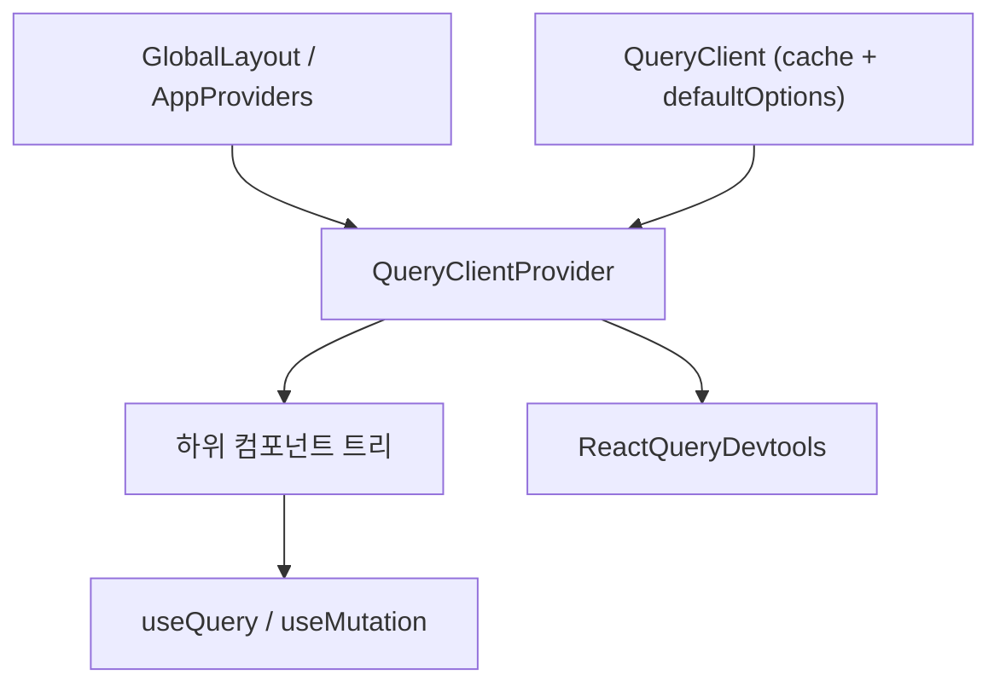
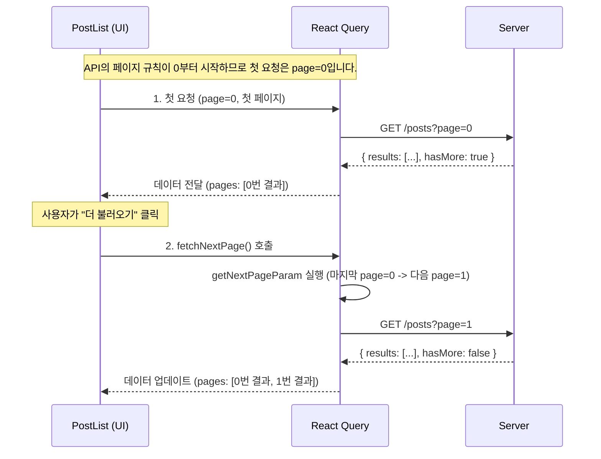
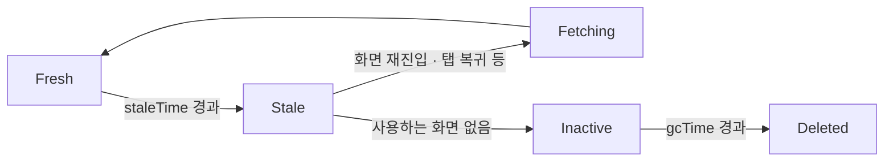
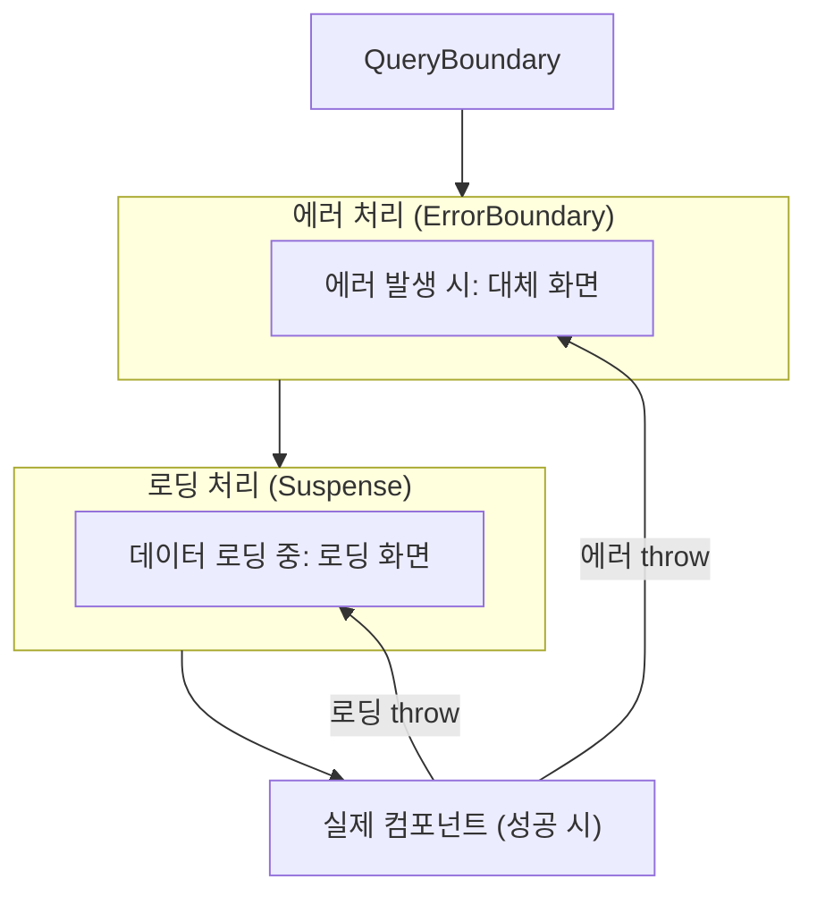
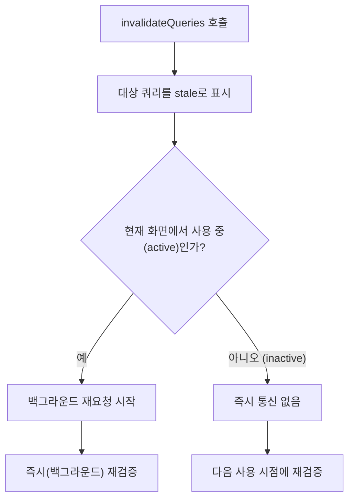
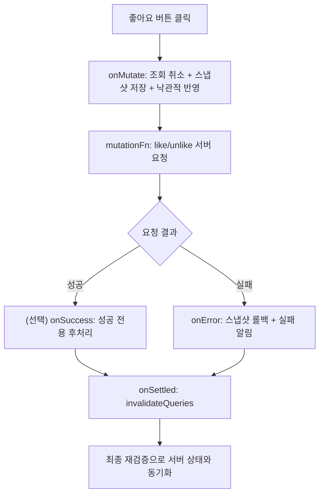
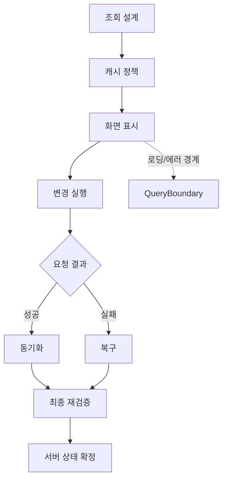

# 26. React-query

# 제 1장: React Query 시작과 프로젝트 준비

## **1-01. React Query**

React 애플리케이션에서 다루는 상태는 크게 두 종류로 나뉩니다.

- **클라이언트 상태**: 모달 열림 여부, 입력창 텍스트, 테마 설정처럼 **브라우저 안에서 생성되고 소비되는 값**입니다. 다른 사용자와 공유되지 않고, 페이지를 새로 고치면 초기화됩니다.
- **서버 상태**: 게시글 목록, 사용자 프로필, 댓글처럼 **서버에 원본이 있고 네트워크를 통해 가져오는 값**입니다. 여러 사용자가 동시에 읽고 변경할 수 있고, 시간이 지나면 자동으로 오래된 값이 될 수 있습니다.

작은 화면에서는 `state`와 `props`만으로도 충분히 동작합니다.

하지만 서비스 규모가 커지면, 화면이 참조하는 값의 상당수가 서버 상태이고 그 값은 시간에 따라 계속 바뀝니다.

문제는 데이터를 “가져오는 것”보다 “지속적으로 맞게 유지하는 것”에 있습니다.

같은 데이터를 여러 화면에서 함께 쓰고, 네트워크 지연이나 실패를 견디고, 필요한 시점에만 다시 요청하려면 공통 규칙이 필요합니다.

이 규칙이 없으면 화면마다 로딩/에러/재요청 코드를 반복하게 되고, 작은 차이가 쌓여 데이터 일관성이 무너지기 쉽습니다.

### 왜 React Query가 필요한가요?

직접 구현 코드와 React Query 코드를 나란히 보면, 차이는 문법이 아니라 책임 분리에 있습니다.

직접 구현은 컴포넌트가 네트워크 상태 관리까지 떠안고, React Query는 서버 상태 관리 규칙을 훅으로 분리합니다.

**비교: 직접 구현 vs React Query**

```jsx
// ❌ 직접 구현: 로딩, 에러, 데이터를 모두 관리해야 함
function UserProfile({ userId }) {
  const [data, setData] = useState(null);
  const [isLoading, setIsLoading] = useState(true);
  const [isError, setIsError] = useState(null);

  useEffect(() => {
    setIsLoading(true);

    fetchUser(userId)
      .then((res) => {
        setData(res);
      })
      .catch((err) => {
        setIsError(err);
      })
      .finally(() => {
        setIsLoading(false);
      });
  }, [userId]);

  if (isLoading) {
    return <div>로딩 중...</div>;
  }
  
  if (isError) {
    return <div>에러 발생!</div>;
  }
  
  return <div>{data.name}</div>;
}
```

```jsx
// ✅ React Query: 데이터 요청과 상태를 훅 리턴값으로 처리
function UserProfile({ userId }) {
  const { data, isPending, error } = useQuery({
    queryKey: ["user", userId],
    queryFn: () => fetchUser(userId),
  });

  if (isPending) {
    return <div>로딩 중...</div>;
  }
  
  if (error) {
    return <div>에러 발생!</div>;
  }
  
  return <div>{data.name}</div>;
}
```

React Query는 서버 상태를 다루는 공통 실행 모델을 제공합니다.

구체적으로는 캐시 식별(`queryKey`), 조회 실행(`queryFn`), 재요청 정책을 한 자리에서 선언하게 만들어 화면 코드가 데이터 표현에 집중하도록 돕습니다.

이 구조의 핵심은 “중복 제거”보다 “기준 통일”입니다.

예를 들어 사용자 정보를 여러 화면에서 쓸 때, 같은 식별자와 같은 정책을 공유하면 한쪽 화면에서 갱신된 결과를 다른 화면도 같은 기준으로 따라갑니다.

반대로 화면마다 자체 규칙을 만들면 어떤 화면은 오래된 값을 유지하고 어떤 화면은 즉시 갱신되는 식으로 경험이 갈라질 수 있습니다.

또한 React Query는 모든 상태를 대체하는 도구가 아닙니다.

모달 열림 여부나 입력창 텍스트처럼 UI 내부 상호작용에 가까운 값은 기존 클라이언트 상태가 더 적합하고, 서버와 동기화가 필요한 값은 React Query가 더 적합합니다.

이 경계를 명확히 두면 상태 책임이 분리되어 유지보수성이 높아집니다.

정리하면 React Query는 React에서 **서버 상태(Server State)**의 캐시, 재요청, 동기화를 관리하는 라이브러리입니다.

현재 프로젝트에서는 포스트, 댓글, 좋아요처럼 서버 데이터 중심 기능에 React Query를 적용하고, UI 로컬 상태는 별도 경계로 유지합니다.

| 관점 | 정리 |
| --- | --- |
| 서버 상태의 운영 조건 | 서버 데이터는 지연/실패 가능성을 전제로 하며, 여러 화면에서 함께 참조됩니다. |
| 직접 구현의 부담 | 로딩, 에러, 재요청 기준을 화면마다 중복 설계하면 상태 규칙이 쉽게 분산됩니다. |
| React Query의 역할 | 조회, 캐시, 재검증 흐름을 공통 규칙으로 묶어 데이터 일관성을 유지합니다. |
| 이 절의 학습 목표 | React Query가 필요한 이유와 해결 범위를 먼저 고정합니다. |

---

## **1-01.** #Quiz **React Query**

### 질문 1

React Query를 도입해도 여전히 직접 설계해야 하는 것은 무엇인가요?

1. 디자인 시스템 토큰 네이밍 규칙
2. 응답 데이터를 런타임에서 강제 변환하는 규칙
3. 데이터 갱신 규칙(언제 재요청/무효화할지)
4. Next.js 빌드 출력 전략
- 정답 및 해설
    
    **정답:** 3번
    
    **해설:** React Query는 캐시와 기본 재요청 흐름을 제공하지만, 데이터가 **얼마나 자주 변하는지**와 **어떤 시점에 최신성이 중요한지**는 서비스마다 다릅니다.
    
    따라서 “언제, 어떤 조건에서 다시 가져올지”는 개발자가 정해야 합니다.
    
    이 기준이 없으면 화면이 오래된 값으로 유지되거나, 필요 이상으로 요청이 늘어날 수 있습니다.
    

### 질문 2

서버 상태의 특징으로 옳은 것을 고르세요.

1. 네트워크 요청이 필요할 수 있습니다.
2. 브라우저를 닫아도 항상 유지됩니다.
3. 컴포넌트 내부에서만 사용됩니다.
4. 항상 즉시 최신이어야 합니다.
- 정답 및 해설
    
    **정답:** 1번
    
    **해설:** 서버 상태는 서버에 있는 데이터를 **네트워크를 통해 가져온 결과**이기 때문에 요청이 필요할 수 있습니다.
    
    또한 지연이나 실패 가능성이 있고, 여러 화면에서 같은 데이터를 공유해야 하는 경우가 많습니다.
    
    이 점 때문에 서버 상태를 다룰 때는 네트워크 요청을 전제로 설계합니다.
    

### 질문 3

캐시를 사용하는 가장 큰 이유는 무엇인가요?

1. 데이터를 영구 저장하기 위해
2. 모든 데이터를 암호화하기 위해
3. 서버 에러를 화면에 노출하지 않기 위해
4. 네트워크 요청을 줄이고 빠르게 보여주기 위해
- 정답 및 해설
    
    **정답:** 4번
    
    **해설:** 캐시는 이미 받은 데이터를 **잠시 저장해 재사용**하기 위한 장치입니다.
    
    같은 데이터를 다시 요청해야 할 때 **즉시 보여줄 수 있고**, 네트워크 요청 횟수도 줄어듭니다.
    
    즉, 화면 반응 속도와 네트워크 비용을 동시에 관리하려는 목적이 있습니다.
    

### 질문 4

서버에서 내려온 데이터를 클라이언트 상태로 복사해 두고 갱신을 놓쳤을 때 가장 흔한 문제는 무엇인가요?

1. 사용자 전환 시 이전 화면 데이터가 항상 자동으로 정리됩니다.
2. 오래된 데이터가 계속 화면에 남습니다.
3. 한 번 성공한 이후에는 같은 화면에서 절대 어긋나지 않습니다.
4. 서버 에러가 발생하면 화면은 자동으로 항상 최신 데이터로 바뀝니다.
- 정답 및 해설
    
    **정답:** 2번
    
    **해설:** 서버 데이터는 시간이 지나며 변할 수 있습니다.
    
    클라이언트 상태로 한 번 복사해 두고 갱신을 놓치면, 화면에 **이전 값이 계속 남아** 실제 서버 상태와 어긋납니다.
    
    그 결과 사용자는 오래된 정보를 보게 되고, 이후 판단도 잘못될 수 있습니다.
    

### 질문 5

서버 상태를 다룰 때 “갱신 규칙”이 필요한 가장 핵심 이유는 무엇인가요?

1. 모든 요청을 항상 즉시 실행하기 위해서입니다.
2. 화면마다 요청 함수를 따로 만들지 않기 위해서입니다.
3. 네트워크 비용과 데이터 최신성 사이의 균형을 정하기 위해서입니다.
4. 에러 처리 코드를 완전히 제거하기 위해서입니다.
- 정답 및 해설
    
    **정답:** 3번
    
    **해설:** 서버 데이터는 자주 변하지만 네트워크 요청에는 비용이 듭니다.
    
    그래서 “언제 다시 가져올지”를 정하는 규칙이 필요합니다.
    
    이 규칙이 있으면 **불필요한 재요청을 줄이면서도** 필요한 시점에는 최신 데이터를 가져올 수 있습니다.
    
    즉, **성능(요청 수)**과 **신선도(최신성)** 사이의 균형을 맞추기 위한 설계입니다.
    

---

## **1-02. 실습 프로젝트 소개**

처음부터 전체 기능을 한 번에 구현하면, 데이터 흐름과 컴포넌트 책임이 섞여 구조를 읽기 어려워집니다.

그래서 이 교재는 기능을 작은 단위로 나누고, 각 단위에서 필요한 React Query 패턴을 하나씩 연결하는 방식으로 진행합니다.

실습 프로젝트의 주제는 **공부 기록을 공유하는 SNS**입니다.

목표는 화면을 빠르게 완성하는 것이 아니라, 조회/변경/캐시/동기화 규칙이 실제 기능 안에서 어떻게 맞물리는지 확인하는 데 있습니다.

즉 이 절은 이후 코드 입력의 출발점으로, 프로젝트의 기능 경계와 파일 책임을 먼저 고정하는 단계입니다.

- 이미지
    
    
    
    
    

### 핵심 기능 요약

1. 홈 피드: 전체 글 목록
2. 내 피드: 로그인한 사용자의 글 목록
3. 간단한 로그인: 사용자 선택 방식
4. 댓글 목록 페이지네이션
5. 포스트 목록 더 불러오기
6. 좋아요와 댓글

### App Router 프로젝트 생성 및 초기 셋업

### 1. 실습 프로젝트 clone

패키지 매니저는 `pnpm`을 사용합니다.

터미널에서 다음 명령어를 실행합니다.

```bash
git clone https://github.com/winverse/codeit-fs-react-query.git
cd codeit-fs-react-query
pnpm install
```

완성된 프로젝트 결과를 보고 싶으시면 다음 명령어를 실행합니다.

```bash
# codeit-fs-react-query clone 이후
git switch completed

```

### 2. 핵심 파일 둘러보기

이 단계에서는 **프로젝트가 어떤 역할의 파일로 구성되는지**를 기능 중심으로 빠르게 확인합니다.

| 파일/폴더 | 역할 |
| --- | --- |
| `jsconfig.json` | 에디터에서 절대 경로(`@/*`)가 인식되도록 설정합니다. |
| `next.config.mjs` | Next.js의 빌드, 이미지, 플러그인 같은 프로젝트 설정을 관리합니다. |
| `.prettierrc` | 코드 포맷 규칙을 고정해 일관된 스타일을 유지합니다. |
| `src/app/layout.js` | 공통 레이아웃과 전역 리소스를 감싸는 시작점입니다. |
| `src/app/page.js` | 기본 진입 페이지를 렌더링합니다. |
| `src/styles/` | 공통 스타일과 디자인 토큰을 모아 관리합니다. |
| `src/components/` | 재사용 가능한 UI 컴포넌트를 모아 두며, 버튼·카드·로딩 같은 화면 단위를 제공합니다. |
| `src/providers/AppProviders.jsx` | 로그인 상태와 토스트 같은 전역 기능을 앱 전체에 전달합니다. |
| `src/contexts/LoginContext.jsx` | 현재 로그인 사용자 정보를 저장하고, `useLoginContext`로 하위 컴포넌트에서 읽을 수 있게 합니다. |

---

## **1-03. API 문서**

실습에서 가장 자주 막히는 지점은 React 코드보다 “어떤 요청을 어떤 형태로 보내야 하는지”를 헷갈리는 순간입니다.

특히 구현 중에 API 문서를 매번 처음부터 찾기 시작하면, 코드 흐름이 자주 끊겨 실습 속도가 크게 떨어집니다.

그래서 이 절에서는 현재 프로젝트에 필요한 엔드포인트만 먼저 고정해 둡니다.

핵심은 모든 API를 외우는 것이 아니라, 화면 기능과 API 호출이 1:1로 어떻게 매핑되는지 파악하는 것입니다.

요약 표를 기준으로 요청 경로와 파라미터를 잡아 두면 이후 쿼리 키 설계와 캐시 분리도 더 안정적으로 진행할 수 있습니다.

실제 요청 URL과 파라미터는 항상 API 문서의 최신 내용을 기준으로 다시 확인합니다.

### API 문서 핵심 요약

| 목적 | 메서드/경로 | 핵심 파라미터 |
| --- | --- | --- |
| 유저 조회 | `GET /api/codestudit/users/:username` | `username` |
| 포스트 목록 | `GET /api/codestudit/posts` | `page`, `limit`, `username` |
| 포스트 작성 | `POST /api/codestudit/posts` | `username`, `content` |
| 댓글 목록 | `GET /api/codestudit/posts/:postId/comments` | `page default(0)`, `limit` |
| 댓글 작성 | `POST /api/codestudit/posts/:postId/comments` | `username`, `content` |
| 좋아요 수 | `GET /api/codestudit/posts/:postId/likes` |  |
| 좋아요 여부 | `GET /api/codestudit/posts/:postId/likes/:username` |  |
| 좋아요 추가 | `POST /api/codestudit/posts/:postId/likes/:username` |  |
| 좋아요 취소 | `DELETE /api/codestudit/posts/:postId/likes/:username` |  |

### 실습 API 소개

API 함수를 한 파일에서 관리하면, 화면 코드와 통신 코드의 책임이 분리됩니다.

이렇게 분리해 두면 엔드포인트 변경이나 공통 에러 처리 수정이 필요할 때 수정 범위를 좁힐 수 있습니다.

아래 코드는 길어 보이지만 공통 패턴은 동일합니다.
요청 주소를 만들고, `fetch`를 실행하고, 응답을 해석해 반환하는 흐름을 기능별 함수로 나누어 둔 구조입니다.

한 가지 주의할 점은 `fetch`의 에러 처리 방식입니다.
`fetch`는 네트워크 장애가 아닌 한 HTTP 4xx/5xx 응답에서도 reject하지 않습니다.
따라서 모든 함수에서 `response.ok`를 명시적으로 검사해야 React Query가 해당 요청을 실패로 정확히 인식합니다.
이 검사가 빠지면 서버가 에러 응답을 보내도 `queryFn`이 성공으로 간주되어, 잘못된 데이터가 캐시에 저장되거나 `ErrorBoundary`가 동작하지 않는 문제가 생깁니다.

파일: `src/lib/api.js` (코드 확인)

```jsx
import { POSTS_PAGE_LIMIT } from "./constants";

// 1. API 기본 URL을 정합니다.
const BASE_URL =
  process.env.NEXT_PUBLIC_API_BASE_URL ??
  "https://learn.codeit.kr/api/codestudit";

// 2. 포스트 목록 조회 함수를 만듭니다.
// Codestudit API의 페이지 기준은 0부터 시작합니다.
export async function getPosts(
  page = 0,
  limit = POSTS_PAGE_LIMIT,
) {
  const response = await fetch(
    `${BASE_URL}/posts?page=${page}&limit=${limit}`,
  );

  if (!response.ok) {
    throw new Error("Failed to fetch posts.");
  }

  return await response.json();
}

// 3. 사용자별 포스트 목록 조회 함수를 만듭니다.
export async function getPostsByUsername(
  username,
  page = 0,
  limit = POSTS_PAGE_LIMIT,
) {
  const response = await fetch(
    `${BASE_URL}/posts?username=${username}&page=${page}&limit=${limit}`,
  );

  if (!response.ok) {
    throw new Error("Failed to fetch posts by username.");
  }

  return await response.json();
}

// 4. 포스트 업로드 함수를 만듭니다.
export async function uploadPost(newPost) {
  const response = await fetch(`${BASE_URL}/posts`, {
    method: "POST",
    headers: {
      "Content-Type": "application/json",
    },
    body: JSON.stringify(newPost),
  });

  if (!response.ok) {
    throw new Error("Failed to upload the post.");
  }

  return await response.json();
}

// 5. 유저와 댓글 조회 함수를 준비합니다.
export async function getUserInfo(username) {
  const response = await fetch(
    `${BASE_URL}/users/${username}`,
  );

  if (!response.ok) {
    throw new Error("Failed to fetch user info.");
  }

  return await response.json();
}

// 6. 포스트별 댓글 개수 조회 함수를 만듭니다.
export async function getCommentCountByPostId(postId) {
  const response = await fetch(
    `${BASE_URL}/posts/${postId}/comments`,
  );

  if (!response.ok) {
    throw new Error("Failed to fetch comment count.");
  }

  const body = await response.json();
  return body.count;
}

// 7. 포스트별 댓글 목록 조회 함수를 만듭니다.
export async function getCommentsByPostId(
  postId,
  page = 0,
  limit,
) {
  const response = await fetch(
    `${BASE_URL}/posts/${postId}/comments?page=${page}&limit=${limit}`,
  );

  if (!response.ok) {
    throw new Error("Failed to fetch comments.");
  }

  return await response.json();
}

// 8. 댓글 작성 함수를 만듭니다.
export async function addComment(postId, newComment) {
  const response = await fetch(
    `${BASE_URL}/posts/${postId}/comments`,
    {
      method: "POST",
      headers: {
        "Content-Type": "application/json",
      },
      body: JSON.stringify(newComment),
    },
  );

  if (!response.ok) {
    throw new Error("Failed to add the comment.");
  }
  return await response.json();
}

// 9. 좋아요 관련 함수를 준비합니다.
export async function getLikeCountByPostId(postId) {
  const response = await fetch(
    `${BASE_URL}/posts/${postId}/likes`,
  );

  if (!response.ok) {
    throw new Error("Failed to fetch like count.");
  }

  const body = await response.json();
  return body.count;
}

// 10. 좋아요 여부 조회 함수를 만듭니다.
// 이 API는 좋아요 여부를 200(존재)과 404(미존재)로 구분하는 설계이므로,
// 404가 에러가 아니라 정상 응답의 일부입니다.
// 그 외 상태 코드만 에러로 처리합니다.
export async function getLikeStatusByUsername(
  postId,
  username,
) {
  const response = await fetch(
    `${BASE_URL}/posts/${postId}/likes/${username}`,
  );
  if (response.status === 200) {
    return true;
  }
  if (response.status === 404) {
    return false;
  }
  throw new Error("Failed to get like status of the post.");
}

// 11. 좋아요 추가 함수를 만듭니다.
export async function likePost(postId, username) {
  const response = await fetch(
    `${BASE_URL}/posts/${postId}/likes/${username}`,
    {
      method: "POST",
    },
  );

  if (!response.ok) {
    throw new Error("Failed to like the post.");
  }
}

// 12. 좋아요 취소 함수를 만듭니다.
export async function unlikePost(postId, username) {
  const response = await fetch(
    `${BASE_URL}/posts/${postId}/likes/${username}`,
    {
      method: "DELETE",
    },
  );

  if (!response.ok) {
    throw new Error("Failed to unlike the post.");
  }
}
```

| 관점 | 정리 |
| --- | --- |
| 기본 URL 규칙 | 환경 변수가 없을 때 사용할 기본 서버 주소를 고정합니다. |
| 요청/응답 계약 | `fetch` 호출, 성공 판정, JSON 반환, 예외 처리 규칙을 일관되게 유지합니다. |
| 에러 처리 규칙 | 모든 함수에서 `!response.ok`를 검사해 React Query가 실패를 정확히 감지하도록 합니다. |
| 엔드포인트 분리 | 유저/포스트/댓글/좋아요 API를 한 위치에서 관리해 변경 지점을 단일화합니다. |

---

## **1-04. 리액트 쿼리 설치하기** ⭐⭐⭐

React Query는 훅만 설치한다고 바로 동작하지 않습니다.

조회/변경 훅이 공통 캐시를 참조할 수 있도록, 앱 트리 상단에 `QueryClientProvider`를 먼저 연결해야 합니다.

이 설정의 목적은 전역 상태를 모두 모으는 것이 아니라, 서버 상태 캐시의 공유 범위를 명확히 정의하는 데 있습니다.

같은 트리 안에서 동일한 `QueryClient`를 참조하면 화면마다 요청 기준이 달라지는 문제를 줄일 수 있고, 같은 데이터를 재사용하는 흐름도 안정적으로 유지됩니다.

반대로 Provider 경계가 잘못 잡히면 같은 API를 호출해도 서로 다른 캐시를 사용해 중복 요청이 늘어날 수 있습니다.

실무에서는 이 단계에서 두 가지를 함께 고정합니다.

첫째, `QueryClient`의 기본 옵션(예: `staleTime`)을 프로젝트 기준으로 정합니다.

둘째, Devtools를 연결해 이후 절에서 만들 쿼리 흐름을 실제 캐시 상태로 검증할 수 있게 준비합니다.

아래 다이어그램은 이 구조를 단순화한 것입니다.



이 교재는 **Next.js App Router** 기반 프로젝트를 사용합니다.

React Query는 **Provider 설정**과 **Devtools 설정**이 핵심입니다.

```bash
pnpm add @tanstack/react-query
pnpm add -D @tanstack/react-query-devtools
```

React Query Devtools는 개발 과정에서만 사용하는 도구이므로 dev dependency로 설치합니다.

### QueryClientProvider 설정

파일: `src/providers/AppProviders.jsx` (수정)

```jsx
"use client";

import {
  isServer,
  QueryClient,
  QueryClientProvider,
} from "@tanstack/react-query";
import { ReactQueryDevtools } from "@tanstack/react-query-devtools";
import { ToastContainer } from "react-toastify";
import { LoginProvider } from "@/contexts/LoginContext";
import "react-toastify/dist/ReactToastify.css";

const ONE_MINUTE_MS = 60_000;
const TOAST_AUTO_CLOSE_MS = 2_000;

// 1. QueryClient 기본 옵션(queries.staleTime)을 상수로 고정합니다.
function makeQueryClient() {
  return new QueryClient({
    defaultOptions: {
      queries: {
        staleTime: ONE_MINUTE_MS,
      },
    },
  });
}

let browserQueryClient = undefined;

// 2. 서버/브라우저 실행 환경에 맞게 QueryClient 생성 전략을 분기합니다.
function getQueryClient() {
  if (isServer) {
    return makeQueryClient();
  }

  if (!browserQueryClient) {
    browserQueryClient = makeQueryClient();
  }
  return browserQueryClient;
}

// 위 패턴은 TanStack Query 공식 문서의 App Router 권장 구성입니다.
// 현 단계에서는 구조를 그대로 따르면 되며, 서버/브라우저 분기 이유는 아래 설명을 참고합니다.

export default function AppProviders({ children }) {
  // 3. 앱 전역에서 공유할 QueryClient 인스턴스를 가져옵니다.
  const queryClient = getQueryClient();

  return (
    // 4. QueryClientProvider + LoginProvider + Devtools를 한 경계로 묶습니다.
    <QueryClientProvider client={queryClient}>
      <LoginProvider>
        {children}
        <ToastContainer
          position="top-center"
          autoClose={TOAST_AUTO_CLOSE_MS}
          hideProgressBar={true}
          theme="light"
        />
      </LoginProvider>
      <ReactQueryDevtools
        initialIsOpen={false}
        buttonPosition="bottom-right"
      />
    </QueryClientProvider>
  );
}
```

`AppProviders` 파일에 `'use client'`를 선언하는 이유는 이 컴포넌트가 클라이언트 경계에서 동작해야 하기 때문입니다.

Next.js App Router에서 `layout`은 기본적으로 Server Component이며, `QueryClientProvider`처럼 React Context를 제공하는 컴포넌트는 클라이언트 컴포넌트 경계 안에서 렌더링되어야 안정적으로 동작합니다.

즉 `'use client'`는 단순 문법이 아니라, “여기서부터는 클라이언트에서 실행되는 트리”라는 경계를 명시하는 역할입니다.

`QueryClient`는 캐시 저장소이므로 실행 환경에 맞는 생성 전략이 필요합니다. ⭐⭐⭐

- **서버**: 요청마다 새로운 인스턴스를 만들어 사용자 간 캐시 공유를 막아야 합니다. 같은 인스턴스를 재사용하면 한 사용자의 데이터가 다른 사용자 응답에 섞일 수 있습니다.
- **브라우저**: 단일 인스턴스를 재사용해 렌더링 중 캐시가 끊기지 않게 해야 합니다. 매 렌더마다 새로 만들면 기존 캐시가 초기화되어 화면이 깜빡이는 현상이 생길 수 있습니다.

그래서 `isServer`로 분기해 서버는 매 요청 생성, 브라우저는 모듈 스코프 재사용 방식으로 구성합니다.

여기에 기본 `staleTime`을 함께 지정하면 hydration(서버 렌더링 결과를 클라이언트가 이어받는 과정) 직후의 즉시 재요청을 줄여 첫 화면 체감이 흔들리는 문제도 완화할 수 있습니다.

### 레이아웃에서 Provider 감싸기

파일: `src/components/layouts/GlobalLayout/GlobalLayout.jsx` (코드 확인)

```jsx
import Navigation from "@/components/Navigation";
import AppProviders from "@/providers/AppProviders";
import * as styles from "./GlobalLayout.css.js";

function GlobalLayout({ children }) {
  return (
    <AppProviders>
      <Navigation />
      <main className={styles.main}>{children}</main>
    </AppProviders>
  );
}

export default GlobalLayout;
```

`QueryClientProvider`는 React Query의 캐시와 설정을 **React 트리 전체에 전달**하기 위한 핵심 구성 요소입니다.

그래서 Provider 범위를 어디까지 둘지에 따라 캐시 공유 범위가 결정됩니다.

| 항목 | 역할 |
| --- | --- |
| `QueryClient` | 캐시를 보관하고 쿼리 동작을 관리합니다. |
| `QueryClientProvider` | 캐시와 설정을 하위 트리에 전달합니다. |
| `ReactQueryDevtools` | 개발 중 쿼리 상태와 캐시를 시각적으로 확인합니다. |
| `AppProviders` | 앱 전역에서 Provider 구성을 묶어 관리합니다. |

---

---

# 제 2장: 기본 쿼리와 캐싱

## **2-01. useQuery와 useSuspenseQuery로 데이터 받아오기** ⭐⭐⭐

서버 데이터는 비동기로 도착하므로, 컴포넌트가 처음 렌더링될 때 값이 비어 있는 상황이 자연스럽게 발생합니다.

직접 구현으로 이 흐름을 처리하면 로딩/에러/재요청 기준을 각 화면이 따로 갖게 되고, 화면 수가 늘수록 기준이 분산됩니다.

`useQuery`는 이 분산을 줄이기 위한 기본 조회 훅입니다.

어떤 데이터를 가져오는지(`queryFn`), 어떤 조건에서 같은 데이터로 볼지(`queryKey`), 언제 다시 확인할지(옵션)를 한곳에서 선언해 조회 규칙을 공통화합니다.

즉 `useQuery`는 단순 fetch 래퍼가 아니라, 캐시와 재요청 정책을 포함한 서버 상태 실행 모델입니다.

이 절에서는 먼저 `useQuery`로 기본 조회 패턴을 이해한 뒤, `useSuspenseQuery`로 렌더링 경계를 분리하는 방식을 비교합니다.

이 기준은 이후 절의 queryKey 설계, 캐시 정책, 로딩/에러 경계 구성으로 그대로 이어집니다.

**비교 주제:** `fetch + useEffect` 방식 vs `useQuery` 방식 (예시)

```jsx
// Before: fetch + useEffect
import { useEffect, useState } from "react";

async function fetchBooks(page) {
  const response = await fetch(`/api/books?page=${page}`);
  if (!response.ok) {
    throw new Error("요청 실패");
  }
  return response.json();
}

function BooksPreview({ page }) {
  const [data, setData] = useState(null);
  const [isPending, setIsPending] = useState(true);
  const [hasError, setHasError] = useState(false);

  useEffect(() => {
    setIsPending(true);
    setHasError(false);

    fetchBooks(page)
      .then((result) => {
        setData(result);
      })
      .catch(() => {
        setHasError(true);
      })
      .finally(() => {
        setIsPending(false);
      });
  }, [page]);

  if (isPending) {
    return <div>로딩 중...</div>;
  }
  
  if (hasError) {
    return <div>오류가 발생했습니다.</div>;
  }
  
  if (!data) {
    return null;
  }
  
  return <div>{data.results.length}권</div>;
}
```

```jsx
// After: useQuery
import { useQuery } from "@tanstack/react-query";

async function fetchBooks(page) {
  const response = await fetch(`/api/books?page=${page}`);
  if (!response.ok) {
    throw new Error("요청 실패");
  }
  return response.json();
}

function BooksPreview({ page }) {
  const { data, isPending, isError } = useQuery({
    queryKey: ["books", page],
    queryFn: () => fetchBooks(page),
  });

  if (isPending) {
    return <div>로딩 중...</div>;
  }
  
  if (isError) {
    return <div>오류가 발생했습니다.</div>;
  }
  
  return <div>{data.results.length}권</div>;
}
```

`fetchBooks`는 “데이터를 가져오는 함수” 역할만 수행하고, 실행 상태 해석은 `useQuery`가 담당합니다.

그래서 컴포넌트는 `isPending`, `isError`, `data`를 조합해 UI 분기를 빠르게 만들 수 있습니다.

핵심은 상태를 덜 쓰는 것이 아니라, 상태 책임을 분리하는 데 있습니다.

조회 함수는 통신 계약에 집중하고, 훅은 캐시/재요청/상태 계산을 담당하며, 컴포넌트는 결과 표현에 집중합니다.

이 분리가 되어야 이후에 쿼리 키가 늘어나도 코드가 안정적으로 확장됩니다.

**비교 주제:** `useQuery` 방식 vs `useSuspenseQuery` 방식

```jsx
// Before: useQuery
import { useQuery } from "@tanstack/react-query";

async function fetchBooks(page) {
  const response = await fetch(`/api/books?page=${page}`);
  
  if (!response.ok) {
    throw new Error("요청 실패");
  }
  
  return response.json();
}

function BooksPreview({ page }) {
  const { data, isPending, isError } = useQuery({
    queryKey: ["books", page],
    queryFn: () => fetchBooks(page),
  });

  if (isPending) {
    return <div>로딩 중...</div>;
  }
  
  if (isError) {
    return <div>오류가 발생했습니다.</div>;
  }
  
  if (!data) {
    return null;
  }
  
  return <div>{data.results.length}권</div>;
}
```

```jsx
// After: useSuspenseQuery (로딩/에러 책임 분리)
import { useSuspenseQuery } from "@tanstack/react-query";
import { Suspense } from "react";
import { ErrorBoundary } from "react-error-boundary";

async function fetchBooks(page) {
  const response = await fetch(`/api/books?page=${page}`);
  if (!response.ok) {
    throw new Error("요청 실패");
  }
  return response.json();
}

function BooksPreview({ page }) {
  // ✅ 로딩/에러 처리가 사라지고 성공 상황만 남습니다.
  const { data } = useSuspenseQuery({
    queryKey: ["books", page],
    queryFn: () => fetchBooks(page),
  });

  return <div>{data.results.length}권</div>;
}

function BooksPage() {
  return (
    // ✅ 로딩과 에러가 컴포넌트 밖으로 분리되었습니다.
    <ErrorBoundary
      fallback={<div>오류가 발생했습니다.</div>}
    >
      <Suspense fallback={<div>로딩 중...</div>}>
        <BooksPreview page={0} />
      </Suspense>
    </ErrorBoundary>
  );
}
```

`useSuspenseQuery`도 `queryKey`와 `queryFn` 계약은 동일하게 사용합니다.

차이는 로딩 처리 위치입니다. 컴포넌트 내부 분기 대신 `Suspense` 경계가 대기 상태를 담당하고, 컴포넌트는 데이터가 준비된 경로에 집중합니다.

따라서 이 훅을 사용할 때는 “로딩을 어디서 처리하는가”를 먼저 정한 뒤 컴포넌트를 구성해야 문맥이 깔끔해집니다.

### `useSuspenseQuery`를 사용하는 이유

`useQuery`와 `useSuspenseQuery`는 경쟁 관계가 아니라 역할이 다른 선택지입니다.

컴포넌트 내부에서 세밀한 상태 분기가 필요하면 `useQuery`가 적합하고, 성공 렌더 경로를 우선으로 설계하려면 `useSuspenseQuery`가 적합합니다.

```jsx
// Before: useQuery (컴포넌트가 로딩/에러를 직접 신경 씀)
function BookList() {
  const { data, isPending, isError } = useQuery(...);

  if (isPending) {
    return <Loading />; // ❌ 매번 작성해야 함
  }
  
  if (isError) {
    return <Error />;   // ❌ 매번 작성해야 함
  }

  return <div>{data.map(...)}</div>;
}
```

```jsx
// After: useSuspenseQuery (데이터가 준비된 상황만 집중)
function BookList() {
  const { data } = useSuspenseQuery(...); // ✅ 로딩/에러는 상위(Suspense/Boundary)가 처리

  return <div>{data.map(...)}</div>;
}
```

위 코드에서 볼 수 있듯이 `useSuspenseQuery`를 쓰면 컴포넌트는 “데이터가 무조건 있다”고 가정하고 렌더링에만 집중할 수 있습니다.

### 차이점 정리

| 구분 | `useQuery` | `useSuspenseQuery` |
| --- | --- | --- |
| **로딩 처리** | `isPending` 확인 후 로딩 컴포넌트 리턴 | 상위 `Suspense`의 `fallback`이 처리 |
| **에러 처리** | `isError` 확인 후 에러 컴포넌트 리턴 | 상위 `ErrorBoundary`의 `fallback`이 처리 |
| **데이터** | `data`가 `undefined`일 수 있음 | `data`가 항상 존재함 (성공 보장) |
| **코드 구조** | 하나의 컴포넌트가 로딩/에러/성공 다 처리 | 성공/대기/실패 책임이 컴포넌트별로 분리 |

이 교재의 실습 코드는 조회 기본 원리를 `useQuery`로 먼저 이해한 뒤, 실제 화면에서는 `useSuspenseQuery`를 기본 조회 패턴으로 사용합니다.

그래서 로딩과 에러는 경계 컴포넌트에서 관리하고, 기능 컴포넌트는 성공 상태의 UI 표현에 집중합니다.

### 핵심 요약: 선택 가이드

| 상황 | 추천 훅 | 이유 |
| --- | --- | --- |
| **일반적인 조회** | `useSuspenseQuery` | 로딩/에러 책임을 분리해 성공 경로 코드에 집중할 수 있습니다. |
| **조건부 조회** | `useQuery` | 특정 시점까지 실행을 미루거나(`enabled`), 컴포넌트 내부에서 조용히 실패를 처리해야 할 때 적합합니다. |

---

## **2-01.** #Quiz **useQuery와 useSuspenseQuery로 데이터 받아오기**

### 질문 1

`useSuspenseQuery`의 역할로 옳은 것은 무엇인가요?

1. 데이터가 준비될 때까지 렌더링을 멈추고 `Suspense`의 `fallback`을 보여줍니다.
2. `queryFn`의 Promise를 동기 값으로 변환해 await 없이 사용하게 만듭니다.
3. 에러가 발생해도 항상 `success` 상태로 렌더링합니다.
4. `queryKey` 없이도 동일 캐시를 자동 추론합니다.
- 정답 및 해설
    
    **정답:** 1번
    
    **해설:** `useSuspenseQuery`는 **데이터가 준비될 때까지 렌더링을 지연**시키고,
    
    그동안 상위 `Suspense`의 `fallback`이 대신 화면에 표시되도록 돕습니다.
    
    즉, 로딩 UI는 컴포넌트 내부가 아니라 `Suspense` 경계에서 관리하는 흐름입니다.
    

### 질문 2

`queryKey`가 필요한 이유로 옳은 것은 무엇인가요?

1. `staleTime` 값만으로 재요청 주기를 계산하기 위해서입니다.
2. 동일한 `queryFn`을 가진 쿼리를 하나로 강제 병합하기 위해서입니다.
3. 캐시를 구분하는 식별자 역할을 하기 위해서입니다.
4. 성공/실패 콜백의 실행 순서를 지정하기 위해서입니다.
- 정답 및 해설
    
    **정답:** 3번
    
    **해설:** `queryKey`는 **쿼리를 식별하는 기준**입니다.
    
    같은 `queryKey`면 같은 캐시를 재사용하고, 다른 키면 별도의 캐시를 가집니다.
    
    따라서 캐시 공유 범위를 명확히 하려면 `queryKey` 설계가 중요합니다.
    

### 질문 3

`queryFn`에는 어떤 형태의 함수가 들어가야 하나요?

1. 반드시 동기 함수만 허용됩니다.
2. 이전 캐시를 직접 수정하는 동기 콜백이 들어갑니다.
3. 이벤트 핸들러만 허용됩니다.
4. 데이터를 가져오는 비동기 함수가 들어갑니다.
- 정답 및 해설
    
    **정답:** 4번
    
    **해설:** `queryFn`은 데이터를 가져오는 **비동기 함수**입니다.
    
    보통 `fetch` 같은 요청을 수행하고 Promise를 반환합니다.
    
    React Query는 이 Promise가 완료되면 결과를 캐시에 저장합니다.
    

### 질문 4

Suspense 환경에서 로딩 UI를 보여주는 위치로 옳은 것은 무엇인가요?

1. 컴포넌트의 return 조건문
2. Suspense의 `fallback`
3. `useEffect` 내부
4. `queryKey` 내부
- 정답 및 해설
    
    **정답:** 2번
    
    **해설:** Suspense는 로딩 상태를 **컴포넌트 내부**가 아니라 바깥의 `Suspense`에서 처리합니다.
    
    그래서 로딩 UI는 `Suspense`의 `fallback`에 배치합니다.
    
    이 구조가 로딩/에러 처리를 분리하는 핵심입니다.
    

### 질문 5

`useSuspenseQuery`의 `status` 값으로 옳은 것은 무엇인가요?

1. `success` 또는 `error`
2. `pending`만 존재합니다.
3. `idle`만 존재합니다.
4. `paused`만 존재합니다.
- 정답 및 해설
    
    **정답:** 1번
    
    **해설:** Suspense 모드에서는 로딩 상태가 `Suspense`로 처리됩니다.
    
    그래서 `status`는 `success` 또는 `error`만 존재합니다.
    
    컴포넌트 내부에서 로딩을 처리하지 않기 때문에 `pending` 같은 상태는 사용하지 않습니다.
    
    즉, 로딩 UI는 `Suspense`의 `fallback`에서 관리되고, 컴포넌트는 데이터가 준비된 시점에만 렌더링됩니다.
    

---

## **2-02. queryKey 설계**

React Query에서 캐시는 자동으로 “잘” 분리되지 않습니다.

어떤 요청을 같은 데이터로 볼지 결정하는 기준을 개발자가 `queryKey`로 명시해야 합니다.

`queryKey`는 단순 이름표가 아니라 데이터 경계 선언입니다.

페이지, 사용자, 필터처럼 결과를 바꾸는 값이 키에 빠지면 서로 다른 요청이 같은 캐시를 공유해 데이터가 섞일 수 있습니다.

반대로 필요한 차원을 키에 정확히 포함하면, 같은 요청은 재사용하고 다른 요청은 분리하는 동작을 안정적으로 얻을 수 있습니다.

현재 프로젝트는 유저 정보, 포스트 목록, 댓글 목록, 좋아요 상태를 키 차원으로 나누고, `postId`와 `username` 같은 식별 값을 키에 포함해 충돌을 막습니다.

### Good & Bad: queryKey 설계 패턴

`queryKey`는 캐시 주소라고 생각하면 이해가 쉽습니다.

주소 형식이 들쑥날쑥하면 캐시를 찾지 못하거나 다른 데이터를 잘못 참조하게 됩니다.

| 구분 | 패턴 | 설명 |
| --- | --- | --- |
| **Good** | `["posts", "list", { page: 1 }]` | 배열과 객체를 조합해 **구조화**합니다. |
| **Good** | `queryKeys.posts.byUser(username)` | **팩토리 함수**를 사용해 키 생성을 한곳에서 관리합니다. |
| **Bad** | `["posts" + id]` | 문자열을 합치면 나중에 분리하거나 필터링하기 어렵습니다. |
| **Bad** | `["posts", "comments"]` | `postId`나 `page`가 빠지면 서로 다른 댓글 목록이 같은 캐시를 공유할 수 있습니다. |

키 생성 규칙을 함수로 모아 두면 호출부가 짧아지고, 키 형식 변경이 필요할 때 수정 범위도 작아집니다.

즉 queryKey 설계는 성능 최적화 이전에 데이터 정합성과 유지보수성을 위한 기본 계약입니다.

위 설계 규칙을 실제 프로젝트 코드에 적용한 예시는 다음과 같습니다.

파일: `src/lib/queryKeys.js` (수정)

```jsx
export const queryKeys = {
  // 1. posts 관련 키를 묶습니다.
  posts: {
    all: () => ["posts"],
    byUser: (username) => ["posts", "user", username],
    commentCount: (postId) => [
      "posts",
      postId,
      "commentCount",
    ],
    comments: (postId, page) =>
      page === undefined
        ? ["posts", postId, "comments"]
        : ["posts", postId, "comments", page],
    likeCount: (postId) => ["posts", postId, "likeCount"],
    likeStatus: (postId, username) => [
      "posts",
      postId,
      "likeStatus",
      username,
    ],
  },
  // 2. user 관련 키를 묶습니다.
  user: {
    info: (username) => ["user", username],
  },
};
```

```jsx
// src/lib/queryKeys.js의 예시 사용
useSuspenseQuery({
  queryKey: queryKeys.posts.byUser(username), // ["posts", "user", "codeit"] 등 자동 생성
  ...
})
```

| 구분 | 역할 |
| --- | --- |
| `posts.all` / `posts.byUser` | 전체 목록과 사용자별 목록 캐시를 분리합니다. |
| `posts.commentCount` / `posts.comments` | 댓글 개수와 페이지별 댓글 목록을 구분합니다. |
| `posts.likeCount` / `posts.likeStatus` | 좋아요 개수와 사용자별 좋아요 여부를 분리합니다. |
| `user.info` | 유저 정보 캐시를 관리합니다. |

## **2-02.** #Quiz **queryKey 설계**

### 질문 1

`queryKey`의 역할로 가장 적절한 것은 무엇인가요?

1. 서버 응답을 로컬 상태로 복사할 필드 이름을 결정합니다.
2. 쿼리 실행 우선순위를 지정하는 스케줄 값을 제공합니다.
3. 재시도 횟수와 지연 시간을 계산하는 정책 키로 동작합니다.
4. 캐시를 구분해 같은 요청 결과를 재사용할 기준을 제공합니다.
- 정답 및 해설
    
    **정답:** 4번
    
    **해설:** `queryKey`는 **캐시를 식별하는 기준**입니다.
    
    같은 키는 같은 캐시를 재사용하고, 다른 키는 별도 캐시로 분리됩니다.
    
    그래서 키 설계가 곧 캐시 구조를 결정합니다.
    

### 질문 2

댓글 페이지네이션을 구현할 때 `queryKey`에 페이지 번호를 포함하는 이유로 옳은 것은 무엇인가요?

1. 페이지별 데이터를 서로 다른 캐시로 관리하기 위해서입니다.
2. 페이지가 바뀌어도 같은 캐시를 재사용하기 위해서입니다.
3. 페이지 전환 시 기존 페이지 캐시를 즉시 삭제하기 위해서입니다.
4. `isFetching` 값을 `false`로 고정하기 위해서입니다.
- 정답 및 해설
    
    **정답:** 1번
    
    **해설:** 페이지 번호가 다르면 결과도 다르므로 **캐시를 분리**해야 합니다.
    
    같은 키를 쓰면 서로 다른 페이지 데이터가 덮여 보일 수 있습니다.
    
    그래서 `page`를 키에 넣어 페이지별 캐시를 구분합니다.
    

### 질문 3

다음 중 `queryKey` 설계에서 가장 위험한 선택은 무엇인가요?

1. 댓글 개수와 댓글 목록을 다른 키로 분리합니다.
2. 페이지 목록에서 `page`를 키에 포함합니다.
3. 사용자별 목록에서 `username`을 키에 포함하지 않습니다.
4. 키 생성을 함수로 모아 관리합니다.
- 정답 및 해설
    
    **정답:** 3번
    
    **해설:** 사용자별 목록인데 `username`을 키에 넣지 않으면 **서로 다른 사용자의 데이터가 섞일 수 있습니다.**
    
    키가 같으면 같은 캐시로 취급되기 때문에 덮어쓰기 문제가 생깁니다.
    
    사용자별 데이터는 반드시 식별 값을 키에 포함해야 합니다.
    

### 질문 4

`comments(postId, page)`가 `page`가 없을 때 `["posts", postId, "comments"]`를 반환하는 이유로 옳은 것은 무엇인가요?

1. 페이지가 없을 때는 캐시를 전혀 쓰지 않기 위해서입니다.
2. 기본 목록과 페이지 목록을 구분해 관리하기 위해서입니다.
3. `postId`를 숨기기 위해서입니다.
4. 페이지 경계와 무관한 전역 설정(`staleTime`)을 강제로 상속하기 위해서입니다.
- 정답 및 해설
    
    **정답:** 2번
    
    **해설:** 페이지가 없는 기본 목록과 페이지별 목록은 **의미가 다르므로 키도 분리**해야 합니다.
    
    기본 키를 따로 두면 페이지 파라미터가 없는 요청과 충돌하지 않습니다.
    
    이렇게 하면 같은 `postId`라도 요청 목적에 맞게 캐시를 나눌 수 있습니다.
    

### 질문 5

`queryKeys` 파일로 키 생성을 모아 관리하는 이유로 옳은 것은 무엇인가요?

1. 네트워크 요청을 자동으로 최적화할 수 있습니다.
2. 컴포넌트 수를 줄일 수 있습니다.
3. React 버전을 고정할 수 있습니다.
4. 키 형식을 일관되게 유지해 캐시 충돌을 줄일 수 있습니다.
- 정답 및 해설
    
    **정답:** 4번
    
    **해설:** 키 생성 규칙이 흩어지면 실수로 다른 키를 만들기 쉽습니다.
    
    한곳에서 관리하면 **일관성이 유지되어 캐시 충돌 가능성**이 줄어듭니다.
    
    또한 유지보수 시 수정 범위를 한눈에 파악할 수 있습니다.
    

---

## **2-03. useSuspenseQuery 실습**

이 절은 `useSuspenseQuery`를 실제 기능에 연결해 보는 단계입니다.

목표는 조회 훅 문법을 외우는 것이 아니라, “데이터 준비 -> 렌더링 -> 이벤트 처리”가 한 흐름으로 이어지는지 검증하는 데 있습니다.

현재 `PostForm`은 로그인 사용자 정보가 있어야 업로드 payload를 만들 수 있으므로, 사용자 조회가 폼 동작의 선행 조건입니다.

그래서 핵심 확인 포인트는 세 가지입니다.

`data` 구조가 의도대로 들어오는지, 사용자 변경 시 `queryKey`가 분리되는지, 같은 사용자에서 캐시가 재사용되는지입니다.

또한 Suspense를 사용해도 이벤트 경로의 방어 로직은 그대로 필요합니다.
`useSuspenseQuery`는 **렌더링 시점**에 `data`가 존재함을 보장하지만, **이벤트 실행 시점**은 렌더링과 다른 타이밍입니다.
예를 들어 사용자가 로그인 전환 버튼을 누른 직후, 아직 re-render가 완료되기 전에 제출 버튼을 클릭하면 `currentUserInfo`가 이전 사용자 값이거나 일시적으로 비어 있을 수 있습니다.
이처럼 렌더링 보장과 이벤트 시점 보장은 다른 문제이므로, `handleSubmit` 안에서 `currentUserInfo` 존재 여부를 다시 확인하는 방어 코드가 필요합니다.

파일: `src/domains/feed/PostForm/PostForm.jsx` (수정)

```jsx
"use client";

import { useSuspenseQuery } from "@tanstack/react-query";
import TextInputForm from "@/domains/feed/TextInputForm";
import { useLoginContext } from "@/contexts/LoginContext";
import { queryKeys } from "@/lib/queryKeys";
import { getUserInfo } from "@/lib/api";
import * as styles from "./PostForm.css.js";

function PostForm({ onSubmit, buttonDisabled }) {
  const { currentUsername } = useLoginContext();
  // 1. 현재 사용자 정보를 쿼리로 조회합니다.
  const { data: currentUserInfo } = useSuspenseQuery({
    queryKey: queryKeys.user.info(currentUsername),
    queryFn: () => getUserInfo(currentUsername),
  });

  // 2. 제출 시 newPost를 구성해 업로드 흐름으로 넘깁니다.
  const handleSubmit = async (content) => {
    if (!currentUserInfo) {
      return;
    }
    const newPost = {
      username: currentUserInfo.username,
      content: content,
    };

    onSubmit(newPost);
  };

  return (
    <div className={styles.textInputForm}>
      {/* 3. 입력 폼에 사용자 정보를 전달합니다. */}
      <TextInputForm
        onSubmit={handleSubmit}
        currentUserInfo={currentUserInfo}
        placeholder="오늘의 공부 기록을 남겨보세요."
        buttonText="업로드"
        buttonDisabled={buttonDisabled}
      />
    </div>
  );
}

export default PostForm;
```

코드를 입력했지만 아직 화면에 렌더링되지 않습니다.

완성된 코드가 동작하는 **`react-query-completed`** 프로젝트(완성본)를 실행해, 로그인 후 글쓰기 폼에서 다음 3가지 핵심 동작을 미리 눈으로 확인해 보세요.

이 과정을 통해 **React Query가 데이터를 어떻게 관리하는지** 실감할 수 있습니다.

1. **데이터 주입 확인**: 서버 응답이 컴포넌트로 잘 전달되는지 확인
2. **캐시 독립성 확인**: 사용자 A와 B의 데이터가 서로 섞이지 않고 분리되는지 확인
3. **캐시 재사용 확인**: 페이지를 이동했다 돌아와도 로딩 없이 데이터가 바로 보이는지 확인

**확인 1: 데이터 주입 확인**

1. 완성본 프로젝트(`http://localhost:3000`)를 실행하고 로그인합니다.
2. 화면 우측 하단의 **React Query 로고(꽃 무늬)**를 눌러 개발자 도구를 엽니다.
3. 왼쪽 패널에서 `["user", "codeit"]`과 같은 키를 찾습니다.
4. 해당 키를 눌러 오른쪽 화면에서 `Data Explorer`를 확인합니다.
5. `username`, `name`, `photo` 값이 들어있으면 정상입니다.

**확인 2: 캐시 독립성 확인**

1. 우측 상단 프로필 이미지를 눌러 로그아웃합니다.
2. 다른 아이디(예: `react`)로 다시 로그인합니다.
3. Devtools 목록에 새로운 키 `["user", "react"]`가 추가되는지 확인합니다.
4. 이전 사용자의 키(`codeit`)와 섞이지 않고 별도로 관리되는지 확인합니다.

**확인 3: 캐시 재사용 확인**

1. 상단 메뉴에서 [내 피드]를 클릭해 페이지를 이동합니다.
2. 다시 [홈] 메뉴를 클릭해 돌아옵니다.
3. Devtools 목록 내 해당 키의 `Last Updated` 시간을 관찰합니다.
4. 로딩 없이 화면이 즉시 보이고, 잠시 후 **`Last Updated` 시간이 현재 시간으로 갱신**되는지 확인합니다.
(즉시 표시 = 캐시 재사용, 시간 갱신 = 백그라운드 동기화 완료)

| 확인 항목 | 확인 목적 |
| --- | --- |
| **데이터 주입** | `currentUserInfo`에 값이 정상적으로 들어오는지 검증 |
| **캐시 독립성** | 사용자마다 `queryKey`가 달라져 데이터가 섞이지 않는지 검증 |
| **캐시 재사용** | `queryKey`가 같을 때 데이터를 다시 가져오지 않고 재사용하는지 검증 |

## **2-03.** #Quiz **useSuspenseQuery 실습**

### 질문 1

`useSuspenseQuery`를 사용할 때 `const { data } = useSuspenseQuery(...)` 패턴에 대한 설명으로 옳은 것은 무엇인가요?

1. `useSuspenseQuery`는 항상 `data`를 `undefined`로 반환하므로 별도 상태가 필수입니다.
2. 성공 렌더 경로에서는 `data`를 정의된 값으로 다루고, 데이터 구조 해석에 집중할 수 있습니다.
3. `data`는 문자열로만 반환되므로 객체 필드 접근이 불가능합니다.
4. `data`를 쓰면 캐시가 비활성화되어 매번 새 요청이 발생합니다.
- 정답 및 해설
    
    **정답:** 2번
    
    **해설:** Suspense 기반 쿼리는 성공 렌더 경로에서 `data`를 중심으로 UI를 구성하는 방식이 핵심입니다.
    
    그래서 이 실습에서는 데이터 모양과 키 설계를 먼저 확인해 안정적인 조회 흐름을 익힙니다.
    
    로딩/에러 경계의 세부 구현은 뒤 절에서 분리해 다룹니다.
    

### 질문 2

`queryKey`에 사용자 식별자를 포함하지 않고 `["user"]`처럼 고정 키를 사용하면 가장 위험한 결과는 무엇인가요?

1. 캐시가 비활성화되어 매번 새 요청만 실행됩니다.
2. `useSuspenseQuery`가 자동으로 `enabled: false`로 동작합니다.
3. 서버가 동일 응답을 반환하므로 문제는 발생하지 않습니다.
4. 다른 사용자 조회 결과가 같은 캐시에 섞여 사용자 전환 시 잘못된 프로필이 재사용될 수 있습니다.
- 정답 및 해설
    
    **정답:** 4번
    
    **해설:** React Query는 `queryKey`를 캐시 식별자로 사용합니다.
    
    사용자 차원을 키에 반영하지 않으면 서로 다른 입력이 동일 캐시 슬롯을 공유하게 됩니다.
    
    그 결과 로그인 전환 시 이전 사용자의 데이터가 남는 치명적인 데이터 오염이 생길 수 있습니다.
    

### 질문 3

`handleSubmit`에서 `currentUserInfo` 존재 여부를 먼저 검사하는 이유로 가장 적절한 것은 무엇인가요?

1. 렌더링 보장과 별개로 제출 이벤트 시점의 입력 유효성을 확인하기 위해서입니다.
2. 제출 버튼 클릭 이벤트가 중복 실행되지 않도록 막기 위해서입니다.
3. `staleTime`이 지나면 함수가 실행되지 않도록 하기 위해서입니다.
4. `queryKey` 직렬화 오류를 방지하기 위해서입니다.
- 정답 및 해설
    
    **정답:** 1번
    
    **해설:** Suspense가 데이터 준비를 보장해도 제출 이벤트 시점에는 별도 방어가 필요합니다.
    
    예를 들어 사용자 전환 직후처럼 경계 상태가 바뀌는 순간에는 입력 유효성을 다시 확인하는 편이 안전합니다.
    
    이 검사는 업로드 페이로드가 불완전한 상태로 전달되는 것을 막는 마지막 보호막 역할을 합니다.
    

### 질문 4

동일 사용자로 페이지를 떠났다가 돌아왔을 때 Devtools에서 같은 `queryKey` 항목이 재사용되는 현상이 의미하는 것은 무엇인가요?

1. 브라우저 디스크 캐시가 API 응답을 영구 저장했다는 뜻입니다.
2. 사용자 식별값이 달라도 React Query가 같은 캐시로 강제 병합했다는 뜻입니다.
3. 같은 식별자 기준으로 캐시 hit가 발생해 초기 렌더 시 데이터 재활용이 이루어졌다는 뜻입니다.
4. `queryFn`이 실행되지 않았으므로 stale 검사도 생략되었다는 뜻입니다.
- 정답 및 해설
    
    **정답:** 3번
    
    **해설:** 캐시 hit는 네트워크 요청 이전에 기존 결과를 재사용할 수 있게 합니다.
    
    이는 체감 성능 개선에 직접 연결되며, 이후 stale 여부에 따라 백그라운드 재검증이 이어질 수 있습니다.
    
    즉, 재사용과 재검증은 동시에 설계되는 흐름이라는 점을 이해해야 합니다.
    

### 질문 5

`PostForm`에서 `useSuspenseQuery` 결과를 업로드 payload와 연결할 때 가장 먼저 확인해야 할 것은 무엇인가요?

1. `queryKey` 배열 길이가 2인지 여부
2. `currentUserInfo`에 `username`이 존재하는지 확인한 뒤 `newPost`를 구성하는지 여부
3. `staleTime`을 1시간으로 지정했는지 여부
4. `enabled` 옵션이 `false`인지 여부
- 정답 및 해설
    
    **정답:** 2번
    
    **해설:** 이 실습의 핵심은 조회 결과를 실제 이벤트 흐름에 안전하게 연결하는 것입니다.
    
    `currentUserInfo.username`을 확인한 뒤 payload를 만들면 업로드 요청이 유효한 사용자 기준으로 실행됩니다.
    
    즉, 캐시 조회 성공과 이벤트 입력 검증이 함께 있어야 안정적인 제출 흐름이 됩니다.
    

---

## **2-04. 포스트 목록 보여주기**

포스트 목록을 한 번에 모두 가져오면 초기 로딩이 길어지고, 사용자 입장에서는 첫 진입 체감이 크게 나빠집니다.

그래서 목록이 길어질 수 있는 화면은 “처음에 보여 줄 양”과 “이후 확장 방식”을 분리해 설계해야 합니다.

이 절에서 적용하는 방식은 무한 목록 패턴입니다.

처음에는 일부 페이지만 받아 렌더링하고, 사용자가 요청할 때 다음 페이지를 이어 붙입니다.

핵심은 단순 append가 아니라, 마지막 페이지 기준으로 다음 요청 파라미터를 정확히 계산하는 데 있습니다.

이 계산이 틀리면 이미 끝난 목록에 중복 요청이 가거나, 특정 구간이 누락된 목록이 보일 수 있습니다.

즉 `useSuspenseInfiniteQuery`의 핵심은 “버튼 클릭”보다 `getNextPageParam`과 종료 조건의 동작 규칙을 먼저 정확히 정하는 것입니다.

여기서 `getNextPageParam`은 React Query 옵션이고, `hasMore`는 React Query 내장 값이 아니라 현재 프로젝트 API가 응답으로 내려주는 필드입니다.

현재 절에서는 이 규칙을 먼저 동작시키고, 같은 원리를 2-10 댓글 페이지네이션에서 다시 확인합니다.

### 무한 스크롤(더 불러오기) 데이터 흐름

무한 로딩은 단순히 데이터를 계속 쌓는 것이 아닙니다.

**“지금 마지막으로 받은 페이지가 어디인지”**를 기억하고, 그 정보를 바탕으로 **“다음 페이지”**를 요청하는 순환 구조입니다.



### 코드 설명: `getNextPageParam`

`useSuspenseInfiniteQuery`의 핵심은 `getNextPageParam`입니다.

이 함수가 반환하는 값이 **다음번 API 요청의 page 파라미터**가 됩니다.

```jsx
getNextPageParam: (lastPage, allPages, lastPageParam) => {
  // 1. 서버가 보내준 데이터(lastPage)에 hasMore가 있는지 확인
  if (!lastPage.hasMore) {
    return undefined; // 2. 더 이상 없으면 undefined 반환 -> hasNextPage가 false가 됨
  }
  // 3. 다음 페이지 번호 계산 (현재 페이지 + 1)
  return lastPageParam + 1;
};
```

이 로직 덕분에 UI는 “다음 페이지 번호가 몇 번인지” 알 필요가 없습니다.

그저 `fetchNextPage()`만 부르면 React Query가 알아서 계산된 번호로 요청을 보냅니다.

아래 `getPostsQueryConfig`는 피드 유형별 쿼리 설정을 **데이터 선언(configs 객체)**과 **검증 실행(validate 호출)**으로 분리하는 구조입니다.
`if/else`로 분기하면 조건이 늘어날 때 분기 블록이 길어지고 각 경우의 설정값이 코드 흐름에 묻히기 쉽습니다.
반면 설정 객체로 선언하면 각 variant의 `queryKey`, `queryFn`, `validate`가 한 덩어리로 읽히므로 “어떤 피드가 어떤 설정을 사용하는지” 한눈에 파악할 수 있습니다.
또한 새로운 피드 유형이 추가될 때 `configs`에 항목만 추가하면 되어 확장 지점이 단일화됩니다.

파일: `src/domains/feed/hooks/usePostListQuery.js` (수정)

```jsx
import { useSuspenseInfiniteQuery } from "@tanstack/react-query";
import { getPosts, getPostsByUsername } from "@/lib/api";
import {
  FEED_VARIANT,
  POSTS_PAGE_LIMIT,
} from "@/lib/constants";
import { queryKeys } from "@/lib/queryKeys";

const getPostsQueryConfig = (variant, currentUsername) => {
  // 1. 피드 유형별 쿼리 설정을 데이터로 선언합니다.
  const configs = {
    [FEED_VARIANT.HOME_FEED]: {
      queryKey: queryKeys.posts.all(),
      queryFn: ({ pageParam }) =>
        getPosts(pageParam, POSTS_PAGE_LIMIT),
    },
    [FEED_VARIANT.MY_FEED]: {
      // 2. MY_FEED는 사용자명이 반드시 필요합니다.
      validate: () => {
        if (!currentUsername) {
          throw new Error(
            "currentUsername is required for MY_FEED",
          );
        }
      },
      queryKey: queryKeys.posts.byUser(currentUsername),
      queryFn: ({ pageParam }) =>
        getPostsByUsername(
          currentUsername,
          pageParam,
          POSTS_PAGE_LIMIT,
        ),
    },
  };

  const config = configs[variant];

  // 3. 선택된 설정을 검증합니다.
  if (!config) {
    throw new Error("Invalid feed variant");
  }

  if (config.validate) {
    config.validate();
  }

  return config;
};

const usePostListQuery = ({ variant, currentUsername }) => {
  const { queryKey, queryFn } = getPostsQueryConfig(
    variant,
    currentUsername,
  );

  // 4. 무한 쿼리를 생성합니다.
  const postListQuery = useSuspenseInfiniteQuery({
    queryKey,
    queryFn,
    initialPageParam: 0,
    // 5. 다음 페이지 규칙을 정의합니다.
    getNextPageParam: (
      lastPage,
      allPages,
      lastPageParam,
    ) => (lastPage.hasMore ? lastPageParam + 1 : undefined),
  });

  // 6. 화면에서 사용하는 값만 명시적으로 반환합니다.
  const {
    data,
    fetchNextPage,
    hasNextPage,
    isFetchingNextPage,
  } = postListQuery;

  return {
    data,
    fetchNextPage,
    hasNextPage,
    isFetchingNextPage,
  };
};

export default usePostListQuery;
```

### `pageParam`의 동작 원리

`queryFn: ({ pageParam }) => ...`에서 `pageParam`은 직접 만든 변수가 아닙니다.

React Query가 무한 쿼리를 실행할 때 context 객체를 통해 전달하는 **페이지 상태값**입니다.

실행 흐름은 다음 순환으로 이어집니다.

`initialPageParam(0)` → `queryFn(pageParam)` → 응답 → `getNextPageParam` → 다음 `queryFn(pageParam)` → …

| 요소 | 역할 |
| --- | --- |
| `initialPageParam` | 첫 요청의 `pageParam` 값을 결정합니다. (현재 코드: `0`) |
| `queryFn` | 전달받은 `pageParam`을 API 파라미터로 연결합니다. |
| `getNextPageParam` | 서버 응답의 `hasMore`를 확인해 다음 `pageParam`을 계산합니다. |
| 종료 조건 | `getNextPageParam`이 `undefined`를 반환하면 `hasNextPage`가 `false`가 됩니다. |

> **주의: `initialPageParam`은 v5에서 필수 옵션입니다.**
이 값을 생략하면 TypeScript에서는 타입 에러가, JavaScript에서는 `pageParam`이 `undefined`인 채로 첫 요청이 실행되어 예상치 못한 결과가 발생합니다.
반드시 첫 페이지에 해당하는 값(현재 API는 `0`부터 시작)을 지정해야 합니다.
> 

> **주의: `getNextPageParam`에서 종료 조건을 빠뜨리고 항상 숫자를 반환하면,**`hasNextPage`가 계속 `true`가 되어 마지막 페이지 이후에도 요청이 반복됩니다.
> 

이 구조 덕분에 UI에서는 페이지 번호를 직접 계산할 필요 없이, `fetchNextPage()`만 호출하면 됩니다.

목록 렌더링과 페이지네이션은 `PostList`가 담당하고,

업로드 요청은 `PostUploader`로 분리해 처리합니다.

파일: `src/domains/feed/PostList/PostList.jsx` (코드 확인)

```jsx
"use client";

import Post from "@/domains/feed/Post";
import { FEED_VARIANT } from "@/lib/constants";
import Button from "@/components/Button";
import { useLoginContext } from "@/contexts/LoginContext";
import usePostListQuery from "@/domains/feed/hooks/usePostListQuery";
import * as styles from "./PostList.css.js";

function PostList({ variant = FEED_VARIANT.HOME_FEED }) {
  const { currentUsername } = useLoginContext();

  // 1. 무한 쿼리 훅으로 목록 데이터를 가져옵니다.
  const {
    data: postsData,
    fetchNextPage,
    hasNextPage,
    isFetchingNextPage,
  } = usePostListQuery({ variant, currentUsername });

  // 2. 누적된 페이지 배열을 꺼냅니다.
  const postsPages = postsData.pages;

  return (
    <div className={styles.postList}>
      {/* 3. 페이지별 결과를 이어 붙여 렌더링합니다. */}
      {postsPages.map((postPage) =>
        postPage.results.map((post) => (
          <Post key={post.id} post={post} />
        )),
      )}
      <Button
        onClick={() => fetchNextPage()}
        disabled={!hasNextPage || isFetchingNextPage}
      >
        더 불러오기
      </Button>
    </div>
  );
}

export default PostList;
```

무한 목록에서 핵심 상태는 단일 배열이 아니라 페이지 묶음입니다.

`postsData.pages`는 화면 렌더링용 누적 결과이고, `postsData.pageParams`는 각 페이지 요청에 사용된 파라미터 기록입니다.

이 두 값이 함께 있어야 “무엇을 보여 주는지”와 “다음에 무엇을 요청해야 하는지”를 동시에 추적할 수 있습니다.

예를 들어 3페이지까지 로드한 시점의 `postsData` 구조는 다음과 같습니다.

```jsx
// postsData 내부 구조 예시
{
  pages: [
    { results: [/* 0번 페이지 포스트들 */], hasMore: true },   // pageParam: 0
    { results: [/* 1번 페이지 포스트들 */], hasMore: true },   // pageParam: 1
    { results: [/* 2번 페이지 포스트들 */], hasMore: false },  // pageParam: 2
  ],
  pageParams: [0, 1, 2],  // 각 페이지 요청에 사용된 pageParam 기록
}
```

`fetchNextPage`는 즉시 배열을 늘리는 함수가 아니라 비동기 요청을 시작하는 함수입니다.
응답이 도착한 뒤에야 새 페이지가 `postsData.pages`에 추가되므로, 중복 클릭 방지를 위해 `isFetchingNextPage` 제어가 필요합니다.

현재 `PostList`는 `postsData.pages` 순회로 목록을 렌더링하고, `hasNextPage`와 `isFetchingNextPage`를 버튼 조건으로 묶어 요청 흐름을 안정화합니다.
즉 이 컴포넌트의 역할은 “렌더링 + 다음 요청 트리거”이고, 페이지 계산 로직은 훅(`usePostListQuery`)으로 분리되어 있습니다.

**postsData**는 무한 쿼리의 결과 데이터를 담는 객체입니다. 이 객체에는 `pages`와 `pageParams`가 들어 있으며, 현재 코드는 `postsData.pages`를 순회해 화면에 목록을 그립니다. 즉, 렌더링에 직접 사용되는 데이터 원천 역할을 합니다.

**fetchNextPage**는 추가 로딩 요청을 시작하는 함수입니다. 다음 페이지 요청은 `getNextPageParam`이 반환한 값으로 구성되며, 버튼 클릭과 연결해 필요한 순간에만 호출합니다. 현재 코드에서는 “더 불러오기” 버튼이 이 함수를 실행합니다.

**hasNextPage**는 다음 페이지 존재 여부를 나타냅니다. `getNextPageParam`이 `null` 또는 `undefined`가 아닌 값을 반환할 때 `true`가 되므로, 더 이상 요청할 페이지가 없으면 `false`가 됩니다. 현재 코드는 이 값이 `false`일 때 버튼을 비활성화합니다.

**isFetchingNextPage**는 다음 페이지 요청이 진행 중인지를 나타냅니다. 요청 중에 다시 호출하면 중복 요청이 생길 수 있으므로, 현재 코드에서는 이 값이 `true`일 때 버튼을 비활성화합니다.

| 값 | 의미 | 현재 코드에서의 역할 |
| --- | --- | --- |
| `postsData` | 페이지 누적 결과 객체(`pages`, `pageParams`) | `postsData.pages`를 순회해 `Post` 렌더링 |
| `fetchNextPage` | 다음 페이지 요청을 시작하는 함수 | “더 불러오기” 버튼 클릭과 연결 |
| `hasNextPage` | 다음 페이지 존재 여부 | `false`면 버튼 비활성화 |
| `isFetchingNextPage` | 다음 페이지 로딩 중 여부 | 로딩 중 중복 클릭 방지 |

## **2-04.** #Quiz **포스트 목록 보여주기**

### 질문 1

`getNextPageParam`이 `undefined`를 반환할 때 React Query의 동작으로 가장 정확한 것은 무엇인가요?

1. 직전 `pageParam`을 재사용해 같은 페이지를 다시 요청합니다.
2. `pageParam`을 `0`으로 초기화해 첫 페이지부터 다시 시작합니다.
3. 다음 페이지가 없다고 판단해 `hasNextPage`를 `false`로 만들고 추가 요청을 멈춥니다.
4. 쿼리를 `error` 상태로 전환하고 캐시를 즉시 삭제합니다.
- 정답 및 해설
    
    **정답:** 3번
    
    **해설:** 무한 쿼리에서 다음 페이지 여부는 `getNextPageParam` 반환값으로 결정됩니다.
    
    `undefined`는 종료 신호이므로 UI는 더 불러오기 동작을 중단해야 합니다.
    이 규칙을 잘못 이해하면 마지막 페이지 이후에도 요청이 반복될 수 있습니다.
    

### 질문 2

다음 페이지를 `allPages.length`로 계산하는 방식이 `lastPageParam + 1`보다 취약해질 수 있는 상황은 무엇인가요?

1. 초기 페이지가 0이 아니거나 서버가 중간 페이지를 건너뛰는 규칙을 가질 때입니다.
2. `hasMore`가 항상 `true`일 때입니다.
3. 페이지당 아이템 개수가 고정일 때입니다.
4. `queryKey`가 배열일 때입니다.
- 정답 및 해설
    
    **정답:** 1번
    
    **해설:** `allPages.length`는 클라이언트가 받은 개수만 반영하고 서버 규칙은 반영하지 못합니다.
    
    반면 `lastPageParam` 기반 계산은 직전 요청 파라미터를 기준으로 이어가기 때문에 서버 계약 변화에 더 안전합니다.
    실무에서는 cursor 기반 API로 확장될 가능성까지 고려해 파라미터 기반 설계를 우선합니다.
    

### 질문 3

`더 불러오기` 버튼을 `disabled={!hasNextPage || isFetchingNextPage}`로 제어하는 주된 이유는 무엇인가요?

1. Suspense에서 버튼 클릭 이벤트가 동작하지 않기 때문입니다.
2. `fetchNextPage`가 내부적으로 debounce를 제공하지 않기 때문입니다.
3. `pages` 배열이 비어 있으면 React가 렌더를 중단하기 때문입니다.
4. 종료 상태와 진행 중 상태를 동시에 막아 중복 요청과 무의미한 호출을 방지하기 위해서입니다.
- 정답 및 해설
    
    **정답:** 4번
    
    **해설:** 무한 쿼리에서는 두 가지 실패 패턴이 자주 발생합니다.
    
    끝난 목록에 다시 요청하거나, 로딩 중 연속 클릭으로 같은 요청을 겹쳐 보내는 경우입니다.
    해당 조건식은 이 두 경우를 UI 레벨에서 먼저 차단해 서버와 캐시의 불필요한 부하를 줄입니다.
    

### 질문 4

`variant`를 `queryKey` 설계에 반영하지 않으면 생길 수 있는 문제로 가장 적절한 것은 무엇인가요?

1. `useSuspenseInfiniteQuery`는 자동으로 variant별 캐시를 분리하므로 문제가 없습니다.
2. 홈 피드와 내 피드가 동일 캐시를 공유해 서로의 결과를 덮어쓸 수 있습니다.
3. `queryKey`가 자동으로 화면별 네임스페이스를 만들어 충돌을 막습니다.
4. `fetchNextPage`가 동작하지 않고 항상 첫 페이지로 고정됩니다.
- 정답 및 해설
    
    **정답:** 2번
    
    **해설:** 같은 키를 쓰면 React Query는 같은 데이터로 간주합니다.
    
    홈과 내 피드는 파라미터와 데이터 의미가 다르므로 캐시 경계를 분리하지 않으면 오염이 발생합니다.
    variant는 단순 UI 분기값이 아니라 데이터 정합성을 위한 키 차원입니다.
    

### 질문 5

무한 목록에서 `data.pages`를 순회해 렌더링할 때 각 `Post`의 `key`로 `post.id`를 사용하는 이유로 가장 타당한 것은 무엇인가요?

1. `post.id`를 쓰면 React Query가 자동으로 해당 쿼리만 무효화하기 위해서입니다.
2. `key`를 숫자로 쓰면 `fetchStatus` 계산 정확도가 올라가기 때문입니다.
3. 페이지가 추가되어도 기존 아이템 식별자가 안정적으로 유지되어 불필요한 재마운트를 줄이기 위해서입니다.
4. `key`를 지정하지 않으면 Suspense fallback이 동작하지 않기 때문입니다.
- 정답 및 해설
    
    **정답:** 3번
    
    **해설:** 무한 목록은 페이지가 계속 붙기 때문에 리스트 안정성이 중요합니다.
    
    안정적인 `key`는 기존 노드 재사용을 돕고 스크롤 위치나 입력 상태가 흔들리는 문제를 줄입니다.
    이는 성능뿐 아니라 사용자 체감 일관성에도 직접적인 영향을 줍니다.
    

---

## **2-05. Query Status와 Fetch Status** ⭐⭐⭐

상태를 읽을 때 가장 자주 생기는 혼동은 “데이터 결과 상태”와 “요청 실행 상태”를 하나로 보는 것입니다.
하지만 실제 화면에서는 데이터가 이미 있어도 재요청이 동시에 진행될 수 있고, 반대로 데이터가 없어도 요청이 일시 중지될 수 있습니다.
이 차이를 구분하지 못하면 목록이 이미 보이는 화면을 전체 로딩으로 덮거나, 백그라운드 재요청을 놓쳐 사용자 피드백이 늦어지는 문제가 생깁니다.

TanStack Query는 이 문제를 해결하기 위해 `status`와 `fetchStatus`를 분리합니다.
`status`는 쿼리 결과 상태(`pending`/`error`/`success`)를 나타내고, `fetchStatus`는 요청 실행 상태(`fetching`/`paused`/`idle`)를 나타냅니다.
그래서 같은 시점에도 `success + fetching`처럼 “데이터는 있음 + 재요청 중” 조합이 자연스럽게 나올 수 있습니다.

다만 Suspense 훅을 사용하면 이 상태를 소비하는 위치가 달라집니다.

| 훅 | `pending` 처리 위치 | 컴포넌트 본문에서 보이는 상태 |
| --- | --- | --- |
| `useQuery` | 컴포넌트 내부 분기 | `pending` / `error` / `success` |
| `useSuspenseQuery` | `Suspense` + `ErrorBoundary` | `success`만 (`data` 항상 보장) |

이 절의 핵심은 `status`와 `fetchStatus`를 분리해, 상태를 읽는 위치와 역할을 명확히 구분하는 것입니다.

| 구분 | 값 | 의미 |
| --- | --- | --- |
| `status` | `pending` / `error` / `success` | 데이터 결과 상태 |
| `fetchStatus` | `fetching` / `paused` / `idle` | 요청 실행 상태 |

대표 조합 예시는 다음과 같습니다.

| 상황 | `status` | `fetchStatus` | 해석 |
| --- | --- | --- | --- |
| 첫 조회(캐시 없음) | `pending` | `fetching` | 데이터 없음, 첫 요청 진행 중 |
| 배경 재요청 | `success` | `fetching` | 데이터는 보이고, 뒤에서 재검증 중 |
| 오프라인 대기 | `pending` | `paused` | 요청이 멈춰 대기 중 |
| 안정 상태 | `success` | `idle` | 데이터가 있고 현재 요청 없음 |

파일: `src/domains/feed/PostList/PostList.jsx` (코드 확인)

```jsx
const {
  data: postsData,
  fetchNextPage,
  hasNextPage,
  isFetchingNextPage,
} = usePostListQuery({ variant, currentUsername });

<Button
  onClick={() => fetchNextPage()}
  disabled={!hasNextPage || isFetchingNextPage}
>
  더 불러오기
</Button>;
```

`isFetchingNextPage`는 일반 쿼리의 `fetchStatus`와 같은 원리이지만, 무한 쿼리에 특화된 파생 값입니다.
일반 쿼리(useQuery)에서는 `isFetching`(`fetchStatus === 'fetching'`)으로 요청 진행 여부를 확인하고, 무한 쿼리에서는 `isFetchingNextPage`로 “다음 페이지 요청이 진행 중인지”를 더 세밀하게 구분합니다.

| 값 | 대상 | 의미 |
| --- | --- | --- |
| `isFetching` | 모든 쿼리 | `fetchStatus === 'fetching'` |
| `isFetchingNextPage` | 무한 쿼리 | 다음 페이지 요청이 진행 중인지 |

위 코드에서 `isFetchingNextPage`를 버튼 제어에 연결한 이유가 바로 이 절의 핵심입니다.
데이터(`postsData`)와 요청 진행 상태(`isFetchingNextPage`)를 분리해 읽어야 중복 요청 없이 안정적인 목록 확장이 가능합니다.

---

## **2-05.** #Quiz **Query Status와 Fetch Status**

### 질문 1

`status`와 `fetchStatus`의 역할을 가장 정확히 설명한 것은 무엇인가요?

1. `status`는 컴포넌트 내부 조건문에서만 사용되는 보조 값입니다.
2. `status`는 네트워크 상태, `fetchStatus`는 캐시 크기를 나타냅니다.
3. `status`와 `fetchStatus`는 항상 같은 의미입니다.
4. `status`는 데이터 결과 상태, `fetchStatus`는 요청 실행 상태를 나타냅니다.
- 정답 및 해설
    
    **정답:** 4번
    
    **해설:** `status`는 데이터 결과 상태를, `fetchStatus`는 요청이 실제로 실행 중인지 나타냅니다.
    
    두 값은 서로 다른 질문에 답하기 때문에 항상 같은 의미가 아닙니다.
    
    이 차이를 알아야 화면에서 “데이터는 있음 + 재요청 중” 같은 상태를 정확히 해석할 수 있습니다.
    

### 질문 2

`status`가 `success`이고 `fetchStatus`가 `fetching`일 때 가장 적절한 설명은 무엇인가요?

1. 데이터가 없고, 첫 요청이 진행 중입니다.
2. 데이터가 있고, 백그라운드 재검증(fetching)이 진행 중입니다.
3. 요청이 완전히 멈춰 있는 상태입니다.
4. 캐시가 비어 있어 렌더링이 불가능한 상태입니다.
- 정답 및 해설
    
    **정답:** 2번
    
    **해설:** `status`가 `success`이면 이미 데이터가 준비된 상태입니다.
    
    이때 `fetchStatus`가 `fetching`이면 `queryFn`이 백그라운드에서 재검증(재요청)으로 다시 실행 중임을 뜻합니다.
    
    즉, “데이터는 있음 + 재검증 진행 중” 조합입니다.
    

### 질문 3

`useQuery` 기준으로, 기본 `networkMode`(`online`)에서 네트워크가 끊긴 상태로 쿼리가 처음 마운트되면 어떤 조합이 나올 수 있나요?

1. `status: pending`, `fetchStatus: paused`
2. `status: success`, `fetchStatus: fetching`
3. `status: error`, `fetchStatus: idle`
4. `status: success`, `fetchStatus: idle`
- 정답 및 해설
    
    **정답:** 1번
    
    **해설:** 기본 `networkMode`(`online`)에서는 네트워크가 없는 상태에서 쿼리가 실행되지 못해 `fetchStatus`가 `paused`가 될 수 있습니다.
    
    이때 데이터가 아직 없으므로 `status`는 `pending`으로 남습니다.
    
    문서에서도 “pending이면서 fetchStatus가 paused일 수 있다”고 설명합니다.
    

### 질문 4

`useQuery` 기준으로, `enabled: false`이고 캐시가 없는 쿼리의 초기 상태로 옳은 것은 무엇인가요?

1. `status: success`, `fetchStatus: fetching`
2. `status: error`, `fetchStatus: paused`
3. `status: pending`, `fetchStatus: idle`
4. `status: success`, `fetchStatus: idle`
- 정답 및 해설
    
    **정답:** 3번
    
    **해설:** `enabled`가 `false`이고 캐시가 없으면 쿼리가 자동 실행되지 않습니다.
    
    그래서 `status`는 `pending`, `fetchStatus`는 `idle`로 시작할 수 있습니다.
    
    이 초기 상태는 공식 문서의 “disabled query” 설명에 근거합니다.
    

### 질문 5

`fetchStatus`가 `idle`일 때 의미로 가장 적절한 것은 무엇인가요?

1. `queryFn`이 실행 중이고 요청이 날아간 상태입니다.
2. 항상 에러가 발생한 상태입니다.
3. 캐시가 없을 때만 나타나는 상태입니다.
4. 요청이 실행되지 않고, 중단 상태도 아닌 상태입니다.
- 정답 및 해설
    
    **정답:** 4번
    
    **해설:** `fetchStatus`의 `idle`은 “요청이 실행 중도 아니고, paused도 아닌 상태”를 뜻합니다.
    
    즉, `queryFn`이 지금은 실행되지 않고 있는 상태입니다.
    
    이 정의는 네트워크 모드 설명에서 `idle`의 의미로 제공됩니다.
    

---

## **2-06. 캐싱 이해하기** ⭐⭐⭐

조회 화면에서는 같은 데이터를 반복해서 요청하는 비용과, 오래된 값을 오래 보여 주는 위험이 동시에 발생합니다.

React Query는 이 문제를 해결하기 위해 캐시를 `queryKey` 단위로 관리하면서, 두 가지 시간 기준으로 동작을 분리합니다.

| 옵션 | 역할 | 결정하는 질문 |
| --- | --- | --- |
| `staleTime` | Fresh → Stale 전환 기준 | “언제부터 재검증 대상인가?” |
| `gcTime` | Inactive 캐시 제거 기준 | “미사용 캐시를 언제 지울 것인가?” |

캐시의 생명주기는 **Fresh → Stale → Inactive → GC(삭제)** 순서로 진행됩니다.

아래 다이어그램은 이 흐름을 시각화한 것입니다.

### 캐시 생명주기 흐름



**기본값:**

- `staleTime`: `0` → 조회 직후에도 Stale이 되므로, 화면 재진입 시 항상 백그라운드 재검증이 발생합니다.
- `gcTime`: 클라이언트 `5분` / 서버 `Infinity` → 화면을 떠난 뒤 5분이 지나면 캐시가 메모리에서 제거됩니다.

**핵심 해석:**

- **Stale ≠ 폐기.** Stale 데이터는 즉시 화면에 보여 주되, 백그라운드에서 재검증을 시작합니다.
- **GC ≠ 신선도 판단.** `gcTime`은 미사용 시간 기준이므로, 현재 화면에서 사용 중인 캐시는 제거 대상이 아닙니다.
- **Inactive → 재진입 시** 캐시가 Fresh이면 즉시 재사용, Stale이면 재검증이 시작됩니다.

| 오해 | 실제 |
| --- | --- |
| `staleTime`은 데이터 삭제 시간이다 | 재검증 대상 여부를 결정하는 신선도 기준입니다 |
| `gcTime`이 지나면 활성 쿼리도 삭제된다 | Inactive(미사용) 캐시만 제거 대상입니다 |
| `staleTime: 0`이면 캐시를 전혀 쓰지 않는다 | 캐시는 즉시 반환하되, 백그라운드 재검증이 발생합니다 |

현재 프로젝트에서는 사용자 정보처럼 변경 빈도가 낮고 재사용 빈도가 높은 데이터를 먼저 최적화합니다.

그래서 `USER_INFO_STALE_TIME_MS`를 상수로 분리해 `UserMenu`와 같은 조회 지점에서 동일한 기준을 사용합니다.

이 방식은 기능별로 임의 값을 흩어 쓰는 대신, 정책을 한곳에서 관리해 해석과 유지보수를 단순하게 만듭니다.

파일: `src/lib/constants.js` (코드 확인)

```jsx
export const USER_INFO_STALE_TIME_MS = HOUR_MS; // 유저 정보는 1시간 동안 신선하다고 가정
```

파일: `src/components/UserMenu/UserMenu.jsx` (수정)

```jsx
"use client";

import { Suspense, useCallback, useState } from "react";
import { useRouter } from "next/navigation";
import {
  useSuspenseQuery,
  useQueryClient,
} from "@tanstack/react-query";
import { getUserInfo } from "@/lib/api";
import ProfilePhoto from "@/components/ProfilePhoto";
import useClickOutside from "@/hooks/useClickOutside";
import {
  USERNAMES,
  USER_INFO_STALE_TIME_MS,
} from "@/lib/constants";
import { queryKeys } from "@/lib/queryKeys";
import { useLoginContext } from "@/contexts/LoginContext";
import * as styles from "./UserMenu.css.js";

const anonymousUserIcon = "/assets/person.png";

// 1. UserMenuButtonContent 컴포넌트를 만들어 버튼 내용을 분리합니다.
function UserMenuButtonContent({ photo, name }) {
  return (
    <>
      <ProfilePhoto photo={photo} name={name} />
      <div className={styles.userName}>{name}</div>
    </>
  );
}

// 2. UserMenuLoggedIn 컴포넌트를 만들어 유저 정보 조회와 Suspense를 연결합니다.
function UserMenuLoggedIn({ currentUsername }) {
  const { data: currentUserInfo } = useSuspenseQuery({
    queryKey: queryKeys.user.info(currentUsername),
    queryFn: () => getUserInfo(currentUsername),
    staleTime: USER_INFO_STALE_TIME_MS,
  });

  return (
    <UserMenuButtonContent
      photo={currentUserInfo.photo}
      name={currentUserInfo.name}
    />
  );
}

function UserMenu() {
  const router = useRouter();
  const queryClient = useQueryClient();
  const { currentUsername, setCurrentUsername } =
    useLoginContext();
  const [isMenuOpen, setIsMenuOpen] = useState(false);

  const handleCloseMenu = useCallback(() => {
    setIsMenuOpen(false);
  }, [setIsMenuOpen]);

  // 메뉴가 열린 상태에서 바깥 클릭을 감지해 닫습니다.
  useClickOutside({
    isActive: isMenuOpen,
    onOutsideClick: handleCloseMenu,
  });

  const handleButtonClick = (e) => {
    e.stopPropagation();
    setIsMenuOpen((nextIsOpen) => !nextIsOpen);
  };

  const handleLoginClick = (username) => {
    setCurrentUsername(username);
    router.push("/");
  };

  const handleLogoutClick = () => {
    queryClient.removeQueries({
      queryKey: queryKeys.user.info(currentUsername),
    });
    setCurrentUsername(undefined);
    router.push("/");
  };

  return (
    <div className={styles.userMenu}>
      <button
        className={styles.iconButton}
        onClick={handleButtonClick}
      >
        {/* 3. 로그인 여부에 따라 Suspense 분기 UI를 추가합니다. */}
        {currentUsername ? (
          <Suspense
            fallback={
              <UserMenuButtonContent
                photo={anonymousUserIcon}
                name="로딩 중"
              />
            }
          >
            <UserMenuLoggedIn
              currentUsername={currentUsername}
            />
          </Suspense>
        ) : (
          <UserMenuButtonContent
            photo={anonymousUserIcon}
            name="로그인"
          />
        )}
      </button>
      {isMenuOpen && (
        <ul className={styles.popup}>
          {currentUsername ? (
            <li
              className={styles.popupItem}
              onClick={() => {
                handleLogoutClick();
              }}
            >
              로그아웃
            </li>
          ) : (
            USERNAMES.map((username) => (
              <li
                key={username}
                className={styles.popupItem}
                onClick={() => {
                  handleLoginClick(username);
                }}
              >
                {username}
              </li>
            ))
          )}
        </ul>
      )}
    </div>
  );
}

export default UserMenu;
```

| 관점 | 정리 |
| --- | --- |
| `staleTime` | 데이터를 신선하다고 판단하는 기간이며, 값이 길수록 재요청 빈도는 낮아집니다. |
| `queryKey` | 동일 키는 동일 캐시를 공유하므로 데이터 경계 설계의 기준이 됩니다. |
| `gcTime` | 미사용(Inactive) 캐시를 메모리에 유지하는 기간이며, 기본값은 클라이언트 5분입니다. |

---

## **2-06.** #Quiz **캐싱 이해하기**

### 질문 1

`staleTime`을 **너무 길게** 설정했을 때 가장 큰 위험은 무엇인가요?

1. 오래된 데이터가 오래 노출될 수 있습니다.
2. 변경 이벤트마다 invalidate 없이도 모든 관련 키가 자동 재검증됩니다.
3. `staleTime`이 길면 `queryKey` 충돌 가능성이 자동으로 제거됩니다.
4. `staleTime`을 늘리면 `gcTime`이 자동으로 0으로 고정됩니다.
- 정답 및 해설
    
    **정답:** 1번
    
    **해설:** `staleTime`을 길게 설정하면 **오랫동안 신선하다고 판단**합니다.
    
    그 기간에는 재요청이 늦어지므로 서버가 바뀌어도 화면이 갱신되지 않을 수 있습니다.
    
    결과적으로 오래된 값이 더 오래 노출될 수 있습니다.
    

### 질문 2

`staleTime`의 의미로 옳은 것은 무엇인가요?

1. 데이터를 삭제하는 시간
2. 네트워크 타임아웃 시간
3. 데이터가 신선하다고 판단하는 기간
4. 컴포넌트 렌더링 시간
- 정답 및 해설
    
    **정답:** 3번
    
    **해설:** `staleTime`은 데이터를 **신선하다고 보는 시간**입니다.
    
    해당 시간이 지나면 데이터는 `stale`로 간주되고, 재요청 대상이 될 수 있습니다.
    
    즉, 갱신 타이밍을 조절하는 기준입니다.
    

### 질문 3

같은 `queryKey`를 사용하는 두 요청의 특징으로 옳은 것은 무엇인가요?

1. 서로 다른 캐시를 사용합니다.
2. 같은 캐시를 공유합니다.
3. 항상 새로 요청합니다.
4. 요청이 무조건 실패합니다.
- 정답 및 해설
    
    **정답:** 2번
    
    **해설:** `queryKey`는 캐시를 구분하는 식별자입니다.
    
    같은 키를 쓰면 **같은 캐시를 공유**하므로 재요청을 줄일 수 있습니다.
    
    반대로 다른 키는 다른 캐시로 관리됩니다.
    

### 질문 4

같은 `queryKey`를 서로 다른 데이터에 사용하면 생길 수 있는 문제는 무엇인가요?

1. 네트워크 요청이 자동으로 취소됩니다.
2. 서로 다른 요청 파라미터가 자동 정규화되어 같은 결과로 병합됩니다.
3. `queryFn`이 실행될 때 키 충돌을 자동으로 감지해 분리합니다.
4. 서로 다른 데이터가 같은 캐시에 섞일 수 있습니다.
- 정답 및 해설
    
    **정답:** 4번
    
    **해설:** `queryKey`가 같으면 **같은 데이터**라고 간주합니다.
    
    다른 데이터를 같은 키로 넣으면 캐시가 섞여 잘못된 화면이 나올 수 있습니다.
    
    따라서 데이터 종류가 다르면 키도 달라야 합니다.
    

### 질문 5

캐시를 사용하지 않으면 발생할 수 있는 문제는 무엇인가요?

1. 같은 데이터를 반복해서 요청하게 됩니다.
2. 데이터가 영구 저장됩니다.
3. 에러 처리가 자동으로 됩니다.
4. UI 렌더링이 항상 멈춥니다.
- 정답 및 해설
    
    **정답:** 1번
    
    **해설:** 캐시가 없으면 화면을 다시 열 때마다 **같은 요청을 반복**하게 됩니다.
    
    그 결과 응답 시간이 느려지고 네트워크 비용이 증가합니다.
    
    캐시는 이런 반복을 줄이기 위한 장치입니다.
    

---

## **2-07. Dependent Query (의존성 기반 쿼리)** ⭐

첫 번째 조회 결과가 준비되기 전에 다음 조회를 시작하면, `undefined` 파라미터 요청처럼 실행 자체가 잘못되는 문제가 발생합니다.

예를 들어 사용자 식별자(id)가 아직 없는 상태에서 사용자 정보를 요청하면, 요청 함수가 올바르더라도 실패와 재시도가 반복됩니다.

Dependent Query는 이 문제를 **“조건이 충족될 때만 쿼리를 실행”**하는 방식으로 해결합니다.

핵심은 요청 함수를 바꾸는 것이 아니라, 조건이 거짓인 동안 쿼리 자체가 실행되지 않도록 제어하는 데 있습니다.

### `useSuspenseQuery`와 조건부 실행

실행 제어 방식은 사용하는 훅에 따라 달라집니다.

| 훅 | 실행 제어 방식 | 조건이 거짓일 때 |
| --- | --- | --- |
| `useSuspenseQuery` | 부모에서 **조건부 렌더링** (프로젝트 기본) | 쿼리 컴포넌트 자체가 없음 |
| `useQuery` | **`enabled`** 옵션 | 쿼리가 자동 실행되지 않음 |

현재 프로젝트는 `useSuspenseQuery`를 기본 패턴으로 사용하므로, `currentUsername` 존재 여부를 기준으로 `MyFeedPage`와 `UserMenuLoggedIn`의 렌더링을 분기합니다.

**Bad pattern: Suspense에서 enabled를 찾으려 함**

```jsx
// ❌ v5 useSuspenseQuery 공식 옵션에 enabled가 없음
useSuspenseQuery({
  queryKey: ["user"],
  enabled: isLoggedIn, // ⚠️ 실행 제어 옵션으로 사용되지 않음
});
```

현재 프로젝트는 `useSuspenseQuery`를 기본 조회 패턴으로 사용하므로, 조건부 실행이 필요할 때는 **조건부 렌더링 + Suspense** 방식을 먼저 적용합니다.

**Good pattern A: `useSuspenseQuery`에서 조건부 렌더링 + `Suspense` (프로젝트 기본 패턴)**

```jsx
import { Suspense } from "react";

// ✅ 부모 컴포넌트에서 조건을 검사하고 Suspense 경계를 함께 둠
function Header() {
  const { isLoggedIn } = useAuth();

  return (
    <header>
      {isLoggedIn ? (
        <Suspense fallback={<div>로딩 중...</div>}>
          <UserProfile />
        </Suspense>
      ) : null}
    </header>
  );
}

function UserProfile() {
  // 조건이 충족된 경로에서만 조회를 실행
  const { data } = useSuspenseQuery(...);
  return <div>{data.name}</div>;
}
```

조건이 거짓인 동안에는 쿼리 컴포넌트가 렌더링되지 않으므로, 요청 자체가 시작되지 않습니다.

이 방식은 실행 시점 제어와 UI 분기가 같은 위치에 놓여 코드 해석이 명확하다는 장점이 있습니다.

**Good pattern B: `useQuery`에서 `enabled`로 조건 실행 (대안 패턴)**

`useQuery`를 사용하는 경우에는 `enabled` 옵션으로도 동일한 제어가 가능합니다.

```jsx
function Header() {
  const { isLoggedIn } = useAuth();
  const username = isLoggedIn ? "jay" : undefined;
  const isReady = Boolean(username);

  const { data, isPending, isError } = useQuery({
    queryKey: ["user", username],
    queryFn: () => getUserInfo(username),
    enabled: isReady,
  });

  // 1. 의존 값이 준비되지 않았을 때의 UI를 먼저 처리합니다.
  if (!isReady) {
    return <header>로그인이 필요합니다.</header>;
  }

  // 2. 실행 이후 상태를 분기합니다.
  if (isPending) {
    return <header>로딩 중...</header>;
  }

  return (
    <header>
      <div>{data.name}</div>
    </header>
  );
}
```

`enabled`가 `false`인 동안에는 자동 요청이 시작되지 않으므로, 위 코드처럼 “조건 미충족 UI”를 먼저 처리해야 화면이 안정적입니다.

두 패턴은 같은 문제를 다른 지점에서 제어합니다.

| 패턴 | 제어 지점 | 조건 미충족 시 동작 |
| --- | --- | --- |
| 조건부 렌더링 (A) | 컴포넌트 렌더링 | 쿼리 컴포넌트가 마운트되지 않음 |
| `enabled` (B) | 훅 옵션 | 쿼리가 마운트되지만 자동 실행하지 않음 |

이 절에서는 Dependent Query의 핵심인 “조건 충족 시점 제어”에 집중하기 위해, `MyFeedPage`에 `Suspense` 경계를 직접 두는 형태로 먼저 구성합니다.

이후 2-09에서 공통 경계 컴포넌트인 `QueryBoundary`를 완성한 뒤, 같은 위치를 `Suspense`에서 `QueryBoundary`로 교체해 로딩/에러 처리를 통합합니다.

파일: `src/domains/my-feed/MyFeedPage/MyFeedPage.jsx` (수정)

```jsx
"use client";

import { Suspense } from "react";
import PostList from "@/domains/feed/PostList";
import PostUploader from "@/domains/feed/PostUploader";
import Container from "@/components/Container";
import { FEED_VARIANT } from "@/lib/constants";
import { useLoginContext } from "@/contexts/LoginContext";
import NotLoggedInPage from "@/domains/not-logged-in/NotLoggedInPage";
import * as styles from "./MyFeedPage.css.js";

function MyFeedPage() {
  const { currentUsername } = useLoginContext();

  // 1. 로그인하지 않았다면 안내 페이지로 이동합니다.
  if (!currentUsername) {
    return <NotLoggedInPage />;
  }

  return (
    <Container className={styles.container}>
      <Suspense fallback={<div>로딩 중...</div>}>
        {/* 2. 업로드 UI를 먼저 배치합니다. */}
        <PostUploader />
        {/* 3. 내 피드 목록을 연결합니다. */}
        <PostList variant={FEED_VARIANT.MY_FEED} />
      </Suspense>
    </Container>
  );
}

export default MyFeedPage;
```

| 구분 | 설명 |
| --- | --- |
| 실행 조건 | `currentUsername`이 있을 때만 쿼리를 실행합니다. |
| Suspense 제어 | `enabled` 대신 조건부 렌더링/컴포넌트 분리로 제어합니다. |
| 단계적 적용 | 2-07은 `Suspense`를 사용하고, 2-09에서 `QueryBoundary`로 교체합니다. |

---

## **2-07.** #Quiz **Dependent Query**

### 질문 1

Suspense 환경에서 Dependent Query를 구현할 때 가장 현실적인 방법은 무엇인가요?

1. `enabled` 옵션으로 끄고 켭니다.
2. 조건부 렌더링이나 컴포넌트 분리로 실행 시점을 제어합니다.
3. 상위 쿼리와 같은 `queryKey`를 사용해 자동 대기시킵니다.
4. `retry`를 `0`으로 설정해 재시도만 막습니다.
- 정답 및 해설
    
    **정답:** 2번
    
    **해설:** Suspense 조회에서는 실행 제어를 옵션으로 끄고 켜기보다, 쿼리 컴포넌트의 렌더링 여부로 결정하는 방식이 기본 흐름입니다.
    
    따라서 조건이 필요한 상황에서는 부모에서 조건을 먼저 검사하고, 이후에 조건이 충족될 때만 쿼리 컴포넌트를 렌더링하는 구조가 필요합니다.
    
    이 흐름을 적용하면 실행 경계가 UI 분기와 같은 위치에 놓이므로, 요청 시작 시점을 코드에서 일관되게 해석할 수 있습니다.
    

### 질문 2

`currentUsername`이 없을 때 유저 정보를 요청하지 않게 만드는 방법으로 적절한 것은 무엇인가요?

1. `enabled: true`로 고정해 항상 먼저 요청합니다.
2. 선행 키를 `removeQueries`로 삭제합니다.
3. `queryFn`에서 `if`로 반환만 막고 컴포넌트는 항상 렌더합니다.
4. 조건부 렌더링을 사용합니다.
- 정답 및 해설
    
    **정답:** 4번
    
    **해설:** `currentUsername`이 없는 구간에서 쿼리 컴포넌트를 렌더링하지 않으면, 요청 함수 자체가 생성되지 않으므로 실행도 시작되지 않습니다.
    
    이로 인해 잘못된 사용자 파라미터로 요청이 발생하는 경로를 선행 단계에서 차단할 수 있습니다.
    
    결과적으로 조건부 렌더링은 단순한 화면 분기를 넘어, 의존 조건이 충족될 때만 조회를 시작하게 만드는 실행 제어 역할을 수행합니다.
    

### 질문 3

Dependent Query가 유용한 상황으로 옳은 것은 무엇인가요?

1. 요청 결과가 항상 단일 상수 값으로 고정되는 경우
2. 선행 값이 없어도 기본 파라미터로 안전하게 호출 가능한 경우
3. 어떤 데이터가 다른 데이터에 의존하는 경우
4. 캐시 만료 시간만 조정하면 해결되는 경우
- 정답 및 해설
    
    **정답:** 3번
    
    **해설:** Dependent Query는 선행 데이터가 준비되어야 다음 요청의 입력값이 완성되는 상황에서 의미가 있습니다.
    
    예를 들어 사용자 식별자를 먼저 확보한 뒤 그 값을 기준으로 상세 데이터를 요청하는 흐름에서는, 두 요청의 실행 순서를 분리해 관리해야 합니다.
    
    이 구조를 적용하면 의존 값이 비어 있는 상태의 호출을 줄일 수 있어, 실패 원인을 로직 문제와 타이밍 문제로 구분하기가 쉬워집니다.
    

### 질문 4

Suspense 모드에서 `enabled`를 사용할 수 없을 때 생기는 영향으로 옳은 것은 무엇인가요?

1. 조건부 렌더링이나 컴포넌트 분리가 필요합니다.
2. `queryKey`를 항상 문자열로만 작성해야 합니다.
3. `placeholderData`를 반드시 함께 설정해야 합니다.
4. `useMutation`으로 조건부 조회를 대체해야 합니다.
- 정답 및 해설
    
    **정답:** 1번
    
    **해설:** `useSuspenseQuery`에서 `enabled`를 실행 제어 수단으로 사용할 수 없기 때문에, 조건 제어 지점은 렌더링 구조로 이동합니다.
    
    즉 필요한 값이 준비되기 전에는 쿼리 컴포넌트를 만들지 않고, 준비된 이후에만 렌더링하는 방식으로 실행 타이밍을 고정해야 합니다.
    
    이 접근은 의존 조건과 요청 시작 시점을 같은 경계에서 관리하게 해, 조건 누락으로 인한 요청 오류를 예방합니다.
    

### 질문 5

Dependent Query와 캐시의 관계로 옳은 것은 무엇인가요?

1. 캐시를 전혀 사용하지 않습니다.
2. 조건이 충족되면 그때 캐시를 생성하거나 재사용합니다.
3. 캐시는 항상 초기화됩니다.
4. 캐시는 요청 성공 여부와 상관없습니다.
- 정답 및 해설
    
    **정답:** 2번
    
    **해설:** 캐시는 쿼리가 실제로 실행된 시점에 `queryKey` 기준으로 생성되며, 조건이 거짓인 동안에는 해당 키의 조회 흐름이 열리지 않습니다.
    
    이후 동일한 `queryKey`로 다시 진입하면 기존 캐시를 재사용하거나 정책에 따라 재검증이 이어집니다.
    
    따라서 Dependent Query에서는 “조건 충족 -> 실행 -> 캐시 생성/재사용” 순서로 캐시 생명주기를 해석하는 것이 정확합니다.
    

---

## **2-08. 자주 쓰는 옵션과 리턴 값** ⭐⭐⭐

같은 API를 호출하더라도 화면마다 요청 빈도와 갱신 타이밍이 달라지면, 사용자 입장에서는 어떤 화면은 자주 깜빡이고 어떤 화면은 값이 늦게 바뀌는 현상이 함께 나타납니다.

이 차이는 서버 품질보다 쿼리 옵션 해석 방식에서 먼저 발생하는 경우가 많습니다.

따라서 옵션을 부가 설정으로 읽기보다, 조회 실행 정책을 선언하는 문장으로 읽어야 합니다.

즉 `queryKey`는 데이터 경계를 결정하고, 시간 관련 옵션은 재검증과 정리 시점을 결정하며, 실행 관련 옵션은 요청 시작 조건과 표시 전략을 결정합니다.

이 절의 목적은 새로운 기능을 추가하는 데 있지 않고, 2-01~2-07에서 이미 사용한 옵션을 한 기준으로 다시 정렬하는 데 있습니다.

이 과정에서 실무에서 자주 함께 쓰는 `retry`, `select`를 같은 축에 배치해 “옵션 하나가 바뀌면 실행 흐름이 무엇부터 달라지는가”를 읽는 기준을 고정합니다.

아래 코드는 두 훅에서 자주 만나는 옵션과 리턴 값을 같은 맥락에서 비교할 수 있도록 배치한 예시입니다.

```jsx
const ONE_MINUTE_MS = 60_000;
const FIVE_MINUTES_MS = 5 * ONE_MINUTE_MS;

const {
  data: posts,
  status, // suspense 경로에서는 성공 렌더 시점에 주로 success로 관측
  fetchStatus, // 백그라운드 재검증 여부(fetching/idle 등)
  isFetching, // 현재 네트워크 요청 진행 여부
  refetch, // 수동 재요청 트리거
} = useSuspenseQuery({
  // 1. 쿼리 키: 캐시를 구분하는 유일한 이름표
  queryKey: ["posts", "list"],

  // 2. 쿼리 함수: 데이터를 가져오는 비동기 함수
  queryFn: getPosts,

  // 3. staleTime: 이 시간 동안은 "신선하다"고 판단해 재요청하지 않음 (밀리초)
  staleTime: ONE_MINUTE_MS,

  // 4. gcTime: 사용하지 않는 캐시를 메모리에 유지하는 시간 (클라이언트 기준 기본 5분)
  gcTime: FIVE_MINUTES_MS,
});

// 예: 화면에 데이터는 유지하면서 백그라운드 재검증 상태를 표시
return (
  <>
    <PostList posts={posts} />
    {isFetching ? <small>동기화 중...</small> : null}
    <button onClick={() => refetch()}>새로고침</button>
  </>
);
```

```jsx
// useQuery에서 자주 쓰는 실행 제어/임시 표시 옵션
const {
  data: username, // 화면에서 사용할 최종 데이터
  error, // 마지막 실패 정보(Error 객체)
  status, // 데이터 결과 상태: pending | error | success
  fetchStatus, // 요청 실행 상태: fetching | paused | idle
  isPending, // 첫 데이터 대기 상태 여부
  isFetching, // 현재 요청 진행 여부(배경 재검증 포함)
  isError, // 에러 상태 여부
  refetch, // 수동 재요청 함수
} = useQuery({
  queryKey: ["user", currentUsername],
  queryFn: () => getUserInfo(currentUsername),

  // 5. enabled: 조건이 충족될 때만 자동 실행
  enabled: Boolean(currentUsername),

  // 6. placeholderData: pending 동안만 임시로 보여줄 값
  // (캐시에 저장되지 않음)
  placeholderData: (previousData) => previousData,

  // 7. retry: 요청 실패 시 자동 재시도 횟수
  // useQuery 기본값은 3, useMutation 기본값은 0
  retry: 1,

  // 8. select: 서버 응답을 컴포넌트에서 사용할 형태로 변환
  // 원본 캐시는 그대로 유지하고, 렌더링에 쓸 값만 바꾸는 용도
  select: (userData) => userData.username,
});

// 리턴 값 해석 예시
if (isPending) {
  return <div>로딩 중...</div>;
}

if (isError) {
  return (
    <div>
      요청 실패: {error.message}
      <button onClick={() => refetch()}>다시 시도</button>
    </div>
  );
}

return (
  <div>
    사용자: {username}
    {isFetching ? (
      <small>백그라운드 재검증 중...</small>
    ) : null}
  </div>
);
```

앞의 첫 번째 예시는 캐시 식별/시간 정책과 함께 `isFetching`, `refetch` 같은 관측 값을 보여주고, 두 번째 예시는 실행 조건/표시 전략과 함께 `isPending`, `isError`, `error`, `fetchStatus` 같은 리턴 값 분기를 보여줍니다.

즉 같은 API라도 옵션 조합과 리턴 값 해석을 어떻게 연결하느냐에 따라 사용자 체감 동작이 달라진다는 점이 이 절의 핵심입니다.

### 핵심 옵션 상세

| 옵션 | 결정하는 기준 | 해석 포인트 |
| --- | --- | --- |
| `queryKey` | 어떤 요청을 같은 데이터로 볼지 | 키가 달라지면 다른 캐시로 분리됩니다. |
| `queryFn` | 해당 키의 데이터를 어떻게 생성할지 | 키와 함수가 어긋나면 캐시 해석이 불안정해집니다. |
| `enabled` | 자동 실행을 시작할 조건 | `false`면 자동 실행이 보류되고, `true`가 되는 시점에 시작됩니다. |
| `staleTime` | Fresh에서 Stale로 전환되는 시점 | 기본값 `0`에서는 조회 직후에도 재검증 대상이 될 수 있습니다. |
| `gcTime` | Inactive 캐시를 정리하는 시점 | 활성 사용 중인 캐시를 즉시 제거하는 옵션이 아닙니다. |
| `placeholderData` | pending 구간의 임시 표시 전략 | 캐시 저장값이 아니라 렌더링 전환 보조값입니다. |
| `retry` | 요청 실패 시 자동 재시도 횟수 | 기본값은 `3`입니다. 실패 원인에 따라 조정이 필요합니다. |
| `select` | 서버 응답을 컴포넌트 용도에 맞게 변환 | 원본 캐시는 유지하고 렌더링에 사용할 형태만 변환합니다. |

옵션을 읽는 기준이 “언제 실행하고, 언제 다시 확인하고, 어떤 형태로 보여 줄 것인가”라면, 리턴 값을 읽는 기준은 “지금 어떤 상태인지”입니다.

즉 옵션이 실행 정책이라면, 리턴 값은 현재 실행 결과를 해석하는 관측 값입니다.

### 핵심 리턴 값 상세

| 리턴 값 | 무엇을 알려 주는가 | 해석 포인트 |
| --- | --- | --- |
| `data` | 현재 키에 대응하는 데이터 | `useQuery`에서는 초기 구간에 `undefined`일 수 있고, `useSuspenseQuery` 성공 경로에서는 준비된 값으로 다룹니다. |
| `error` | 마지막 실패 정보 | 실패 원인 메시지/코드를 UI 복구 분기에 연결할 때 사용합니다. |
| `status` | 데이터 결과 상태 | `pending`/`error`/`success`로 결과 축을 읽습니다. |
| `fetchStatus` | 요청 실행 상태 | `fetching`/`paused`/`idle`로 네트워크 진행 상태를 읽습니다. |
| `isPending` | 첫 데이터 대기 상태 여부 | 초기 로딩 분기에서 사용합니다. |
| `isFetching` | 현재 요청 진행 여부 | 기존 데이터가 있어도 백그라운드 재검증 중이면 `true`가 될 수 있습니다. |
| `isError` | 에러 상태 여부 | 에러 fallback 분기 진입 조건으로 사용합니다. |
| `refetch` | 수동 재요청 함수 | 사용자 이벤트(재시도 버튼 등)에서 실행 시점을 직접 제어할 때 사용합니다. |

실무에서 자주 생기는 혼동은 `status`와 `fetchStatus`, `isPending`과 `isFetching`을 같은 의미로 읽는 경우입니다.

그러나 앞선 2-05에서 정리한 것처럼 결과 상태와 실행 상태는 분리되어 있으므로, 두 축을 함께 읽어야 “기존 데이터 + 백그라운드 재요청” 같은 상황을 정확히 해석할 수 있습니다.

현재 프로젝트는 `useSuspenseQuery` 중심 구조이므로 조회 컴포넌트 안에서 `isPending`/`isError`를 자주 직접 다루지는 않지만, non-Suspense 조회나 이벤트 기반 재시도에서는 `useQuery` 리턴 값 해석이 그대로 필요합니다.

이 기준을 유지하면 3장에서 다루는 동기화(`invalidateQueries`)와 Optimistic Updates를 연결할 때도 옵션과 리턴 값의 역할을 한 흐름으로 읽을 수 있습니다.

## **2-08.** #Quiz **자주 쓰는 옵션과 리턴 값**

### 질문 1

`staleTime`을 `60000` (1분)으로 설정했습니다. 1분 안에 같은 화면에 다시 들어오면 통신은 어떻게 될까요?

1. 무조건 서버에 다시 요청한다.
2. 캐시된 데이터를 보여주고, 백그라운드에서 요청한다.
3. 캐시된 데이터를 보여주고, 네트워크 요청은 하지 않는다.
4. 에러가 발생한다.
- 정답 및 해설
    
    **정답:** 3번
    
    **해설:** `staleTime`은 캐시를 Fresh로 간주하는 기간을 정의하므로, 설정한 1분 안에서는 같은 키 조회가 재검증 대상으로 분류되지 않습니다.
    
    따라서 해당 구간에서는 먼저 캐시가 즉시 반환되고, 동일 조회를 위해 네트워크 요청을 다시 시작하지 않습니다.
    
    이로 인해 화면 재진입 시 체감 지연과 불필요한 요청 비용을 함께 줄일 수 있습니다.
    

### 질문 2

`status: "success"`이고 `fetchStatus: "fetching"`인 상태를 가장 정확히 설명한 것은 무엇인가요?

1. 화면에는 데이터가 있고, 백그라운드에서 재검증 요청이 진행 중입니다.
2. 요청이 완전히 멈춘 상태이며 다음 요청은 절대 시작되지 않습니다.
3. 데이터가 없는 첫 로딩 상태입니다.
4. 에러가 발생했지만 `isError`가 자동으로 `false`로 바뀐 상태입니다.
- 정답 및 해설
    
    **정답:** 1번
    
    **해설:** `status`는 데이터 결과 상태를, `fetchStatus`는 요청 실행 상태를 나타냅니다.
    
    따라서 `success + fetching` 조합은 “표시할 데이터는 이미 존재하지만, 최신성 확인을 위해 재요청이 진행 중”이라는 의미입니다.
    
    이 해석은 리턴 값을 읽을 때 결과 축과 실행 축을 분리해야 한다는 본문 기준과 직접 연결됩니다.
    

### 질문 3

`isPending`과 `isFetching`의 차이로 옳은 것은 무엇인가요?

1. 두 값은 항상 동시에 `true`가 됩니다.
2. `isFetching`은 에러 여부를 의미하고, `isPending`은 성공 여부를 의미합니다.
3. `isPending`은 백그라운드 재검증 여부를 의미하고, `isFetching`은 첫 로딩 여부를 의미합니다.
4. `isPending`은 첫 데이터 대기 상태를, `isFetching`은 현재 요청 진행 상태를 의미합니다.
- 정답 및 해설
    
    **정답:** 4번
    
    **해설:** `isPending`은 주로 “첫 데이터가 아직 준비되지 않은 구간”을 읽는 값이고, `isFetching`은 요청이 현재 진행 중인지 여부를 읽는 값입니다.
    
    그래서 기존 데이터가 있는 상태에서도 백그라운드 재검증이 시작되면 `isFetching`이 `true`가 될 수 있습니다.
    
    이 차이를 구분해야 로딩 UI와 재검증 표시 UI를 올바르게 분리할 수 있습니다.
    

### 질문 4

`refetch`의 역할로 가장 정확한 것은 무엇인가요?

1. `queryKey`를 자동으로 새로 생성합니다.
2. 사용자가 원하는 시점에 수동으로 재요청을 시작합니다.
3. 실패한 요청을 성공으로 변환합니다.
4. `staleTime`과 `gcTime` 값을 자동 보정합니다.
- 정답 및 해설
    
    **정답:** 2번
    
    **해설:** `refetch`는 자동 실행 흐름과 별도로, 버튼 클릭 같은 사용자 이벤트에서 조회를 다시 시작할 수 있게 해 주는 수동 트리거입니다.
    
    따라서 실패 후 재시도나 최신 데이터 강제 확인처럼 “시점을 직접 제어”해야 하는 상황에서 사용합니다.
    
    이 성격 때문에 `refetch`는 옵션이 아니라 리턴 값으로 제공됩니다.
    

### 질문 5

`enabled: Boolean(currentUsername)` 설정의 의미로 옳은 것은 무엇인가요?

1. 항상 한 번 실행된 뒤에만 조건을 확인합니다.
2. 에러가 나면 자동으로 `enabled`가 `false`로 고정됩니다.
3. `currentUsername`이 있을 때만 자동 실행합니다.
4. `queryKey`가 바뀌어도 재요청을 영구적으로 막습니다.
- 정답 및 해설
    
    **정답:** 3번
    
    **해설:** `enabled`는 쿼리의 자동 실행 시작 여부를 조건식으로 제어하는 옵션입니다.
    
    따라서 `Boolean(currentUsername)`이 `false`인 동안에는 요청이 보류되고, `true`로 바뀌는 시점에 자동 실행이 시작됩니다.
    
    이 방식은 사용자 식별자처럼 선행 값이 필요한 조회에서 잘못된 파라미터 호출을 예방하는 데 효과적입니다.
    

---

## **2-09. 로딩과 에러 처리 구현하기** ⭐⭐⭐

조회 컴포넌트 안에서 `isPending`과 `isError`를 직접 분기하면, 조회 로직과 예외 처리 로직이 한 파일에 섞이면서 코드 해석이 빠르게 어려워집니다.

또한 화면이 늘어날수록 로딩 문구, 에러 문구, 재시도 버튼 구현이 복사되어 페이지마다 처리 기준이 조금씩 달라지는 문제가 생깁니다.

이 절의 목표는 상태 처리를 조회 컴포넌트 내부 분기에서 경계 컴포넌트 계약으로 옮기는 것입니다.

즉 성공 경로는 데이터 소비 컴포넌트가 담당하고, 대기/실패 경로는 공통 경계가 담당하도록 책임을 분리합니다.

핵심 구조는 `Suspense`가 대기 상태를 처리하고, `ErrorBoundary`가 실패 상태를 처리하며, `QueryBoundary`가 두 경계를 하나의 재사용 가능한 레이어로 묶는 방식입니다.

다만 이 구조를 “모든 컴포넌트를 각각 감싼다”는 규칙으로 해석하면 경계가 과도하게 세분화되어 오히려 추적 비용이 증가합니다.

실무에서는 보통 전역 보호 경계와 도메인 경계를 분리해 배치합니다.

최상단에는 앱 크래시를 막는 전역 `ErrorBoundary`를 한 번 두고, 데이터 실패를 국소 복구해야 하는 화면 단위에서 `QueryBoundary`를 추가합니다.

| 배치 레이어 | 목적 | 권장 범위 |
| --- | --- | --- |
| 전역 `ErrorBoundary` | 앱 전체 크래시 보호 | 앱 루트 1회 |
| `QueryBoundary` | 조회 로딩/에러의 국소 복구 | 페이지/도메인 단위 |

현재 프로젝트에서는 2-07에서 임시로 두었던 `Suspense` 경계를 2-09에서 `QueryBoundary`로 교체해 페이지별 예외 처리 규칙을 통일합니다.



다이어그램의 해석 포인트는 경계가 앱 전체를 멈추는 것이 아니라, 경계 내부에서 실패/대기 상태를 국소적으로 흡수한다는 점입니다.

따라서 포스트 목록 조회가 실패해도 바깥 레이아웃(헤더, 내비게이션)은 유지되고, 실패한 영역만 fallback으로 대체됩니다.

아래 코드는 이 원리를 실제 컴포넌트로 옮긴 구현입니다.

`QueryErrorResetBoundary`로 재시도 reset 경로를 연결하고, 내부에서 `ErrorBoundary`와 `Suspense`를 조합해 공통 경계를 구성합니다.

파일: `src/components/QueryBoundary/QueryBoundary.jsx` (수정)

```jsx
"use client";

import { Component, Suspense } from "react";
import { QueryErrorResetBoundary } from "@tanstack/react-query";
import Button from "@/components/Button";
import Loading from "@/components/Loading";
import Warn from "@/components/Warn";
import * as styles from "./QueryBoundary.css.js";

class ErrorBoundary extends Component {
  constructor(props) {
    super(props);
    this.state = { error: null };
  }

  // 렌더 단계 오류를 fallback 분기로 전환합니다.
  static getDerivedStateFromError(error) {
    return { error };
  }

  // "다시 시도" 시 경계 상태와 쿼리 에러 상태를 함께 초기화합니다.
  resetErrorBoundary = () => {
    this.setState({ error: null });
    this.props.onReset?.();
  };

  render() {
    const { error } = this.state;
    if (!error) {
      return this.props.children;
    }

    return this.props.fallbackRender({
      error,
      resetErrorBoundary: this.resetErrorBoundary,
    });
  }
}

function DefaultErrorFallback({
  title,
  description,
  onRetry,
}) {
  return (
    <div className={styles.errorFallback}>
      <Warn
        variant="big"
        title={title}
        description={description}
      />
      <Button
        onClick={onRetry}
        className={styles.retryButton}
      >
        다시 시도
      </Button>
    </div>
  );
}

function QueryBoundary({
  children,
  pendingFallback,
  errorTitle = "문제가 발생했습니다.",
  errorDescription = "잠시 후 다시 시도해 주세요.",
}) {
  return (
    <QueryErrorResetBoundary>
      {({ reset }) => (
        <ErrorBoundary
          onReset={reset}
          fallbackRender={({ resetErrorBoundary }) => (
            <DefaultErrorFallback
              title={errorTitle}
              description={errorDescription}
              onRetry={resetErrorBoundary}
            />
          )}
        >
          <Suspense
            fallback={
              pendingFallback || (
                <Loading
                  title="로딩 중입니다..."
                  description="잠시만 기다려주세요."
                />
              )
            }
          >
            {children}
          </Suspense>
        </ErrorBoundary>
      )}
    </QueryErrorResetBoundary>
  );
}

export default QueryBoundary;
```

이 구현에서 중요한 점은 “표시 UI”와 “복구 트리거”를 분리해 둔 구조입니다.

`DefaultErrorFallback`은 에러 표시와 버튼 UI만 담당하고, 실제 초기화 동작은 `resetErrorBoundary`와 `QueryErrorResetBoundary`가 담당합니다.

그래서 에러 메시지 디자인을 바꾸더라도 reset 동작 계약은 유지됩니다.

| 구성 요소 | 책임 | 설명 |
| --- | --- | --- |
| `QueryBoundary` | 경계 조합 | 로딩 경계(`Suspense`)와 에러 경계(`ErrorBoundary`)를 하나의 공통 레이어로 묶습니다. |
| `Suspense` | 대기 상태 처리 | 하위 조회가 대기 상태일 때 `fallback` UI를 표시합니다. |
| `ErrorBoundary` | 실패 상태 처리 | 하위 렌더링 에러를 잡아 대체 UI로 전환합니다. |
| `getDerivedStateFromError` | 에러 상태 전환 | Error Boundary 라이프사이클에서 렌더링 에러를 state로 변환합니다. |
| `QueryErrorResetBoundary` | 재시도 초기화 연결 | “다시 시도” 동작과 쿼리 에러 초기화(`reset`)를 연결합니다. |
| `DefaultErrorFallback` | 실패 UX 일관화 | 에러 메시지와 재시도 버튼을 공통 UI로 제공해 복구 경로를 고정합니다. |

2-07에서 `MyFeedPage`에 임시로 두었던 `Suspense` 경계는 이 시점에서 `QueryBoundary`로 교체합니다.

이 교체를 적용하면 로딩 처리와 에러 처리가 한 경계로 통합되어, 페이지별 예외 분기를 반복 작성할 필요가 줄어듭니다.

파일: `src/domains/my-feed/MyFeedPage/MyFeedPage.jsx` (수정)

```jsx
"use client";

import PostList from "@/domains/feed/PostList";
import PostUploader from "@/domains/feed/PostUploader";
import Container from "@/components/Container";
import QueryBoundary from "@/components/QueryBoundary";
import { FEED_VARIANT } from "@/lib/constants";
import { useLoginContext } from "@/contexts/LoginContext";
import NotLoggedInPage from "@/domains/not-logged-in/NotLoggedInPage";
import * as styles from "./MyFeedPage.css.js";

function MyFeedPage() {
  const { currentUsername } = useLoginContext();

  // 1. 로그인하지 않았다면 안내 페이지로 이동합니다.
  if (!currentUsername) {
    return <NotLoggedInPage />;
  }

  return (
    <Container className={styles.container}>
      <QueryBoundary>
        {/* 2. 업로드 UI를 먼저 배치합니다. */}
        <PostUploader />
        {/* 3. 내 피드 목록을 연결합니다. */}
        <PostList variant={FEED_VARIANT.MY_FEED} />
      </QueryBoundary>
    </Container>
  );
}

export default MyFeedPage;
```

위 교체의 실무적 의미는 경계 정책을 페이지별 관습이 아니라 컴포넌트 계약으로 고정한다는 점입니다.

현재 교재 범위에서는 fallback UI 분기까지를 다루며, 에러 로그 수집은 후속 확장 주제로 남겨 둡니다.

다만 추후 로그 수집을 추가하더라도 경계 계약을 먼저 고정해 두면 수정 지점을 `QueryBoundary` 주변으로 제한할 수 있습니다.

---

## **2-09.** #Quiz **로딩과 에러 처리 구현하기**

### 질문 1

`QueryBoundary`가 내부에서 조합해 사용하는 구성으로 옳은 것은 무엇인가요?

1. `useQuery` 상태 플래그 + 컴포넌트 내부 조건 분기
2. `QueryClient` + `invalidateQueries`
3. `useMutation` + `onSettled`
4. `Suspense` + `ErrorBoundary`
- 정답 및 해설
    
    **정답:** 4번
    
    **해설:** `QueryBoundary`는 로딩 경로를 `Suspense`로, 실패 경로를 `ErrorBoundary`로 분리해 한 경계에서 조합합니다.
    
    따라서 데이터 소비 컴포넌트는 성공 렌더링 경로에 집중하고, 대기/실패 처리는 경계 레이어가 공통으로 담당합니다.
    
    이 구조를 적용하면 컴포넌트마다 반복되던 상태 분기 코드를 줄일 수 있습니다.
    

### 질문 2

에러가 발생했을 때 “다시 시도” 버튼이 동작하는 이유로 옳은 것은 무엇인가요?

1. `QueryErrorResetBoundary`가 에러 상태를 초기화하기 때문입니다.
2. `onMutate`가 실패 상태를 성공 상태로 변환하기 때문입니다.
3. `resetErrorBoundary`가 런타임에서 `queryFn` 코드를 교체하기 때문입니다.
4. `fetchStatus`가 `idle`이면 자동 재실행되기 때문입니다.
- 정답 및 해설
    
    **정답:** 1번
    
    **해설:** `QueryErrorResetBoundary`는 쿼리 에러 상태를 초기화할 수 있는 `reset` 경로를 제공합니다.
    
    따라서 재시도 버튼에서 이 경로를 호출하면 경계 상태가 복구되고, 같은 쿼리 실행을 다시 시작할 수 있습니다.
    
    이로 인해 실패 화면에서 즉시 복구 흐름으로 전환하는 구조가 성립합니다.
    

### 질문 3

Suspense 기반 로딩 UI는 어디에 정의하나요?

1. `useQuery`의 `isPending` 분기
2. `ErrorBoundary`의 `fallbackRender`
3. `Suspense`의 `fallback`
4. `QueryClient`의 `defaultOptions`
- 정답 및 해설
    
    **정답:** 3번
    
    **해설:** Suspense 기반 조회에서는 로딩 상태가 하위 컴포넌트 내부가 아니라 상위 경계에서 처리됩니다.
    
    따라서 로딩 UI는 `Suspense`의 `fallback`에 정의해야, 대기 구간과 성공 렌더링 구간이 명확히 분리됩니다.
    
    이 분리는 요청 로직과 표시 로직의 책임 충돌을 줄이는 데 직접적으로 기여합니다.
    

### 질문 4

로딩과 에러를 컴포넌트 외부에서 처리하는 장점은 무엇인가요?

1. 모든 쿼리의 `staleTime`을 한 번에 바꿀 수 있습니다.
2. 반복적인 분기 처리를 줄일 수 있습니다.
3. 컴포넌트 내부 쿼리 훅 호출 개수를 자동으로 줄여 줍니다.
4. 동일 에러가 발생해도 서버 재요청을 완전히 차단합니다.
- 정답 및 해설
    
    **정답:** 2번
    
    **해설:** 상태 처리를 경계 컴포넌트로 이동하면 개별 화면에서 동일한 분기 코드를 반복 작성할 필요가 줄어듭니다.
    
    따라서 로딩/에러 UI와 복구 규칙을 공통으로 재사용할 수 있어 화면 간 동작 편차를 줄일 수 있습니다.
    
    이 결과로 기능 추가 시 수정 지점이 줄어 유지보수 비용이 낮아집니다.
    

### 질문 5

`QueryBoundary`에서 `pendingFallback`을 전달하지 않으면 어떤 UI가 로딩 화면으로 표시되나요?

1. `Warn` 컴포넌트
2. `QueryBoundary` 자체가 렌더링을 중단합니다.
3. 직전 성공 데이터를 fallback 대신 자동으로 고정 표시합니다.
4. 기본 `Loading` 컴포넌트
- 정답 및 해설
    
    **정답:** 4번
    
    **해설:** `pendingFallback`을 전달하지 않으면 `QueryBoundary`가 내부 기본 fallback을 사용합니다.
    
    현재 구현에서는 기본 fallback으로 `Loading` 컴포넌트가 지정되어 있으므로, 별도 전달이 없을 때 해당 UI가 표시됩니다.
    
    즉 옵션 생략 시 동작 기준은 경계 컴포넌트의 기본값 정의에 의해 결정됩니다.
    

---

## **2-10. 페이지네이션 조회와 Prefetch 최적화**

목록 데이터를 한 번에 모두 내려받으면 첫 렌더링 지연이 커지고, 페이지 이동 시점마다 현재 위치를 추적하지 못해 데이터 경계가 흐려질 수 있습니다.

이런 상황에서는 “현재 페이지를 기준으로 필요한 범위만 요청하는” 페이지 단위 조회 전략이 필요합니다.

이런 문제를 해결하기 위해, Paginated Query는 페이지 상태를 요청 파라미터와 캐시 키에 동시에 반영하는 방식으로 동작합니다.

다만 이 패턴은 단순히 버튼 UI를 만드는 기법이 아니라, 페이지별 캐시 경계를 분리해 데이터 혼합을 방지하는 조회 실행 모델에 집중한 구조입니다.

핵심 동작은 `page` 상태 변경에 따라 `queryKey`와 `queryFn` 입력이 함께 바뀌고, 그 결과 각 페이지가 독립된 캐시 슬롯으로 관리되는 흐름입니다.

구체적으로는 현재 페이지를 렌더링한 뒤 필요하면 `hasMore` 조건에서 `prefetchQuery`를 추가해 다음 페이지를 선행 준비할 수 있으며, 이 단계는 페이지네이션 핵심 위에 얹는 성능 보강 단계입니다.

용어로 정리하면 Paginated Query는 “페이지 파라미터 기반 캐시 분리와 페이지 이동 조회” 패턴입니다.

현재 프로젝트에서는 `CommentList`가 `page` 상태와 `queryKeys.posts.comments(postId, page)`를 중심으로 이 원리를 구현하고, `prefetchQuery`는 이동 지연을 줄이기 위한 선택적 최적화로 추가합니다.

파일: `src/domains/feed/CommentList/CommentList.jsx` (부분 수정)

아래 코드는 `CommentList` 내부에서 이번 절에 해당하는 변경 부분만 발췌한 코드입니다.

표시되지 않은 import와 `CommentForm` 렌더링 코드는 기존 구현을 그대로 유지합니다.

```jsx
function CommentList({ currentUserInfo, postId }) {
  const [page, setPage] = useState(0);
  const queryClient = useQueryClient();

  // 1. 댓글 목록을 페이지 단위로 조회합니다.
  const { data: commentsData } = useSuspenseQuery({
    queryKey: queryKeys.posts.comments(postId, page),
    queryFn: () =>
      getCommentsByPostId(
        postId,
        page,
        COMMENTS_PAGE_LIMIT,
      ),
  });

  // 2. 다음 페이지가 있을 때만 미리 가져와 이동 지연을 줄입니다.
  useEffect(() => {
    if (!commentsData?.hasMore) {
      return;
    }

    queryClient.prefetchQuery({
      queryKey: queryKeys.posts.comments(postId, page + 1),
      queryFn: () =>
        getCommentsByPostId(
          postId,
          page + 1,
          COMMENTS_PAGE_LIMIT,
        ),
    });
  }, [commentsData?.hasMore, queryClient, postId, page]);

  const comments = commentsData.results;

  // 3. 페이지 이동 버튼을 구성합니다.
  const paginationButtons = (
    <div className={styles.pagination}>
      <Button
        disabled={page === 0}
        onClick={() => {
          setPage((old) => Math.max(old - 1, 0));
        }}
        className={styles.paginationButton}
      >
        &lt;
      </Button>
      <Button
        disabled={!commentsData?.hasMore}
        onClick={() => {
          setPage((old) => old + 1);
        }}
        className={styles.paginationButton}
      >
        &gt;
      </Button>
    </div>
  );

  return (
    <div className={styles.commentList}>
      <div>
        {/* 4. 댓글 목록을 렌더링합니다. */}
        {comments.map((comment) => (
          <Comment key={comment.id} comment={comment} />
        ))}
        {comments.length > 0 ? paginationButtons : ""}
      </div>

      {/* ...기존 CommentForm 렌더링 코드는 그대로 유지합니다. */}
    </div>
  );
}
```

| 관점 | 정리 |
| --- | --- |
| `page` 상태 | 현재 페이지를 명시적으로 추적해 요청 파라미터와 동기화합니다. |
| `queryKey`에 페이지 포함 | 페이지별 캐시를 분리해 결과 섞임과 덮어쓰기를 방지합니다. |
| `prefetchQuery`(선택) | 페이지네이션 핵심 동작 위에 적용하는 성능 최적화로, 다음 페이지 전환 지연을 완화합니다. |

---

## **2-10.** #Quiz **페이지네이션 조회와 Prefetch 최적화**

### 질문 1

페이지네이션 구현 시 `queryKey`에 페이지 번호를 포함하는 이유는 무엇인가요?

1. `page` 상태와 `queryFn` 파라미터를 분리하기 위해서입니다.
2. 페이지별 데이터를 서로 다른 캐시로 관리하기 위해서입니다.
3. prefix 매칭 무효화 시 페이지 캐시를 자동 삭제하기 위해서입니다.
4. `gcTime`을 페이지별로 다르게 계산하기 위해서입니다.
- 정답 및 해설
    
    **정답:** 2번
    
    **해설:** 페이지 번호가 달라지면 같은 엔드포인트라도 응답 데이터의 의미가 달라집니다.
    
    따라서 `queryKey`에 페이지 값을 포함해 캐시 경계를 분리해야, 각 페이지 결과가 독립적으로 저장됩니다.
    
    이 구분이 없으면 서로 다른 페이지 응답이 같은 슬롯에 섞여 화면 일관성이 깨질 수 있습니다.
    

### 질문 2

페이지네이션에서 `page` 값을 상태로 관리해야 하는 이유로 옳은 것은 무엇인가요?

1. 페이지 이동 시 캐시를 항상 즉시 삭제해야 하기 때문입니다.
2. `page` 상태가 없으면 `getNextPageParam`이 항상 `0`을 반환하기 때문입니다.
3. 페이지 이동 시 쿼리 키와 요청 파라미터가 함께 바뀌어야 하기 때문입니다.
4. 상태를 두면 `queryFn`이 동기 함수로 최적화되기 때문입니다.
- 정답 및 해설
    
    **정답:** 3번
    
    **해설:** 페이지 이동은 화면 상태 변경과 요청 입력 변경이 동시에 일어나는 동작입니다.
    
    따라서 `page`를 상태로 관리해야 `queryKey`와 `queryFn` 입력이 같은 기준으로 함께 갱신됩니다.
    
    이 상태 축이 없으면 현재 요청 위치를 추적하기 어려워 페이지 흐름 제어가 불안정해집니다.
    

### 질문 3

페이지네이션에서 다음 페이지를 요청할 때 중요한 것은 무엇인가요?

1. 현재 페이지 값
2. 마지막으로 성공한 요청의 `status`
3. 프리페치 여부(`isFetching`)만으로 계산한 값
4. 버튼 클릭 횟수 누적값
- 정답 및 해설
    
    **정답:** 1번
    
    **해설:** 다음 페이지 계산은 현재 페이지를 기준으로 이루어지므로, 현재 값이 페이지 이동 로직의 출발점이 됩니다.
    
    예를 들어 현재 값이 2라면 다음 요청 입력은 3처럼 연속 규칙으로 계산됩니다.
    
    따라서 현재 페이지 상태가 정확해야 페이지네이션 전체 흐름이 안정적으로 유지됩니다.
    

### 질문 4

페이지 값을 `queryKey`에 포함하지 않으면 생길 수 있는 문제는 무엇인가요?

1. 네트워크 요청이 자동으로 취소됩니다.
2. `queryKey`가 같아도 React Query가 `pageParam`으로 자동 분리합니다.
3. `hasNextPage`가 항상 `true`로 고정됩니다.
4. 서로 다른 페이지 데이터가 같은 캐시에 섞일 수 있습니다.
- 정답 및 해설
    
    **정답:** 4번
    
    **해설:** 페이지 정보를 `queryKey`에 넣지 않으면 서로 다른 페이지 요청이 같은 캐시 식별자를 공유하게 됩니다.
    
    이 경우 페이지를 변경해도 이전 페이지 캐시가 재사용되어 잘못된 데이터가 표시될 수 있습니다.
    
    따라서 페이지 단위 조회에서는 키에 페이지 차원을 포함하는 설계가 필수입니다.
    

### 질문 5

이 프로젝트에서 페이지네이션을 사용하는 기능은 무엇인가요?

1. 포스트 목록의 무한 스크롤 구간
2. 댓글 목록
3. 유저 메뉴 사용자 정보 조회
4. 게시글 단건 좋아요 상태 조회
- 정답 및 해설
    
    **정답:** 2번
    
    **해설:** 현재 프로젝트에서 페이지네이션 패턴은 댓글 목록 조회에 적용되어 있습니다.
    
    댓글은 게시글 단위로 누적량이 빠르게 증가할 수 있으므로, 페이지 단위 분할 조회가 체감 성능과 요청량 관리에 유리합니다.
    
    반면 포스트 목록은 페이지 버튼 방식이 아니라 무한 목록 흐름으로 구성되어 별도 패턴을 사용합니다.
    

---

## **2-11.** #정리 **다양한 쿼리 사용하기 정리**

조회 훅을 여러 개 익힌 뒤에도 실제 구현에서 어려운 지점은 API 호출 자체보다 “어떤 데이터에 어떤 정책을 배정할지”를 결정하는 부분입니다.

동일한 정책을 모든 화면에 일괄 적용하면 일부 화면은 재요청이 과도해지고, 다른 화면은 최신성 반영이 늦어질 수 있습니다.

이런 문제를 해결하기 위해, 이 절은 기능 추가가 아니라 정책 선택 기준을 명시적으로 정리합니다.

다만 선택 기준은 라이브러리 옵션 이름을 외우는 방식이라기보다, 데이터의 변경 빈도와 재사용 범위를 기준으로 캐시 계약을 설계하는 판단 체계에 집중합니다.

핵심 동작은 데이터 성격을 기준으로 `queryKey` 경계, `staleTime`/`gcTime` 시간축, 조회 훅 패턴을 함께 매핑하는 것입니다.

구체적으로는 “자주 변하지 않는 데이터”, “조건이 다른 목록”, “연속 페이지 목록”처럼 상황을 먼저 분류한 뒤 대응 전략을 배정합니다.

용어로 정리하면 이 절은 상황별 조회 전략 정리 절입니다.

즉 데이터 특성에 따라 `queryKey` 구성, `staleTime`/`gcTime`, 조회 훅 선택 기준을 표로 연결해 해석하는 단계입니다.

현재 프로젝트에서는 2장 실습에서 이미 적용한 규칙을 표로 재분류해, 이후 3장 변경 흐름에서도 같은 기준으로 키와 정책을 선택할 수 있도록 연결합니다.

| 상황 | 정책 전략 |
| --- | --- |
| 유저 정보처럼 자주 바뀌지 않는 데이터 | `staleTime`을 늘려 재요청 빈도 완화 |
| 페이지 단위로 데이터를 이동 | 쿼리 키에 `page`를 포함해 캐시 분리 |
| 조회 조건이 다른 목록을 함께 사용 | 쿼리 키에 조건(`username`) 반영 |
| 짧은 이탈 후 재진입이 잦은 화면 | `gcTime`을 너무 짧게 두지 않음 |

| 화면 특성 | 권장 훅 | 선택 기준 |
| --- | --- | --- |
| 성공 렌더 경로 중심, 로딩/에러를 경계에서 공통 처리 | `useSuspenseQuery` | 컴포넌트는 데이터 표시 책임에 집중하고 상태 처리는 경계로 위임 |
| 조건 충족 시점 제어(`enabled`)나 내부 분기 필요 | `useQuery` | 실행 조건과 `isPending`/`isError` 분기를 컴포넌트 내부에서 직접 제어 |
| 다음 페이지를 누적해 이어 붙이는 목록 | `useSuspenseInfiniteQuery` | `getNextPageParam` 기준으로 연속 조회를 관리 |

정리하면 이 절의 기준은 “데이터 특성으로 키·시간축 정책을 먼저 고정하고, 화면 책임으로 훅을 선택한다”는 순서를 유지하는 것입니다.

이 순서를 고정해 두면 3장에서 변경 요청 이후 동기화를 설계할 때도 조회 정책과 변경 정책을 같은 기준 위에서 연결할 수 있습니다.

---

# 제 3장: 변경 요청과 Optimistic Updates

## **3-01. useMutation으로 데이터 추가하기** ⭐⭐⭐

조회 요청과 변경 요청은 모두 서버와 통신하지만, 실행이 시작되는 시점과 실패 이후 처리 방식이 다르기 때문에 같은 규칙으로 다루면 흐름이 쉽게 충돌합니다.

특히 조회 훅처럼 렌더링과 함께 자동 실행되는 모델을 변경 요청에 그대로 적용하면 의도하지 않은 자동 제출, 중복 제출, 성공 이후 화면 동기화 누락이 함께 발생할 수 있습니다.

`useMutation`은 변경 요청을 사용자 이벤트 시점에 시작하도록 실행 경계를 분리하며, 이 경계를 통해 요청 시작 조건, 진행 상태, 성공/실패 후처리를 한 객체에서 추적할 수 있습니다.

이 때문에 입력 컴포넌트는 제출 이벤트 전달에 집중하고, 실행 컴포넌트는 네트워크 요청과 상태 제어에 집중하는 구조를 유지할 수 있습니다.

이 훅의 범위는 모든 통신을 대체하는 데 있지 않고, 서버 상태의 읽기 흐름과 변경 흐름을 분리하는 데 있습니다.

목록·상세 조회처럼 화면 진입과 함께 자동 실행되는 구간은 `useQuery`가 담당하고, 등록·수정·삭제처럼 이벤트로 시작되는 구간은 `useMutation`이 담당합니다.

구현에서는 `mutationFn`에 실행 함수를 연결하고 제출 이벤트에서 `mutate`를 호출해 생명주기를 시작하며, `isPending`으로 진행 상태를 UI와 연결해 중복 제출을 제어합니다.

프로젝트 코드에서는 이 원칙을 `PostForm -> PostUploader`, `CommentForm -> CommentList` 구조에 적용해 입력 준비와 실행 책임을 분리합니다.

즉 폼 컴포넌트는 payload를 정리해 전달하고, 상위 실행 컴포넌트가 mutation 실행과 상태 제어를 담당합니다.

먼저 `PostForm`은 입력값을 서버 요청 형식으로 정리해 상위 계층에 전달합니다.

이 단계에서 중요한 점은 네트워크 실행을 직접 수행하지 않고, 실행 가능한 데이터만 안정적으로 준비한다는 점입니다.

파일: `src/domains/feed/PostForm/PostForm.jsx` (코드 확인)

```jsx
const { data: currentUserInfo } = useSuspenseQuery({
  queryKey: queryKeys.user.info(currentUsername),
  queryFn: () => getUserInfo(currentUsername),
});

const handleSubmit = async (content) => {
  if (!currentUserInfo) {
    return;
  }
  const newPost = {
    username: currentUserInfo.username,
    content: content,
  };

  onSubmit(newPost);
};
```

위 코드에서 `PostForm`은 payload를 준비한 뒤 `onSubmit`으로 전달하며, 네트워크 실행 책임은 의도적으로 가지지 않습니다.

이 분리 덕분에 입력 검증 규칙이 바뀌더라도 실행 전략을 수정하지 않고 대응할 수 있습니다.

다음 단계에서는 `PostUploader`가 `useMutation`을 사용해 요청 실행 시점과 진행 상태를 담당합니다.

즉 폼은 입력 인터페이스에 집중하고, 상위는 실행 제어에 집중하도록 역할 경계를 고정합니다.

파일: `src/domains/feed/PostUploader/PostUploader.jsx` (수정)

```jsx
"use client";

import { useMutation } from "@tanstack/react-query";
import { uploadPost } from "@/lib/api";
import PostForm from "@/domains/feed/PostForm";
import { useLoginContext } from "@/contexts/LoginContext";

function PostUploader() {
  const { currentUsername } = useLoginContext();

  // 1. 업로드 뮤테이션을 준비합니다.
  const uploadPostMutation = useMutation({
    mutationFn: (newPost) => uploadPost(newPost),
  });

  // 2. 업로드 요청을 뮤테이션으로 실행합니다.
  const handleUploadPost = (newPost) => {
    uploadPostMutation.mutate(newPost);
  };

  if (!currentUsername) {
    return null;
  }

  // 3. 업로드 진행 상태로 버튼을 제어합니다.
  return (
    <PostForm
      onSubmit={handleUploadPost}
      buttonDisabled={uploadPostMutation.isPending}
    />
  );
}

export default PostUploader;
```

이 구현에서 `mutationFn`은 “무엇을 실행할지”, `mutate`는 “언제 실행할지”를 분리합니다.

또한 `uploadPostMutation.isPending`을 버튼 비활성화와 연결해 요청 중 중복 제출 경로를 먼저 차단합니다.

댓글 작성도 같은 원리로 구성할 수 있습니다.

아래 코드는 `CommentList`에서 mutation 관련 흐름만 발췌한 것으로, 목록 조회와 페이지 이동 로직은 설명 목적상 제외했습니다.

파일: `src/domains/feed/CommentList/CommentList.jsx` (부분 수정)

```jsx
function CommentList({ currentUserInfo, postId }) {
  // ... 생략 ...

  // 1. 댓글 추가 뮤테이션을 준비합니다.
  const addCommentMutation = useMutation({
    mutationFn: (newComment) =>
      addComment(postId, newComment),
  });

  // ... 생략 ...

  // 2. 제출 이벤트에서 mutate를 호출해 실행을 시작합니다.
  const handleAddComment = (newComment) => {
    addCommentMutation.mutate(newComment);
  };

  return (
    <div className={styles.commentList}>
      {/* 3. 버튼 상태를 mutation 진행 상태와 연결합니다. */}
      <CommentForm
        currentUserInfo={currentUserInfo}
        onSubmit={handleAddComment}
        buttonDisabled={addCommentMutation.isPending}
      />
    </div>
  );
}
```

위 흐름을 기준으로 보면 `useMutation`의 핵심은 “실행 시점 제어 + 진행 상태 노출”입니다.

따라서 서버 변경 요청은 자동 실행하지 않고 사용자 이벤트에서 시작되며, 진행 상태를 UI와 연결해 중복 제출을 예방합니다.

| 단계 | 담당 컴포넌트 | 핵심 코드 | 역할 |
| --- | --- | --- | --- |
| 입력 준비 | `PostForm`, `CommentForm` | `onSubmit(payload)` | 서버 요청 형식에 맞는 입력 데이터를 구성해 상위로 전달 |
| 실행 시작 | `PostUploader`, `CommentList` | `mutate(payload)` | 사용자 이벤트 시점에 변경 요청을 명시적으로 시작 |
| 상태 반영 | 상위 실행 컴포넌트 | `isPending` | 요청 진행 상태를 버튼/입력 제어와 연결해 중복 제출 방지 |

이 실행 경계를 먼저 고정해 두면 3-02에서 다룰 `onSuccess` 기반 동기화와 3-03의 Optimistic Updates를 같은 mutation 생명주기 위에서 일관되게 확장할 수 있습니다.

---

## **3-01.** #Quiz **useMutation으로 데이터 추가하기**

### 질문 1

조회 흐름(`useQuery`)과 변경 흐름(`useMutation`)을 분리하는 주된 이유로 가장 적절한 것은 무엇인가요?

1. 네트워크 요청마다 JSX 문법이 달라지기 때문입니다.
2. 실행 시작 시점과 후처리 책임이 서로 다르기 때문입니다.
3. 브라우저 캐시를 비활성화해야 하기 때문입니다.
4. 컴포넌트 개수를 줄일 수 있기 때문입니다.
- 정답 및 해설
    
    **정답:** 2번
    
    **해설:** 조회는 보통 화면 진입 시 자동 실행되고, 변경은 사용자 이벤트로 명시적으로 시작됩니다.
    
    따라서 시작 조건, 성공/실패 처리, 이후 동기화 전략의 책임이 달라지므로 두 흐름을 분리해야 구조가 안정됩니다.
    

### 질문 2

`PostUploader` 코드에서 `mutationFn`과 `mutate`의 역할 관계로 옳은 것은 무엇인가요?

1. `mutationFn`은 실행 함수를 등록하고, `mutate`는 실행 시점을 트리거합니다.
2. `mutationFn`은 버튼 비활성화를 담당하고, `mutate`는 payload 생성을 담당합니다.
3. `mutationFn`은 캐시 키를 생성하고, `mutate`는 queryKey를 병합합니다.
4. `mutationFn`은 조회 전용이고, `mutate`는 삭제 전용입니다.
- 정답 및 해설
    
    **정답:** 1번
    
    **해설:** `mutationFn`은 실제 서버 변경 함수를 연결하는 위치이고, `mutate`는 제출 이벤트에서 그 실행을 시작하는 트리거입니다.
    
    본문에서 설명한 “무엇을 실행할지”와 “언제 실행할지”의 분리가 이 조합으로 구현됩니다.
    

### 질문 3

`PostForm -> PostUploader` 분리의 효과로 가장 적절한 것은 무엇인가요?

1. 폼 컴포넌트가 캐시 무효화를 직접 수행할 수 있습니다.
2. 입력 규칙과 실행 전략을 서로 독립적으로 변경할 수 있습니다.
3. 모든 요청을 자동 실행으로 통일할 수 있습니다.
4. 에러 바운더리를 제거해도 안정성이 유지됩니다.
- 정답 및 해설
    
    **정답:** 2번
    
    **해설:** `PostForm`은 payload 준비와 제출 이벤트 전달에 집중하고, `PostUploader`는 mutation 실행과 상태 제어를 담당합니다.
    
    이 경계를 유지하면 입력 정책 변경과 네트워크 실행 정책 변경이 서로 덜 얽히게 됩니다.
    

### 질문 4

`buttonDisabled={uploadPostMutation.isPending}` 설정의 직접적인 목적은 무엇인가요?

1. 캐시 키 자동 생성
2. 성공 직후 캐시 무효화 자동 실행
3. 요청 중 중복 제출 방지
4. 서버 응답 스키마 검증
- 정답 및 해설
    
    **정답:** 3번
    
    **해설:** `isPending`은 mutation이 진행 중인지 나타내는 상태 값이므로, 버튼 비활성화와 연결하면 동일 요청의 연속 클릭을 막을 수 있습니다.
    
    즉 UI 상호작용과 네트워크 실행 상태를 같은 기준으로 묶는 보호 장치입니다.
    

### 질문 5

아래 중 `CommentList`의 mutation 흐름 설명으로 옳은 것은 무엇인가요?

1. 댓글 목록 페이지네이션이 끝난 뒤에만 `mutate`를 호출합니다.
2. `addCommentMutation`은 조회 응답을 캐시에 저장하는 용도로만 사용됩니다.
3. 댓글 작성 중에는 `useSuspenseQuery`가 자동으로 비활성화됩니다.
4. `handleAddComment`는 `addCommentMutation.mutate(newComment)`로 실행을 시작합니다.
- 정답 및 해설
    
    **정답:** 4번
    
    **해설:** `CommentList` 예시의 핵심은 제출 이벤트에서 `mutate`를 호출해 변경 요청을 명시적으로 시작하는 것입니다.
    
    본문에서 제시한 실행 경계 원칙이 댓글 작성 흐름에도 동일하게 적용됩니다.
    

---

## **3-02. useMutation 콜백으로 데이터 동기화하기**

서버 변경 요청이 성공해도 캐시가 그대로면 화면은 이전 값을 유지하므로, 사용자 입장에서는 저장 성공 여부를 UI에서 확인하기 어렵습니다.

즉 변경 요청과 조회 캐시가 분리되어 있다는 사실을 고려하지 않으면 “저장은 완료됐지만 화면은 미갱신” 상태가 발생합니다.

이런 문제를 해결하기 위해, 성공 직후 관련 캐시를 재검증 대상으로 표시하는 동기화 단계가 필요합니다.

여기서 `invalidateQueries`는 `QueryClient`가 제공하는 API로, 특정 `queryKey`를 “다시 확인이 필요한 상태”로 표시합니다.

즉 이 API는 값을 즉시 덮어쓰는 함수가 아니라, 이후 조회 흐름에서 서버 데이터를 다시 가져오도록 재검증 신호를 보내 화면 상태를 서버 기준으로 맞춥니다.

이 동작을 순서로 풀어 보면 세 단계입니다.

먼저 대상 키의 캐시를 삭제하지 않고 stale 상태로 표시합니다. (`fresh -> stale`) 이후 해당 키를 현재 화면이 사용 중(active)이라면 백그라운드 재요청이 진행되고, 화면에서 사용 중이 아닌(inactive) 경우에는 즉시 통신하지 않고 다음 사용 시점에 재검증됩니다.

따라서 `invalidateQueries`는 “캐시 제거”가 아니라 “재검증 예약/유도”에 가까운 동기화 도구로 이해해야 합니다.

이 차이는 쿼리가 현재 화면에서 사용 중인지에 따라 다음처럼 분기됩니다.



이 구분은 유사 API를 함께 볼 때 더 명확해집니다.
`removeQueries`는 캐시 항목 자체를 제거하고, `setQueryData`는 캐시 값을 즉시 덮어써 화면 값을 바로 바꾸며, `invalidateQueries`는 키를 stale로 전환해 서버 기준 재검증 경로를 여는 방식입니다.

핵심 동작은 `mutationFn`으로 변경 요청을 실행하고 `onSuccess`에서 영향 범위의 쿼리를 무효화하는 순서입니다.

구체적으로는 게시글 업로드 후 전체 목록과 사용자별 목록, 댓글 추가 후 댓글 목록과 댓글 수를 각각 무효화해 갱신 범위를 명시합니다.

여기서 코드에 `onSuccess`가 두 위치(`useMutation` 옵션, `mutate` 호출 옵션)에 등장하므로 역할을 분리해 읽는 기준이 필요합니다.

| `onSuccess` 위치 | 실행 시점/순서 | 권장 책임 |
| --- | --- | --- |
| `useMutation({ onSuccess })` | 각 mutation 성공 시마다 먼저 실행 | `invalidateQueries` 같은 공통 동기화 |
| `mutate(variables, { onSuccess })` | 해당 호출 성공 시, 위 콜백 이후 실행 | toast, 입력 초기화 등 화면별 부가 처리 |

연속 호출 구간에서는 `mutate` 호출 옵션 콜백이 마지막 호출 기준으로만 동작할 수 있으므로, 데이터 정합성에 직접 영향을 주는 동기화 로직은 훅 옵션 `onSuccess`에 두는 편이 안전합니다.

현재 프로젝트에서도 이 원칙에 따라 훅 옵션 `onSuccess`에는 캐시 무효화를 배치하고, `mutate` 옵션 `onSuccess`에는 성공 토스트처럼 호출 단위 UI 후처리를 배치합니다.

> **Tip: 심화: 무효화 범위 정밀 제어 (exact: true)**`invalidateQueries`는 기본적으로 **prefix 매칭(앞부분 일치)**을 사용해 하위 키까지 모두 포함합니다.
> 
> 
> 예를 들어 `['posts']`를 무효화하면 `['posts', 'list']`, `['posts', 'detail', 1]` 등 `posts`로 시작하는 모든 키가 재검증 대상이 됩니다.
> 
> 만약 정확히 지정한 키만 무효화하고 하위 키는 유지하고 싶다면 `exact: true` 옵션을 사용합니다.
> 
> ```jsx
> // ['posts']만 무효화하고 하위 키는 유지
> queryClient.invalidateQueries({
>   queryKey: ["posts"],
>   exact: true,
> });
> ```
> 

파일: `src/domains/feed/PostUploader/PostUploader.jsx` (부분 수정)

```jsx
// 기존 import 유지

import { toast } from "react-toastify";
import { useMutation, useQueryClient } from '@tanstack/react-query';

// ... 생략 ...

const queryClient = useQueryClient();

// 1. 업로드 뮤테이션을 준비합니다.
const uploadPostMutation = useMutation({
  mutationFn: (newPost) => uploadPost(newPost),
  onSuccess: () => {
    queryClient.invalidateQueries({
      queryKey: queryKeys.posts.all(),
    });
    if (currentUsername) {
      // 현재 사용자의 내 피드 목록도 변경 영향 범위입니다.
      // 현재 키 구조에서는 posts.all()이 prefix 매칭으로 포함하지만,
      // 의도 명시와 키 구조 변경(exact: true 등) 대비를 위해 사용자 키도 함께 무효화합니다.
      queryClient.invalidateQueries({
        queryKey: queryKeys.posts.byUser(currentUsername),
      });
    }
  },
});

// 2. 업로드 요청을 뮤테이션으로 실행합니다.
const handleUploadPost = (newPost) => {
  uploadPostMutation.mutate(newPost, {
    onSuccess: () => {
      toast("포스트가 성공적으로 업로드 되었습니다!");
    },
  });
};
```

위 코드는 서버 변경이 성공한 시점을 기준으로 동기화 후처리를 시작하는 기본 패턴입니다.

먼저 `posts.all()`을 무효화해 목록 전체 재검증 경로를 열고, 이후 사용자 조건이 존재할 때 `posts.byUser(currentUsername)`를 추가해 영향 범위를 명시합니다.

이 구조를 기준으로 두면 “어떤 키가 왜 갱신되는지”를 코드에서 직접 추적할 수 있습니다.

댓글 추가도 같은 패턴으로 `onSuccess` 콜백에서 관련 캐시를 무효화합니다.

파일: `src/domains/feed/CommentList/CommentList.jsx` (부분 수정)

```jsx
// 2. 댓글 추가 뮤테이션을 준비합니다.
const addCommentMutation = useMutation({
  mutationFn: (newComment) => addComment(postId, newComment),
  onSuccess: () => {
    // 댓글 작성이 성공하면, 기존 댓글 목록과 개수가 더 이상 유효하지 않다고 표시합니다.
    // 이렇게 하면 즉시 서버에서 최신 데이터를 다시 가져와(Refetch) 화면을 갱신합니다.
    queryClient.invalidateQueries({
      queryKey: queryKeys.posts.comments(postId),
    });
    queryClient.invalidateQueries({
      queryKey: queryKeys.posts.commentCount(postId),
    });
  },
});

// ... 생략 ...

const handleAddComment = (newComment) => {
  setPage(0);
  addCommentMutation.mutate(newComment);
};

// 6. 댓글 입력 폼을 연결합니다.
return (
  <div className={styles.commentList}>
    {/* ... 생략 ... */}
    <CommentForm
      currentUserInfo={currentUserInfo}
      onSubmit={handleAddComment}
      buttonDisabled={addCommentMutation.isPending}
    />
  </div>
);
```

이 흐름은 포스트 업로드와 댓글 추가처럼 기능이 달라도 동기화 구조는 동일하게 재사용된다는 점을 보여 줍니다.

즉 “성공 -> 영향 키 무효화 -> 조회 재반영” 순서를 유지하고, 기능마다 바뀌는 부분은 `queryKey`의 범위 정의로 한정합니다.

이번 절에서 고정된 판단 기준은 서버 변경이 성공한 직후에만 동기화를 시작하고, 그 동기화 범위는 `queryKey`로 명시한다는 점입니다.

또한 `invalidateQueries`를 “값 직접 갱신”이 아니라 “재검증 신호”로 해석해야 다음 절의 복구 흐름과 충돌 없이 연결됩니다.

이 기준을 마지막으로 요약하면 다음 표와 같습니다.

| 관점 | 정리 |
| --- | --- |
| 시점 | `onSuccess`에서 성공 직후 후처리 단계를 실행합니다. |
| 동작 | `invalidateQueries`로 관련 캐시를 재검증 대상으로 표시합니다. (fresh -> stale) |
| 범위 | 기능별 영향 범위에 맞는 `queryKey`를 선택해 동기화 범위를 제한합니다. |
| 상태 | active는 즉시 백그라운드 재요청, inactive는 다음 사용 시점에 재검증됩니다. |
| 배치 | 훅 옵션 `onSuccess`는 공통 동기화, `mutate` 옵션 `onSuccess`는 호출별 UI 처리입니다. |

---

## **3-02.** #Quiz **useMutation 콜백으로 데이터 동기화하기**

### 질문 1

`invalidateQueries`를 사용하는 이유로 옳은 것은 무엇인가요?

1. 캐시 항목을 즉시 삭제해 메모리를 비우기 위해서입니다.
2. 캐시를 무효화하고 최신 데이터를 다시 가져오기 위해서입니다.
3. 성공한 mutation 결과를 모든 `queryKey`에 자동 병합하기 위해서입니다.
4. mutation 재시도 횟수를 증가시키기 위해서입니다.
- 정답 및 해설
    
    **정답:** 2번
    
    **해설:** `invalidateQueries`는 캐시 값을 즉시 덮어쓰는 것이 아니라, 해당 키를 재검증 대상으로 표시하는 신호입니다.
    
    따라서 이후 조회 흐름에서 서버 데이터가 다시 반영되어 변경 결과가 화면과 동기화됩니다.
    
    이 방식이 변경 직후 캐시 일관성을 회복하는 기본 전략입니다.
    

### 질문 2

현재 규칙에서 `queryKeys.posts.all()`이 `['posts']`일 때, 업로드 성공 후 `posts.byUser` 무효화를 함께 명시하는 가장 타당한 이유는 무엇인가요?

1. prefix 매칭이 동작하지 않으므로 `posts.byUser`를 반드시 별도로 호출해야 하기 때문입니다.
2. `posts.byUser`를 함께 호출하면 해당 캐시가 즉시 삭제되기 때문입니다.
3. 키 구조 변경이나 `exact: true` 적용 시에도 갱신 의도를 안정적으로 유지하기 위해서입니다.
4. `onSuccess`에서만 두 개 이상의 `invalidateQueries`를 호출할 수 있기 때문입니다.
- 정답 및 해설
    
    **정답:** 3번
    
    **해설:** 현재 키 구조에서는 `posts.all()` 무효화가 prefix 매칭으로 `posts.byUser` 범위까지 포함합니다.
    
    그럼에도 사용자별 키를 함께 명시하면 변경 영향 범위를 코드에 직접 표현할 수 있어 의도 해석이 명확해집니다.
    
    이 명시는 향후 키 구조 변경이나 `exact: true` 적용 시 동기화 누락 위험을 줄이는 안전장치 역할을 합니다.
    

### 질문 3

`useMutation` 옵션 `onSuccess`와 `mutate` 호출 옵션 `onSuccess`의 역할 분리로 옳은 것은 무엇인가요?

1. 훅 옵션 `onSuccess`는 공통 동기화, `mutate` 옵션 `onSuccess`는 호출별 UI 후처리를 맡습니다.
2. 훅 옵션 `onSuccess`는 호출별 토스트, `mutate` 옵션 `onSuccess`는 공통 동기화를 맡습니다.
3. 두 위치는 실행 순서와 용도가 완전히 같으므로 구분이 필요 없습니다.
4. `mutate` 옵션 `onSuccess`에서만 `invalidateQueries`를 호출할 수 있습니다.
- 정답 및 해설
    
    **정답:** 1번
    
    **해설:** 공통 정합성에 영향을 주는 캐시 무효화는 모든 성공 호출에서 안정적으로 실행되어야 하므로 훅 옵션 `onSuccess`에 두는 편이 일관됩니다.
    
    반면 토스트, 입력 초기화 같은 화면 반응은 호출 단위 부가 처리이므로 `mutate` 옵션 `onSuccess`에 배치하는 구성이 자연스럽습니다.
    
    본문의 실행 순서 기준에서도 훅 옵션 콜백이 먼저 실행되고, 호출 옵션 콜백이 이후 실행됩니다.
    

### 질문 4

`onSuccess` 안에서 `invalidateQueries`를 호출하는 이유로 옳은 것은 무엇인가요?

1. `invalidateQueries`가 성공/실패 응답 바디를 자동 병합하기 때문입니다.
2. 이 절의 기본 패턴에서 실패 케이스의 불필요한 재요청을 줄이기 위해서입니다.
3. `onSettled`에서는 `queryKey`를 지정할 수 없기 때문입니다.
4. `onError`에서 무효화를 호출하면 런타임 에러가 발생하기 때문입니다.
- 정답 및 해설
    
    **정답:** 2번
    
    **해설:** 이 절의 기본 패턴은 “성공 후 동기화”이므로 무효화 호출 시점을 `onSuccess`에 고정합니다.
    
    이렇게 하면 실패 케이스까지 동일한 재요청 정책을 적용하지 않아도 되어 요청 흐름을 단순하게 유지할 수 있습니다.
    
    요구사항에 따라 실패 시 재검증을 추가할 수 있으나, 현재 단계에서는 성공 시점 동기화 규칙을 먼저 확정하는 것이 핵심입니다.
    

### 질문 5

캐시 갱신을 적용할 때 주의할 점으로 옳은 것은 무엇인가요?

1. 영향 범위와 무관하게 루트 키만 무효화해야 합니다.
2. 조회 성능을 위해 성공 후에도 캐시를 갱신하지 않아야 합니다.
3. 사용자별/페이지별 키를 무시하고 단일 키로 통합해야 합니다.
4. 필요한 쿼리 키만 무효화해야 합니다.
- 정답 및 해설
    
    **정답:** 4번
    
    **해설:** 무효화 범위를 과도하게 넓히면 변경과 무관한 쿼리까지 재요청되어 비용이 증가합니다.
    
    반대로 범위를 지나치게 좁히면 일부 화면이 이전 캐시를 유지해 데이터 일관성이 깨질 수 있습니다.
    
    따라서 변경 영향 범위에 해당하는 키를 정확히 선택하는 설계가 필요합니다.
    

---

## **3-03. Optimistic Updates**

3-02에서 적용한 `onSuccess` + `invalidateQueries` 패턴은 서버 변경 후 캐시를 재검증하는 기본 전략입니다.

하지만 이 패턴은 서버 응답이 돌아올 때까지 화면이 이전 값을 유지하므로, 좋아요처럼 즉시 반응이 기대되는 기능에서 지연 체감이 크게 나타납니다.

예를 들어 응답이 1~2초 지연되면 하트 아이콘과 숫자가 늦게 바뀌어 사용자가 클릭 실패로 해석하고 같은 액션을 반복할 수 있습니다.

이런 문제를 해결하기 위해 Optimistic Updates는 서버 응답 이전에 캐시를 먼저 갱신해 즉시 반응을 제공합니다.

다만 이 방식은 성공을 가정하고 먼저 반영하므로, 실패 시 복구 경로가 없으면 서버 데이터와 UI가 장기간 어긋날 수 있으므로, 이러한 불일치 위험을 방지하는 정교한 설계가 필요합니다.

핵심 동작은 `onMutate -> mutationFn -> onError(실패 시) -> onSettled` 사이클이며, 성공 전용 후처리가 필요할 때는 `onSuccess`를 선택적으로 추가합니다.

구체적으로는 `onMutate`에서 진행 중 조회를 취소하고 스냅샷을 저장한 뒤 임시 반영하고, 실패하면 `onError`에서 롤백하고, 마지막에 `onSettled`로 재동기화합니다.

용어로 정리하면 Optimistic Updates는 “선반영 + 롤백 + 최종 동기화” 패턴입니다.

현재 프로젝트에서는 좋아요의 불리언 상태(`likeStatus`)와 개수 상태(`likeCount`)를 같은 콜백 사이클로 묶어, 두 값이 서로 다른 시점으로 어긋나지 않도록 관리합니다.

이 실행 순서를 흐름으로 요약하면 다음과 같습니다.



현재 구현은 성공 전용 처리를 `onSettled` 공통 정리에 통합했으므로 `onSuccess`를 생략합니다.

즉 다이어그램의 성공 분기에서 `onSuccess`는 선택 단계이고, 실제 코드는 `onSettled`에서 최종 동기화를 수행합니다.

파일: `src/domains/feed/hooks/useLikeMutation.js` (수정)

```jsx
import {
  useMutation,
  useQueryClient,
} from "@tanstack/react-query";
import { toast } from "react-toastify";
import { USER_ACTION } from "@/lib/constants";
import { queryKeys } from "@/lib/queryKeys";
import { likePost, unlikePost } from "@/lib/api";

export function useLikeMutation() {
  const queryClient = useQueryClient();

  return useMutation({
    // 1단계: onMutate
    // 요청 직전에 실행되며, 취소/스냅샷/낙관적 반영을 처리합니다.
    onMutate: async ({ postId, username, userAction }) => {
      // (1-1) 진행 중인 관련 조회를 먼저 취소합니다.
      await Promise.all([
        queryClient.cancelQueries({
          queryKey: queryKeys.posts.likeStatus(
            postId,
            username,
          ),
        }),
        queryClient.cancelQueries({
          queryKey: queryKeys.posts.likeCount(postId),
        }),
      ]);

      // (1-2) 롤백을 위해 이전 캐시 값을 스냅샷으로 저장합니다.
      const previousLikeStatus = queryClient.getQueryData(
        queryKeys.posts.likeStatus(postId, username),
      );
      const previousLikeCount = queryClient.getQueryData(
        queryKeys.posts.likeCount(postId),
      );

      // (1-3) 서버 응답 전에 UI를 먼저 반영합니다(낙관적 업데이트).
      queryClient.setQueryData(
        queryKeys.posts.likeStatus(postId, username),
        () => userAction === USER_ACTION.LIKE_POST,
      );
      queryClient.setQueryData(
        queryKeys.posts.likeCount(postId),
        (previousLikeCountValue) => {
          const base = Number.isInteger(
            previousLikeCountValue,
          )
            ? previousLikeCountValue
            : 0;
          return userAction === USER_ACTION.LIKE_POST
            ? base + 1
            : Math.max(0, base - 1);
        },
      );

      // (1-4) 실패 시 복구할 수 있도록 스냅샷을 context로 반환합니다.
      return { previousLikeStatus, previousLikeCount };
    },

    // 2단계: mutationFn
    // 실제 서버 변경 요청을 실행합니다.
    mutationFn: async ({
      postId,
      username,
      userAction,
    }) => {
      const likeActionFn =
        userAction === USER_ACTION.LIKE_POST
          ? likePost
          : unlikePost;
      await likeActionFn(postId, username);
    },

    // 3단계: onError
    // 실패 시 onMutate에서 저장한 스냅샷으로 롤백합니다.
    onError: (
      _error,
      { postId, username },
      onMutateResult, // onMutate에서 반환한 context(이전 스냅샷 값)입니다.
    ) => {
      // onMutate가 실행되지 않았거나 context 반환이 없으면 롤백 기준값이 없으므로 종료합니다.
      if (!onMutateResult) {
        return;
      }

      queryClient.setQueryData(
        queryKeys.posts.likeStatus(postId, username),
        onMutateResult.previousLikeStatus,
      );
      queryClient.setQueryData(
        queryKeys.posts.likeCount(postId),
        onMutateResult.previousLikeCount,
      );
      toast("좋아요 처리에 실패했습니다.");
    },

    // 4단계: onSettled
    // 성공/실패와 무관하게 마지막에 서버 기준으로 최종 동기화합니다.
    onSettled: async (
      data,
      error,
      { postId, username },
    ) => {
      await Promise.all([
        queryClient.invalidateQueries({
          queryKey: queryKeys.posts.likeStatus(
            postId,
            username,
          ),
        }),
        queryClient.invalidateQueries({
          queryKey: queryKeys.posts.likeCount(postId),
        }),
      ]);
    },
  });
}
```

### 주요 구현 포인트

1. **`cancelQueries`**: 진행 중인 백그라운드 재요청을 먼저 취소해 낙관적 업데이트가 늦은 응답으로 덮어써지는 충돌을 줄입니다.
2. **스냅샷 저장(`getQueryData`)**: 기존 값을 보관해 실패 시 롤백 기준으로 사용합니다.
3. **context 반환/전달**: `onMutate` 반환값이 `onError`의 세 번째 인자로 전달되어 복구 데이터로 사용됩니다.
4. **`Math.max(0, base - 1)` 보호 로직**: unlike 시 좋아요 개수가 음수로 내려가는 상태를 방지합니다.

다음으로 실패 시나리오를 함께 정리하면 운영 관점의 해석 정확도를 높일 수 있습니다.

특히 네트워크 실패와 비즈니스 실패를 구분해 처리해야, `onError`/`onSuccess` 분기 기준이 코드에서 명확해집니다.

### 주의사항

- **네트워크 실패**: `onError`에서 스냅샷 롤백과 실패 알림이 실행되므로, 사용자는 실패를 즉시 인지할 수 있습니다.
- **서버 비즈니스 실패(HTTP 200 포함)**: 응답 코드가 200이어도 도메인 규칙상 실패인 경우가 있습니다. 예를 들어 서버가 `{ success: false, message: "이미 좋아요한 글입니다" }`처럼 200 응답 안에 실패 의미를 담아 보내는 경우입니다. 이때 `mutationFn`에서 명시적으로 `throw`하지 않으면 React Query는 이를 성공으로 간주해 성공 경로로 분기하며, `onSuccess`가 정의되어 있으면 해당 콜백도 실행됩니다. 따라서 도메인 실패 조건은 `mutationFn` 내부에서 직접 검사해 에러로 전환해야 `onError` 복구 흐름과 연결됩니다. 현재 좋아요 예시는 `mutationFn`이 호출하는 `likePost`/`unlikePost` API 내부에서 `!response.ok`일 때 `throw`를 수행합니다.
- **부분 불일치 시나리오**: 낙관적 반영 중 `likeStatus`와 `likeCount`가 일시적으로 어긋날 수 있으므로, `onSettled`의 `invalidateQueries`로 최종 서버 상태를 다시 동기화합니다.

파일: `src/domains/feed/Post/Post.jsx` (코드 확인)

```jsx
import { useLikeMutation } from "../hooks/useLikeMutation";

const likeMutation = useLikeMutation();

... 생략...

const handleLikeButtonClick = (userAction) => {
  if (!currentUsername) {
    toast('로그인이 필요합니다.');
    router.push('/not-logged-in');
    return;
  }
  likeMutation.mutate({
    postId: post.id,
    username: currentUsername,
    userAction,
  });
};
```

현재 구현은 성공 전용 처리를 `onSettled` 공통 정리에 통합했으므로 `onSuccess`는 생략되어 있습니다.

정리하면 실행 단계는 다음과 같습니다.

| 순서 | 옵션 | 역할 |
| --- | --- | --- |
| 1 | `onMutate` | 요청 직전에 실행되며 사전 처리(예: 스냅샷 저장, 낙관적 반영)를 수행합니다. |
| 2 | `mutationFn` | 서버 변경 요청을 실행합니다. |
| 3 | `onError` | 실패했을 때 복구/알림 처리를 수행합니다. |
| 4 | `onSettled` | 성공/실패와 무관하게 마지막 공통 정리 작업을 수행합니다. |

---

## **3-03.** #Quiz **Optimistic Updates**

### 질문 1

Optimistic Updates를 적용할 때 가장 위험한 상황으로 옳은 것은 무엇인가요?

1. `onMutate`에서 `cancelQueries`를 호출해 진행 중 요청을 정지시키는 경우
2. `onError`에서 실패 토스트를 보여 주는 경우
3. `onSettled`에서 `invalidateQueries`를 호출하는 경우
4. 실패 시 롤백이 없어서 데이터가 어긋나는 경우
- 정답 및 해설
    
    **정답:** 4번
    
    **해설:** 낙관적 업데이트는 성공을 가정해 선반영하므로 실패 시 복구 경로가 없으면 정합성이 즉시 무너집니다.
    
    따라서 롤백 없이 선반영만 수행하면 서버 상태와 UI 상태가 장기간 어긋난 채 유지될 수 있습니다.
    
    이 때문에 실패 대비 누락이 가장 큰 위험 요소로 평가됩니다.
    

### 질문 2

Optimistic Updates에 반드시 필요한 요소는 무엇인가요?

1. `onSuccess`에서 토스트를 출력하는 UI 코드
2. 롤백 로직
3. `queryKey` 팩토리 파일 분리
4. `staleTime`을 길게 설정하는 캐시 정책
- 정답 및 해설
    
    **정답:** 2번
    
    **해설:** 선반영 전략은 실패 가능성을 전제로 하므로, 이전 상태로 복원할 수 있는 롤백 절차가 필수입니다.
    
    롤백이 없으면 실패 응답 이후에도 임시 값이 남아 사용자에게 잘못된 상태를 지속적으로 노출합니다.
    
    따라서 롤백 로직은 Optimistic Updates의 필수 구성 요소입니다.
    

### 질문 3

`onMutate`에서 하는 일로 옳은 것은 무엇인가요?

1. 캐시를 임시로 업데이트합니다.
2. 서버 응답이 성공했을 때만 캐시를 무효화합니다.
3. `queryKey` 충돌을 막기 위해 키 구조를 전역 재작성합니다.
4. 실패 시점에만 토스트를 출력하고 캐시는 건드리지 않습니다.
- 정답 및 해설
    
    **정답:** 1번
    
    **해설:** `onMutate`는 서버 응답 이전 단계에서 실행되어 낙관적 캐시 반영과 스냅샷 준비를 담당합니다.
    
    따라서 이 구간에서 UI는 즉시 반응하지만, 결과 확정 전이므로 이후 실패 시 롤백이 반드시 이어져야 합니다.
    
    즉 `onMutate`는 선반영 시작점이자 복구 기준을 만드는 단계입니다.
    

### 질문 4

`onMutate`에서 먼저 `cancelQueries`를 호출하는 이유로 옳은 것은 무엇인가요?

1. 요청 완료 후 `invalidateQueries`만 실행하면 충분하기 때문입니다.
2. `mutationFn`의 실행 시간을 줄이기 위해서입니다.
3. 진행 중인 요청이 낙관적 업데이트를 덮어쓰는 것을 막기 위해서입니다.
4. `onError`에서 롤백 없이 성공 값을 유지하기 위해서입니다.
- 정답 및 해설
    
    **정답:** 3번
    
    **해설:** 진행 중인 조회 요청이 남아 있으면, 응답 도착 시점에 이전 데이터가 캐시에 다시 기록될 수 있습니다.
    
    이 경우 방금 수행한 낙관적 반영이 오래된 응답으로 덮어써져 UI 일관성이 깨집니다.
    
    따라서 `cancelQueries`로 선행 요청을 정리한 뒤 선반영을 수행해야 충돌 위험을 줄일 수 있습니다.
    

### 질문 5

`onSettled`에서 하는 일로 옳은 것은 무엇인가요?

1. 성공 시점에만 `likeCount`를 임시 증가시키고 실패 경로는 비워 둡니다.
2. `onError`에서 토스트만 출력하고 캐시는 수정하지 않습니다.
3. `mutationFn`에서 `setQueryData`로 최종 값을 강제 고정합니다.
4. 서버와 캐시를 동기화하기 위해 쿼리를 무효화합니다.
- 정답 및 해설
    
    **정답:** 4번
    
    **해설:** `onSettled`는 성공과 실패를 모두 통과한 뒤 공통으로 실행되는 마지막 정리 단계입니다.
    
    따라서 이 시점에서 관련 쿼리를 무효화하면 서버 기준 값을 다시 반영해 상태를 최종 확정할 수 있습니다.
    
    이 공통 정리가 있어야 선반영과 롤백 이후에도 UI와 서버 상태가 다시 일치합니다.
    

---

## **3-04.** #정리 **React Query 운영 흐름 정리**

3장까지의 내용을 훅 단위로만 보면 조회, 변경, 경계 처리, 낙관적 업데이트가 서로 분리된 기능처럼 보일 수 있습니다.

그러나 실제 운영에서는 이 요소들이 하나의 상태 전이 흐름으로 연결되므로, 장애가 발생했을 때도 같은 연결 구조로 원인을 추적해야 합니다.

이 절의 목적은 새로운 API를 추가하는 데 있지 않고, 1~3장에서 이미 사용한 규칙을 운영 점검 순서로 재배열하는 데 있습니다.

점검 순서는 `조회 설계 -> 캐시 정책 -> 변경 실행 -> 동기화/복구`이며, 앞 단계의 계약이 뒤 단계의 입력을 결정합니다.

예를 들어 `queryKey` 계약이 어긋난 상태에서 무효화 범위만 조정하면 화면 미갱신 문제가 반복되고, 복구 경로가 없는 상태에서 성공 처리만 강화하면 일시 불일치가 누적됩니다.

따라서 문제를 발견하면 훅 이름보다 먼저 “어느 운영 덩어리의 계약이 깨졌는가”를 분류한 뒤 해당 덩어리의 기준을 점검해야 합니다.



아래 표는 같은 흐름을 운영 점검 관점으로 분해한 기준표입니다.

| 운영 덩어리 | 포함 개념 | 점검 질문 | 자주 보이는 실패 신호 |
| --- | --- | --- | --- |
| 조회 설계 | `queryKey`, `queryFn`, `enabled`, `useQuery`/`useSuspenseQuery` 선택 | 같은 데이터가 같은 키로 수렴하는가? 조건 실행이 명시되어 있는가? | 특정 화면만 이전 데이터가 남거나 불필요한 요청이 반복됨 |
| 캐시 정책 | `staleTime`, `gcTime`, 페이지/커서 파라미터 | 최신성 기준과 보존 기준이 분리되어 있는가? 페이지 축이 키에 반영되는가? | 재요청 과다, 또는 오래된 데이터가 과도하게 유지됨 |
| 변경 실행 | `useMutation`, `mutationFn`, `mutate`, `isPending` | 요청이 이벤트 시점에 시작되는가? 중복 제출이 차단되는가? | 연속 클릭으로 중복 저장/중복 요청 발생 |
| 동기화 | `onSuccess`, `invalidateQueries`, 영향 키 범위 | 성공 후 재검증 대상 키가 명확한가? | 저장 성공 후 일부 화면이 갱신되지 않음 |
| 복구/최종 확정 | `onMutate`, `onError`, `onSettled`, `QueryBoundary` | 선반영-롤백-최종 재검증 순서가 유지되는가? | 실패 후 UI가 원복되지 않거나 에러 처리 편차가 큼 |

이 기준을 유지하면 API 이름을 개별적으로 암기하지 않아도, 장애를 단계별 계약 위반으로 분리해 점검 순서를 짧게 유지할 수 있습니다.

> **Tip: 실무 참고: 에러 유형별 경계 분기**
현재 `QueryBoundary`는 모든 에러를 동일한 fallback으로 처리하지만, 실무에서는 HTTP 상태 코드에 따라 동작을 분기하기도 합니다.
> 
> 
> 예를 들어 `401`이면 로그인 페이지로 리다이렉트하고, `404`이면 “찾을 수 없음” 화면을 보여 주고, `500`이면 재시도 버튼을 표시하는 식입니다.
> 
> 이 분기는 `ErrorBoundary`의 `fallback` 내부에서 에러 객체를 검사해 구현할 수 있으며, 서비스 규모가 커질수록 필요성이 높아집니다.
>