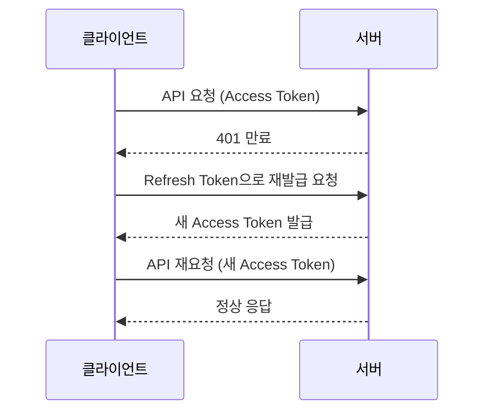
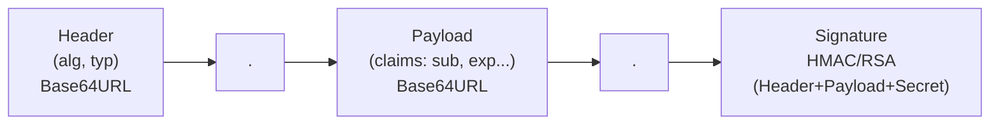

# 27. OAuth Quiz book

## **1-02.** #Quiz **인증 Authentication [초급]**

### 퀴즈 1

인증(Authentication)에 대한 설명으로 가장 적절한 것은 무엇인가요?

1. 리퀘스트가 수행할 수 있는 작업 범위를 제한하는 기능이다.
2. 서버가 리퀘스트를 보낸 유저가 누구인지 파악하는 기능이다.
3. 리퀘스트 바디를 암호화해 서버로 전달하는 기능이다.
4. DB의 유저 테이블 스키마를 자동 생성하는 기능이다.
- 정답 및 해설
    
    **정답:** 2번
    
    **해설:** 인증은 “누가 요청했는가”를 파악하는 과정이며, “무엇을 할 수 있는가”를 판단하는 인가와 구분됩니다.
    

### 퀴즈 2

다음 중 인증과 인가의 관계를 올바르게 설명한 것은 무엇인가요?

1. 인가가 먼저 수행되고 인증이 뒤따른다.
2. 둘은 완전히 같은 기능이라 구분하지 않아도 된다.
3. 일반적으로 인증이 선행되고 그 결과를 바탕으로 인가가 수행된다.
4. 인증은 OAuth에서만 사용되고 인가는 일반 서비스에서만 사용된다.
- 정답 및 해설
    
    **정답:** 3번
    
    **해설:** 인증으로 요청 주체를 확인한 다음, 해당 주체가 요청 작업을 수행할 수 있는지 인가로 판단합니다.
    

---

## **1-03.** #Quiz **쿠키 인증 [초급]**

### 퀴즈 1

쿠키 인증 플로우에서 브라우저가 자동으로 수행하는 동작으로 가장 적절한 것은 무엇인가요?

1. 로그인 리퀘스트 바디를 자동 암호화해 전송한다.
2. Authorization 헤더를 자동으로 생성해 토큰을 붙인다.
3. `Set-Cookie`를 받아 저장하고, 이후 해당 도메인 리퀘스트에 `Cookie` 헤더를 붙여 보낸다.
4. 서버 세션 만료 시간을 자동 연장한다.
- 정답 및 해설
    
    **정답:** 3번
    
    **해설:** 쿠키 인증의 핵심은 서버의 `Set-Cookie`와 브라우저의 자동 저장/자동 전송 동작입니다.
    

### 퀴즈 2

`facebook.com`에서 설정된 쿠키에 대한 설명으로 가장 적절한 것은 무엇인가요?

1. 모든 도메인 요청에 자동으로 함께 전송된다.
2. Authorization 헤더로 자동 변환되어 전송된다.
3. 브라우저를 껐다 켜도 항상 자동 삭제된다.
4. 기본적으로 해당 도메인 범위 요청에서만 전송되며, 다른 루트 도메인에는 자동 전송되지 않는다.
- 정답 및 해설
    
    **정답:** 4번
    
    **해설:** 쿠키는 도메인 정책에 따라 전송 범위가 제한되며, 다른 루트 도메인으로 자동 전송되지 않습니다.
    

---

## **1-04.** #Quiz **쿠키 보안 [중급]**

### 퀴즈 1

`HttpOnly` 설정의 목적을 가장 정확하게 설명한 것은 무엇인가요?

1. 클라이언트 JavaScript 코드에서 쿠키 값을 직접 읽지 못하게 한다.
2. 쿠키를 HTTPS가 아닌 환경에서도 전송 가능하게 한다.
3. 쿠키의 만료 시간을 영구적으로 만든다.
4. 다른 도메인으로 쿠키 공유를 강제한다.
- 정답 및 해설
    
    **정답:** 1번
    
    **해설:** `HttpOnly`는 스크립트 접근을 제한해 XSS 상황에서 쿠키 탈취 위험을 낮추는 데 목적이 있습니다.
    

### 퀴즈 2

쿠키에 `Secure` 설정을 켰을 때 기대할 수 있는 효과로 가장 적절한 것은 무엇인가요?

1. 쿠키가 로컬스토리지에도 자동 복제된다.
2. 쿠키 만료 시간이 무제한으로 변경된다.
3. 쿠키가 자동으로 암호화 저장된다.
4. HTTPS 환경에서만 쿠키 전송이 허용되어 네트워크 노출 위험을 줄일 수 있다.
- 정답 및 해설
    
    **정답:** 4번
    
    **해설:** `Secure`는 HTTPS 전송을 강제해 평문 HTTP에서 쿠키가 노출되는 위험을 줄여줍니다.
    

---

## **1-05.** #Quiz **Authorization 헤더 인증 [중급]**

### 퀴즈 1

Authorization 헤더 인증의 장점으로 가장 적절한 것은 무엇인가요?

1. 브라우저가 모든 리퀘스트에 자동으로 인증 정보를 붙여준다.
2. 쿠키와 달리 개발자가 코드로 제어해 다른 루트 도메인 요청에도 인증 정보를 첨부할 수 있다(단, 서버의 CORS 허용이 필요하다).
3. 인증서는 반드시 쿠키에만 저장해야 한다.
4. 서버가 요청별로 인증 여부를 자동 판단해준다.
- 정답 및 해설
    
    **정답:** 2번
    
    **해설:** 쿠키는 다른 루트 도메인으로 자동 전송되지 않지만, Authorization 헤더는 개발자가 코드로 첨부할 수 있어 교차 도메인 요청에도 활용할 수 있습니다. 다만 브라우저 환경에서는 서버의 CORS 허용 설정이 필요합니다.
    

### 퀴즈 2

Authorization 헤더 인증을 사용할 때 보안 관점에서 가장 주의해야 할 항목은 무엇인가요?

1. 비밀번호 같은 민감 정보를 클라이언트 저장소에 그대로 보관하는 것
2. 응답 코드를 200으로 고정하는 것
3. 리퀘스트 바디를 빈 문자열로 보내는 것
4. 리소스 서버 URL을 하드코딩하는 것
- 정답 및 해설
    
    **정답:** 1번
    
    **해설:** 저장 방식과 별개로 비밀번호 같은 원문 자격 증명을 저장하는 것은 큰 보안 위험입니다.
    

---

## **1-06.** #Quiz **세션 기반 인증 [중급]**

### 퀴즈 1

세션 기반 인증에서 서버가 인증에 사용하는 핵심 식별자는 무엇인가요?

1. 클라이언트 로컬스토리지의 이메일 값
2. 브라우저 User-Agent 문자열
3. Authorization 헤더의 Bearer 토큰
4. 쿠키로 전달되는 세션 ID
- 정답 및 해설
    
    **정답:** 4번
    
    **해설:** 세션 기반 인증은 서버에 저장된 세션 레코드와 쿠키의 세션 ID를 매칭해 유저를 식별합니다.
    

### 퀴즈 2

세션 기반 인증에서 로그아웃이 처리되는 방식으로 가장 적절한 것은 무엇인가요?

1. 서버의 세션/로그인 기록을 만료 또는 삭제해 기존 세션 ID를 무효화한다.
2. 브라우저 캐시만 비우면 자동으로 서버 세션이 삭제된다.
3. 토큰 만료 시간을 0으로 만드는 방식만 지원한다.
4. 세션은 한 번 생성되면 영구적으로 유지된다.
- 정답 및 해설
    
    **정답:** 1번
    
    **해설:** 세션 기반 인증의 유효성은 서버 측 상태에 의해 결정되므로 서버 기록 만료/삭제가 핵심입니다.
    

---

## **1-07.** #Quiz **토큰 기반 인증 [중급]**

### 퀴즈 1

토큰 기반 인증 설명으로 가장 적절한 것은 무엇인가요?

1. 클라이언트가 전달한 토큰을 기준으로 서버가 요청 주체를 검증해 인증을 처리한다.
2. 서버는 매 리퀘스트마다 세션 저장소를 조회해야만 인증 가능하다.
3. 토큰은 브라우저가 자동으로 Authorization 헤더에 붙여준다.
4. 로그아웃은 서버 재시작으로만 처리할 수 있다.
- 정답 및 해설
    
    **정답:** 1번
    
    **해설:** 토큰 기반 인증은 요청마다 전달된 토큰을 검증해 사용자 식별을 수행하며, 세션 저장소 조회가 필수는 아닙니다.
    

### 퀴즈 2

토큰 기반 인증에서 “클라이언트 삭제만으로 로그아웃 처리” 설명에 대한 보완으로 적절한 것은 무엇인가요?

1. 클라이언트 삭제만으로 항상 즉시 전역 무효화가 보장된다.
2. 토큰은 만료 개념이 없으므로 별도 조치가 필요 없다.
3. 로그아웃은 토큰 기반 인증에서 구현할 수 없다.
4. 즉시 무효화가 필요하면 서버 측 블랙리스트나 토큰 버전 관리 같은 전략이 추가될 수 있다.
- 정답 및 해설
    
    **정답:** 4번
    
    **해설:** 토큰은 상태 비저장 구조를 취할 수 있으므로, 강제 무효화가 필요한 경우 서버 전략을 별도로 둡니다.
    

### 퀴즈 3

토큰 기반 인증에서 서버가 인증 성공 여부를 판단할 때 핵심적으로 확인하는 항목 조합은 무엇인가요?

1. 브라우저 확장 프로그램 목록 + 클라이언트 화면 해상도
2. DB 인덱스 상태 + CDN 캐시 히트율
3. 세션 테이블 PK + 쿠키 Path 값
4. 토큰 유효성(서명/위변조 여부) + 만료 여부 + 필요한 클레임
- 정답 및 해설
    
    **정답:** 4번
    
    **해설:** 토큰 기반 인증은 토큰 자체 검증을 통해 처리하므로 서명 유효성, 만료 시간, 필요한 클레임 검증이 핵심입니다.
    

---

## **1-08.** #Quiz **인코딩과 Base64URL [중급]**

### 퀴즈 1

다음 중 인코딩과 암호화를 올바르게 구분한 설명은 무엇인가요?

1. 인코딩은 복원이 불가능하고 암호화는 누구나 복원 가능하다.
2. 인코딩과 암호화는 목적과 성질이 완전히 동일하다.
3. 인코딩은 형식 변환이 목적이고, 암호화는 권한 없는 열람을 막는 것이 목적이다.
4. 암호화는 헤더에서 사용할 수 없고 인코딩만 가능하다.
- 정답 및 해설
    
    **정답:** 3번
    
    **해설:** 인코딩은 표현 형식 통일이 목적이고, 암호화는 권한 없는 열람을 막는 것이 목적입니다.
    

### 퀴즈 2

Base64URL이 Base64와 구분되는 주요 이유로 가장 적절한 것은 무엇인가요?

1. 비대칭키 서명을 기본으로 강제하기 때문이다.
2. 디코딩이 불가능한 단방향 변환이기 때문이다.
3. 반드시 쿠키에서만 사용할 수 있기 때문이다.
4. URL에서 의미를 가질 수 있는 `+`, `/` 문자를 , `_`로 대체하기 때문이다.
- 정답 및 해설
    
    **정답:** 4번
    
    **해설:** Base64URL은 URL 안전성을 위해 일부 문자를 치환한 인코딩 방식이며, 암호화와는 개념이 다릅니다.
    

---

## **1-10.** #Quiz **Refresh 토큰 [중급]**

Access 토큰과 Refresh 토큰의 역할을 구분하려면 만료 이후 재발급 흐름을 함께 보는 것이 효과적입니다.

### 퀴즈 1

Refresh 토큰의 사용 목적을 가장 정확히 설명한 것은 무엇인가요?

1. 모든 API 요청 권한을 장기적으로 유지하기 위한 본 토큰이다.
2. 만료된 Access 토큰을 재발급받을 때 재로그인 빈도를 줄이기 위해 사용한다.
3. 쿠키의 `HttpOnly` 설정을 대체하기 위해 사용한다.
4. 인가 범위(Scope)를 동적으로 확장하기 위해 사용한다.
- 정답 및 해설
    
    **정답:** 2번
    
    **해설:** Refresh 토큰은 Access 토큰 만료 이후 재인증 부담을 줄이기 위한 재발급 용도로 사용됩니다.
    

### 퀴즈 2

Access 토큰 만료 후 클라이언트 동작으로 가장 적절한 것은 무엇인가요?

1. 사용자 비밀번호를 매번 다시 입력받아야만 한다.
2. 서버 재시작 후 토큰을 다시 요청한다.
3. Refresh 토큰을 사용해 새 Access 토큰 발급 요청을 보낸다.
4. 만료된 Access 토큰을 계속 재사용한다.
- 정답 및 해설
    
    **정답:** 3번
    
    **해설:** Refresh 토큰은 Access 토큰 재발급 용도이며, 이를 통해 재로그인 빈도를 낮출 수 있습니다.
    

---

## **1-11.** #Quiz **JWT (JSON Web Token) [중급]**

JWT는 세 부분이 결합된 토큰 형식이므로, 구조를 먼저 시각적으로 확인하면 각 문항의 의도를 더 정확히 파악할 수 있습니다.

### 퀴즈 1

JWT 구조 설명으로 가장 적절한 것은 무엇인가요?

1. Header, Payload, Signature 세 부분으로 구성된다.
2. Payload 없이 Header와 Signature만 사용한다.
3. Signature가 없어도 정상 JWT로 간주된다.
4. Header에는 만료 시간만 저장할 수 있다.
- 정답 및 해설
    
    **정답:** 1번
    
    **해설:** JWT는 점(`.`)으로 구분된 Header/Payload/Signature 구조를 갖습니다.
    

### 퀴즈 2

JWT Payload에 대한 설명으로 가장 적절한 것은 무엇인가요?

1. 기본적으로 암호화되어 서버만 읽을 수 있다.
2. Signature와 동일한 데이터가 중복 저장된다.
3. Base64URL로 인코딩된 영역이라 디코딩이 가능하며, 민감정보 원문 저장은 피해야 한다.
4. JWT 표준에서 반드시 비어 있어야 한다.
- 정답 및 해설
    
    **정답:** 3번
    
    **해설:** JWT Payload는 인코딩된 데이터이므로 읽힐 수 있다는 전제에서 최소한의 정보만 담아야 합니다.
    

### 퀴즈 3

JWT에서 Signature의 핵심 역할로 가장 적절한 것은 무엇인가요?

1. 토큰 내용 위변조 여부를 검증한다.
2. Payload를 압축해 토큰 길이를 줄인다.
3. 토큰 만료 시간을 자동 연장한다.
4. 쿠키 전송 여부를 브라우저에 지시한다.
- 정답 및 해설
    
    **정답:** 1번
    
    **해설:** Signature는 서버가 서명한 값으로, 수신 시 검증을 통해 토큰의 위변조 여부를 판단하는 데 사용됩니다.
    

---

## **1-12.** #Quiz **세션 vs 토큰 기반 인증 [중급]**

### 퀴즈 1

토큰 기반 인증이 세션 기반 인증보다 효율적일 수 있는 이유로 가장 적절한 것은 무엇인가요?

1. 브라우저가 자동으로 토큰을 전송해 서버 부하를 줄이기 때문이다.
2. 세션 저장소를 조회하지 않고 토큰 자체를 해석해 인증을 처리할 수 있기 때문이다.
3. 토큰은 만료 기간이 없어 재발급 비용이 없기 때문이다.
4. 토큰 기반 인증은 DB를 사용하지 않기 때문이다.
- 정답 및 해설
    
    **정답:** 2번
    
    **해설:** 토큰 기반 인증은 저장된 데이터와 비교하는 대신 토큰 자체를 해석해 처리하므로, 로그인 유저가 많아질 때 세션 저장소 조회 부담이 없습니다.
    

### 퀴즈 2

세션 기반 인증이 토큰 기반 인증보다 유리한 상황으로 가장 적절한 것은 무엇인가요?

1. RESTful API 서버를 stateless하게 유지해야 할 때
2. 여러 서비스가 같은 시크릿 키로 토큰을 공유해야 할 때
3. 특정 세션을 즉시 강제 만료해야 하는 보안 요구가 있을 때
4. 서버 저장소 없이 인증을 처리해야 할 때
- 정답 및 해설
    
    **정답:** 3번
    
    **해설:** 세션 기반 인증은 서버가 상태를 직접 관리하므로 세션 레코드를 삭제하거나 만료 처리해 즉시 무효화할 수 있습니다. 토큰 기반은 이를 위해 별도 전략이 필요합니다.
    

---

## **1-13.** #Quiz **인가 Authorization [중급]**

### 퀴즈 1

게시글 삭제 요청 처리에서 “인가”에 해당하는 질문은 무엇인가요?

1. 요청 바디 JSON 형식이 유효한가?
2. 요청 시간대가 피크 트래픽 시간인가?
3. 인증된 유저가 해당 게시글을 삭제할 권한이 있는가?
4. 쿠키 만료 시간은 몇 분인가?
- 정답 및 해설
    
    **정답:** 3번
    
    **해설:** 인가는 인증 이후, 해당 유저가 특정 작업을 수행할 권한이 있는지를 판단하는 단계입니다.
    

### 퀴즈 2

인가 정책 구현 관점에서 가장 적절한 접근은 무엇인가요?

1. 정책 없이 모든 인증 유저에게 동일 권한을 부여한다.
2. 기획된 서비스 규칙을 기준으로 작업별 허용 대상을 코드에 반영한다.
3. 인증 성공 여부와 관계없이 인가를 생략한다.
4. 브라우저 테마 설정으로 권한을 판단한다.
- 정답 및 해설
    
    **정답:** 2번
    
    **해설:** 인가는 서비스 정책을 코드로 반영하는 과정이며, 작업별 허용 범위를 명확히 정의해야 합니다.
    

---

## **2-01.** #Quiz **접근 권한 위임과 OAuth [초급]**

### 퀴즈 1

OAuth가 등장한 핵심 배경으로 가장 적절한 것은 무엇인가요?

1. 사용자 비밀번호를 제3자 서비스에 직접 공유하지 않고 권한을 위임하기 위해
2. 모든 웹사이트를 단일 도메인으로 통합하기 위해
3. 쿠키 저장 용량 제한을 없애기 위해
4. JWT 구조를 단순화하기 위해
- 정답 및 해설
    
    **정답:** 1번
    
    **해설:** OAuth는 민감한 인증 정보를 직접 공유하지 않고도 제3자 서비스 접근 권한을 위임하기 위한 표준입니다.
    

### 퀴즈 2

OAuth에 대한 설명으로 가장 적절한 것은 무엇인가요?

1. OAuth는 인증(Authentication) 전용 프로토콜이다.
2. OAuth는 Base64URL 인코딩 표준이다.
3. OAuth는 세션 저장소를 자동 생성하는 DB 규격이다.
4. OAuth는 접근 권한 위임(Authorization Delegation) 표준이다.
- 정답 및 해설
    
    **정답:** 4번
    
    **해설:** OAuth는 인증 그 자체보다 “권한 위임”을 표준화한 프로토콜입니다.
    

---

## **2-02.** #Quiz **OAuth 주체와 설정 [중급]**

### 퀴즈 1

OAuth 사전 설정에서 Client ID/Secret과 Scope의 역할 조합으로 가장 적절한 것은 무엇인가요?

1. Client ID/Secret은 유저 비밀번호 대체, Scope는 토큰 암호화 알고리즘 선택
2. Client ID/Secret은 쿠키 만료 설정, Scope는 DB 스키마 생성
3. Client ID/Secret은 리소스 서버 데이터 저장, Scope는 CORS 설정
4. Client ID/Secret은 클라이언트 식별/신뢰 확인, Scope는 위임 권한 범위 제한
- 정답 및 해설
    
    **정답:** 4번
    
    **해설:** Client ID/Secret은 서비스 식별에, Scope는 위임받을 권한의 최소 범위 설정에 사용됩니다.
    

### 퀴즈 2

OAuth 설정 시 Scope 전략으로 가장 바람직한 것은 무엇인가요?

1. 가능한 한 모든 권한을 기본값으로 요청한다.
2. 실제 기능 구현에 필요한 최소 권한만 요청한다.
3. Scope는 보안과 무관하므로 설정하지 않는다.
4. Scope 대신 Client Secret 길이를 늘린다.
- 정답 및 해설
    
    **정답:** 2번
    
    **해설:** 최소 권한 원칙을 따르면 유출/오용 시 피해 범위를 줄이고 사용자 신뢰도 높일 수 있습니다.
    

---

## **2-03.** #Quiz **OAuth 워크플로우 [중급]**

### 퀴즈 1

Authorization Code 플로우에서 백엔드가 인가 서버로 보내는 핵심 조합으로 가장 적절한 것은 무엇인가요?

1. 세션 ID + 쿠키 만료 시간
2. Access Token + Refresh Token
3. Authorization Code + Client ID/Secret
4. User-Agent + IP 주소
- 정답 및 해설
    
    **정답:** 3번
    
    **해설:** 백엔드는 프론트에서 받은 Authorization Code와 자체 보유한 Client 자격 증명을 함께 보내 토큰을 교환합니다.
    

### 퀴즈 2

Authorization Code 플로우에서 Authorization Code 전달 흐름으로 가장 적절한 것은 무엇인가요?

1. 리소스 서버가 코드를 발급해 백엔드로 직접 보낸다.
2. 인가 서버가 프론트엔드에 코드를 주고, 프론트엔드가 이를 백엔드로 전달한다.
3. 프론트엔드가 임의로 코드를 생성해 백엔드로 보낸다.
4. DB에서 기존 코드를 조회해 재사용한다.
- 정답 및 해설
    
    **정답:** 2번
    
    **해설:** 코드는 인가 서버에서 발급되고, 프론트엔드를 거쳐 백엔드가 토큰 교환 단계에 사용합니다.
    

### 퀴즈 3

Authorization Code 플로우에서 Client Secret을 백엔드에만 저장하는 이유로 가장 적절한 것은 무엇인가요?

1. 프론트엔드 번들 크기를 줄이기 위해서
2. 인가 서버가 프론트엔드 요청을 차단하기 위해서
3. 리소스 서버 URL을 숨기기 위해서
4. 민감한 자격 증명 노출을 줄이고, 토큰 교환 주체를 신뢰 가능한 서버로 제한하기 위해서
- 정답 및 해설
    
    **정답:** 4번
    
    **해설:** Client Secret은 노출되면 위험하므로 백엔드에서만 관리해야 하며, 이것이 Authorization Code 플로우 보안의 핵심입니다.
    

---

## **2-04.** #Quiz **OpenID Connect [중급]**

### 퀴즈 1

OIDC가 OAuth와 구분되는 핵심 추가 요소는 무엇인가요?

1. CORS 정책 자동 생성
2. 유저 신원 정보를 담는 `id token`을 통한 인증 처리
3. 세션 기반 인증만 강제
4. Scope 개념 제거
- 정답 및 해설
    
    **정답:** 2번
    
    **해설:** OIDC는 OAuth 기반 권한 위임에 인증 계층을 추가하며, 그 핵심이 `id token`입니다.
    

### 퀴즈 2

OIDC에서 `id token`과 `access token`의 역할 차이로 가장 적절한 것은 무엇인가요?

1. `id token`은 리소스 서버 접근에 쓰이고, `access token`은 신원 증명에 쓰인다.
2. `id token`은 사용자 신원(인증 결과) 전달에 쓰이고, `access token`은 리소스 서버 접근 권한 요청에 쓰인다.
3. 둘은 동일한 데이터를 담은 중복 토큰이다.
4. `id token`은 클라이언트 식별에만 쓰이고, `access token`은 쿠키를 대체한다.
- 정답 및 해설
    
    **정답:** 2번
    
    **해설:** `id token`은 인증 결과와 사용자 신원 정보 전달이 목적이고, `access token`은 리소스 서버에 접근 권한을 증명하는 데 사용됩니다.
    

### 퀴즈 3

OIDC에서 기본 `id token` 외 추가 사용자 데이터가 더 필요할 때 가장 적절한 방식은 무엇인가요?

1. 클라이언트가 임의 사용자 정보를 입력한다.
2. Authorization 헤더 없이 리소스 서버에 공개 요청한다.
3. 필요한 스코프를 설정하고 Access Token으로 리소스 서버에 요청한다.
4. Client Secret을 프론트엔드에 노출해 직접 조회한다.
- 정답 및 해설
    
    **정답:** 3번
    
    **해설:** 필요한 정보 범위를 스코프로 정의하고, Access Token을 사용해 해당 리소스 서버에서 안전하게 조회하는 방식이 정석입니다.
    

---

## **2-05.** #Quiz **다양한 OAuth OpenID 플로우 [중급]**

### 퀴즈 1

Implicit 플로우보다 Authorization Code 플로우가 권장되는 주된 이유로 가장 적절한 것은 무엇인가요?

1. 토큰 발급을 백엔드 교환 단계로 분리해 민감한 토큰 노출 위험을 줄일 수 있기 때문이다.
2. 인가 서버 없이도 동작하기 때문이다.
3. Client Secret을 프론트엔드에서 안전하게 저장할 수 있기 때문이다.
4. Access Token 없이도 리소스 접근이 가능하기 때문이다.
- 정답 및 해설
    
    **정답:** 1번
    
    **해설:** Authorization Code 플로우는 토큰 교환을 백엔드에서 처리해 보안성이 높아 현재 표준 권장 방식입니다.
    

### 퀴즈 2

Implicit 플로우의 보안상 위험 요소로 가장 적절한 것은 무엇인가요?

1. 인가 서버가 Access Token을 절대 발급하지 않는다.
2. 프론트엔드/브라우저 경로에서 Access Token이 직접 노출될 수 있다.
3. Scope를 사용할 수 없어서 권한 제한이 불가능하다.
4. OAuth 표준에서 완전히 제거되어 구현 자체가 불가능하다.
- 정답 및 해설
    
    **정답:** 2번
    
    **해설:** Implicit 플로우는 Access Token이 프론트 채널에 직접 반환되는 구조라, 중간에 가로채일 위험이 상대적으로 높습니다.
    

### 퀴즈 3

Authorization Code 플로우에서 “코드 탈취만으로는 바로 토큰 발급이 어려운” 이유로 가장 적절한 것은 무엇인가요?

1. Authorization Code는 Base64URL이 아니기 때문이다.
2. 인가 서버가 코드 만료 시간을 무제한으로 두기 때문이다.
3. 리소스 서버가 토큰을 직접 발급하지 않기 때문이다.
4. 토큰 교환 단계에서 서버 측 Client 자격 증명 검증이 추가로 필요하기 때문이다.
- 정답 및 해설
    
    **정답:** 4번
    
    **해설:** 코드만 탈취해도 교환 단계의 Client 검증을 통과하지 못하면 토큰을 얻기 어렵다는 점이 보안 이점입니다.