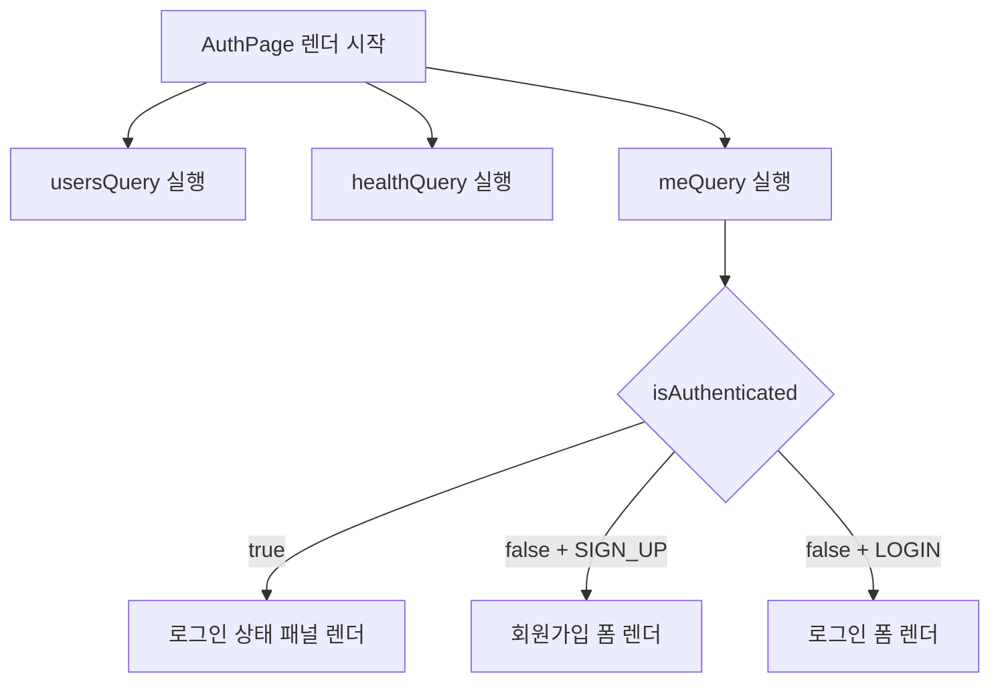
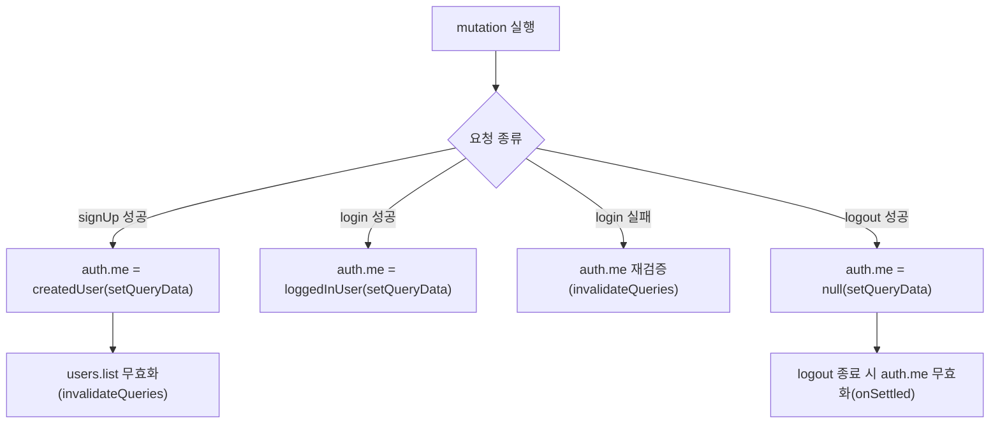
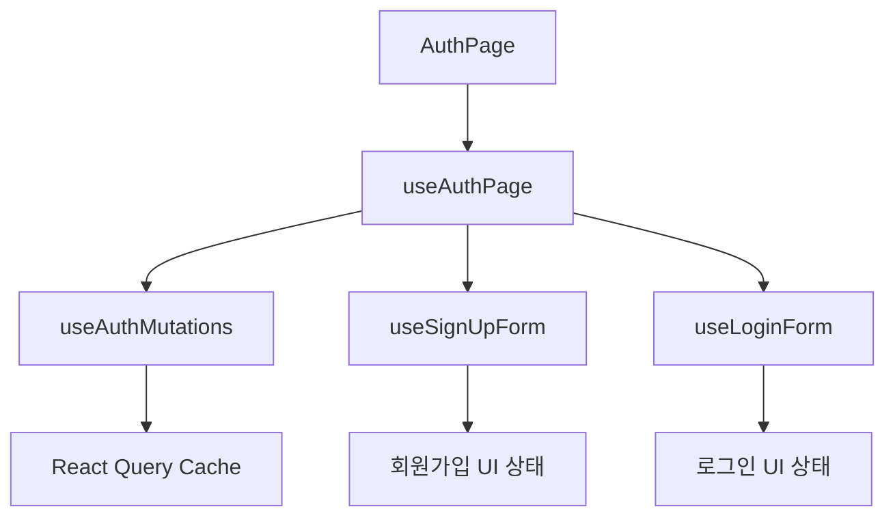

# 28. React 유저 기능 만들기

# 제 1장: Auth 프로젝트에서 useQuery로 조회 흐름 설계하기

## **1-01. 장 소개 및 세팅**

인증 기능은 로그인 요청을 보내는 순간보다, 시간이 지나도 로그인 상태가 일관되게 유지되는지가 더 중요한 영역입니다.
현재 프로젝트의 인증 화면은 단순 폼 제출을 넘어, 백엔드 연결 상태와 현재 세션 상태를 동시에 보여주는 구조로 설계되어 있습니다.
이 구조를 `useState` 같은 로컬 상태로만 운영하면, 새로고침·탭 이동·세션 만료 시 화면이 서버 실제 상태와 어긋나기 쉽습니다.

따라서 이 장은 인증 상태를 로컬 플래그로 보관하는 대신, 서버 상태를 `useQuery`로 조회하고 해석하는 방식으로 정리합니다.
구체적으로는 `getMe`의 응답 계약 설계, `queryKey` 중앙 관리, 전역 에러 경계 구성, 그리고 `AuthPage`에서 세 쿼리를 연결하는 순서로 진행합니다.

### 코드 받기 및 의존성 설치

```bash
git clone https://github.com/winverse/codeit-fs-react-query-auth.git

cd frontend 

pnpm install

cd ../backend

pnpm install
```

- [`README.md`](https://github.com/winverse/codeit-fs-react-query-auth) 참고하여 세팅

---

## **1-02. 인증 상태를 서버 조회로 다루는 이유**

로그인 여부를 `useState`로만 관리하면 세션 만료, 쿠키 삭제, 다른 요청으로 인한 상태 변화를 반영하기 어렵습니다.
반면 인증을 `me` 조회 쿼리로 고정하면, “지금 로그인되어 있는가”를 로컬 변수 대신 서버 응답 계약으로 해석할 수 있습니다.
이때 핵심은 비로그인을 장애가 아닌 정상 상태로 표현하도록 기준을 먼저 정하는 것입니다.

이 계약을 코드로 구현하려면 먼저 요청 계층에서 오류 메시지를 정규화해야 하고, 그 다음 `getMe`에서 인증 실패를 `null`로 변환하는 순서가 필요합니다.
따라서 1-04에서 요청 계층(`error-messages.js`, `request.js`)을 먼저 정리한 뒤, 1-06에서 `getMe`와 `AuthPage` 연결을 함께 구성합니다.

---

## **1-03. Query Key를 중앙에서 관리하기**

React Query 캐시는 `queryKey`를 기준으로 동일 데이터를 식별하므로, 인증 화면처럼 조회 종류가 늘어나는 구조에서는 키를 문자열로 흩어 쓰지 않는 편이 유리합니다.
이 프로젝트는 `queryKeys` 객체를 통해 키 생성 규칙을 중앙에서 통일하고, 화면에서는 함수 호출로만 키를 참조합니다.

파일: `src/lib/query-keys.js`

```jsx
export const queryKeys = {
  backend: {
    health: () => ["backend", "health"],
  },
  auth: {
    me: () => ["auth", "me"],
  },
  users: {
    all: () => ["users"],
    list: () => [...queryKeys.users.all(), "list"],
  },
};
```

`users.list()`를 `users.all()` 기반으로 확장해 두면, 이후 상세/통계 쿼리가 추가되더라도 상위 키 무효화로 동기화 범위를 일관되게 제어할 수 있습니다.

| 키 함수 | 반환값 | 현재 화면 역할 |
| --- | --- | --- |
| `queryKeys.backend.health()` | `['backend', 'health']` | 백엔드 연결 상태 조회 |
| `queryKeys.auth.me()` | `['auth', 'me']` | 현재 로그인 사용자 조회 |
| `queryKeys.users.all()` | `['users']` | 사용자 도메인 상위 범위 |
| `queryKeys.users.list()` | `['users', 'list']` | 사용자 목록 조회/무효화 기준 |

---

## **1-04. API 요청과 비로그인 계약**

`useQuery`는 `queryFn`이 값을 반환하면 성공으로, 에러를 던지면 실패로 간주합니다.
따라서 인증 도메인에서는 어떤 응답을 실패로 처리할지 API 함수 레벨에서 먼저 정의해야 합니다.

이 프로젝트는 네트워크/서버 오류는 에러로 처리하되, 인증 실패(서버 401)는 `getMe`에서 `error.status`를 기준으로 `null`로 변환하여 정상 비로그인 상태로 취급합니다.
이때 메시지 정규화 규칙은 요청 함수와 분리해 별도 파일에서 관리합니다.

파일: `src/lib/api/error-messages.js`

```jsx
export const DEFAULT_ERROR_MESSAGE =
  "요청을 처리하지 못했습니다. 잠시 후 다시 시도해 주세요.";

const ERROR_MESSAGE_OVERRIDES = {
  "Invalid email or password":
    "이메일 또는 비밀번호가 올바르지 않습니다.",
  "No authentication token provided":
    "인증 토큰이 없습니다.",
  "Invalid or expired token":
    "토큰이 유효하지 않거나 만료되었습니다.",
  "User not found from token":
    "토큰에 해당하는 사용자를 찾을 수 없습니다.",
};

export function normalizeErrorMessage(message) {
  return ERROR_MESSAGE_OVERRIDES[message] ?? message;
}
```

파일: `src/lib/api/request.js`

```jsx
import {
  DEFAULT_ERROR_MESSAGE,
  normalizeErrorMessage,
} from "./error-messages.js";

const BACKEND_BASE_URL =
  process.env.NEXT_PUBLIC_BACKEND_BASE_URL ??
  "http://localhost:5001";
const API_PREFIX = "/api";

function normalizeBaseUrl(url) {
  return url.replace(/\/+$/, "");
}

function buildBackendApiUrl(path) {
  return `${normalizeBaseUrl(BACKEND_BASE_URL)}${API_PREFIX}${path}`;
}

export async function request(path, options = {}) {
  const {
    method = "GET",
    body,
    cache = "no-store",
  } = options;

  const response = await fetch(buildBackendApiUrl(path), {
    method,
    headers: { "Content-Type": "application/json" },
    credentials: "include",
    cache,
    body: body ? JSON.stringify(body) : undefined,
  });

  const payload = await response.json().catch(() => null);

  if (!response.ok) {
    const rawMessage =
      payload?.message ?? DEFAULT_ERROR_MESSAGE;
    const message = normalizeErrorMessage(rawMessage);
    const error = new Error(message);
    error.status = response.status;
    error.code = payload?.code;
    error.field = payload?.field;
    throw error;
  }

  return payload;
}
```

`request` 함수는 모든 API 요청의 기반이 되고, 정규화된 메시지와 함께 `status`, `code`, `field`를 에러 객체에 담아 전달하는 공통 계층으로 동작합니다.
`getMe`는 이 에러 객체의 `status` 값을 기준으로 인증 실패(401)만 `null`로 변환해 비로그인을 정상 상태로 유지합니다.

---

## **1-05. 전역 에러 경계**

`useQuery`는 `queryFn`이 에러를 던지면 `isError` 상태로 전환하며, 화면에서 인라인으로 처리할 수 있습니다.
반면 예상하지 못한 JS 런타임 에러처럼 React 렌더 트리 어디서든 발생할 수 있는 오류는 `useQuery`로 잡을 수 없습니다.

Next.js App Router는 라우트 세그먼트 단위로 에러를 잡는 `error.js` 규칙 파일을 제공합니다.
`src/app/error.js`에 파일을 두면 해당 세그먼트 트리에서 처리되지 않은 에러를 가로채 fallback UI를 보여줍니다.

파일: `src/app/error.js`

```jsx
"use client";

import { useEffect } from "react";
import AppError from "@/components/AppError";

export default function Error({ error, reset }) {
  useEffect(() => {
    console.error(error);
  }, [error]);

  return <AppError message={error?.message} onRetry={reset} />;
}
```

`"use client"` 선언은 필수입니다. Next.js App Router의 `error.js`는 클라이언트 컴포넌트여야 `reset` 함수와 에러 객체를 props로 받을 수 있습니다.

`useEffect`에서 `console.error`를 호출하는 이유는 렌더와 사이드이펙트를 분리하기 위해서입니다.
에러 로깅은 렌더 결과와 무관한 부수 효과이므로 `useEffect` 안에서 처리하고, `error`가 바뀔 때만 재실행합니다.

`reset()`을 호출하면 해당 라우트 세그먼트를 다시 렌더링 시도합니다.
성공하면 fallback UI가 사라지고 정상 화면으로 복귀합니다.

실제 에러 메시지(`error.message`)를 사용자에게 그대로 노출하면 JS 런타임 에러의 기술적 문자열이 노출될 수 있습니다.
`error.js`는 `AppError`에 `message={error?.message}`를 전달하고, `AppError` 내부에서 `message ?? FALLBACK_MESSAGE`로 처리합니다.
현재 구현에서는 `error.message`가 있으면 그대로 표시됩니다. 항상 고정 메시지만 보여주고 싶다면 `AppError`에 `message`를 전달하지 않으면 됩니다.

| 처리 주체 | 대상 에러 | 처리 방식 |
| --- | --- | --- |
| `useQuery` (`isError`) | API 요청 실패, 네트워크 오류 | 인라인 UI 분기 |
| `error.js` (ErrorBoundary) | 예상하지 못한 JS 런타임 에러 | fallback UI 전체 교체 |

이 두 계층을 함께 두면 예상한 에러는 화면 안에서 처리하고, 예상하지 못한 에러는 앱 전체가 멈추지 않고 안전하게 복구할 수 있습니다.

---

## **1-06. getMe와 AuthPage 연결하기**

이제 앞에서 정리한 요청 계층과 에러 경계를 바탕으로 `getMe`를 구현한 뒤, `AuthPage`에 연결합니다.
이때 전역 정책과 페이지별 정책을 분리해 과도한 재요청을 막고, 인증 분기 조건을 단일 기준으로 유지하는 것이 중요합니다.

### 인증 조회 함수 (`getMe`)

파일: `src/lib/api/auth.js`

```jsx
import { request } from "./request.js";

export async function getMe() {
  try {
    return await request("/auth/me");
  } catch (error) {
    if (error?.status === 401) {
      return null;
    }

    throw error;
  }
}
```

| 상황 | HTTP 응답 | `getMe` 반환값 | 화면 해석 |
| --- | --- | --- | --- |
| 로그인 유지 | 200 | `User` 객체 | 로그인 상태 |
| 비로그인 | 401 | `null` | 정상 비로그인 |
| 서버/네트워크 장애 | 5xx 또는 네트워크 오류 | `throw Error` | 장애 상태 |

이제 `AuthPage`에서는 `Boolean(meQuery.data)`를 로그인 판별 기준으로 사용하면 되고, 로컬 불리언 플래그를 별도로 유지할 필요가 없습니다.

### 전역 설정 (AppProviders)

파일: `src/providers/AppProviders.jsx`

```jsx
function makeQueryClient() {
  return new QueryClient({
    defaultOptions: {
      queries: {
        staleTime: 60_000,
      },
    },
  });
}
```

### 페이지별 설정 (AuthPage)

파일: `src/domains/auth/components/AuthPage/AuthPage.jsx`

`useAuthPage`는 폼 상태와 입력/제출 핸들러를 묶어 제공하는 화면 전용 훅이며, 내부 구성은 3장에서 분리 기준과 함께 정리합니다.

```jsx
export default function AuthPage() {
  const {
    mode,
    formError,
    formSuccess,
    createdEmail,
    signUpForm,
    loginForm,
    signUpErrors,
    loginErrors,
    signUpMutation,
    loginMutation,
    logoutMutation,
    handleModeChange,
    handleLogout,
    handleSignUpInput,
    handleLoginInput,
    handleSignUpSubmit,
    handleLoginSubmit,
  } = useAuthPage();

  const usersQuery = useQuery({
    queryKey: queryKeys.users.list(),
    queryFn: getUsers,
  });

  const healthQuery = useQuery({
    queryKey: queryKeys.backend.health(),
    queryFn: checkBackendHealth,
    retry: false,
    refetchOnWindowFocus: false,
  });

  const meQuery = useQuery({
    queryKey: queryKeys.auth.me(),
    queryFn: getMe,
    retry: false,
    refetchOnWindowFocus: false,
  });

  const isUserCreated = Boolean(
    createdEmail &&
    usersQuery.data?.some(
      (user) => user.email === createdEmail,
    ),
  );

  const apiStatusText = healthQuery.isLoading
    ? "백엔드 상태를 확인하는 중입니다."
    : healthQuery.isError
      ? "백엔드 연결 실패"
      : "백엔드 연결 정상";

  const authStatusText = meQuery.isLoading
    ? "로그인 상태 확인 중"
    : meQuery.data
      ? `${meQuery.data.email} 로그인됨`
      : "비로그인";

  const authFormContentByMode = {
    [AUTH_MODE.SIGN_UP]: (
      <SignUpForm
        form={signUpForm}
        errors={signUpErrors}
        onInput={handleSignUpInput}
        onSubmit={handleSignUpSubmit}
        isPending={signUpMutation.isPending}
      />
    ),
    [AUTH_MODE.LOGIN]: (
      <LoginForm
        form={loginForm}
        errors={loginErrors}
        onInput={handleLoginInput}
        onSubmit={handleLoginSubmit}
        isPending={loginMutation.isPending}
      />
    ),
  };

  const isAuthenticated = Boolean(meQuery.data);
  const loggedInContent = isAuthenticated ? (
    <div className={styles.authInfoBox}>
      <p className={styles.authInfoText}>
        현재 <strong>{meQuery.data.email}</strong>로
        로그인되어 있습니다.
      </p>
      <Button
        type="button"
        variant="ghost"
        disabled={logoutMutation.isPending}
        onClick={handleLogout}
      >
        {logoutMutation.isPending
          ? "처리 중..."
          : "로그아웃"}
      </Button>
    </div>
  ) : null;

  const authPanelContent = isAuthenticated
    ? loggedInContent
    : (authFormContentByMode[mode] ??
      authFormContentByMode[AUTH_MODE.LOGIN]);

  return (
    <main className={styles.page}>
      <div className={styles.backdropCircleOne} />
      <div className={styles.backdropCircleTwo} />

      <AuthHero
        mode={mode}
        apiStatusText={apiStatusText}
        isApiError={healthQuery.isError}
        authStatusText={authStatusText}
        isAuthError={meQuery.isError}
        isAuthenticated={isAuthenticated}
        createdEmail={createdEmail}
        isUserCreated={isUserCreated}
      />

      <section className={styles.panel}>
        {!isAuthenticated ? (
          <AuthModeSwitch
            mode={mode}
            onChange={handleModeChange}
          />
        ) : null}

        {formError ? (
          <p className={styles.formError}>{formError}</p>
        ) : formSuccess ? (
          <p className={styles.formSuccess}>
            {formSuccess}
          </p>
        ) : null}

        {authPanelContent}

        <UserListSection
          usersQuery={usersQuery}
          createdEmail={createdEmail}
        />
      </section>
    </main>
  );
}
```

위 구조의 핵심은 세 쿼리를 병렬로 실행하되, 인증 화면 분기를 `meQuery` 하나로 수렴시키고, 폼 분기를 `mode` 기반 매핑 객체로 선언형 구성한다는 점입니다.

### 흐름 다이어그램



---

## **1-07. 정리**

1장에서 다룬 내용을 네 가지로 요약합니다.

- **응답 계약 설계**: `getMe`에서 인증 실패 응답을 `null`로 변환해, 비로그인을 에러가 아닌 정상 데이터로 표현했습니다. 이 계약 덕분에 `AuthPage`는 `isError` 대신 `Boolean(meQuery.data)` 하나로 로그인 여부를 판별합니다.
- **`queryKey` 중앙화**: 키를 함수로 반환하는 `queryKeys` 객체로 통일해, 화면 어디서든 동일한 기준으로 캐시를 참조하고 무효화할 수 있게 했습니다.
- **전역 에러 경계**: `error.js`로 예상하지 못한 런타임 에러를 라우트 세그먼트 단위에서 잡아 fallback UI를 표시하고, `reset()`으로 복구 경로를 제공했습니다.
- **선언형 분기 구성**: 세 쿼리를 병렬로 실행하되, 인증 화면의 분기를 `meQuery` 하나로 수렴시키고 폼 전환을 `mode` 기반 매핑 객체로 표현했습니다.

다음 장에서는 `useMutation`으로 로그인·회원가입·로그아웃을 처리하면서, 변경 이후 캐시를 어떻게 동기화하는지 다룹니다.

# 제 2장: 상태의 변경과 동기화 (Mutation & Invalidation)

## **2-01. 장 소개**

1장에서는 `getMe` 조회를 중심으로 인증 상태를 서버에서 읽어오는 기반을 마련했습니다.
2장에서는 `login`, `signUp`, `logout`를 사용해 상태를 변경하는 흐름을 다룹니다.

React Query에서 변경 요청은 `useMutation`으로 처리하지만, 진짜 과제는 요청 자체가 아닙니다.
변경이 완료된 이후, 이미 캐시에 저장된 인증 상태와 사용자 목록을 어떤 방식으로, 어떤 범위까지 갱신할지 결정하는 것이 핵심입니다.
이 장에서는 `setQueryData`로 즉시 반영하는 방식과 `invalidateQueries`로 재조회하는 방식을 각 상황에 맞게 적용하는 기준을 정리합니다.

---

## **2-02. 인증 뮤테이션 (로그인, 회원가입, 로그아웃)**

먼저 `api/auth.js`에 정의된 인증 관련 함수를 `useMutation`으로 감싸고, 캐시 동기화만 전담하는 훅을 구성합니다.
이 구조에서는 `useAuthMutations`가 서버 상태 동기화 책임만 가지며, 성공 메시지나 폼 초기화 같은 UI 상태는 화면 로직 훅(`useAuthPage`)에서 처리합니다.

파일: `src/domains/auth/hooks/useAuthMutations.js`

```jsx
import {
  useMutation,
  useQueryClient,
} from "@tanstack/react-query";
import { login, logout, signUp } from "@/lib/api";
import { queryKeys } from "@/lib/query-keys";

export default function useAuthMutations() {
  const queryClient = useQueryClient();

  const signUpMutation = useMutation({
    mutationFn: signUp,
    onSuccess: async (createdUser) => {
      queryClient.setQueryData(
        queryKeys.auth.me(),
        createdUser,
      );
      await queryClient.invalidateQueries({
        queryKey: queryKeys.users.list(),
      });
    },
  });

  const loginMutation = useMutation({
    mutationFn: login,
    onSuccess: (loggedInUser) => {
      queryClient.setQueryData(
        queryKeys.auth.me(),
        loggedInUser,
      );
    },
    onError: async () => {
      await queryClient.invalidateQueries({
        queryKey: queryKeys.auth.me(),
      });
    },
  });

  const logoutMutation = useMutation({
    mutationFn: logout,
    onSuccess: () => {
      queryClient.setQueryData(queryKeys.auth.me(), null);
    },
    onSettled: async () => {
      await queryClient.invalidateQueries({
        queryKey: queryKeys.auth.me(),
      });
    },
  });

  return { signUpMutation, loginMutation, logoutMutation };
}
```

UI 상태 정리(성공 메시지, 폼 초기화, 필드 에러 분기)는 `mutate` 호출 지점에서 처리하며, 해당 구현은 3장에서 `useAuthPage`와 폼 전용 훅 분리와 함께 다룹니다.

### 동기화 전략 분석

이 구조는 두 가지 전략을 함께 사용합니다.

1. `setQueryData` 직접 반영
- 로그인/회원가입 성공 시 이미 유저 데이터를 가지고 있으므로 `auth.me`를 즉시 갱신합니다.
- 추가 네트워크 대기 없이 UI를 빠르게 전환할 수 있습니다.
1. `invalidateQueries` 재검증
- 사용자 목록처럼 서버 정렬/필터 영향을 받을 수 있는 데이터는 무효화 후 재조회합니다.
- 로그아웃은 `onSettled`에서 `auth.me`를 재검증해 최종 정합성을 확보합니다.

### 흐름 다이어그램



이 방식은 확실한 데이터는 즉시 반영하고, 불확실한 데이터는 재조회한다는 React Query 운영 원칙을 그대로 따릅니다.

---

## **2-03. 비관적 업데이트를 선택한 이유**

현재 인증 흐름은 서버 성공 응답을 확인한 뒤 UI를 갱신하므로 비관적 업데이트에 가깝습니다.
다만 성공 직후 `setQueryData`로 캐시를 즉시 갱신하므로 체감 속도는 낙관적 업데이트 수준으로 확보할 수 있습니다.

인증 영역은 보안과 연결되기 때문에, `onMutate` 시점에 먼저 로그인된 상태를 가정하는 방식보다 “성공 응답을 신뢰해 즉시 반영하고, 필요 시 재검증”하는 방식이 안전성과 예측 가능성을 함께 유지합니다.

---

## **2-04. 정리**

2장에서 다룬 내용을 세 가지로 요약합니다.

- **책임 분리**: `useAuthMutations`는 캐시 동기화만 담당하고, 성공 메시지·폼 초기화 같은 UI 상태 처리는 `mutate` 호출 지점으로 위임했습니다. 이 분리 덕분에 서버 동기화 정책과 화면 피드백 정책을 독립적으로 수정할 수 있습니다.
- **두 가지 동기화 전략**: 로그인·회원가입처럼 서버가 반환한 데이터를 이미 가지고 있는 경우 `setQueryData`로 즉시 반영하고, 사용자 목록처럼 서버 재정렬이 필요한 경우 `invalidateQueries`로 재조회했습니다.
- **보안 우선 설계**: 인증은 성공 여부가 보안과 직결되므로, 낙관적 업데이트 대신 성공 응답을 확인한 뒤 캐시에 반영하는 방식을 선택했습니다.

다음 장에서는 지금까지 구성한 로직을 역할 단위로 분리해, 더 읽기 쉽고 유지보수하기 쉬운 구조로 정리합니다.

# 제 3장: 리팩토링과 책임 분리 (Refactoring)

## **3-01. 장 소개**

1장과 2장을 통해 조회와 변경의 기본 동작은 완성되었습니다.
그런데 기능이 완성되었다고 구조까지 정리된 것은 아닙니다.
지금 상태의 `useAuthPage`에는 모드 전환, 폼 상태, 검증, 뮤테이션 실행, 메시지 처리가 한 곳에 뒤섞여 있어, 어느 한 부분을 수정하면 예상치 못한 범위까지 영향을 줄 수 있습니다.

이 장에서는 가독성, 예측 가능성, 응집도, 결합도라는 네 가지 기준을 바탕으로 인증 로직을 역할 단위로 분리합니다.
목표는 파일 수를 늘리는 것이 아니라, 코드가 바뀌는 이유를 분리해 각 파일의 수정 범위를 명확히 만드는 것입니다.

---

## **3-02. 역할 단위로 분리하기**

분리 전 `useAuthPage`에는 모드 전환, 폼 상태, 검증, 뮤테이션 실행, 성공/실패 메시지 처리가 한 파일에 모여 있어 변경 범위가 커지기 쉽습니다.
실무에서는 함께 바뀌는 코드끼리 묶고, 자주 독립적으로 바뀌는 코드는 분리해 결합도를 줄이는 편이 유지보수에 유리합니다.

현재 구조는 다음과 같이 책임을 분리합니다.

| 훅 | 책임 |
| --- | --- |
| `useAuthMutations` | 서버 요청 + 캐시 동기화(`setQueryData`, `invalidateQueries`) |
| `useSignUpForm` | 회원가입 폼 상태/검증/제출 UI 처리 |
| `useLoginForm` | 로그인 폼 상태/검증/제출 UI 처리 |
| `useAuthPage` | 모드 전환, 공통 메시지, 훅 조합 |

파일: `src/domains/auth/hooks/useAuthPage.js`

```jsx
import { useState } from "react";
import useAuthMutations from "@/domains/auth/hooks/useAuthMutations";
import { AUTH_MODE } from "@/domains/auth/utils/constants";
import useSignUpForm from "@/domains/auth/hooks/useSignUpForm";
import useLoginForm from "@/domains/auth/hooks/useLoginForm";

export default function useAuthPage() {
  const [mode, setMode] = useState(AUTH_MODE.SIGN_UP);
  const [formError, setFormError] = useState("");
  const [formSuccess, setFormSuccess] = useState("");
  const [createdEmail, setCreatedEmail] = useState("");

  const { signUpMutation, loginMutation, logoutMutation } = useAuthMutations();

  const {
    signUpForm,
    signUpErrors,
    handleSignUpInput,
    handleSignUpSubmit,
    resetSignUpFormState,
  } = useSignUpForm({
    signUpMutation,
    setFormError,
    setFormSuccess,
    setCreatedEmail,
  });

  const {
    loginForm,
    loginErrors,
    handleLoginInput,
    handleLoginSubmit,
    resetLoginFormState,
  } = useLoginForm({
    loginMutation,
    setFormError,
    setFormSuccess,
  });

  const handleModeChange = (nextMode) => {
    setMode(nextMode);
    setFormError("");
    setFormSuccess("");
    resetSignUpFormState();
    resetLoginFormState();
  };

  const handleLogout = () => {
    setFormError("");

    logoutMutation.mutate(undefined, {
      onSuccess: () => {
        setFormSuccess("로그아웃 완료");
      },
      onError: (error) => {
        setFormError(
          error instanceof Error
            ? error.message
            : "요청이 실패했습니다.",
        );
      },
    });
  };

  return {
    mode,
    formError,
    formSuccess,
    createdEmail,
    signUpForm,
    loginForm,
    signUpErrors,
    loginErrors,
    signUpMutation,
    loginMutation,
    logoutMutation,
    handleModeChange,
    handleLogout,
    handleSignUpInput,
    handleLoginInput,
    handleSignUpSubmit,
    handleLoginSubmit,
  };
}
```

이 코드에서 핵심은 `useAuthPage`가 세부 구현을 직접 수행하지 않고, 필요한 훅을 조합해 화면 관점의 인터페이스만 제공한다는 점입니다.
즉, `AuthPage`는 “무엇을 렌더링할지”에 집중하고, 입력/검증/동기화의 상세는 각각의 전용 훅으로 위임됩니다.

### 구조 다이어그램



---

## **3-03. 분리 기준 정리 및 마무리**

로직 분리에서 중요한 점은 파일 개수를 늘리는 것이 아니라, 변경 이유를 분리하는 것입니다.
이번 구조에서는 서버 상태 정책이 바뀔 때 `useAuthMutations`를, 폼 검증 정책이 바뀔 때 `useSignUpForm`/`useLoginForm`을, 화면 조합이 바뀔 때 `useAuthPage`를 수정하면 됩니다.

이 기준은 가독성과 결합도의 균형을 맞추는 실무적 선택입니다.

- 가독성 향상: 각 훅의 목적이 이름과 파일 경계에서 바로 드러납니다.
- 결합도 감소: 부모 훅이 하위 훅의 내부 상태 구현을 직접 알 필요가 줄어듭니다.
- 응집도 향상: 함께 바뀌는 코드가 같은 파일에 모입니다.

이 교재에서는 React Query 기반 인증 화면을 조회, 변경, 리팩토링의 세 단계로 나누어 구성했습니다.

- **1장 (조회)**: 인증 실패 응답을 `null`로 변환하는 계약을 통해 비로그인을 정상 상태로 표현하고, `queryKey` 팩토리로 캐시 기준을 중앙화했습니다. 이 두 가지가 인증 조회의 뼈대입니다.
- **2장 (변경)**: `setQueryData`로 즉시 반영과 `invalidateQueries`로 재검증을 상황에 따라 조합해, 변경 후 캐시가 항상 서버 상태와 일치하도록 유지했습니다.
- **3장 (리팩토링)**: 변경 이유를 기준으로 훅을 분리해, 서버 동기화 정책·폼 검증 정책·화면 조합 각각을 독립적으로 수정할 수 있는 구조를 만들었습니다.

이 구조는 인증뿐 아니라, 목록/상세/설정처럼 서버 상태와 폼 상태가 함께 존재하는 대부분의 화면에 동일하게 적용할 수 있습니다.
React Query를 도입할 때 “어떻게 데이터를 가져오는가”보다 “변경 이후 캐시를 어떻게 유지하는가”를 먼저 설계하는 습관이 이 교재의 핵심 메시지입니다.

---

# 부록

## 서버 초기 렌더 + 클라이언트 동기화 패턴

이 교재의 인증 화면은 로그인 이후 내부 화면이므로, 클라이언트에서 `useQuery`로 조회하는 구조로 충분합니다.
그러나 공개 목록이나 상세 페이지처럼 초기 HTML에 데이터가 포함되어야 하는 화면에서는 다른 접근이 필요합니다.
이 경우 서버 컴포넌트에서 첫 데이터를 조회해 HTML에 반영하고, 클라이언트에서 React Query로 이어받아 이후 갱신을 처리하는 방식이 더 적합합니다.

| 단계 | 실행 위치 | 역할 |
| --- | --- | --- |
| 1단계 | Server Component | `fetch`로 초기 데이터 조회 후 HTML에 반영 |
| 2단계 | Client Component | `useQuery` + `initialData`로 동일 데이터 키 연결 |
| 3단계 | Client Runtime | 캐시 상태(`staleTime`)에 따라 재요청 또는 캐시 재사용 |

먼저 서버 컴포넌트가 초기 데이터를 조회해 클라이언트 컴포넌트로 전달합니다.

예시 파일: `src/app/users/page.jsx`

```jsx
import UsersClient from "./UsersClient";

async function getUsersOnServer() {
  const res = await fetch(
    `${process.env.NEXT_PUBLIC_BACKEND_BASE_URL}/api/users`,
    {
      next: { revalidate: 60 },
    },
  );

  if (!res.ok) {
    throw new Error("사용자 목록 조회 실패");
  }

  return res.json();
}

// server component
export default async function Page() {
  const initialUsers = await getUsersOnServer();
  return<UsersClient initialUsers={initialUsers} />;
}
```

다음으로 클라이언트 컴포넌트가 `initialData`를 시작값으로 받아 React Query 캐시를 연결합니다.

예시 파일: `src/app/users/UsersClient.jsx`

```jsx
"use client";

import { useQuery } from "@tanstack/react-query";
import { getUsers } from "@/lib/api";
import { queryKeys } from "@/lib/query-keys";

// initialUsers은 server component로 부터 전달 받은 값
export default function UsersClient({ initialUsers }) {
  const usersQuery = useQuery({
    queryKey: queryKeys.users.list(),
    queryFn: getUsers,
    initialData: initialUsers,
    staleTime: 60_000,
  });

  return (
    <ul>
      {usersQuery.data?.map((user) => (
        <li key={user.id}>{user.email}</li>
      ))}
    </ul>
  );
}
```

초기 렌더는 서버 데이터로 안정적으로 시작하고, 이후 상호작용 구간은 React Query 캐시 정책으로 운영됩니다.
SEO와 초기 렌더 요구, 클라이언트 상호작용 요구를 한 화면에서 동시에 충족해야 할 때 이 패턴을 적용할 수 있습니다.