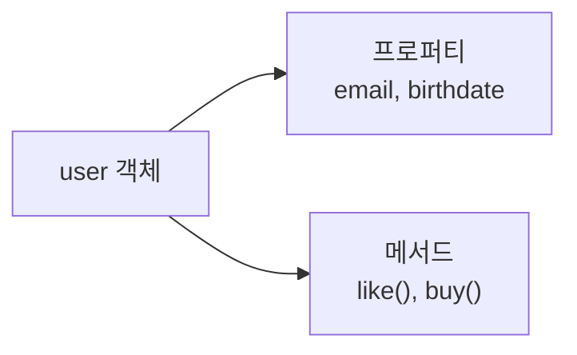
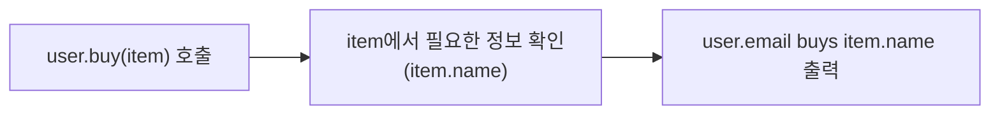
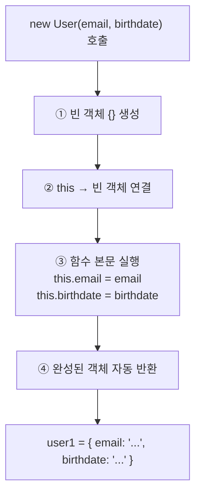
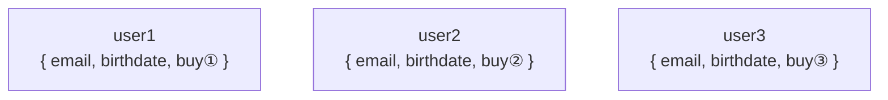
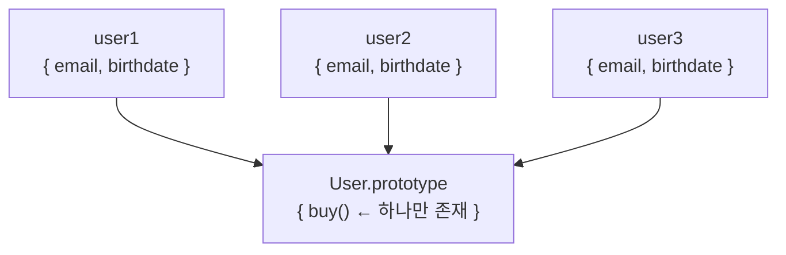
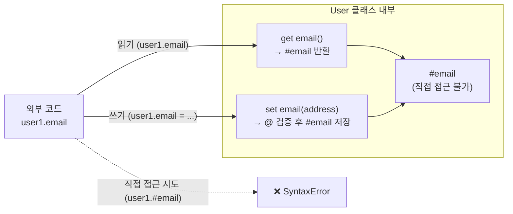
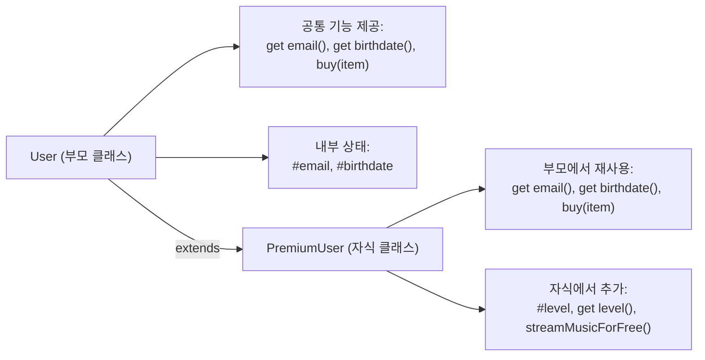
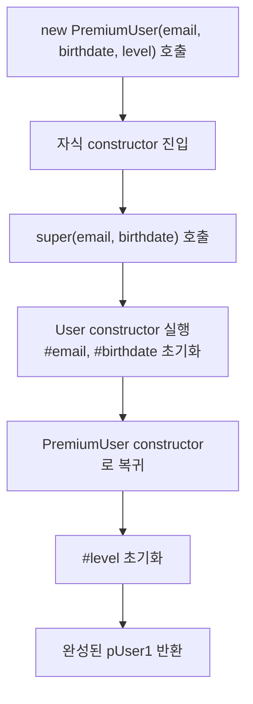
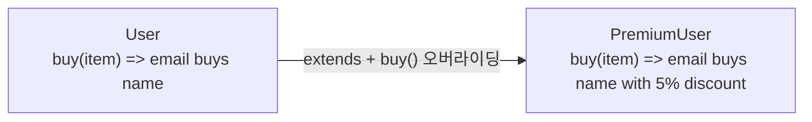
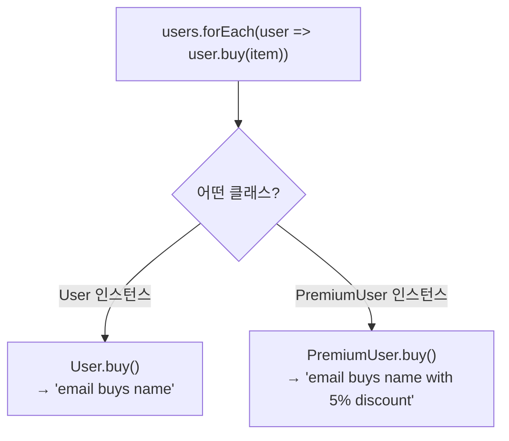

# 29. Object Orient Programming - JS

# 제 1장: 객체와 클래스

## **1-00. 실습 시작 전: 완성본 코드 받기**

실습을 시작하기 전에 완성본 코드를 먼저 내려받아 작업 기준점을 준비합니다.

```bash
git clone https://github.com/winverse/codeit-fs-object-oriented-programming
```

## **1-01. 객체 지향 프로그래밍이란**

**Intro**

```
https://www.codeit.kr/topics/object-oriented-javascript/lessons/4450
```

### 객체 지향 프로그래밍이란 무엇인가?

**객체 지향 프로그래밍(Object-Oriented Programming, OOP)** 이란, ‘객체’ 간의 상호작용을 중심으로 하는 프로그래밍 방식입니다.

이 정의를 명확히 이해하려면 먼저 ’객체’의 개념을 살펴보아야 합니다.

### 객체란 무엇인가?

쇼핑몰 사이트를 개발하는 상황을 가정해 보겠습니다.

이때 시스템을 구성하는 핵심 요소들이 필요합니다. **유저**, **상품**, **장바구니**, **주문 내역** 같은 개념들이며, 이들이 서로 상호작용하면서 쇼핑몰 서비스가 동작합니다.

객체 지향 프로그래밍에서는 이런 **개념적인 대상 하나하나를 ’객체(Object)’로 만들어** 코드 안에서 다룹니다.

객체는 다음과 같은 두 가지 기본 요소로 구성됩니다.

- **프로퍼티(Property)**: 그 객체의 **상태(데이터)** 를 나타내는 **변수**
- **메서드(Method)**: 그 객체의 **행동(동작)** 을 나타내는 **함수**

예를 들어, ’유저’라는 개념을 하나의 객체로 만든다면 이런 식으로 생각할 수 있습니다.

| 구분 | 내용 | 코드에서 |
| --- | --- | --- |
| 프로퍼티 (상태) | 유저의 이메일 주소 | `email` |
| 프로퍼티 (상태) | 유저의 생일 | `birthdate` |
| 메서드 (행동) | 유저가 상품에 좋아요를 누른다 | `like()` |
| 메서드 (행동) | 유저가 상품을 구매한다 | `buy()` |

코드로 나타내면 이렇게 됩니다.

실습: `1-01_oop-intro/index.js`

```jsx
const user = {
  // 프로퍼티: 유저의 상태(데이터)
  email: "winverse@gmail.com",
  birthdate: "1989-11-24",

  // 메서드: 유저의 행동(동작)
  like() {
    // 좋아요 처리 로직
  },
  buy() {
    // 구매 처리 로직
  },
};
```

`email`, `birthdate`는 **프로퍼티**, `like`, `buy`는 **메서드**입니다.

객체의 구조를 그림으로 나타내면 다음과 같습니다.



그리고 쇼핑몰에서 `user`와 `item` 객체가 서로 상호작용하는 흐름은 이렇습니다.



> **정리**: 객체 지향 프로그래밍은 프로퍼티(상태)와 메서드(행동)로 이루어진 **객체들의 상호작용**을 중심으로 코드를 작성하는 것입니다.
> 

### 절차 지향 vs 객체 지향

객체 지향 프로그래밍이 왜 등장했는지 이해하려면, 그 이전 방식인 **절차 지향 프로그래밍**과 비교해 봐야 합니다.

### 절차 지향 프로그래밍

절차 지향 프로그래밍은 **단순히 변수와 함수를 수행해야 할 작업의 순서에 맞게 나열**하는 방식입니다. 객체라는 개념 없이, 변수와 함수가 코드 안에 따로따로 존재하고, 이것들을 순서에 맞게 하나씩 실행하는 구조입니다.

```jsx
// 절차 지향 방식의 예시
// 유저 관련 변수들
let userEmail = "winverse@gmail.com";
let userBirthdate = "1989-11-24";

// 아이템 관련 변수들
let itemName = "스웨터";
let itemPrice = 30_000;

// 구매 처리 함수
function buyItem(email, name) {
  console.log(`${email} buys ${name}`);
}

// 순서에 따라 실행
buyItem(userEmail, itemName); // "winverse@gmail.com buys 스웨터"
```

코드가 간단할 때는 이런 방식도 문제없습니다. 하지만 프로그램의 규모가 커지면 어떻게 될까요?

유저가 수백 명이 되고, 상품이 수천 개가 되고, 기능이 수십 가지가 되면 **관련된 변수와 함수가 코드 곳곳에 흩어지게 됩니다.** 어떤 변수가 어떤 함수와 관련 있는지, 어디서 수정해야 하는지 파악하기가 점점 어려워집니다.

### 객체 지향 프로그래밍

객체 지향 프로그래밍은 이 문제를 해결하기 위해 등장했습니다. 핵심 아이디어는 간단합니다.

> **관련된 상태(변수)와 동작(함수)을 하나의 ’객체’로 묶는다.**
> 

```jsx
// 객체 지향 방식의 예시
// user 객체: 유저와 관련된 상태와 동작이 모두 안에 묶여 있습니다
const user = {
  email: "winverse@gmail.com",
  birthdate: "1989-11-24",
  buy(item) {
    console.log(`${this.email} buys ${item.name}`);
  },
};

// item 객체: 상품과 관련된 상태가 안에 묶여 있습니다
const item = {
  name: "스웨터",
  price: 30_000,
};

// 객체끼리 상호작용: user 객체가 item 객체를 구매합니다
user.buy(item); // "winverse@gmail.com buys 스웨터"
```

`user`라는 객체가 자신의 상태(`email`, `birthdate`)와 동작(`buy`)을 모두 가지고 있습니다. 유저와 관련된 것들이 전부 `user` 객체 안에 모여 있으니, 나중에 유저 관련 기능을 수정할 때 `user` 객체만 살펴보면 됩니다.

### 두 방식 비교

| 구분 | 절차 지향 | 객체 지향 |
| --- | --- | --- |
| 구조 | 변수와 함수가 코드 전체에 흩어짐 | 관련 변수와 함수가 객체 안에 묶임 |
| 수정 | 관련 코드를 전부 찾아서 바꿔야 함 | 해당 객체만 수정하면 됨 |
| 규모 확장 | 코드가 커질수록 관리가 어려워짐 | 각 객체의 역할이 명확해 관리가 쉬워짐 |
| 코드 읽기 | 실행 순서를 따라가며 읽어야 함 | 객체별로 역할을 나눠 읽을 수 있음 |

### 객체 지향 프로그래밍의 필요성

프로그래밍의 역사에서 하나의 프로그램이 가져야 할 기능이 점점 많아지고, 보다 체계적인 구조가 요구되었습니다. 이에 따라 변수와 함수를 하나로 묶는 ’객체’라는 개념이 등장했고, 이것이 발전해 오늘날의 객체 지향 프로그래밍이 되었습니다.

오늘날 생산되는 대부분의 소프트웨어는 객체 지향 방식을 기반으로 설계됩니다. 현대적인 **웹 개발 역시 객체 지향 원리를 이해해야 안정적이고 확장 가능한 구조를 설계할 수 있습니다.**

JavaScript에서 DOM을 다루는 과정, React의 컴포넌트 생명주기 제어, Node.js의 모듈 기반 구조 등은 모두 객체 지향적 사고를 바탕으로 설계되었습니다. 따라서 객체 지향 패러다임을 이해하면 도구와 프레임워크의 동작 원리를 더 깊이 파악할 수 있습니다.

본 장에서는 JavaScript를 활용하여 객체 지향 모델을 코드로 어떻게 구현하는지 단계적으로 학습합니다.

## **1-02. 객체 만들기, 객체 리터럴**

### 객체를 만드는 가장 직접적인 방법

JavaScript에서 객체를 만드는 가장 기본적이고 직접적인 방법은 **객체 리터럴(Object Literal)**입니다. 클래스 같은 별도의 틀을 먼저 만들 필요 없이, 중괄호 `{}` 안에 원하는 데이터(프로퍼티)와 동작(메서드)을 바로 적으면 그 즉시 객체가 탄생합니다.

실습: `1-02_object-literal/index.js`

```jsx
const user = {
  email: "chris123@google.com",
  birthdate: "1992-03-21",
  buy(item) {
    console.log(`${this.email} buys ${item.name}`);
  },
};

const item = {
  name: "스웨터",
  price: 30_000,
};

console.log(user.email); // "chris123@google.com"
console.log(user.birthdate); // "1992-03-21"
user.buy(item); // "chris123@google.com buys 스웨터"
```

### `this`의 역할과 필요성

```jsx
buy(item) {
  // this.email은 이 메서드를 호출한 객체(user)의 email을 가리킵니다
  console.log(`${this.email} buys ${item.name}`);
}
```

여기서 `this`는 **메서드를 호출한 시점의 주체**, 즉 점(.) 앞의 `user` 객체를 가리킵니다.

메서드 내부에서 `user.email`처럼 객체 이름을 직접 참조해도 당장은 동작합니다. 하지만 **객체를 가리키는 변수 이름이 바뀔 경우** 문제가 발생합니다.

```jsx
const employee = {
  // 변수명을 user에서 employee로 변경했습니다
  email: "chris123@google.com",
  buy(item) {
    // ❌ 에러 발생: user 변수는 더 이상 존재하지 않습니다
    console.log(`${user.email} buys ${item.name}`);
  },
};
```

객체 이름이 변경될 때마다 메서드 내부의 코드를 모두 찾아 수정해야 한다면 유지보수 비용이 크게 증가합니다. 반면 `this`를 사용하면 객체 식별자가 바뀌더라도 **자신을 가리킨다**는 참조 관계가 변하지 않아 코드를 안전하게 유지할 수 있습니다.

또한 `this`를 활용하면 **동일한 함수 로직을 여러 객체에서 재사용**하는 것이 가능해집니다.

```jsx
function introduce() {
  // this를 쓰면 이 함수는 누가 호출하든 그 객체의 이름을 출력합니다
  console.log(`Hello, I am ${this.name}`);
}

const user1 = { name: "Chris", introduce: introduce };
const user2 = { name: "Alice", introduce: introduce };

user1.introduce(); // "Hello, I am Chris"
user2.introduce(); // "Hello, I am Alice"
```

만약 `introduce` 함수 안에서 `this` 대신 `user1.name`을 고정해 참조했다면, `user2`가 이 함수를 호출할 때도 항상 `Chris`가 출력될 것입니다. `this`를 사용함으로써 하나의 함수가 호출 상황에 맞춰 동적으로 동작하게 됩니다.

핵심은 **`this`가 함수를 선언하는 시점이 아니라, 함수를 호출하는 시점의 맥락(Context)에 따라 결정된다**는 점입니다. 호출 주체가 누구인지에 따라 `this`가 가리키는 대상이 동적으로 바뀝니다.

객체 리터럴 방식은 단일 설정 객체나 일회성 데이터 묶음을 정의할 때는 유용합니다. 하지만 **동일한 구조의 객체를 반복적으로 다수 생성해야 할 때**는 치명적인 구조적 한계를 드러냅니다.

```jsx
// 유저 1명
const user1 = {
  email: "chris123@google.com",
  birthdate: "1992-03-21",
  buy(item) {
    console.log(`${this.email} buys ${item.name}`);
  },
};

// 유저 2명
const user2 = {
  email: "jerry99@google.com",
  birthdate: "1995-07-19",
  buy(item) {
    console.log(`${this.email} buys ${item.name}`); // ⚠️ 코드 중복 발생!
  },
};

// 유저 수가 증가할수록 동일 패턴이 반복됩니다
```

1. **코드 중복:** `buy` 메서드 코드를 100번 복사/붙여넣기 해야 합니다.
2. **수정의 어려움:** `buy` 메서드 로직을 조금이라도 수정하려면 100개의 객체를 전부 찾아 고쳐야 합니다.
3. **메모리 낭비:** 기능은 똑같은데, 100개의 객체가 각각 별도의 `buy` 함수를 메모리에 새로 생성해서 가지고 있게 됩니다.

이 문제를 해결하기 위해 등장한 것이 바로 다음 절의 **팩토리 함수(Factory function)**입니다.

## **1-03. 객체 만들기, 팩토리 함수**

### 왜 팩토리 함수가 필요한가?

앞에서 본 것처럼 객체 리터럴 방식을 사용하면, 유저가 늘어날 때마다 똑같은 코드를 반복해서 작성해야 합니다. 수정할 때도 모든 객체를 일일이 찾아 고쳐야 하는 수고가 발생합니다.

**팩토리 함수(Factory function)**는 이 문제를 해결하기 위해, **객체를 찍어내는 공장(Factory)** 역할을 하는 함수를 만드는 방식입니다. 함수를 호출할 때마다 새로운 객체를 조립해서 반환합니다(return).

### 기본 구조와 원리

다음 코드는 이메일과 생년월일을 받아서 유저 객체를 만들어주는 공장 함수입니다.

실습: `1-03_factory-function/index.js`

```jsx
function createUser(email, birthdate) {
  // 1. 새로운 객체를 만듭니다
  const user = {
    email: email, // 파라미터로 받은 값을 프로퍼티에 넣습니다
    birthdate: birthdate,

    // 2. 공통된 동작(메서드)도 넣습니다
    buy(item) {
      console.log(`${this.email} buys ${item.name}`);
    },
  };

  // 3. 완성된 객체를 밖으로 내보냅니다
  return user;
}
```

핵심은 간단합니다. 함수 안에서 **객체 리터럴(Object Literal)**로 객체를 만들고, 그 객체를 **`return`** 하는 것입니다.

> **주의: `return`을 빠뜨리면 함수는 `undefined`를 돌려줍니다. 객체가 만들어지긴 하지만 외부에서 참조할 방법이 없어 접근할 수 없습니다.**
> 
> 
> ```jsx
> function createUser(email, birthdate) {
>   const user = { email, birthdate };
>   // return이 없으면 → undefined 반환
> }
> 
> const user1 = createUser(
>   "chris123@google.com",
>   "1992-03-21",
> );
> console.log(user1); // undefined !
> ```
> 

### 프로퍼티 축약 표기법 (Shorthand Property)

팩토리 함수를 작성할 때 거의 항상 쓰이는 문법이 있습니다. 객체를 만들 때 **키(key) 이름과 변수 이름이 같으면**, 값을 생략하고 이름만 적을 수 있습니다.

```jsx
// Before: 키 이름과 변수 이름이 같아 중복됨
const userBefore = {
  email: email,
  birthdate: birthdate,
};

// After: 축약 표기법 적용 — 위와 완전히 동일하게 동작
const userAfter = {
  email,
  birthdate,
};
```

코드가 훨씬 깔끔해지므로, 앞으로는 이 축약 표기법을 주로 사용할 것입니다.

이제 `createUser` 함수를 통해 여러 명의 유저 객체를 간결하게 생성할 수 있습니다.

```jsx
function createUser(email, birthdate) {
  const user = {
    email,
    birthdate,
    buy(item) {
      console.log(`${this.email} buys ${item.name}`);
    },
  };
  return user;
}

const item = {
  name: "스웨터",
  price: 30_000,
};

// 함수를 호출할 때마다 새로운 객체가 나옵니다
const user1 = createUser(
  "chris123@google.com",
  "1992-03-21",
);
const user2 = createUser(
  "jerry99@google.com",
  "1995-07-19",
);
const user3 = createUser("alice@google.com", "1993-12-24");

// 객체가 올바르게 생성되었는지 확인할 수 있습니다
console.log(user1);
// { email: 'chris123@google.com', birthdate: '1992-03-21', buy: [Function: buy] }

console.log(user1.email); // "chris123@google.com"
console.log(user2.email); // "jerry99@google.com"
console.log(user3.email); // "alice@google.com"

user1.buy(item); // "chris123@google.com buys 스웨터"
user2.buy(item); // "jerry99@google.com buys 스웨터"
user3.buy(item); // "alice@google.com buys 스웨터"
```

만약 `buy` 메서드의 로직을 변경해야 한다면, 이제는 `createUser` 함수 내부의 템플릿 **한 곳만 수정하면** 이후 생성되는 모든 객체에 적용됩니다. 이를 통해 코드 중복과 수정의 어려움이 해소되었습니다.

### 팩토리 함수의 한계: 메모리 비효율

팩토리 함수는 구조적 재사용성을 높여주지만, **메모리 효율** 측면에서 한계가 존재합니다.

`user1`의 `buy` 메서드와 `user2`의 `buy` 메서드는 **기능은 똑같지만, 컴퓨터 메모리 상에서는 서로 다른 함수**입니다. `createUser`를 호출할 때마다 함수 내부의 코드가 매번 완전히 새로 실행되기 때문에, 기능이 동일한 `buy` 함수가 **객체 생성 횟수만큼 새롭게 복제되어** 각각의 인스턴스에 할당됩니다.

```jsx
// 직접 확인: 참조하는 메모리 주소가 다름
console.log(user1.buy === user2.buy); // false
console.log(user1.buy === user3.buy); // false
// 기능은 동일하지만 메모리상 독립적으로 존재하는 개별 함수입니다
```

유저가 10,000명이라면 완전히 동일한 역할을 하는 `buy` 함수가 메모리에 10,000번 로드됩니다.

여기서 먼저 정리할 지점이 있습니다. **생성자 함수(Constructor function)**의 주된 역할은 객체 생성 과정을 `new`와 `this` 규칙으로 표준화하는 것입니다. 반면, 메서드 중복으로 인한 메모리 비효율을 줄이는 핵심 방법은 **프로토타입(Prototype) 기반의 메서드 공유**입니다.

## **1-04. 객체 만들기, 생성자 함수**

### 생성자 함수란?

**생성자 함수(Constructor function)**는 `new` 키워드와 함께 호출해 객체를 생성하는 함수입니다.

팩토리 함수는 함수 안에서 객체를 직접 만들어 `return`했지만, 생성자 함수는 다릅니다. 대신 `this`라는 키워드를 통해 **생성될 객체에 직접 프로퍼티와 메서드를 추가**합니다.

생성자 함수를 배우는 이유는 **객체 생성 규칙을 표준화**하기 위해서입니다. 코드 작성자가 달라도 `new` 호출, `this` 바인딩, 자동 반환이라는 동일한 흐름으로 객체가 만들어지므로 생성 과정을 예측하고 관리하기 쉬워집니다. 다만 메서드를 `this`에 직접 넣으면 인스턴스마다 함수가 새로 만들어지므로, 메서드 공유 최적화는 프로토타입 기반 구조(예: `class` 문법)에서 해결해야 합니다.

실습: `1-04_constructor-function/index.js`

```jsx
function User(email, birthdate) {
  this.email = email;
  this.birthdate = birthdate;
  this.buy = function (item) {
    console.log(`${this.email} buys ${item.name}`);
  };
}
```

### `new`로 객체 생성하기

```jsx
const item = {
  name: "스웨터",
  price: 30_000,
};

const user1 = new User("chris123@google.com", "1992-03-21");
const user2 = new User("jerry99@google.com", "1995-07-19");
const user3 = new User("alice@google.com", "1993-12-24");

console.log(user1.email); // "chris123@google.com"
console.log(user2.email); // "jerry99@google.com"
console.log(user3.email); // "alice@google.com"

user1.buy(item); // "chris123@google.com buys 스웨터"
user2.buy(item); // "jerry99@google.com buys 스웨터"
user3.buy(item); // "alice@google.com buys 스웨터"
```

### `new`를 붙이면 무슨 일이 일어나나요?

`new User(...)`를 실행하면 JavaScript 내부에서 다음 네 가지 과정이 **자동으로** 일어납니다.

**1단계**: 빈 객체를 새로 만듭니다.

**2단계**: 그 빈 객체를 `this`로 연결합니다. 즉, 함수 내부의 `this`가 방금 만든 빈 객체를 가리키게 됩니다.

**3단계**: `User` 함수 본문을 실행합니다. `this.email = email`, `this.birthdate = birthdate` 등이 실행되면서 빈 객체에 프로퍼티와 메서드가 추가됩니다.

**4단계**: 완성된 객체를 자동으로 반환합니다. 팩토리 함수처럼 `return`을 직접 쓰지 않아도 됩니다.

그래서 `user1`, `user2`, `user3` 각각에 서로 다른 `email`이 설정되는 겁니다. `new`를 호출할 때마다 새로운 빈 객체가 만들어지고, `this`가 그 새 객체를 가리키기 때문입니다.

`new User("chris123@google.com", "1992-03-21")`이 실행될 때 내부에서 일어나는 과정을 그림으로 나타내면 다음과 같습니다.



### 꼭 지켜야 할 두 가지 규칙

**규칙 1: 반드시 `new`를 붙여서 호출해야 합니다.**

`new` 없이 `User(...)`처럼 일반 함수로 호출하면 위의 4단계가 일어날 수 없습니다. 이 경우 `this`의 동작은 실행 환경에 따라 달라집니다.

일반 모드(느슨한 모드)에서는 `this`가 전역 객체(예: 브라우저의 `window`)를 가리킵니다. 오류 없이 실행되지만 의도치 않게 전역 변수를 오염시키는 치명적인 버그로 이어집니다.

반면 현대적인 JavaScript 환경(ES Modules)이나 엄격 모드(`"use strict"`)에서는 `this`가 `undefined`가 됩니다. `this.email = email`을 실행하는 순간 즉시 `TypeError`가 발생하며 프로그램이 멈춥니다.

```jsx
// ❌ 잘못된 호출 - new 없이 호출
const wrongUser = User("chris123@google.com", "1992-03-21");
// [느슨한 모드] this가 전역 객체를 가리켜 의도치 않은 오염이 발생하고, return이 없으므로 undefined가 반환됨
// [엄격 모드 / ES Modules] this가 undefined이므로 이 줄에서 즉시 TypeError 발생
console.log(wrongUser); // undefined — 느슨한 모드 기준. 엄격 모드에서는 이 줄까지 도달하지 않음
```

`new` 키워드를 붙여 올바르게 호출하면 다음과 같습니다.

```jsx
// ✅ 올바른 호출
const user1 = new User("chris123@google.com", "1992-03-21");
console.log(user1.email); // "chris123@google.com"
```

**규칙 2: 함수 이름의 첫 글자는 대문자로 씁니다.**

일반 함수는 소문자로 시작하지만(`createUser`), 생성자 함수는 대문자로 시작하는 것이 관례입니다(`User`). 이 관례를 지키면 코드를 읽는 사람이 “이 함수는 `new`로 호출해야 하는 생성자 함수다”라는 것을 한눈에 알 수 있습니다. 언어가 강제하는 규칙은 아니지만, JavaScript 생태계에서 널리 사용되는 관례입니다.

### 생성자 함수만으로는 메모리 중복이 해결되지 않습니다

생성자 함수는 객체 생성 규칙을 표준화하지만, 메서드를 `this`에 직접 할당하면 인스턴스를 만들 때마다 동일한 함수가 새로 생성됩니다. 즉, 생성자 함수 단계에서는 메모리 중복 문제가 아직 남아 있습니다. 이 문제는 메서드를 인스턴스마다 복제하지 않고 공유할 수 있는 구조를 적용해야 해결되며, 다음 절에서 그 구조를 설명합니다.

## **1-05. 객체 만들기, Class**

### Class란?

앞 절에서 생성자 함수는 객체 생성 규칙을 표준화하지만, 메서드를 `this`에 직접 할당하면 인스턴스마다 함수가 새로 생성되어 메모리 중복이 남는다는 점을 확인했습니다. `class`는 이 두 문제를 하나의 문법 안에서 동시에 해결합니다.

`class`는 ES6(2015년)에 추가된 문법으로, 생성자 함수보다 더 읽기 쉽고 직관적인 방식으로 객체를 만들 수 있게 해줍니다.

Java, Python, C# 등 다른 주요 프로그래밍 언어에서도 `class`를 사용하기 때문에, JavaScript에서 객체 지향의 원리를 표현하기에 가장 보편적이고 적합한 문법입니다.

실습: `1-05_class/index.js`

```jsx
class User {
  email;
  birthdate;

  // constructor
  constructor(email, birthdate) {
    this.email = email;
    this.birthdate = birthdate;
  }

  // method
  buy(item) {
    console.log(`${this.email} buys ${item.name}`);
  }
}
```

### 설계와 동작의 원리: Prototype

중요한 점은 JavaScript의 `class`가 완전히 새로운 객체 모델이 아니라, 여전히 내부적으로는 **`prototype` 기반으로 동작**한다는 사실입니다.

> **참고: prototype이란?**
JavaScript에서 모든 함수(생성자 함수, class 포함)는 `prototype`이라는 숨겨진 공유 공간(객체)을 갖고 있습니다. `new`로 만든 인스턴스들은 인스턴스 자신에게 특정 메서드가 없으면 자동으로 이 공유 공간인 `prototype`으로 찾아가 실행합니다. 덕분에 인스턴스가 아무리 많아져도 메서드는 1개만 만들어져 공유됩니다.
> 
> 
> 사실 우리는 평소에 알게 모르게 이 구조를 쓰고 있었습니다.
> 
> ```jsx
> const greeting = "hello";
> console.log(greeting.toUpperCase()); // "HELLO"
> 
> // greeting 문자열 자체에는 'toUpperCase'라는 로직이 들어있지 않습니다.
> // 대신 'String.prototype'에 정의된 공통 메서드를 끌어와 실행한 것입니다.
> console.log(typeof String.prototype.toUpperCase); // "function"
> ```
> 
> 배열에서 `map()`, `filter()`를 쓸 수 있는 것 역시 그 배열 객체마다 함수가 들어있는 것이 아니라 `Array.prototype`의 함수를 빌려 쓰는 원리입니다. class 역시 메서드를 개별 인스턴스에 복제하는 대신 `Prototype` 기법을 사용해 문제를 해결합니다.
> 

### 클래스 구조 뜯어보기

클래스 안에는 두 영역이 있습니다.

**`constructor` 메서드**

객체가 생성될 때 **자동으로 실행되는 초기화 함수**입니다. `new User(...)`를 호출하면 이 `constructor`가 실행됩니다. 인스턴스마다 달라지는 값(이메일, 생일 등)을 설정하는 역할을 합니다.

**`constructor` 바깥의 메서드**

`buy`처럼 `constructor` 바깥에 정의한 메서드는 모든 인스턴스가 **공유**합니다. 팩토리 함수와 달리 메서드가 인스턴스마다 새로 만들어지지 않아 메모리 효율이 좋습니다.

> **핵심 규칙**: 사용자마다 달라지는 정보(이메일, 생일)는 `constructor` 안에 넣고, 모든 사용자가 같이 쓰는 기능(`buy`)은 `constructor` 바깥에 둡니다.
> 

이 구조는 Java, Python, C# 등 다른 주요 언어에서도 동일하게 나타납니다. 같은 예제를 세 언어로 작성하면 형태가 매우 유사하다는 것을 확인할 수 있습니다.

```java
class User {
    private String email;
    private String birthdate;

    public User(String email, String birthdate) { // constructor
        this.email = email;
        this.birthdate = birthdate;
    }

    public void buy(Item item) { // method
        System.out.println(this.email + " buys " + item.getName());
    }
}
```

언어마다 문법은 다르지만 클래스·생성자·메서드라는 구조는 동일합니다.

```python
class User:
    def __init__(self, email, birthdate): # constructor
        self.email = email
        self.birthdate = birthdate

    def buy(self, item): # method
        print(f"{self.email} buys{item.name}")
```

C#은 접근 제한자(`public`/`private`)와 파스칼 케이스 메서드명이 눈에 띕니다.

```csharp
public class User
{
    private string _email;
    private string _birthdate;

    public User(string email, string birthdate) // constructor
    {
        _email = email;
        _birthdate = birthdate;
    }

    public void Buy(Item item) // method
    {
        Console.WriteLine($"{_email} buys {item.Name}");
    }
}
```

네 언어 모두 “클래스 선언 → 생성자에서 상태 초기화 → 메서드로 동작 정의”라는 동일한 구조를 공유합니다. 문법 기호는 다르지만 사고방식이 같기 때문에, 지금 JavaScript에서 클래스 구조를 익혀두면 다른 언어를 학습할 때도 전이 효과가 큽니다.

### 객체 생성 및 사용

```jsx
const item = {
  name: "스웨터",
  price: 30_000,
};

const user1 = new User("chris123@google.com", "1992-03-21");
const user2 = new User("jerry99@google.com", "1995-07-19");

console.log(user1.email); // "chris123@google.com"
console.log(user2.birthdate); // "1995-07-19"
user1.buy(item); // "chris123@google.com buys 스웨터"
user2.buy(item); // "jerry99@google.com buys 스웨터"
```

생성자 함수와 동일하게 `new`를 붙여서 호출합니다.

### 생성자 함수와의 비교

아래 두 코드는 동일한 목적을 구현하지만, 메서드를 정의하는 방식에서 내부 동작에 중요한 차이가 있습니다.

```jsx
// 생성자 함수 방식
function UserOld(email, birthdate) {
  this.email = email;
  this.birthdate = birthdate;
  this.buy = function (item) {
    // ← 인스턴스마다 새 함수 객체 생성
    console.log(`${this.email} buys ${item.name}`);
  };
}
```

같은 동작을 Class 문법으로 작성하면 다음과 같습니다.

```jsx
// Class 방식
class User {
  constructor(email, birthdate) {
    this.email = email;
    this.birthdate = birthdate;
  }

  buy(item) {
    // ← prototype에 한 번만 저장, 모든 인스턴스가 공유
    console.log(`${this.email} buys ${item.name}`);
  }
}
```

생성자 함수에서 `this.buy = function (...) {}`으로 메서드를 정의하면, `new UserOld()`를 호출할 때마다 `buy` 함수 객체가 새로 생성됩니다. 유저가 1,000명이면 메모리에 동일한 `buy` 함수가 1,000개 존재하게 됩니다.

반면 Class의 `constructor` 바깥에 정의한 메서드는 내부적으로 `prototype`이라는 공유 공간에 한 번만 저장됩니다. 인스턴스 수에 관계없이 `buy`는 메모리에 한 개만 존재하고, 모든 인스턴스가 이를 참조합니다.

“그렇다면 생성자 함수도 prototype에 직접 추가하면 같은 효과가 나지 않는가?”라는 의문이 생길 수 있습니다. 결론부터 말하면 메모리 구조 측면에서는 맞습니다. 그러나 Class의 역할은 이 최적화로만 끝나지 않습니다.

> 🔍 **심화**: 사실 생성자 함수도 `UserOld.prototype.buy = function() {...}`처럼 prototype에 메서드를 직접 추가하면 메모리 구조는 Class와 동일합니다. 실제로 JavaScript 엔진은 Class 문법을 내부적으로 prototype 기반으로 처리하기 때문입니다.
> 
> 
> 그렇다면 Class를 쓰는 이유는 단순한 문법 편의(syntax sugar) 때문일까요? 그렇지 않습니다. Class는 다음과 같은 안전장치를 추가로 제공합니다.
> 
> - **Strict Mode 자동 강제**: Class 내부는 항상 엄격 모드로 실행되어 변수 오타 등의 실수를 조용히 넘기지 않고 즉시 에러로 잡아냅니다.
> - **`new` 없이 호출 시 TypeError**: 생성자 함수는 `new`를 빠뜨리면 환경(엄격 모드 여부)에 따라 전역 객체를 오염시키거나 `this`가 `undefined`가 되어 치명적인 버그가 발생합니다. 하지만 Class는 환경과 무관하게 `new` 없는 호출을 런타임에서 즉시 `TypeError`로 차단합니다.
> - **메서드 열거 불가(non-enumerable)**: Class의 메서드는 `for...in` 순회 시 노출되지 않아 의도치 않은 동작을 막습니다.
> 
> 즉, Class는 단순한 문법적 설탕이 아니라 **객체 지향 설계를 더 안전하게 강제하는 스펙**입니다.
> 

두 방식의 메모리 구조 차이를 그림으로 보면 확실히 구분됩니다.

**생성자 함수 방식**: 인스턴스마다 `buy` 함수가 독립적으로 생성됩니다.



**Class 방식**: 인스턴스는 상태만 보유하고, 메서드는 `prototype`을 통해 공유합니다.



Class 쪽이 “생성자”와 “공통 메서드”의 경계도 훨씬 명확합니다. 이후 2장에서 배울 상속, 오버라이딩, 다형성도 Class 문법을 기준으로 이해하는 것이 가장 자연스럽습니다.

## **1-06. 객체 만들기 정리**

객체 생성 방식은 하나만 정답이 아니라, 해결하려는 문제에 따라 선택 기준이 달라집니다.

| 방식 | 적합한 상황 | 장점 | 주의할 점 |
| --- | --- | --- | --- |
| 객체 리터럴 | 단일 객체를 빠르게 표현할 때 | 문법이 가장 단순합니다. | 반복 생성 시 중복이 커집니다. |
| 팩토리 함수 | 같은 구조 객체를 여러 개 생성할 때 | 생성 로직을 함수로 재사용할 수 있습니다. | 메서드가 인스턴스마다 새로 생성됩니다. |
| 생성자 함수 | 함수 기반 생성 규칙을 명시할 때 | `new`, `this`로 생성 원리를 분명히 드러냅니다. | `new` 누락 시 의도와 다른 동작이 발생합니다. |
| Class | 객체 지향 구조를 체계적으로 확장할 때 | 생성자/메서드 구분이 명확하고 상속에 유리합니다. | 클래스 문법 뒤의 실행 모델(`prototype`) 이해가 필요합니다. |

이 교재에서는 이후 학습 효율을 위해 **Class**를 기본 문법으로 사용합니다. Class는 JavaScript뿐 아니라 Java 등 다른 언어에서도 등장하는 보편적인 용어이고, 객체 지향의 원리를 나타내기에 가장 적합한 표현이기 때문입니다.

## **1-07.** #실습 **객체 생성 실습 (50분)**

### 퀴즈 1 (코드 완성)

실습: `1-07_practice/quiz1.js`

아래 템플릿을 완성해 `"스웨터(30_000원)"`이 출력되도록 하십시오.

```jsx
class Product {
  constructor(name, price) {
    //TODO
  }

  getLabel() {
    //TODO
  }
}

const p = new Product("스웨터", 30_000);
console.log(p.getLabel());
```

- 정답 및 해설
    
    ```jsx
    class Product {
      constructor(name, price) {
        this.name = name;
        this.price = price;
      }
    
      getLabel() {
        return `${this.name}(${this.price}원)`;
      }
    }
    ```
    
    상태는 `constructor`에서 초기화하고, 문자열 조합은 메서드에서 처리합니다.
    

### 퀴즈 2 (리팩터링)

실습: `1-07_practice/quiz2.js`

아래 코드는 동작은 맞지만 설계가 비효율적입니다. `buy`가 인스턴스마다 생성되지 않도록 클래스 구조를 개선하십시오.

```jsx
class User {
  constructor(email) {
    this.email = email;
    this.buy = function (item) {
      return `${this.email} buys ${item.name}`;
    };
  }
}

const u1 = new User("a@shop.com");
const u2 = new User("b@shop.com");
console.log(u1.buy({ name: "청바지" }));
```

- 정답 및 해설
    
    ```jsx
    class User {
      constructor(email) {
        this.email = email;
      }
    
      buy(item) {
        return `${this.email} buys ${item.name}`;
      }
    }
    ```
    
    공통 동작은 `constructor` 바깥 메서드로 빼야 인스턴스들이 같은 함수를 공유합니다.
    

### 퀴즈 3 (코드 완성)

실습: `1-07_practice/quiz3.js`

아래 템플릿을 완성해 장바구니 총합이 `80_000`이 되도록 하십시오.

```jsx
class Cart {
  constructor() {
    //TODO
  }

  addItem(item) {
    //TODO
  }

  getTotalPrice() {
    //TODO
  }
}

const cart = new Cart();
cart.addItem({ name: "스웨터", price: 30_000 });
cart.addItem({ name: "청바지", price: 50_000 });
console.log(cart.getTotalPrice());
```

- 정답 및 해설
    
    ```jsx
    class Cart {
      constructor() {
        this.items = [];
      }
    
      addItem(item) {
        this.items.push(item);
      }
    
      getTotalPrice() {
        return this.items.reduce(
          (sum, item) => sum + item.price,
          0,
        );
      }
    }
    ```
    
    인스턴스 상태(`items`)를 만들고, 메서드로 상태를 변경/조회하는 구조입니다.
    

### 퀴즈 4 (코드 완성)

실습: `1-07_practice/quiz4.js`

아래 템플릿을 완성해 할인 전/후 가격 문자열을 출력하십시오.

- 할인율이 없으면 원가만 출력
- 할인율이 있으면 할인 적용가 출력

```jsx
class Product {
  constructor(name, price) {
    //TODO
  }

  getPriceLabel(discountRate = 0) {
    //TODO
  }
}

const p = new Product("자켓", 100_000);
console.log(p.getPriceLabel()); // "자켓: 100000원"
console.log(p.getPriceLabel(0.2)); // "자켓: 80000원"
```

- 정답 및 해설
    
    ```jsx
    class Product {
      constructor(name, price) {
        this.name = name;
        this.price = price;
      }
    
      getPriceLabel(discountRate = 0) {
        const finalPrice = this.price * (1 - discountRate);
        return `${this.name}:${finalPrice}원`;
      }
    }
    ```
    
    메서드는 인스턴스 상태(`name`, `price`)를 기반으로 파생 값을 계산해 반환할 수 있습니다.
    

### 퀴즈 5 (코드 완성 + 판단)

실습: `1-07_practice/quiz5.js`

아래 템플릿을 완성해 두 인스턴스가 서로 다른 상태를 유지하는지 확인하십시오.

```jsx
class Member {
  constructor(name, level) {
    //TODO
  }

  levelUp() {
    //TODO
  }

  getInfo() {
    //TODO
  }
}

const m1 = new Member("철수", 1);
const m2 = new Member("영희", 3);

m1.levelUp();

console.log(m1.getInfo()); // "철수 - Lv.2"
console.log(m2.getInfo()); // "영희 - Lv.3"
```

- 정답 및 해설
    
    ```jsx
    class Member {
      constructor(name, level) {
        this.name = name;
        this.level = level;
      }
    
      levelUp() {
        this.level += 1;
      }
    
      getInfo() {
        return `${this.name} - Lv.${this.level}`;
      }
    }
    ```
    
    각 인스턴스는 자기 상태를 독립적으로 갖습니다. `m1`만 `levelUp()`을 호출했기 때문에 `m2`의 값은 변하지 않아야 합니다.
    

### 퀴즈 6 (코드 완성 + 판단)

실습: `1-07_practice/quiz6.js`

아래 템플릿을 완성해 RPG 전투 로그가 의도대로 나오도록 하십시오.
이번 문제의 핵심은 **상속 없이도 클래스별 책임을 명확히 나누는 것**입니다.

판단 포인트는 다음 세 가지입니다.

1. 각 클래스가 자기 상태(`hp`, `mp`, `potionCount`)를 독립적으로 관리해야 합니다.
2. 전사는 `powerStrike`, 마법사는 `castFireball`처럼 직업 전용 스킬만 가집니다.
3. 각 인스턴스의 상태가 독립적으로 변하고, 조건 분기(스킬 MP 부족/포션 없음)가 정확히 적용되어야 합니다.

```jsx
class Warrior {
  constructor({
    name,
    maxHp,
    mp,
    attackPower,
    potionCount,
  }) {
    //TODO
  }

  takeDamage(amount) {
    //TODO: hp를 amount만큼 감소 (최소 0)
  }

  attack(target) {
    //TODO: target에게 기본 공격
  }

  powerStrike(target) {
    //TODO:
    // mp가 10 미만이면 false 반환
    // 아니면 mp를 10 차감하고 기본 공격력의 2배 피해, true 반환
  }

  usePotion() {
    //TODO:
    // potionCount가 0이면 false 반환
    // 아니면 hp를 30 회복 (maxHp 초과 금지), potionCount 1 감소, true 반환
  }

  getStatus() {
    //TODO: "이름 | HP:현재/최대 MP:현재 Potion:개수" 형식
  }
}

class Mage {
  constructor({
    name,
    maxHp,
    mp,
    attackPower,
    potionCount,
  }) {
    //TODO
  }

  takeDamage(amount) {
    //TODO: hp를 amount만큼 감소 (최소 0)
  }

  attack(target) {
    //TODO: target에게 기본 공격
  }

  usePotion() {
    //TODO:
    // potionCount가 0이면 false 반환
    // 아니면 hp를 30 회복 (maxHp 초과 금지), potionCount 1 감소, true 반환
  }

  castFireball(target) {
    //TODO:
    // mp가 20 미만이면 false 반환
    // 아니면 mp를 20 차감하고 target에게 40 피해, true 반환
  }

  getStatus() {
    //TODO: "이름 | HP:현재/최대 MP:현재 Potion:개수" 형식
  }
}

const warrior = new Warrior({
  name: "전사",
  maxHp: 140,
  mp: 30,
  attackPower: 18,
  potionCount: 1,
});
const mage = new Mage({
  name: "마법사",
  maxHp: 90,
  mp: 60,
  attackPower: 8,
  potionCount: 0,
});

warrior.attack(mage); // 마법사 HP: 72
mage.castFireball(warrior); // 전사 HP: 100, 마법사 MP: 40
warrior.powerStrike(mage); // 마법사 HP: 36, 전사 MP: 20
warrior.usePotion(); // 전사 HP: 130, 전사 Potion: 0

console.log(warrior.getStatus()); // "전사 | HP:130/140 MP:20 Potion:0"
console.log(mage.getStatus()); // "마법사 | HP:36/90 MP:40 Potion:0"
```

- 정답 및 해설
    
    ```jsx
    class Warrior {
      constructor({
        name,
        maxHp,
        mp,
        attackPower,
        potionCount,
      }) {
        this.name = name;
        this.maxHp = maxHp;
        this.hp = maxHp; // 초기 체력은 최대 체력과 같습니다
        this.mp = mp;
        this.attackPower = attackPower;
        this.potionCount = potionCount;
      }
    
      takeDamage(amount) {
        this.hp = Math.max(this.hp - amount, 0);
      }
    
      attack(target) {
        target.takeDamage(this.attackPower);
      }
    
      powerStrike(target) {
        if (this.mp < 10) {
          return false;
        }
        this.mp -= 10;
        target.takeDamage(this.attackPower * 2);
        return true;
      }
    
      usePotion() {
        if (this.potionCount === 0) {
          return false;
        }
        this.hp = Math.min(this.hp + 30, this.maxHp);
        this.potionCount -= 1;
        return true;
      }
    
      getStatus() {
        return `${this.name} | HP:${this.hp}/${this.maxHp} MP:${this.mp} Potion:${this.potionCount}`;
      }
    }
    
    class Mage {
      constructor({
        name,
        maxHp,
        mp,
        attackPower,
        potionCount,
      }) {
        this.name = name;
        this.maxHp = maxHp;
        this.hp = maxHp;
        this.mp = mp;
        this.attackPower = attackPower;
        this.potionCount = potionCount;
      }
    
      takeDamage(amount) {
        this.hp = Math.max(this.hp - amount, 0);
      }
    
      attack(target) {
        target.takeDamage(this.attackPower);
      }
    
      usePotion() {
        if (this.potionCount === 0) {
          return false;
        }
        this.hp = Math.min(this.hp + 30, this.maxHp);
        this.potionCount -= 1;
        return true;
      }
    
      castFireball(target) {
        if (this.mp < 20) {
          return false;
        }
        this.mp -= 20;
        target.takeDamage(40);
        return true;
      }
    
      getStatus() {
        return `${this.name} | HP:${this.hp}/${this.maxHp} MP:${this.mp} Potion:${this.potionCount}`;
      }
    }
    ```
    
    이 구조에서는 전사 객체에 `castFireball`이 존재하지 않고, 마법사 객체에 `powerStrike`가 존재하지 않습니다.
    또한 전사의 `powerStrike`도 MP를 소모하도록 설계되어, 직업별 스킬과 자원 관리 규칙을 상속 없이도 분리할 수 있습니다.
    

# 제 2장: 객체 지향 프로그래밍의 핵심 개념

## **2-01. 2장에서 배우는 내용**

**Intro**

```
https://www.codeit.kr/topics/oop-four-pillars/lessons/7969
```

2장에서는 객체 지향 설계의 핵심인 **추상화**, **캡슐화**, **상속**, **다형성**을 순서대로 학습합니다. 이 네 가지는 각각 별개의 기술처럼 보이지만, 실제 설계에서는 함께 작동합니다. 따라서 각 개념의 의미를 먼저 짧게 정리해 두고, 이후 절에서 코드로 확장하는 방식으로 진행합니다.

먼저 **추상화**는 현실의 대상을 코드로 옮길 때 필요한 정보만 남기고 불필요한 세부 사항을 덜어내는 과정입니다. 같은 사람을 표현하더라도 쇼핑몰, 병원, 게임처럼 문제 상황이 다르면 클래스에 담아야 할 속성과 메서드도 달라집니다.

다음으로 **캡슐화**는 객체의 내부 상태를 외부에서 무분별하게 바꾸지 못하도록 보호하는 설계입니다. 값을 변경하는 경로를 setter나 메서드로 제한하면, 잘못된 데이터가 들어오는 시점을 코드 안에서 통제할 수 있습니다.

**상속**은 여러 클래스에 공통으로 반복되는 동작을 부모 클래스에 모으고, 자식 클래스가 이를 재사용하면서 필요한 부분만 확장하는 방식입니다. 이 구조를 사용하면 중복 코드를 줄이면서도 도메인별 차이를 자식 클래스에서 분리해 표현할 수 있습니다.

마지막으로 **다형성**은 같은 이름의 메서드를 호출해도 객체 타입에 따라 서로 다른 동작이 실행되도록 만드는 원리입니다. 호출부는 공통 인터페이스를 유지하고, 실제 행동은 각 클래스의 구현에 맡길 수 있어 확장에 유리한 구조를 만들 수 있습니다.

이제 다음 절부터 각 개념이 왜 필요한지, 그리고 코드에서 어떻게 구현되는지를 단계적으로 확인합니다.

## **2-02. 추상화**

### 추상화란?

**추상화(Abstraction)** 란 복잡한 현실 세계의 대상을 우리가 원하는 방향으로 **간략화해서 코드로 표현하는 것**입니다.

예를 들어, 쇼핑몰 서비스에서 유저를 나타내는 클래스를 설계하는 상황을 가정해 보겠습니다. 실제 사람은 이름, 나이, 주소, 직업, 취미, 혈액형, 키, 몸무게 등 수없이 많은 속성을 가지고 있습니다. 하지만 쇼핑몰에서는 그 모든 속성이 필요하지 않습니다. **서비스의 목적에 맞게 필요한 데이터만 선별하는 과정**이 바로 추상화입니다.

**실제 클래스를 설계하는 모든 과정이 곧 추상화에 해당합니다.**

### 같은 대상, 다른 추상화

같은 “유저”라도 **어떤 서비스를 만드느냐**에 따라 필요한 속성과 행동이 완전히 달라집니다.

실습: `2-02_abstraction/index.js`

```jsx
// 쇼핑몰 서비스의 User
// → 이메일(로그인), 생일(마케팅), 구매 행동이 핵심
class User {
  constructor(email, birthdate) {
    this.email = email;
    this.birthdate = birthdate;
  }

  buy(item) {
    console.log(`${this.email} buys ${item.name}`);
  }
}
```

도메인이 달라지면 추상화 기준도 달라집니다.

```jsx
// 병원 예약 서비스의 Patient (환자)
// → 이름, 주민번호, 증상, 진료 예약 행동이 핵심
class Patient {
  constructor(name, residentNumber, symptom) {
    this.name = name;
    this.residentNumber = residentNumber;
    this.symptom = symptom;
  }

  makeAppointment(doctor) {
    console.log(
      `${this.name} schedules appointment with ${doctor.name}`,
    );
  }
}
```

서비스 성격이 달라질수록 같은 “사람”에서 뽑아낼 속성과 행동도 달라집니다.

```jsx
// SNS 서비스의 Member (회원)
// → 닉네임, 팔로워 수, 게시물 올리기 행동이 핵심
class Member {
  constructor(nickname, followerCount) {
    this.nickname = nickname;
    this.followerCount = followerCount;
  }

  post(content) {
    console.log(`${this.nickname} posts:${content}`);
  }
}
```

현실의 “사람”은 동일하지만, 세 클래스는 완전히 다르게 생겼습니다. 각 서비스에서 **필요한 것만 뽑아냈기 때문**입니다. 이것이 추상화입니다.

### 이름 짓기가 핵심

추상화를 잘 하려면 **클래스, 프로퍼티, 메서드의 이름을 직관적으로 짓는 것**이 가장 중요합니다.

개발자 A가 `User` 클래스를 설계하고, 개발자 B가 이를 활용해 코드를 작성하는 상황을 가정해 보겠습니다. 이름이 직관적이지 않으면 B는 A의 코드를 분석하고 이해하는 데 불필요한 시간을 소모하게 됩니다.

아래 두 코드를 비교해 보겠습니다. 두 코드의 실제 동작은 완전히 동일합니다.

```jsx
// ✅ 이름이 명확한 코드 → 코드만 봐도 의미를 알 수 있습니다
class User {
  constructor(email, birthdate) {
    this.email = email;
    this.birthdate = birthdate;
  }

  buy(item) {
    console.log(`${this.email} buys ${item.name}`);
  }
}

const item = { name: "스웨터", price: 30_000 };
const user1 = new User("chris123@google.com", "1992-03-21");
user1.buy(item); // "chris123@google.com buys 스웨터"
```

```jsx
// ❌ 이름이 불명확한 코드 → 이게 뭘 하는 코드인지 알 수 없습니다
class Manager {
  constructor(v1, v2) {
    this.v1 = v1;
    this.v2 = v2;
  }

  run(x) {
    console.log(`${this.v1} buys ${x.name}`);
  }
}

const x = { name: "스웨터", price: 30_000 };
const mgr = new Manager(
  "chris123@google.com",
  "1992-03-21",
);
mgr.run(x); // "chris123@google.com buys 스웨터" (동작은 같지만...)
```

두 번째 코드는 `Manager`, `v1`, `v2`, `run`, `x`가 각각 무엇을 의미하는지 코드만 읽고서는 전혀 파악할 수 없습니다. 처음 코드를 접하는 개발자는 물론이고, 일정 시간이 지난 후 코드를 작성한 본인조차 그 의도를 이해하기 어렵습니다.

### 메서드 이름의 중요성

클래스의 속성뿐만 아니라 동작을 정의하는 메서드의 이름 역시 추상화 과정에서 핵심적인 역할을 합니다. 동일한 기능을 수행하는 메서드라도 어휘 선택에 따라 읽는 사람의 이해도가 크게 달라집니다.

```jsx
// ❌ 이름이 불명확한 메서드들
class User {
  constructor(email, birthdate) {
    this.email = email;
    this.birthdate = birthdate;
  }

  // 뭘 하는 건지 모름
  action1(x) {
    console.log(`${this.email} buys ${x.name}`);
  }

  // 뭘 반환하는 건지 모름
  getData() {
    return this.email;
  }

  // 무슨 처리를 하는 건지 모름
  process() {
    console.log(`${this.email} is processing...`);
  }
}
```

메서드 이름만 바꿔도 코드를 읽는 방식이 달라집니다.

```jsx
// ✅ 이름이 명확한 메서드들
class User {
  constructor(email, birthdate) {
    this.email = email;
    this.birthdate = birthdate;
  }

  // 구매한다
  buy(item) {
    console.log(`${this.email} buys ${item.name}`);
  }

  // 이메일을 가져온다
  getEmail() {
    return this.email;
  }

  // 인증 이메일을 발송한다
  sendVerificationEmail() {
    console.log(
      `Sending verification email to ${this.email}...`,
    );
  }
}
```

`action1`, `getData`, `process`와 같은 막연한 이름은 메서드의 구체적인 역할을 설명하지 못합니다. 반면 `buy`, `getEmail`, `sendVerificationEmail` 등은 **이름 자체로 수행하는 기능**을 명확히 전달합니다.

> **클린 코드(Clean Code) 관점에서 최고의 주석은 ’좋은 이름’입니다.** 클래스와 메서드의 역할을 정확히 드러내는 이름 짓기는 유지보수하기 좋은 코드를 작성하는 첫걸음입니다.
> 

## **2-02.** #Quiz **추상화 (10분)**

**1. 아래 설명 중, 추상화 원칙에 가장 맞는 것을 고르십시오.**

1. 같은 “사람”이라도 쇼핑몰 서비스와 병원 서비스에서 `User` 클래스의 프로퍼티 구성은 달라질 수 있습니다.
2. 추상화는 내부 상태를 외부에서 직접 바꾸지 못하도록 접근을 제한하는 설계입니다.
3. 추상화가 잘 된 클래스일수록 현실 존재의 속성을 더 많이 반영해야 합니다.
4. 추상화는 객체의 공통 동작을 부모 클래스에 올려 자식 클래스가 재사용하도록 하는 것입니다.
- 정답 및 해설
    
    **정답:** 1번
    
    **해설:** 추상화의 핵심은 현실 정보를 그대로 옮기는 것이 아니라, 서비스 목적에 맞는 속성과 동작만 선택해 설계하는 것입니다. 쇼핑몰의 `User`에는 `email`, `point`가 필요하고, 병원의 `Patient`에는 `birthday`, `medicalHistory`가 필요합니다. 같은 “사람”이라도 도메인에 따라 클래스 구성이 달라지는 것이 추상화의 본질입니다. 2번은 캡슐화, 4번은 상속에 대한 설명입니다. 3번은 추상화의 목적을 반대로 이해한 오답입니다.
    

**2. 다음 중 추상화를 코드로 구현할 때 ’좋은 이름 짓기(Naming)’에 대한 설명으로 가장 적절한 것은?**

1. 데이터베이스 시스템의 컬럼명을 반드시 그대로 가져와 클래스의 프로퍼티명으로 사용해야 한다.
2. `getData`, `process`와 같이 어떤 객체에서든 범용적으로 쓸 수 있는 넓은 의미를 가진 단어가 좋다.
3. 메서드 내부에서 어떤 복잡한 로직이 실행되는지를 구체적으로 모두 서술하여 길게 지어야 한다.
4. `buyItem`, `sendEmail`과 같이 객체가 외부에 제공하는 핵심 기능(의도)이 명확히 드러나게 지어야 한다.
- 정답 및 해설
    
    **정답:** 4번
    
    **해설:** 추상화가 잘 된 객체는 세부 구현을 몰라도 이름만으로 무엇을 하는지 예측할 수 있어야 합니다. 4번처럼 객체의 역할과 의도가 명확히 드러나는 이름이 좋은 추상화입니다. 2번은 의미가 막연하여 객체의 역할을 알 수 없고, 3번은 내부 구현이 이름에 모두 노출되어 추상화 원칙에 어긋납니다. 1번처럼 데이터베이스 구조에 의존적인 이름은 객체의 독립성을 해칠 수 있습니다.
    

**3. 스마트폰의 ‘주소록(연락처)’ 애플리케이션을 개발하기 위해 `Contact` 클래스를 설계하려고 합니다. 이 서비스의 목적에 부합하도록 가장 잘 추상화된 프로퍼티 구성은 무엇입니까?**

1. `name`, `healthInsuranceNumber`, `bloodType`, `height`
2. `name`, `shippingAddress`, `creditCardNumber`, `recentPurchases`
3. `name`, `phoneNumber`, `email`, `group`
4. `name`, `gameLevel`, `guildName`, `equippedItems`
- 정답 및 해설
    
    **정답:** 3번
    
    **해설:** 주소록 앱이라는 특정 서비스 목적에 필요한 핵심 데이터는 다른 사람과 연락을 취하기 위한 식별 및 통신 수단 정보입니다. 3번의 이름, 전화번호, 이메일 등이 이에 가장 부합합니다. 1번은 병원/의료 시스템, 2번은 쇼핑몰, 4번은 게임 환경에 적절하게 추상화된 구성입니다.
    

## **2-03. 캡슐화**

### 캡슐화란?

**캡슐화(Encapsulation)** 란 객체의 특정 프로퍼티에 외부에서 직접 접근하지 못하도록 막고, 정해진 메서드를 통해서만 값을 읽고 쓸 수 있도록 제어하는 것입니다.

### 왜 필요한가?

지금까지 우리는 이런 식으로 클래스를 작성했습니다.

실습: `2-03_encapsulation/index.js`

```jsx
class User {
  constructor(email, birthdate) {
    this.email = email;
    this.birthdate = birthdate;
  }

  buy(item) {
    console.log(`${this.email} buys ${item.name}`);
  }
}

const user1 = new User("chris123@google.com", "1992-03-21");
```

그런데 이 코드에는 한 가지 문제가 있습니다. 외부에서 `user1.email`에 **아무 값이나 자유롭게 넣을 수 있다**는 점입니다.

```jsx
user1.email = "chris robert"; // 이메일 형식이 아닌 값을 대입하는 실수
```

이러한 잘못된 할당이 발생하더라도 현재 코드 구조에서는 아무런 오류 없이 값이 저장되어 버립니다.

데이터 무결성을 객체 외부의 주의력에 의존하는 대신, **클래스 내부 설계 차원에서 잘못된 접근 자체를 원천적으로 방지하는 것**이 훨씬 안전합니다. 이것이 캡슐화를 도입하는 주된 이유입니다.

### 캡슐화를 위한 도구: getter / setter

캡슐화를 구현하려면 외부의 직접 접근을 막고, 값을 읽고 쓰기 위한 별도의 통로를 마련해야 합니다. JavaScript에서는 이를 위해 `getter`와 `setter`를 제공합니다.

getter는 값을 **읽을 때** 자동으로 실행되고, setter는 값을 **설정할 때** 자동으로 실행되는 문법입니다. 즉, 외부에서는 단순히 변수에 값을 대입하는 것처럼 보이지만, 내부에서는 클래스가 정한 검증 로직이 실행됩니다.

다만, 값을 저장하는 실제 필드 이름과 외부로 노출하는 getter/setter의 이름이 똑같다면, setter 내부에서 자기 자신을 무한히 호출하게 되는 **이름 충돌**이 발생합니다. 따라서 실제 데이터를 보관할 필드와 외부 노출 이름을 분리해야 합니다.

### 1단계: `_email` 관례 (개발자 약속)

과거 JavaScript에서는 내부용 변수라는 것을 표시하기 위해 `_email`처럼 **언더바(`_`)를 앞에 붙이는 관례**를 사용했습니다. 실제 데이터는 `_email`에 저장하고, 외부에 메서드를 노출할 때는 `email`이라는 이름의 getter/setter로 처리하는 방식입니다.

```jsx
class User {
  constructor(email, birthdate) {
    this._email = email; // 실제 값은 _email에 저장
    this.birthdate = birthdate;
  }

  get email() {
    // user1.email로 읽으면 이 getter 실행
    return this._email;
  }

  set email(address) {
    // user1.email = "..." 하면 이 setter 실행
    if (address.includes("@")) {
      this._email = address;
    } else {
      throw new Error("invalid email address");
    }
  }

  buy(item) {
    console.log(`${this.email} buys ${item.name}`);
  }
}

const user1 = new User("chris123@google.com", "1992-03-21");
user1.email = "newChris123@google.com"; // setter 실행 → "@" 포함 → 정상 저장
console.log(user1.email); // getter 실행 → "newChris123@google.com"

try {
  user1.email = "chris robert"; // setter 실행 → "@" 없음 → 에러 발생!
} catch (error) {
  console.log(error.message); // "invalid email address"
}
```

이 코드를 통해 잘못된 이메일 값이 들어오는 것을 방지하게 되었습니다. 그런데 `_email` 표기 방식에는 치명적인 한계가 하나 남습니다.

```jsx
console.log(user1._email); // 밖에서 값을 여전히 읽을 수 있습니다.
user1._email = "chris robert"; // 검증 로직을 우회하여 직접 수정도 가능합니다!
```

`_email`은 어디까지나 “내부용이니까 직접 접근하지 말아 주세요”라는 **개발자들 사이의 약속**에 불과합니다. 실제 프로그램 실행을 멈추거나 접근을 강제로 막아주지는 않으므로 완전한 캡슐화라고 보기는 어렵습니다.

### 2단계: `#email` private field (언어 문법 차단)

이러한 관례의 한계를 해결하기 위해 최근 새롭게 도입된 것이 JavaScript의 **private field(비공개 필드)** 문법입니다. 프로퍼티 이름 앞에 `_` 대신 `#`를 붙이면, 언어 차원에서 외부 접근을 엄격하게 차단합니다.

```jsx
class User {
  #email; // private field 선언 (관례상 클래스 상단에 모아 선언합니다)
  #birthdate;

  constructor(email, birthdate) {
    this.#email = email; // #email에 저장
    this.#birthdate = birthdate;
  }

  get email() {
    return this.#email; // #email 값을 반환
  }

  get birthdate() {
    return this.#birthdate;
  }

  set email(address) {
    if (address.includes("@")) {
      this.#email = address; // 검증 통과 시 #email에 저장
    } else {
      throw new Error("invalid email address");
    }
  }

  buy(item) {
    console.log(`${this.email} buys ${item.name}`);
  }
}

const user1 = new User("chris123@google.com", "1992-03-21");
user1.email = "newChris123@google.com"; // setter 실행 → "@" 포함 → 정상 저장
console.log(user1.email); // getter 실행 → "newChris123@google.com"

try {
  user1.email = "chris robert"; // setter 실행 → "@" 없음 → 에러 발생!
} catch (error) {
  console.log(error.message); // "invalid email address"
}

// ❌ SyntaxError: 정식 문법 오류이므로 아예 실행조차 되지 않고 프로그램 실행이 즉시 중단됨
// user1.#email;
```

`#`로 선언한 필드는 **클래스 내부에서만 접근 가능**하게 은닉됩니다. 클래스 바깥에서 `user1.#email`에 직접 접근하려고 시도하면 **문법 오류(SyntaxError)** 가 발생하면서 즉각 차단됩니다. 이로써 외부에서 필드에 직접 접근하는 것을 차단할 수 있습니다.

### 일반 메서드를 활용한 캡슐화 (`getEmail` / `setEmail`)

같은 목적의 캡슐화를 getter/setter 문법 없이 `getEmail()`/`setEmail()` 같은 명시적 일반 메서드로도 구현할 수 있습니다.

```jsx
class UserWithMethods {
  #email;

  constructor(email) {
    this.#email = email;
  }

  getEmail() {
    return this.#email;
  }

  setEmail(value) {
    if (!value.includes("@")) {
      throw new Error("invalid email address");
    }
    this.#email = value;
  }
}

const userByMethod = new UserWithMethods(
  "chris123@google.com",
);

console.log(userByMethod.getEmail()); // 메서드 호출로 읽기
userByMethod.setEmail("newChris123@google.com"); // 메서드 호출로 쓰기
```

두 방식의 핵심 차이는 호출되는 형태와 API가 전달하는 의도에 있습니다. getter/setter는 `user.email = ...`처럼 프로퍼티에 접근하는 듯한 간결하고 자연스러운 문법을 제공합니다. 반면 `getEmail()`/`setEmail()` 방식은 “지금 의도적으로 메서드를 호출하고 있다”는 기능적 동작이 코드에 한결 **명시적**으로 드러납니다.

> **Tip: getter/setter는 `user.email = "..."` 처럼 프로퍼티 대입 문법을 유지할 수 있어 편리합니다. 그러나 `#private` 필드를 사용하면서도 setter를 공개하면 외부에서 값을 자유롭게 바꿀 수 있으므로, 캡슐화의 취지가 희석됩니다. 이 때문에 단순 조회나 가벼운 검증에는 getter/setter를, 상태 전환의 의미가 큰 작업에는 `changeEmail()`, `updateBirthdate()` 같이** 목적이 드러나는 메서드**를 선호하는 개발자도 많습니다.**
> 

세 방식을 정리하면 다음과 같습니다.

| 방식 | 예시 | 특징 |
| --- | --- | --- |
| 일반 프로퍼티 | `this.email` | 외부 자유 접근, 직접 접근 시 검증 없음 |
| 언더바 관례 | `this._email` | 개발자 약속, 실제로 차단되지 않습니다 |
| private field | `this.#email` | 언어 문법 수준 차단 |

`#email`을 적용했을 때 외부에서 값을 읽고 쓰는 경로가 어떻게 달라지는지 그림으로 보면 이렇습니다.



> **참고: React의 `useState`를 사용해 본 경험이 있다면, getter/setter의 구조가 낯설지 않을 것입니다. `const [email, setEmail] = useState("")`는 읽기(`email`)와 쓰기(`setEmail(...)`)를 분리하여 상태를 간접적으로 관리하는데, 이는 getter/setter가 `#private` 필드를 직접 노출하지 않고 읽기·쓰기 경로를 별도로 통제하는 방식과 같은 개념입니다. 문법 형태(프로퍼티 대입 vs 함수 호출)는 다르지만, “외부에서 상태를 직접 건드리지 않고 정해진 경로로만 접근한다”는 설계 원칙은 동일합니다.**
> 

> **캡슐화의 목적**: 외부의 주의 깊은 사용에 의존하지 않고, 잘못된 조작 가능성을 낮추도록 클래스 설계 단계에서 명확한 경계를 설정하는 것입니다. 본 교재에서는 이후 `#private` 필드를 기본 설정으로 활용합니다.
> 

## **2-03.** #Quiz **캡슐화 (10분)**

**1. 다음 코드에서 `console.log(user.#email);` 실행 시도 시 발생하는 결과로 가장 적절한 것을 고르십시오.**

```jsx
class User {
  #email;

  constructor(email) {
    this.#email = email;
  }
}

const user = new User("chris123@google.com");
console.log(user.#email);
```

1. `"chris123@google.com"`이 출력됩니다.
2. `undefined`가 출력됩니다.
3. `TypeError`가 발생합니다.
4. `SyntaxError`가 발생합니다.
- 정답 및 해설
    
    **정답:** 4번
    
    **해설:** `#email`은 private field이므로 클래스 외부 접근 자체가 문법적으로 금지됩니다. 따라서 실행 중 타입 오류가 아니라 파싱 단계에서 `SyntaxError`가 발생합니다. `_email` 관례와 달리, private field는 언어 문법 수준에서 접근이 차단됩니다.
    

**2. 다음 중 `_email` 관례와 `#email` private field의 차이를 가장 정확히 설명한 것을 고르십시오.**

1. `_email`과 `#email` 모두 클래스 외부 접근 시 문법 오류를 발생시킵니다.
2. `_email`은 개발자 관례이며 외부 접근이 가능하지만, `#email`은 문법 수준에서 외부 접근이 차단됩니다.
3. `#email`도 `user["#email"]`처럼 대괄호 표기법을 사용하면 외부에서 접근할 수 있습니다.
4. `_email`으로 선언하면 자동으로 setter 검증 로직이 실행됩니다.
- 정답 및 해설
    
    **정답:** 2번
    
    **해설:** `_email`은 “내부용으로 사용하자”는 약속일 뿐이며 접근 자체를 막지 못합니다. 반면 `#email`은 JavaScript 문법이 강제하는 private field이므로 클래스 외부에서 직접 접근할 수 없습니다. 캡슐화 강제 수준이 두 방식에서 본질적으로 다릅니다.
    

**3. 다음 중 캡슐화 의도에 가장 부합하는 이메일 변경 방식은 무엇입니까?**

1. 외부에서는 `user.email = ...`만 사용하고, 검증 로직은 setter 내부에 둡니다.
2. 외부 코드에서 정규식 검증 후 `user.#email = ...`로 직접 대입합니다.
3. 모든 호출부에서 `if (value.includes("@"))`를 반복 작성한 뒤 public 필드에 대입합니다.
4. 검증 비용을 줄이기 위해 이메일 필드를 public으로 열어둡니다.
- 정답 및 해설
    
    **정답:** 1번
    
    **해설:** 캡슐화의 핵심은 상태 변경 규칙을 객체 내부에 고정해 호출부의 실수 가능성을 줄이는 것입니다. setter 내부에 검증을 두면 외부는 일관된 인터페이스만 사용하고, 도메인 규칙은 클래스가 책임지게 됩니다. 2번은 클래스 외부에서 private field에 직접 접근하는 것으로 문법적으로 불가능하며, 3번과 4번은 검증 책임이 외부로 분산됩니다.
    

## **2-04. 캡슐화 더 알아보기: 클로저(closure)로 구현하기**

### 왜 이 절이 필요한가?

2-03에서는 클래스와 `#private`를 사용해 캡슐화를 구현했습니다. JavaScript에서는 클래스 없이도 객체를 만들 수 있는데, 팩토리 함수 방식에서도 같은 수준의 보호가 가능합니다. 이 절에서는 클로저를 이용해 상태와 내부 함수를 숨기는 구조를 다룹니다.

### 클로저로 상태를 숨기는 기본 구조

클로저는 “함수가 만들어질 때 접근 가능했던 바깥 변수를, 함수 실행이 끝난 뒤에도 계속 참조하는 성질”입니다. 이 성질을 이용하면 값을 객체 프로퍼티가 아니라 함수 스코프 변수로 보관할 수 있습니다. 외부에는 getter/setter만 공개하고 실제 상태는 바깥 변수에 두면, 외부에서 직접 접근할 수 없는 캡슐화가 성립합니다.

실습: `2-04_encapsulation-closure/index.js`

```jsx
function createUser(email, birthdate) {
  let _email = email;

  return {
    birthdate,

    get email() {
      return _email;
    },

    set email(address) {
      if (!address.includes("@")) {
        throw new Error("invalid email address");
      }
      _email = address;
    },
  };
}

const user1 = createUser(
  "chris123@google.com",
  "1992-03-21",
);

console.log(user1.email); // "chris123@google.com"
console.log(user1._email); // undefined
```

`user1._email`이 `undefined`인 이유는 `_email`이 반환 객체의 프로퍼티가 아니라 `createUser` 함수 내부 변수이기 때문입니다. 반면 getter/setter는 클로저를 통해 `_email`을 계속 참조하므로 읽기와 검증 기반 쓰기는 정상 동작합니다. 즉, 외부 API는 단순하지만 내부 상태 저장 위치는 숨겨진 구조가 됩니다.

### 내부 함수까지 숨기기: 조작 경로를 제한하는 캡슐화

클로저의 장점은 값뿐 아니라 내부 전용 함수도 숨길 수 있다는 점입니다. 아래 코드는 포인트 증가 로직을 `increasePoint`에 감추고, 구매(`buy`) 경로로만 포인트가 증가하도록 제한합니다. 이렇게 하면 “상태를 바꿀 수 있는 경로 자체”를 설계 수준에서 통제할 수 있습니다.

```jsx
function createUser(email, birthdate) {
  const _email = email;
  let _point = 0;

  function increasePoint() {
    _point += 1;
  }

  return {
    birthdate,

    get email() {
      return _email;
    },

    get point() {
      return _point;
    },

    buy(item) {
      console.log(`${_email} buys ${item.name}`);
      increasePoint();
    },
  };
}

const item = { name: "스웨터", price: 30_000 };
const user1 = createUser(
  "chris123@google.com",
  "1992-03-21",
);

user1.buy(item);
user1.buy(item);
user1.buy(item);
console.log(user1.point); // 3

try {
  user1.increasePoint(); // ❌ TypeError: user1.increasePoint is not a function
} catch (error) {
  console.log(error.message); // "user1.increasePoint is not a function"
}
```

`increasePoint`는 반환 객체에 포함되지 않았기 때문에 외부에서 직접 호출할 수 없습니다. 이 방식은 포인트 조작을 구매 맥락으로 고정해, 도메인 규칙이 코드 구조로 보존되도록 만듭니다.

### `#private`와 클로저 캡슐화 비교

같은 캡슐화 목적이라도 클래스와 팩토리 함수는 구현 성격이 다릅니다. 무엇이 더 우월하다고 보기보다, 프로젝트의 설계 목표에 맞춰 선택해야 합니다.

| 항목 | 클래스 + `#private` | 팩토리 함수 + 클로저 |
| --- | --- | --- |
| 상태 보호 방식 | 문법 수준(private field) 차단 | 함수 스코프 은닉(반환 객체 외부 비공개) |
| 내부 함수 보호 | 클래스 private 메서드로 가능 | 반환 객체에 넣지 않으면 자동 비공개 |
| 메서드 메모리 | 프로토타입 공유로 인스턴스 간 재사용 가능 | 메서드를 내부에서 직접 정의하면 인스턴스마다 새로 생성됨 |
| 문법/구조 | 타입 구조가 명확하고 상속 연계가 자연스러움 | 조합 중심 설계에 유연하고 단순 생성에 적합 |
| 적합한 상황 | 대규모 도메인 모델, 상속/다형성 활용 | 작은 단위 객체, 상태 은닉과 조합 중심 설계 |

정리하면, 2-03과 2-04는 대체 관계가 아니라 캡슐화를 구현하는 두 가지 선택지입니다. 다음 절부터는 상속과 다형성을 통해 클래스 간 관계를 확장하는 설계를 다룹니다.

## **2-05. 상속**

### 상속이란?

**상속(Inheritance)** 이란 하나의 클래스가 다른 클래스의 프로퍼티와 메서드를 물려받는 구조입니다. 공통 로직의 수정 지점을 한 곳으로 모으고, 자식 클래스에는 차별화되는 속성과 동작만 남길 수 있습니다.

현실에서 자녀가 부모의 유산을 물려받는 개념과 유사한 방식으로 동작합니다.

### 상속이 필요한 이유

일반 유저와 프리미엄 유저 클래스를 각각 만들어 봅시다.

실습: `2-05_inheritance/index.js`

```jsx
class User {
  #email;
  #birthdate;

  constructor(email, birthdate) {
    this.#email = email;
    this.#birthdate = birthdate;
  }

  get email() {
    return this.#email;
  }
  get birthdate() {
    return this.#birthdate;
  }

  buy(item) {
    console.log(`${this.email} buys ${item.name}`);
  }
}

class PremiumUser {
  #email;
  #birthdate;
  #level;

  constructor(email, birthdate, level) {
    this.#email = email; // User와 동일!
    this.#birthdate = birthdate; // User와 동일!
    this.#level = level;
  }

  get email() {
    return this.#email;
  }
  get birthdate() {
    return this.#birthdate;
  }
  get level() {
    return this.#level;
  }

  buy(item) {
    console.log(`${this.email} buys ${item.name}`); // User와 동일!
  }

  streamMusicForFree() {
    console.log(`Free music streaming for${this.email}`);
  }
}
```

`email`, `birthdate` 프로퍼티와 `buy` 메서드가 두 클래스에 **중복**됩니다. `buy` 메서드 내용을 수정하면 두 곳을 모두 찾아 바꿔야 하고, 한 곳을 빠뜨리면 버그가 생깁니다.

### `extends`로 상속받기

```jsx
class User {
  #email;
  #birthdate;

  constructor(email, birthdate) {
    this.#email = email;
    this.#birthdate = birthdate;
  }

  get email() {
    return this.#email;
  }
  get birthdate() {
    return this.#birthdate;
  }

  buy(item) {
    console.log(`${this.email} buys ${item.name}`);
  }
}

class PremiumUser extends User {
  // User를 상속
  #level;

  constructor(email, birthdate, level) {
    super(email, birthdate); // 부모 생성자 호출 (다음 절에서 자세히!)
    this.#level = level;
  }

  get level() {
    return this.#level;
  }

  streamMusicForFree() {
    console.log(`Free music streaming for${this.email}`);
  }
}
```

`extends User`를 붙이면 `PremiumUser`는 `User`의 모든 프로퍼티와 메서드를 자동으로 물려받습니다. 겹치는 코드(`email`, `birthdate`, `buy`)는 지우고, `PremiumUser`에만 있는 것들(`level`, `streamMusicForFree`)만 남겼습니다.

- `User`: **부모 클래스(parent class)**
- `PremiumUser`: **자식 클래스(child class)**

두 클래스의 관계를 그림으로 나타내면 이렇습니다.



이처럼 상속을 활용하면 자식 클래스에서는 부모와 겹치지 않는 고유한 특징만 정의하면 됩니다. 중복 코드를 작성하는 수고를 덜어주는 이러한 특성을 가리켜 **“코드의 재사용성을 높인다”**고 표현합니다.

### 부록: 1장 전사/마법사 퀴즈를 상속으로 재구성하면?

1장 마지막 퀴즈에서는 상속 없이 `Warrior`, `Mage`를 각각 독립 클래스로 구현했습니다(실습 파일: `1-07_practice/quiz6.js`). 이 방식은 상속을 배우기 전 단계에서는 적절하지만, 공통 동작이 커질수록 중복이 늘어납니다. 2장에서 상속을 학습한 이후에는 공통 동작을 부모 클래스로 올리고, 직업별 스킬만 자식 클래스에 남기는 방식으로 재구성할 수 있습니다.

아래 코드는 같은 전투 규칙을 상속 구조로 옮긴 예시입니다. `takeDamage`, `attack`, `usePotion`, `getStatus`는 `Character`에 모으고, 전사는 `powerStrike`, 마법사는 `castFireball`만 구현합니다. `hp`가 0이 되면 `isDeath` 상태를 `true`로 바꾸는 처리도 `Character` 안에 함께 넣었습니다.

```jsx
class Character {
  constructor({
    name,
    maxHp,
    mp,
    attackPower,
    potionCount,
  }) {
    this.name = name;
    this.maxHp = maxHp;
    this.hp = maxHp;
    this.mp = mp;
    this.attackPower = attackPower;
    this.potionCount = potionCount;
    this.isDeath = false;
  }

  takeDamage(amount) {
    this.hp = Math.max(this.hp - amount, 0);
    if (this.hp === 0) {
      this.isDeath = true;
    }
  }

  attack(target) {
    target.takeDamage(this.attackPower);
  }

  usePotion() {
    if (this.isDeath) {
      return false;
    }
    if (this.potionCount === 0) {
      return false;
    }
    this.hp = Math.min(this.hp + 30, this.maxHp);
    this.potionCount -= 1;
    return true;
  }

  getStatus() {
    return `${this.name} | HP:${this.hp}/${this.maxHp} MP:${this.mp} Potion:${this.potionCount} DEATH:${this.isDeath}`;
  }
}

class Warrior extends Character {
  powerStrike(target) {
    if (this.mp < 10) {
      return false;
    }
    this.mp -= 10;
    target.takeDamage(this.attackPower * 2);
    return true;
  }
}

class Mage extends Character {
  castFireball(target) {
    if (this.mp < 20) {
      return false;
    }
    this.mp -= 20;
    target.takeDamage(40);
    return true;
  }
}
```

이 구조의 핵심은 “공통은 부모, 차이는 자식”입니다. 이후 직업이 늘어나더라도 공통 전투 규칙은 `Character` 한 곳에서 유지할 수 있고, 각 직업 클래스에는 고유 스킬만 추가하면 됩니다.

## **2-05.** #Quiz **상속 (10분)**

**1. 앞의 `Character` 클래스를 그대로 사용해 `Rogue`, `Archer`를 추가해 보십시오. 이번 퀴즈의 핵심은 “공통 로직은 부모 클래스에 유지하고, 직업별 차이는 자식 클래스 스킬로 분리하는 것”입니다.**

요구사항은 다음과 같습니다.

1. `Rogue extends Character`를 만들고 `shadowStrike(target)` 스킬을 구현합니다.
2. `Archer extends Character`를 만들고 `piercingArrow(target)` 스킬을 구현합니다.
3. 두 스킬 모두 `isDeath` 상태거나 MP가 부족하면 `false`를 반환합니다.
4. 스킬 성공 시 MP를 차감하고 대상에게 피해를 준 뒤 `true`를 반환합니다.

```jsx
// 앞에서 작성한 Character 클래스는 그대로 사용한다고 가정합니다.

class Rogue extends Character {
  shadowStrike(target) {
    //TODO:
    // 1) this.isDeath 이거나 mp < 10 이면 false
    // 2) mp 10 차감
    // 3) target에게 attackPower * 2 + 7 피해
    // 4) true 반환
  }
}

class Archer extends Character {
  piercingArrow(target) {
    //TODO:
    // 1) this.isDeath 이거나 mp < 12 이면 false
    // 2) mp 12 차감
    // 3) target에게 attackPower + 25 피해
    // 4) true 반환
  }
}

const rogue = new Rogue({
  name: "도적",
  maxHp: 100,
  mp: 40,
  attackPower: 14,
  potionCount: 1,
});

const archer = new Archer({
  name: "궁수",
  maxHp: 95,
  mp: 30,
  attackPower: 11,
  potionCount: 1,
});

rogue.shadowStrike(archer); // 궁수 HP: 60, 도적 MP: 30
archer.piercingArrow(rogue); // 도적 HP: 64, 궁수 MP: 18
rogue.shadowStrike(archer); // 궁수 HP: 25, 도적 MP: 20
rogue.shadowStrike(archer); // 궁수 HP: 0 (사망), 도적 MP: 10
archer.piercingArrow(rogue); // false (사망 상태라 스킬 사용 불가)

console.log(rogue.getStatus()); // "도적 | HP:64/100 MP:10 Potion:1 DEATH:false"
console.log(archer.getStatus()); // "궁수 | HP:0/95 MP:18 Potion:1 DEATH:true"
```

- 정답 및 해설
    
    ```jsx
    class Rogue extends Character {
      shadowStrike(target) {
        if (this.isDeath || this.mp < 10) {
          return false;
        }
        this.mp -= 10;
        target.takeDamage(this.attackPower * 2 + 7);
        return true;
      }
    }
    
    class Archer extends Character {
      piercingArrow(target) {
        if (this.isDeath || this.mp < 12) {
          return false;
        }
        this.mp -= 12;
        target.takeDamage(this.attackPower + 25);
        return true;
      }
    }
    ```
    
    핵심은 스킬을 자식 클래스에 두되, 체력/사망 판정 같은 공통 상태 관리는 부모(`Character`)에 맡기는 것입니다. 이 구조를 유지하면 직업이 늘어나도 공통 전투 규칙을 수정할 때 변경 지점이 `Character`로 유지됩니다.
    

> 앞의 `PremiumUser` 예시처럼 자식 클래스에서 `constructor`를 직접 작성하면 에러가 날 수 있습니다. 자식 생성자에서 반드시 해줘야 할 작업이 있기 때문이며, 이것이 다음 절의 `super`입니다.
> 

## **2-06. super**

### 왜 에러가 나는가?

앞 절에서 말한 “에러가 날 수 있는 경우”는 **자식 클래스의 `constructor`에서 `super()` 호출을 생략한 형태**를 의미합니다. 예를 들어 아래와 같이 작성하면 에러가 발생합니다.

```jsx
class PremiumUser extends User {
  #level;

  constructor(email, birthdate, level) {
    // super(email, birthdate); // ❌ 생략
    this.#level = level; // 여기서 에러 발생
  }
}

new PremiumUser("chris123@google.com", "1992-03-21", 3);
```

이때 아래와 같은 에러 메시지가 출력됩니다.

```
ReferenceError: Must call super constructor in derived class
before accessing 'this' or returning from derived constructor
```

에러 메시지를 해석하면: **“자식 클래스(`derived class`) 안에서 `this`를 사용하기 전에 반드시 부모 클래스의 생성자 함수(`super constructor`)를 먼저 호출해야 한다”** 는 의미입니다.

반대로 `super(email, birthdate)`를 먼저 호출하면 에러가 발생하지 않고 정상 실행됩니다.

### `super()`로 부모 생성자 호출하기

`super`는 부모 클래스의 생성자 함수를 의미합니다. 자식 클래스로 객체를 만들 때는, 반드시 생성자 함수 안에서 `super()`를 호출해서 부모 클래스의 생성자 함수를 먼저 실행해야 합니다. 이것은 정해진 규칙입니다.

실습: `2-06_super/index.js`

```jsx
class User {
  #email;
  #birthdate;

  constructor(email, birthdate) {
    this.#email = email;
    this.#birthdate = birthdate;
  }

  get email() {
    return this.#email;
  }

  get birthdate() {
    return this.#birthdate;
  }

  buy(item) {
    console.log(`${this.email} buys ${item.name}`);
  }
}

class PremiumUser extends User {
  #level;

  constructor(email, birthdate, level) {
    super(email, birthdate); // 부모 constructor 먼저 호출! email, birthdate 값을 그대로 넘겨줍니다
    this.#level = level; // 그 다음에 자식 고유 상태 설정
  }

  get level() {
    return this.#level;
  }

  streamMusicForFree() {
    console.log(`Free music streaming for${this.email}`);
  }
}

const item = { name: "스웨터", price: 30_000 };
const pUser1 = new PremiumUser(
  "chris123@google.com",
  "1992-03-21",
  3,
);

console.log(pUser1.email); // "chris123@google.com" (부모 constructor가 설정)
console.log(pUser1.birthdate); // "1992-03-21" (부모 constructor가 설정)
console.log(pUser1.level); // 3 (자식 constructor가 설정)
pUser1.buy(item); // "chris123@google.com buys 스웨터" (부모에서 상속)
pUser1.streamMusicForFree(); // "Free music streaming for chris123@google.com"
```

### `super()`의 동작 원리

`super(email, birthdate)`를 호출하면 **부모 클래스의 `constructor`가 실행**됩니다. 부모 `constructor` 안에 있는 `this.#email = email`과 `this.#birthdate = birthdate` 초기화 로직이 먼저 수행되고, 그 다음 자식 클래스의 `#level`을 설정하게 됩니다.

**순서를 반드시 지켜야 합니다**: `super()` 호출 → 자식 고유 `this.xxx` 설정

`new PremiumUser("chris@google.com", "1992-03-21", 3)`을 실행했을 때 내부 흐름을 나타내면 다음과 같습니다.



```jsx
// ❌ 잘못된 순서 - super() 호출 전에 this 사용
constructor(email, birthdate, level) {
  this.#level = level; // 에러! super()를 먼저 호출해야 합니다
  super(email, birthdate);
}

// ✅ 올바른 순서
constructor(email, birthdate, level) {
  super(email, birthdate); // 1. 먼저 부모 초기화
  this.#level = level;     // 2. 그 다음 자식 초기화
}
```

## **2-07. 다형성**

### 다형성이란?

**다형성(Polymorphism)** 이란 하나의 변수가 다양한 종류의 객체를 가리킬 수 있고, 같은 이름의 메서드를 호출해도 **객체의 타입에 따라 다른 동작을 하는 성질**입니다.

’다형성’이라는 이름은 ’많은 형태를 가진 성질’이라는 뜻입니다.

### 메서드 오버라이딩

프리미엄 유저는 5% 할인된 가격으로 구매한다고 가정해 봅시다. 부모의 `buy` 메서드와 **다른 내용**으로 자식에서 같은 이름의 메서드를 정의하면 됩니다.

이것을 **오버라이딩(Overriding)** 이라고 합니다. ’오버라이드’는 ’덮어쓰다’라는 뜻으로, 원래 정의되어 있던 부모 클래스의 메서드를 자식 클래스에서 덮어쓴다는 의미입니다.

실습: `2-07_polymorphism/index.js`

```jsx
class User {
  #email;
  #birthdate;

  constructor(email, birthdate) {
    this.#email = email;
    this.#birthdate = birthdate;
  }

  get email() {
    return this.#email;
  }

  get birthdate() {
    return this.#birthdate;
  }

  buy(item) {
    console.log(`${this.email} buys ${item.name}`);
  }
}

class PremiumUser extends User {
  #level;

  constructor(email, birthdate, level) {
    super(email, birthdate);
    this.#level = level;
  }

  get level() {
    return this.#level;
  }

  buy(item) {
    // 부모의 buy를 오버라이딩 (덮어씀)
    console.log(
      `${this.email} buys ${item.name} with a 5% discount`,
    );
  }

  streamMusicForFree() {
    console.log(`Free music streaming for${this.email}`);
  }
}
```

오버라이딩을 하고 나면, `PremiumUser` 클래스로 만든 객체에서 `buy` 메서드를 호출하면, 덮어쓴 새로운 내용대로 실행됩니다.

```jsx
const item = { name: "스웨터", price: 30_000 };
const user1 = new User("chris123@google.com", "1992-03-21");
const pUser1 = new PremiumUser(
  "niceguy@google.com",
  "1989-12-07",
  3,
);

user1.buy(item); // "chris123@google.com buys 스웨터"
pUser1.buy(item); // "niceguy@google.com buys 스웨터 with a 5% discount"
```

### 왜 반드시 “동일한 이름”으로 오버라이딩해야 할까?

`PremiumUser` 클래스에 고유한 이름의 할인 메서드를 새로 정의해서 사용하면 안 되는 이유가 무엇일까요? 아래 예시를 통해 문제점을 확인해 보겠습니다.

```jsx
// ❌ 다른 이름으로 구현한 경우
class PremiumUser extends User {
  #level;

  constructor(email, birthdate, level) {
    super(email, birthdate);
    this.#level = level;
  }

  get level() {
    return this.#level;
  }

  buyWithDiscount(item) {
    // ← buy가 아닌 다른 이름
    console.log(
      `${this.email} buys ${item.name} with a 5% discount`,
    );
  }

  streamMusicForFree() {
    console.log(`Free music streaming for${this.email}`);
  }
}

const users = [
  new User("chris123@google.com", "1992-03-21"),
  new PremiumUser("niceguy@google.com", "1989-12-07", 3),
  new User("rachel@google.com", "1988-05-16"),
  new PremiumUser("helloMike@google.com", "1990-09-15", 2),
];

const item = { name: "스웨터", price: 30_000 };

// 이제 한 번에 처리하려면 타입별로 나눠서 호출해야 합니다
// (instanceof는 2-09에서 자세히 다룹니다)
users
  .filter((user) => user instanceof PremiumUser)
  .forEach((user) => {
    user.buyWithDiscount(item); // 프리미엄 전용 메서드
  });

users
  .filter((user) => !(user instanceof PremiumUser)) // PremiumUser는 User를 상속하므로 배제 조건 필요
  .forEach((user) => {
    user.buy(item); // 일반 유저 메서드
  });
```

메서드 이름이 다르면 **호출하는 쪽에서 타입을 직접 확인해 분리 처리**해야 합니다. 유저 타입이 늘어날수록 `filter`/`forEach` 묶음이 계속 늘어나고, 새 타입이 생길 때마다 호출하는 코드를 전부 찾아 수정해야 합니다.

반면 **동일한 이름으로 오버라이딩** 방식을 적용하면:

```jsx
// ✅ 동일한 이름으로 오버라이딩 방식을 적용한 경우
users.forEach((user) => {
  user.buy(item); // 한 줄로 끝! 타입에 따라 알아서 다른 동작
});
```

타입 확인을 위한 분기가 필요하지 않습니다. `user` 변수가 가리키는 객체의 구체적인 타입에 관계없이 `buy`라는 공통 인터페이스만 호출하면 됩니다. 향후 `VIPUser`, `GuestUser` 등 새로운 사용자 타입이 시스템에 추가되더라도 이 `forEach` 반복문 코드는 전혀 수정할 필요가 없습니다.

이것이 오버라이딩이 다형성과 함께 강력한 이유입니다. **“같은 이름, 다른 동작”** 이 핵심입니다.

### 다형성의 진가: 배열로 한 번에 처리

```jsx
const item = { name: "스웨터", price: 30_000 };

const user1 = new User("chris123@google.com", "1992-03-21");
const user2 = new User("rachel@google.com", "1988-05-16");
const user3 = new User("brian@google.com", "2005-11-25");
const pUser1 = new PremiumUser(
  "niceguy@google.com",
  "1989-12-07",
  3,
);
const pUser2 = new PremiumUser(
  "helloMike@google.com",
  "1990-09-15",
  2,
);
const pUser3 = new PremiumUser(
  "aliceKim@google.com",
  "2001-07-22",
  5,
);

const users = [user1, pUser1, user2, pUser2, user3, pUser3];

users.forEach((user) => {
  user.buy(item); // 같은 코드지만 객체 타입에 따라 다르게 동작!
});
```

**출력 결과:**

```
chris123@google.com buys 스웨터
niceguy@google.com buys 스웨터 with a 5% discount
rachel@google.com buys 스웨터
helloMike@google.com buys 스웨터 with a 5% discount
brian@google.com buys 스웨터
aliceKim@google.com buys 스웨터 with a 5% discount
```

`forEach` 안의 `user` 변수는 `User` 클래스로 만든 객체를 가리킬 때도 있고, `PremiumUser` 클래스로 만든 객체를 가리킬 때도 있습니다. 이렇게 **하나의 변수가 다양한 종류의 객체를 가리킬 수 있는 것**이 다형성입니다.

`user.buy(item)`은 모든 요소에 동일하게 호출하지만, 어떤 클래스로 만든 객체냐에 따라 결과가 다르게 나옵니다. 새로운 유저 타입(`VIPUser` 등)이 추가되더라도 `forEach` 코드는 건드릴 필요가 없습니다. 이것이 다형성이 주는 핵심 이점입니다.

클래스 구조와 `forEach`에서의 실제 동작 흐름을 그림으로 정리하면 이렇습니다.



위 그림은 정적인 클래스 관계를 나타냅니다. 실제 실행 시점에는 각 인스턴스의 타입에 따라 아래와 같이 분기됩니다.



## **2-07.** #Quiz **다형성 (10분)**

**1. 다형성 원칙에 가장 부합하는 호출 코드를 고르십시오.**

```jsx
const users = [new User(...), new PremiumUser(...), new User(...)];
const item = { name: "스웨터", price: 30_000 };
```

1. 

```jsx
users.forEach((user) => {
  if (user instanceof PremiumUser) {
    user.buyWithDiscount(item);
  } else {
    user.buy(item);
  }
});
```

1. 

```jsx
users
  .filter((user) => user instanceof PremiumUser)
  .forEach((user) => user.buyWithDiscount(item));
users
  .filter((user) => !(user instanceof PremiumUser))
  .forEach((user) => user.buy(item));
```

1. 

```jsx
users.forEach((user) => {
  user.buy(item);
});
```

1. 

```jsx
users.forEach((user) => {
  user.constructor.name === "PremiumUser"
    ? user.buyWithDiscount(item)
    : user.buy(item);
});
```

- 정답 및 해설
    
    **정답:** 3번
    
    **해설:** 다형성의 핵심은 호출부가 타입 분기 없이 공통 인터페이스(`buy`)만 호출하고, 실제 동작 차이는 각 클래스 구현(오버라이딩)에 맡기는 것입니다. 1, 2, 4번은 모두 호출부가 타입을 인식해야 하므로 새로운 타입이 추가될 때 호출 코드를 함께 수정해야 합니다.
    

**2. 기존 `User`, `PremiumUser` 구조에 `VIPUser`를 새로 추가하려고 합니다. 다형성 설계를 유지할 때 호출부 변경으로 가장 적절한 것은 무엇입니까?**

1. `VIPUser`에서 `buy()`를 오버라이딩하고, 기존 `users.forEach(user => user.buy(item))` 코드는 그대로 둡니다.
2. `users.forEach` 내부에 `if (user instanceof VIPUser)` 분기를 추가합니다.
3. `constructor.name` 문자열 비교 분기를 추가해 `buyVip()`를 따로 호출합니다.
4. `users` 배열을 타입별로 분리한 뒤 각 배열마다 다른 메서드를 호출합니다.
- 정답 및 해설
    
    **정답:** 1번
    
    **해설:** 다형성의 목표는 호출부를 고정하고, 타입별 동작 차이는 각 클래스 구현으로 흡수하는 것입니다. `VIPUser`가 `buy()`를 동일한 인터페이스로 제공하면 기존 루프는 수정할 필요가 없습니다. 2, 3, 4번은 타입 분기를 호출부로 다시 끌어와 확장 시 변경 지점을 늘립니다.
    

**3. 다음 중 다형성 이점을 가장 크게 훼손하는 설계는 무엇입니까?**

1. `User`, `PremiumUser`가 모두 `buy(item)`을 제공하고 필요 시 오버라이딩합니다.
2. `users.forEach((user) => user.buy(item));` 형태로 공통 인터페이스를 호출합니다.
3. 새 타입(`GuestUser`)이 추가되어도 동일하게 `buy(item)`을 구현합니다.
4. `PremiumUser`에만 `buyWithDiscount(item)`를 두고 호출부에서 타입 분기로 메서드 이름을 나눠 호출합니다.
- 정답 및 해설
    
    **정답:** 4번
    
    **해설:** 메서드 이름이 타입별로 달라지면 호출부가 타입을 인식하고 분기해야 하므로 다형성의 핵심 장점이 사라집니다. 같은 인터페이스(`buy`)를 유지한 채 내부 동작만 오버라이딩해야 호출부를 단순하게 유지할 수 있습니다.
    

## **2-08. 부모 클래스의 메서드가 필요하다면?**

### 상황: 오버라이딩하되 부모 코드도 활용하고 싶을 때

정책이 바뀌어 프리미엄 유저도 이제 정가로 구매하지만, 구매 시 포인트를 적립해 주는 방식으로 변경되었다고 가정해 보겠습니다.

실습: `2-08_super-method/index.js`

```jsx
class PremiumUser extends User {
  #level;
  #point;

  constructor(email, birthdate, level, point) {
    super(email, birthdate);
    this.#level = level;
    this.#point = point;
  }

  get level() {
    return this.#level;
  }

  get point() {
    return this.#point;
  }

  buy(item) {
    // 일반 유저와 같은 출력 문구 + 포인트 적립
    console.log(`${this.email} buys ${item.name}`); // 부모와 동일한 코드 중복!
    this.#point += item.price * 0.05;
  }
}
```

`buy` 안에 부모의 `buy`와 동일한 `console.log` 코드가 복사되었습니다. 나중에 부모의 `buy` 출력 형식이 바뀌면 자식에도 똑같이 바꿔야 해서, 다시 중복 문제가 생깁니다.

### `super.메서드()`로 부모 메서드 재사용

`super` 키워드는 `constructor` 안에서 부모의 생성자를 호출할 때만 쓰이는 게 아닙니다. **일반 메서드 안에서도 `super.메서드()`로 부모 클래스의 메서드를 호출할 수 있습니다.**

```jsx
class User {
  #email;
  #birthdate;

  constructor(email, birthdate) {
    this.#email = email;
    this.#birthdate = birthdate;
  }

  get email() {
    return this.#email;
  }

  get birthdate() {
    return this.#birthdate;
  }

  buy(item) {
    console.log(`${this.email} buys ${item.name}`);
  }
}

class PremiumUser extends User {
  #level;
  #point;

  constructor(email, birthdate, level, point) {
    super(email, birthdate);
    this.#level = level;
    this.#point = point;
  }

  get level() {
    return this.#level;
  }

  get point() {
    return this.#point;
  }

  buy(item) {
    super.buy(item); // 부모의 buy 메서드를 그대로 실행
    this.#point += item.price * 0.05; // 그 다음 포인트 적립
  }

  streamMusicForFree() {
    console.log(`Free music streaming for${this.email}`);
  }
}

const item = { name: "스웨터", price: 30_000 };
const pUser1 = new PremiumUser(
  "chris123@google.com",
  "1992-03-21",
  3,
  0,
);

pUser1.buy(item); // "chris123@google.com buys 스웨터" (부모 buy가 실행됨)
console.log(pUser1.point); // 1500 (30_000 * 0.05)
```

`super.buy(item)`은 **부모 클래스의 `buy` 메서드를 그대로 호출**합니다. 덕분에 출력 로직은 부모에 한 곳만 존재하고, 자식은 포인트 적립이라는 추가 동작만 담당합니다.

나중에 구매 출력 형식을 바꾸고 싶다면 부모의 `buy`만 수정하면 됩니다. 자식 코드를 건드릴 필요가 없습니다.

### `super` 키워드 정리

`super`는 두 가지 상황에서 사용됩니다.

| 사용 위치 | 역할 | 예시 |
| --- | --- | --- |
| `constructor` 안 | 부모 클래스의 `constructor` 호출 | `super(email, birthdate)` |
| 일반 메서드 안 | 부모 클래스의 특정 메서드 호출 | `super.buy(item)` |

## **2-09. instanceof 연산자**

### instanceof란?

다형성을 활용하면 하나의 변수가 여러 종류의 객체를 가리킬 수 있습니다. 이와 같이 다양한 객체 타입이 혼재된 상황에서, **현재 변수가 가리키는 대상이 구체적으로 어떤 클래스의 인스턴스인지 판별해야 할 때**가 있습니다. 이럴 때 `instanceof` 연산자를 사용합니다.

`instanceof` 연산자는 `객체 instanceof 클래스` 문법으로 사용되며, 평가 대상 객체가 피연산자로 지정된 클래스의 인스턴스인지를 `true` 또는 `false` 형태의 boolean 값으로 반환합니다.

### 기본 사용법

실습: `2-09_instanceof/index.js`

```jsx
class User {
  #email;
  #birthdate;

  constructor(email, birthdate) {
    this.#email = email;
    this.#birthdate = birthdate;
  }

  get email() {
    return this.#email;
  }

  get birthdate() {
    return this.#birthdate;
  }

  buy(item) {
    console.log(`${this.email} buys ${item.name}`);
  }
}

class PremiumUser extends User {
  #level;

  constructor(email, birthdate, level) {
    super(email, birthdate);
    this.#level = level;
  }

  get level() {
    return this.#level;
  }

  streamMusicForFree() {
    console.log(`Free music streaming for${this.email}`);
  }
}

const user1 = new User("chris123@google.com", "1992-03-21");
const user2 = new User("rachel@google.com", "1988-05-16");
const user3 = new User("brian@google.com", "2005-11-25");
const pUser1 = new PremiumUser(
  "niceguy@google.com",
  "1989-12-07",
  3,
);
const pUser2 = new PremiumUser(
  "helloMike@google.com",
  "1990-09-15",
  2,
);
const pUser3 = new PremiumUser(
  "aliceKim@google.com",
  "2001-07-22",
  5,
);

const users = [user1, pUser1, user2, pUser2, user3, pUser3];

users.forEach((user) => {
  console.log(user instanceof PremiumUser);
});
// 출력: false, true, false, true, false, true
```

`User` 클래스로 만든 객체인 경우 `false`, `PremiumUser` 클래스로 만든 객체인 경우 `true`가 출력됩니다.

### 중요한 특성: 자식은 부모로도 `true`

`instanceof`의 우측 피연산자로 부모 클래스인 `User`를 지정하면 다음과 같은 결과를 확인할 수 있습니다.

```jsx
users.forEach((user) => {
  console.log(user instanceof User);
});
// 출력: true, true, true, true, true, true (6개 모두 true!)
```

`User` 클래스로 생성한 인스턴스는 당연히 `true`를 반환합니다. 그러나 흥미롭게도 `PremiumUser` 클래스로 생성한 객체 역시 `true`를 반환합니다.

이는 상속 구조가 갖는 특성 때문입니다. **자식 클래스로 생성된 인스턴스는 타입 관점에서 부모 클래스의 인스턴스로도 취급됩니다.** `PremiumUser`는 `User`를 상속했기 때문에 `PremiumUser` 인스턴스는 동시에 `User` 인스턴스이기도 합니다.

### instanceof 남용 주의

`instanceof`를 사용해서 이런 식으로 로직을 분기하는 경우가 있습니다.

```jsx
// ❌ 권장하지 않는 방식
if (obj instanceof PremiumUser) {
  obj.premiumMethod();
} else if (obj instanceof User) {
  obj.normalMethod();
}
```

하지만 가능하다면 `instanceof`로 분기하는 것보다, 상속 관계에 있는 클래스들 사이에 **같은 이름의 메서드**를 오버라이딩해서 다형성을 활용하는 것이 더 바람직합니다.

```jsx
// ✅ 다형성을 활용한 방식
obj.commonMethod(); // 각 클래스에서 오버라이딩된 내용대로 실행
```

로직 분기 없이 하나의 코드로 다양한 동작을 처리할 수 있기 때문입니다.

> 💡 **실무 관점**: 다형성이 잘 갖춰진 구조라면 객체의 타입을 밖에서 확인할 필요 없이 공통 메서드만 호출하면 됩니다. 만약 코드에 `instanceof` 분기가 점차 늘어난다면, “객체가 스스로 처리해야 할 일을 내가 밖에서 대신 꺼내서 하고 있는 것은 아닌지” 설계를 되돌아봐야 할 신호입니다.
> 

## **2-10. static 프로퍼티와 static 메서드**

### static이란?

지금까지 클래스를 정의하고 `new`로 객체를 만들어 사용하는 방식을 배웠습니다. 일반적인 프로퍼티와 메서드는 클래스로 만든 **객체(인스턴스)** 를 통해 접근합니다.

하지만 시스템을 설계하다 보면, **개별 인스턴스에 속하지 않고 클래스 자체에 귀속되어 직접 접근해야 하는 데이터나 유틸리티 기능**이 필요할 때가 있습니다. 이럴 때 `static` 프로퍼티나 `static` 메서드를 사용합니다.

`static` 프로퍼티와 `static` 메서드는 클래스 자체에 귀속되어 있습니다. 객체를 생성하지 않아도 클래스 이름으로 바로 접근할 수 있습니다.

### 기본 예시

실습: `2-10_static/index.js`

```jsx
class MathUtils {
  static PI = 3.14; // static 프로퍼티

  static getCircleArea(radius) {
    // static 메서드
    return MathUtils.PI * radius * radius;
  }
}
```

이 `MathUtils` 클래스에는 `constructor`가 없으며, 인스턴스를 가리키는 `this`를 사용하지 않습니다. 해당 클래스는 객체 생성을 목적으로 하는 것이 아니라, **원주율 상수와 넓이 계산 로직을 하나의 네임스페이스(이름 공간)로 묶어 제공하는 역할**을 합니다.

여기서 네임스페이스란 관련 기능을 `MathUtils.무언가`처럼 같은 이름 접두사 아래에 모아 두는 구조를 뜻합니다. 만약 넓이 계산 함수를 전역에 단순히 `getCircleArea`로 선언한다면, 프로젝트가 커졌을 때 다른 파일에서 동일한 이름의 함수를 만들어 충돌할 위험이 높아집니다.

하지만 `MathUtils.getCircleArea`처럼 클래스 이름을 묶어서 사용하면 이 함수가 수학 계산과 관련되어 있다는 소속과 의도가 명확해집니다. 또한, `MathUtils.PI` 같은 관련 상수도 같은 경로에서 안전하게 관리할 수 있습니다.

앞에 `static`을 붙이면 이 클래스로 객체를 생성하지 않아도 프로퍼티와 메서드를 사용할 수 있습니다.

```jsx
console.log(MathUtils.PI); // 3.14
console.log(MathUtils.getCircleArea(5)); // 78.5 (3.14 * 5 * 5)
```

클래스 이름(`MathUtils`)으로 바로 접근합니다.

### static 프로퍼티와 메서드 수정·추가

```jsx
MathUtils.PI = 3.14159; // 기존 static 프로퍼티 수정
MathUtils.getRectangleArea = function (width, height) {
  // 새로운 static 메서드 추가
  return width * height;
};

console.log(MathUtils.PI); // 3.14159
console.log(MathUtils.getRectangleArea(4, 5)); // 20
```

### 실생활 예시: `Date.now()`

JavaScript 내장 객체에서도 static 메서드를 찾을 수 있습니다. `Date.now()`가 바로 static 메서드입니다.

```jsx
console.log(Date.now());
// 예: 1708300000000
```

`Date.now()`는 1970년 1월 1일을 기준으로 현재 시점까지 경과한 밀리초를 반환합니다. `new Date()`로 객체를 생성하지 않아도 `Date.now()`처럼 클래스 이름으로 바로 호출할 수 있습니다.

### 일반 프로퍼티/메서드 vs static 프로퍼티/메서드

| 구분 | 접근 방법 | 사용 목적 |
| --- | --- | --- |
| 일반 프로퍼티/메서드 | 인스턴스(`user1.email`, `user1.buy()`) | 각 객체마다 다른 상태(데이터), 공유되는 동작(메서드) |
| static 프로퍼티/메서드 | 클래스(`MathUtils.PI`, `MathUtils.getCircleArea()`) | 클래스 전체에서 공유하는 상수나 유틸리티 함수 |

### 유틸리티 클래스 패턴

실무 코드나 AI 도구가 생성한 코드에서는 `static` 메서드만으로 채워진 클래스를 자주 볼 수 있습니다. 이를 **유틸리티 클래스(Utility Class)** 패턴이라고 합니다. 이 패턴은 객체를 만들기 위한 것이 아니라, **관련 있는 함수들을 하나의 이름 공간(예: `Validator.isEmail(...)`) 아래 묶어두는 용도**로 클래스를 사용합니다.

예를 들어, 입력값을 검증하는 로직들을 `Validator`라는 유틸리티 클래스로 묶어두면, 프로젝트 어디서든 `Validator.isEmail(...)` 형태로 일관되게 호출할 수 있습니다.

```jsx
class Validator {
  // 이메일 형식 검증
  static isEmail(value) {
    return typeof value === "string" && value.includes("@");
  }

  // 가격 유효성 검증 (0보다 크고 정수여야 함)
  static isValidPrice(value) {
    return Number.isInteger(value) && value > 0;
  }

  // 날짜 형식(YYYY-MM-DD) 검증
  static isDateFormat(value) {
    return /^\d{4}-\d{2}-\d{2}$/.test(value);
  }
}

console.log(Validator.isEmail("chris@google.com")); // true
console.log(Validator.isEmail("chris google")); // false
console.log(Validator.isValidPrice(30_000)); // true
console.log(Validator.isValidPrice(-100)); // false
console.log(Validator.isDateFormat("1992-03-21")); // true
console.log(Validator.isDateFormat("03-21-1992")); // false
```

`Validator` 클래스는 `new Validator()`로 인스턴스를 만들 일이 없습니다. 검증 로직이 특정 객체의 상태에 의존하지 않고, 입력값만으로 결과가 결정되기 때문입니다. 이처럼 순수 함수들을 클래스라는 그릇에 묶어 응집도를 높이고 이름 충돌을 방지하는 것이 유틸리티 클래스 패턴의 핵심입니다.

### static factory method 패턴

`static` 메서드는 유틸리티 목적 외에도, **클래스 자신의 인스턴스를 생성해 반환하는 용도**로 사용하기도 합니다. 이를 **static factory method(정적 팩토리 메서드)** 패턴이라고 합니다.

`constructor`는 매개변수의 의미를 이름으로 표현하기 어렵지만, static factory method는 **메서드 이름 자체가 생성 목적을 설명**할 수 있습니다. AI 도구가 생성한 코드에서도 이 패턴이 자주 등장하므로 읽는 방법을 알아두어야 합니다.

```jsx
class User {
  #email;
  #birthdate;
  #role;

  constructor(email, birthdate, role) {
    this.#email = email;
    this.#birthdate = birthdate;
    this.#role = role;
  }

  get email() {
    return this.#email;
  }
  get role() {
    return this.#role;
  }

  // 일반 유저를 만드는 static factory method
  static createNormal(email, birthdate) {
    return new User(email, birthdate, "normal");
  }

  // 관리자를 만드는 static factory method
  static createAdmin(email, birthdate) {
    return new User(email, birthdate, "admin");
  }

  // JSON 데이터에서 User 객체를 복원하는 static factory method
  static fromJSON(json) {
    const parsed = JSON.parse(json);
    return new User(
      parsed.email,
      parsed.birthdate,
      parsed.role,
    );
  }
}

const normalUser = User.createNormal(
  "chris@google.com",
  "1992-03-21",
);
const adminUser = User.createAdmin(
  "alice@google.com",
  "1988-07-15",
);
const restored = User.fromJSON(
  '{"email":"bob@google.com","birthdate":"1995-11-30","role":"normal"}',
);

console.log(normalUser.role); // "normal"
console.log(adminUser.role); // "admin"
console.log(restored.email); // "bob@google.com"
```

`new User(...)`를 직접 호출하면 세 번째 인자로 `"normal"` 또는 `"admin"` 문자열을 넣어야 하는데, 이 값이 무엇을 의미하는지 호출부만 보고는 직관적으로 파악하기가 까다롭습니다. 반면 `User.createAdmin(...)`이라고 쓰면 **관리자 유저를 생성한다**는 의도가 메서드 이름에 그대로 드러납니다. `fromJSON`은 직렬화된 데이터를 객체로 복원할 때 사용하는 관례적인 이름이며, 이 패턴은 서버 응답 데이터나 로컬스토리지에서 저장된 값을 객체로 변환할 때 특히 자주 사용됩니다.

> **Tip: `static` 내부의 `this`는 인스턴스가 아닌 클래스 자체를 가리킵니다.** 위 예시에서 `static createNormal` 안에 `return new User(...)` 대신 `return new this(...)`라고 써도 동일하게 동작합니다. `this`가 `User` 클래스를 가리키기 때문입니다. 단, 상속 구조에서는 `new this(...)`를 쓰면 자식 클래스의 인스턴스가 생성되는 차이가 있으니 주의하십시오.
> 

## **2-11. 핵심 개념 정리**

지금까지 객체 지향 프로그래밍의 핵심 개념 4가지를 배웠습니다. 배운 내용을 다시 하나씩 정리해 보겠습니다.

### 1. 추상화 (Abstraction)

객체를 만드는 과정은 현실 또는 가상의 존재를 **프로그램 내에서 사용할 용도에 맞게 적절하게 설계**하는 과정입니다.

잘 설계된 객체는 해당 도메인에서 실제로 필요한 속성과 행동만 추려서 정의합니다. 설계자는 외부에 공개할 프로퍼티와 메서드를 명확히 분리하여 사용자가 안전하고 쉽게 객체를 다룰 수 있는 인터페이스를 제공해야 합니다.

이를 위해서는 프로퍼티와 메서드의 이름을 누구나 명확하게 지어야 하고, 필요한 경우 주석을 달거나 문서를 만들어 내용을 공개하기도 합니다.

실습: `2-11_summary/index.js`

```jsx
class User {
  #email;
  #birthdate;

  constructor(email, birthdate) {
    // 사용자의 이메일 주소
    this.#email = email;
    // 사용자의 생일
    this.#birthdate = birthdate;
  }

  get email() {
    return this.#email;
  }

  get birthdate() {
    return this.#birthdate;
  }

  // 물건 구매하기
  buy(item) {
    console.log(`${this.email} buys ${item.name}`);
  }
}
```

이러한 설계 원리는 단일 객체를 넘어 외부의 다양한 라이브러리나 프레임워크 생태계에서도 동일하게 나타납니다. 우리는 세부적인 구현 원리를 파악하지 않더라도 해당 도구가 제공하는 명확한 문서(API 문서)를 통해 손쉽게 기능을 사용할 수 있는데, 이는 코드가 구조적으로 잘 추상화되어 있기 때문입니다.

### 2. 캡슐화 (Encapsulation)

캡슐화는 객체 외부에서 함부로 접근하면 안 되는 프로퍼티나 메서드에 **직접 접근할 수 없도록 하고**, 필요한 경우 공개된 다른 메서드를 통해서만 접근할 수 있도록 하는 것입니다.

```jsx
class User {
  #email;
  #birthdate;

  constructor(email, birthdate) {
    this.#email = email;
    this.#birthdate = birthdate;
  }

  buy(item) {
    console.log(`${this.email} buys ${item.name}`);
  }

  get email() {
    return this.#email;
  }

  get birthdate() {
    return this.#birthdate;
  }

  set email(address) {
    if (address.includes("@")) {
      this.#email = address;
    } else {
      throw new Error("invalid email address");
    }
  }
}

const user1 = new User(
  "charlie123@google.com",
  "2000-12-05",
);
console.log(user1.email); // getter 실행 → "charlie123@google.com"
user1.email = "new123@google.com"; // setter 실행 → "@" 포함 → 정상 저장
```

마치 `email` 프로퍼티에 직접 접근하는 것처럼 보이지만, 실제로는 getter/setter 메서드가 실행됩니다. 이렇게 하면 `#email`이 보호받고 있는 필드라는 것을 알 수 있고, 잘못된 값이 저장되는 것을 방지할 수 있습니다.

중요한 것은 **객체를 사용하는 입장에서는 공개된 것 이외에는 접근하지 말고**, 객체를 만드는 입장에서도 **미리 보호해야 할 프로퍼티나 메서드를 캡슐화**해두어야 한다는 점입니다.

### 3. 상속 (Inheritance)

상속은 **부모 클래스의 프로퍼티와 메서드를 자식 클래스가 그대로 물려받는 것**입니다.

```jsx
class User {
  #email;
  #birthdate;

  constructor(email, birthdate) {
    this.#email = email;
    this.#birthdate = birthdate;
  }

  get email() {
    return this.#email;
  }

  get birthdate() {
    return this.#birthdate;
  }

  buy(item) {
    console.log(`${this.email} buys ${item.name}`);
  }
}

class PremiumUser extends User {
  #level;

  constructor(email, birthdate, level) {
    super(email, birthdate);
    this.#level = level;
  }

  get level() {
    return this.#level;
  }

  streamMusicForFree() {
    console.log(`Free music streaming for${this.email}`);
  }
}
```

`PremiumUser` 클래스가 `User` 클래스에 있는 `email`, `birthdate` 프로퍼티와 `buy` 메서드를 그대로 물려받고 있습니다. 이렇게 상속을 적용하면 똑같은 코드를 또다시 작성하지 않아도 됩니다. 즉, **코드의 재사용성(reusability)** 이 좋아집니다.

두 클래스 간에 “A는 B의 일종이다(is-a)”라는 구조적 관계가 성립할 때 상속을 적용하는 것이 바람직합니다. (예: “프리미엄 유저는 일반 유저의 일종이다”)

필요한 경우에는 자식 클래스에서 부모 클래스와 동일한 이름의 메서드를 **재정의(오버라이딩, overriding)** 할 수도 있습니다. 이 오버라이딩은 바로 다음에 나오는 다형성과 연관이 깊습니다.

### 4. 다형성 (Polymorphism)

다형성은 **공통 인터페이스(메서드 이름)를 통해 서로 다른 타입의 객체를 동일한 방식으로 다룰 수 있음**을 의미합니다.

```jsx
class User {
  #email;
  #birthdate;

  constructor(email, birthdate) {
    this.#email = email;
    this.#birthdate = birthdate;
  }

  get email() {
    return this.#email;
  }

  get birthdate() {
    return this.#birthdate;
  }

  buy(item) {
    console.log(`${this.email} buys ${item.name}`);
  }
}

class PremiumUser extends User {
  #level;

  constructor(email, birthdate, level) {
    super(email, birthdate);
    this.#level = level;
  }

  get level() {
    return this.#level;
  }

  buy(item) {
    // 오버라이딩
    console.log(
      `${this.email} buys ${item.name} with a 5% discount`,
    );
  }

  streamMusicForFree() {
    console.log(`Free music streaming for${this.email}`);
  }
}

const item = { name: "스웨터", price: 30_000 };

const user1 = new User("chris123@google.com", "1992-03-21");
const user2 = new User("rachel@google.com", "1988-05-16");
const user3 = new User("brian@google.com", "2005-11-25");
const pUser1 = new PremiumUser(
  "niceguy@google.com",
  "1989-12-07",
  3,
);
const pUser2 = new PremiumUser(
  "helloMike@google.com",
  "1990-09-15",
  2,
);
const pUser3 = new PremiumUser(
  "aliceKim@google.com",
  "2001-07-22",
  5,
);

const users = [user1, pUser1, user2, pUser2, user3, pUser3];

users.forEach((user) => {
  user.buy(item);
});
```

`forEach` 안의 `user` 변수는 `User` 클래스로 만든 객체를 가리킬 때도 있고, `PremiumUser` 클래스로 만든 객체를 가리킬 때도 있습니다. 매번 `user.buy(item)`이 호출된다는 점은 같지만, 어떤 클래스로 만든 객체냐에 따라 결과가 달라집니다. 이렇게 **단순한 코드로 다양한 결과를 낼 수 있는 것이 다형성 덕분**입니다.

### 핵심 개념 한눈에 보기

| 개념 | 핵심 의미 | 코드에서의 표현 |
| --- | --- | --- |
| 추상화 | 복잡한 존재를 목적에 맞게 간략화 | 클래스/프로퍼티/메서드 이름 잘 짓기, 주석, 문서 |
| 캡슐화 | 내부 상태를 보호하고 접근 경로 통제 | 클래스: `#private` 필드 + getter/setter / 팩토리 함수: 클로저 활용 |
| 상속 | 공통 코드를 부모에 두고 자식이 물려받음 | `extends`, `super()` |
| 다형성 | 하나의 인터페이스로 다양한 동작 | 오버라이딩, `forEach`/배열 등으로 일괄 처리 |

캡슐화는 클래스 방식(2-03)과 팩토리 함수 방식(2-04) 두 가지로 구현할 수 있습니다. 클래스에서는 `#private` 필드와 getter/setter로, 팩토리 함수에서는 클로저를 활용해 외부에서 직접 접근할 수 없는 변수를 만드는 방식입니다.

이 4가지 핵심 개념을 잘 이해해야 상황에 맞게 적절한 객체 지향 프로그래밍을 할 수 있습니다. 이해가 부족한 부분이 있다면 해당 절을 다시 확인하는 것이 좋습니다.

# 제 3장: OOP 디자인 패턴

## **3-01. 3장에서 배우는 내용**

소프트웨어의 규모가 커짐에 따라 반복적으로 발생하는 특정 설계 문제들이 있습니다. **디자인 패턴(Design Pattern)** 은 이러한 공통된 문제들에 대해 과거부터 검증되어 온 표준적인 해결책을 의미합니다. 다양한 라이브러리나 프레임워크 코드를 분석할 때 디자인 패턴을 이해하고 있으면, 해당 코드가 어떤 의도로 설계되었는지 파악하는 훌륭한 단서가 됩니다.

본 장에서는 실무에서 빈번하게 활용되는 네 가지 핵심 OOP 패턴을 학습합니다. 단순히 패턴의 구조를 암기하는 것을 넘어, **실제 코드를 읽고 해당 설계가 어떤 패턴을 따르며 왜 그러한 구조를 취했는지 식별해 내는 능력**을 기르는 데 목적이 있습니다.

3장에서는 먼저 **싱글턴 패턴**을 통해 “인스턴스를 하나로 제한해야 하는 상황”을 다룹니다. 데이터베이스 연결처럼 애플리케이션 전체에서 공유해야 하는 자원은 생성 지점과 접근 경로를 통제하지 않으면 상태가 분산되기 쉽기 때문에, 싱글턴은 이런 문제를 해결하는 출발점이 됩니다.

다음으로 **단순 팩토리 패턴**에서는 “어떤 객체를 생성할지”를 호출부 밖으로 분리하는 설계를 살펴봅니다. 생성 조건이 여러 곳에 흩어지면 유지보수 비용이 빠르게 커지므로, 객체 생성 로직을 한 곳으로 모아 변경 지점을 줄이는 방식이 핵심입니다.

세 번째는 **전략 패턴**으로, 생성이 아니라 실행 방식 자체를 교체 가능한 구조로 다룹니다. 같은 목적의 작업이라도 처리 알고리즘이 여러 가지일 수 있을 때, Context와 알고리즘 구현을 분리하면 런타임 정책 변경에 유연하게 대응할 수 있습니다.

네 번째는 **옵저버 패턴**입니다. 상태 변화가 여러 객체에 전파되어야 하는 상황에서 발행자와 구독자를 분리하면 결합도를 낮추면서도 알림 흐름을 확장할 수 있습니다.

마지막 `3-06`에서는 앞에서 배운 패턴을 코드에서 직접 식별하는 독해 실습을 진행합니다. 즉, 3장의 목표는 패턴 이름 암기가 아니라 코드에서 설계 의도를 읽고 판단하는 기준을 갖추는 것입니다.

## **3-02. 싱글톤 패턴, Singleton**

### 왜 필요한가?

애플리케이션 전반에서 단 하나의 인스턴스만 존재해야 하는 객체가 있습니다. 대표적인 예가 데이터베이스 연결 객체입니다.

```jsx
// ❌ 싱글톤 없이 매번 새로 연결하는 경우
function getUser() {
  const db = new Database("postgresql://localhost:5432/mydb");
  db.query("SELECT * FROM users");
}

function getOrders() {
  const db = new Database("postgresql://localhost:5432/mydb"); // 또 새 연결
  db.query("SELECT * FROM orders");
}

getUser();   // DB 연결 생성
getOrders(); // DB 연결 또 생성 — 같은 DB인데 연결이 두 개
```

함수를 호출할 때마다 `new Database()`로 새 연결을 만들면, 동일한 DB에 연결이 계속 쌓입니다. DB 연결은 생성 비용이 크고 동시에 유지할 수 있는 수에 제한이 있기 때문에, 불필요하게 연결을 반복 생성하면 성능 저하나 연결 초과 오류로 이어집니다.

이처럼 **“오직 하나의 인스턴스만 존재하고, 전역에서 그것을 공유해야 한다”** 는 문제를 해결하는 패턴이 싱글톤입니다.

### 구현

실습: `3-02_singleton/index.js`

```jsx
class Database {
  static #instance = null;
  #connection;

  constructor(connectionString) {
    if (Database.#instance) {
      throw new Error(
        "이미 인스턴스가 존재합니다. getInstance()를 사용하십시오.",
      );
    }

    this.#connection = this.#createConnection(
      connectionString,
    );
    console.log(`DB 연결 생성:${connectionString}`);

    // this는 방금 생성된 현재 인스턴스(객체)를 가리킵니다
    Database.#instance = this;
  }

  #createConnection(connectionString) {
    return {
      query(sql) {
        console.log(
          `[${connectionString}] 쿼리 실행:${sql}`,
        );
      },
    };
  }

  static getInstance(connectionString) {
    if (Database.#instance === null) {
      new Database(connectionString);
    }
    return Database.#instance;
  }

  query(sql) {
    this.#connection.query(sql);
  }
}

const db1 = Database.getInstance(
  "postgresql://localhost:5432/mydb",
);
// "DB 연결 생성: postgresql://localhost:5432/mydb"

const db2 = Database.getInstance(
  "postgresql://localhost:5432/mydb", // 두 번째 호출부터 인자는 무시됩니다 (첫 호출에서만 유효)
);
// 두 번째 호출: DB 연결 생성 메시지가 출력되지 않습니다

console.log(db1 === db2); // true — 두 변수가 동일한 인스턴스를 가리킵니다

db1.query("SELECT * FROM users");
// "[postgresql://localhost:5432/mydb] 쿼리 실행: SELECT * FROM users"
```

`#instance`가 `null`일 때만 새 인스턴스를 생성하고, 이미 존재하면 기존 인스턴스를 반환합니다. 공개 클래스 이름은 `Database`로 두고, 실제 연결 동작은 내부 `#connection` 객체로 위임하므로 호출부는 `db.query(...)` 형태로 단순하게 사용할 수 있습니다.

Java와 같은 전통적인 객체 지향 언어에서는 생성자 자체를 `private`으로 선언하여 외부의 `new` 호출을 문법적으로 원천 차단할 수 있습니다. 하지만 **JavaScript `class` 문법에는 `private constructor` 접근 제어자가 없으므로, 생성자 내부에서 `#instance` 존재 여부를 확인하여 두 번째 객체 생성을 에러로 방어**하는 실용적인 방식을 취합니다.

`db1 === db2`가 `true`라는 것은 두 변수가 메모리에서 동일한 객체를 참조하고 있음을 의미합니다.

> **주의: 싱글턴 패턴은 편리하지만 남용하면 전역 상태를 만들어 코드의 의존 관계 파악을 복잡하게 만듭니다. `Database`나 `Logger`처럼 실제로 전체에서 하나만 존재해야 하는 객체에 적합합니다. 반면 `ShoppingCart`처럼 사용자마다 별도의 상태가 필요한 객체는 싱글턴으로 만들면 안 됩니다.**
> 
> 
> ```jsx
> // ❌ 잘못된 싱글턴 사용 예시
> const cart = ShoppingCart.getInstance();
> // 사용자 A의 장바구니가 사용자 B에게까지 공유되어 버립니다
> ```
> 

## **3-02.** #Quiz **싱글톤 패턴**

**1. 다음 중 싱글턴 패턴을 적용하기에 가장 적절한 대상을 고르십시오.**

1. 앱 전역에서 하나의 연결을 공유해야 하는 `Database`
2. 사용자마다 독립적으로 관리되어야 하는 `ShoppingCart`
3. 요청마다 서로 다른 입력을 처리하는 `FormValidator`
4. 주문 단위로 생성되는 `OrderSummary`
- 정답 및 해설
    
    **정답:** 1번
    
    **해설:** 싱글턴은 “전체 애플리케이션에서 인스턴스가 하나여야 하는 자원”에 적용할 때 의미가 있습니다. 데이터베이스 연결, 로거, 설정 객체처럼 전역 공유가 필요한 대상이 대표 사례입니다. 2, 3, 4번은 사용자/요청/도메인 단위로 독립성이 필요한 객체이므로 싱글턴으로 만들면 상태 충돌 위험이 커집니다.
    

**2. 다음 중 싱글턴 남용으로 인해 발생할 위험으로 가장 적절한 것은 무엇입니까?**

1. 코드 실행 속도가 항상 빨라집니다.
2. 클래스 메서드를 오버라이딩할 수 없게 됩니다.
3. 사용자별로 분리되어야 하는 상태가 전역으로 공유되어 데이터 충돌이 발생할 수 있습니다.
4. private field(`#`)를 사용할 수 없게 됩니다.
- 정답 및 해설
    
    **정답:** 3번
    
    **해설:** 싱글턴은 인스턴스를 하나만 두기 때문에 상태가 공유됩니다. 이 특성은 DB 연결처럼 공유가 필요한 자원에는 유리하지만, 장바구니처럼 사용자별 분리가 필요한 상태에 적용하면 데이터가 섞이는 문제가 발생할 수 있습니다.
    

**3. 다음 중 싱글턴 구현의 핵심 검증 기준으로 가장 적절한 것은 무엇입니까?**

1. `getInstance()`를 여러 번 호출할 때마다 새로운 객체가 생성되어야 합니다.
2. 두 번 이상 호출해도 항상 같은 참조를 반환해야 하며(`a === b`), 인스턴스가 이미 존재할 때 중복 생성 시도를 방어해야 합니다.
3. 생성자에서 전달받은 초기값은 호출마다 누적되어야 합니다.
4. 싱글턴 클래스는 반드시 상속을 사용해야 합니다.
- 정답 및 해설
    
    **정답:** 2번
    
    **해설:** 싱글턴의 본질은 인스턴스 단일성 보장입니다. 따라서 `getInstance()` 반복 호출 시 동일 객체 참조를 반환해야 하고, 외부에서 우회하여 여러 번 생성하려는 시도(`new`)를 막아야 설계 의도가 유지됩니다. 1번은 싱글턴 정의와 반대입니다.
    

## **3-03. 단순 팩토리 패턴, Simple Factory**

### 왜 필요한가?

어떤 클래스의 객체를 생성할지가 상황에 따라 달라질 때, 팩토리 없이 작성하면 생성 로직이 여러 곳에 흩어집니다.

예를 들어, 쇼핑몰에서 주문이 완료되면 사용자 설정에 따라 이메일, SMS, 푸시 알림 중 하나를 발송해야 한다고 가정합니다. 어떤 채널로 보낼지는 실행 시점에 결정되므로, 조건 분기로 알림 객체를 생성하는 코드가 필요합니다.

```jsx
// ❌ 팩토리 없이 직접 생성하는 경우
function sendNotification(channel, message) {
  if (channel === "email") {
    const notifier = new EmailNotification();
    notifier.send(message);
  } else if (channel === "sms") {
    const notifier = new SmsNotification();
    notifier.send(message);
  } else if (channel === "push") {
    const notifier = new PushNotification();
    notifier.send(message);
  }
}
```

이 구조의 문제는 나중에 `slack` 채널이 추가되면 이런 `if/else` 분기가 있는 곳을 **모두 찾아서 수정**해야 한다는 점입니다. 파일이 늘어날수록 누락 위험도 커집니다.

**단순 팩토리(Simple Factory)** 패턴은 이 분기형 생성 로직을 한 곳에 모아 관리하는 방식으로, 1장에서 배운 팩토리 함수의 개념이 클래스 구조로 확장된 형태입니다.

### 구현

알림 발송 시스템을 예시로 살펴봅니다. 알림 채널(이메일, SMS, 푸시)에 따라 다른 객체를 만들어야 합니다.

실습: `3-03_simple-factory/index.js`

```jsx
// 각 알림 채널 클래스
class EmailNotification {
  send(message) {
    console.log(`[이메일]${message}`);
  }
}

class SmsNotification {
  send(message) {
    console.log(`[SMS]${message}`);
  }
}

class PushNotification {
  send(message) {
    console.log(`[푸시]${message}`);
  }
}

// 단순 팩토리: 채널 이름을 받아 적절한 객체를 생성해 반환합니다
class NotificationFactory {
  // 채널에 대응하는 생성 함수를 객체로 관리합니다
  static #creators = {
    email: () => new EmailNotification(),
    sms: () => new SmsNotification(),
    push: () => new PushNotification(),
  };

  static create(channel) {
    const creator = NotificationFactory.#creators[channel];
    if (!creator) {
      throw new Error(
        `지원하지 않는 채널입니다:${channel}`,
      );
    }
    return creator();
  }
}

const channels = ["email", "sms", "push"];

channels.forEach((channel) => {
  const notifier = NotificationFactory.create(channel);
  notifier.send("주문이 완료되었습니다.");
});

// [이메일] 주문이 완료되었습니다.
// [SMS] 주문이 완료되었습니다.
// [푸시] 주문이 완료되었습니다.
```

`#creators`는 채널 이름(`"email"`, `"sms"` 등)을 키로, 해당 객체를 만드는 함수를 값으로 가지는 private 객체입니다. `create(channel)`은 이 객체에서 키로 생성 함수를 꺼낸 뒤 호출해 객체를 반환하고, 등록되지 않은 채널이면 에러를 던집니다.

이 구조 덕분에 호출하는 쪽에서는 `EmailNotification` 같은 구체적인 클래스 이름을 알 필요가 없습니다. `slack` 채널을 추가하고 싶다면 `SlackNotification` 클래스를 만들고 `#creators`에 한 줄만 추가하면 되고, `create()` 메서드나 호출부는 전혀 수정할 필요가 없습니다.

## **3-03.** #Quiz **단순 팩토리 패턴**

**1. 단순 팩토리 패턴의 목적을 가장 정확히 설명한 것을 고르십시오.**

1. 런타임에 알고리즘을 교체해 동작을 바꾸는 것
2. 객체 생성 책임을 호출부에서 분리해 생성 로직의 변경 지점을 줄이는 것
3. 부모 메서드를 자식에서 재정의해 동작을 다르게 만드는 것
4. 객체 내부 필드를 외부에서 직접 접근하지 못하게 막는 것
- 정답 및 해설
    
    **정답:** 2번
    
    **해설:** 단순 팩토리의 핵심은 “무엇을 생성할지”를 분기하는 로직을 한 곳에 모으는 것입니다. 호출부는 `NotificationFactory.create(...)`만 호출하고 구체 클래스 생성(`new EmailNotification()`)을 알 필요가 없어집니다. 1번은 전략 패턴, 3번은 오버라이딩/다형성, 4번은 캡슐화 설명에 해당합니다.
    

**2. `slack` 채널을 새로 지원하려고 할 때, 단순 팩토리 구조를 가장 잘 유지하는 변경은 무엇입니까?**

1. 모든 호출부에서 `if (channel === "slack")` 분기를 추가하고 직접 `new SlackNotification()`을 생성합니다.
2. 기존 `EmailNotification` 클래스 내부에 `sendSlack()` 메서드를 추가해 재사용합니다.
3. `NotificationFactory.create()`를 제거하고 각 페이지에서 필요한 객체를 직접 생성합니다.
4. `SlackNotification` 클래스를 추가하고 `NotificationFactory`의 생성자 매핑에 `slack` 항목만 추가합니다.
- 정답 및 해설
    
    **정답:** 4번
    
    **해설:** 단순 팩토리는 생성 책임을 한 곳에 모으는 패턴이므로, 새 타입 추가 시 호출부가 아니라 팩토리 내부 매핑만 확장하는 것이 올바른 변화 경로입니다. 1번과 3번은 생성 책임을 다시 호출부로 분산시키고, 2번은 클래스 책임을 혼합합니다.
    

**3. 다음 중 단순 팩토리 패턴과 전략 패턴의 차이를 가장 정확히 설명한 것은 무엇입니까?**

1. 단순 팩토리는 생성 시점의 객체 선택을 다루고, 전략 패턴은 실행 시점의 알고리즘 교체를 다룹니다.
2. 단순 팩토리는 상속이 필수이고, 전략 패턴은 상속을 사용할 수 없습니다.
3. 단순 팩토리는 private field가 필요하고, 전략 패턴은 public field만 사용해야 합니다.
4. 단순 팩토리는 런타임 교체에 특화되고, 전략 패턴은 생성 고정에 특화됩니다.
- 정답 및 해설
    
    **정답:** 1번
    
    **해설:** 단순 팩토리의 관심사는 “어떤 객체를 만들 것인가”이며, 전략 패턴의 관심사는 “동일한 목적을 어떤 알고리즘으로 실행할 것인가”입니다. 즉 생성 책임 분리와 실행 로직 교체는 서로 다른 문제를 해결합니다.
    

**4. 🔍 설계 비판: 아래 코드에서 `PushNotification`을 새로 추가할 때 수정해야 하는 지점을 모두 찾고, 이 구조의 한계를 서술하십시오.**

```jsx
class NotificationFactory {
  static create(channel) {
    const map = {
      email: EmailNotification,
      sms: SmsNotification,
    };
    const Cls = map[channel];
    if (!Cls) {
      throw new Error(`Unknown channel:${channel}`);
    }
    return new Cls();
  }
}
```

- 정답 및 해설
    
    수정 지점: `NotificationFactory` 내부의 `map` 객체에 `push: PushNotification` 항목을 추가해야 합니다. 또한 `PushNotification` 클래스 자체도 새로 작성해야 합니다.
    
    **구조적 한계**: 단순 팩토리는 생성 책임을 한 곳에 모아 호출부를 간결하게 만드는 데 효과적입니다. 다만 주목할 만한 한계가 있습니다. 새로운 알림 타입(예: `PushNotification`)이 추가될 때마다 **팩토리 내부의 `map` 객체를 직접 열어 수정해야 한다**는 점입니다. 타입 변동이 적은 상황에서는 실용적인 선택이지만, 타입이 자주 늘어나는 구조라면 기능 추가마다 팩토리 코드를 반복적으로 손대야 한다는 점을 설계 단계에서 고려해야 합니다.
    

## **3-04. 전략 패턴, Strategy**

### 왜 필요한가?

**전략 패턴(Strategy Pattern)** 은 동일한 목적을 달성하지만 **실행 방식이 다를 수 있는 경우**, 각 방식을 별도 클래스로 분리하고 필요에 따라 교체할 수 있도록 설계하는 패턴입니다.

예를 들어, 결제 시스템에서 카드, 카카오페이, 네이버페이는 처리 방식이 다릅니다. 전략 패턴 없이 작성하면 이렇게 됩니다.

```jsx
// ❌ 전략 패턴 없이 직접 분기하는 경우
class Checkout {
  pay(amount, type) {
    if (type === "card") {
      console.log(`카드사 PG API 호출 —${amount}원 결제 요청`);
    } else if (type === "kakao") {
      console.log(`카카오페이 API 호출 —${amount}원 결제 요청`);
    } else if (type === "naver") {
      console.log(`네이버페이 API 호출 —${amount}원 결제 요청`);
    }
  }
}
```

나중에 애플페이를 추가하려면 `Checkout` 내부를 직접 열어서 `else if`를 하나 더 써야 합니다. 결제 수단이 늘어날수록 이 분기문도 계속 길어지고, 결제 로직의 변경이 `Checkout` 전체에 영향을 미칩니다.

앞의 단순 팩토리 패턴과 구조가 비슷해 보이지만 목적이 다릅니다.

|  | 단순 팩토리 | 전략 패턴 |
| --- | --- | --- |
| **관심사** | 어떤 객체를 **생성**할지 | Context가 **어떻게 동작**할지 |
| **핵심 질문** | “어떤 종류를 만들까?” | “어떤 알고리즘으로 처리할까?” |
| **교체 시점** | 호출 시 한 번 결정 | 런타임에 언제든 교체 가능 |

단순 팩토리는 “알림 객체를 만들어 달라”는 요청에서 끝납니다. 반면 전략 패턴은 이미 존재하는 `Checkout` 같은 Context 객체가 **결제 방식을 위임**하고, 런타임에 그 방식을 교체할 수 있습니다.

### 구현

결제 시스템을 예시로 살펴봅니다. 카드, 카카오페이, 네이버페이는 처리 로직이 다르지만 “결제한다”는 목적은 같습니다.

실습: `3-04_strategy/index.js`

> ⚠️ **참고**: 실제 결제 API 연동은 네트워크 통신이 필요하므로 `async/await` 기반의 비동기 처리가 필요합니다. 이 예제에서는 전략 패턴의 **구조**에 집중하기 위해 `console.log`로 대체했습니다.
> 

```jsx
// 각 결제 수단을 전략 클래스로 분리합니다
class CardPayment {
  pay(amount) {
    console.log(
      `카드사 PG API 호출 —${amount}원 결제 요청`,
    );
  }
}

class KakaoPayment {
  pay(amount) {
    console.log(
      `카카오페이 API 호출 —${amount}원 결제 요청`,
    );
  }
}

class NaverPayment {
  pay(amount) {
    console.log(
      `네이버페이 API 호출 —${amount}원 결제 요청`,
    );
  }
}

// Context: 결제 전략을 외부에서 주입받아 처리를 위임합니다
class Checkout {
  #paymentStrategy;

  constructor(paymentStrategy) {
    this.#paymentStrategy = paymentStrategy;
  }

  // 사용자가 결제 수단을 바꿀 때 런타임에 교체합니다
  setPaymentStrategy(paymentStrategy) {
    this.#paymentStrategy = paymentStrategy;
  }

  pay(amount) {
    this.#paymentStrategy.pay(amount);
  }
}

const checkout = new Checkout(new CardPayment());
checkout.pay(30_000);
// "카드사 PG API 호출 — 30000원 결제 요청"

// 사용자가 결제 수단을 변경합니다
checkout.setPaymentStrategy(new KakaoPayment());
checkout.pay(30_000);
// "카카오페이 API 호출 — 30000원 결제 요청"

// 새 결제 수단 추가: Checkout은 건드리지 않습니다
checkout.setPaymentStrategy(new NaverPayment());
checkout.pay(30_000);
// "네이버페이 API 호출 — 30000원 결제 요청"
```

`Checkout`은 카드사가 어떤 API를 쓰는지, 카카오페이 연동 방식이 어떻게 되는지 전혀 알지 못합니다. `pay(amount)`라는 동일한 인터페이스를 호출할 뿐이고, 실제 처리는 주입된 전략 객체에 위임합니다. 새 결제 수단이 추가되어도 `Checkout` 코드는 수정하지 않습니다.

## **3-04.** #Quiz **전략 패턴**

**1. 전략 패턴을 가장 잘 활용한 코드를 고르십시오.**

1. 

```jsx
class Checkout {
  pay(amount, type) {
    if (type === "card") { ... }
    else if (type === "kakao") { ... }
    else if (type === "naver") { ... }
  }
}
```

1. 

```jsx
class Checkout {
  constructor(paymentStrategy) {
    this.paymentStrategy = paymentStrategy;
  }
  setPaymentStrategy(paymentStrategy) {
    this.paymentStrategy = paymentStrategy;
  }
  pay(amount) {
    this.paymentStrategy.pay(amount);
  }
}
```

1. 

```jsx
class Checkout extends CardPayment {
  pay(amount) {
    super.pay(amount);
  }
}
```

1. 

```jsx
function payWithCard(amount) { ... }
function payWithKakao(amount) { ... }
function payWithNaver(amount) { ... }
// 호출부에서 함수 이름을 문자열로 조합해서 직접 호출
```

- 정답 및 해설
    
    **정답:** 2번
    
    **해설:** 전략 패턴은 Context가 공통 인터페이스(`pay`)를 가진 전략 객체에 처리를 위임하고, 필요 시 런타임에 전략을 교체하는 구조입니다. 2번은 이 조건을 모두 충족합니다. 1번은 분기문이 Context 내부에 고정되어 확장성이 낮고, 3번은 상속으로 특정 전략에 결합되며, 4번은 호출부가 구현 세부사항을 직접 관리해야 해 결합도가 높습니다.
    

**2. `ApplePayPayment` 전략을 추가할 때 전략 패턴 설계에 맞는 변경은 무엇입니까?**

1. `Checkout.pay()` 내부 `if/else` 분기에 `applePay` 조건을 추가합니다.
2. `Checkout`을 `ApplePayCheckout extends Checkout`으로 분기해 별도 클래스에서 처리합니다.
3. `ApplePayPayment` 클래스를 추가하고, 런타임에 `setPaymentStrategy(new ApplePayPayment())`를 호출합니다.
4. `Checkout` 생성자를 제거하고 결제 수단별 전역 함수만 사용합니다.
- 정답 및 해설
    
    **정답:** 3번
    
    **해설:** 전략 패턴의 확장 원칙은 Context(`Checkout`)를 수정하지 않고 새 전략 클래스를 추가하는 것입니다. 이후 전략 교체는 런타임 주입(`setPaymentStrategy`)으로 해결합니다. 1번은 Context에 분기를 다시 도입해 전략 패턴의 이점을 약화시킵니다.
    

**3. 다음 코드 실행 결과로 가장 적절한 설명을 고르십시오. (본문의 `Checkout` 클래스를 그대로 사용합니다.)**

```jsx
// Checkout은 내부에서 this.#paymentStrategy.pay(amount)를 호출합니다
const checkout = new Checkout({
  payAmount(amount) {
    console.log(amount);
  },
});

checkout.pay(30_000);
```

1. 전략 인터페이스 불일치로 런타임 오류(`...pay is not a function`)가 발생할 수 있습니다.
2. `Checkout`이 자동으로 `payAmount`를 `pay`로 변환해 호출합니다.
3. `setPaymentStrategy()`를 호출하지 않았으므로 조용히 아무 동작도 하지 않습니다.
4. `30_000`이 정상 출력됩니다.
- 정답 및 해설
    
    **정답:** 1번
    
    **해설:** `Checkout.pay()`는 내부에서 `this.#paymentStrategy.pay(amount)`를 호출하므로 전략 객체는 반드시 `pay` 메서드를 제공해야 합니다. 주입된 객체는 `payAmount`만 가지고 있어 인터페이스 계약이 어긋나므로 런타임에서 메서드 호출 오류가 발생합니다. 전략 패턴은 “교체 가능성”과 함께 “공통 인터페이스 준수”가 전제됩니다.
    

## **3-05. 옵저버 패턴, Observer**

### 왜 필요한가?

상품 재고가 복구되었을 때 관심 등록한 사용자에게 알림을 보내야 하는 상황을 가정해 보겠습니다. 재고를 관리하는 객체가 알림 발송까지 직접 담당하면 두 가지 서로 다른 책임이 한 클래스에 결합되는 문제가 발생합니다. **옵저버 패턴(Observer Pattern)** 은 상태가 변경되는 **발행자(Publisher)** 와 변경 사실을 통보받는 **구독자(Subscriber)** 를 분리하는 패턴입니다.

```jsx
// ❌ 옵저버 패턴 없이 직접 호출하는 경우
class Product {
  constructor(name, stock) {
    this.name = name;
    this.stock = stock;
    this.emailUsers = [];
    this.smsUsers = [];
  }

  setStock(newStock) {
    const wasOutOfStock = this.stock === 0;
    this.stock = newStock;

    if (wasOutOfStock && newStock > 0) {
      // 알림 채널마다 Product가 직접 처리
      this.emailUsers.forEach((email) =>
        console.log(`[이메일 →${email}] "${this.name}" 재입고 알림`),
      );
      this.smsUsers.forEach((phone) =>
        console.log(`[SMS →${phone}] "${this.name}" 재입고 알림`),
      );
      // 슬랙 알림을 추가하려면 Product를 또 수정해야 합니다
    }
  }
}
```

`Product`가 이메일, SMS 채널을 직접 알고 있어서 새 알림 채널(슬랙, 앱 푸시 등)이 생길 때마다 `Product` 코드를 열어 수정해야 합니다. 재고 관리와 알림 발송이라는 두 가지 책임이 한 클래스에 뒤섞인 상태입니다.

이 패턴은 JavaScript의 이벤트 리스너(`addEventListener`)와 동일한 원리입니다.

### 구현

실습: `3-05_observer/index.js`

```jsx
// 구독자 역할을 하는 클래스들
class EmailSubscriber {
  constructor(email) {
    this.email = email;
  }
  update(product) {
    console.log(
      `[이메일 →${this.email}] "${product.name}" 재입고 알림`,
    );
  }
}

class SmsSubscriber {
  constructor(phone) {
    this.phone = phone;
  }
  update(product) {
    console.log(
      `[SMS →${this.phone}] "${product.name}" 재입고 알림`,
    );
  }
}

// 발행자: 구독자 목록을 관리하고 상태 변경 시 알립니다
class Product {
  #name;
  #stock;
  #subscribers;

  constructor(name, stock) {
    this.#name = name;
    this.#stock = stock;
    this.#subscribers = [];
  }

  get name() {
    return this.#name;
  }

  get stock() {
    return this.#stock;
  }

  subscribe(subscriber) {
    this.#subscribers = [...this.#subscribers, subscriber];
  }

  unsubscribe(subscriber) {
    this.#subscribers = this.#subscribers.filter(
      (s) => s !== subscriber,
    );
  }

  setStock(newStock) {
    const wasOutOfStock = this.#stock === 0;
    this.#stock = newStock;

    // 재고가 0에서 복구될 때만 알림을 보냅니다
    if (wasOutOfStock && newStock > 0) {
      this.#notifyAll();
    }
  }

  #notifyAll() {
    this.#subscribers.forEach((subscriber) =>
      subscriber.update(this),
    );
  }
}

const jacket = new Product("겨울 자켓", 0);

const emailUser = new EmailSubscriber("chris@google.com");
const smsUser = new SmsSubscriber("010-1234-5678");

jacket.subscribe(emailUser);
jacket.subscribe(smsUser);

jacket.setStock(10);
// [이메일 → chris@google.com] "겨울 자켓" 재입고 알림
// [SMS → 010-1234-5678] "겨울 자켓" 재입고 알림

jacket.unsubscribe(smsUser);
jacket.setStock(0);
jacket.setStock(5);
// [이메일 → chris@google.com] "겨울 자켓" 재입고 알림
```

`Product`는 알림을 어떻게 보내는지(이메일인지 SMS인지) 알지 못합니다. 구독자 객체의 `update()` 메서드만 호출하면, 각 구독자가 자신의 방식으로 처리합니다. 새로운 알림 채널을 추가하려면 새 구독자 클래스를 만들고 `subscribe()`만 호출하면 됩니다.

## **3-05.** #Quiz **옵저버 패턴**

**1. 옵저버 패턴에서 `Product`의 역할로 가장 적절한 설명을 고르십시오.**

1. 알림 채널별 전송 구현(이메일/SMS 내용 작성)을 직접 담당하는 객체
2. 모든 구독자의 타입을 `instanceof`로 판별해 분기하는 객체
3. 상태 변화를 발행하고, 구독자 목록을 관리하며, 공통 인터페이스(`update`)만 호출하는 객체
4. 구독자 객체를 매번 새로 생성해 즉시 폐기하는 팩토리 객체
- 정답 및 해설
    
    **정답:** 3번
    
    **해설:** 옵저버 패턴에서 발행자(`Product`)는 상태 변경 시 구독자에게 알림을 전달하지만, 각 채널의 구체 구현은 알지 않아야 합니다. 따라서 구독자 관리(`subscribe`, `unsubscribe`)와 알림 전파(`update` 호출)가 발행자의 핵심 책임입니다. 1, 2, 4번은 발행자 책임 범위를 벗어나거나 결합도를 높이는 설명입니다.
    

**2. 다음 중 `unsubscribe()` 호출의 효과로 가장 적절한 것은 무엇입니까?**

1. 이미 등록된 구독자는 다음 알림까지는 반드시 한 번 더 수신합니다.
2. 목록에서 제거된 구독자는 이후 상태 변경 알림에서 제외됩니다.
3. `unsubscribe()`는 구독자 객체를 메모리에서 즉시 삭제합니다.
4. 발행자는 제거된 구독자의 타입을 저장해 다음 알림에서 분기 처리해야 합니다.
- 정답 및 해설
    
    **정답:** 2번
    
    **해설:** `unsubscribe()`의 목적은 발행자의 구독자 목록에서 특정 구독자를 제거하는 것입니다. 이후 `notifyAll` 단계에서는 목록에 남아 있는 구독자만 순회하므로 제거된 대상은 알림을 받지 않습니다. 객체 메모리 해제 여부는 가비지 컬렉션 조건에 따라 별도로 결정됩니다.
    

**3. 새 알림 채널 `SlackSubscriber`를 추가할 때 옵저버 패턴의 확장 방식으로 가장 적절한 것은 무엇입니까?**

1. `Product.#notifyAll()` 내부에 `if (subscriber.type === "slack")` 분기를 추가합니다.
2. `Product.setStock()`에서 슬랙 API를 직접 호출하도록 코드를 삽입합니다.
3. 기존 `EmailSubscriber`를 상속해 모든 채널 전송을 한 클래스에서 처리합니다.
4. `SlackSubscriber`에 `update(product)`를 구현하고, `product.subscribe(new SlackSubscriber(...))`로 등록합니다.
- 정답 및 해설
    
    **정답:** 4번
    
    **해설:** 옵저버 패턴의 확장 원칙은 발행자를 수정하지 않고 구독자 구현을 추가하는 것입니다. 발행자는 공통 인터페이스(`update`)만 호출하고, 채널별 처리 세부 구현은 구독자 객체가 담당해야 결합도를 낮게 유지할 수 있습니다.
    

## **3-06.** #실습 **패턴 독해 실습**

다음 코드들에서 어떤 패턴이 사용되었는지 분석해 보십시오.

### 실습 코드 A

애플리케이션 전체에서 오직 상태와 기능이 하나만 존재해야 하는 상황을 가정해 보겠습니다. 예를 들어 모든 컴포넌트가 동일한 파일에 시스템 로그를 남겨야 할 때, 여러 개의 로그 매니저가 각자 동작하면 데이터 일관성이 깨질 수 있습니다. 다음 코드는 `getInstance()`를 통해서만 인스턴스를 얻도록 유도하여, 단 하나의 `Logger` 인스턴스가 공유되는 방식을 보여줍니다.

실습: `3-06_pattern-reading/codeA.js`

```jsx
class Logger {
  static #instance = null;

  static getInstance() {
    if (!Logger.#instance) {
      Logger.#instance = new Logger();
    }
    return Logger.#instance;
  }

  log(message) {
    const timestamp = new Date().toISOString();
    console.log(`[${timestamp}]${message}`);
  }
}

const logger1 = Logger.getInstance();
const logger2 = Logger.getInstance();

logger1.log("서버 시작");
logger2.log("사용자 로그인");

console.log(logger1 === logger2); // true
```

- 정답 및 해설
    
    **정답: 싱글톤 패턴 (Singleton)**
    
    `static #instance = null`로 유일한 인스턴스 저장소를 만들고, `getInstance()`를 통해 접근하도록 유도합니다(생성자 방어 로직은 없으므로 완전한 강제는 아닙니다). `logger1 === logger2`가 `true`인 것이 핵심 증거입니다. 로그 기록은 애플리케이션 전체에서 일관된 단일 채널을 사용해야 하므로 싱글톤이 적합합니다.
    

### 실습 코드 B

유튜브 채널과 그 채널을 구독하는 여러 명의 시청자가 있다고 생각해 봅시다. 채널에 새로운 영상이 올라오면, 채널은 내부적으로 누가 구독 중인지를 파악하고 새로운 소식을 등록된 모든 구독자에게 일제히 전송해야 합니다. 다음 코드는 이런 일대다(1:N)의 소통 환경에서 상태 변화가 일어났을 때, 여러 객체에게 자동으로 변경 사항을 통보하는 구조입니다.

실습: `3-06_pattern-reading/codeB.js`

```jsx
class YoutubeChannel {
  #subscribers = [];

  subscribe(user) {
    this.#subscribers.push(user);
  }

  unsubscribe(user) {
    this.#subscribers = this.#subscribers.filter(
      (u) => u !== user,
    );
  }

  uploadVideo(title) {
    console.log(`[Youtube] 영상 업로드:${title}`);
    this.#subscribers.forEach((user) => user.notify(title));
  }
}

class User {
  #name;

  constructor(name) {
    this.#name = name;
  }

  notify(videoTitle) {
    console.log(
      `[${this.#name}님의 알림창] 새 영상이 올라왔습니다:${videoTitle}`,
    );
  }
}

const channel = new YoutubeChannel();

const user1 = new User("김철수");
const user2 = new User("이영희");

channel.subscribe(user1);
channel.subscribe(user2);

channel.uploadVideo("자바스크립트 기초 강좌 1강");
// [Youtube] 영상 업로드: 자바스크립트 기초 강좌 1강
// [김철수님의 알림창] 새 영상이 올라왔습니다: 자바스크립트 기초 강좌 1강
// [이영희님의 알림창] 새 영상이 올라왔습니다: 자바스크립트 기초 강좌 1강

channel.unsubscribe(user2);
channel.uploadVideo("자바스크립트 기초 강좌 2강");
// [Youtube] 영상 업로드: 자바스크립트 기초 강좌 2강
// [김철수님의 알림창] 새 영상이 올라왔습니다: 자바스크립트 기초 강좌 2강
```

- 정답 및 해설
    
    **정답: 옵저버 패턴 (Observer)**
    
    `YoutubeChannel`이 발행자(Publisher) 역할로 구독자 목록을 관리하고, `uploadVideo()` 이벤트가 발생할 때마다 등록된 모든 유저의 `notify()` 메서드를 호출합니다. 채널은 개별 유저가 누구인지 알 필요 없이 목록에 있는 객체들에게 일괄적으로 알림을 보냅니다. 유튜브 구독 시스템 자체가 옵저버 패턴의 대표적인 사례입니다.
    

### 실습 코드 C

이번 코드는 알림 채널별 객체 생성 책임을 호출부에서 분리한 구조입니다. 코드 독해의 핵심은 `new` 호출이 여러 곳에 흩어져 있는지, 아니면 생성 전용 클래스 하나로 모였는지를 확인하는 것입니다. 생성 로직이 중앙화되어 있다면, 채널 추가 시 수정 지점이 줄어드는 패턴으로 해석할 수 있습니다.

실습: `3-06_pattern-reading/codeC.js`

```jsx
class EmailNotification {
  send(message) {
    console.log(`[EMAIL]${message}`);
  }
}

class SmsNotification {
  send(message) {
    console.log(`[SMS]${message}`);
  }
}

class NotificationFactory {
  static create(channel) {
    if (channel === "email") {
      return new EmailNotification();
    }
    if (channel === "sms") {
      return new SmsNotification();
    }
    throw new Error(`지원하지 않는 채널:${channel}`);
  }
}

function sendWelcome(channel, message) {
  const notifier = NotificationFactory.create(channel);
  notifier.send(message);
}

sendWelcome("email", "회원가입이 완료되었습니다.");
sendWelcome("sms", "인증번호는 1234입니다.");
```

- 정답 및 해설
    
    **정답: 단순 팩토리 패턴 (Simple Factory)**
    
    핵심 근거는 `NotificationFactory.create(channel)`이 채널 분기를 내부에서 처리하고, 호출부는 구체 클래스(`EmailNotification`, `SmsNotification`)를 직접 생성하지 않는다는 점입니다. 즉, 객체 생성 책임이 팩토리로 집중되어 있어 생성 변경의 파급 범위를 줄이는 구조입니다.
    

### 실습 코드 D

다음 코드는 결제 방식이 런타임에 교체되는 구조를 보여줍니다. 어떤 패턴인지 판단하려면 `Checkout`이 구체 결제 구현을 직접 분기하는지, 아니면 동일한 인터페이스를 가진 객체에 위임하는지를 확인해야 합니다. 실행 방식 교체가 가능한 구조라면 생성 패턴이 아니라 행동 패턴으로 분류됩니다.

실습: `3-06_pattern-reading/codeD.js`

```jsx
class CardPayment {
  pay(amount) {
    console.log(`[CARD]${amount}원 결제`);
  }
}

class KakaoPayment {
  pay(amount) {
    console.log(`[KAKAO]${amount}원 결제`);
  }
}

class Checkout {
  #paymentStrategy;

  constructor(paymentStrategy) {
    this.#paymentStrategy = paymentStrategy;
  }

  setPaymentStrategy(paymentStrategy) {
    this.#paymentStrategy = paymentStrategy;
  }

  pay(amount) {
    this.#paymentStrategy.pay(amount);
  }
}

const checkout = new Checkout(new CardPayment());
checkout.pay(30_000);

checkout.setPaymentStrategy(new KakaoPayment());
checkout.pay(30_000);
```

- 정답 및 해설
    
    **정답: 전략 패턴 (Strategy)**
    
    `Checkout`은 결제 로직을 직접 구현하지 않고 `pay(amount)` 인터페이스를 가진 전략 객체에 처리를 위임합니다. 또한 `setPaymentStrategy(...)`로 실행 중 전략을 교체할 수 있으므로, 알고리즘을 교체 가능한 단위로 분리한 전략 패턴의 전형적인 형태입니다.