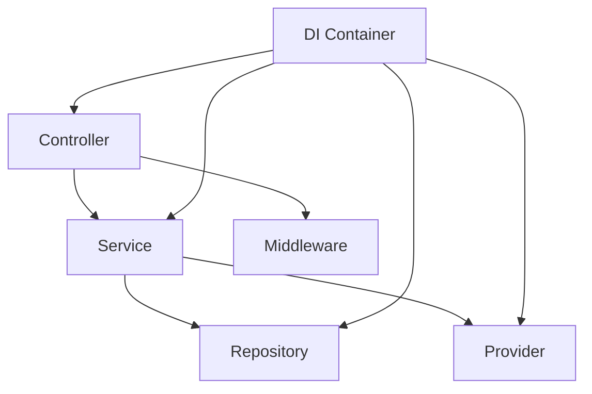

# 30. Layered Architecture 마이그레이션

# 제 1장: 준비

## **1-01. 개요: 이번 마이그레이션의 목적**

이 문서는 `feature-based` 구조를 `layered-architecture` 구조로 전환하는 과정을 다룹니다. 핵심 목표는 기능 추가가 아니라 구조 전환이며, 전환 후에도 인증과 사용자 API의 동작 결과는 이전과 동일하게 유지됩니다.

현재 `feature-based` 구조에서는 라우터 내부에 HTTP 처리, 비즈니스 규칙, DB 접근이 함께 섞여 있습니다. 이 구조는 초기 개발 속도가 빠르지만, 기능이 늘어날수록 수정 범위가 넓어지고 테스트 경계가 불분명해집니다. 따라서 이번 전환은 파일 위치를 바꾸는 작업이 아니라, 변경 이유별 책임 경계를 명확히 분리하는 설계 작업입니다.

이번 전환의 중심은 세 가지입니다. 첫째, Controller·Service·Repository의 책임을 분리합니다. 둘째, Password/JWT/Cookie 처리를 Provider 계층으로 분리합니다. 셋째, 의존성 조립을 Awilix 컨테이너로 중앙화합니다.

OOP 교재에서 배운 개념은 이 전환의 기준점으로 사용됩니다. 추상화는 계층의 역할 경계를 정하는 기준이 되고, 캡슐화는 `#private` 의존성 관리 방식으로 이어집니다. 상속은 `BaseController` 같은 공통 초기화 구조를 가능하게 하고, 다형성은 Provider 구현 교체 시 Service 코드를 유지할 수 있게 만듭니다. 즉, OOP 개념은 문법 학습으로 끝나는 것이 아니라, 서버 구조의 변경 비용을 낮추는 설계 원리로 확장됩니다.

각 절의 코드는 순서대로 적용하면서 동작을 확인합니다. 실행 결과가 다르면 다음 절로 넘어가지 않고 현재 절을 먼저 맞춘 뒤 진행합니다.

## **1-02. 개발 환경 설정**

이 절의 모든 셸 명령은 Bash 기준으로 작성합니다. Windows 환경도 PowerShell이나 CMD가 아니라 Git Bash(또는 WSL)에서 동일한 명령을 그대로 실행하는 것을 전제로 합니다.

### 1. 실습 작업본 준비

```bash
git clone https://github.com/winverse/codeit-fs-layered-architecture-starter
cd codeit-fs-layered-architecture-starter
pnpm install
```

이번 실습에서 클론한 저장소는 `feature-based` 기준본이므로, 복제 폴더를 추가로 만들지 않고 해당 디렉터리에서 바로 마이그레이션을 진행합니다.

### 2. 완성본 코드 준비

마이그레이션 진행 중 구조를 참고할 수 있도록 완성본 저장소를 별도 위치에 클론합니다.

```bash
git clone https://github.com/winverse/codeit-fs-layered-architecture
```

이 저장소는 수정하지 않고 참고용으로만 사용합니다. 교재에서 “완성본 코드에서 확인”이라고 표시된 부분은 이 폴더에서 해당 파일을 열어 확인합니다.

### 3. 빌드 스크립트 허용

```bash
pnpm approve-builds
? Choose which packages to build (Press <space> to select, <a> to toggle all, <i> to invert selection) …
  ● @prisma/engines
  ● bcrypt
❯ ● prisma
```

`pnpm approve-builds`는 네이티브/엔진 빌드 스크립트 실행 허용 단계입니다.

잘못 선택했으면 `pnpm approve-builds`를 다시 실행해 재선택할 수 있습니다.

### 4. PostgreSQL 데이터베이스 생성

`psql` 터미널을 열어 `prisma_auth` 데이터베이스를 새로 만듭니다.

**Mac (Homebrew PostgreSQL)**

```bash
psql postgres
```

```sql
CREATE DATABASE prisma_auth;
\q
```

**Windows (psql)**

시작 메뉴에서 `SQL Shell (psql)`을 실행합니다. 접속 정보를 물어보면 기본값을 사용하고, 비밀번호는 설치 시 설정한 값을 입력합니다.

```sql
CREATE DATABASE prisma_auth;
\q
```

### 5. 환경 변수 설정

`env/.env.example`을 복사해 `env/.env.development`를 만듭니다.

```bash
cp env/.env.example env/.env.development
```

`DATABASE_URL`을 해당 환경에 맞게 채웁니다. 이 교재에서는 데이터베이스 이름을 `prisma_auth`로 고정합니다.

**Mac**

```
DATABASE_URL="postgresql://postgres@localhost:5432/prisma_auth"
```

**Windows**

```
DATABASE_URL="postgresql://postgres:<비밀번호>@localhost:5432/prisma_auth"
```

### 6. JWT 비밀키 생성

터미널에서 아래 명령어를 두 번 실행합니다. 매번 다른 값이 출력됩니다.

```bash
openssl rand -base64 32   # JWT_ACCESS_SECRET 용
openssl rand -base64 32   # JWT_REFRESH_SECRET 용
```

> ⚠️ 두 키가 같으면 Access Token으로 Refresh 엔드포인트를 호출하는 보안 취약점이 생깁니다.
> 

출력된 값을 `env/.env.development`에 붙여넣습니다.

```
NODE_ENV=development
PORT=5001
DATABASE_URL="postgresql://postgres@localhost:5432/prisma_auth"
JWT_ACCESS_SECRET="<생성한_첫_번째_키>"
JWT_REFRESH_SECRET="<생성한_두_번째_키>"
```

### 7. DB 반영 및 서버 실행

```bash
pnpm prisma:push
pnpm prisma:generate
pnpm seed   # 선택: 초기 데이터가 필요할 때만 실행
pnpm dev
```

터미널에 아래와 같이 출력되면 정상입니다.

```
[development] Server running at http://localhost:5001
```

아래 검증이 통과하면 1장 준비가 완료됩니다.

```bash
curl -i -X POST http://localhost:5001/api/auth/login \
  -H "Content-Type: application/json" \
  -d '{}'
```

정상이라면 `400 Bad Request` 또는 유효성 검사 에러 응답이 반환됩니다. 이 단계의 목적은 인증이 성공하는지 확인하는 것이 아니라, 서버와 라우트가 정상 기동했는지 확인하는 것입니다.

`/api/ping` 검증은 `2-07`에서 App/Controller 연결을 완료한 뒤 최종 검증에서 수행합니다.

## **1-03. 마이그레이션 목표와 범위**

이번 작업의 범위는 `auth`, `users` 도메인입니다. `feature-based`의 라우터 중심 코드를 계층형 구조로 옮기되, API 계약(요청/응답 형태)은 가능한 한 유지합니다. 따라서 이번 전환의 핵심은 새 기능 구현이 아니라 책임 경계를 재정의하는 설계 과정에 있습니다.

현재 프로젝트에서는 이미 Express, Prisma, JWT, 쿠키 인증을 사용하고 있습니다. 문제는 기술 스택 자체가 아니라, 서로 다른 관심사가 같은 파일에 섞여 있다는 점입니다. 이 섞임을 분리하면 변경 지점이 줄고 테스트 범위가 명확해집니다.

| 구분 | `feature-based` | `layered-architecture` |
| --- | --- | --- |
| 진입 구조 | `server.js` 중심 | `main.js` + `App` + `Controller` |
| 인증 처리 | `auth.routes.js` 내부 혼재 | `AuthController` + `AuthService` + `AuthMiddleware` |
| 비밀번호/JWT/쿠키 | `utils` 함수 집합 | `providers` 클래스 집합 |
| DB 접근 | plain object repository | 클래스 repository + 생성자 주입 |
| 의존성 조립 | 파일 내부 import + 직접 생성 | Awilix 컨테이너 조립 |

이 표는 용어 비교가 아니라 수정 경계 비교입니다. 따라서 실제 작업 중에는 "어떤 파일을 고칠까"를 먼저 결정하기보다 "어떤 책임이 바뀌었는가"를 먼저 판정하고, 그 책임이 속한 계층으로 직접 진입하는 것이 정확합니다.

이번 교재에서 최종적으로 확인해야 할 결과는 아래 세 가지입니다.

1. 인증/사용자 API가 기존과 동일하게 동작할 것
2. 요청 처리 경로가 Controller → Service → Repository/Provider로 분리될 것
3. 객체 조립 규칙이 `container.js` 한 파일에 중앙화될 것

## **1-04. OOP 교재와 이번 전환의 연결점**

이번 전환은 단순한 파일 이동이 아니라, OOP 교재에서 배운 개념을 서버 구조로 번역하는 과정입니다. 따라서 “Controller, Service, Repository, Provider”라는 이름 자체보다, 각 계층이 어떤 객체지향 원칙을 구현하는지 먼저 연결해 두는 것이 중요합니다.

OOP 교재에서는 클래스 문법을 중심으로 객체를 설계했고, 캡슐화·상속·다형성을 통해 유지보수 가능한 구조를 만드는 방법을 학습했습니다. 이번 문서에서는 같은 원리를 HTTP 서버에 적용합니다. 즉, 엔티티 중심 클래스가 아니라 “역할 중심 클래스”를 설계합니다.

| OOP 교재 개념 | 이전 학습 맥락 | 이번 코드에서의 구현 위치 |
| --- | --- | --- |
| 추상화 | 문제에 필요한 정보만 노출 | Controller는 HTTP 입출력만, Service는 도메인 규칙만 담당 |
| 캡슐화 | `#private`로 내부 상태 보호 | `#userRepository`, `#tokenProvider` 등 의존성 은닉 |
| 상속 | 공통 기능을 부모에 모으고 자식이 재사용 | `BaseController`를 공통 부모로 사용 |
| 다형성 | 동일한 호출, 다른 구현 | `routes()` 오버라이딩 |
| 단순 팩토리/전략 | 생성/행동을 외부로 분리 | DI 컨테이너에서 객체 생성과 조합을 일괄 관리 |

위 대응표는 개념 연결을 보여주지만, 실제 전환에서는 같은 개념이 다른 형태로 나타납니다. OOP 교재에서는 주로 도메인 객체를 다뤘다면, 이번 문서에서는 계층 객체를 설계 대상으로 삼습니다. 따라서 문법은 비슷해도 적용 지점과 설계 의도가 달라집니다.

| OOP 교재에서의 패턴 | 이번 교재의 서버 코드 형태 | 유지되는 원리 | 달라지는 지점 |
| --- | --- | --- | --- |
| `constructor` + `#private` | `AuthService({ userRepository, passwordProvider, tokenProvider })` + `#userRepository` | 내부 협력 대상을 외부에서 직접 건드리지 않도록 캡슐화 | 값 초기화보다 의존성 초기화가 중심 |
| `extends` + `super()` | `AuthController extends BaseController` | 공통 초기화를 부모로 올려 중복 제거 | 공통 대상이 비즈니스 로직이 아니라 라우터 초기화 규칙 |
| 다형성(같은 호출, 다른 구현) | `routes()` 오버라이딩 | `App`은 어떤 Controller든 `controller.routes()`를 동일하게 호출 | 오버라이딩 대상이 도메인 로직이 아니라 라우터 등록 규칙 |
| 단순 팩토리/전략 | `container.register(asClass/asValue)` | 생성/조합 책임을 사용 코드 밖으로 분리 | 분기문 기반 생성 대신 컨테이너 선언 기반 조립 |

### 1) 추상화: “기능”이 아니라 “책임” 기준으로 클래스 경계를 나눕니다

추상화는 많은 정보를 숨기는 기술이 아니라, 문제 해결에 필요한 관점만 남기는 설계입니다. 인증 API에서 필요한 관점은 HTTP 처리, 도메인 규칙, 데이터 접근, 인프라 연동으로 구분됩니다. 이 기준으로 클래스를 분리하면 어떤 이유로 변경되는 코드인지를 빠르게 구분할 수 있습니다.

아래는 `AuthController.signUp`의 핵심 구조입니다. 이 메서드는 요청에서 값을 꺼내 Service에 넘기고, 결과를 응답으로 변환하는 것이 전부입니다.

> 완성본: `src/controllers/auth.controller.js` → `signUp` 메서드
> 

```jsx
// AuthController.signUp — HTTP 계층만 담당
async signUp(req, res, next) {
  const { email, password, name } = req.body;               // 1. HTTP 요청에서 값 추출
  // 2. 도메인 규칙은 Service에 위임
  const { user, tokens } = await this.#authService.signUp({
    email, password, name,
  });
  // 3. HTTP 응답 처리
  this.#cookieProvider.setAuthCookies(res, tokens);
  res.status(HTTP_STATUS.CREATED).json(user);
}
```

Controller는 `bcrypt`가 무엇인지, 어떤 쿼리가 실행되는지 알지 못합니다. “무엇을 받아서 무엇을 돌려줄 것인가”라는 HTTP 계약만 담당하는 것이 추상화된 계층 경계입니다.

### 2) 캡슐화: 의존성도 상태처럼 보호합니다

OOP 교재에서는 `#email` 같은 도메인 상태를 보호했습니다. 서버 코드에서는 같은 원리로 “의존성 참조”를 보호합니다. 주입된 객체를 `#private`로 보관하면 외부에서 임의 교체하거나 직접 호출 흐름을 바꾸는 것을 방지할 수 있습니다.

> 완성본: `src/services/auth.service.js` → 클래스 상단 `#private` 필드 선언과 `constructor`
> 

```jsx
export class AuthService {
  #userRepository; // ← 외부에서 직접 교체 불가
  #passwordProvider;
  #tokenProvider;

  constructor({
    userRepository,
    passwordProvider,
    tokenProvider,
  }) {
    this.#userRepository = userRepository;
    this.#passwordProvider = passwordProvider;
    this.#tokenProvider = tokenProvider;
  }

  // signUp(), login() 같은 공개 메서드를 통해서만 내부 규칙이 실행됩니다.
}
```

캡슐화의 의미는 “숨긴다”에 그치지 않습니다. 공개된 메서드(`signUp`, `login`)를 통해서만 내부 규칙이 실행되게 하여, 메서드 실행 흐름과 예외 처리를 한 곳에 고정하는 효과가 있습니다.

### 3) 상속: BaseController로 공통 라우터 초기화를 재사용합니다

상속은 코드 줄 수를 줄이는 기술보다 “공통 규칙의 위치를 고정”하는 기술에 가깝습니다. 모든 컨트롤러가 `express.Router()`를 직접 생성하면 중복 자체보다 초기화 규칙이 분산되는 문제가 생깁니다.

`BaseController`는 이 공통 초기화를 담당합니다. 모든 컨트롤러 클래스의 공통 부모입니다.

> 완성본: `src/controllers/base.controller.js` → `BaseController` / `src/controllers/users.controller.js` → `constructor`
> 

```jsx
// BaseController: 공통 초기화 규칙을 한 곳에 고정
export class BaseController {
  constructor() {
    this.router = express.Router(); // 모든 자식이 이 라우터를 공유
  }
}

// UsersController: super()로 공통 초기화를 받고, 자신의 의존성만 추가
export class UsersController extends BaseController {
  #usersService; // private 필드는 class body에 먼저 선언해야 합니다.

  constructor({ usersService }) {
    super(); // ← this.router = express.Router() 자동 실행
    this.#usersService = usersService;
  }
}
```

`super()` 호출로 공통 초기화를 강제하면, 모든 컨트롤러가 동일한 라우팅 기반 위에서 동작합니다. 이는 OOP 교재의 “부모는 공통, 자식은 차이” 규칙을 그대로 적용한 형태입니다.

### 4) 생성자 주입 패턴과 IoC: 객체가 직접 의존성을 만들지 않게 하는 원칙

OOP 교재의 생성자는 대체로 문자열·숫자 같은 값 초기화에 사용되었습니다. 이번 전환에서는 생성자가 문자열·숫자 대신 “함께 사용할 다른 객체(의존성)”를 외부에서 받는 방식으로 확장됩니다.

### 생성자 주입 패턴

생성자 주입(Constructor Injection)은 Dependency Injection을 구현하는 가장 기본적인 패턴입니다. 핵심은 단순합니다. **클래스가 필요한 의존성을 내부에서 `new`로 만들지 않고, `constructor` 매개변수로 외부에서 받는 것입니다.**

```jsx
// ❌ 주입 없음 (1): 클래스가 의존성을 직접 생성
class AuthService {
  #passwordProvider = new PasswordProvider(); // 하드코딩 → 교체 불가
  #userRepository = new UserRepository(prisma); // 하드코딩 → 테스트 불가

  async signUp({ email, password, name }) {
    const hashedPassword =
      await this.#passwordProvider.hash(password);
    // ...
  }
}

// ❌ 주입 없음 (2): 모듈 최상단에서 직접 import
import { usersRepository } from "#repository"; // 파일에 고정 → 교체 불가, 테스트 불가
import { hashPassword } from "#utils";

class AuthService {
  async signUp({ email, password, name }) {
    const hashedPassword = await hashPassword(password);
    const user = await usersRepository.createUser({ email, password: hashedPassword, name });
    // ...
  }
}

// ✅ 생성자 주입: 외부에서 의존성을 받음
class AuthService {
  #userRepository;
  #passwordProvider;
  #tokenProvider;

  constructor({
    userRepository,
    passwordProvider,
    tokenProvider,
  }) {
    this.#userRepository = userRepository; // 외부에서 받아 저장
    this.#passwordProvider = passwordProvider;
    this.#tokenProvider = tokenProvider;
  }

  async signUp({ email, password, name }) {
    const hashedPassword =
      await this.#passwordProvider.hash(password);
    // ...
  }
}

// 사용하는 쪽에서 직접 조립:
const userRepository = new UserRepository({ prisma });
const passwordProvider = new PasswordProvider();
const tokenProvider = new TokenProvider();
const authService = new AuthService({
  userRepository,
  passwordProvider,
  tokenProvider,
});
```

생성자로 받는 이유는 세 가지입니다.

첫째, **필수 의존성을 명시**합니다. 생성자 매개변수에 있으면 “이것 없이는 인스턴스를 만들 수 없다”는 의미가 됩니다. 반대로 생성 이후 속성 대입(`instance.dep = dep`)이나 setter 주입에 의존하면 주입 누락이 늦게 드러나 실수를 조기에 잡기 어렵습니다.

둘째, **불변성을 보장**합니다. `#private`로 저장하면 생성 이후 외부에서 임의로 교체하거나 `null`로 덮어쓸 수 없습니다.

셋째, **테스트 대체**가 쉬워집니다. 생성 시점에 실제 구현 대신 같은 메서드 시그니처를 가진 모의 객체(mock)를 넘길 수 있습니다.

### IoC(Inversion of Control, 제어의 역전) 개념

DI를 한 단계 위에서 바라보면 IoC 원칙이 됩니다.

- **제어(Control)**: 여기서 제어란 “객체를 누가 만드는가”의 주도권입니다.
- **역전(Inversion)**: 원래 `AuthService` 내부 코드가 `new PasswordProvider()`로 의존 객체를 직접 생성했다면, 이 생성/조립 주도권을 **외부**로 이동시키는 것이 역전입니다.

```
[주입 없음]  AuthService ──new──▶ PasswordProvider   (AuthService가 주도)

[IoC 적용]  Container ──new──▶ PasswordProvider
            Container ──new──▶ AuthService(passwordProvider) (외부가 주도)
```

**IoC Container**는 이 “외부 조립”을 체계적으로 담당하는 도구입니다. 어떤 클래스를 어떤 순서로 생성하고, 어떤 의존성을 어디에 주입할지를 한 곳에서 선언하고 관리합니다.

이번 전환에서는 IoC Container를 두 단계로 경험합니다. 2-05에서는 `createContainer` 함수를 직접 작성해 의존성 생성 순서를 손으로 제어합니다(수동 IoC). 2-06에서는 같은 역할을 Awilix 라이브러리에 위임해 선언적으로 관리합니다(자동 IoC Container).

### 5) 다형성: 동일한 계약을 유지한 채 구현을 교체할 수 있습니다

이번 전환에서 다형성은 두 가지 형태로 나타납니다.

첫 번째는 **상속 기반 다형성**입니다. `AuthController`와 `UsersController`가 `BaseController`를 상속하고 `routes()`를 오버라이딩합니다. 호출부인 `App`은 어떤 구현체인지 몰라도 동일하게 `controller.routes()`를 호출할 수 있습니다. OOP 교재에서 배운 형태와 동일합니다.

두 번째는 **DI 기반 다형성**입니다. 상속 없이도 인터페이스가 동일한 다른 구현체를 주입하면 호출부 코드를 변경하지 않아도 됩니다.

여기서 **인터페이스**란 “어떤 메서드를 어떤 인자로 호출할 수 있는가”를 정의한 명세입니다. 인터페이스는 Provider마다 다릅니다. `passwordProvider`는 `hash`·`compare`, `tokenProvider`는 `generateTokens`(및 verify 계열)가 인터페이스입니다. 각 Provider의 구현체가 이 메서드 이름과 인자 형태를 그대로 유지하는 한, 호출부를 건드리지 않고 구현체를 교체할 수 있습니다.

JavaScript에는 인터페이스 문법이 없지만, 메서드 이름과 인자 형태라는 암묵적 인터페이스가 그 역할을 대신합니다.

> 완성본: `src/services/auth.service.js` → `login` 메서드
> 

```jsx
async login({ email, password }) {
  const authUser = await this.#userRepository.findByEmail(email, {
    includePassword: true,
  });

  if (!authUser) {
    throw new UnauthorizedException(ERROR_MESSAGE.INVALID_CREDENTIALS);
  }

  const isPasswordValid = await this.#passwordProvider.compare(
    password,
    authUser.password,
  );
  if (!isPasswordValid) {
    throw new UnauthorizedException(ERROR_MESSAGE.INVALID_CREDENTIALS);
  }

  const user = await this.#userRepository.findById(authUser.id);
  if (!user) {
    throw new UnauthorizedException(ERROR_MESSAGE.USER_NOT_FOUND_FROM_TOKEN);
  }

  const tokens = this.#tokenProvider.generateTokens(user);

  return { user, tokens };
}
```

이 패턴은 OOP 교재의 다형성 원리를 “서비스-의존성 계약”으로 확장한 사례입니다. 즉, 호출부를 고정하고 구현을 교체할 수 있게 만드는 것이 DI 구조의 본질입니다.

정리하면 이번 전환은 OOP 개념을 서버 계층 설계로 구체화한 과정입니다. 2장부터 진행하는 각 단계는 새로운 문법을 배우는 순서가 아니라, 위에서 정리한 추상화·캡슐화·상속·다형성 원칙을 코드 위치에 배치하는 순서입니다.

## **1-05. `feature-based` 구조 진단: 무엇이 섞여 있는가 ⭐️⭐️⭐️**

`feature-based` 구조의 핵심 문제는 라우터 핸들러 내부에 서로 다른 관심사가 같이 들어 있다는 점입니다. 인증 라우터를 보면 HTTP 처리, 비즈니스 로직, DB 접근이 한 함수에서 연달아 실행됩니다.

파일: `/src/routes/auth/auth.routes.js`

```jsx
import express from "express";
import {
  generateTokens,
  setAuthCookies,
  hashPassword,
  comparePassword,
} from "#utils";
import { validate } from "#middlewares";
import { HTTP_STATUS, ERROR_MESSAGE } from "#constants";
import {
  signUpSchema,
  loginSchema,
} from "./auth.schemas.js";
import { usersRepository } from "#repository";
import { UnauthorizedException } from "#exceptions";

export const authRouter = express.Router();

authRouter.post(
  "/signup",
  validate("body", signUpSchema),
  async (req, res, next) => {
    try {
      const { email, password, name } = req.body;

      const hashedPassword = await hashPassword(password);

      const user = await usersRepository.createUser({
        email,
        password: hashedPassword,
        name,
      });

      const tokens = generateTokens(user);
      setAuthCookies(res, tokens);

      const { password: _, ...userWithoutPassword } = user;
      res
        .status(HTTP_STATUS.CREATED)
        .json(userWithoutPassword);
    } catch (error) {
      next(error);
    }
  },
);

authRouter.post(
  "/login",
  validate("body", loginSchema),
  async (req, res, next) => {
    try {
      const { email, password } = req.body;

      const user =
        await usersRepository.findUserByEmail(email);

      if (!user) {
        throw new UnauthorizedException(
          ERROR_MESSAGE.INVALID_CREDENTIALS,
        );
      }

      const isPasswordValid = await comparePassword(
        password,
        user.password,
      );
      if (!isPasswordValid) {
        throw new UnauthorizedException(
          ERROR_MESSAGE.INVALID_CREDENTIALS,
        );
      }

      const tokens = generateTokens(user);
      setAuthCookies(res, tokens);

      const { password: _, ...userWithoutPassword } = user;
      res.status(HTTP_STATUS.OK).json(userWithoutPassword);
    } catch (error) {
      next(error);
    }
  },
);
```

사용자 라우터에서도 같은 문제가 반복됩니다. 권한 검사, 존재 검사, 업데이트 실행, 응답 작성이 모두 라우터 함수에 들어가 있으므로, 변경 이유가 달라도 같은 파일을 수정하게 됩니다.

파일: `/src/routes/users/users.routes.js`

```jsx
usersRouter.patch(
  "/:id",
  authMiddleware,
  validate("params", idParamSchema),
  validate("body", updateUserSchema),
  async (req, res, next) => {
    try {
      const { id } = req.params;
      const { email, name } = req.body;

      if (req.user.id !== id) {
        throw new ForbiddenException(
          ERROR_MESSAGE.FORBIDDEN_RESOURCE,
        );
      }

      const existingUser =
        await usersRepository.findUserById(id);
      if (!existingUser) {
        throw new NotFoundException(
          ERROR_MESSAGE.USER_NOT_FOUND,
        );
      }

      const updatedUser = await usersRepository.updateUser(
        id,
        { email, name },
      );
      res.status(HTTP_STATUS.OK).json(updatedUser);
    } catch (error) {
      next(error);
    }
  },
);
```

`utils` 계층도 순수 도구 계층으로 보기 어렵습니다. 예를 들어 JWT 유틸 내부에서 repository를 직접 import하면, 토큰 관련 함수가 데이터 계층과 결합됩니다.

파일: `/src/utils/jwt.util.js`

```jsx
import jwt from "jsonwebtoken";
import { config } from "#config";
import { MINUTE_IN_SECONDS } from "#constants";
import { usersRepository } from "#repository";

export const generateAccessToken = (user) => {
  return jwt.sign(
    {
      userId: user.id,
      name: user.name,
    },
    config.JWT_ACCESS_SECRET,
    {
      expiresIn: "15m",
    },
  );
};

export const generateRefreshToken = (user) => {
  return jwt.sign(
    { userId: user.id },
    config.JWT_REFRESH_SECRET,
    {
      expiresIn: "7d",
    },
  );
};

export const generateTokens = (user) => {
  const accessToken = generateAccessToken(user);
  const refreshToken = generateRefreshToken(user);
  return { accessToken, refreshToken };
};

export const verifyToken = (
  token,
  tokenType = "access",
) => {
  try {
    const secret =
      tokenType === "access"
        ? config.JWT_ACCESS_SECRET
        : config.JWT_REFRESH_SECRET;
    return jwt.verify(token, secret);
  } catch (error) {
    console.error(
      "Token verification error:",
      error.message,
    );
    return null;
  }
};

export const shouldRefreshToken = (payload) => {
  if (!payload || !payload.exp) return false;

  const expiresIn =
    payload.exp - Math.floor(Date.now() / 1000);

  return expiresIn < MINUTE_IN_SECONDS * 5 && expiresIn > 0;
};

export const refreshTokens = async (refreshToken) => {
  const payload = verifyToken(refreshToken, "refresh");
  if (!payload) {
    return null;
  }

  const user = await usersRepository.findUserById(
    payload.userId,
  );
  if (!user) {
    return null;
  }

  return generateTokens({ id: user.id, name: user.name });
};
```

결론적으로 `feature-based` 구조는 “파일 단위 기능 분류”는 되어 있지만 “책임 단위 분리”는 부족합니다. 따라서 이번 전환은 파일 이름을 바꾸는 작업이 아니라, 책임 경계를 재정의하는 작업입니다.

## **1-06. 목표 구조와 파일 매핑**

목표 구조에서는 HTTP·비즈니스·데이터·인프라 의존성을 분리하고, 조립은 컨테이너 한 곳에서 담당합니다. 이때 각 계층은 아래 방향으로만 의존하며, 역방향 참조는 금지합니다.



| 폴더 | 역할 |
| --- | --- |
| `src/controllers/` | HTTP 요청 수신·응답 반환. 비즈니스 로직은 Service에 위임 |
| `src/services/` | 도메인 규칙과 비즈니스 로직. Repository·Provider를 조합해 유스케이스 수행 |
| `src/repository/` | DB 접근 전담. Prisma 쿼리를 캡슐화하고 순수 데이터를 반환 |
| `src/providers/` | 외부 라이브러리 의존성 캡슐화. 해시·토큰·쿠키 정책을 한 곳에서 관리 |
| `src/middlewares/` | 인증 검사, CORS, 에러 처리 등 횡단 관심사 처리 |
| `src/common/` | 특정 계층에 속하지 않는 앱 전반의 설정 |
| `src/config/` | 환경 변수 로드 및 검증. 설정값을 한 곳에서 관리 |

> `*providers/`는 Service가 직접 주입(Injection)받아 호출하는 기능 객체이고, `common/`은 특정 계층에 속하지 않고 앱 전반에서 공유하는 인프라(DI 설정, 상수, 예외, 생명주기)입니다.*
> 

| `feature-based` 위치 | `layered-architecture` 위치 | 전환 포인트 |
| --- | --- | --- |
| `routes/auth/*.js` | `controllers/auth` + `services/auth.service.js` | 라우터에서 로직 분리 |
| `routes/users/*.js` | `controllers/users` + `services/users.service.js` | 권한/비즈니스 규칙 서비스 이동 |
| `utils/hash.util.js` | `providers/password.provider.js` | 함수 → 클래스 |
| `utils/jwt.util.js` | `providers/token.provider.js` | 토큰 생성/검증 캡슐화 |
| `utils/cookie.util.js` | `providers/cookie.provider.js` | 쿠키 설정 캡슐화 |
| `repository/users.repository.js` | `repository/user.repository.js` | plain object → 클래스 주입 |
| `server.js` | `app.js`, `main.js` | 앱 설정과 부트스트랩 분리 |
| 없음 | `common/di/container.js` | Awilix 기반 의존성 조립 |

## **1-07. 패키지 설정과 공통 구조 초기화**

2장 작업을 시작하기 전에 패키지 설치부터 디렉터리 재구성, 설정 파일 업데이트까지 여러 초기 작업이 필요합니다. 이 작업들은 2장에서 만들 파일들이 `import` 경로를 올바르게 찾을 수 있도록 기반을 갖추는 준비 단계입니다.

### 1) 새 패키지 설치

2장에서 Awilix 컨테이너와 날짜 포맷에 사용할 두 패키지를 먼저 설치합니다.

```bash
pnpm add awilix date-fns
```

### 2) package.json 업데이트

`package.json`의 `main` 필드, `scripts.dev`, `imports`(경로 별칭)를 아래와 같이 교체합니다.

파일: `/package.json`

```json
{
  "name": "layered-architecture-starter",
  "version": "1.0.0",
  "description": "",
  "main": "./src/main.js",
  "type": "module",
  "imports": {
    "#generated/*": "./generated/*",
    "#config": "./src/config/config.js",
    "#db/*": "./src/db/*",
    "#repository": "./src/repository/index.js",
    "#constants": "./src/common/constants/index.js",
    "#exceptions": "./src/common/exceptions/index.js",
    "#controllers": "./src/controllers/index.js",
    "#services": "./src/services/index.js",
    "#middlewares": "./src/middlewares/index.js",
    "#providers": "./src/providers/index.js"
  },
  "scripts": {
    "dev": "nodemon --env-file=./env/.env.development ./src/main.js", // main.js 로 변경
    "prod": "node --env-file=./env/.env.production src/main.js",
    "prisma:push": "dotenv -e ./env/.env.development -- prisma db push",
    "prisma:studio": "dotenv -e ./env/.env.development -- prisma studio",
    "prisma:generate": "dotenv -e ./env/.env.development -- prisma generate",
    "seed": "pnpm run prisma:generate && node ./scripts/seed.js",
    "format": "prettier --write .",
    "format:check": "prettier --check .",
    "lint": "eslint ."
  }
}
```

> `"name"`, `"version"`, `"description"` 아래의 나머지 필드(`dependencies`, `devDependencies`, `engines`, `keywords`, `author`, `license`)는 현재 값을 그대로 유지합니다. `pnpm add awilix date-fns`를 실행하면 `dependencies`에 자동으로 추가됩니다.
> 

### 3) 공통 디렉터리 재배치

`constants`와 `exceptions`를 `src/common/` 하위로 이동하고, `graceful-shutdown` 유틸을 새 위치로 복사합니다.

```bash
mkdir -p src/common/constants src/common/exceptions src/common/lifecycle

# constants 이동
mv src/constants/* src/common/constants/
rm -r src/constants

# exceptions 이동
mv src/exceptions/* src/common/exceptions/
rm -r src/exceptions

# graceful-shutdown 이동
mv src/utils/graceful-shutdown.util.js src/common/lifecycle/graceful-shutdown.js
```

이동 후 `src/common/lifecycle/graceful-shutdown.js`를 아래 내용으로 전체 교체합니다. 이동 직후의 파일과 내용이 다를 수 있으므로 반드시 교체합니다.

파일: `/src/common/lifecycle/graceful-shutdown.js`

```jsx
export const setupGracefulShutdown = (server, prisma) => {
  const shutdown = async (signal) => {
    console.log(
      `\n${signal} 신호를 받았습니다. 서버를 종료합니다...`,
    );

    try {
      await new Promise((resolve, reject) => {
        server.close((error) => {
          if (error) {
            reject(error);
            return;
          }
          resolve();
        });
      });
      console.log("서버가 종료되었습니다.");

      await prisma.$disconnect();
      console.log("데이터베이스 연결이 종료되었습니다.");
      process.exit(0);
    } catch (error) {
      console.error("데이터베이스 종료 중 에러:", error);
      process.exit(1);
    }
  };

  process.on("SIGINT", () => shutdown("SIGINT"));
  process.on("SIGTERM", () => shutdown("SIGTERM"));
};
```

### 4) 상수·예외 파일 업데이트

`http-status.js`에 `FORBIDDEN` 코드를 추가하고, `errors.js`에 `FORBIDDEN`·`UNAUTHORIZED` 메시지와 영어 메시지 4개를 업데이트합니다. 이 상수들은 2장에서 만들 예외 클래스와 미들웨어에서 사용됩니다.

파일: `/src/common/constants/http-status.js`

```jsx
// HTTP 상태 코드 상수
export const HTTP_STATUS = {
  OK: 200,
  CREATED: 201,
  NO_CONTENT: 204,
  BAD_REQUEST: 400,
  UNAUTHORIZED: 401,
  FORBIDDEN: 403, // 추가
  NOT_FOUND: 404,
  CONFLICT: 409,
  INTERNAL_SERVER_ERROR: 500,
};
```

파일: `/src/common/constants/errors.js`

```jsx
// Prisma 에러 코드 상수
export const PRISMA_ERROR = {
  UNIQUE_CONSTRAINT: "P2002",
  RECORD_NOT_FOUND: "P2025",
};

// 에러 메시지 상수
export const ERROR_MESSAGE = {
  // User 관련
  USER_NOT_FOUND: "User not found",
  EMAIL_REQUIRED: "Email is required",
  EMAIL_ALREADY_EXISTS: "Email already exists",
  FAILED_TO_FETCH_USERS: "Failed to fetch users",
  FAILED_TO_FETCH_USER: "Failed to fetch user",
  FAILED_TO_CREATE_USER: "Failed to create user",
  FAILED_TO_UPDATE_USER: "Failed to update user",
  FAILED_TO_DELETE_USER: "Failed to delete user",

  // Auth 관련
  NO_AUTH_TOKEN: "No authentication token provided",
  INVALID_TOKEN: "Invalid or expired token",
  USER_NOT_FOUND_FROM_TOKEN: "User not found from token",
  AUTH_FAILED: "Authentication failed",
  INVALID_CREDENTIALS: "Invalid email or password",
  FORBIDDEN: "Forbidden",
  UNAUTHORIZED: "Unauthorized",

  // Validation
  INVALID_INPUT: "Invalid input",
  VALIDATION_FAILED: "Validation failed",

  // 일반 에러 (Exception 기본값으로 사용)
  RESOURCE_NOT_FOUND: "Resource not found",
  BAD_REQUEST: "Bad request",
  RESOURCE_CONFLICT: "Resource already exists",
  INTERNAL_SERVER_ERROR: "Internal server error",
};
```

`ForbiddenException`이 하드코딩된 `403` 대신 `HTTP_STATUS.FORBIDDEN`을 사용하도록 교체합니다.

파일: `/src/common/exceptions/forbidden.exception.js`

```jsx
import { HttpException } from "./http.exception.js";
import { ERROR_MESSAGE, HTTP_STATUS } from "#constants";

export class ForbiddenException extends HttpException {
  constructor(
    message = ERROR_MESSAGE.FORBIDDEN,
    details = null,
  ) {
    super(HTTP_STATUS.FORBIDDEN, message, details);
  }
}
```

### 6) 설정·CORS 미들웨어 업데이트

`config.js`에 `CORS_ORIGINS` 환경 변수를 추가하고, `cors.middleware.js`가 하드코딩 화이트리스트 대신 config의 `corsOrigins`를 사용하도록 교체합니다.

파일: `/src/config/config.js`

```jsx
import { flattenError, z } from "zod";

const envSchema = z.object({
  NODE_ENV: z
    .enum(["development", "production", "test"])
    .default("development"),
  PORT: z.coerce
    .number()
    .min(1000)
    .max(65535)
    .default(5001),
  DATABASE_URL: z.url(),
  JWT_ACCESS_SECRET: z.string().min(32),
  JWT_REFRESH_SECRET: z.string().min(32),
  CORS_ORIGINS: z.string().optional().default(""),
});

const parseEnvironment = () => {
  try {
    return envSchema.parse({
      NODE_ENV: process.env.NODE_ENV,
      PORT: process.env.PORT,
      DATABASE_URL: process.env.DATABASE_URL,
      JWT_ACCESS_SECRET: process.env.JWT_ACCESS_SECRET,
      JWT_REFRESH_SECRET: process.env.JWT_REFRESH_SECRET,
      CORS_ORIGINS: process.env.CORS_ORIGINS,
    });
  } catch (error) {
    if (error instanceof z.ZodError) {
      const { fieldErrors } = flattenError(error);
      console.error("환경 변수 검증 실패:", fieldErrors);
    }
    process.exit(1);
  }
};

export const config = parseEnvironment();

export const isDevelopment =
  config.NODE_ENV === "development";
export const isProduction =
  config.NODE_ENV === "production";
export const isTest = config.NODE_ENV === "test";

export const corsOrigins = config.CORS_ORIGINS.split(",")
  .map((origin) => origin.trim())
  .filter(Boolean);
```

파일: `/src/middlewares/cors.middleware.js`

```jsx
import { corsOrigins, isProduction } from "#config";

export const cors = (req, res, next) => {
  const origin = req.headers.origin;
  const isAllowed =
    !isProduction ||
    (origin && corsOrigins.includes(origin));

  if (isAllowed && origin) {
    res.header("Access-Control-Allow-Origin", origin);
    res.header("Access-Control-Allow-Credentials", "true");
  } else if (!isProduction) {
    // 개발 환경인데 Origin 헤더가 없는 경우(Postman 등)를 위해 최소한의 허용
    res.header("Access-Control-Allow-Origin", "*");
  }

  // 공통 헤더 설정
  res.header(
    "Access-Control-Allow-Methods",
    "GET, POST, PUT, PATCH, DELETE, OPTIONS",
  );
  res.header(
    "Access-Control-Allow-Headers",
    "Content-Type, Authorization",
  );

  // Preflight(사전 요청) 처리
  if (req.method === "OPTIONS") {
    return res.sendStatus(200);
  }

  next();
};
```

# 제 2장: 계층 추출

## **2-01. Repository 계층 추출**

Repository 계층의 설계 기준은 OOP 교재에서 배운 캡슐화 원칙입니다. 캡슐화는 내부 구현을 숨기고 외부에 계약(메서드 시그니처)만 노출하는 원칙입니다. 이 원칙을 데이터 접근 계층에 적용하면, Service는 “어떤 DB를 어떤 쿼리로 조회하는지” 알 필요 없이 `findById(id)` 같은 메서드만 호출하게 됩니다. DB 기술이 바뀌어도 Service 코드는 변하지 않는 구조가 됩니다.

이 계층의 역할은 데이터 접근을 한곳에 모으는 것입니다. 컨트롤러나 서비스가 Prisma API 세부 형태를 직접 알지 않게 만들면, DB 모델 변경 시 수정 범위를 Repository로 제한할 수 있습니다.

`feature-based`에서는 plain object로 export하고 `prisma`를 파일 내부에서 직접 import했습니다. 이 구조는 테스트 대체가 어렵고, 의존성을 외부에서 주입하기 어렵습니다.

파일: `/src/repository/users.repository.js`

```jsx
import { prisma } from "#db/prisma.js";

function createUser(data) {
  return prisma.user.create({ data });
}

function findUserById(id) {
  return prisma.user.findUnique({
    where: { id: Number(id) },
  });
}

export const usersRepository = {
  createUser,
  findUserById,
  findAllUsers,
  updateUser,
  deleteUser,
  findUserByEmail,
};
```

`layered-architecture`에서는 클래스로 바꾸고, `prisma`를 생성자 주입으로 받습니다. 또한 API 응답에 필요한 필드만 `select`로 제한해 데이터 노출 경계를 명시합니다.

파일: `/src/repository/user.repository.js`

```jsx
export class UserRepository {
  #prisma;

  constructor({ prisma }) {
    this.#prisma = prisma;
  }

  findAll() {
    return this.#prisma.user.findMany({
      select: {
        id: true,
        email: true,
        name: true,
        createdAt: true,
      },
    });
  }

  findById(id) {
    return this.#prisma.user.findUnique({
      where: {
        id: Number(id),
      },
      select: {
        id: true,
        email: true,
        name: true,
        createdAt: true,
      },
    });
  }

  findByEmail(email, { includePassword = false } = {}) {
    return this.#prisma.user.findUnique({
      where: {
        email,
      },
      select: {
        id: true,
        email: true,
        name: true,
        ...(includePassword ? { password: true } : {}),
        createdAt: true,
      },
    });
  }

  create(data) {
    return this.#prisma.user.create({
      data,
      select: {
        id: true,
        email: true,
        name: true,
        createdAt: true,
      },
    });
  }

  update(id, data) {
    return this.#prisma.user.update({
      where: {
        id: Number(id),
      },
      data,
      select: {
        id: true,
        email: true,
        name: true,
        createdAt: true,
      },
    });
  }

  delete(id) {
    return this.#prisma.user.delete({
      where: {
        id: Number(id),
      },
    });
  }
}
```

`findByEmail`은 `includePassword` 옵션으로 반환 필드를 제어합니다. 기본값에서는 `password`를 제외하고, 인증 검증처럼 해시 비교가 필요한 경우에만 `includePassword: true`를 사용합니다. 이렇게 조건을 메서드 시그니처로 드러내면 호출부의 의도가 명확해지고, 비밀번호 필드 노출 위험을 줄일 수 있습니다.

`index.js`는 repository 모듈의 외부 공개 진입점입니다. 이 파일을 통해 `#repository` 별칭에서 `UserRepository`를 일관되게 import할 수 있습니다.

파일: `/src/repository/index.js`

```jsx
export * from "./user.repository.js";
```

기존 파일(`users.repository.js`)은 더 이상 사용하지 않으므로 삭제합니다.

```bash
rm ./src/repository/users.repository.js
```

## **2-02. Provider 계층 추출**

Provider 계층은 이번 전환에서 새로 도입되는 개념입니다. OOP 교재에서 직접 다루지 않았기 때문에 먼저 의미를 고정해야 Service 설계가 자연스럽게 이해됩니다.

`bcrypt`, `jsonwebtoken`, `res.cookie` 같은 외부 라이브러리를 클래스 내부에 가두는 얇은 래퍼(Wrapper) 층이 Provider입니다. Service는 라이브러리를 직접 호출하는 대신 `hash()`, `generateTokens()`, `setAuthCookies()` 같은 도메인 수준 메서드에만 의존하게 됩니다. 이 구조에서는 외부 라이브러리를 교체해도 Service를 수정할 필요가 없어, 인프라 변경이 도메인 규칙에 영향을 주지 않습니다.

`feature-based`에서는 인증 라우터가 유틸 함수를 직접 호출합니다. 동작은 간단하지만, 해시 정책·토큰 정책·쿠키 정책이 바뀌면 라우터 파일까지 함께 수정해야 합니다. 즉, HTTP 계층과 인프라 정책이 분리되지 않은 상태입니다.

파일: `/src/routes/auth/auth.routes.js`

```jsx
import {
  generateTokens,
  setAuthCookies,
  hashPassword,
  comparePassword,
} from "#utils";

const hashedPassword = await hashPassword(password);
const tokens = generateTokens(user);
setAuthCookies(res, tokens);
```

유틸 함수 자체도 각각 파일로 분리되어 있어, “인증 인프라 규칙”을 한 객체 단위로 다루기 어렵습니다. 아래 코드는 단순 해싱 유틸이지만, 이런 함수들이 늘어날수록 호출부가 세부 구현에 직접 결합됩니다.

파일: `/src/utils/hash.util.js`

```jsx
import bcrypt from "bcrypt";

export const hashPassword = async (password) => {
  const saltRounds = 10;
  return await bcrypt.hash(password, saltRounds);
};
```

| Provider | 감싸는 대상 | Service에서 얻는 효과 |
| --- | --- | --- |
| `PasswordProvider` | `bcrypt` | 해시/비교 규칙 일원화 |
| `TokenProvider` | `jsonwebtoken` | 토큰 생성/검증 캡슐화 |
| `CookieProvider` | `res.cookie`, `res.clearCookie` | 쿠키 정책 일원화 |

OOP 교재에서 static 유틸리티 메서드도 다루지만, 이번 프로젝트에서 Provider를 인스턴스 클래스로 둔 이유는 **외부 라이브러리 캡슐화** 때문입니다. `bcrypt`, `jsonwebtoken` 같은 외부 라이브러리를 Service에서 직접 다루지 않고 Provider 안에 가두면, 라이브러리를 교체할 때 Provider만 수정하면 됩니다. Provider는 외부 의존성을 주입받는 대신 내부에서 라이브러리와 설정값을 직접 참조하므로, 생성자 매개변수 없이 단독으로 초기화됩니다.

또한 Provider를 인스턴스로 만들면 테스트에서 구현 교체가 쉬워집니다. Service는 Provider 인터페이스에 정의된 메서드만 호출합니다. 예를 들어 `passwordProvider`에서 `hash`와 `compare`를, `tokenProvider`에서 `generateTokens`를 호출합니다. 따라서 인터페이스가 같은 대체 구현을 Provider 단위로 주입해 비즈니스 로직을 독립 검증할 수 있습니다. 이 패턴이 OOP 교재에서 배운 캡슐화 원칙이 서버 코드에서 확장되는 사례입니다.

파일: `/src/providers/password.provider.js`

```jsx
import bcrypt from "bcrypt";

export class PasswordProvider {
  #saltRounds;

  constructor() {
    this.#saltRounds = 10;
  }

  async hash(password) {
    try {
      return await bcrypt.hash(password, this.#saltRounds);
    } catch {
      throw new Error(
        "비밀번호 해싱 중 오류가 발생했습니다.",
      );
    }
  }

  async compare(password, hashedPassword) {
    try {
      return await bcrypt.compare(password, hashedPassword);
    } catch {
      return false;
    }
  }
}
```

파일: `/src/providers/token.provider.js`

```jsx
import jwt from "jsonwebtoken";
import { config } from "#config";

export class TokenProvider {
  #accessSecret;
  #refreshSecret;

  constructor() {
    this.#accessSecret = config.JWT_ACCESS_SECRET;
    this.#refreshSecret = config.JWT_REFRESH_SECRET;
  }

  generateAccessToken(user) {
    return jwt.sign(
      {
        userId: user.id,
        name: user.name,
      },
      this.#accessSecret,
      { expiresIn: "15m" },
    );
  }

  generateRefreshToken(user) {
    return jwt.sign(
      { userId: user.id },
      this.#refreshSecret,
      {
        expiresIn: "7d",
      },
    );
  }

  generateTokens(user) {
    const accessToken = this.generateAccessToken(user);
    const refreshToken = this.generateRefreshToken(user);
    return { accessToken, refreshToken };
  }

  verifyAccessToken(token) {
    return this.#verifyToken(token, this.#accessSecret);
  }

  verifyRefreshToken(token) {
    return this.#verifyToken(token, this.#refreshSecret);
  }

  #verifyToken(token, secret) {
    try {
      return jwt.verify(token, secret);
    } catch {
      return null;
    }
  }
}
```

OOP 교재에서 캡슐화는 `#private` 필드로 내부 상태를 보호하는 원칙이었습니다. `TokenProvider`는 이 원칙을 메서드 수준으로 확장합니다. 필드뿐 아니라 내부 로직 자체를 private 메서드로 감춰, 외부에서 접근할 수 있는 경로를 공개 인터페이스로만 제한합니다.

`verifyAccessToken`과 `verifyRefreshToken`은 외부에 공개된 인터페이스이고, 실제 `jwt.verify` 호출은 `#verifyToken` private 메서드 안에 있습니다. 비밀키(`#accessSecret`, `#refreshSecret`)도 private 필드로 감쌌으므로, `TokenProvider` 바깥에서는 어떤 키로 어떻게 검증하는지 알 수 없습니다. 공개 인터페이스와 내부 구현을 명확히 분리한 캡슐화의 확장된 형태입니다.

파일: `/src/providers/cookie.provider.js`

```jsx
import { config } from "#config";
import { DAY_IN_MS, MINUTE_IN_MS } from "#constants";

export class CookieProvider {
  setAuthCookies(res, tokens) {
    const { accessToken, refreshToken } = tokens;

    res.cookie("accessToken", accessToken, {
      httpOnly: true,
      secure: config.NODE_ENV === "production",
      sameSite: "lax",
      maxAge: 15 * MINUTE_IN_MS,
      path: "/",
    });

    res.cookie("refreshToken", refreshToken, {
      httpOnly: true,
      secure: config.NODE_ENV === "production",
      sameSite: "lax",
      maxAge: 7 * DAY_IN_MS,
      path: "/",
    });
  }

  clearAuthCookies(res) {
    res.clearCookie("accessToken", { path: "/" });
    res.clearCookie("refreshToken", { path: "/" });
  }
}
```

Provider를 먼저 분리하면 Service는 “무엇을 할지”만 결정하고, “어떻게 할지”는 Provider에게 위임하는 구조가 됩니다. 이후 DI 컨테이너에서 Provider 구현을 교체하는 것도 쉬워집니다.

세 Provider를 `#providers` 별칭으로 한 번에 참조할 수 있도록 index.js를 만듭니다.

파일: `/src/providers/index.js`

```jsx
export * from "./password.provider.js";
export * from "./token.provider.js";
export * from "./cookie.provider.js";
```

세 Provider가 `hash.util.js`, `jwt.util.js`, `cookie.util.js`를 대체하므로 해당 파일을 삭제합니다. `graceful-shutdown.util.js`는 1-07에서 이미 이동했으므로 `utils` 폴더 자체도 함께 제거합니다.

```bash
rm src/utils/hash.util.js src/utils/jwt.util.js src/utils/cookie.util.js src/utils/index.js
rmdir src/utils
```

## **2-03. Service 계층 추출**

Service 계층은 비즈니스 규칙의 중심입니다. 이 계층이 추상화 원칙을 따른다는 의미는, Service가 “어떻게 해시하는지”나 “어떻게 토큰을 만드는지” 같은 인프라 세부를 알지 못한다는 것입니다. 도메인 규칙(중복 가입 방지, 비밀번호 검증, 권한 확인)만 담당하고 나머지는 Repository·Provider에 위임하므로, 정책 변경과 인프라 변경이 서로 다른 파일에서 독립적으로 일어납니다. 토큰 만료 검증, 계정 삭제 권한 확인 같은 도메인 규칙을 HTTP 계층이 아닌 Service에 두어야 재사용성과 테스트 가능성이 유지됩니다.

여기서 중요한 연결점은 “Provider를 먼저 분리했기 때문에 Service가 단순해진다”는 점입니다. Service는 해시 알고리즘이나 JWT 구현 세부를 직접 다루지 않고, 도메인 규칙 순서를 조립하는 역할만 수행합니다. 따라서 Service 코드는 라이브러리 사용법보다 정책 판단 흐름(검증 → 예외 → 상태 변경)이 중심이 됩니다.

`feature-based`에서는 인증 정책이 라우터 핸들러 내부에 위치합니다. 요청 파싱, 정책 검증, 응답 처리까지 한 함수에 모여 있기 때문에 정책 변경 시 HTTP 코드를 함께 수정해야 합니다.

파일: `/src/routes/auth/auth.routes.js`

```jsx
const user = await usersRepository.findUserByEmail(email);
if (!user) {
  throw new UnauthorizedException(
    ERROR_MESSAGE.INVALID_CREDENTIALS,
  );
}

const isPasswordValid = await comparePassword(
  password,
  user.password,
);
if (!isPasswordValid) {
  throw new UnauthorizedException(
    ERROR_MESSAGE.INVALID_CREDENTIALS,
  );
}

const tokens = generateTokens(user);
setAuthCookies(res, tokens);
```

`layered-architecture`에서는 같은 흐름이 Service 메서드로 이동합니다. 이렇게 분리하면 Controller는 HTTP 입출력만 담당하고, 정책 규칙은 Service 단위로 재사용할 수 있습니다.

파일: `/src/services/auth.service.js`

```jsx
import {
  ConflictException,
  NotFoundException,
  UnauthorizedException,
} from "#exceptions";
import { ERROR_MESSAGE } from "#constants";

export class AuthService {
  #userRepository;
  #passwordProvider;
  #tokenProvider;

  constructor({
    userRepository,
    passwordProvider,
    tokenProvider,
  }) {
    this.#userRepository = userRepository;
    this.#passwordProvider = passwordProvider;
    this.#tokenProvider = tokenProvider;
  }

  async signUp({ email, password, name }) {
    const existingUser =
      await this.#userRepository.findByEmail(email);
    if (existingUser) {
      throw new ConflictException(
        ERROR_MESSAGE.EMAIL_ALREADY_EXISTS,
      );
    }

    const hashedPassword =
      await this.#passwordProvider.hash(password);

    const user = await this.#userRepository.create({
      email,
      password: hashedPassword,
      name,
    });

    const tokens = this.#tokenProvider.generateTokens(user);

    return { user, tokens };
  }

  async login({ email, password }) {
    const authUser = await this.#userRepository.findByEmail(
      email,
      {
        includePassword: true,
      },
    );

    if (!authUser) {
      throw new UnauthorizedException(
        ERROR_MESSAGE.INVALID_CREDENTIALS,
      );
    }

    const isPasswordValid =
      await this.#passwordProvider.compare(
        password,
        authUser.password,
      );
    if (!isPasswordValid) {
      throw new UnauthorizedException(
        ERROR_MESSAGE.INVALID_CREDENTIALS,
      );
    }

    const user = await this.#userRepository.findById(
      authUser.id,
    );
    if (!user) {
      throw new UnauthorizedException(
        ERROR_MESSAGE.USER_NOT_FOUND_FROM_TOKEN,
      );
    }

    const tokens = this.#tokenProvider.generateTokens(user);

    return { user, tokens };
  }

  async getMe(userId) {
    const user =
      await this.#userRepository.findById(userId);
    if (!user) {
      throw new NotFoundException(
        ERROR_MESSAGE.USER_NOT_FOUND,
      );
    }
    return user;
  }

  async refreshTokens(refreshToken) {
    const payload =
      this.#tokenProvider.verifyRefreshToken(refreshToken);
    if (!payload) {
      throw new UnauthorizedException(
        ERROR_MESSAGE.INVALID_TOKEN,
      );
    }

    const user = await this.#userRepository.findById(
      payload.userId,
    );
    if (!user) {
      throw new UnauthorizedException(
        ERROR_MESSAGE.USER_NOT_FOUND_FROM_TOKEN,
      );
    }

    const tokens = this.#tokenProvider.generateTokens(user);

    return { user, tokens };
  }
}
```

파일: `/src/services/users.service.js`

```jsx
import {
  ForbiddenException,
  NotFoundException,
} from "#exceptions";
import { ERROR_MESSAGE } from "#constants";

export class UsersService {
  #userRepository;
  #passwordProvider;

  constructor({ userRepository, passwordProvider }) {
    this.#userRepository = userRepository;
    this.#passwordProvider = passwordProvider;
  }

  async listUsers() {
    return await this.#userRepository.findAll();
  }

  async getUserDetail(id) {
    const user = await this.#userRepository.findById(id);
    if (!user) {
      throw new NotFoundException(
        ERROR_MESSAGE.USER_NOT_FOUND,
      );
    }
    return user;
  }

  async registerUser({ email, password, name }) {
    const hashedPassword =
      await this.#passwordProvider.hash(password);
    return await this.#userRepository.create({
      email,
      password: hashedPassword,
      name,
    });
  }

  async changeProfile(id, reqUserId, { email, name }) {
    if (Number(reqUserId) !== Number(id)) {
      throw new ForbiddenException(ERROR_MESSAGE.FORBIDDEN);
    }

    const existingUser =
      await this.#userRepository.findById(id);
    if (!existingUser) {
      throw new NotFoundException(
        ERROR_MESSAGE.USER_NOT_FOUND,
      );
    }

    return await this.#userRepository.update(id, {
      email,
      name,
    });
  }

  async deleteAccount(id, reqUserId) {
    if (Number(reqUserId) !== Number(id)) {
      throw new ForbiddenException(ERROR_MESSAGE.FORBIDDEN);
    }

    const existingUser =
      await this.#userRepository.findById(id);
    if (!existingUser) {
      throw new NotFoundException(
        ERROR_MESSAGE.USER_NOT_FOUND,
      );
    }

    await this.#userRepository.delete(id);
  }
}
```

Service는 Controller나 Express 객체를 알지 못합니다. 이 규칙이 유지되면, 동일한 Service를 REST API뿐 아니라 다른 인터페이스(GraphQL, CLI)에서도 재사용할 수 있습니다.

또한 Service 메서드는 `listUsers`, `registerUser`, `changeProfile`처럼 유스케이스 동사로 이름을 정하고, Repository는 `findById`, `create` 같은 데이터 접근 동사로 유지해 두 계층의 책임을 구분합니다.

두 Service를 `#services` 별칭으로 한 번에 참조할 수 있도록 index.js를 만듭니다.

파일: `/src/services/index.js`

```jsx
export * from "./auth.service.js";
export * from "./users.service.js";
```

## **2-04. Controller · DTO · Middleware 경계 정리**

Controller는 HTTP 입출력에만 집중합니다. 요청에서 값을 꺼내 Service에 전달하고, Service 결과를 응답으로 변환하는 것이 역할의 전부입니다. 유효성 검증은 DTO+Validation 미들웨어로, 인증 정보 복원은 `AuthMiddleware`, 인가는 `needsLogin` 미들웨어로 분리합니다.

이 절에서는 OOP 교재에서 배운 세 가지 원칙이 유기적으로 결합되어 나타납니다. 첫째, Controller가 도메인 규칙을 Service에 위임하는 과정은 추상화를 보여줍니다. 둘째, 모든 Controller가 `BaseController`를 상속해 라우터 초기화 규칙을 하나로 모으는 것은 상속의 활용입니다. 셋째, 자식 클래스들이 `routes()`를 각자 오버라이딩함으로써 호출부(`App`)가 상세 구현의 차이를 몰라도 동일한 방식으로 호출할 수 있게 만드는 과정은 다형성의 전형입니다.

`feature-based`에서는 인증, 검증, 권한 검사, DB 수정, 응답 변환이 하나의 라우터 핸들러에 모두 섞여 있습니다. 기능이 늘어날수록 라우터 파일이 길어지고, 변경 이유가 서로 다른 코드가 한 블록에 섞입니다.

파일: `/src/routes/users/users.routes.js`

```jsx
usersRouter.patch(
  "/:id",
  authMiddleware,
  validate("params", idParamSchema),
  validate("body", updateUserSchema),
  async (req, res, next) => {
    try {
      const { id } = req.params;
      const { email, name } = req.body;

      if (req.user.id !== id) {
        throw new ForbiddenException(
          ERROR_MESSAGE.FORBIDDEN_RESOURCE,
        );
      }

      const existingUser =
        await usersRepository.findUserById(id);
      if (!existingUser) {
        throw new NotFoundException(
          ERROR_MESSAGE.USER_NOT_FOUND,
        );
      }

      const updatedUser = await usersRepository.updateUser(
        id,
        { email, name },
      );
      res.status(HTTP_STATUS.OK).json(updatedUser);
    } catch (error) {
      next(error);
    }
  },
);
```

`layered-architecture`에서는 같은 흐름을 역할별로 나눕니다. DTO는 입력 검증, 미들웨어는 인증, Controller는 HTTP 입출력, Service는 정책 판단을 담당하므로 변경 지점이 명확해집니다.

Controller 코드를 작성하기 전에 Express 버전 차이로 인한 처리 방식을 먼저 고정합니다. 현재 프로젝트는 `express@5`를 사용하며, Express 5에서는 `async` 핸들러에서 발생한 예외(throw)나 rejected Promise를 에러 미들웨어로 자동 전달합니다. 따라서 컨트롤러에서 단순 전달 목적의 `try-catch + next(error)` 패턴은 중복입니다. `feature-based` 코드에는 모든 핸들러에 이 패턴이 있었지만, `layered-architecture` 컨트롤러 코드는 오류 전달 코드를 제거하고 핵심 흐름만 남깁니다.

가장 먼저 모든 Controller의 공통 부모인 `BaseController`를 만듭니다. 1-04에서 개념으로 살펴봤던 바로 그 클래스입니다.

파일: `/src/controllers/base.controller.js`

```jsx
import express from "express";

export class BaseController {
  constructor() {
    this.router = express.Router();
  }

  routes() {
    throw new Error("Method not implemented.");
  }
}
```

`routes()` 메서드는 구현 없이 에러를 던집니다. 이는 JavaScript의 추상 메서드 강제 패턴입니다. OOP 교재에서 배운 다형성은 “같은 이름의 메서드를 자식이 각자 다르게 구현”하는 것인데, 그러려면 자식이 반드시 `routes()`를 오버라이딩해야 합니다. 부모에서 바로 에러를 던지는 것은 이 오버라이딩 의무를 런타임에 강제하는 방법입니다.

> 아래는 구조를 보여주는 예시입니다. 실제 `AuthController` 전체 코드는 이후에 작성합니다.
> 

```jsx
// 상속 + super: 자식은 부모 생성자를 super()로 먼저 실행해야 this를 쓸 수 있습니다.
export class AuthController extends BaseController {
  #authService; // private 필드는 class body에 먼저 선언해야 합니다.
  #cookieProvider;

  constructor({ authService, cookieProvider }) {
    super(); // ← BaseController의 this.router = express.Router() 실행
    this.#authService = authService; // super() 이후에만 this 접근 가능
    this.#cookieProvider = cookieProvider;
  }

  // 다형성: BaseController의 routes()를 오버라이딩합니다.
  // App은 어떤 Controller 구현체든 관계없이 controller.routes()를 호출합니다.
  routes() {
    this.router.post('/signup', ...);
    return this.router;
  }
}
```

`App`은 어떤 Controller 구현체를 받든 `controller.routes()`만 호출합니다. 내부에서 `AuthController`인지 `UsersController`인지 판단하지 않습니다. 이것이 OOP 교재에서 배운 다형성이 계층 객체에 적용된 형태입니다. 라우터 등록 로직이 달라도 호출부(`App`)는 동일한 코드를 유지합니다.

```jsx
// App 내부 — Controller 종류에 관계없이 동일한 코드
routes(controller) {
  this.app.use("/api", controller.routes());
}
```

다음으로 Auth 관련 DTO를 만듭니다. **DTO(Data Transfer Object)**란 계층 간에 데이터를 주고받을 때 “어떤 형태여야 하는가”를 정의한 객체입니다. 이 프로젝트에서는 HTTP 요청 본문의 필드와 유효성 규칙을 Zod 스키마로 선언한 파일이 DTO 역할을 합니다. Controller 계층에 두는 이유는, 요청 데이터의 형태 검증은 HTTP 입력을 다루는 Controller의 책임이기 때문입니다. AuthController가 이 파일에서 `signUpSchema`와 `loginSchema`를 import합니다.

파일: `/src/controllers/auth/dto/auth.dto.js`

```jsx
import { z } from "zod";

export const signUpSchema = z.object({
  email: z.email("유효한 이메일 형식이 아닙니다."),
  password: z
    .string({ error: "비밀번호는 필수입니다." })
    .min(6, "비밀번호는 6자 이상이어야 합니다."),
  name: z.string().min(2, "이름은 2자 이상이어야 합니다."),
});

export const loginSchema = z.object({
  email: z.email("유효한 이메일 형식이 아닙니다."),
  password: z
    .string({ error: "비밀번호는 필수입니다." })
    .min(1, "비밀번호를 입력해주세요."),
});
```

파일: `/src/controllers/auth/auth.controller.js`

```jsx
import { BaseController } from "#controllers";
import { HTTP_STATUS } from "#constants";
import { validate, needsLogin } from "#middlewares";
import {
  signUpSchema,
  loginSchema,
} from "./dto/auth.dto.js";

export class AuthController extends BaseController {
  #authService;
  #cookieProvider;

  constructor({ authService, cookieProvider }) {
    super();
    this.#authService = authService;
    this.#cookieProvider = cookieProvider;
  }

  routes() {
    this.router.post(
      "/signup",
      validate("body", signUpSchema),
      (req, res) => this.signUp(req, res),
    );
    this.router.post(
      "/login",
      validate("body", loginSchema),
      (req, res) => this.login(req, res),
    );
    this.router.post("/logout", (req, res) =>
      this.logout(req, res),
    );
    this.router.get("/me", needsLogin, (req, res) =>
      this.me(req, res),
    );
    return this.router;
  }

  async signUp(req, res) {
    const { email, password, name } = req.body;
    const { user, tokens } = await this.#authService.signUp(
      {
        email,
        password,
        name,
      },
    );

    this.#cookieProvider.setAuthCookies(res, tokens);
    res.status(HTTP_STATUS.CREATED).json(user);
  }

  async login(req, res) {
    const { email, password } = req.body;
    const { user, tokens } = await this.#authService.login({
      email,
      password,
    });

    this.#cookieProvider.setAuthCookies(res, tokens);
    res.status(HTTP_STATUS.OK).json(user);
  }

  async logout(req, res) {
    this.#cookieProvider.clearAuthCookies(res);
    res.sendStatus(HTTP_STATUS.NO_CONTENT);
  }

  async me(req, res) {
    const user = await this.#authService.getMe(req.user.id);
    res.status(HTTP_STATUS.OK).json(user);
  }
}
```

Controller 코드에서 사용하는 미들웨어도 함께 작성합니다. 미들웨어는 독립 계층이 아니라 라우트 등록 시 Controller와 직접 결합되므로, Controller 절에서 함께 다룹니다.

`AuthMiddleware`는 요청마다 쿠키에서 토큰을 꺼내 사용자를 인증하고 결과를 `req.user`에 저장합니다. `needsLogin`은 `req.user`가 존재하는지 확인해 비인증 요청을 차단합니다. 요청 본문·파라미터 검증에 사용하는 `validate`는 `feature-based`에서 이미 작성되어 있어 이 절에서 교체하지 않습니다.

파일: `/src/middlewares/auth.middleware.js`

```jsx
export class AuthMiddleware {
  #tokenProvider;
  #authService;
  #cookieProvider;

  constructor({
    tokenProvider,
    authService,
    cookieProvider,
  }) {
    this.#tokenProvider = tokenProvider;
    this.#authService = authService;
    this.#cookieProvider = cookieProvider;
  }

  async authenticate(req, res, next) {
    try {
      const { accessToken, refreshToken } = req.cookies;

      if (!accessToken && !refreshToken) {
        return next();
      }

      const accessUserId = accessToken
        ? this.#tokenProvider.verifyAccessToken(accessToken)
            ?.userId
        : null;

      if (accessUserId) {
        req.user = { id: accessUserId };
        return next();
      }

      if (!refreshToken) {
        this.#cookieProvider.clearAuthCookies(res);
        return next();
      }

      const { user, tokens } =
        await this.#authService.refreshTokens(refreshToken);

      this.#cookieProvider.setAuthCookies(res, tokens);
      req.user = { id: user.id };

      return next();
    } catch {
      this.#cookieProvider.clearAuthCookies(res);
      return next();
    }
  }
}
```

파일: `/src/middlewares/authorization.middleware.js`

```jsx
import { HTTP_STATUS } from "#constants";

const createAuthorizationMiddleware =
  (predicate) => (req, res, next) =>
    predicate(req)
      ? next()
      : res.sendStatus(HTTP_STATUS.UNAUTHORIZED);

const hasLoginUser = (req) => Boolean(req.user);

export const needsLogin =
  createAuthorizationMiddleware(hasLoginUser);
```

`createAuthorizationMiddleware`는 OOP 교재에서 배운 전략 패턴의 응용입니다. 미들웨어의 구조(`요청을 받아 조건에 따라 통과 또는 거절`)는 고정하고, 판단 기준(`predicate`)만 외부에서 주입받습니다. `hasLoginUser`는 현재 유일한 전략이지만, 예를 들어 관리자 권한이 필요한 경우 `hasAdminUser = (req) => req.user?.role === 'admin'`을 만들고 `createAuthorizationMiddleware(hasAdminUser)`로 새 미들웨어를 생성하면 됩니다. 미들웨어 실행 구조를 건드리지 않고 검증 로직만 교체하는 것이 전략 패턴의 핵심입니다.

파일: `/src/middlewares/index.js`

```jsx
export * from "./auth.middleware.js";
export * from "./authorization.middleware.js";
export * from "./error-handler.middleware.js";
export * from "./validation.middleware.js";
export * from "./cors.middleware.js";
```

이 경계가 명확해지면 변경 이유별 수정 위치가 분리됩니다. 요청 검증 규칙 변경은 DTO, 인증 정책 변경은 미들웨어, 비즈니스 규칙 변경은 Service, 응답 형태 변경은 Controller에서 처리합니다.

같은 구조로 Users DTO와 Controller도 만듭니다. Auth와 마찬가지로 DTO를 먼저 정의해야 Controller에서 import할 수 있습니다.

파일: `/src/controllers/users/dto/users.dto.js`

```jsx
import { z } from "zod";

// ID 파라미터 검증 스키마
export const idParamSchema = z.object({
  id: z.coerce.number().int().positive({
    message: "ID는 양수여야 합니다.",
  }),
});

// 사용자 생성 스키마
export const createUserSchema = z.object({
  email: z.email("유효한 이메일 형식이 아닙니다."),
  password: z
    .string({ error: "비밀번호는 필수입니다." })
    .min(6, "비밀번호는 6자 이상이어야 합니다."),
  name: z
    .string()
    .min(2, "이름은 2자 이상이어야 합니다.")
    .optional(),
});

// 사용자 수정 스키마
export const updateUserSchema = z
  .object({
    email: z
      .email("유효한 이메일 형식이 아닙니다.")
      .optional(),
    name: z
      .string()
      .min(2, "이름은 2자 이상이어야 합니다.")
      .optional(),
  })
  .refine(
    (data) =>
      data.email !== undefined || data.name !== undefined,
    {
      message: "수정할 필드가 하나 이상 필요합니다.",
    },
  );
```

파일: `/src/controllers/users/users.controller.js`

```jsx
import { BaseController } from "#controllers";
import { HTTP_STATUS } from "#constants";
import { validate, needsLogin } from "#middlewares";
import {
  createUserSchema,
  idParamSchema,
  updateUserSchema,
} from "./dto/users.dto.js";

export class UsersController extends BaseController {
  #usersService;

  constructor({ usersService }) {
    super();
    this.#usersService = usersService;
  }

  routes() {
    this.router.get("/", (req, res) =>
      this.findAll(req, res),
    );
    this.router.get(
      "/:id",
      validate("params", idParamSchema),
      (req, res) => this.findById(req, res),
    );
    this.router.post(
      "/",
      validate("body", createUserSchema),
      (req, res) => this.create(req, res),
    );
    this.router.patch(
      "/:id",
      needsLogin,
      validate("params", idParamSchema),
      validate("body", updateUserSchema),
      (req, res) => this.update(req, res),
    );
    this.router.delete(
      "/:id",
      needsLogin,
      validate("params", idParamSchema),
      (req, res) => this.delete(req, res),
    );
    return this.router;
  }

  async findAll(req, res) {
    const users = await this.#usersService.listUsers();
    res.status(HTTP_STATUS.OK).json(users);
  }

  async findById(req, res) {
    const { id } = req.params;
    const user = await this.#usersService.getUserDetail(id);
    res.status(HTTP_STATUS.OK).json(user);
  }

  async create(req, res) {
    const { email, password, name } = req.body;
    const newUser = await this.#usersService.registerUser({
      email,
      password,
      name,
    });
    res.status(HTTP_STATUS.CREATED).json(newUser);
  }

  async update(req, res) {
    const { id } = req.params;
    const { email, name } = req.body;
    const updatedUser =
      await this.#usersService.changeProfile(
        id,
        req.user.id,
        {
          email,
          name,
        },
      );
    res.status(HTTP_STATUS.OK).json(updatedUser);
  }

  async delete(req, res) {
    const { id } = req.params;
    await this.#usersService.deleteAccount(id, req.user.id);
    res.sendStatus(HTTP_STATUS.NO_CONTENT);
  }
}
```

Controller 계층에서 `#controllers` 별칭으로 모든 Controller를 한 번에 참조할 수 있게 index 파일을 만듭니다. 최상위 `index.js`에는 모든 라우트를 조립하는 `Controller` 클래스와 `/api/ping` 엔드포인트도 포함됩니다.

파일: `/src/controllers/auth/index.js`

```jsx
export * from "./auth.controller.js";
```

파일: `/src/controllers/users/index.js`

```jsx
export * from "./users.controller.js";
```

파일: `/src/controllers/index.js`

```jsx
import { format } from "date-fns";
import { BaseController } from "./base.controller.js";

export * from "./base.controller.js";
export * from "./auth/index.js";
export * from "./users/index.js";

export class Controller extends BaseController {
  #authController;
  #usersController;

  constructor({ authController, usersController }) {
    super();
    this.#authController = authController;
    this.#usersController = usersController;
  }

  routes() {
    this.router.use("/auth", this.#authController.routes());
    this.router.use(
      "/users",
      this.#usersController.routes(),
    );

    this.router.get("/ping", (req, res) =>
      this.ping(req, res),
    );

    return this.router;
  }

  ping(req, res) {
    const time = new Date();
    const formattedTime = format(
      time,
      "yyyy-MM-dd HH:mm:ss",
    );
    const message = `현재 시간:${formattedTime}`;
    res.status(200).json({ message });
  }
}
```

`AuthController`와 `UsersController`가 `routes` 폴더의 역할을 완전히 대체했으므로 폴더를 삭제합니다.

```bash
rm -rf src/routes
```

## **2-05. 수동 DI 조립과 한계  ⭐️⭐️⭐️⭐️**

수동 DI의 `createContainer` 함수는 OOP 교재에서 배운 단순 팩토리 패턴의 역할을 담당합니다. 각 클래스는 의존성을 내부에서 `new`로 직접 생성하지 않고, `createContainer`가 생성 순서와 결합 관계를 대신 결정합니다. 이 분리 덕분에 의존 대상이 바뀔 때 클래스 본문을 건드리지 않아도 됩니다.

### 수동 IoC Container란

1-04에서 IoC 원칙을 살펴봤습니다. 가장 단순한 형태의 IoC Container를 직접 구현합니다.

수동 IoC Container는 “모든 클래스 인스턴스를 한 함수 안에서 순서대로 생성하고, 각 클래스의 생성자에 필요한 의존성을 직접 넘겨주는 팩토리 함수”입니다.

```
createContainer 함수의 역할:
1. prisma (DB 클라이언트) 준비
2. Repository 생성 (prisma 주입)
3. Provider 생성 (설정값 주입)
4. Service 생성 (Repository + Provider 주입)
5. Middleware 생성 (Service + Provider 주입)
6. Controller 생성 (Service 주입)
7. 완성된 최상위 객체 반환
```

이 순서가 중요합니다. 의존받는 쪽을 먼저 만들어야 의존하는 쪽에 넘길 수 있기 때문입니다. Repository가 없으면 Service를 만들 수 없고, Service가 없으면 Controller를 만들 수 없습니다.

수동 DI는 객체 생성 순서를 코드로 직접 표현하므로, 의존성 조립 흐름을 구체적으로 파악할 수 있습니다.

파일: `/src/common/di/container.js`

```jsx
import { prisma } from "#db/prisma.js";
import { UserRepository } from "#repository";
import { AuthService, UsersService } from "#services";
import {
  AuthController,
  UsersController,
  Controller,
} from "#controllers";
import {
  PasswordProvider,
  TokenProvider,
  CookieProvider,
} from "#providers";
import { AuthMiddleware } from "#middlewares";

export const createContainer = () => {
  const userRepository = new UserRepository({ prisma });

  const passwordProvider = new PasswordProvider();
  const tokenProvider = new TokenProvider();
  const cookieProvider = new CookieProvider();

  const authService = new AuthService({
    userRepository,
    passwordProvider,
    tokenProvider,
  });
  const usersService = new UsersService({
    userRepository,
    passwordProvider,
  });

  const authMiddleware = new AuthMiddleware({
    tokenProvider,
    authService,
    cookieProvider,
  });

  const authController = new AuthController({
    authService,
    cookieProvider,
  });
  const usersController = new UsersController({
    usersService,
  });

  const controller = new Controller({
    authController,
    usersController,
  });

  return { controller, prisma, authMiddleware };
};
```

수동 DI는 학습 관점에서는 분명하지만, 의존성이 늘어날수록 등록 코드가 길어지고 생성 순서 관리가 어려워집니다. 또한 교체 실험(예: 테스트 더블 주입)을 할 때 수정해야 하는 조립 코드가 빠르게 늘어납니다. 이 지점에서 컨테이너 도입 필요성이 생깁니다.

## **2-06. Awilix 컨테이너 전환 ⭐️⭐️⭐️**

2-05의 수동 `createContainer`는 팩토리 패턴의 가장 단순한 형태였습니다. Awilix로의 전환은 같은 원칙을 유지하되, “누가 어떤 클래스를 어떤 생명주기로 생성하는지”를 코드 실행이 아닌 선언으로 표현하는 방식으로 발전시킨 것입니다. 생성 정책 변경이 코드 흐름 수정이 아닌 등록 키 한 줄 수정으로 이뤄집니다.

Awilix 전환의 목적은 “DI를 자동화”하는 것이 아니라 “조립 규칙을 중앙화”하는 것입니다. 생성 순서, 싱글톤 범위, 팩토리 등록 규칙을 한 파일에서 선언적으로 관리하면 구조 변경 비용을 낮출 수 있습니다.

컨테이너는 등록 키와 생성 규칙을 관리하는 조립 지점입니다. 클래스는 필요한 의존성을 생성자 인자로 선언하고, 컨테이너는 등록된 규칙에 따라 인스턴스를 생성해 주입합니다. 즉, 서비스가 `new TokenProvider()`를 직접 호출하지 않고 컨테이너의 등록 정책으로 의존성을 전달받는 구조입니다.

2-05에서 작성한 `container.js`를 아래 Awilix 버전으로 교체합니다.

파일: `/src/common/di/container.js`

```jsx
import {
  createContainer as createAwilixContainer,
  asClass,
  asValue,
  InjectionMode,
  Lifetime,
} from "awilix";
import { prisma } from "#db/prisma.js";
import { UserRepository } from "#repository";
import { AuthService, UsersService } from "#services";
import {
  AuthController,
  UsersController,
  Controller,
} from "#controllers";
import {
  PasswordProvider,
  TokenProvider,
  CookieProvider,
} from "#providers";
import { AuthMiddleware } from "#middlewares";

export const createContainer = () => {
  const container = createAwilixContainer({
    injectionMode: InjectionMode.PROXY,
    strict: true,
  });

  container.register({
    // 1. Providers / Data Access
    prisma: asValue(prisma),
    userRepository: asClass(UserRepository, {
      lifetime: Lifetime.SINGLETON,
    }),
    passwordProvider: asClass(PasswordProvider, {
      lifetime: Lifetime.SINGLETON,
    }),
    tokenProvider: asClass(TokenProvider, {
      lifetime: Lifetime.SINGLETON,
    }),
    cookieProvider: asClass(CookieProvider, {
      lifetime: Lifetime.SINGLETON,
    }),

    // 2. Services
    authService: asClass(AuthService, {
      lifetime: Lifetime.SINGLETON,
    }),
    usersService: asClass(UsersService, {
      lifetime: Lifetime.SINGLETON,
    }),

    // 3. Middlewares
    authMiddleware: asClass(AuthMiddleware, {
      lifetime: Lifetime.SINGLETON,
    }),

    // 4. Controllers
    authController: asClass(AuthController, {
      lifetime: Lifetime.SINGLETON,
    }),
    usersController: asClass(UsersController, {
      lifetime: Lifetime.SINGLETON,
    }),

    // 5. Root Controller
    controller: asClass(Controller, {
      lifetime: Lifetime.SINGLETON,
    }),
  });

  return container.cradle;
};
```

`PROXY` 모드에서는 생성자에서 구조분해(`constructor({ userRepository, ... })`)로 꺼낸 키 이름을 컨테이너 등록 키와 맞춰야 합니다. `strict: true`를 켜두면 등록되지 않은 의존성을 즉시 에러로 잡아 주입 누락을 조기에 발견할 수 있습니다.

Awilix는 `PROXY` 외에 `CLASSIC` 모드도 제공합니다. `CLASSIC` 모드는 생성자 파라미터 이름을 텍스트 파싱으로 읽어 주입하므로, 번들러나 minifier가 파라미터 이름을 바꾸면 의존성 연결이 끊깁니다. `PROXY` 모드는 Proxy 객체로 프로퍼티 접근을 가로채는 방식이라 이름 변환에 영향을 받지 않아, 프로덕션 빌드가 포함된 프로젝트에서는 `PROXY`가 권장됩니다.

| Awilix 등록 요소 | 사용 대상 | 예시 |
| --- | --- | --- |
| `asValue` | 이미 만들어진 값 | `prisma` |
| `asClass` | `new`가 필요한 클래스 | `AuthService`, `UserRepository` |
| `lifetime` 옵션 | 인스턴스 생명주기 선언 | `Lifetime.SINGLETON` |
| `InjectionMode.PROXY` | 생성자 구조분해 기반 주입 | `constructor({ authService })` |

위 표는 “무엇을 등록하는가”를 구분하는 기준입니다. `asValue(prisma)`는 이미 존재하는 값을 그대로 넣고, `asClass(AuthService)`는 필요할 때 클래스를 인스턴스로 생성합니다. 현재 구조에서는 `AuthMiddleware`도 클래스이므로 `asClass(AuthMiddleware)`로 동일하게 등록합니다.

`Lifetime.SINGLETON`은 “앱이 실행되는 동안 한 번만 만들고 계속 재사용한다”는 뜻입니다. 예를 들어 `tokenProvider`를 싱글톤으로 등록하면, 컨트롤러와 서비스가 참조하는 인스턴스가 항상 동일해집니다. 반대로 생명주기를 다르게 주면 해석 시점마다 새 인스턴스가 만들어질 수 있어 상태 공유 정책이 바뀔 수 있습니다.

Awilix의 `lifetime`은 “이 객체를 언제 만들고, 얼마나 재사용하는가”를 결정합니다. 일상적인 비유로 먼저 감을 잡겠습니다.

- **SINGLETON** — 사무실 공용 프린터. 여러 사람이 써도 프린터는 한 대, 앱이 살아있는 동안 인스턴스도 하나입니다.
- **TRANSIENT** — 일회용 컵. `resolve()`를 호출할 때마다 새 인스턴스가 만들어집니다.
- **SCOPED** — 식당 테이블. 한 손님(요청)이 머무는 동안은 같은 테이블(인스턴스)을 쓰고, 다음 손님이 오면 새 테이블을 배정합니다. *(이 교재에서는 다루지 않습니다)*

| 생명주기 | 생성 시점 | 재사용 범위 |
| --- | --- | --- |
| `Lifetime.SINGLETON` | 최초 resolve될 때 1회 | 앱 전체에서 재사용 |
| `Lifetime.TRANSIENT` | resolve 호출마다 매번 | 재사용 없음 |
| `Lifetime.SCOPED` (request scope) | 요청 scope가 생성될 때 1회 | 같은 요청 안에서만 재사용 |

`SINGLETON`과 `TRANSIENT`의 차이는 아래 코드로 직접 확인할 수 있습니다.

```jsx
const a = container.resolve("authService");
const b = container.resolve("authService");

console.log(a === b); // SINGLETON → true (같은 인스턴스)
                      // TRANSIENT → false (매번 새 인스턴스)
```

현재 교재에서는 Service와 Provider를 내부에 상태를 저장하지 않는 객체로 설계했기 때문에 `SINGLETON`을 기본으로 채택했습니다. 메서드를 몇 번 호출해도 인스턴스 자체가 변하지 않으므로, 하나를 공유해도 문제가 없습니다.

> `SCOPED`는 `container.createScope()`로 요청마다 하위 스코프를 만드는 별도 설정이 필요합니다. 요청 단위 컨텍스트가 필요해지는 시점에 도입하며, 자세한 내용은 [Awilix 공식 문서 — Scoped lifetime](https://www.npmjs.com/package/awilix#scoped-lifetime)을 참고합니다.
> 

컨테이너 오류를 추적할 때는 아래 순서로 읽는 것이 효율적입니다.

1. 에러에 표시된 등록 키가 `container.register()`에 존재하는지 확인합니다.
2. 해당 키의 클래스 생성자 구조분해 이름이 등록 키와 일치하는지 확인합니다.
3. `#index` 재-export 파일(`services/index.js`, `controllers/index.js` 등)이 누락되지 않았는지 확인합니다.
4. 마지막으로 `main.js`에서 `createContainer()` 반환값을 올바른 이름으로 꺼내는지 확인합니다.

## **2-07. App 부트스트랩과 런타임 연결**

컨테이너가 준비된 이후 마지막 과제는 앱 구성과 런타임 실행을 분리하는 일입니다. OOP 교재에서 다룬 추상화의 핵심은 “변경 이유가 다른 코드를 다른 클래스로 분리”하는 것입니다. 기존 `feature-based`의 `server.js`는 앱 설정(미들웨어, 라우터), 서버 실행, 종료 훅이 한 파일에 섞여 있어 코드를 변경해야 할 이유가 3가지나 혼재되어 있었습니다. `layered-architecture`에서는 `App` 클래스(앱 구성)와 `main.js`(런타임 부트스트랩)로 분리해 각 파일이 단 하나의 변경 이유를 갖도록 정리됩니다.

`App` 클래스와 `main.js`의 분리에서 핵심은 실행 경로를 단일 진입점으로 고정하는 것입니다. `main.js`는 컨테이너 조립 결과를 받아 앱을 띄우는 역할만 수행합니다.

`feature-based`에서는 `server.js`가 미들웨어 설정, 라우터 등록, 서버 실행, 종료 훅 연결을 모두 담당합니다. 실행은 가능하지만, 앱 구성과 런타임 부트스트랩이 같은 파일에 결합되어 테스트/확장 시 수정 범위가 커집니다.

파일: `/src/server.js`

```jsx
const app = express();
app.use(express.json());
app.use(cookieParser());
app.use(cors);
app.use("/api", apiRouter);
app.use(errorHandler);

const server = app.listen(config.PORT, () => {
  console.log(
    `[${config.NODE_ENV}] Server running at http://localhost:${config.PORT}`,
  );
});

setupGracefulShutdown(server, prisma);
```

`layered-architecture`에서는 `App` 클래스가 앱 구성만 담당하고 `main.js`가 실행/종료 훅 연결을 담당합니다. 이 분리는 실행 경로를 고정해 운영 이슈 추적과 테스트 격리를 쉽게 만듭니다.

파일: `/src/app.js`

```jsx
import express from "express";
import cookieParser from "cookie-parser";
import { config } from "#config";
import { errorHandler, cors } from "#middlewares";

export class App {
  constructor(controller, authMiddleware) {
    this.app = express();
    this.middleware(authMiddleware);
    this.routes(controller);
    this.errorHandling();
  }

  middleware(authMiddleware) {
    this.app.use(express.static("public"));
    this.app.use(express.json());
    this.app.use(cookieParser());
    this.app.use(cors);
    this.app.use((req, res, next) =>
      authMiddleware.authenticate(req, res, next),
    );
  }

  routes(controller) {
    this.app.use("/api", controller.routes());
  }

  errorHandling() {
    this.app.use(errorHandler);
  }

  listen(port) {
    return this.app.listen(port, () => {
      console.log(`[${config.NODE_ENV}] Server running at http://localhost:${port}`);
    });
  }
}
```

`App` 클래스 내부에서는 생성자에서 `middleware()` → `routes()` → `errorHandling()`을 순서대로 호출해 요청 파이프라인을 조립하고, `listen()`에서 포트 바인딩만 수행합니다. 즉, “앱 구성”과 “실행 진입점”의 책임을 분리하는 것이 이 절의 핵심입니다.

생성자가 `controller`와 `authMiddleware`를 위치 기반 인자로 받는다는 점도 다른 클래스들과 구분됩니다. Repository, Service 등 컨테이너가 관리하는 클래스들이 구조분해 패턴(`constructor({ authService })`)을 쓰는 것과 차이가 있는데, `App`은 Awilix가 인스턴스를 만들어주는 것이 아니라 `main.js`가 직접 `new App(controller, authMiddleware)`로 생성하기 때문입니다. 컨테이너 외부에서 조립되는 클래스이므로 PROXY 모드의 구조분해 규칙이 적용되지 않습니다.

파일: `/src/main.js`

```jsx
import { config } from '#config';
import { createContainer } from './common/di/container.js';
import { App } from './app.js';
import { setupGracefulShutdown } from './common/lifecycle/graceful-shutdown.js';

async function bootstrap() {
  const { controller, authMiddleware, prisma } = createContainer();

  const app = new App(controller, authMiddleware);
  const server = app.listen(config.PORT);

  setupGracefulShutdown(server, prisma);
}

bootstrap();
```

`main.js`가 진입점이 됐으므로 `package.json`의 `dev`·`prod` 스크립트 경로를 `server.js`에서 `main.js`로 변경합니다.

```json
"scripts": {
  "dev": "nodemon --env-file=./env/.env.development ./src/main.js",
  "prod": "node --env-file=./env/.env.production src/main.js",
  ...
}
```

여기까지 연결되면 앱 실행 흐름은 `bootstrap()` → `createContainer()` → `new App(controller, authMiddleware)` → `app.listen()` 순서로 고정됩니다. 실행 경로가 고정되면 문제가 발생했을 때 어느 단계에서 실패했는지 추적 범위를 빠르게 줄일 수 있습니다.

실행 문제를 추적할 때는 아래 기준으로 실패 구간을 먼저 분류하면 원인 축소가 빨라집니다.

| 구간 | 확인 포인트 | 대표 실패 신호 |
| --- | --- | --- |
| `createContainer()` | Awilix 등록 키와 생성자 구조분해 키 일치 여부 | `Could not resolve ...` |
| `new App(...)` | `controller`, `authMiddleware` 주입 객체 존재 여부 | `Cannot read properties of undefined` |
| `routes()` | `controller.routes()` 반환값(router)과 `this.app.use('/api', ...)` 연결 여부 확인 | `/api/*` 404 |
| `app.listen(config.PORT)` | `.env`의 `PORT` 값과 서버 바인딩 여부 | 서버 미기동, 포트 점유 관련 에러 로그 |

### 최종 검증

서버를 기동한 뒤 브라우저에서 검증합니다.

```bash
pnpm dev
```

서버가 뜨면 브라우저에서 `http://localhost:{PORT}`로 접속합니다. `public/index.html`에 내장된 **Layered Architecture E2E Tester** UI가 열립니다. 아래 순서대로 버튼을 눌러 각 API의 응답을 확인합니다.


| 검증 항목 | 기대 결과 |
| --- | --- |
| `POST /api/auth/signup` | 회원가입 성공 |
| `POST /api/auth/login` | 로그인 성공, 쿠키 수신 확인 |
| `GET /api/auth/me` | 200 — 내 정보 반환 |
| `POST /api/auth/logout` | 204 반환 |
| `GET /api/auth/me` | 401 — 로그아웃 후 비인증 응답 확인 |
| `GET /api/ping` | `{ "message": "현재 시간: ..." }` 반환 |

검증 중 실패가 발생하면 아래 순서로 원인을 좁힙니다.

1. `pnpm dev` 로그에서 컨테이너 생성 에러인지, 라우팅 에러인지 먼저 분류합니다.
2. 인증 API 실패 시 `AuthMiddleware`의 `req.cookies`와 `req.user` 설정 여부를 확인합니다.
3. 사용자 API 실패 시 `UsersService`의 권한 검사(`Number(reqUserId) !== Number(id)`) 통과 여부를 확인합니다.
4. 응답 형식이 다르면 `errorHandler`에서 `HttpException` 분기와 Prisma 분기를 우선 확인합니다.

`app.js`와 `main.js`가 `server.js`의 역할을 완전히 대체했으므로 삭제합니다.

```bash
rm src/server.js
```

# 제 3장: 회고와 정리

## **3-01. 아키텍처 회고: “왜 이렇게 복잡하게 짜야 하나요?”**

지금까지 작성한 코드를 보고 나면, 굳이 이렇게 복잡한 클래스와 DI 컨테이너 구조를 만들어야 하는지 의문이 들 수 있습니다.

> *“라우터 매개변수로 콜백 함수 하나 넣으면 끝날 일을, 왜 굳이 Controller, Service, Repository, Provider로 쪼개고 `container.js`에서 조립하는 고생을 해야 하나요? 결국 코드량만 기형적으로 늘어난 것 아닌가요?”*
> 

실무 관점에서 순수 Express 환경에 현재와 같은 엄격한 계층형 구조를 적용하는 것은 규모에 따라 과도한 설계로 평가될 수도 있습니다. 이 구조는 학습 목적에 맞게 설계되었지만, 프로덕션에서는 맥락에 따라 단순화가 필요한 세 가지 지점이 있습니다.

1. **추상화 계층을 더한 Repository**
현재 `UserRepository`는 비즈니스 로직 없이 Prisma 클라이언트의 메서드를 1:1로 호출하여 반환합니다. 데이터 계층 분리라는 목적은 달성했지만, Prisma 자체를 Service 계층에서 직접 호출하는 실용적인 접근(Service가 Repository 없이 DB를 직접 다루는 방식으로, Transaction Script 패턴이라고 부릅니다)과 비교하면 보일러플레이트(Boilerplate) 코드가 늘어납니다. 트랜잭션 복합 처리나 캐싱 계층이 추가될 때 비로소 Repository 분리의 효과가 분명해집니다.
2. **Express 패러다임과의 마찰**
Express의 핵심 철학은 가볍고 유연한 미들웨어 기반의 함수 합성입니다. 이를 클래스로 감싸고 명시적인 컨트롤러 객체로 라우팅을 조작하는 것은 프레임워크의 본래 의도와 다소 다른 방향이며, 팀 규모가 작거나 프로젝트 수명이 짧은 경우 개발 피로도를 높이는 요인이 될 수 있습니다.
3. **런타임(Run-time) 시점의 의존성 주입 검증**
현재 도입한 Awilix의 `PROXY + strict` 조합은 주입 누락을 빠르게 잡아주는 장점이 있지만, JavaScript 자체는 정적 타입(Static Type) 검사가 불가능합니다. 따라서 아래 두 종류의 문제는 최종적으로 실행 시점에만 발견할 수 있으며, 이 점은 TypeScript 도입 전까지 남는 한계입니다.
    - **생성자 구조분해 키 오타**: 컨테이너에 `authService`로 등록했는데 생성자에서 `authServise`로 잘못 쓰면 `undefined`가 주입됩니다. 편집기는 오류를 표시하지 않고, 실행 후 해당 메서드를 호출하는 시점에 `Cannot read properties of undefined` 에러가 납니다.
    - **계약 불일치**: `AuthService`는 `passwordProvider.hash()`를 호출한다고 기대하지만 주입된 객체에 `hash` 메서드가 없는 경우입니다. 주입 자체는 성공하지만 메서드를 실제로 호출하는 시점에 `is not a function` 에러가 납니다.

이 판단은 “계층형 구조를 사용할지 말지”의 이분법이 아니라, 프로젝트 맥락에 맞춰 적용 강도를 조절하는 문제로 보는 편이 정확합니다.

| 프로젝트 맥락 | 권장 구조 강도 | 이유 |
| --- | --- | --- |
| 단기 실험, 소규모 API | Controller + Service 중심의 경량 분리 | 변경 속도가 중요하며 조립 비용 대비 구조 이득이 제한적임 |
| 중기 운영, 인증·권한·감사 로그 포함 | Repository/Provider 포함한 계층 분리 | 정책 변경과 데이터 접근 변경이 동시에 발생하므로 책임 경계가 필요함 |
| 장기 운영, 다수 개발자 협업 | DI 컨테이너 + 계약 기반(타입) 구조 고정 | 변경 충돌 감소와 회귀 위험 관리가 핵심이며, 구조 표준화의 이득이 큼 |

### TypeScript와 tsyringe 도입을 위한 사전 훈련

그럼에도 이 구조를 직접 구현하는 과정에는 이유가 있습니다. 이후 도입될 **TypeScript와 tsyringe를 활용한 DI 아키텍처**를 단순한 사용법이 아니라 원리부터 이해하기 위함입니다.

이번 마이그레이션 프로젝트는 완벽한 Express 코드를 완성하는 것이 목표가 아닙니다. 순수 JavaScript 환경에서 계층 분리와 의존성 주입의 한계를 경험하면서, 더 발전된 도구의 필요성을 원리 단위로 이해하는 과정입니다.

위에서 확인한 세 가지 한계는 TypeScript와 전용 DI 도구를 도입함으로써 자연스럽게 해결할 수 있습니다. 먼저, TypeScript의 정적 타입 시스템과 인터페이스 기반 설계는 애플리케이션을 직접 실행해 본 후에야 발견되던(런타임) 주입 오류를 실행 전 빌드(컴파일) 타임에 사전에 차단해 줍니다. 복잡했던 `container.js` 수동 조립 코드는 tsyringe의 `@injectable()`, `@inject()` 데코레이터를 통해 각 클래스의 선언부에 자연스럽게 녹아들어 최소 런타임 비용으로 자동 관리됩니다.

이번 과정에서 직접 손으로 조립하고 배선한 경험은, 이후 도구를 단순한 사용법이 아닌 구조 이해의 맥락에서 다루는 기반이 됩니다.

## **3-02. 정리**

이번 마이그레이션의 핵심은 라우터를 단순한 클래스로 바꾸는 기술적 형태가 아니라, 책임 경계를 명시하고 의존성 생성 책임을 외부로 이동시킨 통제 구조의 변화 자체에 있습니다. 이 원칙이 지켜지면 프레임워크 종류와 무관하게 변경 범위가 계층 단위로 제한됩니다.

OOP 교재에서 배운 개념(추상화, 캡슐화, 상속, 다형성)은 이번 전환의 논리적 기반이었고, Provider와 DI 컨테이너는 그 기반을 서버 아키텍처로 무리 없이 확장한 결과물입니다. 계층 분리와 의존성 역전의 본질적인 목적이 정리되면, 이후 만나게 될 현대적 아키텍처 패턴을 원리 단위로 분석하는 기준점이 됩니다.

---

완성된 코드는 아래 방법으로 확인할 수 있습니다.

- **GitHub**: [https://github.com/winverse/codeit-fs-layered-architecture](https://github.com/winverse/codeit-fs-layered-architecture)
- **브랜치 전환**: 현재 저장소에서 아래 명령을 실행합니다.

```bash
git switch completed
```