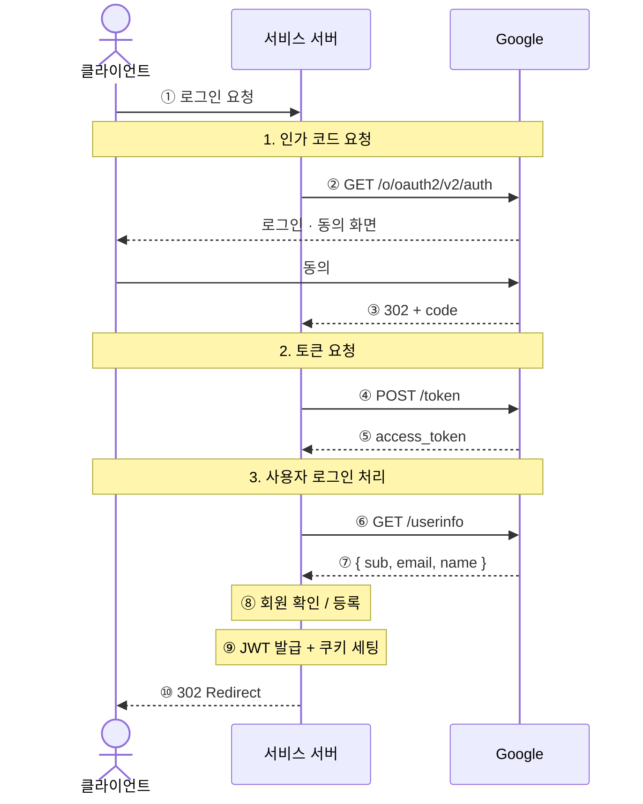
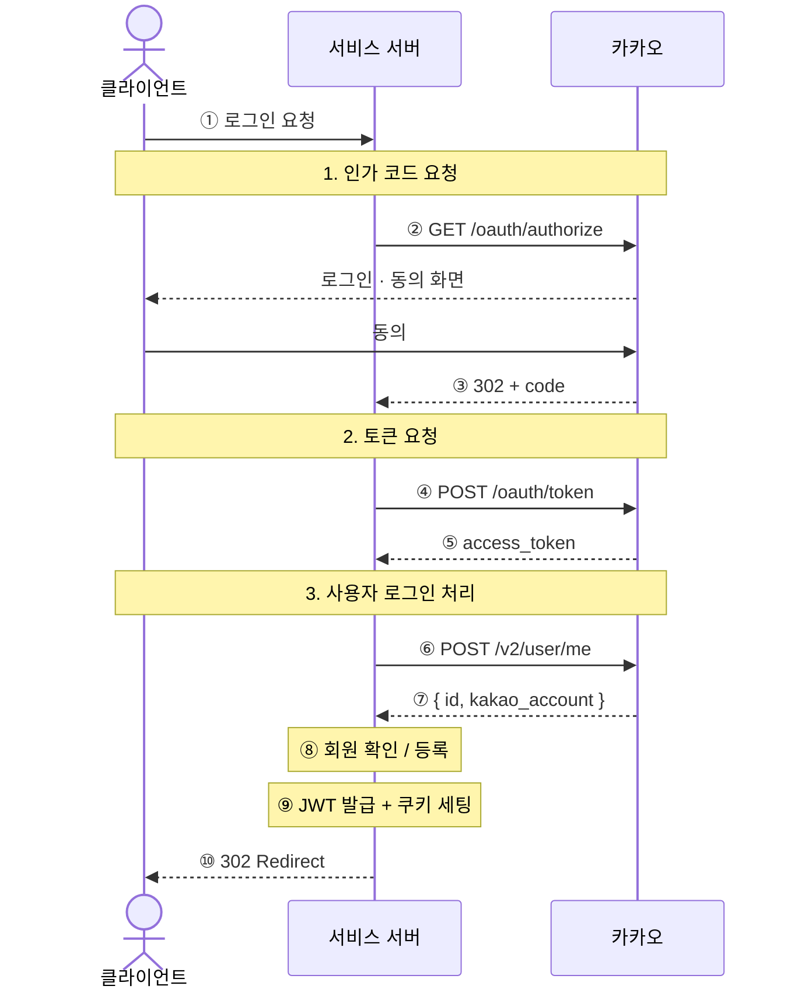
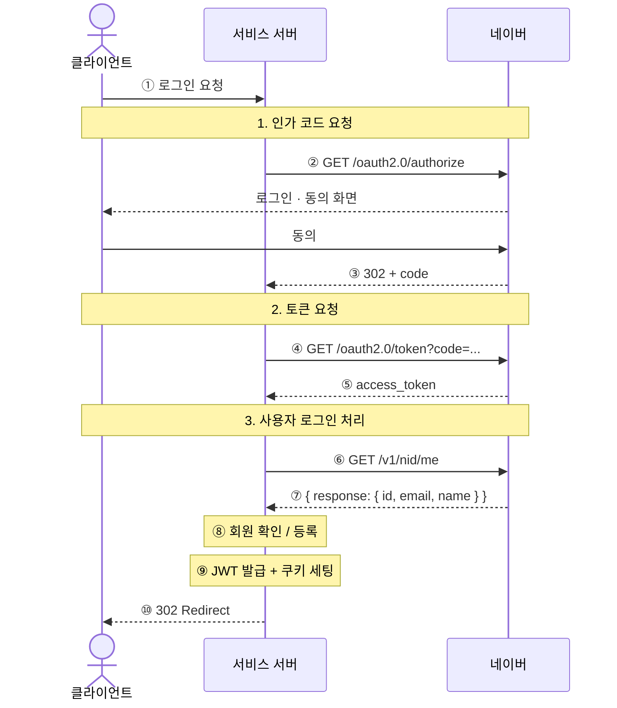

# 31. Social OAuth 라이브러리 사용하지 않고 직접 구현하기

## 1-01. 프로젝트 Clone 하기

```bash
git clone https://github.com/winverse/codeit-fs-Oauth.git

cd frontend 

pnpm install

cd ../backend

pnpm install
```

## 1-02. OAuth 소셜 로그인 — Passport 없이 직접 구현하기

이 프로젝트는 **Passport.js 없이 Google, Kakao, Naver 소셜 로그인**을 직접 구현한 데모입니다.

아래에서는 **Passport.js 방식**과 **직접 구현 방식**의 장단점을 비교하고, 이 프로젝트가 왜 직접 구현을 선택했는지 정리합니다.

# Passport.js

- npm - [https://www.npmjs.com/package/passport](https://www.npmjs.com/package/passport)
- 공식문서 - [https://www.passportjs.org](https://www.passportjs.org/)

## 장점

### 빠른 셋업

`passport-google-oauth20` 같은 Strategy 패키지를 설치하면 OAuth 흐름을 몇 줄로 붙일 수 있습니다.

프로토타입이나 빠른 기능 검증에 유리합니다.

### 100개 이상의 공급자 지원

GitHub, Twitter, Facebook 등 유명 서비스에 대한 Strategy가 공식 또는 커뮤니티 패키지로 존재합니다.

지원 범위가 넓습니다.

### 팀 차원의 친숙함

오랫동안 Node.js 인증의 사실상 표준으로 쓰였기 때문에, 팀원들이 이미 알고 있을 가능성이 높습니다.

온보딩 비용이 낮습니다.

## 단점

### 오래된 라이브러리

Passport는 2011년에 출시되었습니다. 핵심 설계가 Node.js 초창기 관행인 **콜백 패턴**에 기반하고 있어 현대 코드베이스와 이질감이 있습니다.

메인테이너 활동도 점차 줄어드는 추세입니다.

### `done` 콜백과 async/await의 불일치

Strategy의 검증 함수는 Node.js 스타일의 `done` 콜백을 사용합니다.

`async/await` 기반 코드베이스에서는 자연스럽지 않고, 에러를 `done`으로 전달하는 과정에서 실수가 생기기 쉽습니다.

```jsx
(accessToken, refreshToken, profile, done) => {
  try {
    const user = await findUser(profile.id);
    done(null, user);
  } catch (err) {
    done(err); // 빠뜨리면 요청이 그냥 끊겨버림
  }
}
```

### 블랙박스 추상화

Strategy 내부에서 토큰 교환과 프로필 조회가 이루어지므로, 개발자가 작성하는 코드만 보면 OAuth 흐름이 어떻게 동작하는지 알기 어렵습니다.

디버깅이 어려워지고, Authorization Code Flow를 직접 이해하기도 힘들어집니다.

### 세션 중심 설계와 JWT의 충돌

Passport는 세션 기반 인증을 전제로 설계되었습니다.

JWT를 쓰는 프로젝트에서도 `serializeUser`, `deserializeUser`를 정의해야 하거나, 사용하지 않는 세션 계층이 껍데기로 남는 경우가 생깁니다.

### DI 컨테이너와의 궁합 문제

Strategy를 전역으로 등록하는 방식(`passport.use(...)`)은 의존성 주입 컨테이너 패턴과 잘 맞지 않습니다.

Strategy 인스턴스가 전역 상태에 묶이기 때문에 단위 테스트나 라이프사이클 관리가 어려워집니다.

### 국내 공급자의 비공식 Strategy 의존

카카오, 네이버에 대한 공식 Passport Strategy는 없습니다.

커뮤니티가 만든 `passport-kakao`, `passport-naver` 같은 패키지에 의존해야 하며, 공급자 API가 변경되었을 때 대응이 늦으면 소셜 로그인 전체가 깨질 수 있습니다.

---

# 직접 구현

## 장점

### OAuth 흐름이 코드에 그대로 드러난다

Authorization Code Flow의 각 단계가 명시적으로 보입니다.

코드를 읽는 것만으로 OAuth가 어떻게 동작하는지 이해할 수 있습니다.

```
① 사용자 → /api/auth/social/google/login
② 서버 → Google authorize URL로 redirect
③ Google → /api/auth/social/callback/google?code=...
④ 서버 → POST oauth2.googleapis.com/token  (code → access_token 교환)
⑤ 서버 → GET openidconnect.googleapis.com/v1/userinfo  (프로필 조회)
⑥ 서버 → JWT 발급 → 쿠키 세팅 → 클라이언트로 redirect
```

### 외부 의존성이 없다

Node.js 18+의 내장 `fetch`만 사용합니다.

Strategy 패키지, 버전 충돌, 메인테이너 공백 같은 문제가 없습니다.

### DI 컨테이너에 자연스럽게 녹아든다

`SocialAuthService`는 다른 서비스와 동일하게 생성자 주입으로 의존성을 받고 컨테이너에 등록됩니다.

테스트 시 mock 교체도 쉽습니다.

### Provider별 에러를 세밀하게 처리한다

각 공급자의 에러 응답 포맷이 다른데, 직접 구현하면 그에 맞게 정확한 에러 메시지를 꺼낼 수 있습니다.

```jsx
const message =
  payload?.error_description ??  // Google, Naver
  payload?.error ??
  payload?.message ??             // Kakao
  payload?.extras?.detailMsg ??   // Kakao 상세
  rawText ??
  defaultErrorMessage;
```

### 이메일/소셜 로그인의 JWT 흐름이 동일하다

두 경로 모두 같은 `TokenProvider`를 호출하며 끝납니다.

인증 이후 처리 로직이 일관됩니다.

```jsx
// auth.service.js (이메일 로그인)
const tokens = this.#tokenProvider.generateTokens(user);

// social-auth.service.js (소셜 로그인)
const tokens = this.#tokenProvider.generateTokens(user);
```

## 단점

### 구현 코드를 직접 작성해야 한다

토큰 교환, 프로필 조회, 에러 처리, `state` 인코딩/디코딩을 모두 직접 작성해야 합니다.

Passport가 감춰주는 부분까지 개발자가 직접 책임져야 합니다.

### 보안 실수의 여지가 있다

CSRF 방어를 위한 `state` 파라미터 검증, open redirect 방지, 안전한 쿠키 설정 같은 보안 요소를 직접 챙겨야 합니다.

Passport Strategy는 이런 부분을 어느 정도 처리해줍니다.

### 공급자가 늘수록 코드도 늘어난다

새 공급자마다 토큰 교환 로직과 프로필 정규화를 새로 작성해야 합니다.

Passport는 Strategy를 설치하는 것으로 해결할 수 있습니다.

### 커뮤니티 검증이 없다

수많은 프로젝트에서 검증된 Strategy 코드 대신, 팀이 직접 작성한 코드를 사용합니다.

그만큼 엣지 케이스나 보안 취약점을 놓칠 가능성이 있습니다.

---

# 비교 요약

| 항목 | Passport | 직접 구현 |
| --- | --- | --- |
| 초기 설정 속도 | 빠름 | 느림 |
| OAuth 흐름 가시성 | 낮음 (블랙박스) | 높음 |
| 외부 의존성 | Strategy 패키지 필요 | 없음 |
| async/await 친화성 | 낮음 (`done` 콜백) | 높음 |
| DI 컨테이너 친화성 | 낮음 (전역 등록) | 높음 |
| 국내 공급자 안정성 | 비공식 패키지 의존 | 공식 API 직접 호출 |
| 보안 책임 | Strategy가 일부 담당 | 개발자가 직접 담당 |
| 라이브러리 최신성 | 2011년 출시, 성숙 | 해당 없음 |
| 공급자 추가 비용 | 패키지 설치 | 로직 직접 작성 |

---

# 이 프로젝트가 직접 구현을 선택한 이유

이 프로젝트는 다음과 같은 이유로 **직접 구현 방식**을 선택했습니다.

- **OAuth 흐름 자체를 코드로 명확히 드러내는 것**이 이 프로젝트의 학습 목적에 더 잘 맞는다. ⭐️⭐️⭐️
- **JWT + HttpOnly 쿠키 기반 인증**을 사용하기 때문에 Passport의 세션 중심 설계가 불필요한 복잡성을 만든다.
- **Awilix DI 컨테이너**를 사용하므로 Passport의 전역 Strategy 등록 방식과 잘 맞지 않는다.
- **카카오, 네이버를 지원해야 하는데 공식 Strategy가 없다.**

---

# 마무리

Passport가 나쁜 도구라는 뜻은 아닙니다.

빠른 프로토타이핑이 필요하거나, 다양한 공급자를 한 번에 지원해야 하거나, 팀이 이미 Passport에 익숙한 경우라면 여전히 좋은 선택입니다.

다만 **이 프로젝트의 맥락에서는 직접 구현이 더 자연스러운 선택**이었습니다.

## 1-03. Google OAuth  Client ID 발급받기

**디자인 가이드**

- [https://developers.google.com/identity/branding-guidelines?hl=ko](https://developers.google.com/identity/branding-guidelines?hl=ko)

## **gcp 검색하기**


## **프로젝트 생성하기**


현재 선택된 프로젝트가 방금 만든 프로젝트와 동일한지 확인하세요

1. OAuth 동의화면 구성하기


- 외부로 설정해주셔야 합니다


## **접근할 고객 정보를 지정합니다**


필터를 이용해서 `email` , `profile` , `openid` 를 검색하여 정보 3가지를 선택합니다. 

이후 업데이트 버튼을 선택합니다.

## **클라이언트 ID 만들기**


1. Secret Key 구하기


## 1-04. 코드와 함께 보는 흐름도

# Social Login Flows

이 문서는 **현재 코드 기준의 Google, Kakao, Naver 로그인 흐름**을 provider별로 정리한 것입니다.

다이어그램의 번호는 아래 **코드 연결** 표에서 실제 파일과 코드를 가리킵니다.

## 기준 파일

- `backend/src/controllers/auth/social.controller.js`
- `backend/src/services/social-auth.service.js`
- `backend/src/repository/user.repository.js`
- `backend/src/providers/token.provider.js`
- `backend/src/providers/cookie.provider.js`

---

# Google



## 코드 연결

| # | 내용 | 코드 |
| --- | --- | --- |
| ① | `GET /api/auth/social/google/login?next=/` 수신 | `social.controller.js` → `socialRedirect()` |
| ② | `accounts.google.com/o/oauth2/v2/auth` URL 빌드 후 redirect | `social.controller.js` → `socialLoginLinkGenerator.google` → `res.redirect(loginUrl)` |
| ③ | `GET /api/auth/social/callback/google?code=...&state=...` 수신 | `social.controller.js` → `socialCallback()` → `req.query.code`, `req.query.state` |
| ④ | `POST https://oauth2.googleapis.com/token` — code → access_token 교환 | `social-auth.service.js` → `#getGoogleProfile()` → `#requestSocialJson('https://oauth2.googleapis.com/token', ...)` |
| ⑤ | `tokenResponse.access_token` 추출 | `social-auth.service.js` → `#getGoogleProfile()` → `tokenResponse.access_token` |
| ⑥ | `GET https://openidconnect.googleapis.com/v1/userinfo` — 프로필 조회 | `social-auth.service.js` → `#getGoogleProfile()` → `#requestSocialJson('https://openidconnect.googleapis.com/v1/userinfo', ...)` |
| ⑦ | `{ id: sub, email, name }` 형태로 정규화 | `social-auth.service.js` → `#getGoogleProfile()` 반환값 |
| ⑧ | 소셜 계정 조회 → 이메일 조회 → 생성 또는 연결 (3분기) | `social-auth.service.js` → `#resolveUser()` |
| ⑨ | JWT 생성 후 HttpOnly 쿠키로 전달 | `social-auth.service.js` → `tokenProvider.generateTokens(user)` / `social.controller.js` → `cookieProvider.setAuthCookies(res, tokens)` |
| ⑩ | state 디코딩 → next 경로 검증 → 클라이언트로 redirect | `social.controller.js` → `#decodeState()` → `#normalizeNextPath()` → `res.redirect(redirectUrl)` |

---

# Kakao



## 코드 연결

| # | 내용 | 코드 |
| --- | --- | --- |
| ① | `GET /api/auth/social/kakao/login?next=/` 수신 | `social.controller.js` → `socialRedirect()` |
| ② | `kauth.kakao.com/oauth/authorize` URL 빌드 후 redirect | `social.controller.js` → `socialLoginLinkGenerator.kakao` → `res.redirect(loginUrl)` |
| ③ | `GET /api/auth/social/callback/kakao?code=...&state=...` 수신 | `social.controller.js` → `socialCallback()` → `req.query.code`, `req.query.state` |
| ④ | `POST https://kauth.kakao.com/oauth/token` — code → access_token 교환 | `social-auth.service.js` → `#getKakaoProfile()` → `#requestSocialJson('https://kauth.kakao.com/oauth/token', ...)` |
| ⑤ | `tokenResponse.access_token` 추출 | `social-auth.service.js` → `#getKakaoProfile()` → `tokenResponse.access_token` |
| ⑥ | `POST https://kapi.kakao.com/v2/user/me` — 사용자 정보 조회 | `social-auth.service.js` → `#getKakaoProfile()` → `#requestSocialJson('https://kapi.kakao.com/v2/user/me', ...)` |
| ⑦ | `{ id, email: kakao_account?.email, name: nickname }` 형태로 정규화. nickname은 `kakao_account.profile.nickname` → `properties.nickname` 순으로 fallback | `social-auth.service.js` → `#getKakaoProfile()` 반환값 |
| ⑧ | 소셜 계정 조회 → 이메일 조회 → 생성 또는 연결 (3분기) | `social-auth.service.js` → `#resolveUser()` |
| ⑨ | JWT 생성 후 HttpOnly 쿠키로 전달 | `social-auth.service.js` → `tokenProvider.generateTokens(user)` / `social.controller.js` → `cookieProvider.setAuthCookies(res, tokens)` |
| ⑩ | state 디코딩 → next 경로 검증 → 클라이언트로 redirect | `social.controller.js` → `#decodeState()` → `#normalizeNextPath()` → `res.redirect(redirectUrl)` |

---

# Naver



## 코드 연결

| # | 내용 | 코드 |
| --- | --- | --- |
| ① | `GET /api/auth/social/naver/login?next=/` 수신 | `social.controller.js` → `socialRedirect()` |
| ② | `nid.naver.com/oauth2.0/authorize` URL 빌드 후 redirect | `social.controller.js` → `socialLoginLinkGenerator.naver` → `res.redirect(loginUrl)` |
| ③ | `GET /api/auth/social/callback/naver?code=...&state=...` 수신 | `social.controller.js` → `socialCallback()` → `req.query.code`, `req.query.state` |
| ④ | `GET https://nid.naver.com/oauth2.0/token?${tokenQuery}` — Kakao·Google과 달리 **GET 쿼리 파라미터 방식** | `social-auth.service.js` → `#getNaverProfile()` → `#requestSocialJson('https://nid.naver.com/oauth2.0/token?...', ...)` |
| ⑤ | `tokenResponse.access_token` 추출 | `social-auth.service.js` → `#getNaverProfile()` → `tokenResponse.access_token` |
| ⑥ | `GET https://openapi.naver.com/v1/nid/me` — 사용자 정보 조회 | `social-auth.service.js` → `#getNaverProfile()` → `#requestSocialJson('https://openapi.naver.com/v1/nid/me', ...)` |
| ⑦ | `payload.response`로 한 겹 감싼 구조에서 `{ id, email, name }` 추출. name은 `name` → `nickname` → `email` 순으로 fallback | `social-auth.service.js` → `#getNaverProfile()` → `profilePayload.response` |
| ⑧ | 소셜 계정 조회 → 이메일 조회 → 생성 또는 연결 (3분기) | `social-auth.service.js` → `#resolveUser()` |
| ⑨ | JWT 생성 후 HttpOnly 쿠키로 전달 | `social-auth.service.js` → `tokenProvider.generateTokens(user)` / `social.controller.js` → `cookieProvider.setAuthCookies(res, tokens)` |
| ⑩ | state 디코딩 → next 경로 검증 → 클라이언트로 redirect | `social.controller.js` → `#decodeState()` → `#normalizeNextPath()` → `res.redirect(redirectUrl)` |

---

# ⑧ `#resolveUser()` 3분기 상세

세 provider 모두 동일한 로직을 사용합니다.

위치는 `social-auth.service.js` → `#resolveUser()` 입니다.

```
소셜 계정(provider + providerId)으로 유저 조회
    │
    ├─ 있음 → ① 이름이 없으면 업데이트 후 반환
    │
    └─ 없음 → 이메일로 유저 조회
                  │
                  ├─ 없음 → ② createWithSocialAccount() — 새 유저 + 소셜 계정 생성
                  │
                  └─ 있음 → ③ connectSocialAccount() — 기존 유저에 소셜 계정 연결
```

> 이메일 미제공 시(예: 카카오 이메일 미동의) `provider_socialId@social.local` 형태의 가상 이메일을 생성합니다.
> 
> 
> 위치: `social-auth.service.js` → `#resolveEmail()`
> 

원하면 제가 이걸 이어서 **더 예쁜 노션용 버전**으로,

즉 **토글 구조 + 핵심 요약 + 주의 포인트** 형태로 다시 정리해드릴게요.

## 1-05. Kakao OAuth  Client ID 발급받기

**공식문서**

- [https://developers.kakao.com/docs/latest/ko/kakaologin/rest-api](https://developers.kakao.com/docs/latest/ko/kakaologin/rest-api)

**디자인 가이드**

- [https://developers.kakao.com/docs/latest/ko/kakaologin/design-guide](https://developers.kakao.com/docs/latest/ko/kakaologin/design-guide)

## **Kakao developers 검색하기**


## 로그인하기


## 앱 생성하기


## 앱 정보 기입하기

- 이미지는 아무거나 사용하셔도 좋습니다 (아래는 예시)


## 카카오 로그인 사용 설정하기


## 저장하기


## 개인 정보 가져오기 설정


## 1-06. Naver OAuth Client ID 발급받기

**공식문서**

- [https://developers.naver.com/docs/login/devguide/devguide.md](https://developers.naver.com/docs/login/devguide/devguide.md)

**로그인 버튼 디자인 문서**

- [https://developers.naver.com/docs/login/bi/bi.md](https://developers.naver.com/docs/login/bi/bi.md)

## naver developer 검색하기


## 주의사항

- 네이버 설정에 보면 필요시에 연락할 수 있도록 별도의 이메일을 따로 적도록 되어있습니다.(네이버 계정이 아닐 수 있는)
- 따라서 네이버API 에서 응답하는 이메일 주소가 반드시 유저의 이메일이라고 생각하시면 안됩니다.


