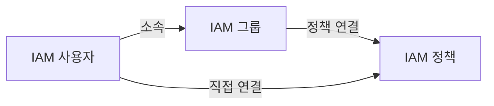
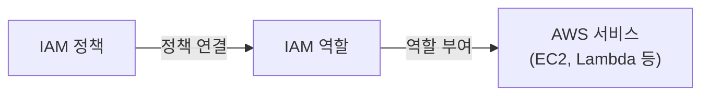
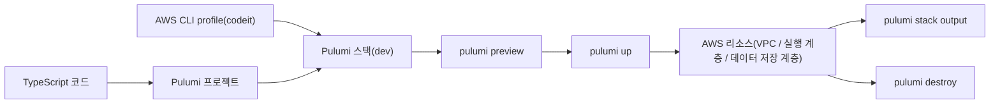

# 36. 클라우드와 AWS 기본기

# 제 1장: AWS 배경지식 이해하기: Region, AZ, 고가용성, 내결함성, 신뢰성 **⭐️⭐️⭐️⭐️**

## **1-01. 개요**

### 학습 방향

이 장은 AWS가 무엇인지부터 시작해, 그 위의 자원을 어떤 기준으로 배치하고 운영할 것인지까지 이어서 정리합니다. AWS를 처음 학습할 때 가장 자주 막히는 지점은 서비스 이름이 많다는 사실 자체가 아니라, 자원을 어디를 기준으로 배치해야 하는지, 장애를 줄이기 위해 무엇을 나누어 봐야 하는지, AWS가 대신 맡는 일과 사용자가 책임질 일을 어떻게 구분해야 하는지가 먼저 정리되지 않는다는 데 있습니다.

따라서 이 장에서는 먼저 AWS와 서비스 이름을 읽는 기본 감각을 잡고, 그다음 실습에 필요한 최소 안전장치와 클라우드 운영의 공통 배경지식을 차례대로 정리합니다. 계정과 MFA, 리전 기준선을 먼저 고정한 뒤, 배치 기준, 책임 경계, 안정성 관련 개념을 같은 흐름으로 연결합니다.

| 항목 | 내용 |
| --- | --- |
| 학습 목표 | AWS가 어떤 플랫폼인지 먼저 이해하고, 뒤 실습에 공통으로 적용되는 보안 기준과 클라우드 운영의 공통 문법을 정리합니다. |
| 핵심 키워드 | AWS, 클라우드 플랫폼, 루트 사용자와 작업용 사용자, MFA, 리전 기준선, 리소스 배치 단위, 공유 책임 모델, 안정성 용어 |
| 학습 흐름 | AWS 입문하기 -> 계정과 MFA 정리 -> 온프레미스와 클라우드 비교 -> 서비스 모델과 관리형 서비스 -> 리소스 배치 기준(Region/AZ/Edge Location) -> 공유 책임 모델 -> 안정성 용어 -> 확장성과 BCP |

## **1-02. AWS 입문하기**

AWS를 처음 접할 때는 서비스 이름을 외우기보다, AWS라는 이름이 무엇을 가리키는지부터 먼저 이해할 필요가 있습니다. AWS는 아마존이 제공하는 클라우드 플랫폼으로, 서버, 스토리지, 데이터베이스, 네트워크 같은 인프라 자원을 온라인 서비스 형태로 제공합니다. 이 장에서 계속 등장할 Region, 서비스 모델, 공유 책임 같은 용어도 모두 이 플랫폼을 전제로 설명됩니다.

### AWS란 무엇인가?

AWS는 Amazon Web Services의 약자입니다. 물리 서버를 직접 구매하고 설치하지 않아도, 웹 콘솔이나 API를 통해 필요한 인프라를 생성하고 운영할 수 있게 해 주는 클라우드 서비스 모음입니다. 가상 서버, 객체 스토리지, 관계형 데이터베이스, 네트워크, 분석, 머신러닝처럼 폭넓은 서비스를 제공하는 이유도 이 플랫폼이 단일 제품이 아니라 여러 서비스를 조합해 쓰는 구조이기 때문입니다.

따라서 AWS는 특정 제품 이름이라기보다, 인프라 운영에 필요한 기능을 서비스 단위로 나누어 제공하는 플랫폼으로 이해하는 편이 정확합니다. 사용자는 그중 필요한 서비스를 선택해 시스템을 구성하고, 서비스 조합에 따라 운영 구조를 바꾸게 됩니다.

### AWS는 어떻게 탄생했고 왜 많은 사람이 사용하는가?

AWS의 출발점은 아마존 내부의 인프라 운영 경험이었습니다. 아마존은 전자상거래 서비스를 운영하면서 급격히 늘어나는 트래픽과 주문량을 처리하기 위해 서버, 스토리지, 네트워크 장비를 대규모로 직접 운영해야 했습니다. 이 과정에서 필요한 자원을 더 빠르게 준비하고 반복해서 재사용할 수 있는 공통 인프라의 필요성이 커졌습니다.

당시 많은 기업은 자체 데이터센터를 구축해 서비스를 운영했기 때문에, 서버를 추가로 확보하고 설치하는 데 시간과 비용이 많이 들었습니다. AWS는 이런 한계를 줄이기 위해 필요한 자원을 필요한 만큼만 사용하고 비용을 지불하는 종량 과금 모델과 빠른 확장 구조를 제공했습니다. 2006년 Amazon S3와 Amazon EC2가 공개된 이후, AWS는 관리형 서비스와 글로벌 인프라를 계속 확장하며 널리 사용하는 클라우드 플랫폼으로 자리 잡았습니다.

## **1-03. #실습 계정 생성, MFA, 리전 고정**

### 회원 가입과 루트 사용자

AWS를 사용하려면 먼저 계정을 만들어야 합니다. 신규 계정에는 일정 범위의 프리 티어가 제공되지만, 프리 티어는 모든 서비스를 무제한으로 무료 제공하는 제도가 아니라 서비스별 사용량과 기간이 정해진 학습용 혜택에 가깝습니다. 따라서 계정 생성 직후부터 비용과 보안을 함께 관리하는 습관이 필요합니다.

회원 가입 흐름은 길지 않지만, 결제 정보 등록, 본인 확인, 지원 플랜 선택처럼 뒤에서 다시 되돌아보기 번거로운 항목이 연속으로 등장합니다. 이 과정을 한 번에 정리해 두면 이후 실습에서 계정 설정 때문에 흐름이 끊기지 않으므로, 아래 순서대로 가입과 초기 보안 설정을 마무리하면 됩니다.

준비물: 해외 결제 가능한 카드 (회원가입 과정에서 100원 결제, 이후 반환됨)

[https://aws.amazon.com/ko/console](https://aws.amazon.com/ko/console/) 에 접속하여 AWS 회원 가입을 진행합니다.

#### #실습 회원가입 하기


루트 사용자의 이메일을 입력하고, 사용할 AWS 계정 이름을 입력합니다. 이후 입력한 `Verify email address` 버튼을 클릭 합니다.


입력한 이메일의 받은 편지함을 보시면 위와 같은 확인 코드를 받을 수 있습니다.


확인 코드를 입력해주세요


사용자의 암호를 입력 해줍니다.


AWS의 플랜에 따른 지원을 받기 위해서 무료(free tier)를 선택합니다. 이를 통해서 AWS에서 발생하는 과금 요소를 줄이고 최소한의 비용으로 AWS를 실습하는 환경을 구성할 수 있습니다.


한국의 국가 코드는 `+82` 입니다.


이후 결제 정보를 입력합니다. AWS 사용으로 발생한 이용료는 등록한 결제 정보의 카드를 통해 결제 됩니다. 카드 정보를 입력하여 AWS에서 결제 가능한 카드인지 확인합니다. 결제 가능한 여부를 확인하기 위해서 카드에서 100원이 출금 되지만, 곧 반환됩니다.


자격증명을 확인합니다. 휴대번호를 입력하고 SMS 전송 버튼을 클릭합니다.

입력한 휴대전화 번호로 문자를 통해 코드를 확인하시고 코드를 입력하신 뒤에 `계속` 버튼을 눌러 다음을 진행합니다


회원가입이 완료가 되면 `AWS Management Console` 로 이동하기 버튼을 클릭합니다.


마지막 그림은 루트 사용자 로그인 선택 화면과 실제 콘솔 홈 화면을 함께 보여 줍니다. 

회원 가입이 끝나면 가장 먼저 확인해야 할 대상은 루트 사용자입니다. 루트 사용자는 계정 생성과 함께 만들어지는 최상위 주체로, 결제 정보 관리와 계정 해지 같은 작업까지 수행할 수 있습니다. 권한이 가장 강한 대신 노출되었을 때 피해 범위도 가장 넓기 때문에, 일상적인 실습과 운영에는 사용하지 않는 것이 원칙입니다.

실습 환경에서는 먼저 루트 사용자로 계정 활성화와 초기 보안 설정만 마치는 흐름이 적절합니다. 이 단계에서는 루트 사용자에 MFA를 적용해 비밀번호만으로 로그인되지 않도록 만드는 것까지 정리하면 충분합니다. 이후 실제 작업을 수행할 별도 사용자와 권한 분리 방식은 IAM 장에서 차례대로 다룹니다. 또한 리전은 초반에 하나로 고정해 두어야 리소스 위치와 비용 조회가 분산되지 않습니다. 이후 실습은 서울 리전인 `ap-northeast-2`를 기준으로 진행합니다.

### MFA와 기본 리전 기준선

MFA는 Multi-Factor Authentication, 즉 다중 인증을 뜻합니다. 비밀번호만으로 로그인시키지 않고, 인증 앱이 생성하는 일회용 코드나 보안 키처럼 다른 인증 요소를 한 번 더 확인하는 방식입니다. 같은 암호가 노출되더라도 이 추가 인증 수단이 없으면 로그인되지 않으므로, 단일 비밀번호에만 의존하는 계정보다 탈취 위험을 더 낮출 수 있습니다.

AWS 계정에서 MFA가 특히 중요한 이유는 로그인 자체가 곧 리소스 생성, 권한 변경, 비용 발생으로 이어질 수 있기 때문입니다. 특히 루트 사용자는 결제 정보와 계정 수준 설정까지 다룰 수 있으므로, 비밀번호 하나만으로 보호하는 구조는 위험이 너무 큽니다. 따라서 MFA는 나중에 붙이는 선택 기능이 아니라, 실습을 시작하기 전에 먼저 고정해야 하는 기본 안전장치입니다.

#### #실습 루트 유저 로그인 및 MFA 이용하기

[https://aws.amazon.com/ko/](https://aws.amazon.com/ko/)

[로그아웃 이후 진행]


루트 유저 로그인


다 진행을 해줍니다


MFA device name에 `codeit`을 작성하시고 `Authenticator app` 를 클릭 하고 Next 버튼을 클릭합니다.

#### Microsoft Authenticator 설치하기

IOS


Android


핸드폰에 Microsoft에서 만든 Authenticator APP을 설치합니다.

`microsoft authenticator` 라고 스토어에 검색하시면 설치하실 수 있습니다

설치가 끝났으면 어플을 열어주세요.


`Show QR code` 버튼을 누르시고 캡쳐를 해주세요


홈화면에 새로 생긴 AWS 관련 UI가 있을텐데 누르시면 아래와 같은 번호가 나옵니다.


핸드폰에 나와 있는 숫자를 올바르게 입력해주고 `Register MFA` 버튼을 누르시면 됩니다.


#### #실습 기본 리전 정하기


우측 상단에 유럽(혹은 다른 지역일 수 있음) 클릭하여, 메뉴 UI가 나타나도록 합니다.


서울 리전을 선택하시면 


아시아 태평양 (서울) 로 변경되는 걸 확인할 수 있습니다.

| 항목 | 의미 | 기본 원칙 |
| --- | --- | --- |
| 루트 사용자 | 계정 소유자, 결제와 계정 수준 설정 담당 | 초기 설정 외에는 사용하지 않음 |
| MFA | 비밀번호 외에 추가 인증 수단을 요구하는 보호 장치 | 루트 사용자에 우선 적용 |
| 기본 리전 | 실습에서 자원을 생성하고 조회하는 기준 위치 | `ap-northeast-2`로 통일 |

## **1-04. 온프레미스와 클라우드**

### 온프레미스

온프레미스는 기업이나 조직이 서버, 스토리지, 네트워크 장비를 직접 구매하고 자체 전산실이나 데이터센터 안에서 운영하는 방식입니다. 이 구조에서는 장비 선택과 통제 범위가 넓지만, 구축에 시간이 오래 걸리고 용량을 잘못 예측하면 과잉 투자나 자원 부족이 쉽게 발생합니다. 즉, 인프라에 대한 통제력은 높지만 유연성은 상대적으로 낮습니다.

온프레미스 구조를 이해하려면 이용자 수가 늘어날 때 확장 비용과 시간이 함께 커진다는 점부터 볼 필요가 있습니다. 아래 그림은 서버를 직접 추가해야 하는 구조 때문에 비용과 시간이 함께 증가하는 흐름을 보여 줍니다.


같은 맥락에서 온프레미스는 서비스만 운영하는 구조가 아니라, 회사 바깥의 데이터센터와 그 안의 서버, 스토리지, 네트워크 장비까지 직접 준비하고 관리하는 구조라는 점도 함께 이해해야 합니다. 즉, 애플리케이션을 배포하기 전에 먼저 인프라 시설과 장비 구성을 갖추어야 한다는 뜻입니다.


### 클라우드

클라우드는 이런 구조를 서비스 형태로 바꾼 운영 모델입니다. 물리 장비는 클라우드 제공자가 관리하고, 사용자는 콘솔이나 API를 통해 필요한 자원을 생성한 뒤 사용량 기준으로 비용을 지불합니다. 서버를 소유하는 대신 사용할 권한을 필요할 때 확보하는 구조이므로, 초기 투자 부담이 줄고 확장과 축소도 더 빠르게 이루어집니다.

온프레미스의 장비를 통째로 보유하던 방식이 클라우드에서는 가상 자원 사용 구조로 바뀐다는 점은 아래 그림에서 더 분명하게 드러납니다. 물리 장비를 직접 설치하지 않고도 서버와 저장소를 가상 자원 형태로 확보한다는 점이 핵심입니다.


실제 기업 환경에서는 모든 시스템을 한 번에 클라우드로 옮기지 못하는 경우도 많습니다. 그래서 일부 저장소나 내부 시스템은 온프레미스에 남기고, 새로운 애플리케이션 서버나 확장 구간만 클라우드에 두는 하이브리드 클라우드 구조도 자주 사용됩니다.


### 과금과 운영 차이

이 구조 차이와 직결되는 것이 과금 방식입니다. 온프레미스에서는 서버를 구매하는 순간 비용이 고정되고, 이후 실제 사용량과 무관하게 동일한 비용이 계속 발생합니다. 클라우드는 사용한 만큼 지불하는(pay-as-you-go) 구조를 기본으로 합니다. 예를 들어 가상 서버를 한 시간 켜 두면 한 시간치 비용이 발생하고, 꺼 두면 그 시간에는 비용이 발생하지 않습니다.

이 구조에는 장점과 단점이 동시에 있습니다. 초기 투자 없이 바로 시작할 수 있고, 사용하지 않는 자원의 비용을 직접 통제할 수 있다는 점이 장점입니다. 반면 자원을 끄거나 삭제하는 것을 잊으면 의도하지 않은 비용이 계속 누적됩니다. 따라서 클라우드를 처음 배울 때부터 “실습 후 반드시 삭제”하는 습관이 중요하며, AWS 결제 알림을 미리 설정해 두면 예상 밖 비용 발생을 빨리 감지할 수 있습니다.

| 항목 | 온프레미스 | 클라우드 |
| --- | --- | --- |
| 비용 발생 방식 | 장비 구매 시점에 선 지불, 이후 감가상각 | 실제 사용량 기준으로 후 지불 |
| 초기 투자 | 높음 (서버, 라이선스, 설치 비용) | 낮음 (소규모로 바로 시작 가능) |
| 유연성 | 구매한 용량 이상으로 즉시 확장 어려움 | 필요에 따라 즉시 늘리거나 줄임 |
| 주요 위험 | 용량 과잉 구매 또는 부족 예측 실패 | 사용하지 않는 자원을 켜 둔 채 방치 |

## **1-05. 클라우드 서비스 모델과 관리형 서비스**

### IaaS, PaaS, SaaS

클라우드 서비스는 보통 IaaS(Infrastructure as a Service), PaaS(Platform as a Service), SaaS(Software as a Service) 세 수준으로 나누어 설명합니다. 이 구분은 난이도 분류가 아니라, 사용자가 어디까지 직접 관리하고 어디부터는 서비스 제공자에게 맡기는지를 보여 주는 기준입니다. 즉, 같은 클라우드라도 책임 경계는 서비스 모델마다 달라집니다.

IaaS는 인프라 자체를 가상화해서 제공하는 방식입니다. 사용자는 가상 서버, 네트워크, 스토리지를 만들 수 있지만 운영체제와 애플리케이션 구성은 직접 책임집니다. 가상 서버 서비스가 대표적인 예입니다. PaaS는 애플리케이션 실행에 필요한 많은 운영 요소를 서비스가 대신 맡아 주는 구조이며, 관리형 데이터베이스 서비스가 여기에 가깝습니다. SaaS는 사용자가 완성된 소프트웨어를 그대로 사용하는 모델입니다.

| 모델 | 사용자가 주로 관리하는 영역 | AWS 예시 |
| --- | --- | --- |
| IaaS | 운영체제, 애플리케이션, 일부 보안 설정 | Amazon EC2, Amazon VPC |
| PaaS | 애플리케이션, 데이터 구조, 서비스 설정 | Amazon RDS, AWS Lambda |
| SaaS | 사용자 계정과 업무 데이터 활용 | Amazon QuickSight, Amazon WorkMail |

### 관리형 서비스의 책임 경계

AWS를 학습할 때 중요한 것은 관리형 서비스의 편의성과 한계를 동시에 보는 일입니다. 관리형 서비스는 패치, 백업, 확장, 장애 대응의 일부를 줄여 주지만, 운영 책임이 완전히 사라지는 것은 아닙니다. 오히려 사용자는 서비스 선택, 권한, 네트워크, 비용, 데이터 보존 정책을 더 명확히 판단해야 합니다.

## **1-06. Region, AZ, Edge Location ⭐️⭐️⭐️⭐️⭐️**

Region은 AWS 서비스가 제공되는 물리적 지역 단위입니다. 일반적으로 국가나 대도시 권역 수준으로 구분되며, 서울 리전처럼 고유한 이름과 코드로 식별됩니다. Availability Zone은 같은 Region 안에 있는 개별 데이터센터 묶음으로, 전력, 네트워크, 물리 보안 측면에서 서로 독립적으로 운영됩니다. Edge Location은 사용자와 오리진 서버 사이에서 콘텐츠를 캐시하고 더 빠르게 전달하는 거점입니다.

세 용어는 모두 위치와 관련되지만 역할은 다릅니다. Region은 서비스를 배치하는 가장 바깥 권역이고, Availability Zone은 그 안에서 장애 범위를 나누는 시설 단위입니다. Edge Location은 원본 서비스를 두는 장소가 아니라, 사용자에게 더 가까운 위치에서 콘텐츠 전송을 가속하는 계층입니다.

### Region

Region은 AWS가 서비스를 제공하는 지리적 권역입니다. 서울 리전, 도쿄 리전, 프랑크푸르트 리전처럼 물리적으로 떨어진 권역이 서로 다른 리전이 됩니다. 리전이 달라지면 단순히 사용자와의 거리만 바뀌는 것이 아니라, 데이터가 저장되는 위치와 일부 서비스의 제공 여부, 과금 구조도 함께 달라집니다.

그래서 리전 선택은 “가까운 곳이면 된다” 정도로 끝나지 않습니다. 한국 사용자가 주 대상이면 서울 리전이 일반적으로 유리하지만, 더 넓은 지역 사용자를 함께 고려하거나 대규모 장애에 대비해야 할 때는 다른 리전을 함께 검토할 수도 있습니다. 즉 리전은 성능 기준이면서 동시에 데이터 위치와 서비스 운영 범위를 정하는 출발점입니다.

다음 그림은 AWS가 전 세계 여러 권역에 리전을 나누어 두고 있다는 점을 보여 줍니다. 리전이 단순한 논리 이름이 아니라, 실제로 분리된 지리적 배치 단위라는 점을 함께 확인할 수 있습니다.


여기서는 “서비스를 어느 지역에 둘 것인가”가 첫 번째 설계 결정으로 작동합니다. 이후 AZ와 Edge Location은 이 리전 선택 위에서 세부 배치와 전달 방식을 나누는 개념입니다.

### Availability Zone

Availability Zone, 즉 AZ는 같은 리전 안에 존재하는 독립된 데이터센터 묶음입니다. 하나의 리전이 하나의 건물이라고 생각하면 오해가 생기는데, 실제로는 같은 리전 안에도 전력, 네트워크, 물리 시설이 분리된 여러 AZ가 존재합니다. 서울 리전에서 `ap-northeast-2a`, `ap-northeast-2c`처럼 알파벳이 붙는 이유가 여기에 있습니다.

AZ가 중요한 이유는 장애 범위가 여기서 갈라지기 때문입니다. 서버와 데이터베이스를 하나의 AZ에만 두면 그 시설 장애가 곧 서비스 중단으로 이어질 수 있습니다. 반대로 웹 서버와 데이터베이스를 여러 AZ에 나누어 배치하면 특정 시설에 문제가 생겨도 다른 AZ가 계속 동작할 수 있으므로, 고가용성과 장애 분산의 기본 단위가 됩니다.

다음 그림은 같은 서울 리전 안에서도 AZ가 여러 개로 나뉘어 있다는 점을 보여 줍니다. 리전을 먼저 정한 뒤, 그 안에서 실제 자원을 어떻게 분산할 것인지가 AZ 설계라는 뜻입니다.


즉 리전을 하나 선택했다고 해서 자동으로 신뢰성이 확보되는 것은 아닙니다. 같은 리전 안에서도 여러 AZ에 자원을 분산해야 장애 범위를 줄일 수 있고, 그래서 AZ는 리전보다 더 안쪽의 배치 전략 단위로 이해해야 합니다.

### Edge Location

Edge Location은 리전처럼 원본 시스템을 운영하는 곳이 아니라, 사용자에게 더 가까운 위치에서 콘텐츠를 전달하기 위한 캐시와 전송 거점입니다. 이미지, CSS, JavaScript, 동영상 조각처럼 자주 반복해서 요청되는 콘텐츠를 원본 리전에서만 계속 내려 주면, 먼 지역 사용자는 물리적 거리만큼 응답 지연을 그대로 감수해야 합니다.

이때 CDN이 Edge Location에 콘텐츠를 캐시해 두면, 사용자는 먼 리전까지 매번 왕복하지 않고 가까운 거점에서 더 빠르게 응답을 받을 수 있습니다. 따라서 Edge Location은 AZ를 대체하는 개념이 아니라, 원본 인프라 앞단에서 전송 성능을 개선하는 계층입니다. 대표적인 콘텐츠 전송 서비스를 볼 때도 이 차이를 먼저 이해해야 “원본 서비스는 리전에 있고, 전달 최적화는 에지에서 일어난다”는 구조가 분명해집니다.

마지막 그림은 CDN과 Edge Location이 원본 리전 앞단에서 어떤 식으로 전달을 가속하는지 보여 줍니다. 이 구조를 보면, Edge Location은 실행 계층이나 데이터 저장 계층이 놓이는 장소가 아니라 사용자와 원본 사이에서 콘텐츠 전달을 최적화하는 거점이라는 점이 분명해집니다.


결국 Region과 AZ는 원본 서비스를 어디에 배치하고 어떻게 분리할지를 설명하는 계층이고, Edge Location은 그 서비스를 사용자에게 얼마나 빠르게 전달할지를 설명하는 계층입니다. 그래서 Multi-AZ는 장애 대응 전략이고, Edge 캐시는 전송 성능 최적화 전략입니다. 둘 다 중요하지만 해결하는 문제가 다르기 때문에 같은 수준의 기능으로 섞어 이해하면 안 됩니다.

| 개념 | 무엇을 구분하는가 | 대표 판단 질문 | 자주 생기는 오해 |
| --- | --- | --- | --- |
| Region | 지리적 권역과 데이터 배치 범위 | 원본 서비스를 어느 지역에 둘 것인가 | AZ와 같은 수준의 장애 분산 단위라고 생각하기 쉽다 |
| Availability Zone | 같은 리전 안의 독립된 시설 단위 | 같은 리전 안에서 어떻게 이중화할 것인가 | 리전 하나를 선택하면 고가용성까지 자동으로 확보된다고 생각하기 쉽다 |
| Edge Location | 사용자 가까이의 캐시/전송 거점 | 정적 콘텐츠를 어떻게 더 빠르게 전달할 것인가 | 원본 실행 계층이나 데이터 저장 계층이 실제로 놓이는 위치라고 생각하기 쉽다 |

## **1-07. 공유 책임 모델**

### 책임 경계의 기본 원리

AWS는 공유 책임 모델(shared responsibility model)을 전제로 동작합니다. AWS와 고객이 같은 시스템을 함께 운영하되, 책임 범위가 서로 다르다는 뜻이며, 클라우드로 전환한다고 해서 책임 자체가 사라지는 것은 아닙니다. 다시 말해 클라우드는 책임을 없애는 구조가 아니라, 책임의 위치를 다시 나누는 구조입니다.

AWS는 흔히 `security of the cloud`, 즉 클라우드 자체의 보안을 책임진다고 설명합니다. 데이터센터, 물리 서버, 네트워크 장비, 글로벌 인프라처럼 사용자가 직접 손댈 수 없는 기반 시설이 여기에 해당합니다. 반면 사용자는 `security in the cloud`, 즉 자신이 클라우드 안에서 구성한 자원과 데이터의 보안을 책임집니다. 계정과 권한, 데이터 암호화 설정, 보안 그룹, 운영체제 패치, 애플리케이션 취약점, 저장된 데이터 접근 제어가 모두 여기에 포함됩니다.

### 서비스 모델에 따라 달라지는 책임

이 책임 경계는 서비스 모델에 따라 달라집니다. 가상 서버처럼 IaaS 성격이 강한 서비스는 운영체제와 미들웨어, 애플리케이션 운영 책임이 사용자 쪽에 더 많이 남습니다. 반면 관리형 데이터베이스처럼 운영 부담을 덜어 주는 서비스는 엔진 설치, 백업, 기본적인 유지보수 부담을 AWS가 더 많이 가져갑니다. 그렇다고 해서 사용자의 책임이 사라지는 것은 아닙니다. 누가 접속할 수 있는지, 어떤 네트워크에서 노출되는지, 비밀번호와 암호화 정책을 어떻게 정할지는 여전히 사용자가 판단해야 합니다.

| AWS가 주로 책임지는 영역 | 사용자가 주로 책임지는 영역 |
| --- | --- |
| 데이터센터, 물리 서버, 네트워크 장비, 글로벌 인프라 | 계정과 권한, 데이터, 네트워크 노출 범위, OS와 애플리케이션 설정 |

예를 들어 관리형 데이터베이스 서비스는 엔진 설치와 백업 자동화의 많은 부분을 도와주지만, 누가 접속할 수 있는지와 어떤 네트워크에서 노출되는지는 여전히 사용자가 결정해야 합니다. 결국 공유 책임 모델은 “AWS가 무엇을 대신해 주는가”를 묻는 동시에, “그럼에도 사용자가 끝까지 확인해야 하는 것은 무엇인가”를 함께 묻는 개념입니다.

## **1-08. 가용성, 신뢰성, 내결함성, 탄력성 ⭐️⭐️⭐️⭐️⭐️**

가용성, 신뢰성, 내결함성, 탄력성은 안정적인 시스템을 설명하는 네 개념으로, AWS 문서와 서비스 비교에서 반복해서 등장하지만 서로 같은 뜻은 아닙니다. AWS 문서를 읽거나 서비스를 비교할 때 이 용어를 구분해 두어야, 같은 구조를 두고도 어떤 품질을 높이려는 판단인지 더 분명하게 읽을 수 있습니다.

혼동이 생기는 이유는 네 개념이 모두 “장애에 강한가”, “운영을 오래 버티는가” 같은 질문과 연결되어 있기 때문입니다. 

그러나, 이 네 용어를 구분해야 하는 이유는, 이후 AWS 서비스를 설계할 때 같은 조치를 두고도 평가 기준이 달라지기 때문입니다. 예를 들어 여러 AZ에 자원을 나누어 두는 선택은 가용성과 내결함성 모두와 연결되지만, 자동 확장 정책을 붙이는 판단은 탄력성과 더 직접적으로 이어집니다. 따라서 용어를 단순한 정의 암기로 받아들이기보다, “지금 이 설계는 무엇을 높이기 위한 것인가”를 묻는 기준으로 읽어야 합니다.

### 가용성

가용성은 장애가 발생하더라도 서비스가 사용 가능한 상태를 얼마나 오래 유지할 수 있는지를 뜻합니다. 시스템이 일정 기간 동안 실제로 서비스를 제공한 시간을 비율로 계산하는 경우가 많기 때문에, 보통 `99%`, `99.9%`, `99.99%`처럼 백분율로 표현합니다. 이때 판단 기준은 내부에서 어떤 문제가 있었는가보다, 사용자 입장에서 서비스를 사용할 수 있었는가에 있습니다.

AWS에서 `고가용성`이라는 표현을 자주 쓰는 이유도 여기에 있습니다. 고가용성은 서비스가 좀처럼 멈추지 않도록 설계하고, 장애가 발생하더라도 빠르게 복구해 중단 시간을 최소화하려는 방향을 가리킵니다. 그래서 여러 가용 영역에 자원을 나누어 배치하거나, 한쪽에 문제가 생겨도 다른 쪽이 계속 서비스를 받쳐 줄 수 있도록 구성하는 방식이 함께 등장합니다.

가용성은 다음 도식처럼 이해할 수 있습니다. 한 가용 영역에 문제가 생겨도 다른 가용 영역이 서비스를 계속 지원할 수 있으면 가용성이 높고, 반대로 한 곳에만 의존하면 가용성이 낮아집니다.


이 그림에서 중요한 점은 “고장 자체를 완전히 없앴는가”가 아니라 “고장이 나도 서비스가 계속 열려 있는가”입니다. 즉 가용성은 시스템 내부의 상태를 세밀하게 평가하는 개념이기보다, 결과적으로 서비스 중단 시간이 얼마나 적었는지를 묻는 기준이라고 이해하면 됩니다.

### 신뢰성

여기까지 보면 가용성과 신뢰성이 거의 같은 말처럼 느껴질 수 있습니다. 둘 다 시스템이 얼마나 안정적인지를 설명하기 때문입니다. 그러나 신뢰성은 서비스 제공 여부보다, 서버나 시스템이 고장 없이 얼마나 오래 안정적으로 동작하는지를 더 직접적으로 가리킵니다.

조금 더 정확히 말하면, 신뢰성은 시스템이 예상한 방식대로 오랜 기간 동작하는지, 그리고 장애가 얼마나 자주 발생하는지를 보는 관점입니다. 예를 들어 어떤 시스템이 오랫동안 문제 없이 계속 가동된다면 신뢰성이 높다고 볼 수 있습니다. 반면 가용성은 그 시스템이 실제로 사용할 수 있었던 시간의 비율을 기준으로 판단하므로, 두 개념은 연결되어 있지만 평가의 초점이 다릅니다.

다음 그림도 이 차이를 보여 줍니다. 오랫동안 문제 없이 동작하는 시스템은 신뢰성이 높다고 볼 수 있지만, 가용성은 여기에 더해 실제 가동 시간 비율까지 함께 봐야 합니다.


예를 들어 시스템이 1000시간 동안 문제 없이 동작했다면, 그 기간만 놓고 보면 신뢰성 측면에서 좋은 상태로 해석할 수 있습니다. 하지만 그 뒤에 한 번의 고장이 발생했을 때 복구 시간이 지나치게 길다면 가용성은 낮아질 수 있습니다. 반대로 중간중간 장애가 있더라도 복구가 매우 빨라 전체 가동 시간이 길게 유지된다면, 가용성은 상대적으로 높게 나올 수 있습니다.

정리하면 신뢰성은 “얼마나 오래 고장 없이 안정적으로 버티는가”를 묻고, 가용성은 “실제로 서비스를 얼마나 오래 사용할 수 있었는가”를 묻습니다. 이 차이를 구분해야 뒤에서 관리형 서비스의 장애 대응이나 운영 전략을 볼 때 용어를 정확하게 읽을 수 있습니다.

### 내결함성

내결함성은 일부 구성 요소에 장애가 발생하더라도 전체 서비스 품질을 크게 떨어뜨리지 않고 계속 운영할 수 있는 성질입니다. 내결함성의 초점은 장애를 완전히 없애는 데 있지 않습니다. 오히려 장애가 생기는 상황을 전제로 두고, 그때도 시스템이 요구된 수준 이하로 무너지지 않도록 설계하는 데 있습니다.

이 지점에서 다시 한 번 의문이 생길 수 있습니다. 가용성도 장애가 나더라도 서비스를 계속 제공하는 능력이고, 내결함성도 장애가 나도 시스템을 유지하는 능력이라면 둘은 무엇이 다를까요. 차이는 우선순위에 있습니다. 가용성은 서비스가 사용 가능한 상태로 남아 있는지를 먼저 보고, 내결함성은 그 과정에서 성능이나 품질 기준까지 얼마나 유지되는지를 함께 봅니다.

이 개념을 이해할 때는 `SLA(Service Level Agreement)`라는 표현도 함께 살펴볼 필요가 있습니다. 이는 서비스 제공자가 어느 정도의 품질을 유지하겠다고 약속한 기준을 뜻합니다. 따라서 내결함성은 단순히 “살아 있다”는 수준을 넘어서, 장애가 생겨도 약속한 수준의 응답과 처리 품질을 가능한 한 유지하도록 시스템을 구성하는 개념입니다.

같은 서비스를 다른 가용 영역에 준비해 두고, 한쪽에 문제가 생겨도 다른 쪽이 계속 처리하는 구조를 떠올리면 이 개념이 더 분명해집니다. 즉 일부가 고장 나더라도 전체 서비스가 기준 이하로 떨어지지 않게 유지하는 것이 내결함성입니다.


예를 들어 장애가 발생한 뒤에도 페이지가 겨우 열리기는 하지만 응답 속도가 극단적으로 느려지거나 핵심 기능이 사실상 동작하지 않는다면, 가용성은 어느 정도 확보되었다고 말할 수 있어도 내결함성이 충분하다고 보기는 어렵습니다. 그래서 내결함성은 중복 구성, 대기 시스템, 자동 장애 조치 같은 구조와 함께 설명되는 경우가 많습니다.

결국 가용성이 “서비스 지속성”에 더 가까운 개념이라면, 내결함성은 “장애 상황에서도 품질 수준을 유지하는 지속성”에 더 가까운 개념입니다. 두 용어가 함께 쓰이는 이유도 바로 이 차이 때문입니다.

### 탄력성

앞의 세 개념이 주로 장애 상황과 운영 안정성을 설명했다면, 탄력성은 부하 변화에 자원이 얼마나 유연하게 반응하는지를 설명합니다. 서비스는 항상 같은 양의 요청을 받지 않습니다. 어떤 시간대에는 사용자가 적다가도, 특정 이벤트나 마케팅 캠페인 이후에는 갑자기 요청이 몰릴 수 있습니다. 반대로 최대 부하를 기준으로 자원을 고정해 두면 평소에는 많은 자원이 놀게 됩니다.

탄력성은 이런 상황에서 트래픽이나 부하 변화에 맞추어 자원을 자동으로 늘리거나 줄이는 능력입니다. 평소에는 적은 수의 서버로 운영하다가 요청이 급증하면 서버 수를 늘리고, 다시 부하가 줄어들면 자원을 줄이는 방식이 대표적입니다. AWS에서는 자동 확장 정책을 통해 이런 동작을 구현할 수 있습니다.

다음 그림은 트래픽이 1일 때 서버 1대로 운영하다가, 트래픽이 3으로 늘면 서버 수도 함께 늘어나는 모습을 보여 줍니다. 즉 탄력성은 고정된 자원으로 버티는 것이 아니라, 상황에 따라 자원을 조절해 시스템을 유지하는 능력입니다.


이 개념은 성능과 비용을 함께 묶어 생각해야 이해하기 쉽습니다. 부하가 커졌는데도 자원이 늘지 않으면 서비스 품질이 떨어지고, 반대로 부하가 줄었는데도 자원을 계속 크게 유지하면 불필요한 비용이 발생합니다. 따라서 탄력성은 단순히 “확장할 수 있다”는 뜻이 아니라, 필요한 순간에는 빠르게 늘리고 필요가 줄면 다시 줄여 전체 시스템을 효율적으로 유지하는 능력을 뜻합니다.

| 개념 | 먼저 묻는 질문 | 핵심 기준 |
| --- | --- | --- |
| 가용성 | 지금 서비스를 사용할 수 있는가 | 서비스 중단 시간, 가동 시간 비율 |
| 신뢰성 | 고장 없이 얼마나 오래 안정적으로 동작하는가 | 고장 간격, 장기 안정성 |
| 내결함성 | 일부가 고장 나도 품질 수준을 유지하며 운영되는가 | 장애 상황에서의 서비스 품질 유지 |
| 탄력성 | 부하 변화에 맞추어 자원을 늘리거나 줄일 수 있는가 | 자원의 자동 확장과 축소 |

이 네 용어는 모두 시스템 안정성과 운영 전략을 설명하지만, 출발 질문이 서로 다릅니다. 이후 장에서 여러 AWS 서비스를 배우게 되면 같은 기능을 보더라도 어떤 경우에는 가용성 관점에서, 어떤 경우에는 내결함성이나 탄력성 관점에서 설명이 이어집니다. 따라서 먼저 “지금 보고 있는 문제가 서비스 중단 시간의 문제인지, 장기 안정성의 문제인지, 장애 상황의 품질 유지 문제인지, 부하 변화 대응 문제인지”를 구분해서 읽는 습관이 중요합니다.

## **1-09. 확장성과 비즈니스 연속성 계획**

### 확장성

앞에서 살펴본 탄력성은 부하 변화에 따라 자원을 자동으로 늘리거나 줄이는 능력이었습니다. 여기서 한 걸음 더 나아가면, 서비스가 장기적으로 성장할 때 인프라 자체를 어떻게 키워 갈 것인지, 그리고 대규모 장애가 발생했을 때 업무를 어떻게 계속 이어 갈 것인지도 함께 생각해야 합니다. 이때 등장하는 개념이 확장성과 비즈니스 연속성 계획입니다.

먼저 확장성은 서비스 성장에 따라 인프라 규모를 키울 수 있는 능력을 뜻합니다. 기존 서버 한 대의 성능을 더 높이는 방식은 스케일업(scale-up)이고, 동일하거나 유사한 서버를 여러 대 추가해 처리량을 늘리는 방식은 스케일아웃(scale-out)입니다. AWS 환경에서는 서비스 특성과 비용 구조를 함께 고려해 두 방식을 조합하는 경우가 많습니다.

탄력성과 확장성은 비슷해 보이지만 초점이 다릅니다. 탄력성은 짧은 시간 동안 부하가 오르내릴 때 자원을 유연하게 조절하는 능력이라면, 확장성은 서비스 규모가 커질수록 그 성장을 감당할 수 있도록 구조를 키워 가는 능력에 더 가깝습니다. 따라서 탄력성이 운영 중의 변화 대응이라면, 확장성은 더 긴 시간축에서 보는 성장 대응이라고 이해할 수 있습니다.

### 비즈니스 연속성 계획

비즈니스 연속성 계획(BCP, Business Continuity Plan)은 재해나 대규모 장애가 발생했을 때도 핵심 업무를 계속 운영할 수 있도록 준비하는 계획입니다. 시스템 일부가 느려지거나 잠시 중단되는 수준을 넘어, 특정 리전 전체가 영향을 받는 상황까지 가정하고 대응 방식을 미리 준비하는 계획이라고 이해하면 됩니다.

AWS에서는 여러 리전과 가용 영역을 활용해 백업 위치를 분산하고, 재해 복구(DR, Disaster Recovery) 환경을 별도 리전에 준비하는 방식으로 이를 구현합니다. 예를 들어 서울 리전 전체에 문제가 생기는 상황을 가정한다면, 도쿄 리전 같은 다른 리전에 미리 서버와 데이터를 준비해 두어 서비스 중단 시간을 줄일 수 있습니다. 즉 BCP는 단순 백업 보관이 아니라, 장애 이후에도 핵심 서비스를 어느 수준까지 이어 갈 것인지에 대한 운영 계획입니다.

## **1-10. 학습 정리**

### 핵심 정리

이 장에서는 AWS 서비스를 읽기 위한 공통 배경지식을 정리했습니다. 계정과 MFA, 리전 기준선 같은 최소 실습 조건을 먼저 고정한 뒤, 온프레미스와 클라우드의 차이, 서비스 모델의 구분, Region과 AZ의 역할, 공유 책임 모델, 안정성과 확장성 관련 핵심 용어를 같은 맥락으로 연결했습니다. 이 기준이 있어야 뒤 장에서 개별 서비스를 배울 때 기능 설명이 설계 판단으로 이어질 수 있습니다.

- 루트 사용자는 계정 수준 설정에만 사용하고, 일상 실습은 별도 IAM 사용자로 진행합니다.
- Region은 지리적 권역이고, AZ는 같은 리전 안의 장애 분산 단위입니다.
- IaaS, PaaS, SaaS는 사용자가 직접 책임지는 범위가 어디까지인지 보여 주는 구분입니다.
- 관리형 서비스는 운영 부담을 줄여 주지만, 책임 자체를 완전히 없애 주지는 않습니다.
- 가용성, 신뢰성, 내결함성, 탄력성은 비슷한 말이 아니라 서로 다른 운영 질문에 답하는 개념입니다.
- 확장성은 서비스 성장에 따라 구조를 키워 가는 능력이고, BCP는 대규모 장애 상황에서도 핵심 업무를 이어 가기 위한 계획입니다.
- 클라우드는 사용한 만큼 지불하는 구조이므로, 실습 후 자원을 삭제하는 습관과 비용 알림 설정이 초기부터 필요합니다.

## **1-11. #Quiz AWS 배경지식 이해하기: 계정, 서비스 모델, 리전, 공유 책임 모델, 안정성 (15분)**

이 교재의 퀴즈는 AWS 자격증 가운데 `AWS Certified Solutions Architect - Associate`, 즉 `SAA` 문제 스타일을 참고해 구성합니다. SAA는 특정 콘솔 버튼 순서를 외우기보다, 서비스 특성과 설계 판단을 시나리오 안에서 구분하는 문제 비중이 높은 시험입니다.


따라서 이후 퀴즈도 단순 용어 암기보다 `어떤 상황에서 어떤 선택이 더 적절한가`를 묻는 방식으로 전개됩니다. 다만 이 교재에서는 현재 장에서 실제로 다룬 범위를 넘기지 않는 선에서, SAA형 판단 문제의 결을 익히는 데 초점을 둡니다.

1. 스타트업 CTO가 AWS 계정을 새로 생성했습니다. 계정 개설 직후 루트 사용자로 결제 정보를 확인했고, 개발팀 세 명에게 루트 사용자 자격 증명을 공유해 실습을 시작하려 합니다. 보안 담당자가 이 방식에서 가장 먼저 수정해야 한다고 지적할 사항은 무엇인가?
    - A. 루트 사용자의 비밀번호 길이를 16자 이상으로 변경한다.
    - B. 개발 실습은 모두 서울 리전에서만 수행하도록 규칙을 정한다.
    - C. 루트 사용자 자격 증명을 암호화된 문서에 저장한 뒤 팀 내부에만 공유한다.
    - D. 루트 사용자에 MFA를 설정하고, 개발팀에게는 별도 IAM 사용자를 발급해 목적에 맞는 권한을 부여한다.
    - 정답 및 해설
        
        **정답:** D
        
        **해설:** 루트 사용자는 계정 전체 권한을 가지므로 여러 명이 공유하면 활동 추적이 불가능하고, MFA 없이 비밀번호만 탈취되어도 계정 전체가 위험에 놓입니다. 루트 사용자에 MFA를 적용해 탈취 위험을 낮추고, 개발팀에는 목적에 맞는 최소 권한의 IAM 사용자를 각각 발급하는 것이 올바른 방향입니다. 비밀번호 강화나 리전 제한은 이 문제의 핵심을 해결하지 못합니다.
        
2. 핀테크 스타트업이 한국 금융 규제 당국으로부터 “고객 개인정보와 거래 데이터는 국내 서버에만 보관해야 한다”는 요건을 받았습니다. 동시에 한국 사용자에게 낮은 응답 지연도 보장해야 합니다. 리전 선택과 관련한 가장 적절한 설명은 무엇인가?
    - A. Edge Location에 데이터를 캐시하면 국내 보관 요건과 낮은 지연 시간을 동시에 충족할 수 있다.
    - B. 서울 리전(ap-northeast-2)을 원본 서비스 배치 위치로 선택하면 데이터 저장 위치와 지연 시간 요건을 함께 충족할 수 있다.
    - C. 리전은 성능에만 영향을 주므로 규제 요건은 별도의 암호화 설정으로 해결해야 한다.
    - D. 데이터 거버넌스 요건을 충족하려면 반드시 여러 리전에 데이터를 복제해야 한다.
    - 정답 및 해설
        
        **정답:** B
        
        **해설:** 리전 선택은 성능뿐 아니라 데이터가 물리적으로 저장되는 위치를 결정합니다. 국내 보관 규제가 있다면 서울 리전을 원본 배치 위치로 선택하는 것이 출발점입니다. Edge Location은 원본 데이터를 저장하는 곳이 아니라 콘텐츠 전달을 가속하는 거점이므로 규제 요건을 충족할 수 없고, 여러 리전 복제는 오히려 국내 보관 요건에 위배될 수 있습니다.
        
3. e-커머스 회사가 서울 리전의 단일 AZ에 웹 서버와 데이터베이스를 운영하고 있습니다. 최근 해당 AZ에서 약 2시간의 전력 공급 중단이 발생해 서비스가 완전히 멈췄습니다. 같은 서비스 중단이 반복되지 않도록 아키텍처를 변경하려 합니다. 가장 적절한 방향은 무엇인가?
    - A. 서울 리전에서 여러 AZ에 걸쳐 웹 서버와 데이터베이스를 분산 배치하고, 장애가 나도 다른 AZ가 요청을 이어받을 수 있게 구성한다.
    - B. 동일 AZ 내에서 더 고성능 가상 서버로 교체해 장애 내성을 높인다.
    - C. 서울 리전 대신 도쿄 리전으로 전체 서비스를 이전해 지리적 분산을 확보한다.
    - D. 콘텐츠 전송 서비스를 추가하면 단일 AZ 장애에도 서비스가 지속된다.
    - 정답 및 해설
        
        **정답:** A
        
        **해설:** 이번 장애는 단일 AZ 의존에서 비롯되었습니다. 서울 리전 안에서 여러 AZ에 리소스를 분산하면 특정 AZ 장애가 전체 서비스 중단으로 이어지지 않습니다. 사용자 기반이 한국이라면 리전 자체를 바꿀 필요는 없으며, 중요한 점은 여러 AZ에 자원을 나누고 한쪽에 문제가 생겨도 다른 쪽이 계속 서비스를 받칠 수 있게 구성하는 것입니다.
        
4. 회사가 가상 서버 기반 웹 애플리케이션과 관리형 데이터베이스 서비스를 함께 운영합니다. 보안 감사에서 “관리형 데이터베이스는 관리형 서비스이므로 보안 설정은 AWS가 전부 책임진다”는 가정 하에 네트워크 접근 범위가 0.0.0.0/0으로 열려 있고, 데이터 암호화도 비활성화된 상태가 발견되었습니다. 공유 책임 모델에 따라 이 상황을 가장 정확히 설명한 것은 무엇인가?
    - A. 관리형 데이터베이스는 관리형 서비스이므로 네트워크 접근 범위와 암호화 설정도 AWS가 자동으로 처리한다.
    - B. 관리형 서비스를 선택하면 물리 인프라부터 애플리케이션 보안까지 모두 AWS가 책임진다.
    - C. AWS는 관리형 데이터베이스 엔진 설치, 패치, 기반 인프라를 담당하지만, 네트워크 접근 범위 설정과 데이터 암호화는 고객이 책임져야 한다.
    - D. 접근 제어와 암호화 설정은 선택 사항이므로 운영 환경에서는 필요에 따라 적용한다.
    - 정답 및 해설
        
        **정답:** C
        
        **해설:** 공유 책임 모델에서 관리형 데이터베이스 같은 서비스는 AWS가 엔진 설치, 패치, 기반 인프라를 담당하지만, 누가 접속할 수 있는지와 데이터를 어떻게 보호할지는 고객 책임입니다. 관리형이라는 이유로 네트워크 접근 범위와 암호화를 방치하면 공유 책임 모델을 잘못 이해한 것입니다.
        
5. 글로벌 미디어 스트리밍 서비스가 서울 리전에 원본 서버를 두고 있습니다. 북미와 유럽 사용자들이 썸네일 이미지와 자막 파일이 느리게 로딩된다고 불만을 제기했습니다. 원본 아키텍처를 유지하면서 이 문제를 가장 효과적으로 해결하는 방향은 무엇인가?
    - A. 가상 서버 사양을 올려 원본 서버의 파일 전송 속도를 높인다.
    - B. 북미와 유럽에 새로운 리전을 추가하고 원본 서버 전체를 각 리전에 복제해 배포한다.
    - C. 서울 리전 안에서 웹 서버 수만 늘리고 모든 정적 파일 요청을 원본 서버가 직접 처리하게 한다.
    - D. 콘텐츠 전송 서비스를 사용해 Edge Location에 정적 콘텐츠를 캐시하면, 사용자는 원본 리전까지 왕복하지 않고 가까운 거점에서 응답을 받을 수 있다.
    - 정답 및 해설
        
        **정답:** D
        
        **해설:** 이미지와 자막처럼 자주 반복 요청되는 정적 콘텐츠는 Edge Location에 캐시해 사용자와 가까운 위치에서 전달하는 것이 효과적입니다. 정적 콘텐츠 지연 문제를 해결하기 위해 리전을 추가하거나 서버 사양을 올리는 것은 비용 대비 효율이 낮고, 같은 리전 안에서 원본 서버 수만 늘려도 북미와 유럽 사용자와 원본 리전 사이의 거리 문제는 그대로 남습니다.
        
6. API 서버가 지난 한 달간 총 720시간 중 695시간 동안 정상 응답했습니다. 나머지 25시간은 특정 설정 오류로 인해 500 에러가 반복 발생했지만 서버 프로세스 자체는 계속 실행 중이었습니다. 이 상황을 가장 정확하게 분석한 것은 무엇인가?
    - A. 서버가 720시간 내내 실행 상태였으므로 가용성과 신뢰성 모두 높다.
    - B. 500 에러가 발생했으므로 탄력성이 부족한 상황으로 볼 수 있다.
    - C. 서버 프로세스는 유지되었지만 실제 서비스 제공 시간이 줄어들었으므로 가용성이 완전하다고 보기 어렵고, 같은 오류가 반복된 점에서 신뢰성도 낮다고 볼 수 있다.
    - D. 내결함성이 충분했다면 설정 오류 자체가 발생하지 않았을 것이다.
    - 정답 및 해설
        
        **정답:** C
        
        **해설:** 가용성은 서버가 실행 중인지가 아니라 사용자가 실제로 서비스를 이용할 수 있었는지를 봅니다. 25시간 동안 500 에러가 반복되었다면 가용성이 완전히 높다고 보기 어렵습니다. 신뢰성은 시스템이 예상한 방식대로 안정적으로 동작하는지를 보므로, 동일한 설정 오류가 반복된 이 상황은 신뢰성이 낮다고 평가하는 것이 적절합니다.
        
7. 결제 처리 서비스를 운영하는 팀이 서울 리전의 단일 AZ에 웹 서버, 결제 처리 서버, 데이터베이스를 모두 집중 배치하고 있습니다. 지난주 해당 AZ 장애로 서비스가 40분간 완전히 중단됐고, 복구 후에도 일부 결제 요청이 중복 처리되는 문제가 발생했습니다. 이 팀의 아키텍처에서 가장 먼저 개선이 필요한 부분은 무엇인가?
    - A. 단일 AZ 내에서 더 큰 가상 서버로 교체해 처리 능력을 높인다.
    - B. 여러 AZ에 서비스를 분산 배치하고, 장애 발생 시 다른 AZ가 요청을 이어받을 수 있도록 이중화 구조를 갖춘다.
    - C. IAM 정책을 세분화해 결제 서버 접근 권한을 제한한다.
    - D. 콘텐츠 전송 서비스를 결제 처리 서버 앞단에 추가해 응답 속도를 높인다.
    - 정답 및 해설
        
        **정답:** B
        
        **해설:** 이 장애는 단일 AZ 집중 배치로 인해 해당 시설 장애가 전체 서비스 중단으로 이어진 내결함성 부재 문제입니다. 내결함성은 일부 구성 요소에 장애가 발생해도 전체 서비스 품질을 유지하는 능력이며, 이를 확보하려면 여러 AZ에 서비스를 분산하고 자동 장애 조치 구조를 갖춰야 합니다. 서버 사양 업그레이드나 IAM 정책 변경은 이 문제의 근본 원인을 해결하지 못합니다.
        
8. 스타트업이 자사 애플리케이션을 배포하면서 세 가지 방식을 검토하고 있습니다. 방식 A는 AWS EC2처럼 서버를 직접 만들고 운영체제와 런타임을 직접 관리합니다. 방식 B는 특정 언어 런타임 위에 코드만 올리면 인프라 운영은 플랫폼이 처리합니다. 방식 C는 이메일이나 지도 API처럼 인터넷을 통해 완성된 기능을 구독해서 사용합니다. 클라우드 서비스 모델 기준으로 올바르게 분류한 것은 무엇인가?
    - A. 방식 A는 IaaS, 방식 B는 PaaS, 방식 C는 SaaS이다.
    - B. 방식 A는 PaaS, 방식 B는 IaaS, 방식 C는 SaaS이다.
    - C. 방식 A, B, C 모두 IaaS에 해당한다.
    - D. 방식 B는 SaaS이고, 방식 C는 PaaS이다.
    - 정답 및 해설
        
        **정답:** A
        
        **해설:** IaaS(Infrastructure as a Service)는 서버, 네트워크 같은 인프라를 빌려 쓰는 방식으로 운영체제부터 직접 관리합니다. PaaS(Platform as a Service)는 런타임과 미들웨어를 포함한 플랫폼을 제공해 코드 배포에만 집중하게 합니다. SaaS(Software as a Service)는 완성된 소프트웨어를 인터넷을 통해 구독 방식으로 사용합니다. 세 모델의 핵심 차이는 사용자가 어느 계층까지 직접 관리하느냐에 있습니다.
        
9. 온라인 티켓 판매 서비스가 평소에는 서버 2대로 운영됩니다. 유명 공연 예매 오픈 시 트래픽이 평소의 20배 이상 급증하는데, 고정된 서버 수로는 응답 지연과 오류가 발생했습니다. 예매 종료 후에는 서버 대부분이 유휴 상태가 되어 비용이 낭비됩니다. 이 요구를 가장 효과적으로 해결하는 방향은 무엇인가?
    - A. 예매 시작 전에 수동으로 서버를 추가하고, 예매 종료 후 수동으로 줄인다.
    - B. 부하 변화에 따라 자동으로 서버를 늘리고 줄이는 자동 확장 정책을 구성해, 피크 시 확장하고 부하가 줄면 자동 축소한다.
    - C. 항상 20배 트래픽을 감당할 수 있도록 서버 40대를 상시 운영한다.
    - D. 더 높은 사양의 단일 서버로 스케일업해 피크 트래픽을 처리한다.
    - 정답 및 해설
        
        **정답:** B
        
        **해설:** 탄력성은 부하 변화에 맞추어 자원을 자동으로 늘리거나 줄이는 능력입니다. 자동 확장 정책은 피크 시 자동 확장하고 부하 감소 시 자동 축소해 성능과 비용을 함께 최적화합니다. 고정 대수 상시 운영이나 스케일업은 유휴 비용 문제를 해결하지 못하며, 수동 조정은 급격한 트래픽 변화에 대응 속도가 느립니다.
        

# 제 2장: AWS 네트워크 이해하기: VPC, Subnet, Route Table, Internet Gateway, Security Group

## **2-01. 개요**

### 이 장의 질문

1장에서는 Region, AZ, 공유 책임 모델처럼 AWS 전반에 적용되는 배경지식을 정리했습니다. 이 장에서는 그 위에 실제 리소스를 배치할 때 반드시 알아야 하는 네트워크 구조로 들어갑니다.

클라우드 환경에서도 네트워크는 사라지지 않습니다. 오히려 VPC, 서브넷, 라우팅, 보안 그룹 같은 개념이 인프라의 바닥을 이루기 때문에, 네트워크를 이해하지 못하면 리소스를 배치한 뒤에도 왜 접속이 되거나 되지 않는지 설명하기 어렵습니다. 따라서 이 장에서는 AWS 고유 서비스로 바로 들어가기 전에, 데이터가 어디를 지나고 어떤 규칙에 의해 허용되는지부터 차근차근 정리합니다.

이 장의 중심 질문은 단순합니다. 어떤 리소스를 어디에 두고 어떤 경로로 연결할지 설명할 수 있어야, 퍼블릭/프라이빗 계층 구조도 자연스럽게 따라옵니다.

| 항목 | 내용 |
| --- | --- |
| 학습 목표 | AWS 네트워크를 구성하는 기본 문법을 익히고, 퍼블릭 계층과 프라이빗 계층을 어떻게 나누어 배치하는지 설명할 수 있도록 만듭니다. |
| 핵심 키워드 | 네트워크, 프로토콜, IP 주소, CIDR, VPC, Subnet, Route Table, Internet Gateway, NAT Gateway, Security Group, 인바운드/아웃바운드 규칙, DNS |
| 학습 흐름 | 네트워크와 프로토콜 -> IP 주소와 IPv4 구조 -> IP 주소 체계와 서브넷팅 -> VPC와 서브넷 -> 게이트웨이와 라우팅 -> Security Group과 DNS -> 네트워크 설계 고려사항 |

## **2-02. 네트워크 기본 개념: 네트워크, 프로토콜, IP, 서브넷팅 ⭐️⭐️⭐️⭐️⭐️**

AWS의 VPC와 서브넷, 라우팅 구조를 이해하려면 먼저 네트워크 자체가 무엇인지, 그리고 네트워크에서 IP 주소와 서브넷팅이 어떤 역할을 하는지 알아둘 필요가 있습니다. 뒤에서 살펴볼 Amazon VPC도 결국 하나의 주소 대역을 정한 뒤, 그 범위를 여러 서브넷으로 나누어 리소스를 배치하는 구조이기 때문입니다.

### 네트워크란 무엇인가?

네트워크(Network)는 두 대 이상의 컴퓨터나 장치가 서로 연결되어 데이터를 주고받을 수 있는 구조를 말합니다. 여러 장치가 통신 기술을 통해 연결되면 파일을 공유하거나 서비스를 요청하고, 인터넷을 통해 정보를 검색하거나 콘텐츠를 전송하는 일이 가능해집니다.

네트워크는 단순히 선으로 연결된 상태만을 뜻하지 않습니다. 연결된 장치들이 일정한 규칙에 따라 데이터를 교환할 수 있는 환경 전체를 포함합니다. 따라서 AWS 네트워크를 이해하려면 장치들이 어떤 방식으로 통신하고, 어떤 기준으로 데이터를 주고받는지부터 먼저 정리해야 합니다.

### 통신 규약, 프로토콜

프로토콜(Protocol)은 컴퓨터가 데이터를 주고받기 위해 지켜야 하는 약속과 규칙의 집합입니다. 데이터 형식, 송수신 순서, 신호 처리 방식이 여기에 포함됩니다. 사람이 같은 언어를 사용해야 대화가 가능하듯이, 컴퓨터도 같은 프로토콜을 사용해야 서로의 데이터를 올바르게 해석할 수 있습니다.

예를 들어 웹페이지를 볼 때는 HTTP를 사용하고, 파일 전송에는 FTP를 사용합니다. 즉 통신 목적에 따라 사용하는 프로토콜이 달라지며, 각 프로토콜은 해결하려는 문제와 통신 방식이 다릅니다.


| 프로토콜 | 의미 | 용도 |
| --- | --- | --- |
| IP | Internet Protocol | 인터넷에 연결된 장치를 식별하고 데이터를 전달 |
| FTP | File Transfer Protocol | 파일 전송 |
| HTTP | HyperText Transfer Protocol | 웹페이지 요청과 응답 |
| TCP | Transmission Control Protocol | 신뢰성 있는 연결형 통신 |
| UDP | User Datagram Protocol | 속도를 우선하는 비연결형 통신 |

이 외에도 다양한 통신 프로토콜이 존재하며, 통신 목적과 요구사항에 따라 적절한 프로토콜을 선택하는 것이 중요합니다. 이 장에서는 AWS 네트워크를 이해하는 데 가장 기본이 되는 IP와 서브넷, 라우팅 개념을 중심으로 정리합니다.

### IP

IP(Internet Protocol)는 인터넷에 연결된 장치를 식별하기 위해 각 장치에 부여하는 주소 체계입니다. 컴퓨터는 이 주소를 기준으로 데이터를 어디에 보내야 하는지 판단하고, 상대 장치도 송신자를 식별할 수 있습니다.

현재 주로 사용하는 IP 주소 체계에는 IPv4와 IPv6가 있습니다. IPv4는 32비트 주소 체계로 약 43억 개의 주소를 표현할 수 있습니다. IPv6는 128비트 주소 체계를 사용하므로 훨씬 더 많은 주소를 표현할 수 있지만, AWS 실습과 일반적인 네트워크 구성에서는 여전히 IPv4 기반 설명이 더 자주 등장합니다.

우리가 흔히 보는 IP 주소는 `192.168.32.10`처럼 점으로 구분된 10진수 표기입니다. 하지만 실제로는 32비트 이진수 값이며, 이를 사람이 읽기 쉽게 8비트씩 네 구간으로 나누어 표시합니다. 이때 8비트 단위를 옥텟(octet)이라고 부릅니다.


### IP 주소 체계

IP 주소 체계에서는 같은 네트워크 안에서 어떤 부분이 네트워크 자체를 가리키고, 어떤 부분이 개별 장치를 가리키는지 구분해야 합니다. 이를 이해하려면 네트워크 주소와 브로드캐스트 주소를 먼저 알아둘 필요가 있습니다.

네트워크 주소는 특정 네트워크 대역 자체를 가리키는 첫 번째 주소입니다. 반대로 브로드캐스트 주소는 해당 네트워크의 마지막 주소로, 네트워크 안의 모든 장치에 동시에 데이터를 보낼 때 사용합니다. 따라서 이 두 주소는 일반 장치에 할당하지 않습니다.

예를 들어 `192.168.1.0/24` 네트워크에서는 `192.168.1.0`이 네트워크 주소이고, `192.168.1.255`가 브로드캐스트 주소입니다. 따라서 실제 호스트에는 `192.168.1.1`부터 `192.168.1.254`까지 주소를 할당할 수 있습니다. 이처럼 네트워크 주소와 브로드캐스트 주소를 제외한 범위가 실제 장치에 배정할 수 있는 주소 공간이 됩니다.

IP 주소는 크게 공인 IP 주소와 사설 IP 주소로 나눌 수 있습니다. 공인 IP 주소는 인터넷에서 전 세계적으로 유일하게 사용되는 주소이고, 사설 IP 주소는 가정이나 회사 내부 네트워크처럼 비공개 환경에서 사용하는 주소입니다.

프라이빗 대역은 아무 주소나 임의로 정하는 것이 아니라, 인터넷 전체에서 직접 라우팅하지 않기로 약속된 예약 범위입니다. 대표적으로 `10.0.0.0/8`, `172.16.0.0/12`, `192.168.0.0/16`이 여기에 해당하며, AWS VPC도 이런 범위를 내부 주소로 사용합니다.

| 구분 | 대표 대역 | 주로 쓰이는 맥락 |
| --- | --- | --- |
| 프라이빗 대역 | `10.0.0.0/8` | 큰 내부 네트워크, AWS VPC |
| 프라이빗 대역 | `172.16.0.0/12` | 기업 내부망, 사설 네트워크 |
| 프라이빗 대역 | `192.168.0.0/16` | 가정용 공유기, 소규모 내부망 |

프라이빗 IP는 내부 통신용 주소이고, 인터넷으로 나갈 때는 공용 주소 기준으로 바꾸어 전달합니다. 이런 변환을 NAT(Network Address Translation)라고 부릅니다. AWS도 같은 원리로 동작하므로, VPC 안의 리소스는 먼저 프라이빗 IP를 받고 외부 통신이 필요할 때만 퍼블릭 연결이나 NAT 경로를 사용합니다.

### 서브넷팅

서브넷팅(Subnetting)은 하나의 IP 주소 대역을 더 작은 여러 개의 네트워크로 나누는 과정입니다. 네트워크를 하나의 큰 대역으로 운영하면 주소 낭비가 생기고 브로드캐스트 범위가 불필요하게 넓어질 수 있습니다. 따라서 필요한 규모에 맞춰 주소 대역을 나누면 자원을 더 효율적으로 배치할 수 있고, 보안과 운영 관리도 쉬워집니다.

서브넷팅을 통해 나뉜 각 네트워크를 서브넷(Subnet)이라고 합니다. 예를 들어 회사 전체에 하나의 큰 네트워크를 쓰는 대신, 개발팀과 운영팀의 네트워크를 서브넷으로 분리하면 서로 간의 접근을 통제하기 쉬워지고 각 구간에서 발생하는 브로드캐스트 트래픽도 줄어듭니다. AWS에서도 같은 원리로 웹 계층, 애플리케이션 계층, 데이터 저장 계층을 서로 다른 서브넷에 나누어 배치합니다.

원래 IPv4 주소는 클래스 기반으로 네트워크 영역을 고정했습니다. 클래스 A는 첫 옥텟(`/8`)이 네트워크 영역이라 대규모 네트워크에, 클래스 B는 앞 두 옥텟(`/16`)이 네트워크 영역이라 중형 네트워크에, 클래스 C는 앞 세 옥텟(`/24`)이 네트워크 영역이라 소규모 네트워크에 각각 대응했습니다.

| 클래스 | 네트워크 비트 | 첫 옥텟 범위 | 규모 |
| --- | --- | --- | --- |
| A | `/8` | 1 ~ 126 | 대규모 |
| B | `/16` | 128 ~ 191 | 중형 |
| C | `/24` | 192 ~ 223 | 소규모 |

문제는 이 경계가 고정되어 있다 보니 실제 필요한 규모와 맞지 않을 때 주소 낭비가 생겼습니다. 예를 들어 300개의 호스트가 필요한 조직이 클래스 B를 받으면 65,534개 중 대부분을 쓰지 않게 됩니다. 이 비효율을 해결하기 위해 등장한 것이 CIDR(Classless Inter-Domain Routing)입니다. CIDR을 사용하면 클래스 경계에 얽매이지 않고 필요한 규모에 정확히 맞춰 주소 대역을 나눌 수 있습니다.

서브넷 마스크는 IP 주소에서 어느 부분이 네트워크 영역이고 어느 부분이 호스트 영역인지 구분하는 값입니다. 실무에서는 `255.255.255.0`(서브넷 마스크)보다 `/24`처럼 프리픽스 표기법을 더 자주 사용합니다. `192.168.32.0/24`는 앞 24비트가 네트워크 영역이라는 뜻이고, `/25`는 네트워크 영역이 한 비트 더 늘어난 형태입니다.

| CIDR | Network 비트 | Host 비트 | 서브넷 마스크 | 일반적인 사용 가능 Host 수 |
| --- | --- | --- | --- | --- |
| `/24` | 24비트 | 8비트 | `255.255.255.0` | `2^8 - 2 = 254` |
| `/25` | 25비트 | 7비트 | `255.255.255.128` | `2^7 - 2 = 126` |
| `/26` | 26비트 | 6비트 | `255.255.255.192` | `2^6 - 2 = 62` |

일반적인 IPv4 계산에서 사용 가능한 Host 수가 항상 2개 줄어드는 이유는 첫 번째 주소가 네트워크 주소이고, 마지막 주소가 브로드캐스트 주소이기 때문입니다. (앞서 IP 주소 체계에서 설명했듯이, 이 두 주소는 일반 장치에 할당하지 않습니다.)

서브넷팅을 실제 주소에 적용하면 개념이 더 분명해집니다. 예를 들어 `192.168.1.0/24` 네트워크를 4개의 서브넷으로 나눈다고 가정합니다. 원래는 마지막 8비트가 모두 호스트 영역인데, 4개의 서브넷을 만들기 위해 이 중 2비트를 서브넷 구분용으로 사용하면 프리픽스는 `/24`에서 `/26`으로 늘어납니다. 결과적으로 네 개의 서브넷이 만들어집니다.

| 서브넷 | 주소 범위 | 프리픽스 |
| --- | --- | --- |
| Subnet A | `192.168.1.0` ~ `192.168.1.63` | `/26` |
| Subnet B | `192.168.1.64` ~ `192.168.1.127` | `/26` |
| Subnet C | `192.168.1.128` ~ `192.168.1.191` | `/26` |
| Subnet D | `192.168.1.192` ~ `192.168.1.255` | `/26` |

반대로 `192.168.32.0/24`를 2개의 서브넷으로 나누면 `/25`가 되고, 각 서브넷의 Host 범위는 다음과 같습니다.

| 서브넷 | Network Address | 사용 가능 Host 범위 | Broadcast Address |
| --- | --- | --- | --- |
| `192.168.32.0/25` | `192.168.32.0` | `192.168.32.1 ~ 192.168.32.126` | `192.168.32.127` |
| `192.168.32.128/25` | `192.168.32.128` | `192.168.32.129 ~ 192.168.32.254` | `192.168.32.255` |

이처럼 호스트 영역 일부를 서브넷 구분에 사용하면 더 많은 네트워크를 만들 수 있지만, 반대로 각 서브넷이 가질 수 있는 호스트 수는 줄어듭니다. 결국 서브넷팅은 “서브넷 수를 늘릴 것인가, 각 서브넷의 수용 가능한 호스트 수를 늘릴 것인가” 사이에서 균형을 잡는 작업입니다. AWS에서 VPC와 서브넷 CIDR을 설계할 때도 이 원리가 그대로 적용됩니다.

AWS에서는 여기에 더해 각 서브넷에서 앞쪽 4개 주소와 마지막 1개 주소를 예약하므로, 일반적인 네트워크 계산 결과와 실제 할당 가능 수를 구분해서 봐야 합니다.

다음 절에서는 지금 정리한 주소 대역과 서브넷팅 원리가 AWS의 가상 네트워크 서비스인 Amazon VPC에서 어떻게 나타나는지 이어서 살펴봅니다.

## **2-02. 네트워크 기본 개념: 네트워크, 프로토콜, IP, 서브넷팅 [강의용]**

## IP 주소체계


### 서브넷팅에 대한 이해


0000 0000 을 네트워크 주소


## **2-03. 아마존 VPC와 서브넷 ⭐️⭐️⭐️⭐️⭐️**

앞서 살펴본 IP 주소 체계와 서브넷팅은 AWS에서도 그대로 적용됩니다. AWS에서는 먼저 VPC에 CIDR 범위를 할당하고, 그 안을 여러 서브넷으로 나누어 웹 계층과 데이터 계층을 분리합니다. 이 개념을 실제 클라우드 환경에서 제공하는 서비스가 아마존 VPC입니다.

아마존 VPC(Amazon Virtual Private Cloud)는 AWS에서 가상 네트워크를 구성하고 관리할 수 있는 서비스입니다. 사용자는 직접 IP 주소 범위를 정하고, 서브넷을 나누고, 라우팅 테이블과 게이트웨이를 구성하면서 원하는 네트워크 구조를 설계할 수 있습니다.

비유적으로 보면 VPC는 하나의 동네에 가깝고, 서브넷은 그 동네 안을 목적에 따라 나눈 마을 구획에 가깝습니다. 그리고 서브넷팅(subnetting)은 하나의 주소 공간을 여러 구획으로 나누는 방법이라고 이해할 수 있습니다. 즉 먼저 동네 전체의 경계를 정한 뒤, 그 안을 웹 서버용 구역, 애플리케이션 서버용 구역, 데이터베이스용 구역처럼 나누어 배치한다고 보면 AWS 네트워크 구조를 훨씬 직관적으로 읽을 수 있습니다.

이렇게 만든 VPC 안에서는 리소스를 목적에 따라 여러 개의 서브넷으로 분리해 배치할 수 있습니다. 이를 통해 외부에 공개할 리소스와 내부에서만 사용할 리소스를 구분하고, 보안과 접근 제어를 더 세밀하게 관리할 수 있습니다.

결국 VPC는 클라우드 안에서 자신만의 격리된 네트워크를 직접 설계하고 제어할 수 있게 해 주는 서비스입니다. 인터넷과 통신할지, 회사 내부 네트워크로만 접속하게 할지도 모두 사용자가 직접 결정합니다.


이 그림에서는 큰 바깥 경계가 VPC 전체를 나타내고, 그 안에 서버와 데이터베이스 같은 리소스 구획이 들어 있는 구조를 볼 수 있습니다. 즉 VPC는 특정 가용 영역 안에 들어가는 작은 단위가 아니라, 먼저 네트워크 전체 경계를 정하는 논리적 공간입니다.

### 아마존 VPC 구성 요소 살펴보기

아마존 VPC는 하나의 설정만으로 완성되지 않습니다. 서브넷, 인터넷 게이트웨이, NAT 게이트웨이, 라우팅 테이블 같은 구성 요소가 함께 동작하면서 네트워크 구조를 이룹니다. 따라서 먼저 어떤 구성 요소가 있고, 각각이 어떤 역할을 맡는지 정리해 두어야 이후 네트워크 경로를 이해하기 쉽습니다.

| 구성 요소 | 역할 |
| --- | --- |
| 서브넷 | VPC 내부 네트워크를 더 작은 단위로 나눈 부분 네트워크 |
| 인터넷 게이트웨이 | VPC와 인터넷 사이의 통신을 가능하게 하는 게이트웨이 |
| NAT 게이트웨이 | 프라이빗 서브넷 리소스가 외부로 나갈 수 있게 하되, 외부에서 직접 들어오지는 못하게 하는 중계 지점 |
| 라우팅 테이블 | 어떤 목적지의 트래픽을 어디로 보낼지 결정하는 규칙 집합 |

### 서브넷

서브넷(Subnet)은 VPC 안의 네트워크를 더 작은 단위로 나눈 부분 네트워크입니다. 하나의 VPC에는 여러 개의 서브넷을 만들 수 있고, 사용자는 VPC에 할당한 CIDR 범위를 바탕으로 각 서브넷의 주소 범위를 나누어 지정합니다.

서브넷은 보통 퍼블릭 서브넷과 프라이빗 서브넷으로 구분해 설명합니다. 퍼블릭 서브넷은 인터넷과 직접 통신할 수 있는 서브넷으로, 외부 요청을 받아야 하는 웹 계층을 두는 데 사용합니다. 반대로 프라이빗 서브넷은 외부에서 직접 접근할 수 없도록 구성한 서브넷으로, 내부 처리 계층이나 데이터 저장 계층을 두는 데 적합합니다.


| 구분 | 퍼블릭 서브넷 | 프라이빗 서브넷 |
| --- | --- | --- |
| 인터넷과 직접 통신 | 가능 | 불가 |
| 대표 배치 대상 | 외부 요청을 받는 웹 계층 | 애플리케이션 서버, 데이터 저장 계층 |
| 라우팅 조건 | `0.0.0.0/0 → Internet Gateway` | `0.0.0.0/0 → NAT Gateway` 또는 없음 |


이 그림에서는 하나의 VPC 경계가 가용 영역 A와 가용 영역 B를 함께 감싸고 있고, 그 안에 퍼블릭 서브넷과 프라이빗 서브넷이 각각 AZ별로 따로 놓여 있습니다. 즉 VPC 자체가 가용 영역에 속하는 것이 아니라, VPC 안에서 만드는 서브넷이 각각 하나의 AZ에 배치됩니다.

서브넷은 한 번 생성할 때 하나의 가용 영역에만 속할 수 있습니다. 따라서 여러 가용 영역에 리소스를 분산하려면 각 가용 영역마다 필요한 서브넷을 따로 만들어야 합니다. 같은 역할의 서브넷을 AZ별로 나누어 두면 특정 가용 영역에 장애가 발생해도 다른 가용 영역의 리소스로 서비스를 이어갈 수 있습니다.

중요한 점은 AWS가 서브넷을 만들 때부터 이것을 퍼블릭 서브넷, 프라이빗 서브넷으로 고정하지 않는다는 사실입니다. 서브넷이 퍼블릭으로 동작하는지, 프라이빗으로 동작하는지는 이후 라우팅 테이블 설정에 따라 결정됩니다. 따라서 서브넷은 주소 공간을 나누는 단위이면서, 라우팅과 함께 네트워크 성격을 정하는 기준이 됩니다.

## **2-04. 인터넷 게이트웨이, NAT 게이트웨이, 라우팅 테이블  ⭐️⭐️⭐️**

### 인터넷 게이트웨이

VPC는 기본적으로 외부와 분리된 가상 네트워크입니다. 따라서 별도의 구성이 없다면 VPC 안에서 만든 리소스는 인터넷과 직접 통신할 수 없습니다. 이때 인터넷 연결을 가능하게 해 주는 구성 요소가 인터넷 게이트웨이(Internet Gateway)입니다.

인터넷 게이트웨이는 VPC에 연결되어 외부 인터넷과의 통신 창구 역할을 합니다. 다만 인터넷 게이트웨이만 만든다고 해서 곧바로 모든 서브넷이 퍼블릭 서브넷이 되는 것은 아닙니다. 해당 서브넷의 라우팅 테이블에 인터넷 게이트웨이로 향하는 기본 경로가 함께 설정되어 있어야 합니다.


### NAT 게이트웨이

NAT 게이트웨이는 프라이빗 서브넷 안의 리소스가 외부 인터넷으로 나갈 수 있도록 도와주는 서비스입니다. 중요한 점은 외부에서 프라이빗 서브넷으로 직접 들어오는 연결은 허용하지 않으면서, 프라이빗 서브넷에서 시작한 요청에 대한 응답만 받을 수 있게 해 준다는 점입니다.


NAT 게이트웨이는 퍼블릭 서브넷에 배치하고, 프라이빗 서브넷의 라우팅 테이블에는 기본 경로를 NAT 게이트웨이로 지정합니다. 이렇게 하면 프라이빗 서브넷의 리소스는 외부 패키지 저장소나 외부 API에 접근할 수 있지만, 외부 사용자가 직접 프라이빗 리소스에 접속할 수는 없습니다.

보안 측면에서는 매우 유용하지만, NAT 게이트웨이는 시간당 비용과 데이터 처리 비용이 함께 발생합니다. 따라서 가용성을 위해 가용 영역마다 NAT 게이트웨이를 둘지, 비용을 줄이기 위해 최소 구성으로 운영할지는 서비스 특성과 예산을 함께 보고 판단해야 합니다.

### 라우팅 테이블

서브넷은 서로 다른 네트워크 대역을 가지므로, 어떤 목적지의 트래픽을 어디로 보낼지 정하는 규칙이 필요합니다. 이 역할을 담당하는 것이 라우팅 테이블(Routing Table)입니다. 라우팅 테이블은 목적지 CIDR와 다음 대상을 연결해 두고, 해당 조건에 맞는 패킷이 들어오면 어느 경로로 전달할지 결정합니다.

기본적으로 라우팅 테이블에는 VPC 내부 CIDR을 가리키는 `local` 경로가 자동으로 포함됩니다. 이 규칙 덕분에 같은 VPC 안의 서브넷들은 서로 통신할 수 있습니다. 그 외에 인터넷 게이트웨이, NAT 게이트웨이 같은 대상을 추가하면서 네트워크 경로를 세밀하게 설계하게 됩니다.


퍼블릭 서브넷용 라우팅 테이블에는 보통 `0.0.0.0/0 -> Internet Gateway` 같은 기본 경로를 두고, 프라이빗 서브넷에는 `0.0.0.0/0 -> NAT Gateway`를 설정해 외부로 나가는 통신만 허용합니다. 또 같은 프라이빗 서브넷이라도 운영 목적에 따라 NAT 게이트웨이를 두는 경우와 내부 통신만 허용하는 경우로 나뉠 수 있습니다. 따라서 퍼블릭과 프라이빗의 구분은 서브넷 이름이 아니라 라우팅 경로 차이에서 결정됩니다.

| 구분 | 기본 라우트 | 추가 라우트 예 | 의미 |
| --- | --- | --- | --- |
| 퍼블릭 서브넷 | `local` | `0.0.0.0/0 -> Internet Gateway` | 인터넷과 직접 통신 가능 |
| 프라이빗 서브넷(외부로 나가는 통신 필요) | `local` | `0.0.0.0/0 -> NAT Gateway` | 외부로 요청을 보낼 수 있지만, 외부에서 직접 들어오지는 못함 |
| 프라이빗 서브넷(내부 전용) | `local` | 필요 시 내부 대상만 추가 | 외부 인터넷과 직접 통신하지 않고 내부 통신만 수행 |

## **2-05. Security Group과 DNS ⭐️⭐️⭐️**

### Security Group

라우팅이 통신 경로를 정했다면, 보안 제어는 그 경로를 실제로 열어 줄지 말지를 결정합니다. 같은 VPC, 같은 서브넷 안에 있더라도 어떤 포트와 어떤 출발지를 허용하는지에 따라 통신 가능 여부는 달라집니다. 이때 개별 리소스 수준에서 접근 범위를 통제하는 장치가 Security Group입니다.

Security Group은 특정 IP 주소, IP 범위, 포트, 프로토콜을 기준으로 접근을 허용하거나 제한하는 가상 방화벽입니다. 여기서 `SSH(Secure Shell)`는 원격 서버의 셸에 안전하게 접속할 때 쓰는 대표 프로토콜입니다. 예를 들어 `22`번 포트에 대해 특정 사용자 A의 공인 IP만 허용하면, 같은 인터넷에 있더라도 다른 사용자 B는 SSH로 접속할 수 없습니다. 즉 Security Group은 “누가 이 리소스의 어느 포트로 들어올 수 있는가”를 좁혀 필요한 트래픽만 통과시키는 장치입니다.


이처럼 Security Group은 특정 포트와 출발지를 묶어 접근 대상을 제한합니다. 웹 서버라면 `80(http)`,  `443(https)` 포트를 외부에 열고, 데이터 저장 계층이라면 애플리케이션 계층 보안 그룹만 출발지로 허용하는 식으로 계층별 경계를 만들 수 있습니다. 따라서 Security Group은 단순한 IP 화이트리스트라기보다, 어떤 리소스가 어떤 리소스에 접근할 수 있는가를 표현하는 도구에 가깝습니다.

보안 그룹의 규칙은 인바운드와 아웃바운드로 나뉩니다. 인바운드 규칙은 외부에서 인스턴스로 들어오는 트래픽의 허용 범위를 정하고, 아웃바운드 규칙은 인스턴스에서 외부로 나가는 트래픽의 허용 범위를 정합니다. 보안 그룹을 점검할 때 인바운드를 먼저 보는 이유도, 외부 노출 범위가 여기서 직접 결정되기 때문입니다.


인바운드 규칙은 “누가 이 인스턴스의 몇 번 포트로 들어올 수 있는가”를 정의합니다. 반면 아웃바운드 규칙은 인스턴스가 외부 네트워크로 어떤 통신을 시작할 수 있는지를 정합니다. 새로 만드는 보안 그룹은 보통 아웃바운드가 전체 허용으로 시작하므로, 외부 패키지 저장소 접근이나 외부 API 호출이 가능한지 확인할 때는 아웃바운드 규칙도 함께 봐야 합니다.

Security Group은 상태 저장형(stateful)으로 동작하므로, 허용된 인바운드 요청에 대한 응답은 별도 아웃바운드 규칙을 다시 쓰지 않아도 정상적으로 돌아갑니다. 그래서 Security Group을 해석할 때는 포트 번호만 볼 것이 아니라, 요청이 어느 방향에서 시작되는지와 허용 소스를 IP로 둘지, 다른 보안 그룹 ID로 둘지를 함께 읽는 것이 중요합니다.

| 구분 | 의미 | 예시 |
| --- | --- | --- |
| 인바운드 규칙 | 외부에서 인스턴스로 들어오는 트래픽 허용 범위 | 특정 사내 IP에서만 `22`번 포트 허용 |
| 아웃바운드 규칙 | 인스턴스에서 외부로 나가는 트래픽 허용 범위 | 패키지 저장소 접근을 위한 HTTPS 허용 |

예를 들어 외부 요청을 받는 애플리케이션 계층에는 `80`, `443` 포트를 외부에 열고, 데이터 저장 계층에는 특정 애플리케이션 보안 그룹만 출발지로 허용하는 구성을 자주 사용합니다. 이렇게 하면 데이터 저장 계층은 여전히 프라이빗 서브넷에 남아 있으면서도, 필요한 내부 계층만 통과할 수 있습니다. 특히 출발지를 IP 대신 보안 그룹 ID로 지정하면, 앱 서버의 IP가 바뀌더라도 계층 간 접근 관계를 안정적으로 유지할 수 있습니다.

### DNS

DNS는 방화벽처럼 접근을 차단하는 기능은 아니지만, 실제 운영에서는 네트워크 사용성을 크게 좌우합니다. 퍼블릭 호스트네임, 서비스 엔드포인트, 내부 서비스 도메인 모두 이름 해석이 가능해야 애플리케이션 설정을 고정 IP에 묶지 않고 운영할 수 있기 때문입니다. 특히 관리형 서비스는 장애 조치나 재배치 과정에서 실제 IP가 바뀔 수 있으므로, 애플리케이션은 IP가 아니라 DNS 이름으로 연결하도록 설계하는 방식이 일반적입니다.

VPC에서 DNS 관련 설정으로 자주 보는 항목은 `enableDnsSupport`와 `enableDnsHostnames`입니다. 첫 번째는 VPC 안에서 DNS 해석 기능을 사용할 수 있게 하고, 두 번째는 퍼블릭 리소스에 호스트네임을 부여하게 해 줍니다. 이 값을 꺼 두면 교재 실습처럼 리소스를 이름 기반으로 확인하는 흐름이 어색해지므로, 보통 기본적으로 활성화한 상태를 유지합니다.

| DNS 관련 설정 | 역할 |
| --- | --- |
| `enableDnsSupport` | VPC 내부에서 DNS 이름 해석을 사용할 수 있게 함 |
| `enableDnsHostnames` | 퍼블릭 IP를 가진 리소스에 호스트네임을 부여함 |

결국 Security Group과 DNS는 서로 다른 역할을 맡습니다. Security Group은 어떤 통신을 허용할 것인가를 정하고, DNS는 어떤 이름으로 대상을 찾을 것인가를 정합니다. 따라서 네트워크 장애를 확인할 때도 라우팅 문제인지, 접근 제어 문제인지, 이름 해석 문제인지를 구분해서 점검해야 합니다.

## **2-06. AWS 네트워크 설계 시 고려사항**

AWS에서 네트워크를 생성하고 서비스를 운영할 때 네트워크 설계가 잘못되면 이후 복구가 쉽지 않습니다. 한 번 생성된 VPC와 서브넷은 수정 범위가 제한적이고, 주소 체계가 잘못 잡히면 이후 확장이나 연결 과정에서 큰 제약이 생길 수 있습니다. 따라서 초기 네트워크 아키텍처를 어떻게 잡는가는 시스템의 안정성과 운영 편의성에 직접 영향을 줍니다.

### CIDR은 어떻게 나누어야 할까?

먼저 할당받은 IP 주소를 기준으로 현재 구축할 환경에 서브넷을 몇 개 만들어야 하는지 판단해야 합니다. 예를 들어 VPC에 `172.100.16.0/24`를 할당하고 이 범위를 8개의 서브넷으로 나누기 위해 각 서브넷을 `/27` 크기로 생성할 수 있습니다.

```bash
# VPC
172.100.16.0/24
```

```bash
# 서브넷들
172.100.16.0/27 
172.100.16.32/27
172.100.16.64/27
...
(총 8개)
```

AWS에서는 각 서브넷 CIDR에서 다음 5개의 IP 주소를 예약하므로 사용할 수 없습니다.

- 네트워크 주소
- AWS가 VPC 라우터용으로 예약한 주소
- AWS가 예약한 주소
- 향후 사용을 위해 AWS가 예약한 주소
- 네트워크 브로드캐스트 주소

 `/27` 서브넷은 총 32개(27비트까지 Network Id로 사용하고 나머지 5비트를 Host Id로 사용하니까, 2^5 = 32)의 IP 주소를 가지며, 각 `/27` 서브넷에서는 AWS가 예약하는 5개를 제외하고 실제로 `27(32 - 5)`개의 IP를 사용할 수 있습니다.

다만 처음부터 `/27`로 정확히 맞춰 나누면 이후 서브넷을 추가해야 할 때 여유가 부족할 수 있습니다. 반대로 `/28`처럼 더 잘게 나누면 각 서브넷이 수용할 수 있는 주소 수는 줄어들지만, 예비 서브넷을 더 많이 남길 수 있습니다. 결국 CIDR 설계는 현재 필요한 IP 수와 이후 확장 가능성 사이에서 균형을 잡는 과정입니다.

이처럼 서브넷 안에서 실제로 사용할 수 있는 IP 수는 표면적으로 보이는 개수보다 적습니다. 그래서 CIDR을 계산할 때는 단순히 인스턴스 수만 세는 것이 아니라, 어떤 AWS 서비스가 추가로 IP를 소비하는지도 함께 고려해야 합니다. 대표적으로 다음과 같은 리소스는 서브넷 안의 IP를 사용합니다.

- EC2 인스턴스
- 탄력적 IP(Elastic IP) 연결 대상
- NAT 게이트웨이
- 로드 밸런서

예를 들어 로드 밸런서를 배치할 서브넷은 `/27` 이상의 CIDR을 권장하며, 서브넷 안에 최소 8개 이상의 여유 IP를 확보해 두는 것이 일반적입니다. 따라서 작은 실습 환경이라도 현재 필요한 수량만 보고 주소를 촘촘하게 자르기보다, 이후 서비스 추가와 장애 대응에 필요한 여유를 함께 남겨 두어야 합니다.

또한 여러 개의 VPC를 운영하거나 외부 네트워크와 연결할 가능성이 있다면, 서로 다른 네트워크의 CIDR 범위가 겹치지 않도록 설계해야 합니다. 주소 대역이 겹치면 이후 연결 과정에서 통신 충돌이 발생할 수 있기 때문입니다. 따라서 이미 사용 중인 내부 네트워크 대역이나 다른 환경의 대역과 중복되지 않는지를 초기에 함께 검토해야 합니다.

| 용도 | CIDR | 비고 |
| --- | --- | --- |
| PublicSubnet1a | `10.0.0.0/27` | 퍼블릭 |
| PublicSubnet1b | `10.0.0.32/27` | 퍼블릭 |
| WebSubnet1a | `10.0.0.64/27` | 프라이빗 웹 |
| WebSubnet1b | `10.0.0.96/27` | 프라이빗 웹 |
| DatastoreSubnet1a | `10.0.0.128/27` | 프라이빗 데이터 |
| DatastoreSubnet1b | `10.0.0.160/27` | 프라이빗 데이터 |
| Reserved | `10.0.0.192/27` | 예비 |
| Reserved | `10.0.0.224/27` | 예비 |

## **2-07. 학습 정리**

### 핵심 정리

이 장에서는 AWS 네트워크를 이루는 핵심 요소를 개념 중심으로 정리했습니다. VPC와 서브넷은 네트워크 공간을 나누는 기준이고, 라우팅과 게이트웨이는 통신 경로를 결정하며, Security Group은 접근 범위를 통제합니다. 결국 네트워크 설계는 어디에 둘 것인가와 누가 어디로 통신할 수 있는가를 동시에 정하는 작업입니다.

- VPC는 AWS 안의 논리적 네트워크 경계이고, 서브넷은 그 안에서 AZ별로 나눈 주소 구획입니다.
- 퍼블릭/프라이빗 여부는 이름이 아니라 라우팅 테이블과 게이트웨이 구성으로 결정됩니다.
- Internet Gateway는 외부 직접 통신을, NAT Gateway는 프라이빗 서브넷의 아웃바운드 인터넷 통신을 담당합니다.
- Security Group은 리소스 단위의 상태 저장형 가상 방화벽으로, 인바운드와 아웃바운드 규칙을 나누어 읽어야 하며, IP가 아닌 보안 그룹 ID를 출발지로 지정해 계층 간 접근을 정교하게 제어할 수 있습니다.
- DNS는 리소스 IP가 바뀌어도 애플리케이션 설정을 수정하지 않아도 되게 해 주는 이름 기반 연결 안정화 수단입니다.
- CIDR과 서브넷 구조, 퍼블릭/프라이빗 계층 분리는 뒤 장의 서비스 배치 전략을 결정합니다.

다음 3장에서는 권한 관리 체계인 IAM을 살펴보고, 이후 4장에서 여기서 정리한 VPC 개념을 Pulumi 코드로 옮겨 실제 실습 흐름으로 연결하겠습니다.

## **2-08. #Quiz AWS 네트워크 이해하기: VPC, Subnet, Route Table, Internet Gateway, Security Group (20분~25분)**

1. 한 팀이 `192.168.32.0/24` 대역을 두 개의 동일한 크기 서브넷으로 나누어 서로 다른 AZ에 배치하려고 합니다. 이 요구에 맞는 가장 적절한 결과는 무엇인가?
    - A. `192.168.32.0/26`, `192.168.32.64/26`으로 나누고 각 서브넷은 62개의 Host를 가진다.
    - B. `192.168.32.0/24`를 그대로 유지하고 서브넷 하나를 두 AZ에 동시에 연결한다.
    - C. `192.168.32.0/25`, `192.168.32.64/25`로 나누고 각 서브넷은 126개의 Host를 가진다.
    - D. `192.168.32.0/25`, `192.168.32.128/25`로 나누고 각 서브넷은 126개의 사용 가능 Host를 가진다.
    - 정답 및 해설
        
        **정답:** D
        
        **해설:** `/24`를 `/25`로 바꾸면 Host 비트 1개를 네트워크로 빌려 오므로 서브넷은 2개가 되고, 각 서브넷의 사용 가능 Host 수는 126개입니다. 따라서 두 서브넷은 `192.168.32.0/25`와 `192.168.32.128/25`로 나뉘는 것이 맞습니다.
        
2. 퍼블릭 주소를 가진 리소스가 퍼블릭 서브넷에 배치되어 있는데도 인터넷에서 접속되지 않습니다. 조사 결과 라우팅 테이블에 외부 기본 경로가 없었습니다. 가장 직접적인 수정은 무엇인가?
    - A. 서브넷 구성을 처음부터 다시 만든다.
    - B. 해당 서브넷이 연결된 라우팅 테이블에 `0.0.0.0/0 -> Internet Gateway` 경로를 추가한다.
    - C. IAM Group에 AdministratorAccess를 붙인다.
    - D. NAT Gateway를 같은 서브넷에 추가한다.
    - 정답 및 해설
        
        **정답:** B
        
        **해설:** 퍼블릭 서브넷의 핵심은 단순히 퍼블릭 IP를 받는 것이 아니라, 기본 외부 경로가 인터넷 게이트웨이로 연결되어 있다는 점입니다. 라우팅 테이블에 `0.0.0.0/0` 경로가 없으면 외부 통신 경로가 완성되지 않으므로, 먼저 이 부분을 수정해야 합니다.
        
3. 애플리케이션 서버는 프라이빗 서브넷에 두고 싶지만, 운영체제 패치와 패키지 설치를 위해 아웃바운드 인터넷 연결은 필요합니다. 가장 적절한 구성은 무엇인가?
    - A. 인터넷 게이트웨이를 프라이빗 서브넷 라우팅 테이블에 직접 연결한다.
    - B. 인스턴스에 퍼블릭 IP를 할당하고 Security Group 인바운드 규칙으로 외부 접근을 막는다.
    - C. NAT Gateway를 퍼블릭 서브넷에 배치하고 프라이빗 서브넷 라우팅 테이블의 기본 경로를 NAT Gateway로 설정한다.
    - D. 보안 그룹 아웃바운드 규칙만 열고 라우팅은 설정하지 않는다.
    - 정답 및 해설
        
        **정답:** C
        
        **해설:** NAT Gateway는 프라이빗 서브넷에서 시작한 아웃바운드 요청을 인터넷으로 내보내고 응답만 받아옵니다. A처럼 IGW를 직접 연결하면 그 서브넷은 퍼블릭 서브넷이 되고, B처럼 퍼블릭 IP를 할당하면 외부에서 직접 접근할 경로가 생깁니다. D처럼 보안 그룹 아웃바운드만 열어 두어도, 라우팅 경로 자체가 없으면 인터넷으로 나갈 수 없습니다.
        
4. 웹 애플리케이션 서버(앱 계층)와 데이터베이스(DB 계층)가 각각 다른 Security Group으로 관리되고 있습니다. DB 계층은 앱 계층에서만 접근할 수 있어야 하며, 앱 서버의 IP 주소가 변경되더라도 DB Security Group 규칙을 수정하지 않아도 되어야 합니다. 가장 적절한 DB Security Group 인바운드 규칙 설정은 무엇인가?
    - A. 출발지를 `0.0.0.0/0`으로 설정하고 DB 포트만 허용한다.
    - B. 출발지를 앱 서버의 퍼블릭 IP CIDR로 고정한다.
    - C. 출발지를 앱 계층이 속한 프라이빗 서브넷 CIDR 전체로 설정한다.
    - D. 출발지를 앱 계층 Security Group ID로 지정한다.
    - 정답 및 해설
        
        **정답:** D
        
        **해설:** Security Group을 출발지로 지정하면 해당 보안 그룹에 속한 리소스라면 IP와 무관하게 접근이 허용됩니다. A는 전체 인터넷을 열게 되고, B와 C는 IP 또는 서브넷 CIDR에 의존하므로 변경 시 규칙 수정이 필요합니다. 보안 그룹 ID 참조 방식이 계층 간 접근 제어에서 가장 안정적입니다.
        
5. 결제 서비스를 운영하는 팀이 데이터베이스 계층을 배치하려 합니다. 보안 감사 요구사항에 따라 인터넷에서 직접 접근이 불가능해야 하고, 같은 VPC 안에서도 앱 계층을 제외한 다른 계층은 접근할 수 없어야 합니다. 이 두 가지 요구사항을 동시에 충족하는 구성은 무엇인가?
    - A. 데이터베이스 계층을 퍼블릭 서브넷에 두고 Security Group으로 포트를 제한한다.
    - B. 데이터베이스 계층을 프라이빗 서브넷에 배치하고, Security Group 인바운드 규칙의 출발지에 앱 계층 Security Group ID만 허용한다.
    - C. 데이터베이스 계층을 프라이빗 서브넷에 두고 Security Group 인바운드 출발지를 VPC 전체 CIDR로 설정한다.
    - D. 데이터베이스 계층을 별도 VPC에 배치하고 VPC Peering으로 앱 계층과 연결한다.
    - 정답 및 해설
        
        **정답:** B
        
        **해설:** 프라이빗 서브넷 배치로 인터넷 직접 접근 경로를 차단하고, Security Group 인바운드에 앱 계층 SG ID만 지정하면 같은 VPC 안의 다른 계층도 접근할 수 없습니다. A는 퍼블릭 서브넷에 두는 구성이므로 인터넷 쪽 경로가 열려 있고, C는 VPC 전체 CIDR을 허용해 앱 계층 외 다른 계층도 접근할 수 있습니다.
        
6. Security Group의 인바운드 규칙과 아웃바운드 규칙 설명으로 가장 옳은 것은 무엇인가?
    - A. 인바운드는 외부에서 인스턴스로 들어오는 트래픽 범위를, 아웃바운드는 인스턴스에서 외부로 나가는 트래픽 범위를 정한다.
    - B. 인바운드와 아웃바운드는 모두 외부에서 인스턴스로 들어오는 트래픽을 뜻하고, 이름만 다르다.
    - C. 아웃바운드 규칙은 응답 트래픽에만 적용되므로 별도로 확인할 필요가 없다.
    - D. Security Group은 포트와 프로토콜을 보지 않고, 서브넷 이름만으로 접근을 허용한다.
    - 정답 및 해설
        
        **정답:** A
        
        **해설:** 인바운드는 외부에서 인스턴스로 들어오는 요청의 허용 범위를 정하고, 아웃바운드는 인스턴스가 외부로 시작하는 통신의 허용 범위를 정합니다. Security Group은 포트, 프로토콜, 출발지 또는 목적지를 기준으로 동작하며, 응답 트래픽만 따로 분리해 해석하는 구조가 아닙니다.
        
7. 서울 리전에서 고가용성 웹 서비스를 운영하는 팀이 있습니다. 특정 AZ 장애 시에도 서비스가 중단되지 않아야 한다는 요구사항에 따라 퍼블릭 서브넷과 프라이빗 서브넷을 설계하려 합니다. 올바른 구성 방법은 무엇인가?
    - A. 퍼블릭 서브넷 하나와 프라이빗 서브넷 하나를 만들고 EC2 인스턴스를 여러 AZ에 분산 배포한다.
    - B. `public-2a`, `public-2c`, `private-2a`, `private-2c` 처럼 AZ별로 같은 역할의 서브넷을 각각 만든다.
    - C. 하나의 서브넷을 만들면 AWS가 자동으로 여러 AZ에 분산해 준다.
    - D. 퍼블릭 서브넷만 AZ별로 나누고 프라이빗 서브넷은 단일로 운영해도 고가용성이 보장된다.
    - 정답 및 해설
        
        **정답:** B
        
        **해설:** AWS 서브넷은 생성 시 하나의 AZ에만 귀속됩니다. 따라서 AZ 장애에 대비하려면 각 역할별 서브넷을 AZ마다 따로 만들어야 합니다. A처럼 인스턴스를 여러 AZ에 배포하더라도 서브넷 자체가 단일 AZ에 있다면 해당 AZ 장애 시 서브넷도 함께 영향을 받습니다.
        
8. 온프레미스 팀이 `211.100.10.0/24` 네트워크를 부서별로 나누려 합니다. 각 서브넷은 최소 55개의 Host를 수용해야 합니다. 가장 적절한 CIDR 선택은 무엇인가?
    - A. `/27`
    - B. `/25`
    - C. `/26`
    - D. `/28`
    - 정답 및 해설
        
        **정답:** C
        
        **해설:** 최소 55개의 Host를 수용하려면 사용 가능 Host 수가 62개인 `/26`이 적절합니다. `/27`은 30개로 부족하고, `/25`는 가능하지만 대역을 더 크게 남겨 효율이 떨어집니다. 따라서 요구 수용과 대역 분할의 균형을 고려하면 `/26`이 가장 적절합니다.
        
9. 개발팀이 새 VPC를 만들고 EC2 인스턴스를 배포했지만, 인스턴스에서 `api.example.com` 같은 도메인 이름으로 외부 서비스를 호출할 때 이름 해석이 되지 않습니다. 네트워크와 보안 그룹은 정상이고, 인터넷 게이트웨이도 연결되어 있습니다. 가장 먼저 확인해야 할 VPC 설정은 무엇인가?
    - A. VPC의 `enableDnsSupport`가 활성화되어 있는지 확인한다.
    - B. 인터넷 게이트웨이를 삭제하고 다시 연결한다.
    - C. 퍼블릭 서브넷 라우팅 테이블에 `0.0.0.0/0` 경로를 추가한다.
    - D. 보안 그룹 아웃바운드에 DNS 포트(53)를 명시적으로 허용한다.
    - 정답 및 해설
        
        **정답:** A
        
        **해설:** VPC에서 도메인 이름 해석이 동작하려면 `enableDnsSupport`가 활성화되어 있어야 합니다. 이 설정이 비활성화되면 VPC 내부에서 AWS 제공 DNS 서버를 사용할 수 없어 도메인 해석에 실패합니다. 라우팅이나 보안 그룹이 정상이라면 DNS 관련 VPC 설정을 먼저 점검하는 것이 맞습니다.
        

# 제 3장: AWS 권한 관리 이해하기: IAM User, Policy, Role

## **3-01. 권한 관리 서비스, AWS IAM**

AWS에서 권한 관리는 주로 AWS IAM으로 이루어집니다. AWS 리소스가 늘어나면 누가 콘솔에 로그인할 수 있는지, 어떤 작업을 실행할 수 있는지, 어떤 서비스가 다른 서비스에 접근할 수 있는지를 함께 제어해야 하기 때문입니다. 이 절에서는 IAM이라는 이름이 무엇을 뜻하는지와, IAM이 사람 사용자와 AWS 리소스에 권한을 어떻게 나누어 주는지부터 먼저 정리합니다.

### AWS IAM이란 무엇인가?

IAM은 Identity and Access Management의 약자입니다. AWS 계정 안에서 사용자, 그룹, AWS 리소스에 대한 권한을 중앙에서 관리하는 서비스이며, 이를 통해 AWS 리소스에 대한 액세스를 제어하고 각 사용자에게 필요한 작업만 수행할 수 있는 권한을 부여합니다. 예를 들어 IAM 정책을 이용하면 특정 작업이나 특정 리소스에 대한 접근을 세부적으로 제한할 수 있으므로, 계정 전체 권한을 무조건 넓게 열지 않고 필요한 범위만 허용하는 구조를 만들 수 있습니다.

따라서 IAM은 단순한 로그인 관리 기능이 아니라, AWS 계정 안의 권한 경계를 정리하는 기본 서비스로 이해해야 합니다. 사람 사용자의 콘솔 접근, CLI 사용, AWS 서비스 간 권한 위임 같은 흐름도 모두 이 권한 체계 위에서 이루어집니다.

### IAM이 권한을 나누는 방식


위 그림은 IAM이 권한을 한곳에서 나누어 관리하는 방식을 단순화해 보여 줍니다. A 사용자에게는 EC2 인스턴스에만 접근할 수 있는 권한을 주고, B 사용자에게는 RDS에 접근할 수 있는 권한만 따로 줄 수 있습니다. 또한 권한은 사람 사용자뿐 아니라 AWS 서비스나 리소스가 다른 AWS 서비스에 접근할 때도 연결할 수 있습니다.

즉 IAM은 “누가 무엇을 할 수 있는가”를 구분하는 체계입니다. 같은 AWS 계정을 쓰더라도 사용자마다 허용되는 작업이 달라질 수 있고, AWS 서비스도 필요한 범위 안에서만 다른 리소스를 사용하도록 제한할 수 있습니다. 이 권한 체계를 웹 서비스 전체 구조 안에 놓고 보면 IAM의 위치가 더 분명해집니다.

## **3-02. AWS 웹 서비스 구조와 IAM의 위치**

### AWS 웹 서비스를 이루는 기본 서비스

AWS에서 웹 서비스를 운영하려면 권한 관리, 애플리케이션 실행, 데이터베이스 저장, 정적 파일 저장이 함께 준비되어야 합니다. AWS IAM, Amazon EC2, Amazon RDS, Amazon S3는 이 구조를 이루는 대표 서비스입니다. 이 서비스들은 각각 담당하는 층위가 다르지만, 함께 연결되어 하나의 웹 서비스 구조를 이룹니다.

| 서비스 | 의미 |
| --- | --- |
| AWS IAM | 사용자와 AWS 리소스의 액세스를 제어하는 권한 관리 서비스 |
| Amazon EC2 | 애플리케이션을 실행하는 가상 클라우드 서버 |
| Amazon RDS | 다양한 데이터베이스 엔진을 제공하는 관계형 데이터베이스 서비스 |
| Amazon S3 | 파일과 데이터를 객체 단위로 저장하는 객체 스토리지 서비스 |

이 네 가지 서비스는 웹 서비스에서 각각 권한 계층, 실행 계층, 관계형 저장 계층, 객체 저장 계층을 맡습니다. 따라서 IAM의 위치를 이해하려면 IAM만 따로 떼어 보기보다, EC2, RDS, S3와 어떤 관계로 묶여 동작하는지 함께 살펴볼 필요가 있습니다.


### 그림으로 보는 상호작용

앞의 그림은 IAM, EC2, RDS, S3를 이용해 간단한 웹 서비스 구조를 표현한 것입니다. 여기서 중요한 점은 IAM이 로그인 화면 앞에만 놓이는 서비스가 아니라, 사용자 접속과 서비스 간 호출을 허용하는 권한 계층으로 전체 흐름에 걸쳐 작동한다는 사실입니다. 그림의 번호 1부터 6까지를 차례대로 읽으면 각 요소의 역할이 더 분명해집니다.

1. 사용자는 로컬 PC의 브라우저에서 AWS Management Console에 접속을 시도합니다.
2. EC2 인스턴스에는 필요한 AWS 리소스 접근 권한을 가진 IAM 역할이 연결될 수 있습니다.
3. Amazon S3는 정적 데이터와 객체 데이터를 저장하고, EC2 인스턴스와 데이터를 주고받습니다.
4. EC2 인스턴스는 Amazon RDS에 접근해 데이터베이스 조회나 쿼리 작업을 수행합니다.
5. 사용자는 브라우저나 CLI 같은 관리 도구로 AWS 리소스를 조회하고 제어합니다.
6. 이런 관리 요청과 서비스 간 상호작용은 IAM이 허용한 범위 안에서만 이루어집니다. 

이 흐름에서 IAM은 사람 사용자에게 AWS 접속 권한을 주는 역할과, EC2 같은 AWS 서비스에 다른 리소스를 사용할 권한을 위임하는 역할을 함께 담당합니다. 따라서 IAM의 위치를 이해한다는 것은 “누가 어떤 경로로 어떤 리소스에 접근하는가”를 웹 서비스 구조 안에서 함께 이해하는 일입니다.

## **3-03. IAM User, Group, Policy, Role ⭐️⭐️⭐️⭐️⭐️**

### User와 Group

1장에서는 루트 사용자로 계정을 만들고 기본 보안 설정만 정리했습니다. 실제 실습과 운영 작업은 별도 IAM 사용자로 수행해야 하므로, 여기서는 AWS의 권한 관리 체계인 IAM을 본격적으로 정리합니다.

IAM은 사용자, 그룹, 정책, 역할을 따로 외우기보다 서로 어떤 관계로 권한을 전달하는지 함께 정리해야 구조가 분명해집니다. 사용자는 실제 로그인 주체이고, 그룹은 사용자를 묶는 관리 단위이며, 정책은 권한 내용이고, 역할은 주로 AWS 서비스가 위임받아 사용하는 권한 묶음입니다. 이 네 요소가 연결되면서 AWS 권한 관리 구조가 완성됩니다.


| 구성 요소 | 설명 | 주된 사용 대상 |
| --- | --- | --- |
| IAM 사용자 | AWS에 직접 로그인하는 개별 계정 | 운영자, 개발자 |
| IAM 그룹 | 여러 사용자에게 공통 권한 부여 | 팀, 부서 |
| IAM 정책 | 허용·거부 권한을 정의한 문서 | 사용자, 그룹, 역할 |
| IAM 역할 | 일시적으로 위임되는 권한 집합 | AWS 서비스 |

앞 표에서 각 구성 요소를 개별로 확인했다면, 권한이 실제로 어떤 경로로 전달되는지 흐름으로 정리해 두면 전체 구조가 더 분명해집니다. 먼저 사람 주체의 권한 부여 흐름입니다.



여기서 중요한 점은 사용자와 그룹이 사람을 위한 단위라는 사실입니다. 운영자나 개발자는 IAM 사용자로 로그인하고, 비슷한 책임을 가진 사용자들은 그룹으로 묶입니다. 따라서 개발팀 전체에 공통 권한을 주고 싶다면 각 사용자에게 같은 정책을 반복해서 붙이기보다, 그룹 하나에 정책을 연결한 뒤 사용자를 그룹에 넣는 방식이 더 자연스럽습니다.


### Policy

권한의 실제 내용은 정책이 담당합니다. 정책은 어떤 API를 실행할 수 있는지, 어떤 리소스에 접근할 수 있는지, 특정 조건에서만 허용할지까지 기술하는 규칙 문서입니다. 실무에서는 정책을 어떻게 분리하느냐가 곧 권한 설계의 품질을 좌우하므로, 정책 유형의 차이를 먼저 구분해 둘 필요가 있습니다.

| 정책 유형 | 관리 주체 | 특징 | 주로 쓰는 상황 |
| --- | --- | --- | --- |
| AWS 관리형 정책 | AWS | AWS가 미리 만들어 둔 표준 권한 묶음 | 빠른 실습 시작, 널리 쓰는 공통 권한 |
| 고객 관리형 정책 | 사용자 | JSON으로 직접 정의하고 재사용 가능 | 서비스별 세부 권한 통제 |
| 인라인 정책 | 사용자 | 특정 사용자·그룹·역할에 일대일로 귀속 | 일시적이거나 매우 한정된 예외 권한 |

AWS 관리형 정책은 빠르게 시작할 때 편리하지만, 실제 운영에서는 권한 범위가 넓게 잡혀 있는 경우가 많습니다. 반면 고객 관리형 정책은 직접 문서를 정의해야 하므로 손이 더 가지만, 특정 버킷만 읽게 하거나 특정 리전의 자원만 다루게 하는 식의 세밀한 제어에 적합합니다. 인라인 정책은 삭제 대상과 수명이 강하게 묶인다는 점에서 예외 처리에는 유용하지만, 권한 재사용성과 추적성은 낮은 편입니다.

**AWS 관리형 정책 예시**

AWS 관리형 정책은 AWS가 미리 만들어 둔 정책을 그대로 연결해서 사용합니다. 예를 들어 S3를 읽기 전용으로 접근하게 하려면 `AmazonS3ReadOnlyAccess` 같은 AWS 관리형 정책을 사용자, 그룹, 역할에 연결할 수 있습니다.

| 연결하는 정책 | 설명 |
| --- | --- |
| `AmazonS3ReadOnlyAccess` | S3 객체 조회만 가능 |
| `AmazonEC2FullAccess` | EC2 전체 제어 가능 |

> 예를 들어 S3 버킷과 객체를 읽기만 하게 하고 싶다면, AWS가 제공하는 `AmazonS3ReadOnlyAccess` 정책을 연결할 수 있습니다.
> 

**고객 관리형 정책 예시**

고객 관리형 정책은 사용자가 직접 JSON 문서로 정의하고, **여러 사용자·그룹·역할에 재사용할 수 있습니다.**

```json
{
  "Version":"2012-10-17",
  "Statement": [
    {
      "Sid":"S3ReadOnlySpecificBucket",
      "Effect":"Allow",
      "Action": [
				"s3:GetObject"
      ],
      "Resource":"arn:aws:s3:::my-bucket/*"
    }
  ]
}
```

> 이처럼 고객 관리형 정책은 특정 버킷의 객체만 읽도록 세밀하게 제한할 수 있습니다.
> 

**인라인 정책 예시**

인라인 정책은 특정 사용자, 그룹, 역할 하나에만 직접 붙는 정책입니다. **다른 대상에 재사용하지 않고**, 해당 대상에 강하게 귀속된다는 점이 특징입니다.

```json
{
  "Version":"2012-10-17",
  "Statement": [
    {
      "Sid":"EC2DescribeOnly",
      "Effect":"Allow",
      "Action": [
				"ec2:DescribeInstances",
				"ec2:DescribeVpcs",
				"ec2:DescribeSubnets"
      ],
      "Resource":"*"
    }
  ]
}
```

> 이 정책은 특정 IAM 사용자나 역할 하나에만 직접 붙여, EC2 관련 조회 작업만 허용하는 식으로 사용할 수 있습니다.
> 

### IAM Role(역할)과 서비스 위임

IAM Role(역할)은 이 구조에서 사람 계정과 다른 층위에 놓입니다. **역할은 누군가 로그인하는 계정이 아니라, AWS 서비스가 잠시 위임받아 사용하는 권한 묶음입니다.** 예를 들어 어떤 실행 리소스가 저장소에 접근해야 한다면, 액세스 키를 리소스 안에 직접 넣기보다 필요한 정책을 담은 IAM 역할을 연결하는 방식이 더 안전합니다.

서비스 역할의 위임 흐름은 다음과 같습니다.



역할을 실제로 사용하는 순간, 서비스는 AWS의 임시 자격 증명 발급 서비스인 STS(Security Token Service)에 `AssumeRole`을 호출해 단기 자격증명을 받습니다. STS는 만료 시간이 있는 임시 액세스 키와 세션 토큰을 발급하는 역할만 담당하는 서비스입니다. 이 자격증명은 만료 시간이 있어, 장기 액세스 키를 코드에 심는 것보다 훨씬 안전합니다.

## **3-04. 콘솔 로그인, CLI 자격 증명, MFA**

### 콘솔 로그인과 CLI 자격 증명

같은 IAM 사용자라도 접속 경로에 따라 필요한 정보가 달라집니다. AWS Management Console(웹 콘솔) 로그인은 계정 ID, 사용자 이름, 암호를 사용하고, AWS CLI는 액세스 키와 시크릿 키를 사용합니다. 따라서 IAM 사용자 생성은 단순한 계정 추가가 아니라, 어떤 경로로 접속하게 할 것인지까지 함께 설계하는 작업입니다.

이때 루트 사용자와 IAM 사용자를 구분 없이 혼용하면 곧바로 운영 위험이 커집니다. 루트 사용자는 계정 생성 직후의 청구 설정이나 계정 수준의 극히 제한된 작업에만 사용하고, 일상적인 운영은 별도 IAM 사용자로 분리하는 것이 기본 원칙입니다. 이렇게 해야 사람별 활동 추적이 가능하고, 관리자 권한도 필요한 범위로 좁혀 관리할 수 있습니다.

| 접속 경로 | 주로 쓰는 정보 | 대표 사용 장면 | 관리 관점 |
| --- | --- | --- | --- |
| AWS Management Console | 계정 ID, 사용자 이름, 비밀번호, MFA | 웹 콘솔에서 자원 조회·수정 | 대화형 운영 작업 |
| AWS CLI | 액세스 키, 시크릿 키, 세션 토큰 | 로컬 터미널, 스크립트, Pulumi 실행 | 자동화와 반복 작업 |
| 서비스 역할 | 임시 자격 증명 | 서버, 함수형 실행 환경 등이 AWS API 호출 | 사람이 아닌 리소스 권한 |

Access-key(액세스 키)는 편리하지만 장기 자격 증명이라는 점에서 위험합니다. 한 번 노출되면 콘솔 로그인보다 더 조용하게 악용될 수 있으므로, 꼭 필요한 경우에만 발급하고 저장 위치도 엄격히 관리해야 합니다. **입문 단계에서도 액세스 키는 비밀번호보다 더 민감한 정보로 다뤄야 합니다. 마찬가지 이유로 github에 올리지 않도록 주의해야합니다.**

### MFA

1장에서 MFA를 루트 사용자 초기 설정 항목으로 먼저 언급한 이유도 바로 여기에 있습니다. 콘솔 비밀번호와 CLI 자격 증명은 형태는 다르지만 모두 계정 권한으로 이어지는 진입점이므로, **비밀번호 유출만으로 권한 오남용이 가능하지 않도록 초반부터 차단해야 합니다.**

MFA는 이런 위험을 줄이는 가장 기본적인 수단입니다. 특히 루트 사용자와 관리자 권한을 가진 IAM 사용자는 MFA를 필수 설정으로 보아야 합니다. 비밀번호가 유출되더라도 추가 인증 수단이 없으면 로그인되지 않도록 만드는 것이 목적입니다.

MFA는 단순히 로그인 단계를 하나 더 늘리는 기능이 아니라, 계정 탈취가 실제 권한 오남용으로 이어지는 마지막 연결을 끊는 장치입니다. 운영 관점에서는 루트 사용자, 관리자 그룹 소속 사용자, 장기 액세스 키를 발급받은 사용자 순으로 우선순위를 두고 MFA를 강제하는 편이 일반적입니다.

## **3-05. 최소 권한 원칙과 장기 자격 증명 위험**

### 최소 권한 원칙

권한 설계에서 가장 중요한 기준은 최소 권한 원칙(least privilege)입니다. 이는 사용자가 일을 하기 위해 필요한 최소한의 권한만 부여한다는 뜻입니다. 처음에는 관리자 권한이 편해 보일 수 있지만, 권한이 넓을수록 실수와 오남용의 영향 범위도 함께 커집니다.

예를 들어 개발자가 특정 실행 리소스만 다루면 되는 상황이라면, 데이터 저장 계층 삭제나 IAM 변경 권한까지 함께 줄 이유는 없습니다. 반대로 어떤 실행 리소스가 저장소의 특정 경로만 읽으면 되는 상황이라면, 저장소 전체를 수정할 수 있는 권한을 부여하는 것은 과도합니다. 결국 최소 권한 원칙은 보안을 위한 규칙이면서 동시에 서비스 책임을 명확히 나누는 설계 원칙이기도 합니다.

최소 권한 원칙은 단순히 허용 항목을 줄이는 일이 아닙니다. 사람에게는 그룹과 역할 분리를 통해 책임 범위를 나누고, 서비스에는 역할 단위로 필요한 상호작용만 허용하며, 네트워크 보안 그룹과 함께 계층별로 범위를 좁히는 작업이 함께 이루어져야 합니다. 즉, IAM 최소 권한은 애플리케이션 설계와 네트워크 설계가 만나는 지점이기도 합니다.

### 장기 자격 증명 위험

장기 자격 증명은 이 원칙을 흔들기 쉽습니다. 액세스 키를 여러 서버와 개발 환경에 복사해 두는 순간, 누가 실제로 무엇을 사용 중인지 추적하기 어려워집니다. 또한 키가 코드 저장소, 환경 변수, 로그 출력에 남을 가능성도 커집니다. 따라서 서버나 실행 리소스에는 가능하면 액세스 키 대신 IAM 역할을 연결하고, 사람 사용자에게도 필요할 때만 짧은 범위의 권한을 부여하는 흐름이 더 안전합니다.

이 원칙은 다음 순서로 정리할 수 있습니다. 먼저 사람 사용자는 그룹을 통해 공통 권한을 받고, 예외 권한은 정책으로 좁혀 붙입니다. 그다음 서버나 함수형 실행 환경 같은 AWS 서비스는 역할을 통해 임시 자격 증명을 받아 다른 AWS 서비스와 통신합니다. 마지막으로 보안 그룹과 서브넷 배치를 통해 실제 네트워크 경로까지 제한하면, 권한과 연결 경로가 함께 최소화된 구조가 완성됩니다.

## **3-06. #실습 IAM 사용자 생성 실습: 콘솔 로그인과 CLI 자격 증명 준비**

루트 사용자는 계정 자체를 대표하는 최고 권한 계정이므로, 초기 보안 설정과 작업용 IAM 사용자 준비까지만 맡기고 일상적인 실습은 별도 IAM 사용자로 진행하는 편이 자연스럽습니다. 

### #실습 IAM 사용자 생성하기

### 사용자 역할과 사용 원칙

| 구분 | 이 교재에서 맡는 역할 | 사용 원칙 |
| --- | --- | --- |
| 루트 사용자 | 계정 생성 직후 초기 보안 설정, IAM 사용자 생성 | 일상 실습에는 사용하지 않음 |
| 실습용 IAM 사용자 | 콘솔 로그인, AWS CLI, Pulumi 실행 | 이후 장의 실습을 계속 수행하는 기본 계정 |

[https://aws.amazon.com/ko/console/](https://aws.amazon.com/ko/console/) 접속!


Root user를 체크하고, 이전에 만들었던 아이디와 비밀번호를 입력합니다.


`Microsoft Authenticator` 를 열어서 MFA code 6자리를 입력해주세요. 시간에 맞게 적어주시고 `Sign In` 버튼을 눌러주세요


여러분들이 좋아하는 이름을 적으시면 됩니다. (단, 기억하셔야합니다)

IAM은 사람뿐 아니라 서버·서비스도 쓰기 때문에, 반드시 콘솔(UI)로 로그인할 필요는 없습니다. 특히 IAM Role을 사용하면 로그인 없이도 권한을 위임해 API로 접근하므로 콘솔 액세스는 선택 사항입니다. 하지만 우리는 “사람”이 사용하니까 Console에 대한 제공을 하도록 하겠습니다.

로그인할 사용자 암호를 입력하세요.

**`사용자 이름과 비밀번호는 꼭 기억해주세요!`**


사용자에게 그룹을 할당해주기 위해 (e.g, 개발자 그룹, 보안 그룹)

권한을 검색하여 추가합니다.

```bash
IAMFullAccess # 복사하여 검색하기
```


```bash
AmazonEC2FullAccess # 복사하여 검색하기
```


```bash
EC2InstanceConnect # 복사하여 검색하기
```


```bash
AmazonS3FullAccess # 복사하여 검색하기
```


```bash
AmazonRDSFullAccess # 복사하여 검색하기
```


```bash
AmazonSSMFullAccess # 복사하여 검색하기
```


```bash
AWSCloudFormationFullAccess # 복사하여 검색하기
```


**총 7개의 권한 정책이 필요합니다.**


Admin에 체크를 해주고 `다음` 버튼을 누릅니다.


태그는 메모 같은 역할을 합니다. 


여기서는 `부서`와 `개발팀` 이라고 적겠습니다.


로그인을 위해서 URL을 복사하여 브라우저에 붙여넣기 하여 이동합니다.

URL은 어딘가에 저장을 해둡니다. (메모장 등등)

새탭을 여셔서 URL을 붙여 넣기 해주세요.


username과 password를 올바르게 입력하시고 `Sign in`  버튼을 클릭합니다.


권한이 없기 때문에 액세스가 거부되었다면 IAM 유저로 로그인 한 것 입니다.


IAM 유저의 리전도 서울로 설정해주시고 마무리합니다.


만약 사용자의 로그인 URL을 잊어버렸다면 루트 계정 로그인 → IAM → 사용자 → 사용자 이름 → 보안 자격 증명에서 확인 하실 수 있습니다.

### #실습 IAM 사용자 키 발급하기


첫 화면에서 스크롤을 내리면 `액세스 키` 섹션을 찾을 수 있습니다. 이후 `액세스 키 만들기` 버튼을 클릭해주세요.


태그는 선택사항이지만, 나중에 알아보기 쉽게 하기 위해 만들어주겠습니다.


AccessKey와 SecretKey를 절대로! 타인에게 공유하지마시고 자신만 볼 수 있는 공간에 잘 기록해주세요.

`계속`이 나오면 버튼을 눌러주세요.

#### 완료 버튼이 눌리지 않는다면

다시 `보안 자격 증명`을 클릭하셔서 `액세스 키` 부분을 보시면 키가 생긴 것을 알 수 있습니다. (#실습 IAM 사용자 키 발급하기, 1번째, 2번째 사진)

### #실습 AWS CLI 설치

이제 로컬 터미널에서 자격 증명을 등록해야 하므로 AWS CLI가 먼저 준비되어 있어야 합니다. 운영체제마다 설치 방식은 다르지만, 설치가 끝난 뒤 현재 터미널에서 `aws` 명령이 실제로 실행되는 상태까지 만드는 것이 중요합니다. 설치가 아직 되지 않았다면 AWS 공식 문서의 [최신 버전의 AWS CLI 설치 또는 업데이트](https://docs.aws.amazon.com/ko_kr/cli/latest/userguide/getting-started-install.html)를 따라 먼저 설치합니다.


- macOS
    
    
    
    `Command line installer`  방식으로 설치해주세요
    
- windows
    
    
    
    선택사항이 없어서 적혀 있는대로 실행하시면 됩니다.
    

```
aws --version 
```

정상 상태라면 `aws-cli/2.x.x` 같은 버전 문자열이 출력됩니다. 반대로 명령을 찾지 못하거나 버전 정보가 나오지 않는다면, 아직 다음 단계로 넘어갈 수 없습니다.

### #실습 AWS CLI 설정

버전 확인이 끝났다면, 이제 방금 발급한 IAM 사용자 자격 증명을 로컬 PC에 프로필 형태로 등록합니다. AWS CLI는 자격 증명을 프로필 단위로 저장하므로, 이 교재에서는 `default` 대신 `codeit`이라는 별도 프로필을 사용합니다. 이렇게 분리해 두면 개인 계정이나 다른 실습 계정과 섞이지 않고, 이후 Pulumi도 같은 인증 문맥을 그대로 이어받을 수 있습니다.

먼저 아래 명령으로 `codeit` 프로필을 생성합니다.

```bash
aws configure --profile codeit
```

이 명령을 실행하면 네 줄의 입력 프롬프트가 순서대로 나타납니다. 앞의 두 줄은 방금 발급한 IAM 사용자 자격 증명을 입력하는 구간이고, 뒤의 두 줄은 이 교재 전체에서 공통으로 사용할 기본 리전과 출력 형식을 고정하는 구간입니다. 서울 리전(`ap-northeast-2`)과 `json` 형식을 여기서 맞춰 두면, 이후 장의 CLI 예제와 Pulumi 실행 흐름을 같은 기준으로 이어 갈 수 있습니다.

```bash
$ aws configure --profile codeit
AWS Access Key ID [None]: <발급받은 Access Key ID 입력>
AWS Secret Access Key [None]: <발급받은 Secret Access Key 입력>
Default region name [None]: ap-northeast-2
Default output format [None]: json
```

- 실제 터미널 화면
    
    
    

등록이 완료 되면 `Enter` 키를 입력하여 마무리를 해줍니다.

프로필 등록이 끝났다면, 먼저 AWS CLI가 `codeit` 프로필에서 어떤 값들을 읽고 있는지 확인합니다. 이 단계는 실제 호출을 보내기 전에 자격 증명과 리전이 기대한 값으로 저장되었는지 점검하는 중간 확인 단계입니다.

```bash
aws configure list --profile codeit
```

정상 상태라면 `access_key`와 `region` 항목에 값이 표시됩니다. 여기서 값이 비어 있거나 의도하지 않은 프로필을 읽고 있다면, 곧바로 다시 입력해 두는 편이 안전합니다.

```bash
export AWS_PROFILE=codeit
echo $AWS_PROFILE
# codeit
```

마지막으로 AWS가 현재 호출 주체를 어떤 계정과 어떤 IAM 사용자로 인식하는지 확인합니다. 이 확인을 해 두면 자격 증명 오류를 초반에 분리할 수 있으므로, 나중에 Pulumi 실행이 실패했을 때 문제 원인이 인증인지 인프라 코드인지 더 빠르게 구분할 수 있습니다.

```bash
aws configure list
```

```bash
aws sts get-caller-identity
```

두 명령어를 통해서도 제대로 설정되었는지를 알 수 있습니다.

## **3-07. 학습 정리**

### 핵심 정리

이 장에서는 IAM을 독립된 보안 서비스가 아니라, AWS 전체 구조를 묶는 권한 계층으로 정리했습니다. 사람 사용자의 로그인 권한과 서비스가 위임받는 역할 권한은 목적이 다르며, 최소 권한 원칙은 이 둘 모두에 적용됩니다. 따라서 IAM 학습의 핵심은 용어 암기보다도, 누가 무엇을 할 수 있어야 하는지 명확하게 나누는 사고방식을 익히는 데 있습니다.

- IAM 사용자, 그룹, 정책, 역할은 각각 다른 책임을 가지며 함께 설계해야 합니다.
- 그룹은 사람 권한을 묶는 단위이고, 역할은 AWS 서비스가 위임받는 권한 단위입니다.
- 정책은 AWS 관리형, 고객 관리형, 인라인 정책으로 나뉘며 재사용성과 제어 범위가 다릅니다.
- 콘솔 로그인 정보와 CLI 자격 증명은 같은 사용자라도 다른 경로로 관리됩니다.
- MFA는 관리자 권한 계정의 기본 보안 장치입니다.
- 루트 사용자 대신 별도 IAM 사용자를 만들어 일상 실습과 운영 작업을 분리해야 합니다.
- 액세스 키를 생성했다면 `Access Key ID`와 `Secret Access Key`를 즉시 안전하게 저장해야 합니다.
- 장기 액세스 키를 여러 환경에 복사하는 방식보다 서비스 역할 위임이 더 안전합니다.
- 서비스 역할은 뒤 장의 서버 실습과 바로 연결됩니다.

## **3-08. #Quiz AWS 권한 관리 이해하기: IAM User, Policy, Role (20분)**

1. 개발팀(5명), 운영팀(3명), 감사팀(2명)이 각각 다른 AWS 권한 범위를 필요로 합니다. 팀원이 추가되거나 팀을 이동할 때 권한 관리 부담이 가장 적은 구성은 무엇인가?
    - A. 각 사용자에게 필요한 정책을 직접 인라인 정책으로 붙인다.
    - B. 팀별로 IAM Role을 하나씩 만들고 사용자가 필요할 때 해당 역할로 전환하게 한다.
    - C. 모든 팀원에게 관리자 정책을 붙이고, 불필요한 권한만 거부 규칙으로 제한한다.
    - D. 팀별로 IAM Group을 만들고 정책을 그룹에 연결한 뒤, 사용자를 해당 그룹에 포함시킨다.
    - 정답 및 해설
        
        **정답:** D
        
        **해설:** 인라인 정책(A)은 특정 주체에만 귀속되어 팀 이동 시 개별 수정이 필요합니다. Role 전환(B)은 사람 주체의 일상 권한 관리보다 서비스 위임이나 권한 상승 목적에 적합합니다. 관리자 정책 + 거부 규칙(C)은 최소 권한 원칙에 어긋나고 거부 규칙이 늘수록 관리 복잡도가 높아집니다. 그룹에 정책을 연결하면 팀원 추가·이동 시 그룹 소속만 변경하면 되므로 관리 부담이 가장 적습니다.
        
2. 특정 저장소의 `logs/` 경로만 읽을 수 있도록 제한하는 정책이 필요합니다. 이 정책을 개발팀 그룹과 배치 작업 역할 두 곳에 동시에 적용해야 하고, 향후 다른 역할에도 재사용할 가능성이 있습니다. 가장 적절한 방법은?
    - A. AWS 관리형 `AmazonS3ReadOnlyAccess` 정책을 그룹과 역할에 각각 연결한다.
    - B. 고객 관리형 정책을 하나 작성하고 그룹과 역할 모두에 연결한다.
    - C. 인라인 정책을 그룹과 역할에 각각 별도로 작성해 붙인다.
    - D. 저장소 버킷 정책(resource-based policy)만 설정하고 IAM 정책은 생략한다.
    - 정답 및 해설
        
        **정답:** B
        
        **해설:** `AmazonS3ReadOnlyAccess`(A)는 모든 버킷과 경로에 읽기 권한을 부여하므로 경로 수준 제한이 불가능합니다. 인라인 정책(C)은 특정 주체에만 귀속되어 두 곳에 중복 작성해야 하고 재사용도 불가능합니다. 버킷 정책(D)은 리소스 기반 제어로 유용하지만 여러 IAM 주체가 재사용할 수 있는 정책이 필요한 상황에는 고객 관리형 정책이 더 적합합니다.
        
3. 한 팀이 서버 리소스에 역할을 연결했는데도 해당 리소스가 역할을 인수하지 못하고 있습니다. 조사 결과 역할에 연결된 권한 정책은 정상이지만, 신뢰 관계가 비어 있었습니다. 가장 직접적으로 수정해야 할 항목은 무엇인가?
    - A. 해당 역할의 신뢰 정책에 역할을 맡아야 할 AWS 서비스 주체를 허용한다.
    - B. 보안 그룹 인바운드 규칙에 `443` 포트를 연다.
    - C. 루트 사용자에 동일한 정책을 한 번 더 연결한다.
    - D. 권한과 무관한 리소스 크기 설정만 변경한다.
    - 정답 및 해설
        
        **정답:** A
        
        **해설:** 역할의 권한 정책은 무엇을 할 수 있는지를 결정하고, 신뢰 정책은 누가 그 역할을 맡을 수 있는지를 결정합니다. 서버 리소스가 역할을 인수하지 못한다면 먼저 신뢰 정책에 올바른 서비스 주체가 들어 있는지 확인해야 합니다.
        
4. 보안 감사팀이 다음 네 가지 운영 방식을 점검했습니다. 보안 위험이 가장 높은 것은?
    - A. 개발팀 그룹에 S3 읽기 전용 정책을 연결하고 사용자를 그룹에 포함시켰다.
    - B. 서버 리소스에 IAM Role을 연결해 저장소 접근 권한을 임시 자격 증명으로 처리했다.
    - C. 신규 팀원이 빠르게 작업할 수 있도록 루트 사용자 자격 증명을 팀 전체와 공유했다.
    - D. 배포 자동화 전용 IAM 사용자를 만들고 필요한 최소 권한 정책만 연결했다.
    - 정답 및 해설
        
        **정답:** C
        
        **해설:** A, B, D는 모두 최소 권한 원칙과 역할 분리를 따르는 적절한 방식입니다. 루트 사용자 자격 증명을 공유하면 계정 전체 권한이 여러 사람에게 노출되고, 개인별 활동 추적이 불가능해지며, 자격 증명이 유출되어도 권한 범위를 좁힐 방법이 없습니다.
        
5. 한 개발자는 콘솔에는 정상 로그인되지만, 같은 IAM 사용자로 `aws sts get-caller-identity`를 실행하면 자격 증명 오류가 납니다. 가장 적절한 설명은 무엇인가?
    - A. 콘솔 로그인은 IAM 정책을 사용하지 않고, CLI만 정책을 사용하기 때문이다.
    - B. CLI는 루트 사용자만 사용할 수 있기 때문이다.
    - C. 콘솔 로그인은 리전 정보를 사용하지 않기 때문이다.
    - D. 콘솔은 계정 ID·사용자 이름·비밀번호 같은 웹 로그인 정보를, CLI는 액세스 키 기반 자격 증명을 사용하기 때문이다.
    - 정답 및 해설
        
        **정답:** D
        
        **해설:** 같은 IAM 사용자라도 콘솔 로그인과 CLI 접근은 다른 인증 수단을 사용합니다. 콘솔은 웹 세션 기반 로그인이고, CLI는 액세스 키 기반 자격 증명을 사용하므로, 콘솔 접속이 되더라도 CLI용 자격 증명이 없거나 잘못되면 별도로 오류가 날 수 있습니다.
        
6. 서버 리소스가 저장소와 로그 서비스에 접근해야 합니다. 보안팀은 서버 디스크와 환경 변수에 장기 액세스 키를 남기지 말라고 요구했습니다. 가장 적절한 방법은 무엇인가?
    - A. 서버 리소스에 IAM Role을 연결해 임시 자격 증명을 사용하게 한다.
    - B. 루트 사용자 액세스 키를 발급해 AMI 안에 미리 저장해 둔다.
    - C. 모든 개발자 IAM 사용자의 액세스 키를 서버에 함께 넣어 두고 상황에 따라 선택한다.
    - D. 네트워크만 열어 두면 IAM 권한 없이도 저장소 접근이 가능하다고 가정한다.
    - 정답 및 해설
        
        **정답:** A
        
        **해설:** 서버 리소스에는 IAM Role을 연결해 STS 기반 임시 자격 증명을 받아 쓰게 하는 방식이 기본입니다. 이렇게 하면 장기 액세스 키를 서버에 저장하지 않고도 필요한 AWS 서비스 접근 권한을 안전하게 위임할 수 있습니다.
        
7. 보안 감사팀이 특정 IAM 사용자의 비밀번호가 외부에 유출되었을 가능성이 있다고 판단했습니다. 그러나 해당 사용자에는 MFA가 설정되어 있었습니다. 이 상황에서 MFA가 제공하는 가장 직접적인 보호 효과는 무엇인가?
    - A. MFA가 설정되어 있으면 비밀번호 자체가 암호화되어 유출되지 않는다.
    - B. 비밀번호만으로는 콘솔 로그인을 완료할 수 없으므로, 비밀번호 유출만으로는 계정 접근이 불가능하다.
    - C. MFA가 설정된 사용자는 IAM 정책이 자동으로 읽기 전용으로 바뀐다.
    - D. MFA는 CLI 액세스 키 유출에도 동일하게 적용되어 모든 접근을 차단한다.
    - 정답 및 해설
        
        **정답:** B
        
        **해설:** MFA는 비밀번호 외에 추가 인증 수단을 요구해 비밀번호만 유출된 상황에서 계정 탈취로 이어지는 연결을 끊는 장치입니다. 단, MFA는 콘솔 비밀번호 로그인 경로에 적용되며, 별도로 발급된 액세스 키(CLI 자격 증명)에는 직접 적용되지 않습니다. 따라서 액세스 키 관리는 MFA와 별개로 엄격히 다루어야 합니다.
        
8. 운영팀이 관리자 권한을 가진 IAM 사용자를 추가했습니다. 아래 네 가지 설정 중 보안 관점에서 가장 중요하게 적용해야 할 항목을 우선순위 순으로 올바르게 나열한 것은?
① MFA 활성화
② 액세스 키 발급 자제 또는 최소 권한으로 제한
③ 강한 비밀번호 정책 적용
④ 콘솔 로그인 비활성화
    - A. ③ → ④ → ① → ②
    - B. ④ → ① → ③ → ②
    - C. ① → ② → ③ → ④
    - D. ② → ③ → ① → ④
    - 정답 및 해설
        
        **정답:** C
        
        **해설:** 관리자 권한 사용자는 계정 전체를 변경할 수 있으므로, 비밀번호 유출만으로 로그인이 가능해지지 않도록 MFA를 가장 먼저 적용해야 합니다. 그다음으로 장기 자격 증명인 액세스 키 발급을 최소화하고, 강한 비밀번호 정책으로 추측 공격을 어렵게 만듭니다. 콘솔 로그인 비활성화는 특정 자동화 전용 계정에서 선택적으로 고려할 수 있지만, 일반 관리자 계정에 기본 적용하는 항목은 아닙니다.
        

# 제 4장: AWS 실습 환경 구축과 Pulumi 시작하기

## **4-01. 개요**

### 이 장의 질문

1장부터 3장까지는 AWS 계정의 기본 보안 설정, IAM 자격 증명, VPC 구조의 기준선을 차례대로 정리했습니다. 이제는 그 기준선을 바탕으로 AWS를 실제 계정과 코드 실행 흐름으로 연결할 차례입니다. AWS는 콘솔(UI), CLI, SDK, IaC처럼 여러 수준에서 다룰 수 있으므로, 이 장에서는 그 차이를 먼저 정리한 뒤 Pulumi TypeScript를 기준으로 이후 실습에 사용할 IaC 흐름을 살펴봅니다.

이 장의 초점은 새로운 서비스 개념을 더 많이 추가하는 데 있지 않습니다. 앞에서 정리한 VPC 개념과 IAM 자격 증명을 CLI 검증, Pulumi 프로젝트와 스택, 배포 절차에 어떻게 연결하는지 확인하는 단계입니다. 따라서 초반에 실행 기준을 한 번 정확히 잡아 두어야, 뒤 장에서도 같은 방식으로 네트워크와 서버, 데이터베이스 실습을 이어 갈 수 있습니다.

| 항목 | 내용 |
| --- | --- |
| 학습 목표 | AWS 실습 환경을 같은 인증 체계와 같은 배포 절차로 통일하고, 이후 장에서 반복할 Pulumi 기본 사이클을 익힙니다. |
| 핵심 키워드 | AWS 콘솔(UI), AWS CLI, SDK, IaC, Pulumi, 프로젝트, 스택, `preview`, `up`, `stack output`, `destroy` |
| 학습 흐름 | AWS를 다루는 수준 구분 -> 도구 설치와 CLI 검증 -> Pulumi 프로젝트와 스택 이해 -> 첫 네트워크 스택 생성 -> VPC 네트워크 확장 -> 비용 관리와 삭제 습관 정리 |

## **4-02. AWS를 다루는 네 가지 수준**

### 콘솔, CLI, SDK, IaC

AWS 리소스는 웹 콘솔, CLI, SDK, IaC처럼 여러 수준에서 관리할 수 있습니다. 입문 단계에서는 화면을 보며 작업하는 방식이 가장 이해하기 쉽지만, 리소스 수가 늘어나면 명령 기반 작업과 선언형 관리 방식이 더 중요해집니다. 따라서 AWS를 학습할 때는 서비스 기능과 함께, 어떤 수준에서 AWS를 다루는지도 함께 이해해야 합니다.

가장 먼저 접하게 되는 수준은 웹 브라우저 기반의 AWS 콘솔(UI), 즉 AWS Management Console입니다. 이 UI는 리소스 관계를 눈으로 확인하고 설정 항목을 빠르게 탐색하기에 적합합니다. 반면 반복 작업이 늘어나면 같은 동작을 여러 번 클릭해야 하므로 재현성과 변경 이력이 약해집니다.

그다음 수준은 AWS CLI와 SDK입니다. CLI는 터미널에서 명령으로 AWS를 제어하고, SDK는 애플리케이션 코드 안에서 AWS 서비스를 호출하게 해 줍니다. 이 단계로 넘어가면 자동화가 쉬워지지만, 여전히 어떤 순서로 무엇을 만들지는 사용자가 직접 관리해야 합니다.

그다음 단계가 IaC(Infrastructure as Code)입니다. IaC는 인프라 구성을 코드와 설정 값으로 정의해 같은 환경을 반복해서 만들고 관리하는 방식입니다. 이 방식은 앞에서 본 수동 작업의 불편을 줄이기 위해 등장했지만, 목적은 단순히 클릭 수를 줄이는 데 그치지 않습니다.

클라우드에서는 VPC, 서브넷, 보안 그룹, IAM 권한, 데이터베이스 옵션처럼 서로 맞물린 설정이 많기 때문에, 한 번 만들어 본 환경보다 같은 구조를 다시 만들 수 있는 환경이 더 중요합니다. 콘솔 중심 작업은 결과 화면을 빠르게 확인하는 데는 유리하지만, 어떤 의도로 무엇을 바꾸었는지와 다음에도 같은 결과를 낼 수 있는지를 구조적으로 남기기 어렵습니다.

반면 IaC는 인프라 자체를 코드와 설정 값으로 고정하므로, 설계 의도와 변경 이력, 재현 절차를 함께 관리할 수 있습니다. 여기에 GitHub 같은 버전 관리 시스템을 연결하면 코드 diff, 리뷰, 이전 버전 비교까지 같은 흐름 안에서 이어지므로, 인프라 변경도 애플리케이션 코드처럼 팀 단위로 검토하고 추적하기 쉬워집니다.

이 점은 AI를 활용하는 환경에서 더 중요해집니다. 이제는 애플리케이션 코드뿐 아니라 네트워크, 권한, 실행 계층, 데이터 저장 계층 같은 인프라 구성 초안도 AI가 빠르게 만들어 낼 수 있습니다. 하지만 콘솔에서 무엇을 어떤 순서로 설정해야 하는지만 제시하는 방식으로는 결과를 다시 검토하거나 같은 구성을 반복 적용하기 어렵습니다. 또한 작은 설정 누락 하나도 곧바로 보안, 비용, 가용성 문제로 이어질 수 있습니다. 따라서 AI가 제안한 구성을 사람이 검토하고 수정한 뒤 같은 방식으로 다시 적용하려면, 인프라도 화면 절차가 아니라 코드로 다루는 편이 훨씬 안정적입니다.

즉 AI 시대의 IaC는 자동화 도구이기 전에 검토 가능한 공통 인터페이스입니다. 사람은 코드 diff와 설정 파일을 통해 의도를 확인하고, AI는 같은 코드베이스 위에서 반복 수정과 보강을 수행할 수 있습니다. 이런 구조가 있어야 인프라가 일회성 작업 기록이 아니라, 계속 검토되고 다시 생성될 수 있는 자산으로 남습니다.

CloudFormation과 AWS CDK(Cloud Development Kit)처럼 AWS 생태계 안의 도구도 있고, Pulumi처럼 범용 프로그래밍 언어를 사용하는 도구도 널리 쓰입니다. 이 교재에서는 AWS 콘솔(UI)과 CLI로 개념을 확인하고, 최종 생성과 변경 관리는 Pulumi TypeScript 스택으로 재현하는 흐름을 기준으로 삼겠습니다.

이 흐름은 다음 그림처럼 정리할 수 있습니다. 레벨이 올라갈수록 개별 리소스를 직접 클릭하거나 명령으로 조작하는 비중은 줄고, 더 높은 추상화 도구로 AWS를 다루게 됩니다.


이 그림을 바탕으로 AWS 사용 방식을 레벨 1부터 레벨 4까지 구분해 보면, 중요한 점은 도구 이름 자체보다 레벨이 올라갈수록 수동 조작보다 재현성과 자동화, 추상화 비중이 커진다는 사실입니다. 따라서 이 구분은 단순한 도구 목록이 아니라, 이후 실습을 어떤 관점으로 진행할지 정하는 기준선으로 읽어야 합니다.

| 레벨 | 대표 도구 | 작업 방식 | 강점 | 이 교재에서의 위치 |
| --- | --- | --- | --- | --- |
| 레벨 1 | AWS 콘솔(UI) | 화면을 보며 수동으로 생성·설정 | 구조 이해와 초기 탐색이 빠름 | 서비스 구조를 이해하고 콘솔 상태를 확인할 때 사용 |
| 레벨 2 | AWS CLI, AWS SDK for JavaScript/TypeScript | 명령과 API 호출로 제어 | 반복 작업과 자동화에 유리 | 자격 증명 검증, 상태 조회, 보조 자동화에 사용 |
| 레벨 3 | CloudFormation | YAML/JSON 템플릿으로 선언형 배포 | 동일 환경 재현과 변경 추적이 쉬움 | 개념 비교를 위해 소개 |
| 레벨 4 | Pulumi TypeScript | 프로그래밍 언어로 인프라를 정의하고 실행 | 추상화, 재사용, 환경 분리, 코드 통합이 유연함 | 이 교재의 실제 실습 기준 |

### 이 교재가 Pulumi TypeScript를 기준으로 삼는 이유

그렇다면 프로그래밍 언어 기반 IaC 중에서도 왜 Pulumi TypeScript를 기준으로 삼을까요. CloudFormation은 AWS 기본 도구라는 장점이 있지만, 초반에는 YAML/JSON 템플릿 문법과 긴 리소스 정의를 먼저 읽어야 하므로 설계 개념보다 템플릿 해석에 시선이 빼앗기기 쉽습니다. 

**Cloudformation 예시**

```yaml
Resources:
  MyBucket:
    Type: AWS::S3::Bucket
    Properties:
      BucketName: my-demo-bucket
```

반면 Pulumi는 범용 프로그래밍 언어로 리소스를 직접 선언하고, 프로젝트와 스택을 통해 코드와 환경값을 분리하므로 전체 흐름을 비교적 직접적으로 파악할 수 있습니다. 특히 이 교재의 독자는 JavaScript 기초를 이미 학습했으므로, TypeScript로 인프라를 표현하면 완전히 새로운 템플릿 문법을 먼저 외우기보다 기존 언어 감각을 활용해 반복, 추상화, 모듈화, 출력값 연결을 이해하기 쉽습니다. 즉 이 선택은 특정 도구를 무조건 우위에 두기보다, 입문자가 인프라 개념과 코드 구조를 한 흐름으로 읽게 하려는 교육적 선택에 가깝습니다.

**Pulumi 예시**

```tsx
import * as aws from '@pulumi/aws';

const bucket = new aws.s3.Bucket('my-bucket', {
  bucket: 'my-demo-bucket',
});
```

Pulumi를 선택한 또 다른 이유는 AI 보조 코딩과의 궁합입니다. AI가 생성한 IaC 코드를 검토할 때도 TypeScript의 함수, 객체, 상수, 모듈 구조는 이미 익숙한 읽기 단위로 보이지만, 장황한 템플릿 문법이나 합성 결과물은 초반 학습자의 인지 부담을 키우기 쉽습니다. 따라서 이 교재는 “AWS 개념을 배우는 일”과 “새로운 템플릿 문법을 해독하는 일”을 한꺼번에 늘리지 않기 위해 Pulumi TypeScript를 실습 기준으로 삼습니다. 이후 장에서 만드는 리소스도 모두 이 레벨 4 관점에서 Pulumi 스택으로 선언하고 배포하겠습니다.

| 비교 기준 | CloudFormation | Pulumi TypeScript |
| --- | --- | --- |
| 기본 표현 방식 | YAML/JSON 템플릿 | 프로그래밍 언어로 리소스를 직접 선언 |
| 초반 학습 부담 | 템플릿 문법과 긴 리소스 정의를 먼저 읽어야 함 | TypeScript와 스택 구조를 중심으로 읽으면 됨 |
| JavaScript 학습자와의 연결 | 낮음 | 높음 |

## **4-03. 완성된 코드 clone 하기**

```bash
https://github.com/winverse/codeit-fs-pulumi
```

## **4-04. #실습 도구 설치: AWS CLI, Pulumi, pnpm**

### 도구 설치와 버전 확인

Pulumi 실습은 TypeScript 프로젝트를 다루는 방식으로 진행되지만, 편집기와 Node.js 실행 환경은 이미 준비되어 있다고 가정합니다. 따라서 이 절에서는 기본 실습을 시작하기 위해 먼저 맞춰야 하는 도구인 AWS CLI, Pulumi, `pnpm`을 정리합니다. 여기에 더해 이후 장의 선택 확장 경로로 Session Manager 접속과 포트 포워딩을 재현하려면, 그 명령을 실행하는 로컬 PC에 Session Manager plugin도 추가로 준비해야 합니다. 이 플러그인은 EC2에 설치하는 도구가 아니라, 로컬 터미널에서 프라이빗 EC2나 프라이빗 RDS 점검 경로를 열 때 사용하는 선택 도구입니다.

설치 순서를 나누어 보는 이유는 각 도구의 책임이 다르기 때문입니다. AWS CLI가 먼저 준비되어 있어야 현재 계정 자격 증명과 리전을 검증할 수 있고, Pulumi는 그 자격 증명을 이용해 리소스를 생성합니다. `pnpm`은 이후 장에서 의존성 추가와 잠금 파일 관리를 같은 방식으로 유지하게 해 주므로, 초반에 기준을 고정해 두는 편이 자연스럽습니다.

운영체제에 따라 설치 방식은 달라도 실습 흐름은 같습니다. AWS CLI와 Pulumi를 설치해 IaC 실행 환경을 맞추고, `pnpm`까지 준비해 두면 이후 본문은 같은 Pulumi TypeScript + `pnpm` 흐름으로 이어집니다. 이 교재는 여러 패키지 매니저 선택지를 병행하지 않고 `pnpm` 기준으로 실습 흐름을 고정하므로, 이후 명령과 예제도 모두 같은 기준으로 읽으면 됩니다.

각 도구는 운영체제별 공식 설치 경로를 따르면 됩니다. 

1. AWS CLI는 [최신 버전의 AWS CLI 설치 또는 업데이트](https://docs.aws.amazon.com/ko_kr/cli/latest/userguide/getting-started-install.html)
2. Pulumi는 [Download & Install Pulumi](https://www.pulumi.com/docs/get-started/download-install/)를 기준으로 진행합니다. 
- 세션 매니저 (선택사항)
    
    선택 확장 경로인 Session Manager 명령까지 재현하려면 AWS 공식 문서의 [Session Manager plugin 설치 안내](https://docs.aws.amazon.com/systems-manager/latest/userguide/session-manager-working-with-install-plugin.html)와 [Verify the Session Manager plugin installation](https://docs.aws.amazon.com/systems-manager/latest/userguide/install-plugin-verify.html)도 함께 확인하면 됩니다. 이 플러그인은 로컬 PC의 터미널에서 실행되는 AWS CLI와 함께 동작하며, 프라이빗 서브넷 안의 EC2나 그 EC2를 경유한 RDS 점검 경로를 열 때 사용합니다. 
    

```bash
pnpm --version
aws --version
pulumi version
```

이 명령들이 모두 정상적으로 버전 정보를 출력하면 다음 단계로 넘어갈 수 있습니다. 반대로 `pnpm`, `aws`, `pulumi` 중 하나라도 찾지 못하거나 버전 정보가 나오지 않는다면, 운영체제별 상세 설치 절차와 문제 해결은 앞에서 연결한 각 공식 문서 링크로 돌아가 다시 확인하면 됩니다.

설치가 끝났다면 3장에서 정리한 IAM 사용자의 CLI 자격 증명을 등록합니다. 이 단계는 단순 입력이 아니라, 현재 어떤 사용자로 어느 리전에 연결되는지를 고정하는 작업입니다. 1장에서 정리한 기준에 따라 서울 리전 `ap-northeast-2`를 기본값으로 설정해 두면 이후 실습 흐름이 흔들리지 않습니다.

특히 여러 AWS 계정이나 여러 IAM 사용자를 함께 다루게 되면, `default` 프로필 하나만 계속 덮어쓰는 방식보다 이름 있는 프로필을 따로 두는 편이 더 안정적입니다. 예를 들어 이 교재에서는 `codeit` 같은 별도 프로필 이름을 만들어 두고, Pulumi도 그 프로필을 기준으로 실행하는 흐름을 권장할 수 있습니다. 이렇게 하면 콘솔(UI)에서 만든 IAM 사용자 자격 증명과, 로컬 터미널에서 실제로 사용하는 인증 문맥이 더 분명하게 분리됩니다.

운영체제에 따라 파일이 저장되는 경로는 다르지만, AWS CLI가 만드는 구조 자체는 같습니다. 자격 증명은 `credentials` 파일에, 기본 리전과 출력 형식 같은 설정은 `config` 파일에 들어갑니다. 이 파일 위치를 먼저 알고 있으면 나중에 어떤 프로필이 실제로 등록되어 있는지 점검하기가 쉬워집니다.

| 운영체제 | 자격 증명 파일 | 설정 파일 |
| --- | --- | --- |
| macOS | `~/.aws/credentials` | `~/.aws/config` |
| Linux | `~/.aws/credentials` | `~/.aws/config` |
| Windows | `%UserProfile%\\.aws\\credentials` | `%UserProfile%\\.aws\\config` |

## **4-05. #실습 Pulumi 프로젝트와 스택 이해하기**

### 프로젝트와 스택

Pulumi를 처음 사용할 때 가장 자주 혼동하는 개념은 프로젝트와 스택입니다. 프로젝트는 인프라 코드를 담는 애플리케이션 단위이고, 스택은 같은 코드를 어떤 환경 값으로 실행할 것인지 구분하는 실행 단위입니다. 즉, 프로젝트가 설계도라면 스택은 그 설계도를 어느 환경에 적용하는지 나타내는 이름표에 가깝습니다.

예를 들어 하나의 프로젝트 안에 `dev`, `staging`, `prod` 스택을 둘 수 있습니다. 이 구조를 이해하고 나면 코드 자체는 유지하면서도 리전, 리소스 크기, 비밀번호 같은 값만 환경별로 다르게 주입할 수 있습니다. 초반에는 `dev` 스택 하나만 사용하더라도, 스택 개념을 먼저 익혀 두면 이후 설계 판단이 훨씬 자연스러워집니다.

프로젝트, 스택, AWS 자격 증명이 실제 배포 절차에서 어떻게 이어지는지를 먼저 도식으로 보면 이후 명령의 의미가 훨씬 분명해집니다. 특히 Pulumi는 독립된 인증 체계를 따로 들고 가는 도구가 아니라, AWS CLI가 이미 검증한 프로필 문맥 위에서 프로젝트와 스택을 실행합니다. 이 교재에서는 `codeit` 프로필을 기준으로 사용하므로, 아래 그림도 그 흐름에 맞춰 읽어야 합니다.



이 도식에서 중요한 점은 스택이 단순한 이름표가 아니라, 코드와 환경값, 그리고 `codeit` 프로필 같은 인증 문맥이 만나는 실행 지점이라는 사실입니다. 따라서 프로젝트 구조를 이해하지 못한 상태에서 명령만 외우면 장이 바뀔 때마다 같은 실수를 반복하기 쉽고, 반대로 이 연결 관계를 먼저 이해하면 뒤 장의 서비스 실습도 같은 리듬으로 읽을 수 있습니다.

### Pulumi 회원 가입

이 교재는 Pulumi Cloud를 기본 상태 저장 백엔드로 사용하는 흐름을 기준으로 진행합니다. 따라서 `pulumi login`을 처음 실행하기 전에 Pulumi 계정을 먼저 준비해 두는 편이 자연스럽습니다. 계정이 준비되어 있으면 이후 `preview`, `up`, `destroy` 같은 실행 기록과 스택 상태를 같은 작업 흐름 안에서 이어서 관리할 수 있습니다.

회원 가입 자체는 Pulumi 웹사이트에서 진행하면 됩니다. 

### #실습 회원 가입하기

[https://www.pulumi.com/](https://www.pulumi.com/)


이 페이지가 보인다면 성공입니다!

### Pulumi login과 상태 저장

한 가지 더 짚어 둘 점은 `pulumi login`입니다. Pulumi는 스택이 어떤 리소스를 관리하고 있는지를 상태(state) 파일로 기록합니다. 이 상태를 어디에 저장할지 결정하는 것이 `pulumi login`의 역할입니다. 기본값은 Pulumi Cloud로, 무료 계정으로 로그인하면 상태가 클라우드에 안전하게 저장됩니다. 로컬 파일 시스템에 저장하려면 `pulumi login --local`을 사용하면 됩니다. 이 교재에서는 Pulumi Cloud 기본 흐름을 기준으로 진행합니다.

다음 명령은 AWS TypeScript 프로젝트를 만들고 첫 스택을 준비하는 기본 흐름입니다.

### #실습 Pulumi 로 Typescript 셋팅하기

```bash
cd ~/Desktop
mkdir -p aws-foundations/network
cd aws-foundations/network
export AWS_PROFILE=codeit  # bash/zsh 기준, Windows PowerShell은 $env:AWS_PROFILE = "codeit"

echo $AWS_PROFILE
# codeit
```

```bash
pulumi login                             # Pulumi 상태(state)를 저장하고 작업할 백엔드에 로그인합니다. 반대로 pulumi logout도 가능합니다

# Manage your Pulumi stacks by logging in.
# Run `pulumi login --help` for alternative login options.
# Enter your access token from https://app.pulumi.com/account/tokens
# or hit <ENTER> to log in using your browser 
```

여기서 `Enter` 키를 입력하여 브라우저로 이동합니다.


```bash
pulumi new aws-typescript --runtime-options packagemanager=pnpm
# project name: aws-foundations-network
# Project description: <Enter> 키 입력
# stack name: dev
# 이미 같은 실습을 한 적이 있다면 pulumi new 대신 pnpm install 후 pulumi stack select dev
The AWS region to deploy into (aws:region) (us-east-1): ap-northeast-2

code . # vscode를 열어줍니다.
```

이 교재는 패키지 매니저 기준을 `pnpm`으로 통일하지만, 프로젝트 시작 자체를 위해 `pnpm init`을 먼저 실행하지는 않습니다. `pulumi new aws-typescript --runtime-options packagemanager=pnpm` 명령이 프로젝트 템플릿, `package.json`, `tsconfig.json`, `Pulumi.yaml`, 기본 `index.ts`, 그리고 초기 의존성 설치 흐름까지 함께 준비하기 때문입니다. 이때 프로젝트 이름과 스택 이름은 긴 옵션으로 한 줄에 몰아넣기보다, 프롬프트에서 각각 `aws-foundations-network`, `dev`를 입력하는 방식이 더 읽기 쉽습니다.

다만 이 저장소에서는 각 장의 실습 폴더를 이미 독립 Pulumi 프로젝트 형태로 정리해 두었습니다. 따라서 `aws-foundations/network`나 `aws-foundations/ec2`처럼 특정 폴더를 그대로 사용하는 경우에는 `pulumi new`를 다시 실행할 필요가 없고, 해당 폴더에서 `pnpm install` 뒤에 기존 `dev` 스택을 선택하면 됩니다.

### 프로젝트 기본 구조

Pulumi가 생성하는 기본 구조는 크지 않지만 역할이 분명합니다. `Pulumi.yaml`은 프로젝트 자체의 메타데이터를 담고, `Pulumi.dev.yaml`은 `dev` 스택에만 적용되는 설정 값을 저장합니다. 또한 같은 생성 과정에서 `package.json`, `tsconfig.json`, `pnpm-lock.yaml`도 함께 마련되므로, 이후 리소스 정의는 주로 `index.ts` 안에 집중해서 작성할 수 있습니다.

여기서 처음 등장하는 `YAML`은 설정 파일에서 자주 사용하는 형식이고, 파일 확장자는 보통 `.yaml`이나 `.yml`을 사용합니다. 구조 자체는 복잡하지 않으며, 들여쓰기로 계층을 구분하고 `키: 값` 형태로 정보를 적는다는 점만 먼저 이해하면 충분합니다. 이 절에서는 YAML 문법 전체를 익히기보다 `name`, `runtime`, `description`처럼 프로젝트를 설명하는 항목이 어디에 기록되는지 읽는 데 집중하면 됩니다.

파일: `Pulumi.yaml`

```yaml
name: aws-foundations-network
description: A minimal AWS TypeScript Pulumi program
runtime:
  name: nodejs
  options:
    packagemanager: pnpm
config:
  pulumi:tags:
    value:
      pulumi:template: aws-typescript

```

설정 파일의 구조가 단순해 보여도, 여기서 프로젝트 이름과 런타임, 패키지 매니저 기준이 흔들리면 이후 명령 흐름 전체가 달라집니다. 따라서 초기 프로젝트를 만들 때는 구조를 임의로 바꾸기보다 기본 생성 결과를 이해한 뒤 필요한 범위만 점진적으로 수정하는 편이 안전합니다.

스택 설정 값 중 비밀번호나 액세스 키처럼 민감한 값은 `pulumi config set --secret`으로 암호화해 저장할 수 있습니다. 이렇게 저장하면 `Pulumi.dev.yaml`에 평문으로 남지 않고 암호화된 형태로 기록됩니다. 이후 데이터베이스 비밀번호나 외부 API 키를 스택 설정으로 주입해야 할 때 같은 방식을 사용하게 됩니다. 

아래는 예시

```bash
pulumi config set --secret dbPassword "<CHANGE_ME>"
```

## **4-06. #실습 Pulumi로 첫 네트워크 스택 만들기**

### 최소 네트워크 스택 준비

첫 실습에서는 복잡한 아키텍처를 한 번에 만들기보다, 이후 장들의 기반이 되는 최소 네트워크 골격을 먼저 준비해야 합니다. VPC와 퍼블릭 서브넷 하나만 먼저 만들어 보면 `preview`, `up`, `stack output`, `destroy`가 각각 어떤 역할을 하는지 확인할 수 있고, Pulumi가 단순 스크립트가 아니라 선언형 인프라 도구라는 점도 자연스럽게 드러납니다.

다만 이 예제를 실제로 실행하려면 Pulumi가 AWS 계정에 인증할 수 있어야 합니다. Pulumi는 자체 액세스 키 체계를 별도로 사용하지 않으며, 로컬 실습에서는 AWS CLI가 이미 읽고 있는 자격 증명 문맥을 그대로 사용합니다. 따라서 초반 실습은 보통 `aws configure`로 IAM 사용자의 Access Key와 Secret Key를 프로파일에 등록해 둔 상태를 전제로 합니다. 중요한 점은 이 값을 Pulumi 코드 안에 직접 적는 것이 아니라, CLI와 Pulumi가 같은 인증 문맥을 공유하도록 준비하는 데 있습니다(4-04 참고).

또한 현재 터미널 세션이 실제로 `codeit` 프로필 문맥을 사용하도록 맞추려면, macOS나 Linux에서는 `export AWS_PROFILE=codeit`, Windows PowerShell에서는 `$env:AWS_PROFILE = "codeit"`처럼 환경 변수를 먼저 설정해 두는 것이 안전합니다.

다음 예시는 `VPC 1개 + 퍼블릭 서브넷 1개`를 생성하는 가장 작은 Pulumi 예제입니다. 뒤 장에서 네트워크를 확장할 때도 이 구조를 기준으로 퍼블릭/프라이빗 서브넷, 라우팅, 게이트웨이를 차근차근 추가하게 됩니다.

실습 루트는 `aws-foundations`이지만, 그 아래의 `network`, `ec2`, `rds`, `s3`는 각각 독립 Pulumi 프로젝트입니다. 따라서 `aws-foundations/network` 폴더 안에는 `Pulumi.yaml`, `package.json`, `tsconfig.json`, `index.ts`가 함께 있고, 뒤 장의 다른 폴더들도 같은 구조를 따릅니다. 이렇게 나누어 두면 특정 장 폴더만 따로 옮겨도, 그 폴더 안에서 의존성을 설치하고 스택만 준비하면 바로 실습을 이어갈 수 있습니다.

여기서는 `pnpm add`로 패키지를 하나씩 직접 추가하지 않습니다. `pulumi new aws-typescript --runtime-options packagemanager=pnpm`을 실행했다면 템플릿이 필요한 의존성을 함께 준비하고, 이 저장소의 기존 `aws-foundations/network` 폴더를 사용하는 경우에는 `package.json`에 이미 적혀 있는 의존성을 `pnpm install`로 설치하면 충분합니다.

### 첫 네트워크 코드

파일: `aws-foundations/network/index.ts`

```tsx
import * as aws from "@pulumi/aws"; // AWS 리소스를 만들기 위한 Pulumi AWS 패키지입니다.

const withPrefix = (name: string) => `codeit-${name}`; // 반복되는 리소스 이름 규칙을 함수로 모읍니다.

const vpcName = withPrefix("vpc"); // VPC 리소스 이름과 Name 태그에 함께 사용할 값입니다.
const vpc = new aws.ec2.Vpc(vpcName, {
  // VPC 리소스를 생성합니다.
  cidrBlock: "10.10.0.0/16", // 이 VPC 전체에서 사용할 사설 IP 대역입니다. 이후 서브넷은 이 범위 안에서 나누어 만듭니다.
  enableDnsSupport: true, // VPC 내부에서 DNS 해석을 사용할 수 있게 합니다.
  enableDnsHostnames: true, // 인스턴스에 DNS 호스트명을 부여할 수 있게 합니다.
  tags: {
    Name: vpcName, // AWS 콘솔에서 확인하기 쉬운 이름 태그입니다.
  },
});

const publicSubnetAName = withPrefix("public-a"); // 퍼블릭 서브넷 이름도 같은 규칙으로 만듭니다.
const publicSubnetA = new aws.ec2.Subnet(
  publicSubnetAName,
  {
    // 퍼블릭 서브넷 하나를 생성합니다.
    vpcId: vpc.id, // 방금 만든 VPC에 이 서브넷을 연결합니다.
    cidrBlock: "10.10.0.0/24", // VPC CIDR 안에서 떼어 낸 첫 번째 /24 서브넷 범위입니다.
    availabilityZone: "ap-northeast-2a", // 서울 리전의 a 가용 영역에 배치합니다.
    mapPublicIpOnLaunch: true, // 이 서브넷에서 만드는 인스턴스에 퍼블릭 IP를 자동 할당합니다.
    tags: {
      Name: publicSubnetAName, // AWS 콘솔에서 확인하기 쉬운 이름 태그입니다.
    },
  },
);

export const vpcId = vpc.id; // 생성된 VPC ID를 스택 출력값으로 노출합니다.
export const publicSubnetId = publicSubnetA.id; // 생성된 서브넷 ID를 스택 출력값으로 노출합니다.
```

### CIDR과 가용 영역 선택 읽기

여기서는 반복되는 `codeit-` 접두사를 단순 문자열 복사로 두지 않고 `withPrefix` 함수로 한 번 모았습니다. 이런 정도의 작은 추상화는 Pulumi 리소스 이름과 `Name` 태그를 함께 맞출 때 유용하며, 이름 규칙도 코드로 관리할 수 있다는 점을 자연스럽게 보여 줍니다.

여기서 VPC의 `cidrBlock`과 서브넷의 `cidrBlock`은 같은 속성 이름을 쓰지만 역할은 다릅니다. VPC의 `10.10.0.0/16`은 이 VPC 전체가 사용할 주소 공간을 정의하는 값이고, 서브넷의 `10.10.0.0/24`는 그 안에서 실제로 잘라 쓰는 일부 범위입니다. 즉 VPC가 먼저 전체 대역을 갖고, 각 서브넷은 그 대역 안에서 필요한 크기만큼 나뉘어 배치됩니다.

따라서 `10.10.0.0/16`과 `10.10.0.0/24`는 단순히 숫자 크기가 다른 값이 아니라, 네트워크를 앞으로 얼마나 잘게 나눌 것인지에 대한 설계 기준을 함께 보여 줍니다. `10.10.0.0/16`은 RFC 1918에서 정의한 프라이빗 IP 대역 안에 있으므로 인터넷에서 직접 라우팅되지 않는 내부 네트워크 주소로 사용할 수 있습니다. 같은 프라이빗 대역인 `192.168.0.0/16`을 사용해도 동작에는 문제가 없습니다. 다만 `192.168.x.x`는 가정용이나 사내 공유기 환경에서 매우 자주 쓰이므로, 이후 VPN, 피어링, 온프레미스 네트워크와 연결할 때 주소가 겹칠 가능성이 더 큽니다. 또한 VPC를 처음부터 너무 작게 잡으면 뒤에서 퍼블릭 서브넷, 프라이빗 서브넷, 데이터베이스 전용 서브넷을 가용 영역별로 추가할 때 주소 공간이 금방 부족해질 수 있습니다. 그래서 이 예제에서는 **충돌 가능성을 조금 더 줄이면서도 확장 여유를 확보하기 위해 `192.168.0.0/16` 대신 `10.10.0.0/16`을 선택합니다.**

그렇다고 VPC CIDR를 무조건 가장 크게 잡는 것이 항상 좋은 것은 아닙니다. AWS에서 VPC IPv4 CIDR은 `/16`부터 `/28`까지 허용되므로 `/16`이 사실상 가장 큰 선택지이지만, 큰 대역을 잡았다고 해서 운영이 자동으로 쉬워지지는 않습니다. 이후 다른 VPC, VPN, 온프레미스 네트워크와 연결할 때 주소 대역이 겹치면 설계가 오히려 어려워질 수 있고, 서브넷 수도 주소 개수만으로 결정되지 않고 VPC당 서브넷 개수 제한과 함께 봐야 합니다. 따라서 VPC CIDR는 단순히 최대로 잡는 값이 아니라, 현재 필요한 서브넷 수와 가용 영역 확장 계획, 다른 네트워크와의 충돌 가능성을 함께 고려해 정하는 출발점입니다.

그 안에서 현재 예제는 `10.10.0.0/24` 하나만 떼어 첫 번째 퍼블릭 서브넷으로 사용합니다. 여기서 2장에서 본 서브넷을 만든 예시(2-06)와 헷갈리지 않도록 출발 대역을 구분해서 봐야 합니다. 2장 예시는 `/24 -> /27`이므로 `27 - 24 = 3`, 즉 `2^3 = 8`개의 서브넷이 되었고, 현재 예제는 `/16 -> /24`이므로 `24 - 16 = 8`, 즉 `2^8 = 256`개의 서브넷으로 나눌 수 있습니다. 즉 지금의 `256`은 실제로 256개 서브넷을 모두 만든다는 뜻이 아니라, `10.10.0.0/16`이라는 VPC 전체 대역을 `/24` 크기 서브넷으로 자르면 이론상 그만큼의 조합이 나온다는 뜻입니다. 

예제에서는 가용 영역을 `ap-northeast-2a`로 지정했지만, 실제로 어떤 가용 영역 이름을 사용할 수 있는지는 리전마다 다릅니다. 따라서 서울 리전의 가용 영역 목록이나 다른 리전의 가용 영역 목록은 AWS 공식 문서 [AWS Availability Zones](https://docs.aws.amazon.com/global-infrastructure/latest/regions/aws-availability-zones.html)에서 확인해 두어야 합니다.

이 코드는 아직 인터넷 게이트웨이나 라우팅 테이블을 만들지 않으므로, 인터넷 통신이 가능한 완성형 퍼블릭 네트워크는 아닙니다. 대신 Pulumi가 상태를 어떻게 계산하고 출력하는지 확인하는 데 집중할 수 있습니다. 바로 다음 절에서는 이 코드 위에 인터넷 게이트웨이와 라우팅, 프라이빗 서브넷을 얹어 실제 퍼블릭/프라이빗 구조로 확장합니다.

### AZ 영역 이름 확인하기

availabilityZone에 적을 이름을 확인하고 싶다면 아래와 같이 입력해보시면 됩니다.

```bash
aws ec2 describe-availability-zones \
    --region ap-northeast-2
```

### 실행 사이클

먼저 `AWS_PROFILE`을 점검합니다.

```bash
export AWS_PROFILE=codeit
echo $AWS_PROFILE
# codeit
```

코드를 저장한 뒤에는 변경 계획과 실제 반영 결과를 같은 순서로 확인합니다. 이 네 단계가 이후 모든 장에서 반복되는 기본 사이클입니다.

`pulumi preview` → `pulumi up` → `pulumi down`

```bash
pulumi preview
```


`preview`는 실제 생성 전에 어떤 리소스가 바뀔지 계산해 보여 줍니다. 아직 실제 AWS에 반영되지 않습니다. Ouputs 은 실행 결과에 따라 생성된 결과물들을 보여줍니다. 여기에서는 `export const` 로 표현되는 변수 값들이 출력될 예정(unknown)입니다.

```bash
pulumi up
```

`up`은 그 계획을 실제로 반영합니다.


#### 실행된 결과


#### id 값 확인하기

```bash
pulumi stack output
```

 `stack output`은 코드에서 `export`한 값을 확인하는 명령입니다.

#### Console(UI)에서 확인하기 (IAM 유저로 로그인)

앞에서 준비한 로그인 링크를 브라우저에 입력하면 로그인 창으로 이동이 됩니다.


루트 계정이 아닌 IAM 계정으로 로그인 한 뒤에 `VPC`를 검색해주세요.


실제로 만들어진 VPC를 확인할 수 있습니다.

#### 정리하기

```bash
pulumi down # (or destroy)
```

`down`는 실습 리소스를 안전하게 정리하는 명령입니다.


`VPC`가 삭제된 것을 알 수 있습니다.

## **4-07. #실습 Pulumi로 VPC 네트워크 확장하기**

### 확장 목표

앞 절에서는 `VPC 1개 + 퍼블릭 서브넷 1개`만으로 가장 작은 네트워크 스택을 먼저 만들었습니다. 이제 같은 `codeit-vpc`를 그대로 유지한 채, 그 위에 `프라이빗 서브넷 2개 + 인터넷 게이트웨이 + 퍼블릭 라우팅`을 추가해 실제 배치에 가까운 골격으로 확장합니다. 퍼블릭 서브넷은 외부에서 접근하는 진입 계층을 위한 자리이고, 프라이빗 서브넷 2개는 내부 계층을 여러 AZ에 나누어 배치할 수 있도록 준비하는 최소 구조입니다.

즉 여기서 중요한 점은 새 네트워크를 다시 만드는 것이 아니라, 앞 절에서 만든 최소 예제를 같은 프로젝트 안에서 점진적으로 키운다는 사실입니다. NAT Gateway는 비용이 발생하므로 개념은 설명하되, 첫 네트워크 확장 실습에서는 생략하고 필요한 시점에 추가하는 방식으로 학습 부담을 조절합니다.

### 확장된 Pulumi 코드

아래 코드는 앞 절의 `index.ts` 전체를 다음 내용으로 교체합니다.

파일: `aws-foundations/network/index.ts`

```tsx
import * as aws from "@pulumi/aws";

const withPrefix = (name: string) => `codeit-${name}`;

const vpcName = withPrefix("vpc");
const vpc = new aws.ec2.Vpc(vpcName, {
  cidrBlock: "10.10.0.0/16",
  enableDnsSupport: true,
  enableDnsHostnames: true,
  tags: { Name: vpcName },
});

const publicSubnetAName = withPrefix("public-a");
const publicSubnetA = new aws.ec2.Subnet(
  publicSubnetAName,
  {
    vpcId: vpc.id,
    cidrBlock: "10.10.0.0/24",
    availabilityZone: "ap-northeast-2a",
    mapPublicIpOnLaunch: true, // 퍼블릭 IP 설정
    tags: { Name: publicSubnetAName },
  },
);

const privateSubnetCName = withPrefix("private-c");
const privateSubnetC = new aws.ec2.Subnet(
  privateSubnetCName,
  {
    vpcId: vpc.id,
    cidrBlock: "10.10.20.0/24",
    availabilityZone: "ap-northeast-2c",
    tags: { Name: privateSubnetCName },
  },
);

const internetGatewayName = withPrefix("igw");
const internetGateway = new aws.ec2.InternetGateway(
  internetGatewayName,
  {
    vpcId: vpc.id,
    tags: { Name: internetGatewayName },
  },
);

const publicRouteTableName = withPrefix("public-rt");
const publicRouteTable = new aws.ec2.RouteTable(
  publicRouteTableName,
  {
    vpcId: vpc.id,
    routes: [
      {
        cidrBlock: "0.0.0.0/0",
        gatewayId: internetGateway.id,
      },
    ],
    tags: { Name: publicRouteTableName },
  },
);

const publicSubnetAAssocName = withPrefix("public-a-assoc");
new aws.ec2.RouteTableAssociation(publicSubnetAAssocName, {
  subnetId: publicSubnetA.id,
  routeTableId: publicRouteTable.id,
});

export const vpcId = vpc.id;
export const publicSubnetId = publicSubnetA.id;
export const privateSubnetId = privateSubnetC.id
```

이 코드에서 `publicSubnetA`는 앞 절에서 만든 퍼블릭 서브넷을 그대로 이어받은 리소스이고, 여기에 인터넷 게이트웨이와 퍼블릭 라우팅을 연결해 실제 외부 진입 경로를 완성합니다. 반대로 두 개의 프라이빗 서브넷은 같은 VPC 안에 있으면서도 IGW 경로를 직접 연결하지 않았기 때문에, 뒤 장에서 내부 처리 계층이나 데이터 저장 계층을 배치할 때 외부 직접 접근을 차단한 기본 구조를 그대로 활용할 수 있습니다.

여기서 `RouteTableAssociation`이 `publicSubnetA`에만 하나 있는 이유도 같은 맥락입니다. 이 예제는 퍼블릭 서브넷만 커스텀 퍼블릭 라우팅 테이블에 명시적으로 연결하고, 프라이빗 서브넷은 VPC의 `main route table`에 그대로 두는 최소 구성을 사용합니다. AWS에서는 서브넷이 다른 라우팅 테이블에 명시적으로 연결되지 않으면 main route table에 암묵적으로 연결되며, 새 VPC의 main route table에는 기본적으로 `local` 경로만 있으므로 이 두 프라이빗 서브넷은 여전히 프라이빗하게 남습니다.

서브넷 이름은 가용 영역 라벨에 맞추어서 짓습니다. `private-a`는 `ap-northeast-2a`, `private-c`는 `ap-northeast-2c`에 배치된 서브넷을 뜻합니다. 따라서 알파벳이 연속될 필요는 없고, 중요한 것은 서로 다른 가용 영역에 배치된다는 점입니다.

그래서 이후 장에서 만드는 외부 진입 리소스는 퍼블릭 서브넷에 두고, 내부 처리 계층과 데이터 저장 계층은 프라이빗 서브넷 집합을 사용하는 구조로 자연스럽게 이어집니다. 즉 네트워크 설계는 뒤 장의 배치 전략을 미리 결정하는 작업이 됩니다.

코드로 만든 네트워크가 AWS 콘솔에서 어떤 리소스 묶음으로 보이는지도 함께 확인할 필요가 있습니다. 실제 콘솔에서는 아래와 같이 VPC를 기준으로 서브넷, 라우팅, 게이트웨이 관련 리소스를 한 화면에서 점검하게 됩니다.

### 출력값 점검

코드를 적용할 때는 계획과 결과를 같은 순서로 확인하는 습관을 유지합니다. 이 교재의 실습 폴더는 장별 독립 Pulumi 프로젝트이므로, 여기서의 출력값은 다음 장 코드로 자동 전달되는 입력이라기보다 현재 스택이 어떤 리소스를 만들었는지 확인하는 검증 값에 가깝습니다. 따라서 생성뿐 아니라 어떤 값을 내보냈는지도 함께 점검해야 합니다.

```bash
pulumi preview
pulumi up
pulumi stack output vpcId
pulumi stack output publicSubnetId
pulumi stack output privateSubnetId
```

### 확인하기

#### vpc


#### Subnet


#### Route Table


#### Internet Gateway


### 제거하기

```bash
pulumi down (or destroy)
```


## **4-08. 학습 정리**

### 핵심 정리

이 장에서는 2장에서 정리한 VPC 개념과 3장에서 정리한 IAM 자격 증명을 실제 Pulumi 실습 흐름으로 연결했습니다. AWS 콘솔(UI), CLI, IaC의 역할을 구분하고, AWS CLI 검증과 Pulumi 프로젝트 및 스택 구조를 통해 반복 가능한 실습 기준선을 만들었습니다. 따라서 이 장의 목적은 설치 자체보다, 같은 작업을 같은 방식으로 재현할 수 있는 실행 절차를 만드는 데 있습니다.

- AWS는 AWS 콘솔(UI), CLI, SDK, IaC라는 서로 다른 수준에서 다룰 수 있습니다.
- AWS CLI와 Pulumi는 같은 자격 증명 문맥을 공유하므로, CLI 검증이 먼저 필요합니다.
- Pulumi의 프로젝트는 코드 단위이고, 스택은 환경 구분 단위입니다.
- `preview`, `up`, `output`, `destroy`는 실습의 기본 사이클입니다.
- 비용 관리는 생성 이후가 아니라 실습 시작 시점부터 함께 다루어야 합니다.

결국 이 장에서 만든 것은 단순한 개발 도구 설치 환경이 아니라, 이후 서비스 실습을 반복 가능하게 만드는 출발점입니다. 뒤 장에서는 이 네트워크 위에 실행 계층과 데이터 저장 계층을 차례로 올리게 됩니다. 그 과정이 복잡해질수록 지금 정리한 CLI 검증과 IaC 기반 실행 절차의 가치가 더 분명해집니다.

# 제 5장: AWS 가상 서버 이해하기: EC2

## **5-01. 가상 클라우드 서버, Amazon EC2 ⭐️⭐️⭐️⭐️⭐️**

Amazon EC2는 AWS에서 제공하는 가상 클라우드 서버입니다. 물리 서버를 직접 구매하고 운영체제를 설치하지 않아도, 필요한 시점에 원하는 성능의 서버를 빠르게 생성해 사용할 수 있습니다. 따라서 AWS에서 애플리케이션을 직접 실행하거나 운영체제 수준 제어가 필요한 작업은 보통 EC2를 기준으로 설명하게 됩니다.

이 장에서는 EC2 인스턴스 하나만 따로 보는 대신, 서버를 실제로 구성하는 주변 요소를 함께 정리합니다. AMI, 인스턴스 유형, 스토리지 옵션(인스턴스 스토어와 EBS), 키 페어, 보안 그룹, 퍼블릭 IP와 접속 방식이 각각 어떤 책임을 맡는지 이해해야 이후 더 많은 운영을 AWS가 대신 맡는 관리형 서비스와의 차이도 자연스럽게 읽을 수 있습니다.

| 항목 | 내용 |
| --- | --- |
| 학습 목표 | EC2를 단독 가상 서버가 아니라 네트워크, 저장소, 접속 방식이 결합된 실행 계층으로 이해합니다. |
| 핵심 키워드 | Amazon EC2, AMI, Instance Type, Instance Store, EBS, Key Pair, User Data, Security Group, Elastic IP, EC2 Instance Connect, Session Manager |
| 학습 흐름 | EC2의 역할 -> AMI와 인스턴스 유형 -> 스토리지 옵션(인스턴스 스토어/EBS)과 키 페어 -> 퍼블릭 IP·보안 그룹·접속 패턴 -> Pulumi 퍼블릭 EC2 실습 -> 운영 포인트 |

## **5-02. EC2와 가상 서버의 역할**

### EC2가 맡는 역할

Amazon EC2는 AWS가 제공하는 가상 서버 서비스입니다. 온프레미스 환경에서 직접 서버를 구매하고 운영체제를 설치하던 과정을 클라우드에서 빠르게 대체할 수 있게 해 주며, 필요한 시점에 필요한 크기의 서버를 생성하고 중지하거나 삭제할 수 있습니다. 따라서 EC2는 클라우드에서도 여전히 서버를 직접 통제해야 하는 상황을 담당하는 기본 서비스입니다.

EC2는 운영체제와 애플리케이션이 실제로 실행되는 컴퓨팅 계층이기도 합니다. 그래서 AWS를 학습할 때도 EC2를 단순한 서비스 이름으로만 볼 것이 아니라, 뒤에서 다룰 네트워크 설정과 보안 경계, 배포 구조가 결국 이 실행 계층과 어떻게 맞물리는지 함께 읽어야 합니다.

### 실행 계층으로서의 EC2

EC2는 단독 가상 서버가 아니라 네트워크, 저장소, 권한 체계 위에 놓인 실행 환경입니다. 아래 그림을 보면 EC2가 혼자 동작하는 리소스가 아니라, 여러 주변 구성 요소와 함께 하나의 서버 환경을 이룬다는 점이 더 분명해집니다.


EC2를 이해할 때는 서버 한 대만 보는 것으로는 충분하지 않습니다. 실제 운영 환경에서는 `AMI`(Amazon Machine Image), `인스턴스 유형`, `EBS 볼륨`(Elastic Block Storage), `보안 그룹`, `키 페어`, `퍼블릭 IP`와 접속 방식이 함께 구성되어 하나의 서버 환경을 만듭니다. 따라서 이 장에서는 EC2 인스턴스 자체뿐 아니라, 그 주변을 이루는 핵심 구성 요소를 함께 정리합니다.

## **5-03. AMI와 인스턴스 유형**

### AMI

AMI(Amazon Machine Image)는 EC2 인스턴스를 시작할 때 기준이 되는 템플릿입니다. 운영체제, 기본 패키지, 초기 설정이 포함되어 있으므로, 어떤 AMI를 선택하느냐에 따라 서버의 출발 상태가 달라집니다. 인스턴스를 생성할 때는 어떤 운영체제로 시작할지와 어느 정도 성능으로 실행할지를 함께 결정하게 되며, 이 두 판단이 각각 AMI와 인스턴스 유형으로 나뉘어 표현됩니다. 입문 단계에서는 Quick Start AMI처럼 검증된 기본 이미지를 사용하는 것이 가장 안전합니다.


실제 콘솔의 AMI 선택 화면에서는 운영체제 이름만 보이는 것이 아니라, 가상화 방식과 아키텍처 같은 시작 조건도 함께 확인할 수 있습니다. 따라서 AMI를 고를 때는 “어떤 운영체제를 쓸 것인가”만 보는 것이 아니라, 현재 인스턴스 유형과 어떤 조합으로 시작할 이미지를 선택하는지도 함께 읽어야 합니다.


### 인스턴스 유형

반면 인스턴스 유형은 서버의 CPU, 메모리, 네트워크 성능 조합을 뜻합니다. 같은 AMI를 사용하더라도 실제 성능은 어떤 인스턴스 패밀리와 크기를 선택했는지에 따라 달라집니다.

AWS에서 선택가능한 인스턴스 유형


인스턴스 유형을 읽을 때는 먼저 큰 분류인 패밀리를 보고, 그다음 실제 이름을 구성하는 요소를 읽는 순서가 자연스럽습니다. 대표적인 인스턴스 패밀리와 사용 사례는 다음처럼 정리할 수 있습니다.

| 인스턴스 유형 | 특징 | 사용 사례 |
| --- | --- | --- |
| `m`, `t` 계열 인스턴스 유형 | 균형 있는 컴퓨팅, 메모리 및 네트워킹 리소스를 제공합니다. | 범용 |
| `c` 계열 인스턴스 유형 | 높은 계산 능력을 가지며, 일괄 처리나 동영상 인코딩처럼 CPU 사용량이 큰 작업에 적합합니다. | 컴퓨팅 최적화 |
| `r`, `x`, `z` 계열 인스턴스 유형 | 다른 인스턴스 유형보다 많은 메모리를 제공하며, 고성능 DB나 빅데이터 처리에 적합합니다. | 메모리 최적화 |
| `h`, `i`, `d` 계열 인스턴스 유형 | 높은 I/O와 대용량 스토리지를 제공해 분산 파일 시스템이나 NoSQL 데이터베이스 작업에 적합합니다. | 스토리지 최적화 |
| `p`, `g`, `f` 계열 인스턴스 유형 | 기계 학습, 고성능 컴퓨팅, 실시간 비디오 처리처럼 가속기 활용이 중요한 작업에 적합합니다. | 가속화된 컴퓨팅 |

### 인스턴스 타입 이름 읽기

패밀리 수준에서 큰 성격을 잡았다면, 다음으로는 실제 인스턴스 타입 이름을 분해해서 읽을 수 있어야 합니다. 인스턴스 타입 이름은 한 덩어리 코드처럼 보이지만, 각 부분이 서로 다른 정보를 담고 있기 때문입니다. 예를 들어 `c5a.xlarge`는 다음처럼 읽을 수 있습니다.

| 구성 요소 | 값 | 의미 |
| --- | --- | --- |
| 인스턴스 계열 | `c` | 컴퓨팅 최적화 계열 |
| 인스턴스 세대 | `5` | 5세대 인스턴스 |
| 인스턴스 옵션 | `a` | 추가 하드웨어 옵션 |
| 인스턴스 크기 | `xlarge` | 같은 계열 안에서의 자원 규모 |

또 다른 예를 들어 `t3.micro`는 `t`(범용 계열) + `3`(인스턴스 세대) + 옵션 없음 + `micro`(작은 크기)로 읽습니다. 또 다른 예로 `c7g.large`는 `c`(컴퓨팅 최적화 계열) + `7`(인스턴스 세대) + `g`(인스턴스 옵션) + `large`(인스턴스 크기)로 읽습니다.

여기서 중요한 점은 앞쪽의 계열과 세대, 옵션은 “어떤 성격의 하드웨어인가”를 보여 주고, 마지막 크기 표기는 “그 하드웨어를 어느 정도 규모로 쓸 것인가”를 보여 줍니다. 그래서 같은 `c7g` 계열이라도 `large`, `xlarge`, `2xlarge`처럼 크기가 달라질 수 있고, 같은 `large`라도 `t3.large`와 `c7g.large`는 하드웨어 성격이 다릅니다.

인스턴스 옵션은 모든 타입에 붙는 것은 아니지만, 붙어 있다면 하드웨어 특성이나 프로세서 선택지를 읽는 단서가 됩니다. 입문 단계에서 자주 마주치는 옵션은 다음 정도로 먼저 정리해 두면 충분합니다.

| 옵션 | 의미 | 예시 해석 |
| --- | --- | --- |
| `a` | AMD 프로세서를 사용하는 옵션 | `c5a.xlarge`는 AMD 옵션이 붙은 컴퓨팅 최적화 계열입니다. |
| `g` | AWS Graviton 프로세서를 사용하는 옵션 | `c7g.large`는 Graviton 옵션이 붙은 컴퓨팅 최적화 계열입니다. |
| `i` | Intel 프로세서를 사용하는 옵션 | `m6i.large`는 Intel 옵션이 붙은 범용 계열입니다. |
| `d` | 인스턴스 스토어 볼륨이 포함된 옵션 | `m5d.large`는 인스턴스 스토어가 함께 제공되는 범용 계열입니다. |
| `n` | 네트워크와 EBS 대역폭이 강화된 옵션 | `m5n.large`는 네트워크와 EBS 성능이 강화된 범용 계열입니다. |

따라서 옵션을 읽을 때는 이름 전체를 외우기보다, “프로세서 선택지인가”, “추가 스토리지가 붙는가”, “네트워크 성능이 강화되었는가”처럼 무엇이 달라지는지를 먼저 파악하는 편이 더 중요합니다.

크기 표기는 보통 `nano -> micro -> small -> medium -> large -> xlarge -> 2xlarge -> 4xlarge`처럼 점점 커지는 순서로 읽습니다. 다만 모든 계열이 모든 크기를 제공하는 것은 아니므로, 실제 선택에서는 먼저 워크로드에 맞는 계열을 고르고, 그다음 그 계열 안에서 제공되는 크기를 확인하는 흐름으로 접근하는 것이 자연스럽습니다.

따라서 인스턴스 타입 이름을 통째로 외우기보다, 먼저 현재 워크로드가 CPU 중심인지 메모리 중심인지 같은 성격을 판단하고, 그다음 계열과 세대, 옵션, 크기를 순서대로 읽는 습관이 더 중요합니다. 그래야 새로운 인스턴스 타입 이름을 보더라도 표를 다시 처음부터 외우지 않고 의미를 해석할 수 있습니다.

## **5-04. 스토리지 옵션: 인스턴스 스토어와 EBS**

서버는 운영체제만 있으면 끝나지 않습니다. 운영체제와 애플리케이션 파일, 로그가 놓일 저장소가 필요합니다. EC2를 읽을 때는 먼저 인스턴스에 직접 붙는 `인스턴스 스토어`와 AWS가 별도 서비스로 제공하는 `EBS`를 구분해야 합니다.

인스턴스 스토어와 EBS는 모두 인스턴스 생성 단계에서 디스크처럼 보이지만, 저장 방식과 데이터 지속성은 서로 다릅니다. 따라서 이 절에서는 스토리지 옵션을 먼저 구분하고, 일반적인 서버 실습에서 왜 EBS를 기본선으로 삼는지 정리합니다.

### 스토리지 옵션: 인스턴스 스토어와 EBS

EC2의 스토리지는 하나로 고정되어 있지 않습니다. 인스턴스 유형에 따라 사용할 수 있는 `인스턴스 스토어 볼륨`이 있고, AWS가 별도 서비스로 제공하는 `EBS 볼륨`도 있습니다. 따라서 EC2의 저장소를 읽을 때는 먼저 “이 디스크가 인스턴스에 붙은 임시 로컬 스토리지인가, 아니면 독립적으로 관리되는 EBS인가”를 구분해야 합니다.

인스턴스 스토어는 EC2 인스턴스에 직접 연결된 로컬 디스크에 가깝습니다. 높은 I/O 성능이 필요한 작업에 유리할 수 있지만, **어디까지나 휘발성 스토리지이므로 인스턴스가 중지되거나 삭제되면 데이터가 사라질 수 있고, 별도 백업이나 분리 보관을 기본 전제로 두기 어렵습니다.** 따라서 임시 파일, 캐시, 재생성 가능한 중간 데이터처럼 손실을 감수할 수 있는 작업에 더 어울립니다.

반면 EBS는 EC2와 분리된 독립 블록 스토리지 서비스입니다. 운영체제 입장에서는 실제 디스크처럼 읽고 쓰지만, 관리 단위는 EC2 인스턴스와 별개입니다. 그래서 **루트 볼륨으로 사용하거나, 별도 EBS를 추가해 로그와 데이터를 분리할 수 있고, 스냅샷 같은 백업 흐름도 함께 설계할 수 있습니다.**


이 관계를 짧게 비교하면 다음과 같습니다.

| 항목 | 인스턴스 스토어 볼륨 | EBS 볼륨 |
| --- | --- | --- |
| 관리 단위 | EC2 인스턴스에 직접 붙은 로컬 스토리지 | EC2와 분리된 독립 블록 스토리지 서비스 |
| 데이터 지속성 | 휘발성, 중지/삭제/장애 상황에서 손실 가능 | 비휘발성, 별도 삭제 설정이 없다면 유지 가능 |
| 분리/재연결 | 불가 | 가능 |
| 백업/복원 | 기본 전제로 보기 어려움 | 스냅샷 등 백업/복원 설계 가능 |
| 주된 활용 | 캐시, 임시 데이터, 재생성 가능한 작업 데이터 | 운영체제 디스크, 일반 서버 데이터, 로그, DB 등 |

일반적인 EC2 서버 실습에서는 운영체제와 애플리케이션 파일을 안정적으로 유지해야 하므로, 휘발성인 인스턴스 스토어보다 EBS가 기본 선택지가 됩니다.

### EBS 표기와 유형

콘솔이나 IaC 코드에는 단순히 “디스크 하나”라고만 쓰이지 않고, `gp3`, `20GiB`, `3000 IOPS`, `125 MiB/s`처럼 종류와 크기, 성능이 함께 나타납니다. 즉 EBS를 읽을 때는 “얼마나 큰가”만 보는 것이 아니라, “어떤 성격의 디스크인가”까지 함께 읽어야 합니다.

이 표기를 읽는 순서는 단순합니다. 먼저 `gp3`처럼 볼륨 유형을 보고, 그다음 `20GiB`처럼 크기를 보고, 마지막으로 `IOPS`와 `MiB/s`가 따로 지정되어 있는지 확인하면 됩니다. 아래 표는 바로 그 읽는 순서를 기준으로 EBS에서 자주 마주치는 표기를 정리한 것입니다.

| 표기 | 의미 | 어떻게 읽는가 | 입문 단계에서의 판단 기준 |
| --- | --- | --- | --- |
| `gp3` | 범용 SSD 3세대 볼륨 유형 | `gp`는 General Purpose, `3`은 세대 | 기본 루트 볼륨에서 가장 자주 만나는 선택지 |
| `GiB` | 볼륨 크기 단위 | `20GiB`는 약 20GB급 크기로 읽음 | 운영체제와 기본 실습 파일이 들어갈 크기 판단 |
| `IOPS` | 초당 입출력 작업 수 | 작은 읽기/쓰기 요청을 얼마나 자주 처리하는가 | DB나 랜덤 I/O 성격의 성능 판단 |
| `MiB/s` | 초당 전송량 | 큰 파일을 연속으로 읽고 쓰는 속도 | 백업, 로그 적재, 대용량 처리 성능 판단 |

이 가운데 입문 단계에서 가장 먼저 익혀야 할 것은 `gp3`와 `GiB`입니다. `gp`는 AWS의 단위가 아니라 `General Purpose`라는 유형 이름의 약자입니다. 따라서 `gp3`는 “3세대 범용 SSD”로 읽으면 되고, 비용과 성능의 균형이 좋아 EC2 루트 디스크의 기본 선택지로 자주 사용됩니다. 또한 `GiB`는 AWS가 스토리지 크기를 표시할 때 자주 쓰는 단위이므로, 실제 화면과 코드에서는 `20GiB`, `100GiB`처럼 그대로 마주치게 됩니다.

`IOPS`는 작은 읽기와 쓰기 요청을 얼마나 자주 처리할 수 있는지를 뜻하고, `MiB/s`는 큰 데이터를 연속으로 얼마나 빨리 옮길 수 있는지를 뜻합니다. 따라서 데이터베이스처럼 작은 입출력이 많은 워크로드는 IOPS 영향을 크게 받고, 백업 파일이나 로그 덤프처럼 큰 파일을 순차 처리하는 작업은 전송량 영향을 더 크게 받습니다.

이제 볼륨 유형 자체를 보면, 모든 EBS가 같은 성격을 가지는 것은 아닙니다. SSD 계열은 빠른 입출력을, HDD 계열은 저렴한 대용량 저장을 더 중시합니다. 아래 표는 입문 단계에서 “무슨 뜻인지 이름만 알아두면 되는 수준”과 “실제로 기본 선택지로 자주 만나는 수준”을 함께 정리한 것입니다.

| EBS 유형 | 저장 매체 성격 | 주된 특징 | 입문 단계에서의 이해 |
| --- | --- | --- | --- |
| `gp2`, `gp3` | 범용 SSD | 비용과 성능의 균형이 좋음 | 대부분의 기본 EC2 루트 볼륨 선택지 |
| `io1`, `io2` | 고성능 SSD | 높은 IOPS를 더 강하게 보장 | 고성능 DB나 지연 시간 민감 워크로드에서 검토 |
| `st1` | 처리량 최적화 HDD | 큰 파일을 순차 처리할 때 유리 | 로그 보관, 배치 처리 같은 대용량 워크로드 |
| `sc1` | 콜드 HDD | 가장 저렴하지만 성능은 낮음 | 자주 읽지 않는 보관성 데이터 |

이 구분을 모두 외울 필요는 없습니다. 다만 입문 단계에서는 `gp3`가 기본 선택지라는 점을 먼저 잡고, 이후 성능 보장이 더 중요해지면 `io2`, 저렴한 대용량 저장이 더 중요해지면 `st1`이나 `sc1`을 검토하는 흐름으로 이해하면 충분합니다. 즉 EC2에서 EBS를 읽는 첫 단계는 “디스크가 붙어 있다”가 아니라, “어떤 성격의 디스크가 붙어 있는가”를 해석하는 데 있습니다.

## **5-05. 키 페어**

보안 그룹에서 특정 IP 주소를 허용했다고 해서 곧바로 EC2 인스턴스에 로그인할 수 있는 것은 아닙니다. 보안 그룹은 어떤 트래픽을 통과시킬지를 정하는 네트워크 규칙이고, 실제 SSH 로그인 단계에서는 별도의 인증 수단이 필요합니다. EC2에서 그 역할을 맡는 것이 키 페어입니다.

SSH는 네트워크를 통해 다른 컴퓨터의 셸에 안전하게 접속하는 방식입니다. 여기서 SSH는 주로 로컬 PC의 터미널에서 EC2 인스턴스 내부 셸로 접속하는 상황을 가리킵니다. 따라서 이후 `ssh -i ...` 같은 명령이 나오면, 단순히 “원격 서버에 로그인한다”가 아니라 “키 페어를 이용해 EC2 셸에 인증하고 들어간다”는 뜻으로 읽으면 됩니다.

키 페어는 퍼블릭 키와 프라이빗 키로 이루어집니다. **AWS에는 퍼블릭 키가 등록되고, 사용자는 프라이빗 키 파일을 로컬 환경에 보관한 뒤 SSH 접속 시 사용합니다.** 따라서 인바운드 `22`번 포트를 열어 두었더라도, 올바른 프라이빗 키가 없으면 로그인할 수 없습니다. 즉 보안 그룹과 키 페어는 서로 대체 관계가 아니라, 네트워크 허용과 로그인 인증을 각각 담당하는 별도 장치입니다.

이 접속 흐름을 단순화하면, 보안 그룹으로 네트워크 경로를 열어 둔 상태에서 키 페어로 실제 로그인 자격을 검증한다고 볼 수 있습니다.


| 구성 요소 | 어디에 두는가 | 역할 |
| --- | --- | --- |
| 퍼블릭 키 | AWS에 등록 | 인스턴스 쪽에서 접속 요청을 검증할 기준 |
| 프라이빗 키 | 사용자 로컬 환경 | SSH 접속 시 실제로 제시하는 인증 수단 |
| 보안 그룹 규칙 | VPC 네트워크 경계 | 어떤 IP와 포트를 통과시킬지 결정 |

키 페어 유형에는 대표적으로 `RSA`와 `ED25519`가 있습니다. `RSA`는 오래전부터 널리 사용된 범용 형식이라 다양한 운영체제와 도구에서 안정적으로 사용할 수 있습니다. `ED25519`는 더 짧은 키 길이로도 높은 보안성과 빠른 처리 성능을 제공하지만, 사용하는 운영체제와 접속 도구가 해당 형식을 지원하는지 먼저 확인해야 합니다.

| 유형 | 특징 | 입문 단계에서의 판단 기준 |
| --- | --- | --- |
| `RSA` | 호환성이 높고 가장 널리 쓰이는 범용 형식 | 기본 선택지로 이해하기 가장 무난함 |
| `ED25519` | 짧은 키 길이, 높은 보안성, 빠른 처리 성능 | 사용하는 운영체제와 도구의 지원 여부 확인 |

OpenSSH 환경에서는 일반적으로 `.pem` 형식의 프라이빗 키를 사용합니다. 반면 Windows에서 PuTTY 같은 별도 도구를 사용할 때는 `.ppk` 형식이 필요할 수 있습니다. 따라서 키 페어를 만들거나 내려받을 때는 어떤 클라이언트로 접속할지까지 함께 확인해야 합니다. 운영 환경에서는 퍼블릭 SSH보다 Session Manager를 선호하는 경우도 많지만, 키 페어 개념 자체는 EC2 접속 구조를 이해하는 데 여전히 중요합니다.

키 페어가 준비되어도 접속 경로가 자동으로 생기지는 않습니다. 실제 인터넷 접속 가능성은 퍼블릭 IP와 보안 그룹이 함께 결정하므로, 다음 절에서는 그 구조를 이어서 봅니다.

## **5-06. 퍼블릭 IP, 보안 그룹, 접속 패턴**

EC2 인스턴스가 만들어졌다고 해서 바로 접속할 수 있는 것은 아닙니다. 가장 직관적인 방식인 인터넷 직접 SSH를 예로 들면, 1)인스턴스가 퍼블릭 서브넷에 있어야 하고, 2)외부에서 찾아올 수 있는 IP 주소가 있어야 하며, 3)보안 그룹이 해당 트래픽을 허용해야 합니다. 이 세 조건 중 하나라도 빠지면 접속이 성립하지 않습니다.

### 퍼블릭 IP와 Elastic IP

EC2 인스턴스를 퍼블릭 서브넷에 생성할 때, `mapPublicIpOnLaunch` 옵션이 활성화된 서브넷이거나 인스턴스 생성 시 퍼블릭 IP 자동 할당을 켜 두면, 인스턴스에 퍼블릭 IP가 자동으로 부여됩니다. 이 주소를 통해 인터넷에서 해당 인스턴스를 찾아올 수 있습니다.

그러나 이 자동 퍼블릭 IP에는 중요한 제약이 있습니다. **인스턴스를 중지했다가 다시 시작하면 퍼블릭 IP가 바뀝니다.** 인스턴스가 중지되면 AWS가 해당 IP를 회수하고, 재시작 시 새로운 IP를 할당하기 때문입니다. 실습 중에는 문제가 없지만, 이 주소를 DNS에 연결하거나 외부 서비스에 등록한 상태라면 IP가 바뀌는 순간 연결이 끊깁니다.

#### 인스턴스 중지 및 종료 옵션


이 문제를 해결하기 위해 AWS는 **Elastic IP(탄력적 IP)**를 제공합니다. Elastic IP는 계정에 고정으로 할당받는 퍼블릭 IP입니다. 인스턴스에 연결해 두면 인스턴스를 중지하고 재시작해도 주소가 유지되고, 필요할 때는 다른 인스턴스에 재연결하거나 해제할 수도 있습니다.

| 구분 | 자동 퍼블릭 IP | Elastic IP |
| --- | --- | --- |
| 인스턴스 재시작 시 | IP 변경됨 | IP 유지됨 |
| 다른 인스턴스로 이전 | 불가 | 가능 |

운영 환경에서는 서버의 IP 주소를 고정해야 하는 상황이 자주 발생합니다. 외부 파트너사에 특정 IP를 허용 목록에 추가해 달라고 요청하거나, 방화벽 규칙에 IP를 등록해야 하는 경우가 대표적입니다. 이런 환경에서는 인스턴스를 재시작할 때마다 IP가 변경되면 관련 설정을 반복해서 수정해야 하므로, 고정된 주소를 사용하는 것이 필요합니다.

한편 DNS를 사용하는 경우에는 IP가 변경되더라도 레코드만 갱신하면 되므로 반드시 Elastic IP가 필요한 것은 아닙니다. 다만 상대 시스템이 IP 주소 자체를 기준으로 접근을 제어하는 경우에는 주소를 고정할 필요가 있으므로 Elastic IP를 사용하는 것이 일반적인 방식입니다. 따라서 고정 IP가 필요한 인스턴스라면 Elastic IP를 연결하는 패턴을 자주 사용합니다.

Elastic IP는 주소를 고정할 수 있다는 장점이 있지만, 사용하지 않는 Elastic IP를 계정에 남겨 두면 불필요한 비용이 발생할 수 있습니다. **따라서 실습에서 Elastic IP를 생성했다면, 인스턴스를 삭제할 때 Elastic IP도 함께 해제하는 습관이 필요합니다.**

### 보안 그룹

2-05에서 본 것처럼 보안 그룹은 리소스에 붙는 상태 기반 접근 제어 규칙입니다. 이 절에서는 그 개념을 다시 반복하기보다, 퍼블릭 EC2에 접속 경로를 만들 때 어떤 규칙이 실제로 필요한지 살펴봅니다.

예를 들어 인터넷 직접 SSH를 쓰는 퍼블릭 EC2라면 인바운드 `22`번 포트를 현재 작업자의 공인 IPv4(`/32`)에만 열어 두는 것이 기본선입니다. 반대로 웹 서버를 외부에 공개한다면 `80`(HTTP) 또는 `443`(HTTPS)을 열 수 있고, 내부 리소스끼리만 통신하게 할 때는 IP 대신 보안 그룹 ID를 소스로 참조하는 방식이 더 적절합니다. 같은 보안 그룹이라도 인터넷 직접 SSH는 요구하는 규칙이 서로 다르므로, 여기서는 그 차이를 접속 패턴과 함께 읽는 것이 중요합니다.

| 접속 또는 배치 상황 | 보안 그룹에서 먼저 볼 항목 |
| --- | --- |
| 인터넷 직접 SSH | 인바운드 `22`번 포트, 소스 `myIpCidr/32` |
| 퍼블릭 웹 서버 공개 | 인바운드 `80` 또는 `443`, 소스 `0.0.0.0/0` |
| EIC Endpoint를 통한 SSH | 인바운드 `22`번 포트, 소스 `EIC Endpoint 보안 그룹 ID` |
| Session Manager 콘솔/포워딩 | SSH 인바운드 없이도 가능, 대신 IAM 역할과 SSM 통신 경로 확인 |

#### 보안 그룹, 인바운드 설정 UI로 확인하기


이 사진은 실습 용도 이므로 아래에 `취소` 를 눌러주세요.

### 접속 패턴 개요

EC2에 접속하는 방식은 인스턴스를 어디에 두고, 퍼블릭 IP가 있느냐 없느냐, 어떤 인증 방식을 쓰느냐에 따라 달라집니다. 아래 표는 입문 단계에서 먼저 구분해야 하는 대표 패턴을 정리한 것입니다.

| 접속 패턴 | 네트워크 전제 | 키 페어 필요 | 보안 그룹 인바운드 | 주된 장점 |
| --- | --- | --- | --- | --- |
| 인터넷 직접 SSH | 퍼블릭 서브넷, 퍼블릭 IP | 필요 | 22번 포트 열어야 함 | 구조가 단순하지만 인터넷 직접 노출됨 |
| EC2 Instance Connect Endpoint | VPC 내 엔드포인트 | 필요 | 엔드포인트 SG에서만 허용 | 퍼블릭 IP 없이 SSH 가능 |

여기에 적히지 않은 EIC Endpoint와 Session Manager 계열 접속은 이런 운영 경로도 존재한다는 수준으로만 먼저 구분해 두면 됩니다. EIC Endpoint는 퍼블릭 IP 없이 SSH 성격의 접속 경로를 유지하는 방식이고, Session Manager는 인바운드 포트를 열지 않는 운영 경로입니다. 이 장에서는 퍼블릭 EC2와 인터넷 직접 SSH를 중심으로 읽고(기본 적인 운영 방법), 포트 포워딩의 실제 명령은 6장에서 private RDS 접속 경로와 함께 다시 확인합니다.

### 인터넷을 통한 EC2 인스턴스 접속

가장 먼저 떠올리기 쉬운 방식은 퍼블릭 서브넷에 놓인 EC2 인스턴스에 퍼블릭 IP를 부여하고, 인터넷 게이트웨이를 통해 직접 SSH로 접근하는 구조입니다. 이 방식은 접속 경로가 짧고 이해하기 쉬우므로 학습 초반에는 자주 등장하지만, 그만큼 인스턴스가 인터넷에 직접 노출된다는 점도 함께 받아들여야 합니다.


이 패턴이 성립하려면 세 가지가 맞아야 합니다. 첫째, 인스턴스가 퍼블릭 서브넷에 있어야 합니다. 퍼블릭 서브넷이란 라우팅 테이블에 인터넷 게이트웨이로 향하는 경로가 있는 서브넷입니다. 둘째, 인스턴스에 퍼블릭 IP(또는 Elastic IP)가 할당되어 있어야 합니다. 셋째, 보안 그룹에서 접속자의 IP로부터 오는 `22`번 포트 트래픽을 허용해야 합니다.

접속 명령은 아래처럼 생겼습니다. (뒤에서 실습하게 됩니다)

```bash
ssh -i web-key.pem ec2-user@<퍼블릭-IP>
```

여기서 `-i` 옵션은 키 페어의 프라이빗 키 파일 경로를 지정하고, `ec2-user`는 Amazon Linux 2023의 기본 사용자 이름입니다. Ubuntu라면 `ubuntu`, Debian이라면 `admin`처럼 AMI마다 기본 사용자 이름이 다릅니다.

이 방식은 가장 단순한 구조이지만, 운영 환경에서는 가장 먼저 줄이려는 노출 방식이기도 합니다. 보안 그룹의 소스를 `0.0.0.0/0`(전체 허용)으로 두면 전 세계 어디서든 SSH 시도를 받게 되므로, 최소한 자신의 IP만 허용하도록 좁혀 두어야 합니다.

## **5-07. #실습 Pulumi로 퍼블릭 EC2 만들기**

### 실습 목표와 설정값

기본 실습은 `Key Pair + SSH` 중심의 퍼블릭 서버 배치에 초점을 둡니다. 

이 절에서는 퍼블릭 EC2를 어떤 네트워크 위치에 두고 어떤 보안 그룹으로 감싸는지 코드로 읽습니다. 이전 장까지는 단일 `index.ts` 파일에 모든 리소스를 넣었지만, 이 절에서는 책임에 따라 파일을 나누어 읽는 구성이 더 적절합니다. 키 페어도 콘솔에서 미리 만들어 두지 않고 코드에서 직접 생성합니다. 여기서 `userData`는 EC2가 첫 부팅될 때 자동으로 실행하는 초기화 스크립트를 뜻합니다. 이 예제에서는 복잡한 운영 설정을 넣지 않고, 결과 파일 하나를 남기는 아주 작은 스크립트만 사용해 동작 방식만 확인합니다.

또한 5-04에서 개념으로만 살펴본 EBS도 이 절부터는 실제 코드 설정으로 나타납니다. EC2 인스턴스는 계산 자원만 만드는 것이 아니라, 운영체제와 기본 파일이 올라갈 루트 디스크를 함께 정해야 하기 때문입니다. 아래 예제의 `rootBlockDevice`는 바로 그 루트 EBS 볼륨의 종류와 크기를 지정하는 부분입니다.

5-06에서 본 접속 패턴 가운데 이 절은 퍼블릭 IP · 보안 그룹 · 키 페어 세 요소가 함께 드러나는 인터넷 직접 SSH 경로를 실제 코드로 옮기는 데 초점을 둡니다.

`aws-foundations/ec2` 폴더도 독립 Pulumi 프로젝트이므로, 이 절은 해당 폴더 안에서 Pulumi 프로젝트 골격과 의존성을 먼저 준비한 뒤 진행합니다.

여기서 `myIpCidr`는 현재 실습을 진행하는 PC가 인터넷에서 보이는 공인 IPv4 주소를 뜻합니다. 이 값은 임의로 추측하는 대상이 아니므로, 브라우저에서 [findip.kr](https://www.findip.kr/)에 접속해 표시되는 공인 IPv4를 먼저 확인한 뒤 뒤에 `/32`를 붙여 입력하면 됩니다. 예를 들어 검색 결과가 `203.0.113.25`라면 설정값은 `203.0.113.25/32`가 됩니다. CIDR 표기에서 IPv4 주소는 전체가 32비트이므로, `/32`는 앞의 32비트를 모두 고정해 정확히 IP 하나만 가리킨다는 뜻입니다. 따라서 SSH를 불특정 다수에 열지 않고 현재 접속 위치만 허용하는 가장 좁은 범위로 읽으면 됩니다.

[findip.kr](https://www.findip.kr/)에서 IP주소를 알았으면 다음은 아래처럼 진행합니다.

#### 파일생성

```bash
cd ~/Desktop/aws-foundations
mkdir ec2
cd ec2
```

#### pulumi 프로젝트 생성

```bash
pulumi new aws-typescript --runtime-options packagemanager=pnpm
# project name: aws-foundations-ec2
# Project description: <Enter> 키 입력
# stack name: dev
# aws:region: ap-northeast-2
```

#### 의존성 설치 및 Pulumi config

```bash
pnpm add @pulumi/aws-native
export AWS_PROFILE=codeit            
# 이미 같은 실습을 한 적이 있다면 pulumi new 대신 pnpm install 후 pulumi stack select dev
pulumi config set myIpCidr "203.0.113.25/32"   # https://www.findip.kr/에서 확인한 공인 IPv4 뒤에 /32를 붙여 입력
```

#### 설정한 내 IP 확인하기


처음 프로젝트를 만드는 경우에는 `pulumi new`가 템플릿과 기본 의존성을 함께 준비하므로 별도 `pnpm install`이 필요하지 않습니다. 반대로 이미 만들어 둔 폴더를 다시 사용할 때만 `pnpm install`과 `pulumi stack select dev`를 실행합니다.

### 모듈 구성과 책임 분리

여기서는 앞 절까지 다룬 요소가 많아졌으므로, 한 파일에 모든 리소스를 몰아넣기보다 책임에 따라 나누어 읽는 구성이 더 자연스럽습니다. Pulumi 코드도 JavaScript 모듈 구조와 같은 방식으로 분리하면 의존 관계가 더 또렷하게 드러납니다. 또한 여러 모듈에서 공통으로 쓰는 이름 규칙은 함수 인자로 계속 전달하기보다 공용 유틸로 두는 편이 읽기 쉽습니다. 따라서 이 절에서는 `utils -> network -> security -> keypair -> compute -> index` 순서로 코드를 나누고, 마지막 `index.ts`가 이 모듈들을 조립하는 구조로 정리합니다.

| 파일 | 담당 책임 |
| --- | --- |
| `utils.ts` | 공통 이름 규칙 함수 |
| `network.ts` | VPC, 서브넷, 인터넷 게이트웨이, 라우팅 |
| `security.ts` | 웹 서버 보안 그룹 |
| `keypair.ts` | SSH 접속용 키 페어 |
| `compute.ts` | EC2 인스턴스와 루트 EBS, User Data |
| `index.ts` | 설정값을 읽고 모듈을 조립한 뒤 출력값을 export |

#### src 폴더 설정 및 index.ts 파일 옮기기

파일: `tsconfig.json`

```json
{
  "compilerOptions": {
    "strict": true, 
    "rootDir": ".", // 추가
    "outDir": "bin",
    "target": "es2020",
    "module": "nodenext",
    "moduleResolution": "nodenext",
    "sourceMap": true,
    "experimentalDecorators": true,
    "pretty": true,
    "noFallthroughCasesInSwitch": true,
    "noImplicitReturns": true,
    "forceConsistentCasingInFileNames": true
  },
  "include": ["./src/**/*.ts"], // 추가
  "files": ["./src/index.ts"] // 수정
}
```

파일: package.json

```json
{
  "name": "aws-foundations-ec2",
  "main": "./src/index.ts", // 수정
  "devDependencies": {
    "@types/node": "^18",
    "typescript": "^5.0.0"
  },
  "dependencies": {
    "@pulumi/aws": "^7.0.0",
    "@pulumi/aws-native": "^1.61.0",
    "@pulumi/awsx": "^3.0.0",
    "@pulumi/pulumi": "^3.113.0"
  }
}
```

#### src 폴더 생성 및 index.ts 옮기기

```json
mkdir src
mv index.ts ./src/index.ts
```

### utils.ts와 network.ts

`utils.ts`는 여러 파일에서 공통으로 쓰는 이름 규칙만 담습니다. 여기서는 `codeit-` 접두사를 붙이는 규칙이 모든 리소스에서 반복되므로, 이를 함수 인자로 계속 전달하기보다 유틸 함수로 분리하는 구성이 더 자연스럽습니다. 이렇게 하면 각 모듈은 자신이 만드는 리소스에 집중하고, 이름 규칙 자체는 공통 코드로 한 번만 읽으면 됩니다.

파일: `/src/utils.ts`

```tsx
export function withPrefix(name: string) {
  return `codeit-${name}`;
}
```

`network.ts`는 “EC2를 올릴 자리를 만든다”는 역할만 맡습니다. 4장에서 이미 본 네트워크 골격을 그대로 옮기되, 이후 다른 모듈이 사용할 자원만 반환하도록 정리한 구조입니다. 이렇게 해 두면 EC2 생성 코드에 들어가기 전에 퍼블릭 서브넷과 프라이빗 서브넷이 어떤 식으로 준비되는지 분리해서 읽을 수 있습니다.

파일: `/src/network.ts`

```tsx
import * as aws from "@pulumi/aws";
import { withPrefix } from "./utils";

export function createNetwork() {
  const vpcName = withPrefix("vpc");
  const vpc = new aws.ec2.Vpc(vpcName, {
    cidrBlock: "10.10.0.0/16",
    enableDnsSupport: true,
    enableDnsHostnames: true,
    tags: { Name: vpcName },
  });

  const publicSubnetAName = withPrefix("public-a");
  const publicSubnetA = new aws.ec2.Subnet(
    publicSubnetAName,
    {
      vpcId: vpc.id,
      cidrBlock: "10.10.0.0/24",
      availabilityZone: "ap-northeast-2a",
	    mapPublicIpOnLaunch: false, // 퍼블릭 IP를 자동 할당하는 옵션입니다. 여기서는 false로 하겠습니다.
      tags: { Name: publicSubnetAName },
    },
  );

  const privateSubnetAName = withPrefix("private-a");
  const privateSubnetA = new aws.ec2.Subnet(
    privateSubnetAName,
    {
      vpcId: vpc.id,
      cidrBlock: "10.10.10.0/24",
      availabilityZone: "ap-northeast-2a",
      tags: { Name: privateSubnetAName },
    },
  );

  const privateSubnetCName = withPrefix("private-c");
  const privateSubnetC = new aws.ec2.Subnet(
    privateSubnetCName,
    {
      vpcId: vpc.id,
      cidrBlock: "10.10.20.0/24",
      availabilityZone: "ap-northeast-2c",
      tags: { Name: privateSubnetCName },
    },
  );

  const internetGatewayName = withPrefix("igw");
  const internetGateway = new aws.ec2.InternetGateway(
    internetGatewayName,
    {
      vpcId: vpc.id,
      tags: { Name: internetGatewayName },
    },
  );

  const publicRouteTableName = withPrefix("public-rt");
  const publicRouteTable = new aws.ec2.RouteTable(
    publicRouteTableName,
    {
      vpcId: vpc.id,
      routes: [
        {
          cidrBlock: "0.0.0.0/0",
          gatewayId: internetGateway.id,
        },
      ],
      tags: { Name: publicRouteTableName },
    },
  );

  const publicSubnetAAssocName = withPrefix(
    "public-a-assoc",
  );

  new aws.ec2.RouteTableAssociation(
    publicSubnetAAssocName,
    {
      subnetId: publicSubnetA.id,
      routeTableId: publicRouteTable.id,
    },
  );

  return {
    vpc,
    publicSubnetA,
    privateSubnetA,
    privateSubnetC,
  };
}
```

외부에 내보내는 값은 `vpc`, `publicSubnetA`, `privateSubnetA`, `privateSubnetC` 정도입니다. 인터넷 게이트웨이와 라우팅 테이블은 이 파일 안에서만 소비되므로, 네트워크를 구성하는 책임과 그 네트워크를 사용하는 책임이 자연스럽게 분리됩니다.

`RouteTableAssociation`이 하나만 보이는 이유는 퍼블릭 서브넷만 커스텀 퍼블릭 라우팅 테이블에 연결하기 때문입니다. 두 개의 프라이빗 서브넷은 별도 연결을 만들지 않아도 main route table을 따라가며, 이 예제에서는 그 테이블에 인터넷 게이트웨이 경로를 추가하지 않았으므로 외부 직접 진입 경로가 생기지 않습니다. 또한 `privateSubnetA`, `privateSubnetC`의 이름은 생성 순서가 아니라 각각 `ap-northeast-2a`, `ap-northeast-2c` 가용 영역에 대응시키기 위한 표기입니다.

### security.ts와 keypair.ts

`security.ts`는 웹 서버 인스턴스의 보안 그룹만 담당합니다. 보안 그룹 규칙은 네트워크 코드 사이에 섞어 두면 “길을 만드는 코드”와 “출입을 통제하는 코드”가 한 덩어리처럼 읽히기 쉽습니다. 따라서 보안 그룹을 따로 떼어 두면, 퍼블릭 서브넷 위에 올린 서버가 누구에게 어떤 포트를 여는지에만 집중할 수 있습니다. 여기서도 이름 규칙은 `utils.ts`에서 import하므로, 함수 시그니처는 보안 그룹 생성에 필요한 값만 받게 됩니다.

파일: `/src/security.ts`

```tsx
import * as pulumi from "@pulumi/pulumi";
import * as aws from "@pulumi/aws";
import { withPrefix } from "./utils";

export function createWebSecurityGroup(
  vpcId: pulumi.Input<string>, // Pulumi가 지금 바로 아는 문자열뿐 아니라, 다른 리소스 생성 뒤에 결정되는 출력값도 받을 수 있는 타입입니다.
  myIpCidr: string,
) {
  const webSecurityGroupName = withPrefix("web-sg");
  const webSecurityGroup = new aws.ec2.SecurityGroup(
    webSecurityGroupName,
    {
      vpcId,
      ingress: [
        {
          protocol: "tcp",
          fromPort: 22,
          toPort: 22,
          cidrBlocks: [myIpCidr],
        },
        {
          protocol: "tcp",
          fromPort: 80,
          toPort: 80,
          cidrBlocks: ["0.0.0.0/0"],
        },
      ],
      egress: [
        {
          protocol: "-1",
          fromPort: 0,
          toPort: 0,
          cidrBlocks: ["0.0.0.0/0"],
        },
      ],
      tags: { Name: webSecurityGroupName },
    },
  );

  return { webSecurityGroup };
}
```

여기서 `myIpCidr`는 SSH 접속 허용 범위를 좁히기 위한 설정값입니다. 즉 이 모듈은 “웹 서버가 어느 VPC 안에 있는가”보다 “누가 이 서버에 들어올 수 있는가”를 결정하는 코드라고 읽으면 됩니다. 또한 HTTP `80`번 포트를 함께 열어 둔 것은 이후 웹 서버 실습으로 자연스럽게 확장하기 위한 준비라고 이해하면 됩니다.

`keypair.ts`는 키 페어만 생성합니다. 이 절에서는 콘솔에서 키를 미리 만들어 두지 않고, Pulumi 코드가 새 키 페어를 생성하도록 구성합니다. 이렇게 파일을 분리하면 접속 인증 수단인 키 페어가 네트워크 코드나 인스턴스 코드 안에 묻히지 않고, 별도의 책임으로 또렷하게 드러납니다.

파일: `/src/keypair.ts`

```tsx
import * as awsNative from "@pulumi/aws-native";
import { withPrefix } from "./utils";
import { ProviderResource } from "@pulumi/pulumi";

export function createWebKeyPair(
  provider: ProviderResource,
) {
  const webKeyPairName = withPrefix("web-key");
  const webKeyPair = new awsNative.ec2.KeyPair(
    webKeyPairName,
    {
      keyName: webKeyPairName,
      keyType: "rsa",
      keyFormat: "pem",
    },
    {
      provider,
    },
  );

  return {
    webKeyPairName,
    webKeyPair,
  };
}

```

`webKeyPairName`은 이후 EC2 인스턴스의 `keyName`과 연결될 실제 이름입니다. 또한 생성에 `@pulumi/aws-native`를 쓰고 있으므로, 이 키 페어는 설정값으로 이름만 참조하는 자원이 아니라 코드 안에서 직접 만들어지는 자원입니다.

### compute.ts

`compute.ts`에는 실제 EC2 인스턴스와 루트 EBS, AMI 조회, User Data가 함께 들어갑니다. 어떤 운영체제를 어떤 디스크와 어떤 인증 수단으로 어느 서브넷에 올렸는가를 읽어야 하는 부분이 모두 여기에 모입니다. 이 파일도 마찬가지로 이름 규칙은 import해서 쓰고, 함수 인자에는 인스턴스 생성에 필요한 자원만 남깁니다.

여기서 AMI는 긴 이름 패턴을 직접 추측하는 방식보다, AWS가 SSM Parameter Store의 public parameter로 공개한 별칭(alias)을 읽는 방식이 더 자연스럽습니다. 이렇게 하면 코드가 "최신 Amazon Linux 2023 x86_64 이미지를 사용한다"는 의도를 더 직접적으로 드러내고, 실제 AMI ID가 바뀌어도 별칭 뒤의 최신 값만 따라가면 됩니다. 즉 학생이 외워야 하는 것은 긴 AMI 이름 자체가 아니라, AWS가 공개한 경로 아래에서 필요한 별칭을 찾는 방법입니다.

이때 public parameter 경로는 다음처럼 읽을 수 있습니다.

| **경로 부분** | **의미** |
| --- | --- |
| `/aws/service/ami-amazon-linux-latest` | AWS가 공개한 Amazon Linux 최신 AMI 목록이 있는 기본 경로 |
| `al2023-ami-kernel-6.1-x86_64` | Amazon Linux 2023, `kernel-6.1`, `x86_64` 아키텍처용 별칭 |

**IAM 이미지 찾기**

```bash
aws ssm get-parameters-by-path \
  --path /aws/service/ami-amazon-linux-latest \
  --query 'Parameters[].Name'
```

파일: `/src/compute.ts`

```tsx
import * as pulumi from "@pulumi/pulumi";
import * as aws from "@pulumi/aws";
import { withPrefix } from "./utils";

interface CreateWebServerArgs {
  subnetId: pulumi.Input<string>;
  securityGroupId: pulumi.Input<string>;
  webKeyPairName: string;
  webKeyPair: pulumi.Resource;
}

export function createWebServer(args: CreateWebServerArgs) {
  const amazonLinuxAmi = aws.ssm.getParameterOutput({
    name: "/aws/service/ami-amazon-linux-latest/al2023-ami-kernel-6.1-x86_64",
  });

  const webServerName = withPrefix("web-server");
  const webServer = new aws.ec2.Instance(
    webServerName,
    {
      ami: amazonLinuxAmi.value,
      instanceType: "t3.micro",
      subnetId: args.subnetId,
      vpcSecurityGroupIds: [args.securityGroupId],
      associatePublicIpAddress: true, // 직접 퍼블릭 IP를 할당합니다.
      keyName: args.webKeyPairName,
      userData: `#!/bin/bash 
echo "created by pulumi" > /var/tmp/user-data-check.txt
date >> /var/tmp/user-data-check.txt`, // EC2 인스턴스 시작 시 실행되는 초기화 스크립트
      rootBlockDevice: {
        volumeType: "gp3",
        volumeSize: 20,
      },
      tags: { Name: webServerName },
    },
    {
      dependsOn: [args.webKeyPair], // 리소스 생성 순서를 강제로 지정하는 옵션
    },
  );

  return { webServer };
}
```

여기서 `aws.ssm.getParameterOutput(...)`는 SSM Parameter Store에서 값을 읽는 부분입니다. 이 예제의 `name`은 사용자가 임의로 정한 문자열이 아니라, AWS가 public parameter로 공개한 Amazon Linux AMI 별칭의 전체 경로입니다. 따라서 코드에서는 복잡한 AMI 이름 규칙을 다시 조합하지 않고, "이 별칭이 현재 가리키는 최신 AMI ID"를 그대로 받아 사용하면 됩니다.

앞에서 짧게 소개한 `userData`는 여기에서 실제 코드로 처음 등장합니다. 이 예제에서는 새로운 운영 개념을 추가하지 않고, 첫 부팅 시 `/var/tmp/user-data-check.txt` 파일을 남기는 아주 작은 스크립트만 넣었습니다. SSH 접속 뒤 이 파일이 생성된 결과를 보면, User Data가 “첫 부팅 시 자동 실행되는 초기화 스크립트”라는 점을 코드와 결과로 함께 확인할 수 있습니다.

또한 `rootBlockDevice`는 인스턴스에 연결되는 루트 EBS 볼륨입니다. 이 코드에서 읽어야 하는 값은 두 개입니다. `volumeType: "gp3"`는 어떤 성격의 디스크를 붙였는지를 뜻하고, `volumeSize: 20`은 그 디스크 크기를 20GiB로 잡았다는 뜻입니다. 다시 말해 이 예제는 “3세대 범용 SSD를 루트 디스크로 20GiB 붙였다”라고 읽으면 됩니다. `dependsOn`은 키 페어가 먼저 만들어진 뒤 인스턴스가 생성되도록 순서를 명시하는 장치이므로, 접속 자원과 실행 자원의 의존 관계도 코드에서 분명하게 드러납니다.

### index.ts와 출력값

`index.ts`는 설정값을 읽고, 앞의 모듈들을 조립한 뒤, 실습에서 확인할 출력값만 바깥으로 내보냅니다. 따라서 `index.ts`는 리소스를 세부적으로 정의하는 파일이라기보다, 이미 나누어 둔 구성 요소를 한 번에 묶는 진입점으로 이해해야 합니다.

파일: `/src/index.ts`

```tsx
import * as pulumi from "@pulumi/pulumi";
import * as aws from "@pulumi/aws";
import * as awsNative from "@pulumi/aws-native";
import { createNetwork } from "./network";
import { createWebSecurityGroup } from "./security";
import { createWebKeyPair } from "./keypair";
import { createWebServer } from "./compute";

const config = new pulumi.Config();
const myIpCidr = config.require("myIpCidr");
const region = aws.config.requireRegion();

const {
  vpc,
  publicSubnetA,
  privateSubnetA,
  privateSubnetC,
} = createNetwork();

const { webSecurityGroup } = createWebSecurityGroup(
  vpc.id,
  myIpCidr,
);

const provider = new awsNative.Provider(
  "aws-native-provider",
  {
    region,
  },
);

const { webKeyPairName, webKeyPair } =
  createWebKeyPair(provider);

const { webServer } = createWebServer({
  subnetId: publicSubnetA.id,
  securityGroupId: webSecurityGroup.id,
  webKeyPairName,
  webKeyPair,
});

export const vpcId = vpc.id;
export const publicSubnetId = publicSubnetA.id;
export const privateSubnetIds = [
  privateSubnetA.id,
  privateSubnetC.id,
];
export const webKeyPairId = webKeyPair.keyPairId;
export const webPublicIp = webServer.publicIp;
export const webPrivateIp = webServer.privateIp;
export const webSecurityGroupId = webSecurityGroup.id;
```

### EC2 생성 미리 보기 및 실행

```bash
pulumi preview # 미리보기
pulumi up # 실행
```

### 실행 확인


#### 보안그룹 확인


#### 스토리지 확인


#### Parameter Store 에서 key-pair 확인하기


#### 인스턴스 연결하기 (console)

연결하기 위해서는 보안그룹 → 인바운드 규칙 → 인바운드 규칙 편집을 하셔야 합니다.


`codeit-web-sg` 를 체크하셔야지 `인바운드` 규칙이 나옵니다.


`codeit-web-server` 를 체크하시면 `연결` 버튼이 활성화 됩니다.


인바운드 규칙 중에 SSH만 `Anywhere-IPv4` 로 설정해줍니다.

그러면 모든 곳에서 SSH로 EC2에 접근 할 수 있게 됩니다.

#### Console에서 연결하기


```bash
cd /var/tmp
ls
cat user-data-check.txt
```

#### 보안 그룹 원래 설정으로 되돌리기


`내 IP` 를 클릭하시고 규칙 저장을 누릅니다.

### 키 추출과 실행 확인

키 페어를 코드에서 생성했더라도 private key 자체가 Pulumi 출력으로 직접 내려오지는 않습니다. AWS 공식 문서 기준으로 새 키 페어를 만들면 private key는 Systems Manager Parameter Store의 `/ec2/keypair/{key_pair_id}` 아래에 저장됩니다. Parameter Store는 AWS가 설정값이나 비밀값을 저장해 두는 서비스입니다. 

또한 아래 명령은 로컬 PC의 현재 AWS CLI 자격 증명으로 실행됩니다. 따라서 이 사용자가 `ssm:GetParameter` 권한을 가지고 있어야 실제 SSH 접속용 `.pem` 파일을 꺼낼 수 있습니다. 이 권한이 없으면 `AccessDenied`가 발생하므로, 명령이 막혔을 때는 인스턴스 권한보다 현재 로컬 사용자 권한을 먼저 확인해야 합니다.

아래 명령어를 복붙하여 사용하세요.(단 윈도우에서 문제가 발생시 아래 스크립트를 이용하시면 됩니다.)

```bash
# macOS / Linux / WSL
aws ssm get-parameter \
  --name "/ec2/keypair/$(pulumi stack output webKeyPairId)" \
  --with-decryption \
  --query Parameter.Value \
  --output text > web-key.pem
chmod 400 web-key.pem

###### winodw에서 문제 발생 시 ######
# Windows Git Bash에서 파라미터 이름이 경로로 잘못 해석되면
MSYS_NO_PATHCONV=1 aws ssm get-parameter \
  --name "/ec2/keypair/$(pulumi stack output webKeyPairId)" \
  --with-decryption \
  --query Parameter.Value \
  --output text > web-key.pem
chmod 400 web-key.pem
```

즉 4장에서 만든 네트워크 골격 위에, 이제 5장에서는 실제 실행 계층인 퍼블릭 EC2를 한 대 올리면서, 키 페어도 코드로 함께 만드는 흐름까지 확인한다고 이해하면 됩니다.

#### SSH를 통한 EC2 접속하기

```bash
ssh -i web-key.pem ec2-user@$(pulumi stack output webPublicIp)

Are you sure you want to continue connecting (yes/no/[fingerprint])? # yes
```


**yes 후에 연결이 끊기시면 다시 접속하시면 됩니다.**

`SSH`로 접속했다면 이제 인스턴스 안에서 `userData`가 남긴 파일을 직접 확인합니다. 이 파일이 보이면 첫 부팅 시 스크립트가 정상 실행되었다는 뜻입니다.

```bash
cat /var/tmp/user-data-check.txt
# created by pulumi
exit
```

마지막으로 실습 리소스를 정리합니다.

```bash
pulumi down
```

## **5-08. #영상 UI로 EC2 만들기**

### 인스턴스 생성하기 1

```json
https://www.codeit.kr/topics/aws-basic/lessons/10795
```

### 인스턴스 생성하기 2

```json
https://www.codeit.kr/topics/aws-basic/lessons/10796
```

## **5-09. 운영 포인트: 중지와 종료, EBS 비용, 사용자 책임**

### 중지와 종료

EC2는 직접 통제력이 높은 대신 운영 책임도 함께 가져옵니다. 따라서 인스턴스를 만들 수 있다는 사실보다, 중지와 종료의 차이, EBS 비용 유지, 보안 업데이트 책임을 어떻게 다루는지가 더 중요합니다.

중지(stop)는 인스턴스 실행을 멈추는 것이고, 종료(terminate)는 인스턴스 자체를 없애는 것입니다. 중지 상태에서는 CPU 사용 요금은 멈추더라도 연결된 EBS 볼륨 비용은 계속 발생할 수 있습니다. 또한 퍼블릭 IP를 임시로 사용하던 인스턴스는 재시작 시 다른 퍼블릭 IP를 받을 수 있으므로, 단순히 “나중에 다시 켜면 같은 서버가 그대로 이어진다”고 생각하면 운영상 혼란이 생길 수 있습니다.

따라서 사용하지 않는 서버를 오래 둘 계획이 없다면 중지보다 종료가 더 적절할 수 있습니다. 반대로 종료 시에는 루트 볼륨 삭제 여부와 데이터 보존 대상을 먼저 확인해야 합니다. 즉, 실행 중인지 여부와 비용 발생 여부, 데이터 보존 여부를 같은 문제로 보면 안 됩니다.

### EBS 비용과 사용자 책임

또한 EC2는 관리형 서비스가 아니므로 운영체제 패치, 애플리케이션 설치, 취약점 점검, 로그 관리 같은 책임이 여전히 사용자에게 남습니다. 이 점이 서버를 직접 다룬다는 말의 실제 의미이기도 합니다. EC2를 쓴다는 것은 단순히 가상 서버를 빌리는 일이 아니라, 서버 운영자의 판단까지 함께 가져오는 일이라고 이해해야 합니다.

### 결제 및 비용 관리 에서 확인하기


## **5-10. 학습 정리**

### 핵심 정리

이 장에서는 EC2 인스턴스를 만들 때 함께 설정하는 AMI, 인스턴스 유형, 스토리지 옵션, 키 페어, 보안 그룹, 퍼블릭 IP, 접속 방식을 차례대로 정리했습니다. AMI와 인스턴스 유형은 서버의 출발 상태와 성능 성격을 나누고, 스토리지 옵션은 인스턴스 스토어와 EBS로 구분되며, 키 페어는 접속 인증을 담당합니다. 보안 그룹과 퍼블릭 IP는 실제 접속 가능성을 결정하고, User Data는 Pulumi 실습 코드와 SSH 확인을 통해 첫 부팅 시 자동 초기화 결과까지 검증했습니다.

- EC2는 직접 통제력이 높은 대신 운영 책임도 함께 가져가는 서비스입니다.
- AMI는 서버의 시작 템플릿이고, 인스턴스 유형은 하드웨어 성격을 정합니다.
- EC2 스토리지는 인스턴스 스토어와 EBS로 나뉘며, 실습 기본선은 지속성이 필요한 EBS입니다.
- 퍼블릭 IP와 보안 그룹 규칙이 실제 인터넷 접속 가능성을 결정합니다.
- 키 페어와 SSH 확인을 통해 실제 로그인 경로와 `userData` 실행 결과를 검증할 수 있습니다.
- 인터넷 직접 SSH와 EIC Endpoint는 퍼블릭 노출 범위와 보안 그룹 설계가 다릅니다.
- Session Manager 계열 접속은 인바운드 포트 없이 운영 경로를 여는 별도 방식이라는 점만 먼저 구분해 두면 됩니다.
- EC2는 애플리케이션을 실행하는 서버이자, 내부 리소스에 접근하는 관리 경유지 역할을 함께 수행합니다.

## **5-11. #Quiz AWS 가상 서버 이해하기: EC2 (15분)**

1. 운영팀이 퍼블릭 서브넷에 배치된 EC2를 인터넷에서 직접 관리하려고 합니다. 인스턴스가 실제로 외부에서 접속 가능하려면 반드시 함께 확인해야 하는 항목은 무엇인가?
    - A. AMI 종류와 인스턴스 유형
    - B. 퍼블릭 IP 할당 여부와 필요한 포트를 허용한 보안 그룹 인바운드 규칙
    - C. 루트 EBS 크기와 삭제 정책
    - D. User Data 스크립트와 루트 EBS 유형
    - 정답 및 해설
        
        **정답:** B
        
        **해설:** 퍼블릭 서브넷에 있다는 사실만으로 외부 접속 경로가 완성되지는 않습니다. 인스턴스에 퍼블릭 IP가 실제로 붙어 있어야 하고, 보안 그룹에서 SSH나 HTTP처럼 필요한 포트를 허용해야 인터넷에서 직접 접근할 수 있습니다.
        
2. 보안팀이 운영 서버를 인터넷에 직접 노출하지 않으면서도 SSH 성격의 관리 접속은 유지하라고 요구했습니다. 다음 네 가지 방식을 비교할 때, 이 요구를 충족하면서 퍼블릭 IP 없이 접속 경로를 구성할 수 있는 방법은 무엇인가?
    - A. 인스턴스에 Elastic IP를 붙이고 보안 그룹에서 내 IP만 `22`번 포트를 허용한다.
    - B. 퍼블릭 서브넷에 인스턴스를 두고 `0.0.0.0/0`으로 `22`번 포트를 열어 둔다.
    - C. EC2 Instance Connect Endpoint를 생성하고 대상 인스턴스 보안 그룹에서 엔드포인트를 허용한다.
    - D. 인스턴스를 퍼블릭 서브넷에 두되 보안 그룹 인바운드를 모두 닫아 두면 접속 경로가 자동으로 생성된다.
    - 정답 및 해설
        
        **정답:** C
        
        **해설:** A와 B는 퍼블릭 IP를 사용하거나 인터넷에 포트를 노출하는 방식입니다. EC2 Instance Connect Endpoint는 전용 엔드포인트를 통해 접속 경로를 구성하므로 퍼블릭 IP 없이도 관리 접속을 유지할 수 있습니다. D는 보안 그룹 인바운드를 닫는다고 접속 경로가 생기지 않습니다.
        
3. 퍼블릭 EC2에 인터넷을 통해 SSH로 접속할 때, 보안 그룹 인바운드 규칙의 소스를 가장 좁게 두는 방식은 무엇인가?
    - A. `0.0.0.0/0`
    - B. VPC CIDR 전체
    - C. 퍼블릭 서브넷 CIDR 전체
    - D. 현재 작업자의 공인 IPv4 `/32`
    - 정답 및 해설
        
        **정답:** D
        
        **해설:** 인터넷 직접 SSH를 써야 하더라도 소스를 `0.0.0.0/0`처럼 넓게 열기보다, 현재 작업자의 공인 IPv4 하나만 `/32`로 허용하는 편이 기본선입니다. 이렇게 해야 같은 `22`번 포트라도 불필요한 외부 노출 범위를 줄일 수 있습니다.
        
4. `compute.ts`의 `rootBlockDevice: { volumeType: "gp3", volumeSize: 20 }` 설정이 뜻하는 것은 무엇인가?
    - A. 루트 EBS 볼륨을 `gp3` 유형의 20GiB 크기로 붙인다는 뜻이다.
    - B. `gp3` 볼륨 20개를 한 번에 만든다는 뜻이다.
    - C. 인스턴스 메모리를 20GiB로 늘린다는 뜻이다.
    - D. User Data 로그를 20일 동안 저장한다는 뜻이다.
    - 정답 및 해설
        
        **정답:** A
        
        **해설:** `rootBlockDevice`는 EC2에 붙는 루트 디스크 설정입니다. `volumeType: "gp3"`는 3세대 범용 SSD를 뜻하고, `volumeSize: 20`은 그 디스크 크기를 20GiB로 잡았다는 뜻입니다.
        
5. 팀이 동일한 웹 서버 구성을 여러 AZ에 반복 배포하려고 합니다. 운영체제, 웹 서버 패키지, 기본 설정이 같은 서버를 빠르게 여러 대 시작하면서도, 인스턴스마다 CPU와 메모리 크기는 다르게 두려고 합니다. 이 요구를 가장 잘 충족하는 조합은 무엇인가?
    - A. 같은 보안 그룹을 복사해 각 AZ에 따로 만든다.
    - B. 인스턴스 유형을 고정하고 AMI만 각기 다르게 만든다.
    - C. 동일한 AMI + 인스턴스 유형만 다르게 설정한다.
    - D. User Data만 다르게 작성하면 운영체제 종류도 자동으로 달라진다.
    - 정답 및 해설
        
        **정답:** C
        
        **해설:** AMI는 서버의 시작 상태(운영체제, 패키지, 설정)를 정하고, 인스턴스 유형은 CPU와 메모리 같은 하드웨어 성격을 정합니다. 따라서 같은 초기 상태를 유지하면서 자원 규모만 다르게 두려면, AMI를 공통으로 고정하고 인스턴스 유형만 다르게 선택하는 방식이 가장 적절합니다.
        
6. 학생이 실습용 EC2를 중지한 뒤 비용이 끝났다고 생각했습니다. 그러나 다음 날에도 소액의 비용이 계속 발생했습니다. 가장 가능성이 높은 대상은 무엇인가?
    - A. Security Group 이름
    - B. User Data 스크립트
    - C. 퍼블릭 IP 자동 할당 여부
    - D. 중지된 인스턴스에 연결된 EBS 볼륨
    - 정답 및 해설
        
        **정답:** D
        
        **해설:** 인스턴스를 중지해도 EBS 볼륨은 그대로 남을 수 있으므로 스토리지 비용이 계속 발생할 수 있습니다. 실행 중지와 관련 자원 삭제는 서로 다른 상태이므로, 비용을 줄이려면 어떤 자산이 남아 있는지 별도로 확인해야 합니다.
        
7. `compute.ts`에서 인스턴스 생성 옵션 아래 `dependsOn: [args.webKeyPair]`를 둔 가장 적절한 이유는 무엇인가?
    - A. 키 페어가 먼저 만들어진 뒤 인스턴스가 생성되도록 순서를 분명히 하기 위해
    - B. 루트 EBS 볼륨 크기를 자동으로 늘리기 위해
    - C. 퍼블릭 IP를 Elastic IP로 고정하기 위해
    - D. User Data가 재부팅 때마다 다시 실행되게 만들기 위해
    - 정답 및 해설
        
        **정답:** A
        
        **해설:** 이 예제에서 인스턴스는 생성 시 `keyName`으로 키 페어 이름을 참조합니다. 따라서 키 페어가 먼저 준비된 뒤 인스턴스가 생성되도록 순서를 분명히 두는 편이 자연스럽고, `dependsOn`이 바로 그 의도를 코드에서 드러냅니다.
        
8. 운영팀이 EC2 인스턴스에 User Data로 웹 서버 설치 스크립트를 넣었습니다. 인스턴스를 중지했다가 다시 시작했는데 웹 서버가 실행되지 않았습니다. 가장 적절한 설명은 무엇인가?
    - A. User Data 스크립트는 인스턴스를 시작할 때마다 매번 자동으로 다시 실행된다.
    - B. User Data 스크립트는 기본적으로 첫 부팅 시에만 실행되므로, 중지 후 재시작 시에는 실행되지 않는다.
    - C. 중지 후 재시작하면 User Data 스크립트가 삭제된다.
    - D. User Data는 AMI를 새로 만들어야만 적용된다.
    - 정답 및 해설
        
        **정답:** B
        
        **해설:** User Data 스크립트는 기본적으로 인스턴스의 첫 번째 부팅 시에만 실행됩니다. 중지(stop) 후 재시작은 새로운 부팅이 아니므로 스크립트가 다시 실행되지 않습니다. 재시작 후에도 같은 초기화가 필요하다면 스크립트를 직접 실행하거나 서비스 자동 시작 설정을 별도로 구성해야 합니다.
        
9. 운영팀이 퍼블릭 서브넷의 EC2에 DNS A 레코드를 연결해 두었습니다. 정기 점검을 위해 인스턴스를 중지했다가 재시작했더니, 외부에서 도메인으로 접속이 되지 않았습니다. 가장 적절한 원인과 해결책은 무엇인가?
    - A. 보안 그룹 인바운드 규칙이 초기화됐으므로 규칙을 다시 추가해야 한다.
    - B. 인스턴스 유형을 변경했을 때만 퍼블릭 IP가 바뀐다.
    - C. 퍼블릭 서브넷에서 프라이빗 서브넷으로 자동 이동됐으므로 서브넷 설정을 확인해야 한다.
    - D. 자동 퍼블릭 IP는 인스턴스 재시작 시 변경될 수 있으므로, 고정 IP가 필요하다면 Elastic IP를 연결해야 한다.
    - 정답 및 해설
        
        **정답:** D
        
        **해설:** 자동 할당 퍼블릭 IP는 인스턴스가 중지되면 회수되고, 재시작 시 새 IP가 할당됩니다. DNS A 레코드는 이전 IP를 가리키고 있으므로 접속이 끊깁니다. 재시작 후에도 주소가 유지되어야 한다면 Elastic IP를 할당받아 인스턴스에 연결해야 합니다. 다만 현재 AWS는 공인 IPv4 주소 자체에 비용이 붙을 수 있으므로, 고정 IP가 꼭 필요할 때만 사용하고 실습 후에는 함께 정리하는 편이 안전합니다.
        

# 제 6장: AWS 관계형 데이터베이스 이해하기: RDS **⭐️**

## **6-01. 개요**

5장에서는 EC2로 애플리케이션 서버를 만들고 네트워크 안에 배치했습니다. 이 장에서는 그 서버가 사용할 데이터베이스 계층인 RDS를 다룹니다.

애플리케이션 서버가 요청을 처리하는 동안, 실제 서비스 데이터는 별도의 저장 계층에서 관리됩니다. 특히 주문, 회원, 게시물처럼 구조가 분명하고 관계를 가진 데이터를 다룰 때는 관계형 데이터베이스가 여전히 가장 일반적인 선택지입니다. 따라서 AWS 인프라를 이해하려면 서버 뒤에 놓이는 데이터베이스 계층도 같은 수준으로 읽을 수 있어야 합니다.

이 장에서는 RDS 인스턴스를 생성하고, 프라이빗 서브넷에 배치하며, EC2를 통한 접근 경로와 로컬 점검 경로를 각각 어떻게 구성하는지 설명합니다. 따라서 데이터베이스 서비스의 기능만이 아니라, 배치 구조와 운영 경로를 함께 읽는 흐름으로 정리합니다.

| 항목 | 내용 |
| --- | --- |
| 학습 목표 | 관계형 데이터베이스의 기본 구조를 AWS 관리형 서비스 관점으로 연결하고, `public EC2 + private RDS` 배치를 기본 설계로 이해합니다. |
| 핵심 키워드 | Amazon RDS, 엔진 유형, 인스턴스 클래스, 스토리지, DB Subnet Group, 보안 그룹 참조, `publiclyAccessible`, 포트 포워딩, 스냅샷 |
| 학습 흐름 | 관계형 데이터베이스와 RDS -> 엔진/인스턴스 클래스/스토리지 -> 프라이빗 배치 -> 애플리케이션 경로와 관리 경로 -> Pulumi private RDS 실습 |

## **6-02. 관계형 데이터베이스와 Amazon RDS**

앞선 PostgreSQL 실습에서 이미 테이블과 SQL 조회를 사용해 보았으므로, 여기서는 관계형 데이터베이스 일반론을 다시 길게 설명하지 않고 그 구조를 AWS가 어떤 관리형 서비스로 제공하는지에 초점을 맞춥니다. Amazon RDS는 Relational Database Service의 약자로, 이미 익숙한 테이블과 관계 모델을 AWS 안에서 운영 가능한 형태로 감싼 관리형 데이터베이스 서비스입니다. 사용자는 데이터베이스 엔진과 인스턴스 크기, 스토리지, 네트워크 같은 핵심 설정을 선택해 관계형 데이터베이스를 배치합니다.

이 점이 EC2에 데이터베이스를 직접 설치하는 방식과의 핵심 차이입니다. EC2 위에 PostgreSQL을 직접 설치하면 운영체제 패치, 데이터베이스 업그레이드, 백업 스케줄 구성, 장애 복구 절차를 모두 사용자가 직접 설계하고 실행해야 합니다. 반면 RDS를 사용하면 AWS가 이 반복 작업들을 대신 관리합니다. 자동 백업이 지정한 보존 기간 동안 유지되고, 소프트웨어 패치가 정해진 유지관리 윈도우에 적용되며, 복구 절차도 스냅샷과 백업 보존 정책을 기준으로 더 단순하게 가져갈 수 있습니다. 즉, RDS가 EC2 위의 직접 설치보다 비용이 더 높더라도 선택하는 이유는 “더 편리한 설치 도구”가 아니라 “AWS가 운영 책임의 일부를 위임받는다”는 데 있습니다.

| 항목 | EC2에 직접 설치 | Amazon RDS |
| --- | --- | --- |
| 운영체제 패치 | 사용자 직접 | AWS가 담당 |
| DB 엔진 업그레이드 | 사용자 직접 | AWS가 관리(일정 통보) |
| 자동 백업 | 직접 구성 | 보존 기간 설정으로 자동화 |
| 복구 수단 | 직접 설계 | 자동 백업과 스냅샷 기반 복구 지원 |
| 인스턴스 접근 | SSH 직접 접근 가능 | 셸 접근 제한, DB 엔드포인트만 제공 |

## **6-03. 엔진 유형, 인스턴스 클래스, 스토리지**

RDS를 이해할 때는 모든 설정을 한꺼번에 외우기보다, 어떤 축으로 나누어 생각해야 하는지를 먼저 잡는 것이 중요합니다. 크게 보면 데이터베이스 엔진, 인스턴스 클래스, 스토리지로 나누어 볼 수 있습니다. 각각은 서로 독립된 항목처럼 보이지만 실제로는 성능, 비용, 운영 편의성에 함께 영향을 줍니다.

먼저 엔진 유형은 애플리케이션이 어떤 SQL 문법과 운영 생태계를 사용할지 결정합니다. 같은 RDS라도 PostgreSQL과 MySQL, Aurora는 호환성과 운영 특성이 다르므로, 기존 시스템과 팀 경험을 함께 보고 선택해야 합니다.

RDS는 단일 데이터베이스가 아니라 여러 관리형 엔진 선택지를 제공합니다. 실습은 PostgreSQL 기준으로 진행하더라도, RDS의 설계 판단은 항상 엔진 선택에서 시작된다는 점을 아래 표로 정리해 둘 필요가 있습니다.

| 엔진 유형 | 특징 | 주로 고려하는 상황 |
| --- | --- | --- |
| Amazon Aurora | AWS가 최적화한 관계형 엔진 | 높은 성능과 관리 편의성을 함께 고려할 때 |
| PostgreSQL | 오픈소스 생태계가 강한 엔진 | 표준 SQL 활용, 확장성, 커뮤니티 지원 중시 |
| MySQL | 널리 사용되는 범용 엔진 | 웹 애플리케이션과의 호환성 중시 |
| MariaDB | MySQL에서 파생된 오픈소스 엔진 | MySQL 호환성 유지하면서 오픈소스 생태계 중시 |
| SQL Server | Microsoft 생태계 중심 엔진 | 기존 SQL Server 기반 시스템 연계 |

인스턴스 클래스는 CPU, 메모리, 네트워크 성능의 균형을 결정합니다. 즉, 엔진이 데이터베이스의 언어와 동작 성격을 결정한다면, 인스턴스 클래스는 그 엔진이 어떤 하드웨어 자원 위에서 운영될지를 결정한다고 볼 수 있습니다.

또한 인스턴스 클래스는 이름 자체에도 규칙이 있습니다. `db.t3.small` 같은 표기는 데이터베이스용 인스턴스라는 뜻의 접두어, 패밀리 계열, 세대, 크기 표기를 함께 담고 있으므로, 이름을 읽는 법을 익혀 두면 성능 성향을 더 빠르게 파악할 수 있습니다.

| 구분 | 대표 표기 예시 | 설명 | 적합한 상황 |
| --- | --- | --- | --- |
| 범용(Standard) | `db.m6g.large` | CPU와 메모리의 균형이 좋은 일반 목적 클래스 | 대부분의 일반 업무 시스템 |
| 메모리 최적화 | `db.r6g.large` | 메모리 비중이 큰 워크로드에 적합 | 캐시 활용이 많은 DB, 대용량 조회 |
| 버스터블 | `db.t3.small` | 평소에는 가볍고 순간 부하만 높은 환경에 적합 | 개발·테스트, 소규모 서비스 |

스토리지는 데이터가 저장되는 공간이면서 동시에 데이터베이스의 지연 시간과 처리량에도 직접 영향을 줍니다. 따라서 스토리지는 얼마나 많이 저장할 것인가의 문제이기도 하지만, 얼마나 빠르게 읽고 쓰게 할 것인가의 문제이기도 합니다.

| 스토리지 유형 | 특징 | 적합한 상황 |
| --- | --- | --- |
| 범용 SSD (`gp2`, `gp3`) | 비용과 성능의 균형이 좋은 기본 선택지 | 일반적인 운영 DB |
| 프로비저닝된 IOPS (`io1`, `io2`) | 높은 I/O 성능과 낮은 지연 제공 | 지연 민감한 핵심 DB |
| Magnetic | 구세대 저비용 옵션 | 특수한 저비용 요구가 있을 때만 검토 |

스토리지 설명 뒤에는 서울 리전 기준 요금 표도 함께 살펴볼 필요가 있습니다. 즉, 스토리지 선택은 성능 수치만의 문제가 아니라, 같은 범용 SSD 안에서도 어떤 과금 방식으로 비용이 쌓이는지까지 함께 봐야 하는 판단이라는 뜻입니다.

https://aws.amazon.com/ko/rds/postgresql/pricing/?pg=pr&loc=3


초기 학습과 일반적인 실습 환경에서는 범용 SSD를 기준으로 이해해도 충분합니다. 다만 실제 운영에서는 엔진, 스토리지 크기, 예상 I/O 패턴에 따라 비용 구조가 달라질 수 있으므로, 단순히 EC2에서의 선택 기준을 그대로 가져오지 말고 RDS 기준으로 다시 비교해야 합니다.

## **6-04. DB Subnet Group과 프라이빗 배치**

프라이빗 RDS를 설명할 때 자주 생기는 오해는 데이터베이스를 프라이빗 서브넷 하나에만 두면 배치가 끝난다고 보는 점입니다. 그러나 RDS는 EC2처럼 `subnetId` 하나를 직접 지정하는 방식으로 배치하지 않습니다. **관리형 데이터베이스는 장애 조치와 유지 보수를 고려해 먼저 서브넷 집합을 알아야 하므로, 데이터베이스가 머물 수 있는 후보 서브넷 묶음을 `DB Subnet Group`으로 선언합니다.** 이 설정이 프라이빗 배치의 출발점입니다.

예를 들어 `public-a`, `public-c`, `private-a`, `private-c` 네 개의 서브넷으로 나뉜 VPC가 있다고 가정합니다. 웹 서버는 퍼블릭 서브넷에 둘 수 있어도, 데이터베이스는 `private-a`와 `private-c` 안에서만 움직이게 해야 합니다. 이때 DB Subnet Group에 `private-a`, `private-c`만 넣으면 RDS의 배치 후보가 그 두 프라이빗 서브넷 집합으로 제한됩니다. 따라서 핵심은 데이터베이스가 머물 수 있는 네트워크 경계를 먼저 선언하는 데 있습니다.

| 설계 항목 | 의미 | 왜 중요한가 |
| --- | --- | --- |
| DB Subnet Group | RDS가 올라갈 서브넷들의 묶음 | 배치 범위와 AZ 선택 폭을 결정 |
| 프라이빗 서브넷 중심 배치 | 인터넷 직접 진입 차단 | 데이터베이스 노출면 축소 |
| 보안 그룹 참조 | 특정 EC2 보안 그룹만 허용 | 애플리케이션 서버만 접근 허용 |
| `publiclyAccessible: false` | 퍼블릭 접근성 비활성화 | 인터넷 직접 접근 방지 |

이후에는 보안 그룹과 `publiclyAccessible: false`를 함께 맞춰야 합니다. RDS 보안 그룹에서 EC2 보안 그룹만 허용하면 애플리케이션 서버만 데이터베이스에 접근할 수 있고, 퍼블릭 접근을 끄면 인터넷 직접 진입 경로도 막을 수 있습니다. 즉 프라이빗 RDS라는 표현은 서브넷, 보안 그룹, 퍼블릭 접근성 설정이 함께 프라이빗 방향으로 맞춰진 구조를 뜻합니다.

## **6-05. 애플리케이션 경로와 관리 경로 분리**

DB Subnet Group으로 배치 경계를 고정했다면, 다음에는 그 데이터베이스에 누가 어떤 경로로 접근하는지를 나누어 봐야 합니다. `public EC2 + private RDS` 구조를 이해할 때 가장 중요한 관점은 데이터 흐름을 두 갈래로 구분하는 일입니다. 하나는 애플리케이션이 실제 서비스 요청을 처리할 때의 경로이고, 다른 하나는 운영자가 점검이나 관리 목적으로 접근하는 경로입니다. 이 둘을 섞어 설명하면 서비스 처리 경로와 운영 점검 경로의 목적이 뒤섞여, 데이터베이스를 왜 프라이빗하게 두는지 구체적으로 이해하기 어려워집니다.

RDS 접속 패턴은 목적에 따라 세 가지로 나눌 수 있습니다. 같은 데이터베이스라도 어떤 경로를 선택하느냐에 따라 노출 범위와 운영 부담이 크게 달라지므로, 접속 방법을 단순한 편의 기능으로 보면 안 됩니다. 서비스 요청을 처리하는 애플리케이션 경로는 상시 동작하는 운영 구조이고, 관리 경로는 필요할 때만 여는 통제된 점검 구조라는 점을 먼저 구분해야 이후 토폴로지가 더 자연스럽게 읽힙니다.

| 접속 패턴 | 노출 정도 | 전제 조건 | 일반적인 평가 |
| --- | --- | --- | --- |
| EC2를 통한 기본 접속 | 가장 낮음 | private RDS, 접근 가능한 EC2 | 기본 권장 구조 |
| Session Manager 포트 포워딩 | 낮음 | EC2, 기존 IAM 역할(Instance Profile), AWS CLI, Session Manager plugin | 로컬 점검에 유리 |
| 인터넷 게이트웨이를 통한 직접 접속 | 높음 | 퍼블릭 접근을 허용한 RDS 구성 | 편하지만 비권장 |

### EC2 인스턴스를 이용한 RDS 접속

가장 기본적인 접근 방식은 프라이빗 서브넷에 있는 EC2 인스턴스가 내부 네트워크를 통해 RDS에 접속하는 구조입니다. 사용자나 외부 서비스는 EC2까지는 접근하더라도, 데이터베이스 자체는 외부와 직접 통신하지 않습니다. 따라서 애플리케이션 경로와 데이터 저장 계층이 가장 자연스럽게 분리됩니다.


이 구조에서는 RDS 보안 그룹이 EC2 보안 그룹만 허용하면 됩니다. 퍼블릭 IP를 직접 열 필요가 없고, 데이터베이스 엔드포인트도 VPC 내부에서만 의미를 가지게 됩니다. 그래서 private RDS의 기본 설계는 결국 `애플리케이션 서버만 데이터베이스에 접근한다`는 관계를 네트워크와 보안 그룹으로 고정하는 일입니다.

기본 실습 경로 외에도 다른 접근 방식은 있습니다. 운영 점검이 필요할 때는 EC2를 경유한 Session Manager 포트 포워딩으로 로컬 `psql`을 잠시 연결할 수 있습니다. 다만 이 경로는 EC2, 기존 Instance Profile, AWS CLI, Session Manager plugin이 모두 준비되어 있을 때만 열리는 선택 확장 경로입니다.

반대로 `publiclyAccessible`을 켜고 인터넷에서 직접 접속하는 방식도 가능하지만, 데이터베이스가 인터넷 노출 대상으로 바뀌므로 이 장의 기본 실습 경로로 두지 않습니다. 여기서는 `private RDS + EC2 경유` 구조를 기본선으로 이해하고, 나머지 경로는 비교용 선택지 정도로만 정리하면 충분합니다.

## **6-06. #실습 Pulumi로 프라이빗 RDS 만들기**

이 절의 RDS 코드는 `aws-foundations/rds` 디렉터리에서 관리하며, 이 폴더 자체가 독립 Pulumi 프로젝트입니다. 따라서 `rds` 폴더만 따로 옮겨도 바로 설치하고 실행할 수 있어야 하므로, 5장에서 만든 보조 모듈을 상대 경로로 끌어오지 않고 같은 폴더 안에 다시 둡니다.

### 폴더 생성

```bash
cd Desktop/aws-foundations
mkdir rds
cd rds
```

### Pulumi 셋팅

```bash
pulumi new aws-typescript --runtime-options packagemanager=pnpm
# project name: aws-foundations-rds
# Project description: <Enter> 키를 눌러주세요.
# stack name: dev
# The AWS region to deploy into (aws:region): ap-northeast-2
```

### 의존성 설치 및 Pulumi config 설정

```bash
pnpm add @pulumi/aws-native
export AWS_PROFILE=codeit               
# 이미 같은 실습을 한 적이 있다면 pulumi new 대신 pnpm install 후 pulumi stack select dev

pulumi config set myIpCidr "203.0.113.25/32"   # https://www.findip.kr/에서 확인한 공인 IPv4 뒤에 /32를 붙여 입력
pulumi config set --secret dbPassword '<CHANGE_ME>' # 작은 따옴표를 사용해야 합니다
```


여기서도 처음 프로젝트를 만드는 경우에는 `pulumi new`가 템플릿과 기본 의존성을 함께 준비합니다. 이미 같은 폴더를 사용 중일 때만 `pnpm install`과 `pulumi stack select dev`를 다시 실행하면 됩니다.

- `-secret` 없이 `pulumi config set dbPassword "mypassword"`로 저장하면 값이 `Pulumi.dev.yaml`에 평문 그대로 기록됩니다. 이 파일은 보통 Git에 커밋되므로, 비밀번호가 코드 저장소에 그대로 노출됩니다. `-secret`을 붙이면 Pulumi가 해당 값을 암호화해서 저장하고, 파일 안에는 `[secret]`으로 표시됩니다. 복호화는 `pulumi up` 실행 시 Pulumi가 내부적으로 처리하므로, 코드에서는 `config.requireSecret("dbPassword")`로 읽어 오면 됩니다.

`rds.ts`는 DB Subnet Group, DB 전용 보안 그룹, RDS 인스턴스 세 가지만 담당합니다.

#### src 폴더 설정 및 index.ts 파일 옮기기

파일: `tsconfig.json`

```json
{
  "compilerOptions": {
    "strict": true, 
    "rootDir": ".", // 추가
    "outDir": "bin",
    "target": "es2020",
    "module": "nodenext",
    "moduleResolution": "nodenext",
    "sourceMap": true,
    "experimentalDecorators": true,
    "pretty": true,
    "noFallthroughCasesInSwitch": true,
    "noImplicitReturns": true,
    "forceConsistentCasingInFileNames": true
  },
  "include": ["./src/**/*.ts"], // 추가
  "files": ["./src/index.ts"] // 수정
}
```

파일: package.json

```json
{
  "name": "aws-foundations-rds",
  "main": "./src/index.ts", // 수정
  "devDependencies": {
    "@types/node": "^18",
    "typescript": "^5.0.0"
  },
  "dependencies": {
    "@pulumi/aws": "^7.0.0",
    "@pulumi/aws-native": "^1.61.0",
    "@pulumi/awsx": "^3.0.0",
    "@pulumi/pulumi": "^3.113.0"
  }
}
```

#### src 폴더 생성 및 index.ts 옮기기

```json
mkdir src
mv index.ts ./src/index.ts
```

#### 5장 EC2 복붙하기

5장에서 배운 EC2 `/src` 폴더를 복사 붙여 넣기 하세요. 

```bash
cp -R ../ec2/src ./ 
```

파일이 새로 생성되면 됩니다. `index.ts`는 내용을 비워주세요.

#### RDS 설정하기

파일: `/src/rds.ts`

```tsx
import * as pulumi from "@pulumi/pulumi";
import * as aws from "@pulumi/aws";
import { withPrefix } from "./utils";

interface CreateRdsArgs {
  vpcId: pulumi.Input<string>; // Pulumi가 지금 바로 아는 문자열뿐 아니라, 다른 리소스 생성 뒤에 결정되는 출력값도 받을 수 있는 타입입니다.
  privateSubnetIds: pulumi.Input<string>[];
  webSecurityGroupId: pulumi.Input<string>;
  dbPassword: pulumi.Output<string>;
}

export function createRds(args: CreateRdsArgs) {
  const dbSubnetGroupName = withPrefix("db-subnets");
  const dbSubnetGroup = new aws.rds.SubnetGroup(
    dbSubnetGroupName,
    {
      subnetIds: args.privateSubnetIds,
      tags: { Name: dbSubnetGroupName },
    },
  );

  const dbSgName = withPrefix("rds-sg");
  const dbSecurityGroup = new aws.ec2.SecurityGroup(
    dbSgName,
    {
      vpcId: args.vpcId,
      ingress: [
        {
          protocol: "tcp",
          fromPort: 5432,
          toPort: 5432,
          securityGroups: [args.webSecurityGroupId],
        },
      ],
      egress: [
        {
          protocol: "-1",
          fromPort: 0,
          toPort: 0,
          cidrBlocks: ["0.0.0.0/0"],
        },
      ],
      tags: { Name: dbSgName },
    },
  );

  const appDbName = withPrefix("rds-db-name");
  const appDb = new aws.rds.Instance(appDbName, {
    engine: "postgres",
    engineVersion: "17", // 메이저 버전만 지정. AWS가 최신 마이너 버전을 자동 선택합니다.
    instanceClass: "db.t4g.micro",
    allocatedStorage: 20, // DB 인스턴스에 할당할 스토리지 크기(GB)입니다.
    storageType: "gp2", // 실습 비용을 Free Tier 기준에 맞추기 위해 범용 SSD(gp2)를 사용합니다.
    username: "postgres",
    password: args.dbPassword,
    dbSubnetGroupName: dbSubnetGroup.name,
    vpcSecurityGroupIds: [dbSecurityGroup.id],
    publiclyAccessible: false, // 퍼블릭 IP를 통한 인터넷 직접 접근을 허용하지 않습니다.
    backupRetentionPeriod: 1, // 자동 백업을 1일 보존합니다., free tier가 아니면 7일 정도로 유지합니다.
    skipFinalSnapshot: true, // ⚠️ 실습 전용. 운영 환경에서는 반드시 false로 변경하세요.
    multiAz: false,
    tags: { Name: appDbName },
  });

  return { appDb };
}
```

이 모듈에서 확인할 점은 세 가지입니다. 첫째, `vpcId: pulumi.Input<string>`처럼 보이는 타입은 지금 바로 확정된 문자열뿐 아니라 다른 리소스가 만든 출력값도 인자로 받을 수 있다는 뜻입니다. 그래서 `vpc.id`, `privateSubnetA.id` 같은 값을 별도 변환 없이 그대로 넘길 수 있습니다. 둘째, `dbSubnetGroup`이 프라이빗 서브넷만 포함합니다. 셋째, DB 보안 그룹의 인바운드 소스가 `webSecurityGroupId`로만 제한됩니다. IP 대역이 아니라 EC2 보안 그룹 ID를 소스로 지정했으므로, EC2 보안 그룹에 속한 인스턴스만 PostgreSQL 5432번 포트로 들어올 수 있습니다. 마지막으로 `publiclyAccessible: false`를 명시해 데이터베이스를 인터넷 직접 진입점으로 만들지 않습니다.

`index.ts`는 RDS 모듈을 포함한 전체 구성을 조립합니다. `dbPassword`는 시크릿 설정값이므로 `config.requireSecret()`으로 읽고, 나머지 인자는 이미 만든 네트워크와 보안 그룹에서 가져옵니다.

파일: `/src/index.ts`

```tsx
import * as pulumi from "@pulumi/pulumi";
import * as aws from "@pulumi/aws";
import * as awsNative from "@pulumi/aws-native";

import { createWebServer } from "./compute";
import { createWebKeyPair } from "./keypair";
import { createNetwork } from "./network";
import { createRds } from "./rds";
import { createWebSecurityGroup } from "./security";

const config = new pulumi.Config();
const myIpCidr = config.require("myIpCidr");
const dbPassword = config.requireSecret("dbPassword");
const region = aws.config.requireRegion();

const {
  vpc,
  publicSubnetA,
  privateSubnetA,
  privateSubnetC,
} = createNetwork();

const { webSecurityGroup } = createWebSecurityGroup(
  vpc.id,
  myIpCidr,
);

const provider = new awsNative.Provider(
  "aws-native-provider",
  {
    region,
  },
);

const { webKeyPairName, webKeyPair } = createWebKeyPair(provider);

const { webServer } = createWebServer({
  subnetId: publicSubnetA.id,
  securityGroupId: webSecurityGroup.id,
  webKeyPairName,
  webKeyPair,
});

const { appDb } = createRds({
  vpcId: vpc.id,
  privateSubnetIds: [privateSubnetA.id, privateSubnetC.id],
  webSecurityGroupId: webSecurityGroup.id,
  dbPassword,
});

export const vpcId = vpc.id;
export const publicSubnetId = publicSubnetA.id;
export const privateSubnetIds = [
  privateSubnetA.id,
  privateSubnetC.id,
];
export const webKeyPairId = webKeyPair.keyPairId;
export const webPublicIp = webServer.publicIp;
export const webPrivateIp = webServer.privateIp;
export const webSecurityGroupId = webSecurityGroup.id;
export const dbEndpoint = appDb.address;
export const dbPort = appDb.port;
```

실습 흐름은 아래와 같습니다. RDS 생성에는 수 분이 걸릴 수 있으므로 `pulumi up` 이후 엔드포인트가 출력될 때까지 기다립니다. (5~20분 정도 걸릴 수 있습니다.)

```bash
pulumi preview
pulumi up
```


```bash
pulumi stack output dbEndpoint
pulumi stack output dbPort
```

`dbEndpoint`는 애플리케이션이 데이터베이스에 연결할 때 사용하는 주소입니다. 이 값이 출력되면 RDS 인스턴스가 생성되었고, 애플리케이션 경로에서 사용할 연결 정보도 함께 확인된 것입니다.

#### 확인하기


#### 인스턴스 종료

```bash
pulumi down
```

## **6-07. #영상 UI로 RDS 만들기**

### SSH 터널링

```bash
https://www.codeit.kr/topics/aws-basic/lessons/10814
```

### DB 인스턴스 생성하기

신규 UI 버전을 기준으로 생성하시려면 아래를 따라하세요.


**`데이터 베이스 생성`** 버튼을 눌러주세요.


Postgresql로 설정하시고 영상을 보시면 됩니다.

### RDS 생성하기 1

```bash
https://www.codeit.kr/topics/aws-basic/lessons/10815
```

## **6-08. 학습 정리**

이 장에서는 RDS의 엔진과 인스턴스 클래스, DB Subnet Group, 접속 토폴로지, Pulumi 실습을 순서대로 정리했습니다. 데이터베이스는 애플리케이션보다 더 안쪽에 배치되는 자원이므로, 엔진 선택과 인스턴스 크기보다 먼저 네트워크 경계와 접속 토폴로지를 이해해야 전체 설계가 흔들리지 않습니다.

특히 private RDS를 기준 구조로 두고, DB Subnet Group, 보안 그룹 참조, `publiclyAccessible: false`, EC2 경유 접속과 포트 포워딩 점검 경로를 함께 읽는 과정이 중요합니다. 데이터베이스는 단순히 생성만 하면 끝나는 자원이 아니라, 어느 경로로 접근하게 할 것인지까지 설계해야 하는 자원이기 때문입니다.

- RDS는 EC2에 DB를 직접 설치하는 방식과 달리, 백업·패치·장애 복구 같은 반복 운영 작업을 AWS가 대신 관리합니다. 단, 네트워크 배치와 접근 통제 설계까지 대신 판단해 주지는 않습니다.
- 엔진, 인스턴스 클래스, 스토리지는 각각 다른 질문에 답합니다. 엔진은 기능과 호환성, 인스턴스 클래스는 연산 성능, 스토리지는 용량과 I/O 특성을 결정합니다.
- DB Subnet Group은 RDS가 어느 서브넷 집합 위에 배치될지를 정하는 설정이며, 프라이빗 배치의 출발점이 됩니다.
- `publiclyAccessible: false`와 보안 그룹 참조는 “데이터베이스를 인터넷에 열지 않고, 허용된 서버만 통과시킨다”는 의도를 코드로 고정하는 장치입니다.
- Pulumi 실습에서는 `dbPassword`를 시크릿으로 관리하고, `skipFinalSnapshot` 같은 삭제 정책을 실습용과 운영용으로 구분해서 읽어야 합니다.
- 접속 토폴로지는 `EC2 -> RDS`, 포트 포워딩 경유, 퍼블릭 직접 접속 경로로 나뉘며, 기본 운영안과 예외적 운영안을 구분해서 판단해야 합니다.

## **6-09. #Quiz AWS 관계형 데이터베이스 이해하기: RDS (15분~20분)**

1. 두 개의 프라이빗 서브넷을 서로 다른 AZ에 만들었고, 그 위에 RDS를 배치하려고 합니다. 이때 RDS가 사용할 네트워크 묶음을 지정하는 가장 적절한 구성 요소는 무엇인가?
    - A. KMS 키 정책
    - B. DB Subnet Group
    - C. 보안 그룹 인바운드 규칙
    - D. NAT Gateway 설정
    - 정답 및 해설
        
        **정답:** B
        
        **해설:** DB Subnet Group은 RDS가 어느 서브넷 집합 위에 배치될지를 결정하는 설정입니다. 프라이빗 RDS를 운영하려면 일반적으로 프라이빗 서브넷들만 포함한 DB Subnet Group을 만들어 배치 기준을 분명히 해야 합니다.
        
2. 전자상거래 서비스의 주문 데이터베이스를 설계하는 팀이 있습니다. 운영자는 인터넷에서 데이터베이스를 직접 열지 않고, 애플리케이션 서버나 관리 경유지를 통해서만 접근하게 하려 합니다. 가장 적절한 기본 구조는 무엇인가?
    - A. 프라이빗 서브넷만 포함한 DB Subnet Group 위에 RDS를 배치하고 내부 서버나 경유지를 통해 접근하게 한다.
    - B. 퍼블릭 접근을 허용한 RDS 구성으로 두고 접속 포트만 비표준 값으로 바꾼다.
    - C. 퍼블릭 접근을 켜 두되 보안 그룹 이름만 복잡하게 만든다.
    - D. 데이터베이스를 퍼블릭으로 열고 점검이 끝날 때만 수동으로 닫는다.
    - 정답 및 해설
        
        **정답:** A
        
        **해설:** 데이터베이스는 일반적으로 서버보다 더 안쪽 계층에 배치해야 하므로, 프라이빗 서브넷들만 포함한 DB Subnet Group 위에 배치하고 애플리케이션 서버나 운영 경유지를 통해서만 접근하게 만드는 구조가 적절합니다. 이 방식이 공격 표면을 줄이고 운영 통제도 더 쉽게 만듭니다.
        
3. 한 팀이 RDS 설정값을 검토하면서, 엔진, 인스턴스 클래스, 스토리지가 각각 무엇을 결정하는지 묻고 있습니다. 가장 적절한 설명은 무엇인가?
    - A. 엔진은 네트워크 배치, 인스턴스 클래스는 리전 선택, 스토리지는 IAM 권한을 결정한다.
    - B. 엔진은 기능과 호환성, 인스턴스 클래스는 연산 성능, 스토리지는 용량과 I/O 특성을 결정한다.
    - C. 엔진은 백업 기간, 인스턴스 클래스는 보안 그룹, 스토리지는 DB 사용자 계정을 결정한다.
    - D. 세 항목은 사실상 같은 의미이므로 어느 것부터 골라도 결과가 같다.
    - 정답 및 해설
        
        **정답:** B
        
        **해설:** 엔진은 SQL 호환성과 기능 생태계를, 인스턴스 클래스는 CPU와 메모리 중심의 연산 성능을, 스토리지는 저장 용량과 I/O 성능 특성을 결정합니다. 따라서 세 항목은 서로 다른 질문에 답하는 설정이며, 같은 뜻으로 섞어 보면 RDS 크기 조정 판단이 흐려집니다.
        
4. EC2에 PostgreSQL을 직접 설치하는 방식 대신 RDS를 선택하는 이유로 가장 적절한 것은 무엇인가?
    - A. RDS를 사용하면 보안 그룹과 서브넷 설계를 전혀 하지 않아도 된다.
    - B. RDS를 사용하면 모든 데이터베이스 엔진이 같은 SQL 문법으로 통일된다.
    - C. RDS를 사용하면 항상 퍼블릭 IP가 자동 할당되어 로컬 접속이 쉬워진다.
    - D. 운영체제 패치, 자동 백업, 유지관리 같은 반복 작업을 AWS 관리형 기능으로 단순화할 수 있다.
    - 정답 및 해설
        
        **정답:** D
        
        **해설:** RDS의 핵심 가치는 단순히 데이터베이스를 하나 더 만드는 데 있지 않고, 운영체제 패치, 자동 백업, 유지관리 같은 반복 운영 작업을 AWS 관리형 기능으로 단순화하는 데 있습니다. 반대로 네트워크 배치와 접근 통제는 여전히 사용자가 설계해야 합니다.
        
5. 운영자가 로컬 PC의 `psql`로 private RDS를 점검해야 합니다. 데이터베이스는 여전히 인터넷에 직접 노출하지 않으려 합니다. 가장 기본적인 접근 경로는 무엇인가?
    - A. RDS 콘솔 화면에서 브라우저만으로 직접 SQL을 실행한다.
    - B. RDS를 잠시 퍼블릭으로 전환한 뒤 점검 후 다시 닫는다.
    - C. 로컬 클라이언트가 EC2를 경유한 포트 포워딩을 통해 RDS에 접근한다.
    - D. Route Table에 기본 경로만 추가하면 로컬 PC가 직접 접속한다.
    - 정답 및 해설
        
        **정답:** C
        
        **해설:** private RDS는 직접 인터넷에 열지 않고, EC2 같은 경유지나 관리 경로를 통해 접속하는 것이 기본입니다. 이 장도 `로컬 도구 -> 경유지 -> RDS` 흐름을 기준으로 운영 경로를 설명했습니다.
        
6. 한 개발자가 운영 편의를 이유로 RDS의 `publiclyAccessible`을 기본값처럼 켜 두자고 제안했습니다. 운영 기본안으로 보기 어려운 가장 큰 이유는 무엇인가?
    - A. 퍼블릭 접속을 켜면 엔진 선택이 MySQL로 고정되기 때문이다.
    - B. 퍼블릭 접속을 켜면 자동 백업이 비활성화되기 때문이다.
    - C. 퍼블릭 접속을 켜면 DB Subnet Group을 만들 수 없기 때문이다.
    - D. 인터넷에서 직접 접근 가능한 대상이 되어 공격 표면이 커지기 때문이다.
    - 정답 및 해설
        
        **정답:** D
        
        **해설:** 퍼블릭 접근을 켜면 관리 편의성은 높아질 수 있지만, 데이터베이스가 인터넷 직접 노출 대상으로 바뀌므로 공격 표면이 커집니다. 이 판단은 DB Subnet Group 유무와는 별개로 성립합니다. 따라서 학습용 비교 사례로는 볼 수 있어도, 운영 기본안으로 삼기에는 부적절합니다.
        
7. 팀이 Pulumi 코드에서 RDS 인스턴스를 `skipFinalSnapshot: true`로 설정해 두었습니다. 실습이 끝난 뒤 `pulumi destroy`를 실행했더니 RDS가 삭제됐고, 이후 데이터를 복구하려 했지만 최종 스냅샷이 없어 실패했습니다. 운영 환경에서 이 상황을 예방하려면 어떻게 설정해야 했는가?
    - A. `backupRetentionPeriod: 0`으로 설정한다.
    - B. `publiclyAccessible: false`로 설정한다.
    - C. `skipFinalSnapshot: false`로 설정해 삭제 시 최종 스냅샷이 자동 생성되도록 한다.
    - D. `engineVersion`을 최신 값으로 올린다.
    - 정답 및 해설
        
        **정답:** C
        
        **해설:** `skipFinalSnapshot: true`는 RDS 인스턴스 삭제 시 최종 스냅샷을 생성하지 않겠다는 설정입니다. 운영 환경에서는 반드시 `skipFinalSnapshot: false`로 두어야 삭제 시점에 마지막 데이터 상태가 스냅샷으로 보존됩니다. 이 설정은 실습 환경에서만 `true`로 두는 것이 원칙이며, 운영 코드에서는 기본값을 false로 보수적으로 관리해야 합니다.
        

# 제 7장: AWS 객체 스토리지 이해하기: S3

## **7-01. 개요**

지금까지는 EC2와 RDS처럼 애플리케이션 실행 계층과 관계형 데이터 저장 계층을 중심으로 보았습니다. 하지만 실제 서비스는 데이터베이스에 바로 넣기 어려운 파일도 함께 다룹니다. 사용자가 업로드한 이미지, 정적 웹 자산, 백업 파일, 서버 로그처럼 형식이 제각각인 데이터는 관계형 테이블보다 객체 스토리지에 두는 것이 더 자연스럽습니다.

이 장에서는 버킷, 객체, 키, 스토리지 클래스, 버저닝, Lifecycle, 접근 제어를 각각의 역할 중심으로 정리하고, EC2 연동과 Pulumi 실습으로 이어갑니다. 따라서 S3를 저장소 이름만 외우는 방식이 아니라, 어떤 데이터를 어떤 구조로 저장하고 배포하는 서비스인지 흐름으로 이해하는 것이 중요합니다.

| 항목 | 내용 |
| --- | --- |
| 학습 목표 | S3를 객체 스토리지 관점에서 이해하고, EC2/RDS와 역할이 어떻게 다른지 구분합니다. |
| 핵심 키워드 | Amazon S3, Bucket, Object, Key, Prefix, Storage Class, Versioning, Lifecycle, Public Access Block, Bucket Policy, IAM Policy |
| 학습 흐름 | 객체 스토리지와 S3 -> 버킷/객체/키 -> 스토리지 클래스 -> 버저닝과 Lifecycle -> 접근 제어 -> EC2 연동 -> Pulumi 실습 |

## **7-02. 객체 스토리지와 Amazon S3 ⭐️⭐️⭐️⭐️**

스토리지는 같은 저장 장치라는 말로 묶이지만, 무엇을 어떻게 저장하느냐에 따라 성격이 달라집니다. 5장에서 본 EBS는 EC2에 붙여 운영체제와 애플리케이션이 블록 단위로 읽고 쓰는 저장소이고, 6장에서 본 RDS는 정해진 스키마를 가진 구조화된 데이터를 SQL로 다루는 저장소입니다. 반면 S3는 파일 형식이 일정하지 않은 **비정형 데이터**를 객체 단위로 저장하고 관리하는 서비스입니다.

여기서 중요한 차이는 저장 단위입니다. EBS는 운영체제가 마운트해서 파일 시스템을 구성하는 블록 스토리지이고, RDS는 테이블과 행을 다루는 데이터베이스입니다. S3는 개별 객체를 키와 메타데이터와 함께 저장하는 객체 스토리지이므로, 일반적인 디스크처럼 마운트해서 폴더를 열고 일부 블록만 수정하는 방식으로 이해하면 구조를 잘못 읽게 됩니다.

| 서비스 | 주된 저장 대상 | 읽는 방식 | 대표 사용 장면 |
| --- | --- | --- | --- |
| Amazon EBS | 운영체제, 애플리케이션 파일, 디스크 블록 | EC2가 파일 시스템으로 마운트 | EC2 루트 볼륨, 애플리케이션 데이터 |
| Amazon RDS | 구조화된 관계형 데이터 | SQL 질의 | 회원, 주문, 게시물 데이터 |
| Amazon S3 | 비정형 객체 데이터 | 객체 단위 업로드/다운로드 | 이미지, 동영상, 로그, 백업, 정적 자산 |

Amazon S3는 이런 객체 스토리지 모델을 AWS에서 관리형으로 제공하는 서비스입니다. 텍스트 파일, 이미지, 비디오, 음악, 로그, 백업처럼 형식이 제각각인 데이터를 안정적으로 저장하고, 필요할 때 키를 기준으로 조회하거나 외부 서비스와 연결해 활용할 수 있습니다. 따라서 S3는 “파일을 넣어 두는 장소”보다 “객체 단위의 저장과 배포를 담당하는 계층”으로 이해해야 합니다.

S3의 또 다른 중요한 특성은 내구성과 가용성입니다. S3 Standard는 99.999999999%(11 nine) 내구성을 기본으로 제공합니다. 이 수치는 데이터가 유실될 확률이 매우 낮다는 의미이며, 데이터를 여러 AZ에 걸쳐 자동으로 복제하는 방식으로 보장됩니다. 사용자가 별도 복제 설정을 하지 않아도 S3가 내부적으로 처리한다는 점이 EBS와의 차이입니다. 다만 스토리지 클래스에 따라 AZ 복제 방식이 달라질 수 있는데, 이에 대해서는 7-04에서 자세히 설명합니다.

## **7-03. 버킷, 객체, 키와 Prefix**

S3의 기본 구조는 버킷과 객체로 이루어집니다. 버킷은 객체를 담는 최상위 컨테이너이고, 객체는 실제 저장되는 데이터 단위입니다. 그리고 각 객체는 버킷 안에서 고유한 키를 가지는데, 이 키가 곧 객체를 구분하는 식별자 역할을 합니다.

이때 키는 흔히 “파일 이름”처럼 보이지만, 실제로는 경로 문자열 전체를 포함한 식별자입니다. 예를 들어 `images/profile/a.png`라는 값이 있다면, S3는 이를 파일 시스템의 실제 디렉터리 구조로 저장한다기보다 하나의 키 문자열로 저장합니다. 즉, 콘솔에서 보이는 폴더는 사용 편의를 위한 Prefix 표현일 뿐이고, 파일 시스템의 물리적인 폴더 개념과 동일하지 않습니다.

| 용어 | 의미 | 주의할 점 |
| --- | --- | --- |
| Bucket | 객체를 담는 최상위 저장 단위 | 이름은 AWS 전체에서 고유해야 합니다. |
| Object | 실제 저장되는 데이터와 메타데이터 | 객체 크기는 0바이트부터 최대 5TB까지 가능합니다. |
| Key | 버킷 안에서 객체를 식별하는 문자열 | 같은 키로 다시 올리면 덮어쓰기가 발생합니다. |
| Prefix | 키의 앞부분을 묶어 폴더처럼 보이게 하는 표현 | 실제 디렉터리와 같은 독립 자원이 아닙니다. |

S3는 한 버킷 안에 저장할 수 있는 객체 수와 전체 용량에 대해 사실상 매우 큰 확장성을 제공합니다. 따라서 “얼마나 큰 디스크를 붙여야 하는가”보다 “어떤 키 구조로 관리하고, 어떤 규칙으로 수명과 권한을 통제할 것인가”가 더 중요한 질문이 됩니다. 이 점이 EBS처럼 디스크 용량을 먼저 계산하던 사고방식과 크게 다른 지점입니다.

또한 S3는 저장 그 자체보다 활용 경로가 넓다는 점도 중요합니다. 정적 웹 자산을 두는 위치가 될 수도 있고, EC2가 파일을 업로드하거나 다운로드하는 대상이 될 수도 있으며, 서버 로그와 백업을 장기간 보관하는 용도로도 자주 사용됩니다. 필요하다면 presigned URL을 만들어 짧은 시간 동안만 객체를 내려받게 할 수도 있으므로, S3는 저장소이면서 배포 경로이기도 합니다.

| 활용 장면 | S3가 맡는 역할 |
| --- | --- |
| 정적 웹 자산 제공 | 이미지, CSS, 다운로드 파일 저장 |
| 애플리케이션 업로드 기능 | 사용자 업로드 파일 저장 |
| 로그 보관 | EC2, ALB, CloudTrail 로그 장기 저장 |
| 백업 아카이브 | 데이터베이스 백업, 주기적 덤프 파일 보관 |
| 임시 공유 | presigned URL로 제한 시간 동안 다운로드 허용 |

## **7-04. 스토리지 클래스와 비용 판단**

S3의 비용은 저장 용량뿐 아니라 GET, PUT, LIST 같은 요청 수와 데이터 복구 방식에 따라서도 달라집니다. 스토리지 클래스는 이 구조를 반영해 액세스 빈도, 즉시 복구 필요성, 보관 기간에 맞게 비용과 성능을 조정하는 정책 단위입니다.

따라서 모든 객체를 무조건 Standard에 두는 것이 항상 가장 좋은 선택은 아닙니다. 결국 S3 비용 최적화는 객체를 언제 얼마나 자주 읽는지 먼저 파악한 뒤, 그 패턴에 맞는 클래스로 옮기는 과정입니다.

| 스토리지 클래스 | 특징 | 적합한 장면 |
| --- | --- | --- |
| S3 Standard | 자주 접근하는 일반 목적 클래스 | 웹 자산, 애플리케이션 업로드, 빈번한 다운로드 |
| S3 Standard-IA | 자주 읽지는 않지만 즉시 접근이 필요한 데이터 | 백업 복사본, 오래된 첨부 파일 |
| S3 One Zone-IA | 단일 AZ 저장 기반의 저비용 클래스, AZ 소실 시 데이터 손실 가능 | 재생성 가능한 로그, 임시 보관 데이터 |
| S3 Intelligent-Tiering | 접근 패턴에 따라 자동으로 비용 최적화 | 접근 빈도를 예측하기 어려운 데이터 |
| S3 Glacier Instant Retrieval | 매우 드물게 읽지만 즉시 복구가 필요한 데이터 | 의료 이미지, 장기 보관 미디어 |
| S3 Glacier Flexible Retrieval | 복구에 시간이 조금 걸려도 되는 아카이브 | 재해 복구 백업, 장기 백업 |
| S3 Glacier Deep Archive | 매우 장기 보관 중심의 최저 비용 클래스 | 규제 보관, 장기 보존 문서 |

같은 “저렴한 클래스”라도 무엇을 포기하는지가 다르기 때문에, 클래스 이름만 보고 선택하면 비용 판단이 어긋날 수 있습니다. 특히 One Zone-IA는 단일 AZ에만 데이터를 저장하므로, Standard가 여러 AZ에 복제하는 것과 달리 해당 AZ가 소실되면 데이터가 영구 손실될 수 있습니다. 일반 운영 중 11 nine 내구성을 유지한다는 AWS 공표치는 같지만, AZ 소실 위험을 포함한 실질적 내구성은 다릅니다. 따라서 원본 데이터나 복구가 불가능한 데이터를 여기에 단독으로 두는 것은 적합하지 않습니다. 또한 Glacier 계열은 저장 비용이 매우 낮은 대신 복구 대기 시간이 생길 수 있으므로, 운영 시스템이 즉시 읽어야 하는 파일에는 맞지 않을 수 있습니다.

어떤 클래스를 골라야 할지 막막할 때는 다음 흐름을 따라가면 자연스럽게 좁혀집니다.


이 흐름에서는 “얼마나 자주 읽는가”와 “꺼낼 때 얼마나 기다릴 수 있는가”라는 두 축을 먼저 봐야 합니다. 이 두 질문에 먼저 답하면 선택지가 자연스럽게 줄어듭니다.

## **7-05. 버저닝과 Lifecycle**

버저닝은 같은 키에 대해 여러 버전을 유지하는 S3 기능으로, 덮어쓰기와 삭제 실수를 나중에 되돌릴 여지를 남깁니다. 같은 키로 새 파일을 올리면 이전 파일이 가려지고, 실수로 삭제하면 원래 상태로 되돌리기 어려워지는 문제를 이 방식으로 다룹니다.

버저닝을 활성화하면 객체를 다시 업로드할 때마다 이전 상태가 사라지는 대신 새로운 버전이 추가됩니다. 삭제할 때도 곧바로 데이터가 완전히 지워지는 것이 아니라 삭제 마커가 붙는 방식으로 현재 버전이 감춰지므로, 이전 버전으로 되돌리거나 복원할 여지가 생깁니다. **다만 버전을 더 많이 보관할수록 저장 비용도 함께 늘어나므로, 버저닝은 복구 수단인 동시에 추가 비용을 수반하는 선택입니다.**

| 항목 | 버저닝 비활성화 | 버저닝 활성화 |
| --- | --- | --- |
| 같은 키 덮어쓰기 | 기존 객체가 대체됨 | 새 버전이 추가됨 |
| 삭제 | 객체가 바로 사라짐 | 삭제 마커가 생기고 이전 버전은 남을 수 있음 |
| 복구 가능성 | 낮음 | 이전 버전 또는 삭제 마커 제거로 복구 가능 |
| 비용 영향 | 현재 객체만 저장 | 여러 버전이 누적되어 비용 증가 가능 |

Lifecycle은 버저닝과 다른 질문을 해결합니다. 버저닝이 “실수를 어떻게 되돌릴 것인가”를 다룬다면, Lifecycle은 “오래된 객체와 오래된 버전을 언제 자동으로 정리할 것인가”를 다룹니다. 일정 기간이 지난 현재 버전을 만료시키거나, 버저닝으로 남은 이전 버전을 일정 시점 이후 삭제하도록 규칙을 걸 수 있기 때문에, 장기 보관 데이터와 운영 비용을 함께 관리할 수 있습니다.

| 기능 | 해결하는 문제 | 대표 설정 예 |
| --- | --- | --- |
| Versioning | 덮어쓰기, 삭제 실수 복구 | 이전 버전 유지, 삭제 마커 복구 |
| Lifecycle Expiration | 오래된 현재 객체 정리 | `logs/` 아래 객체를 90일 후 삭제 |
| Noncurrent Version Expiration | 이전 버전 누적 비용 억제 | 이전 버전을 30일 후 삭제 |
| Transition | 오래된 객체를 더 싼 클래스로 이동 | 30일 후 Standard-IA, 60일 후 Glacier |

따라서 버저닝과 Lifecycle은 서로 경쟁하는 기능이 아니라 함께 써야 완성되는 조합입니다. 복구를 위해 버전을 남겨 두되, 그 버전이 끝없이 쌓이지 않도록 Lifecycle로 보관 기간을 제한하는 방식이 가장 일반적입니다. 즉, S3 운영에서는 “살릴 수 있게 남겨 두는 규칙”과 “너무 오래 남지 않게 정리하는 규칙”을 함께 설계해야 합니다.

## **7-06. 접근 제어: Public Access Block, Bucket Policy, IAM Policy**

S3 접근 제어는 역할이 다른 세 요소로 나뉩니다. Public Access Block은 설정 실수로 버킷이 퍼블릭에 열리지 않도록 막는 안전장치이고, Bucket Policy는 버킷 자원 쪽에서 허용·거부 조건을 선언하며, IAM Policy는 사용자나 역할 같은 주체에 권한을 붙입니다.

S3는 기본적으로 비공개 객체를 저장하지만, 설정 실수가 나면 예상보다 쉽게 공개 범위가 넓어질 수 있습니다. 특히 버킷 정책이나 ACL(Access Control List)을 다루는 과정에서 잘못된 공개 설정을 넣으면, 버킷 전체가 외부에 열릴 수 있습니다. 그래서 S3는 권한을 주는 방법보다, 실수로 공개되지 않게 막는 안전장치를 먼저 이해해야 합니다.


S3 버킷에서 Public Access Block 설정을 통해 퍼블릭 접근을 차단하는 실제 콘솔 UI입니다.
S3 검색 → 버킷 생성에서 확인 가능합니다.

| 구성 요소 | 붙는 위치 | 주로 답하는 질문 | 핵심 역할 |
| --- | --- | --- | --- |
| Public Access Block | 버킷 | 공개 실수를 어떻게 막을까 | 퍼블릭 ACL, 퍼블릭 정책 적용 차단 |
| Bucket Policy | 버킷 자원 | 이 버킷이 누구를 허용/거부할까 | 리소스 기반 접근 제어 |
| IAM Policy | 사용자, 그룹, 역할 | 이 주체가 무엇을 할 수 있을까 | 주체 기반 접근 제어 |

같은 계정 안에서 EC2 역할 하나에 단순히 S3 접근 권한을 주는 상황이라면, IAM Policy만으로도 충분한 경우가 많습니다. AWS는 같은 계정 내부에서는 IAM Policy 하나가 허용하면 접근이 성립하도록 설계되어 있기 때문입니다. 반면 다른 계정의 주체가 이 버킷에 접근하려면, IAM Policy와 Bucket Policy 양쪽에서 모두 허용 조건이 맞아야 합니다. 하지만 버킷 자체가 특정 역할만 받도록 자원 쪽에서도 조건을 분명히 고정하고 싶다면 Bucket Policy를 함께 둘 수 있습니다. 반대로 Public Access Block은 권한을 주는 수단이 아니라 공개 정책이나 공개 ACL이 들어오지 못하게 막는 장치이므로, 이것만 켜 둔다고 내부 애플리케이션 접근 권한이 생기지는 않습니다.

## **7-07. #실습 Pulumi로 S3 버킷 만들기**

앞 절까지 S3의 저장 구조와 접근 제어 원리를 정리했으므로, 이제 실제 버킷을 만들면서 핵심 안전장치를 코드로 확인합니다. 이 절의 범위는 버킷 생성, 퍼블릭 공개 차단, 버저닝 활성화까지입니다. EC2와의 연동은 다음 절에서 5장에서 만든 `aws-foundations/ec2` 프로젝트를 그대로 재사용해 이어 갑니다.

### 폴더 생성

```bash
cd Desktop/aws-foundations
mkdir s3
cd s3
```

### Pulumi 셋팅

```bash
pulumi new aws-typescript --runtime-options packagemanager=pnpm
# project name: aws-foundations-s3
# Project description: <Enter> 키를 눌러주세요.
# stack name: dev
# The AWS region to deploy into (aws:region): ap-northeast-2
```

### 의존성 설치 및 Pulumi config 설정

```bash
export AWS_PROFILE=codeit         
# 이미 같은 실습을 한 적이 있다면 pulumi new 대신 pnpm install 후 pulumi stack select dev
pulumi config set bucketName "<UNIQUE_BUCKET_NAME>" # AWS 전체에서 고유해야함
```

여기서 `bucketName`은 AWS 전체에서 고유해야 하므로, 실습마다 직접 사용할 이름을 설정값으로 따로 고정합니다. 이후 `s3BucketName`, `s3BucketArn` 출력값은 다음 절에서 EC2 연동에 그대로 사용합니다.

#### src 폴더 설정 및 index.ts 파일 옮기기

파일: `tsconfig.json`

```json
{
  "compilerOptions": {
    "strict": true, 
    "rootDir": ".", // 추가
    "outDir": "bin",
    "target": "es2020",
    "module": "nodenext",
    "moduleResolution": "nodenext",
    "sourceMap": true,
    "experimentalDecorators": true,
    "pretty": true,
    "noFallthroughCasesInSwitch": true,
    "noImplicitReturns": true,
    "forceConsistentCasingInFileNames": true
  },
  "include": ["./src/**/*.ts"], // 추가
  "files": ["./src/index.ts"] // 수정
}
```

파일: `package.json`

```json
{
  "name": "aws-foundations-rds",
  "main": "./src/index.ts", // 수정
  "devDependencies": {
    "@types/node": "^18",
    "typescript": "^5.0.0"
  },
  "dependencies": {
    "@pulumi/aws": "^7.0.0",
    "@pulumi/aws-native": "^1.61.0",
    "@pulumi/awsx": "^3.0.0",
    "@pulumi/pulumi": "^3.113.0"
  }
}
```

파일: `/src/utils.ts`

```bash
export function withPrefix(name: string) {
  return `codeit-${name}`;
}
```

#### src 폴더 생성 및 index.ts 옮기기

```json
mkdir src
mv index.ts ./src/index.ts
```

파일: `/src/index.ts`

```tsx
import * as pulumi from "@pulumi/pulumi";
import * as aws from "@pulumi/aws";

import { withPrefix } from "./utils";

const config = new pulumi.Config();
const bucketName = config.require("bucketName");

const appBucketName = withPrefix(bucketName);
const appBucket = new aws.s3.Bucket(appBucketName, {
  bucket: bucketName,
  forceDestroy: true, // ⚠️ 실습 전용. 운영에서는 false
  tags: {
    Name: bucketName,
    Service: "codeit-aws-foundation",
  },
});

const bucketAccessBlockName = withPrefix("bucket-public-access-block");
new aws.s3.BucketPublicAccessBlock(bucketAccessBlockName, {
  bucket: appBucket.id,
  blockPublicAcls: true,
  blockPublicPolicy: true,
  ignorePublicAcls: true,
  restrictPublicBuckets: true,
});

const bucketVersioningName = withPrefix("bucket-versioning");
new aws.s3.BucketVersioning(bucketVersioningName, {
  bucket: appBucket.id,
  versioningConfiguration: {
    status: "Enabled",
  },
});

export const s3BucketName = appBucket.bucket;
export const s3BucketArn = appBucket.arn;
```

`BucketPublicAccessBlock`은 이 코드에서 버킷 공개 범위를 가장 직접적으로 통제하는 자원입니다. 네 가지 옵션을 모두 `true`로 설정하면, 퍼블릭 ACL이나 퍼블릭 정책으로 버킷이 실수로 열리는 경우를 모두 막습니다. 이 설정은 권한을 주는 수단이 아니라, 공개 실수를 방지하는 안전장치입니다.

`BucketVersioning`은 같은 키로 파일을 다시 올리거나 삭제할 때 이전 상태를 보존하는 옵션입니다. 버저닝이 켜진 버킷에서는 콘솔의 ‘버전 표시’ 토글을 켜면 이전 버전과 삭제 마커를 직접 확인할 수 있습니다.

다음 절에서 같은 계정 안의 EC2를 이 버킷에 연결할 때는, 버킷 자체보다 EC2 역할에 `s3:ListBucket`, `s3:GetObject`, `s3:PutObject` 같은 권한을 붙이는 쪽이 기본선입니다. 같은 계정 내부에서는 IAM Policy만으로 접근 제어가 완성되는 경우가 많기 때문입니다. 다른 계정과 버킷을 공유하거나 버킷 자원 쪽에서도 허용 대상을 고정하고 싶다면, 그때 `BucketPolicy`를 추가합니다.

```bash
pulumi preview
pulumi up
pulumi stack output s3BucketName
pulumi stack output s3BucketArn
```

### 확인하기


버전 관리 활성화된 것을 확인할 수 있습니다.

### 마무리하며

다음 절에서 이 버킷을 그대로 재사용해 EC2 업로드와 버저닝 확인까지 이어 가므로, 여기서는 아직 `pulumi destroy`를 실행하지 않습니다. 정리 명령은 7-08의 검증이 모두 끝난 뒤 한 번에 수행하는 편이 흐름이 자연스럽습니다. `forceDestroy: true`로 설정했으므로 나중에 정리 단계에 들어가면 버킷 안에 객체나 버전이 남아 있어도 `pulumi destroy`가 정상 동작합니다. 다만 운영 버킷에서 이 설정을 `true`로 두면 Pulumi 삭제 명령 한 번으로 데이터 전체가 사라질 수 있으므로, 운영 코드에서는 반드시 `false`로 유지해야 합니다.

또한 이 절의 마지막 출력값인 `s3BucketName`과 `s3BucketArn`은 다음 절에서 그대로 사용합니다. `s3BucketName`은 EC2 안에서 `aws s3 cp` 명령의 대상 버킷 이름으로 쓰이고, `s3BucketArn`은 IAM 정책에서 권한 범위를 버킷 하나로 좁히는 값으로 쓰입니다.

## **7-08. #실습 Pulumi로 EC2와 S3 연동하기**

이 절의 핵심은 접속 방법이 아니라, EC2가 어떤 IAM 역할을 통해 S3 API를 호출할 수 있게 되는가입니다.

`aws-foundations/s3`를 먼저 적용해야 하는 이유는 `s3BucketArn`이 준비되어야 IAM 정책의 대상 버킷을 하나로 고정할 수 있기 때문입니다. `s3BucketName`은 업로드 명령에서 쓰고, `s3BucketArn`은 정책이 자원을 식별할 때 사용합니다.

```bash
pulumi stack output s3BucketArn
```

현재 `aws-foundations/ec2` 폴더는 아직 5장 상태이므로, 아래 순서대로 파일을 추가하고 수정하면서 S3 연동을 덧붙입니다. 새 설정값은 `s3BucketArn` 하나이며, 이 값을 기준으로 S3 접근용 IAM 역할과 Instance Profile을 연결합니다.

```bash
cd ../ec2
export AWS_PROFILE=codeit
pulumi stack select dev
pulumi config set s3BucketArn "<위에서 확인한 s3BucketArn>"
```

EC2는 IAM 역할 이름을 직접 붙이지 않고, `Instance Profile`이라는 감싼 자원을 통해 역할을 연결합니다. 따라서 이 절에서는 같은 `aws-foundations/ec2` 폴더에 `iam.ts` 파일을 새로 추가하고, 기존 `compute.ts`, `index.ts`를 이어서 수정합니다. 전체 흐름은 `S3 권한을 가진 역할 -> 그 역할을 감싼 Instance Profile -> EC2` 순서입니다.

파일: `/ec2/src/iam.ts`

```tsx
import * as pulumi from "@pulumi/pulumi";
import * as aws from "@pulumi/aws";

import { withPrefix } from "./utils";

interface CreateS3AccessProfileArgs {
  bucketArn: pulumi.Input<string>; // 다른 스택 출력처럼 나중에 결정되는 버킷 ARN도 그대로 받을 수 있습니다.
}

export function createS3AccessProfile(
  args: CreateS3AccessProfileArgs,
) {
  const ec2S3RoleName = withPrefix("ec2-s3-role");
  const ec2S3Role = new aws.iam.Role(ec2S3RoleName, {
    name: ec2S3RoleName,
    assumeRolePolicy: aws.iam.assumeRolePolicyForPrincipal({
      Service: "ec2.amazonaws.com",
    }),
  });

  const s3AccessPolicyName = withPrefix("ec2-s3-policy");
  const s3AccessPolicy = new aws.iam.RolePolicy(
    s3AccessPolicyName,
    {
      name: s3AccessPolicyName,
      role: ec2S3Role.id,
      policy: pulumi.jsonStringify({
        Version: "2012-10-17",
        Statement: [
          {
            Effect: "Allow",
            Action: ["s3:ListBucket"],
            Resource: [args.bucketArn],
          },
          {
            Effect: "Allow",
            Action: ["s3:GetObject", "s3:PutObject"],
            Resource: [
              pulumi.interpolate`${args.bucketArn}/*`,
            ],
          },
        ],
      }),
    },
  );

  const ec2InstanceProfileName = withPrefix("ec2-s3-profile");
  const ec2InstanceProfile = new aws.iam.InstanceProfile(
    ec2InstanceProfileName,
    {
      name: ec2InstanceProfileName,
      role: ec2S3Role.name,
    },
    {
      dependsOn: [s3AccessPolicy],
    },
  );

  return {
    ec2S3Role,
    s3AccessPolicy,
    ec2InstanceProfile,
  };
}
```

이 정책은 실습에 필요한 최소 범위만 엽니다. 버킷 내부 목록 확인에는 `s3:ListBucket`, 객체 업로드와 다운로드에는 `s3:PutObject`, `s3:GetObject`가 필요하므로, 정책도 이 세 가지 작업에 맞춰 좁게 구성했습니다. 같은 계정 안에서 단일 버킷만 다루는 실습이므로, 계정 전체 버킷 목록 권한이나 삭제 권한까지 열 필요는 없습니다.

이어서 `compute.ts`에 선택 인자를 하나 추가합니다. 5장에서는 EC2 관련 내용만 다루었으므로 이 값이 없었고, 7장에 와서 처음 `iamInstanceProfile`을 연결해 EC2가 AWS API를 호출할 수 있게 됩니다.

수정 파일: `/ec2/src/compute.ts`

```tsx
interface CreateWebServerArgs {
  subnetId: pulumi.Input<string>;
  securityGroupId: pulumi.Input<string>;
  webKeyPairName: string;
  webKeyPair: pulumi.Resource;
  instanceProfileName?: pulumi.Input<string>; // 추가
}
export function createWebServer(args: CreateWebServerArgs) {
// ... 생략 ...

const webServerName = withPrefix("web-server");
const webServer = new aws.ec2.Instance(
  webServerName,
  {
    ami: amazonLinux.id,
    instanceType: "t3.micro",
    subnetId: args.subnetId,
    vpcSecurityGroupIds: [args.securityGroupId],
    associatePublicIpAddress: true,
    keyName: args.webKeyPairName,
    iamInstanceProfile: args.instanceProfileName, // EC2에서 AWS API를 호출해야 할 때만 연결합니다.
    userData: `#!/bin/bash
echo "created by pulumi" > /var/tmp/user-data-check.txt
date >> /var/tmp/user-data-check.txt`,
    rootBlockDevice: {
      volumeType: "gp3",
      volumeSize: 20,
    },
    tags: { Name: webServerName },
  },
  {
    dependsOn: [args.webKeyPair],
  },
);

// ... 생략 ...
```

끝으로 `index.ts`를 수정해 `s3BucketArn` 설정값을 읽고, `createS3AccessProfile()`이 만든 Instance Profile 이름을 `createWebServer()`로 넘깁니다. 

수정 파일: `/ec2/src/index.ts`

```tsx
import * as pulumi from "@pulumi/pulumi";

import { createWebServer } from "./compute";
import { createS3AccessProfile } from "./iam";
import { createWebKeyPair } from "./keypair";
import { createNetwork } from "./network";
import { createWebSecurityGroup } from "./security";

const config = new pulumi.Config();
const myIpCidr = config.require("myIpCidr");
const region = aws.config.requireRegion();
const s3BucketArn = config.get("s3BucketArn"); // 추가

const {
  vpc,
  publicSubnetA,
  privateSubnetA,
  privateSubnetC,
} = createNetwork();

const { webSecurityGroup } = createWebSecurityGroup(
  vpc.id,
  myIpCidr,
);

const provider = new awsNative.Provider(
  "aws-native-provider",
  {
    region,
  },
);

const { webKeyPairName, webKeyPair } = createWebKeyPair(provider);

const s3AccessProfile = s3BucketArn
  ? createS3AccessProfile({ bucketArn: s3BucketArn })
  : undefined; // 추가

const { webServer } = createWebServer({
  subnetId: publicSubnetA.id,
  securityGroupId: webSecurityGroup.id,
  webKeyPairName,
  webKeyPair,
  instanceProfileName: s3AccessProfile?.ec2InstanceProfile.name, // 추가
});

export const vpcId = vpc.id;
export const publicSubnetId = publicSubnetA.id;
export const privateSubnetIds = [
  privateSubnetA.id,
  privateSubnetC.id,
];
export const webKeyPairId = webKeyPair.keyPairId;
export const webPublicIp = webServer.publicIp;
export const webPrivateIp = webServer.privateIp;
export const webSecurityGroupId = webSecurityGroup.id;
```

SSH 접속과 키 추출은 5-07과 같은 경로를 그대로 사용합니다. 여기서는 이미 접속 가능한 EC2 안에서 S3 명령이 정상 동작하는지를 확인하는 데 초점을 둡니다.

#### 적용하기

```bash
pulumi preview
pulumi up
```

#### pem key 가져오기

- `ec2` 에 이미 `web-key.pem` 이 있다면 다음으로 가셔도 됩니다.

```bash
aws ssm get-parameter \
  --name "/ec2/keypair/$(pulumi stack output webKeyPairId)" \
  --with-decryption \
  --query Parameter.Value \
  --output text > web-key.pem
 chmod 400 web-key.pem
  
# Windows Git Bash에서 파라미터 이름이 경로로 잘못 해석되면
MSYS_NO_PATHCONV=1 aws ssm get-parameter \
  --name "/ec2/keypair/$(pulumi stack output webKeyPairId)" \
  --with-decryption \
  --query Parameter.Value \
  --output text > web-key.pem
chmod 400 web-key.pem
```

#### SSH로 접속하기

```bash
ssh -i web-key.pem ec2-user@$(pulumi stack output webPublicIp)
```

이제 EC2 안에서 같은 객체 키로 텍스트 파일을 두 번 업로드합니다. 같은 파일 이름, 같은 S3 키를 다시 사용하면 마지막 업로드가 현재 버전이 되고, 그 이전 업로드는 이전 버전으로 남습니다. 즉, 버저닝이 켜진 버킷에서 덮어쓰기를 했을 때 어떤 결과가 생기는지를 가장 짧게 확인하는 실습입니다.

```bash
echo "first version" > versioned-note.txt
aws s3 cp versioned-note.txt s3://codeit-test-74392816/uploads/versioned-note.txt

echo "second version" > versioned-note.txt
aws s3 cp versioned-note.txt s3://<7-07에서 확인한 s3BucketName>/uploads/versioned-note.txt

aws s3 ls s3://<7-07에서 확인한 s3BucketName>/uploads/
exit
```

업로드가 끝났다면 S3 콘솔에서 해당 버킷으로 이동해 `버전 표시`를 켭니다. 그러면 `uploads/versioned-note.txt` 아래에 현재 버전과 이전 버전이 함께 보입니다. 같은 키로 다시 올렸는데도 이전 상태가 남는다는 점이, 앞 절에서 설명한 `Versioning`의 실제 동작 방식입니다.

SSH 세션에서 `exit`로 빠져나오면 로컬 셸 위치는 그대로 `aws-foundations/ec2`입니다. 실습 검증이 모두 끝났다면 그 위치에서 EC2를 먼저 정리하고, 이후 `../s3`로 이동해 버킷을 정리합니다.

```bash
pulumi down

cd ../s3
pulumi down
```

## **7-08. #영상 UI로 S3 버킷 만들기**

### 버킷 만들기

```bash
https://www.codeit.kr/topics/aws-basic/lessons/10806
```

## **7-09. 학습 정리**

이 장에서는 S3를 객체 저장 계층으로 읽는 기준과, 버킷·객체 구조, 스토리지 클래스, 버저닝, Lifecycle, 접근 제어, EC2 연동까지의 기본 흐름을 정리했습니다. S3는 저장 용량만이 아니라 객체 키 구조, 접근 정책, 버전 누적, 요청 패턴까지 함께 고려해야 운영 판단이 닫히는 서비스입니다.

- S3는 비정형 파일을 객체 단위로 저장하는 객체 스토리지이며, EBS나 RDS와 저장 모델이 다릅니다.
- 버킷은 객체의 컨테이너이고, 객체는 키로 식별됩니다. 콘솔의 폴더처럼 보이는 구조는 실제 디렉터리보다 Prefix 표현에 가깝습니다.
- 스토리지 클래스는 액세스 빈도, 즉시 복구 필요성, 보관 기간을 함께 보고 선택해야 합니다.
- 버저닝은 덮어쓰기와 삭제 실수 복구 여지를 남기고, Lifecycle은 현재 객체와 이전 버전을 조건에 따라 자동 정리합니다.
- Public Access Block은 공개 실수를 막는 안전장치이고, Bucket Policy와 IAM Policy는 각각 자원 기준과 주체 기준 권한 제어를 담당합니다.
- EC2와 S3 연동에서는 IAM 역할과 Instance Profile을 통해 S3 API 호출 권한을 열고, 같은 키로 객체를 두 번 올리면 이전 버전이 남습니다.

## **7-10. #Quiz AWS 객체 스토리지 이해하기: S3 (15분)**

1. 한 팀이 사용자 프로필 이미지와 백업 압축 파일을 저장할 위치를 검토하고 있습니다. 운영체제 디스크처럼 마운트해 블록 단위로 다루기보다, 파일 자체를 업로드와 다운로드 중심으로 관리하려고 할 때 가장 적절한 선택은 무엇인가?
    - A. Amazon RDS
    - B. Amazon S3
    - C. Amazon EBS
    - D. EC2 인스턴스 안의 로컬 파일 시스템
    - 정답 및 해설
        
        **정답:** B
        
        **해설:** S3는 비정형 파일을 객체 단위로 저장하고 관리하는 객체 스토리지입니다. 이미지, 로그, 백업 파일처럼 파일 자체를 업로드하고 내려받는 흐름에는 S3가 자연스럽습니다. 반면 RDS는 구조화된 관계형 데이터를 다루고, EBS나 EC2 내부 파일 시스템은 운영체제가 마운트해 블록 단위로 다루는 저장 방식이므로 저장 모델이 다릅니다.
        
2. 다음 중 S3의 버킷, 객체, 키 구조를 올바르게 설명한 것은 무엇인가?
    - A. 버킷 안의 폴더는 실제 디스크 디렉터리이므로, 키는 폴더를 제외한 파일 이름만 의미한다.
    - B. 객체는 반드시 표 형식 데이터만 저장할 수 있고, 키는 데이터베이스의 기본 키와 같은 의미로만 쓰인다.
    - C. 버킷 이름은 계정 안에서만 고유하면 되고, 같은 이름을 다른 계정이 사용해도 문제없다.
    - D. 객체는 버킷 안에서 키로 식별되며, 콘솔의 폴더처럼 보이는 구조는 Prefix 표현에 가깝다.
    - 정답 및 해설
        
        **정답:** D
        
        **해설:** S3에서 객체는 버킷 안에서 키로 구분됩니다. `images/a.png`처럼 보이는 값도 실제로는 키 문자열이며, 콘솔의 폴더 표현은 Prefix를 시각적으로 보여 주는 방식에 가깝습니다. 버킷 이름은 AWS 전체에서 고유해야 합니다.
        
3. 어떤 팀은 백업 파일을 장기간 보관하지만, 평소에는 거의 읽지 않습니다. 다만 필요할 때는 바로 꺼낼 수 있어야 합니다. 다음 중 가장 자연스러운 스토리지 클래스 선택은 무엇인가?
    - A. S3 Standard
    - B. S3 One Zone-IA
    - C. S3 Glacier Instant Retrieval
    - D. S3 Glacier Deep Archive
    - 정답 및 해설
        
        **정답:** C
        
        **해설:** 거의 읽지 않지만 필요할 때 즉시 가져와야 하는 데이터라면 Glacier Instant Retrieval이 더 자연스럽습니다. Deep Archive는 장기 보관 비용은 낮지만 복구 대기 시간이 더 크므로, “바로 꺼내야 한다”는 조건과 맞지 않습니다.
        
4. 버저닝을 활성화한 버킷에서 객체를 삭제했습니다. 이후 버전 표시를 켜 보니 삭제 마커와 이전 버전이 남아 있었습니다. 이 상황을 가장 잘 설명한 것은 무엇인가?
    - A. 버저닝이 켜져 있어 삭제가 완전 제거 대신 삭제 마커 중심으로 처리될 수 있고, 이전 버전은 복구 여지를 남긴다.
    - B. 버저닝이 켜져 있으면 삭제 자체가 완전히 금지되므로 객체는 어떤 경우에도 사라지지 않는다.
    - C. 삭제 마커는 Public Access Block이 자동으로 생성하는 보안 태그다.
    - D. 삭제된 객체는 자동으로 Glacier Deep Archive로 이동하므로 별도 복구가 필요 없다.
    - 정답 및 해설
        
        **정답:** A
        
        **해설:** 버저닝이 활성화된 상태에서 삭제하면 현재 버전을 가리는 삭제 마커가 생기고, 이전 버전은 남아 있을 수 있습니다. 그래서 삭제 마커를 제거하거나 이전 버전을 기준으로 복구할 수 있지만, 저장 비용은 계속 누적될 수 있습니다.
        
5. 다음 중 Public Access Block, Bucket Policy, IAM Policy의 역할 구분으로 옳은 것은 무엇인가?
    - A. Public Access Block은 특정 역할에 `s3:GetObject`를 허용하는 가장 일반적인 방법이다.
    - B. Bucket Policy는 사용자나 역할에 직접 연결되고, IAM Policy는 버킷에 직접 연결된다.
    - C. Public Access Block은 공개 실수를 막는 안전장치이고, Bucket Policy와 IAM Policy는 각각 자원 기준과 주체 기준 권한 제어를 담당한다.
    - D. 세 기능은 완전히 같은 기능이므로, 셋 중 하나만 알면 나머지는 따로 볼 필요가 없다.
    - 정답 및 해설
        
        **정답:** C
        
        **해설:** Public Access Block은 퍼블릭 ACL이나 퍼블릭 정책으로 버킷이 열리는 실수를 막는 장치입니다. Bucket Policy는 버킷 자원 쪽에서 허용/거부를 선언하고, IAM Policy는 사용자나 역할 같은 주체에 권한을 부여합니다.
        
6. EC2 인스턴스에서 `aws s3 cp` 명령으로 객체 업로드를 시도했는데 `Access Denied`가 발생했습니다. 네트워크 연결은 정상이며 버킷 이름도 맞습니다. 가장 먼저 점검할 항목은 무엇인가?
    - A. EC2에 연결된 IAM 역할 또는 정책에 `s3:PutObject` 같은 S3 권한이 있는지
    - B. RDS 엔진 버전
    - C. NAT Gateway 개수
    - D. S3 버킷의 Versioning 설정
    - 정답 및 해설
        
        **정답:** A
        
        **해설:** `aws s3 cp` 업로드에서 가장 먼저 필요한 것은 객체 수준의 `s3:PutObject` 권한입니다. EC2가 S3와 연동할 때 자주 막히는 지점도 네트워크보다 권한이므로, 이 경우에는 해당 인스턴스에 연결된 IAM 역할이나 정책에서 업로드 권한이 있는지부터 확인하는 편이 가장 자연스럽습니다.
        
7. `logs/` 아래 객체는 90일 후 삭제하고, `uploads/` 아래 이전 버전은 30일 후 정리하려고 합니다. 다음 중 가장 적절한 설명은 무엇인가?
    - A. Versioning 하나만 켜 두면 모든 현재 객체와 이전 버전이 원하는 기간에 자동 삭제된다.
    - B. 현재 객체 만료와 이전 버전 정리는 같은 개념이므로, 어느 하나만 설정해도 다른 쪽이 함께 해결된다.
    - C. Public Access Block을 켜면 오래된 객체 정리 규칙까지 자동으로 적용된다.
    - D. Lifecycle 규칙에서 현재 객체의 만료와 noncurrent version 정리를 나누어 설정해야 한다.
    - 정답 및 해설
        
        **정답:** D
        
        **해설:** `logs/` 현재 객체의 만료와 `uploads/` 이전 버전의 정리는 서로 다른 규칙입니다. 따라서 Lifecycle에서는 현재 객체 만료 규칙과 이전 버전 정리 규칙을 나누어 설정해야 원하는 보관 정책을 정확하게 구현할 수 있습니다.
        
8. 팀이 복구할 수 없는 원본 이미지 파일을 비용을 줄이기 위해 S3 One Zone-IA에 단독 보관하기로 했습니다. 다음 중 이 결정에 대한 가장 적절한 평가는 무엇인가?
    - A. One Zone-IA는 여러 AZ에 복제되므로 내구성 면에서 Standard와 차이가 없다.
    - B. One Zone-IA는 단일 AZ에만 저장되므로, 해당 AZ에 장애가 생기면 원본 데이터에 접근하지 못하거나 손실이 발생할 수 있다.
    - C. S3는 어떤 클래스를 써도 자동으로 여러 AZ에 복제하므로 One Zone-IA도 안전하다.
    - D. 비용 절감이 최우선이라면 복구 불가 원본 데이터라도 One Zone-IA가 항상 올바른 선택이다.
    - 정답 및 해설
        
        **정답:** B
        
        **해설:** S3 One Zone-IA는 단일 AZ에만 데이터를 저장합니다. 따라서 해당 AZ에 재해나 장애가 발생하면 데이터에 접근하지 못하거나 손실이 생길 수 있습니다. 복구 불가 원본 데이터처럼 재생성이 불가능한 데이터는 여러 AZ에 자동 복제되는 S3 Standard나 Standard-IA에 보관하는 것이 내구성 측면에서 더 적합합니다.
        

# 부록: 실습 중 자주 만나는 오류와 해결 방법

## **A. Pulumi 오류**

### A-1. `pulumi up` 실행 시 자격 증명 오류

```
error: unable to discover AWS credentials
```

또는

```
Error: NoCredentialProviders: no valid providers in chain
```

**원인**: Pulumi가 AWS 자격 증명을 찾지 못한 상태입니다.

**체크리스트**

1. 먼저 현재 터미널 세션이 `codeit` 프로필 문맥을 사용하도록 다시 고정합니다.
    
    ```bash
    export AWS_PROFILE=codeit
    aws configure list --profile codeit
    aws sts get-caller-identity --profile codeit
    ```
    
2. 출력된 `access_key`와 `region` 항목에 값이 있는지 확인합니다. 비어 있다면 `aws configure --profile codeit`로 다시 입력합니다.
3. `pulumi up`도 같은 인증 문맥에서 실행합니다.
    
    ```bash
    pulumi up
    ```
    
4. Pulumi 스택 설정에서 지정한 리전과 AWS CLI 프로필 리전이 다를 경우 혼선이 생길 수 있습니다. `Pulumi.dev.yaml` 파일에서 `aws:region` 값을 확인합니다.

### A-2. `pulumi up` 실행 시 리소스 생성 실패

```
error creating [Resource]: [ErrorCode]: [Message]
```

**원인**: 리소스 생성 자체는 시도되었지만 AWS API가 거부한 경우입니다. 오류 코드에 따라 원인이 다릅니다.

**자주 나오는 오류 코드별 원인**

| 오류 코드 | 의미 | 확인 사항 |
| --- | --- | --- |
| `InvalidParameterValue` | 입력값이 AWS가 허용하는 형식이나 범위를 벗어남 | 서브넷 CIDR 형식, 인스턴스 타입 이름 철자 확인 |
| `VpcLimitExceeded` | 리전당 VPC 개수 제한(기본 5개) 초과 | 콘솔에서 사용하지 않는 VPC 삭제 후 재시도 |
| `InvalidAMIID.NotFound` | AMI ID가 해당 리전에 존재하지 않음 | AMI는 리전 단위로 다릅니다. 배포 대상 리전에서 AMI를 다시 검색합니다. |
| `DBInstanceAlreadyExists` | 같은 이름의 RDS 인스턴스가 이미 존재함 | 이전 실습에서 생성한 인스턴스가 남아 있는지 콘솔에서 확인합니다. |
| `BucketAlreadyExists` | S3 버킷 이름이 전 세계적으로 중복됨 | S3 버킷 이름은 전 세계에서 유일해야 합니다. 이름에 본인 이니셜이나 날짜를 붙여 중복을 피합니다. |

**일반적인 체크리스트**

1. 오류 메시지 전체를 읽습니다. 끝부분에 실제 원인이 담긴 경우가 많습니다.
2. `pulumi preview`를 먼저 실행해 변경 계획을 확인합니다. 예상치 못한 리소스가 삭제되거나 교체되도록 계획되어 있지는 않은지 봅니다.
3. Pulumi 상태(`pulumi stack`)와 실제 AWS 콘솔 상태가 불일치할 경우, `pulumi refresh`로 상태를 동기화한 뒤 다시 시도합니다.

### A-3. `pulumi destroy` 실행 시 삭제 실패

```
error deleting [Resource]: [ErrorCode]
```

**원인**: 리소스에 의존 관계가 남아 있거나 직접 삭제가 막혀 있는 경우입니다.

**체크리스트**

1. **S3 버킷 삭제 실패**: 버킷 안에 객체가 남아 있으면 삭제되지 않습니다. `forceDestroy: true`가 코드에 설정되어 있는지 확인합니다. 설정이 없다면 콘솔에서 버킷 내 객체를 먼저 비운 뒤 재시도합니다.
2. **VPC 삭제 실패**: VPC에 연결된 EC2 인스턴스, RDS, 로드 밸런서 등이 남아 있으면 삭제되지 않습니다. 의존 리소스를 먼저 삭제합니다.
3. **RDS 삭제 실패**: `skipFinalSnapshot` 설정 없이 RDS 인스턴스를 삭제하려 하면 AWS가 최종 스냅샷을 요구합니다. 실습 환경에서는 `skipFinalSnapshot: true`를 설정하거나, 콘솔에서 직접 삭제 시 스냅샷 생성 옵션을 해제합니다.
4. **IAM 역할 삭제 실패**: 역할에 아직 정책이 연결되어 있으면 삭제되지 않습니다. 연결된 정책을 먼저 분리합니다.

### A-4. Pulumi 상태 파일이 실제 AWS 상태와 달라진 경우

**증상**: `pulumi up`을 실행했는데 이미 존재하는 리소스를 다시 만들려 하거나, 존재하지 않는 리소스를 업데이트하려 합니다.

**원인**: AWS 콘솔에서 직접 리소스를 수정하거나 삭제하면 Pulumi 상태 파일과 실제 상태가 어긋납니다.

**해결 방법**

```bash
# 실제 AWS 상태를 읽어 Pulumi 상태 파일을 갱신합니다.
pulumi refresh
```

`refresh` 이후 다시 `pulumi up`을 실행합니다. 상태 파일에만 남아 있고 실제로는 사라진 리소스를 정리하려면 `pulumi state delete <urn>` 명령을 사용합니다.

## **B. 권한(Access Denied) 오류**

### B-1. AWS CLI 명령 실행 시 `AccessDenied`

```
An error occurred (AccessDenied) when calling the [Operation] operation: User: arn:aws:iam::123456789012:user/my-user is not authorized to perform: [Action] on resource: [Resource]
```

**원인**: 현재 자격 증명에 해당 작업을 수행할 권한이 없습니다.

**체크리스트**

1. IAM 콘솔에서 해당 사용자 또는 역할에 연결된 정책을 확인합니다.
2. 오류 메시지의 `Action`(`ec2:DescribeInstances`, `s3:PutObject` 등)이 정책에 허용되어 있는지 봅니다.
3. 정책에 `Deny` 구문이 포함되어 있다면 `Allow`보다 우선합니다. `Deny` 문이 이 작업을 차단하는지 확인합니다.
4. S3 버킷 정책이 별도로 설정되어 있을 경우, IAM 정책과 Bucket Policy 양쪽을 모두 확인합니다.

### B-2. EC2 인스턴스에서 다른 AWS 서비스 호출 시 `AccessDenied`

**원인**: EC2에 IAM 역할이 연결되어 있지 않거나, 연결된 역할에 필요한 권한이 없습니다. 5장의 기본 EC2 예제는 SSH 접속과 `userData` 확인에 초점을 두므로 IAM 역할을 기본으로 붙이지 않습니다. 따라서 S3 연동이나 Session Manager 같은 경로를 추가하려면, 해당 시점에 맞는 IAM 역할 또는 인스턴스 프로파일 연결을 별도로 준비해야 합니다.

**체크리스트**

1. EC2 콘솔에서 해당 인스턴스의 “보안” 탭을 열고 IAM 역할이 연결되어 있는지 확인합니다.
2. 현재 실습이 기본 EC2 생성 경로인지, 아니면 S3·Session Manager 같은 확장 경로인지 먼저 구분합니다. 기본 EC2 생성만으로는 서비스 호출 권한이 자동으로 생기지 않습니다.
3. 연결된 역할의 정책에서 필요한 Action이 허용되어 있는지 확인합니다.
4. Pulumi 코드에서 `iamInstanceProfile` 속성이 올바르게 설정되어 있는지 확인합니다.
5. 역할은 연결되어 있지만 권한이 없다면, 역할에 필요한 정책을 추가한 뒤 인스턴스 재시작 없이도 즉시 적용됩니다.

## **C. EC2 접속 문제**

### C-1. SSH 접속 시 `Connection timed out`

**원인**: 네트워크 경로가 막혀 있거나 인스턴스가 도달 가능한 상태가 아닙니다.

**체크리스트 (순서대로 확인)**

1. **인스턴스 상태**: EC2 콘솔에서 인스턴스가 “running” 상태인지 확인합니다.
2. **퍼블릭 IP**: 인스턴스에 퍼블릭 IP 또는 Elastic IP가 할당되어 있는지 확인합니다. 퍼블릭 서브넷에 있어도 IP가 없으면 외부에서 접근할 수 없습니다.
3. **서브넷 유형**: 인스턴스가 퍼블릭 서브넷(인터넷 게이트웨이로 향하는 라우트가 있는 서브넷)에 있는지 확인합니다. 프라이빗 서브넷에 있다면 외부에서 직접 SSH를 연결할 수 없습니다.
4. **보안 그룹 인바운드 규칙**: 인스턴스에 연결된 보안 그룹에서 포트 22번(SSH), 프로토콜 TCP, 소스가 5-07에서 설정한 `myIpCidr` 값과 같은 본인 공인 IPv4 `/32`로 열려 있는지 확인합니다. `0.0.0.0/0`은 기본 권장 범위가 아니므로, 진단 목적으로 잠시 열었다면 바로 다시 닫아야 합니다.
5. **키 페어**: SSH 명령에 사용하는 `.pem` 파일이 인스턴스 생성 시 지정한 키 페어와 같은지 확인합니다.
    
    ```bash
    ssh -i "web-key.pem" ec2-user@<퍼블릭 IP>
    ```
    
6. **키 파일 권한**: `.pem` 파일의 권한이 너무 넓으면 SSH가 거부합니다.
    
    ```bash
    chmod 400 web-key.pem
    ```
    

### C-2. SSH 접속 시 `Permission denied (publickey)`

**원인**: 올바른 키 파일을 사용하지 않거나 사용자 이름이 틀렸습니다.

**체크리스트**

1. AMI에 따라 기본 사용자 이름이 다릅니다.
    
    
    | AMI 종류 | 기본 사용자 이름 |
    | --- | --- |
    | Amazon Linux 2 / 2023 | `ec2-user` |
    | Ubuntu | `ubuntu` |
    | Debian | `admin` |
    | CentOS | `centos` |
    | RHEL | `ec2-user` 또는 `root` |
2. `i` 옵션으로 지정한 키 파일이 인스턴스 생성 시 선택한 키 페어와 동일한지 확인합니다.
3. 동일한 이름의 키 페어가 여러 파일로 저장되어 있을 경우, 실제로 AWS에 등록된 키와 일치하는 파일인지 확인합니다.

## **D. RDS 연결 문제**

### D-1. RDS 엔드포인트로 연결이 안 됨

**증상**: `psql -h <endpoint> -p 5432 -U appadmin -d appdb` 입력 후 연결이 끊기거나 타임아웃이 발생합니다.

**원인**: 대부분 네트워크 경로가 막혀 있습니다. RDS는 기본적으로 프라이빗 서브넷에 배치되므로 외부에서 직접 연결할 수 없습니다.

**체크리스트**

1. **같은 VPC 안에서 접근하는지 확인**: RDS는 프라이빗 서브넷에 있으므로, 같은 VPC의 EC2 인스턴스를 통해 접근하거나 EC2를 경유한 Session Manager 포트 포워딩 터널을 사용해야 합니다. 즉, 로컬 PC에서 직접 인터넷 경로로 붙는 구조가 아니라는 점을 먼저 확인합니다.
2. **보안 그룹**: RDS에 연결된 보안 그룹의 인바운드 규칙에서, PostgreSQL 5432번 포트가 EC2 인스턴스의 보안 그룹으로부터 허용되어 있는지 확인합니다. 소스를 특정 IP 대신 EC2 보안 그룹 ID로 지정하는 것이 일반적인 방식입니다.
3. **RDS 상태**: RDS 콘솔에서 인스턴스 상태가 “available”인지 확인합니다. 처음 생성 직후에는 몇 분간 “creating” 상태일 수 있습니다.
4. **엔드포인트 주소**: Pulumi 출력값이나 RDS 콘솔에서 엔드포인트 주소를 복사할 때 앞뒤 공백이 포함되지 않았는지 확인합니다.
5. **자격 증명**: 사용자 이름(`username`)과 비밀번호(`password`)가 Pulumi 코드에서 설정한 값과 일치하는지 확인합니다.

### D-2. RDS 생성 후 한참 지나도 `creating` 상태

**원인**: RDS는 EC2보다 프로비저닝 시간이 길어 일반적으로 5~10분 이상 소요됩니다.

**체크리스트**

1. `pulumi up` 완료 후 즉시 접속을 시도하지 말고, RDS 콘솔에서 상태가 “available”로 바뀌는 것을 확인한 뒤 접속합니다.
2. 15분 이상 지나도 상태가 바뀌지 않는다면 이벤트 탭에서 오류 메시지를 확인합니다.

## **E. 비용 관련 주의 사항**

### E-1. 실습 후 리소스를 삭제하지 않으면 비용이 계속 발생합니다

실습을 마친 뒤에는 반드시 다음 명령으로 리소스를 정리합니다.

```bash
pulumi destroy
```

삭제가 완료되었는지 AWS 콘솔에서 직접 확인하는 습관을 들이는 것이 좋습니다. 특히 아래 리소스는 시간 단위로 비용이 발생하므로 주의합니다.

| 리소스 | 비고 |
| --- | --- |
| EC2 인스턴스 | 중지(stop) 상태여도 EBS 볼륨 비용은 계속 발생합니다. |
| RDS 인스턴스 | 중지 상태여도 7일 후 자동으로 재시작됩니다. |
| NAT Gateway | 실행 중이면 시간당 비용이 발생합니다. |
| 공인 IPv4 / Elastic IP | 현재 AWS는 연결 중이거나 유휴 상태인 공인 IPv4 주소 모두 시간당 과금될 수 있습니다. |

## **F. 자주 묻는 질문**

**Q. `pulumi up`을 실행했는데 아무것도 바뀌지 않았다고 나옵니다.**
코드가 현재 배포된 상태와 완전히 동일할 때 나타납니다. 코드를 수정했는데도 이 메시지가 나온다면, 파일을 저장하지 않았거나 다른 파일을 수정했을 가능성이 있습니다.

**Q. Pulumi 스택을 실수로 삭제했습니다.**`pulumi stack ls`로 스택 목록을 확인하고, `pulumi stack select` 또는 `pulumi stack init`으로 다시 설정합니다. 스택 상태 파일이 없어졌다면 AWS 콘솔에서 리소스가 실제로 있는지 확인하고, 남아 있다면 직접 삭제합니다.

**Q. 같은 코드인데 팀원 컴퓨터에서는 `pulumi up`이 되고 제 컴퓨터에서는 안 됩니다.**
AWS 프로파일, 리전 설정, Node.js 버전, `@pulumi/aws` 패키지 버전이 다를 수 있습니다. `package.json`의 의존성 버전과 `aws configure list` 출력을 팀원과 비교해 봅니다.

**Q. EC2 인스턴스를 중지했다가 다시 시작하면 IP가 바뀝니다.**
퍼블릭 IP는 인스턴스를 중지하고 재시작하면 새로운 IP가 할당됩니다. IP를 고정하려면 Elastic IP를 할당해 인스턴스에 연결합니다. 다만 현재 AWS는 공인 IPv4 주소 자체에 비용이 붙을 수 있으므로, 고정 IP가 꼭 필요할 때만 사용하고 사용하지 않을 때는 반드시 해제합니다.